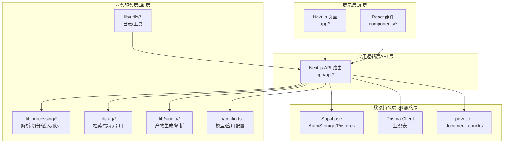
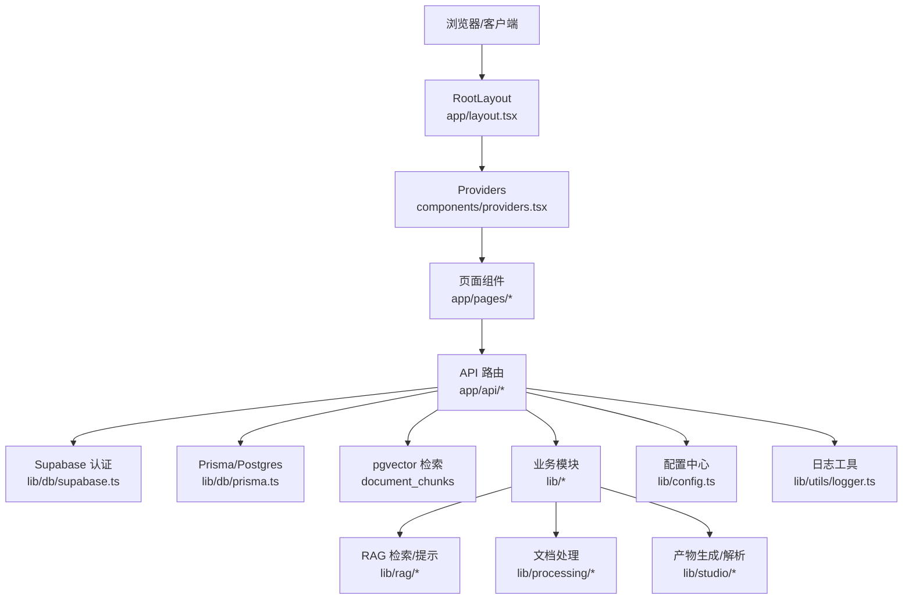
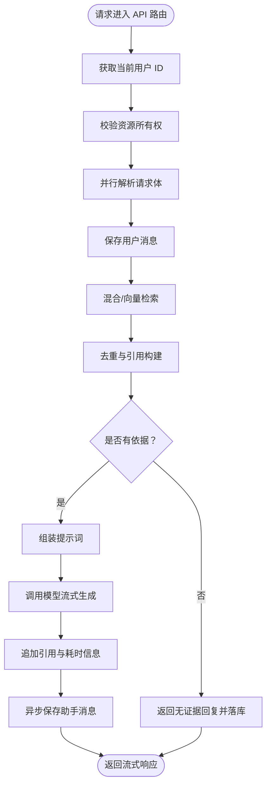
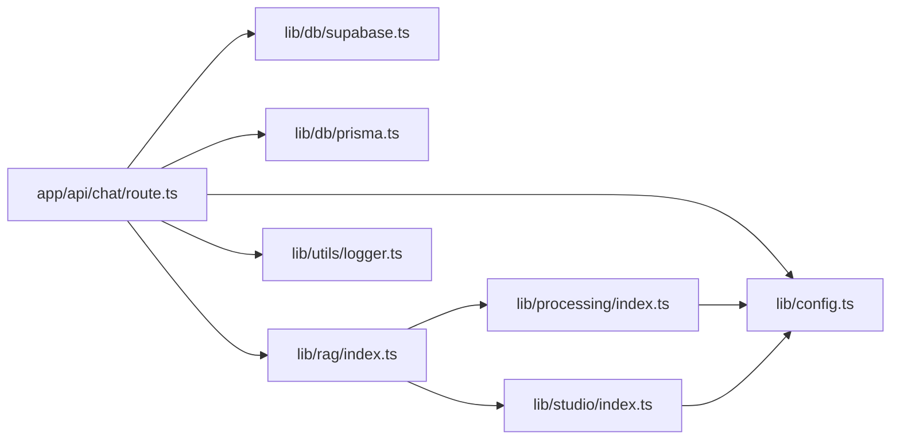

# 整体架构

<cite>
**本文引用的文件**
- [README.md](file://README.md)
- [package.json](file://package.json)
- [next.config.js](file://next.config.js)
- [middleware.ts](file://middleware.ts)
- [app/layout.tsx](file://app/layout.tsx)
- [components/providers.tsx](file://components/providers.tsx)
- [lib/config.ts](file://lib/config.ts)
- [lib/db/prisma.ts](file://lib/db/prisma.ts)
- [lib/db/supabase.ts](file://lib/db/supabase.ts)
- [lib/utils/logger.ts](file://lib/utils/logger.ts)
- [app/api/chat/route.ts](file://app/api/chat/route.ts)
- [lib/rag/index.ts](file://lib/rag/index.ts)
- [lib/studio/index.ts](file://lib/studio/index.ts)
- [lib/processing/index.ts](file://lib/processing/index.ts)
- [types/index.ts](file://types/index.ts)
</cite>

## 目录
1. [简介](#简介)
2. [项目结构](#项目结构)
3. [核心组件](#核心组件)
4. [架构总览](#架构总览)
5. [详细组件分析](#详细组件分析)
6. [依赖关系分析](#依赖关系分析)
7. [性能考虑](#性能考虑)
8. [故障排查指南](#故障排查指南)
9. [结论](#结论)
10. [附录](#附录)

## 简介
本项目是一个类似 NotebookLM 的个人/团队知识库原型，支持将资料导入到 Notebook，经处理与向量化后，在同一 Notebook 内进行基于证据的对话（带引用），并在 Studio 中生成结构化产物（如测验、思维导图等）。系统采用分层架构与模块化组织，结合 Next.js App Router 的路由与 React 组件体系，配合 Supabase 提供的身份认证、存储与数据库能力，以及 pgvector 向量检索与 RAG 流水线，形成从数据导入、处理、检索、对话到产物生成的完整闭环。

## 项目结构
项目采用以功能域为中心的分层与模块化组织方式：
- 展示层（UI 层）：Next.js App Router 页面与组件，负责渲染与交互。
- 应用逻辑层（API 层）：Next.js App Router API 路由，封装业务接口与流式响应。
- 业务服务层（Lib 层）：处理、RAG、Studio、配置与工具模块，提供可复用的业务能力。
- 数据持久层（DB 履约层）：Supabase Auth/Storage/Postgres + Prisma + pgvector。

**图表来源**
- [app/layout.tsx](file://app/layout.tsx#L15-L30)
- [components/providers.tsx](file://components/providers.tsx#L16-L33)
- [app/api/chat/route.ts](file://app/api/chat/route.ts#L25-L323)
- [lib/processing/index.ts](file://lib/processing/index.ts#L1-L51)
- [lib/rag/index.ts](file://lib/rag/index.ts#L1-L24)
- [lib/studio/index.ts](file://lib/studio/index.ts#L1-L25)
- [lib/config.ts](file://lib/config.ts#L1-L187)
- [lib/db/prisma.ts](file://lib/db/prisma.ts#L1-L41)
- [lib/db/supabase.ts](file://lib/db/supabase.ts#L1-L39)

**章节来源**
- [README.md](file://README.md#L42-L49)
- [package.json](file://package.json#L1-L82)
- [next.config.js](file://next.config.js#L1-L21)

## 核心组件
- 路由与中间件：Next.js App Router 页面与 API 路由，配合中间件进行路由保护与会话刷新。
- 全局提供者：Ant Design X 与 ConfigProvider，统一主题与国际化。
- 配置中心：集中管理模型提供商、应用参数与环境校验。
- 数据访问：Prisma 客户端与 Postgres 连接池，Supabase 认证与权限校验。
- 日志工具：统一日志输出与向量操作日志结构化记录。
- 业务模块：处理（解析/切分/嵌入）、RAG（检索/提示/引用）、Studio（产物生成/解析）。

**章节来源**
- [middleware.ts](file://middleware.ts#L15-L71)
- [components/providers.tsx](file://components/providers.tsx#L16-L33)
- [lib/config.ts](file://lib/config.ts#L1-L187)
- [lib/db/prisma.ts](file://lib/db/prisma.ts#L18-L41)
- [lib/db/supabase.ts](file://lib/db/supabase.ts#L12-L33)
- [lib/utils/logger.ts](file://lib/utils/logger.ts#L29-L98)

## 架构总览
系统采用分层架构与模块化组织，职责清晰：
- 展示层：负责页面渲染与用户交互，通过全局提供者注入主题与国际化。
- 应用逻辑层：API 路由作为统一入口，处理鉴权、参数校验、并发优化与流式响应。
- 业务服务层：封装处理、RAG 与 Studio 的核心算法与提示词工程，保证可测试与可替换。
- 数据持久层：Supabase 提供身份与存储，Prisma 管理业务表，pgvector 支持向量检索。

**图表来源**
- [app/layout.tsx](file://app/layout.tsx#L15-L30)
- [components/providers.tsx](file://components/providers.tsx#L16-L33)
- [app/api/chat/route.ts](file://app/api/chat/route.ts#L25-L323)
- [lib/db/supabase.ts](file://lib/db/supabase.ts#L12-L33)
- [lib/db/prisma.ts](file://lib/db/prisma.ts#L18-L41)
- [lib/rag/index.ts](file://lib/rag/index.ts#L1-L24)
- [lib/processing/index.ts](file://lib/processing/index.ts#L1-L51)
- [lib/studio/index.ts](file://lib/studio/index.ts#L1-L25)
- [lib/config.ts](file://lib/config.ts#L1-L187)
- [lib/utils/logger.ts](file://lib/utils/logger.ts#L29-L98)

## 详细组件分析

### 分层架构与职责划分
- 展示层（前端渲染层）
  - Next.js App Router 页面与组件，负责 UI 渲染与交互；全局提供者注入主题与国际化。
  - 路由保护与会话刷新由中间件完成，确保受保护路由仅对已登录用户开放。
- 应用逻辑层（应用逻辑层）
  - API 路由作为统一入口，负责鉴权、参数校验、并发优化（并行获取用户与请求体）、流式响应与错误处理。
  - Chat API 示例展示了检索、去重、构造引用、流式生成与异步落库的完整链路。
- 业务服务层（业务服务层）
  - 处理模块：文本切分、PDF/网页解析、嵌入生成、入库与队列。
  - RAG 模块：向量/混合检索、提示词组装、引用构建与无证据兜底。
  - Studio 模块：产物生成（快/精策略）、模板运行、解析与容错。
- 数据持久层（数据持久层）
  - Supabase：认证、权限校验与存储；提供服务端客户端封装。
  - Prisma：业务表访问与迁移；Postgres 连接池适配。
  - pgvector：向量表与检索函数，支撑 RAG 检索。

**图表来源**
- [app/api/chat/route.ts](file://app/api/chat/route.ts#L25-L323)

**章节来源**
- [middleware.ts](file://middleware.ts#L15-L71)
- [app/layout.tsx](file://app/layout.tsx#L15-L30)
- [components/providers.tsx](file://components/providers.tsx#L16-L33)
- [app/api/chat/route.ts](file://app/api/chat/route.ts#L25-L323)

### Next.js App Router 路由架构
- 页面路由：app/notebooks、app/api 等目录下按功能域划分页面与 API。
- API 路由：app/api 下的 route.ts 文件作为 REST 风格端点，支持流式响应与并发优化。
- 中间件：统一处理受保护路由与认证跳转，维护会话状态。

**章节来源**
- [middleware.ts](file://middleware.ts#L9-L71)
- [README.md](file://README.md#L44-L49)

### React 组件体系与全局状态管理
- 组件组织：components/common、components/ui、components/notebook 等按功能域与复用级别组织。
- 全局提供者：providers.tsx 注入 Ant Design X 与 ConfigProvider，统一主题与国际化。
- 状态管理：项目未显式引入集中式状态库，更多通过 props 传递与组件内部状态管理；部分场景可考虑 Zustand 或 Redux Toolkit 以增强复杂状态管理能力。

**章节来源**
- [components/providers.tsx](file://components/providers.tsx#L16-L33)
- [package.json](file://package.json#L64-L64)

### 技术栈选择与架构决策
- 前端：Next.js 14 App Router + React 18 + TypeScript，提供现代 SSR/SSG 与流式渲染能力。
- UI：Tailwind CSS + shadcn/ui + Radix UI，兼顾一致性与可定制性。
- 认证与存储：Supabase Auth 与 Storage，简化部署与运维。
- 数据库：Postgres + pgvector，支持向量检索与全文检索。
- ORM：Prisma，提供类型安全与迁移管理。
- 模型服务：OpenAI-compatible 接口（智谱、LongCat），支持流式输出与多模型切换。
- 性能：Serverless 环境下使用连接池与并发优化，API 层限制最大持续时间以适配平台限制。

**章节来源**
- [README.md](file://README.md#L26-L41)
- [lib/db/prisma.ts](file://lib/db/prisma.ts#L8-L16)
- [app/api/chat/route.ts](file://app/api/chat/route.ts#L22-L23)

### 系统边界与组件间通信
- 系统边界：前端页面与 API 路由构成对外暴露的边界；内部通过 lib 模块解耦。
- 组件间通信：
  - 页面与 API：通过 fetch 或服务端调用；API 内部通过并行 Promise 降低延迟。
  - API 与 DB：通过 Supabase 与 Prisma；权限校验贯穿所有 API。
  - API 与外部模型：通过配置中心选择提供商与模型，统一流式响应处理。
  - 日志与可观测性：统一日志工具输出，向量操作日志结构化记录。

**章节来源**
- [lib/db/supabase.ts](file://lib/db/supabase.ts#L12-L33)
- [lib/config.ts](file://lib/config.ts#L38-L52)
- [lib/utils/logger.ts](file://lib/utils/logger.ts#L75-L94)

## 依赖关系分析

**图表来源**
- [app/api/chat/route.ts](file://app/api/chat/route.ts#L8-L20)
- [lib/db/supabase.ts](file://lib/db/supabase.ts#L1-L39)
- [lib/db/prisma.ts](file://lib/db/prisma.ts#L1-L41)
- [lib/rag/index.ts](file://lib/rag/index.ts#L1-L24)
- [lib/processing/index.ts](file://lib/processing/index.ts#L1-L51)
- [lib/studio/index.ts](file://lib/studio/index.ts#L1-L25)
- [lib/config.ts](file://lib/config.ts#L1-L187)
- [lib/utils/logger.ts](file://lib/utils/logger.ts#L1-L98)

**章节来源**
- [types/index.ts](file://types/index.ts#L1-L214)

## 性能考虑
- 并发优化：API 路由中对用户 ID 获取与请求体解析采用并行 Promise，减少等待时间。
- 流式响应：模型生成采用流式传输，提升用户体验；同时在流结束后追加引用与耗时信息。
- 连接池：Prisma 使用 Postgres 连接池适配 Serverless 环境，限制每实例连接数以避免资源争用。
- 持续时间限制：API 层设置最大持续时间以适配平台限制，避免超时。
- 图片与远程资源：Next.js 配置允许特定域名与远程图片，便于富文本展示。

**章节来源**
- [app/api/chat/route.ts](file://app/api/chat/route.ts#L29-L96)
- [lib/db/prisma.ts](file://lib/db/prisma.ts#L8-L16)
- [next.config.js](file://next.config.js#L13-L17)

## 故障排查指南
- 权限与会话
  - 受保护路由未登录访问会被重定向至登录页；已登录用户访问登录页会被重定向至笔记本页。
  - API 层通过 Supabase 校验用户身份与资源所有权，无权访问将返回 403。
- 环境变量缺失
  - 应用启动前会校验必需环境变量，缺失时抛出错误提示。
- 日志定位
  - 开发环境下输出详细日志；向量操作提供结构化日志，便于追踪检索/插入耗时与成功率。
- 模型与配置
  - 向量维度必须与数据库一致；模型提供商与默认模型在配置中心集中管理，便于切换与调试。

**章节来源**
- [middleware.ts](file://middleware.ts#L55-L68)
- [lib/db/supabase.ts](file://lib/db/supabase.ts#L22-L33)
- [lib/config.ts](file://lib/config.ts#L169-L186)
- [lib/utils/logger.ts](file://lib/utils/logger.ts#L75-L94)

## 结论
本项目通过清晰的分层架构与模块化组织，实现了从数据导入、处理、检索、对话到产物生成的完整闭环。Next.js App Router 提供了现代化的路由与流式渲染能力，Supabase 与 Prisma 简化了认证、存储与数据库管理，pgvector 与 RAG 模块支撑高质量的问答体验。通过中间件与统一配置中心，系统在安全性、可维护性与可扩展性方面具备良好基础。

## 附录
- 数据模型与类型：types/index.ts 定义了笔记、来源、消息、引用、处理日志等核心类型，支撑前后端一致的数据契约。
- 处理队列与 Cron：Sources 导入后进入处理队列，由 Worker 逐批处理，支持本地手动触发与鉴权保护。

**章节来源**
- [types/index.ts](file://types/index.ts#L1-L214)
- [README.md](file://README.md#L124-L131)