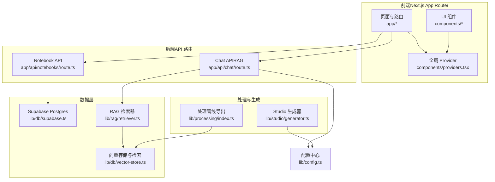
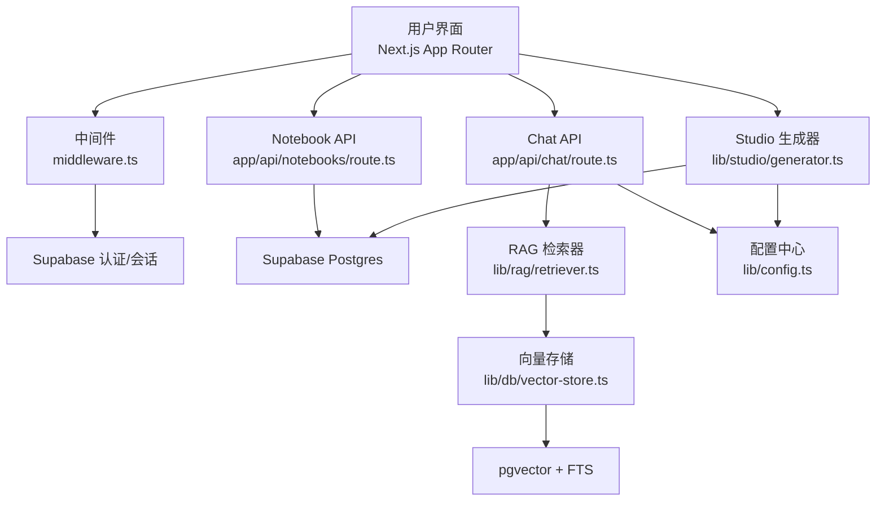
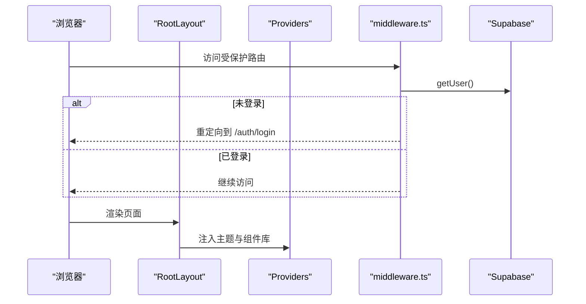
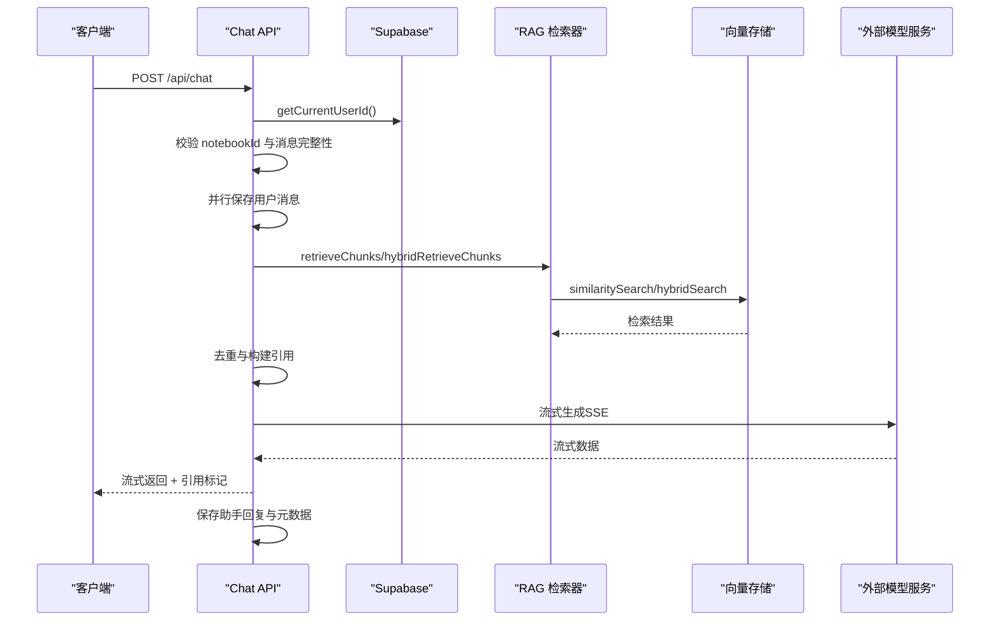
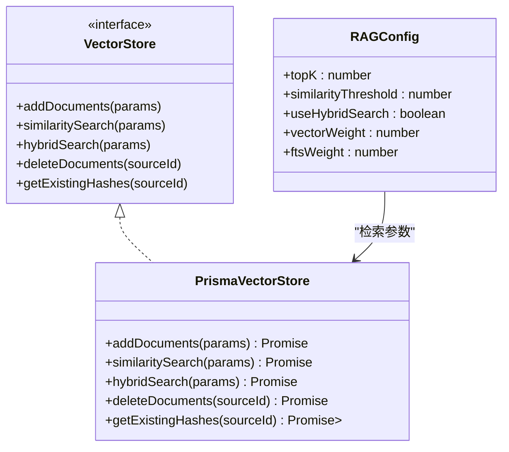
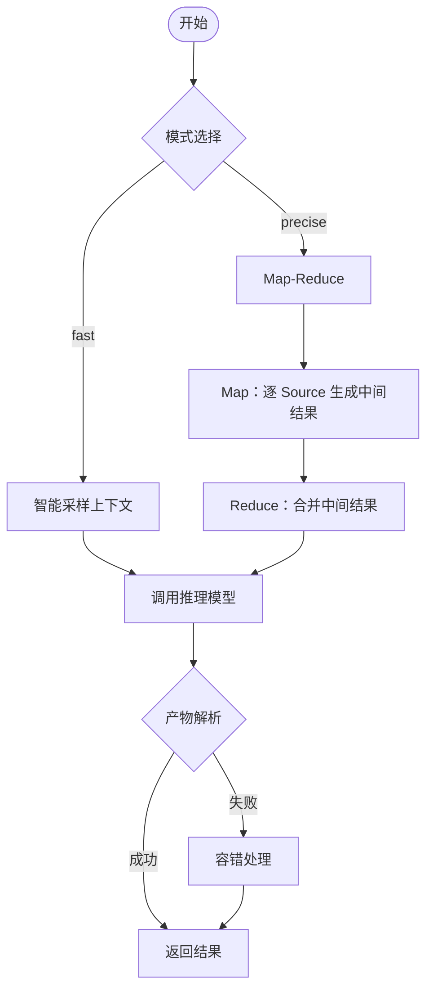
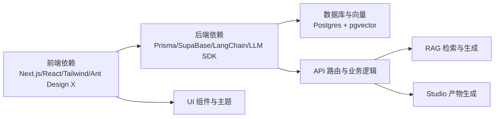

# 架构设计

<cite>
**本文引用的文件**
- [README.md](file://README.md)
- [package.json](file://package.json)
- [next.config.js](file://next.config.js)
- [middleware.ts](file://middleware.ts)
- [lib/config.ts](file://lib/config.ts)
- [app/layout.tsx](file://app/layout.tsx)
- [components/providers.tsx](file://components/providers.tsx)
- [lib/db/supabase.ts](file://lib/db/supabase.ts)
- [lib/db/vector-store.ts](file://lib/db/vector-store.ts)
- [lib/rag/retriever.ts](file://lib/rag/retriever.ts)
- [lib/studio/generator.ts](file://lib/studio/generator.ts)
- [lib/processing/index.ts](file://lib/processing/index.ts)
- [types/index.ts](file://types/index.ts)
- [app/api/notebooks/route.ts](file://app/api/notebooks/route.ts)
- [app/api/chat/route.ts](file://app/api/chat/route.ts)
</cite>

## 目录
1. [简介](#简介)
2. [项目结构](#项目结构)
3. [核心组件](#核心组件)
4. [架构总览](#架构总览)
5. [详细组件分析](#详细组件分析)
6. [依赖分析](#依赖分析)
7. [性能考量](#性能考量)
8. [故障排查指南](#故障排查指南)
9. [结论](#结论)
10. [附录](#附录)

## 简介
本项目是一个类 NotebookLM 的个人/团队知识库原型，提供“导入资料 → 处理与向量化 → 基于证据的对话（带引用）→ Studio 生成结构化产物”的完整闭环。系统采用分层架构与模块化设计，前端基于 Next.js App Router 与 React 组件体系，后端以 API 路由为核心承载业务逻辑，数据层结合 Supabase Postgres 与 pgvector 实现向量检索与全文检索，并通过处理队列与 Cron Worker 支持异步批处理。

技术选型在性能、可扩展性与维护性之间取得平衡：前端使用现代 UI 生态与流式渲染；后端以流式 SSE 输出与并行处理提升响应速度；数据层采用向量 + FTS 混合检索，兼顾召回与准确性；认证与会话管理由 Supabase 提供，确保路由级保护与权限校验。

## 项目结构
项目采用按功能域划分的模块化组织方式：
- app/: 页面与 API 路由，按领域拆分（notebooks、chat、sources、studio、templates、cron 等）
- components/: UI 组件与全局 Provider
- lib/: 核心业务库（AI、数据库、向量存储、处理管线、RAG、Studio 生成器、Supabase 工具、工具函数）
- prisma/: 数据库迁移与模式
- scripts/: 辅助脚本（种子、清理、测试）
- types/: 全局类型定义

图表来源
- [app/layout.tsx](file://app/layout.tsx#L15-L30)
- [components/providers.tsx](file://components/providers.tsx#L16-L33)
- [app/api/notebooks/route.ts](file://app/api/notebooks/route.ts#L12-L66)
- [app/api/chat/route.ts](file://app/api/chat/route.ts#L25-L323)
- [lib/db/supabase.ts](file://lib/db/supabase.ts#L12-L33)
- [lib/db/vector-store.ts](file://lib/db/vector-store.ts#L77-L445)
- [lib/rag/retriever.ts](file://lib/rag/retriever.ts#L53-L206)
- [lib/processing/index.ts](file://lib/processing/index.ts#L1-L51)
- [lib/studio/generator.ts](file://lib/studio/generator.ts#L242-L262)
- [lib/config.ts](file://lib/config.ts#L1-L187)

章节来源
- [README.md](file://README.md#L42-L49)
- [package.json](file://package.json#L1-L82)

## 核心组件
- 前端层
  - 布局与主题：RootLayout 提供字体与全局样式，Providers 注入 Ant Design X 与 ConfigProvider，统一中文化与主题。
  - 路由与保护：middleware 实现登录态校验与受保护路由跳转，确保未登录用户无法访问 notebooks 等页面。
- 后端层
  - Notebook API：创建与列出笔记本，基于 Supabase 当前用户 ID 进行所有权校验。
  - Chat API：RAG 对话，支持向量/混合检索、流式输出、引用标注与检索详情。
- 数据层
  - Supabase：提供认证、会话与数据库访问；所有权校验通过 getCurrentUserId 与 verifyOwnership 实施。
  - 向量存储：PrismaVectorStore 封装批量插入、相似度检索与混合检索，SQL 层使用 pgvector 与全文检索。
- 处理与生成
  - 处理管线：文本切分、PDF/网页解析、Embedding 生成与入库、队列与 Cron Worker。
  - Studio 生成器：fast/precise 两种策略，智能采样与 Map-Reduce，支持模板与变量注入。

章节来源
- [app/layout.tsx](file://app/layout.tsx#L15-L30)
- [components/providers.tsx](file://components/providers.tsx#L16-L33)
- [middleware.ts](file://middleware.ts#L15-L71)
- [app/api/notebooks/route.ts](file://app/api/notebooks/route.ts#L12-L66)
- [app/api/chat/route.ts](file://app/api/chat/route.ts#L25-L323)
- [lib/db/supabase.ts](file://lib/db/supabase.ts#L12-L33)
- [lib/db/vector-store.ts](file://lib/db/vector-store.ts#L77-L445)
- [lib/rag/retriever.ts](file://lib/rag/retriever.ts#L53-L206)
- [lib/processing/index.ts](file://lib/processing/index.ts#L1-L51)
- [lib/studio/generator.ts](file://lib/studio/generator.ts#L242-L262)

## 架构总览
系统采用分层架构与模块化设计，前后端通过 API 路由交互，数据层通过 Supabase 与 pgvector 提供持久化与检索能力。认证与会话管理由 Supabase 提供，路由中间件负责访问控制。

图表来源
- [middleware.ts](file://middleware.ts#L15-L71)
- [app/api/notebooks/route.ts](file://app/api/notebooks/route.ts#L12-L66)
- [app/api/chat/route.ts](file://app/api/chat/route.ts#L25-L323)
- [lib/rag/retriever.ts](file://lib/rag/retriever.ts#L53-L206)
- [lib/db/vector-store.ts](file://lib/db/vector-store.ts#L77-L445)
- [lib/config.ts](file://lib/config.ts#L1-L187)
- [lib/studio/generator.ts](file://lib/studio/generator.ts#L242-L262)

## 详细组件分析

### 前端架构（Next.js App Router 与 React 组件体系）
- 布局与主题
  - RootLayout 设置字体与全局样式，Providers 注入 Ant Design X 与 ConfigProvider，统一中文化与主题风格，适配 shadcn/ui 的视觉体系。
- 路由与保护
  - middleware 对受保护路由（如 notebooks）进行登录态校验，未登录用户重定向至登录页；已登录用户访问登录页则重定向至 notebooks。
- 图片与远程资源
  - next.config.js 配置允许加载 Supabase 域名下的图片资源，支持富文本与媒体展示。

图表来源
- [middleware.ts](file://middleware.ts#L15-L71)
- [app/layout.tsx](file://app/layout.tsx#L15-L30)
- [components/providers.tsx](file://components/providers.tsx#L16-L33)

章节来源
- [app/layout.tsx](file://app/layout.tsx#L15-L30)
- [components/providers.tsx](file://components/providers.tsx#L16-L33)
- [middleware.ts](file://middleware.ts#L15-L71)
- [next.config.js](file://next.config.js#L4-L17)

### 后端架构（API 路由与业务逻辑）
- Notebook API
  - POST /api/notebooks：创建笔记本，基于 Supabase 当前用户 ID 作为所有者，失败时返回 401/400/500。
  - GET /api/notebooks：按最后打开时间倒序列出当前用户的笔记本，并统计子项数量。
- Chat API（RAG 对话）
  - 并行获取用户 ID 与请求体，校验用户身份与笔记本所有权。
  - 保存用户消息后并行执行检索（向量/混合），去重并构建引用。
  - 组装提示词后调用外部模型服务，流式返回内容，结束时附加引用标记与检索详情。
  - 保存助手回复与元数据（检索耗时、生成耗时、模型、TopK 等）。

图表来源
- [app/api/chat/route.ts](file://app/api/chat/route.ts#L25-L323)
- [lib/rag/retriever.ts](file://lib/rag/retriever.ts#L53-L206)
- [lib/db/vector-store.ts](file://lib/db/vector-store.ts#L175-L442)

章节来源
- [app/api/notebooks/route.ts](file://app/api/notebooks/route.ts#L12-L66)
- [app/api/chat/route.ts](file://app/api/chat/route.ts#L25-L323)

### 数据层架构（数据库与向量存储）
- Supabase
  - 提供认证、会话与数据库访问；所有权校验通过 getCurrentUserId 与 verifyOwnership 实施。
- 向量存储与检索
  - PrismaVectorStore 封装：
    - 批量插入：按固定批次大小分批写入，避免单次事务过大；插入前进行维度校验。
    - 相似度检索：使用向量内积距离，支持按 sourceIds 过滤与阈值筛选。
    - 混合检索：向量相似度与全文检索（FTS）加权融合，支持自定义权重。
  - SQL 层使用 pgvector 与全文检索索引，配合 CTE 降低重复计算成本。
- 类型与元数据
  - types/index.ts 定义了引用、处理日志、消息元数据、Chunk 等结构，确保前后端契约一致。

图表来源
- [lib/db/vector-store.ts](file://lib/db/vector-store.ts#L24-L75)
- [lib/db/vector-store.ts](file://lib/db/vector-store.ts#L77-L445)
- [lib/rag/retriever.ts](file://lib/rag/retriever.ts#L6-L13)

章节来源
- [lib/db/supabase.ts](file://lib/db/supabase.ts#L12-L33)
- [lib/db/vector-store.ts](file://lib/db/vector-store.ts#L77-L445)
- [lib/rag/retriever.ts](file://lib/rag/retriever.ts#L53-L206)
- [types/index.ts](file://types/index.ts#L22-L128)

### 处理与生成（处理管线与 Studio 生成器）
- 处理管线导出
  - 暴露文本切分、PDF/网页解析、Embedding 生成、主处理流程等接口，便于在 API 或 Cron Worker 中调用。
- Studio 生成器
  - fast 策略：智能采样上下文，调用推理模型生成产物，支持测验与思维导图解析。
  - precise 策略：Map-Reduce，对每个 Source 生成中间结果再聚合，提升准确性。
  - 模板与变量：支持模板注入上下文与变量，统一生成入口。

图表来源
- [lib/studio/generator.ts](file://lib/studio/generator.ts#L120-L237)
- [lib/studio/generator.ts](file://lib/studio/generator.ts#L242-L262)
- [lib/studio/generator.ts](file://lib/studio/generator.ts#L267-L310)

章节来源
- [lib/processing/index.ts](file://lib/processing/index.ts#L1-L51)
- [lib/studio/generator.ts](file://lib/studio/generator.ts#L242-L262)

## 依赖分析
- 前端依赖
  - Next.js 14、React 18、Tailwind CSS、shadcn/ui、Radix UI、Ant Design X 等，提供现代化 UI 与组件生态。
- 后端依赖
  - @prisma/client、pg、@supabase/supabase-js、@ai-sdk/openai-compatible、langchain 等，支撑数据库访问、认证、向量检索与 LLM 调用。
- 配置与运行
  - next.config.js 支持大文件上传与图片域名白名单；middleware.ts 实现路由保护；lib/config.ts 提供模型与应用配置、环境变量校验与维度一致性检查。

图表来源
- [package.json](file://package.json#L17-L64)
- [next.config.js](file://next.config.js#L1-L21)
- [lib/config.ts](file://lib/config.ts#L1-L187)

章节来源
- [package.json](file://package.json#L17-L64)
- [next.config.js](file://next.config.js#L1-L21)
- [lib/config.ts](file://lib/config.ts#L1-L187)

## 性能考量
- 并行处理
  - Chat API 中并行保存用户消息与检索，减少端到端延迟。
  - Notebook API 中并行解析请求体，提升健壮性。
- 批量写入与索引
  - 向量存储按固定批次写入，避免单次事务过大；SQL 层使用 CTE 与索引（向量/HNSW、FTS）降低重复计算与查询成本。
- 流式输出
  - Chat API 使用 TransformStream 与 SSE，边生成边输出，改善用户体验。
- 模型与超时
  - Studio 生成器为推理模型设置合理超时，避免长时间占用资源。
- 图片与资源
  - next.config.js 配置图片域名与远程模式，减少不必要的网络请求。

章节来源
- [app/api/chat/route.ts](file://app/api/chat/route.ts#L70-L96)
- [app/api/notebooks/route.ts](file://app/api/notebooks/route.ts#L19-L22)
- [lib/db/vector-store.ts](file://lib/db/vector-store.ts#L105-L140)
- [lib/db/vector-store.ts](file://lib/db/vector-store.ts#L204-L296)
- [lib/studio/generator.ts](file://lib/studio/generator.ts#L23-L26)

## 故障排查指南
- 认证与会话
  - 若出现“未登录”或“无权访问”，检查 Supabase 会话状态与路由保护规则；确认 middleware 是否正确读取 Cookie 并重定向。
- 环境变量与模型配置
  - lib/config.ts 在启动时校验必需环境变量与向量维度一致性；若报错，根据提示修正 .env.local。
- Chat API 错误
  - 检查模型服务返回状态与错误信息；确认流式传输是否正常结束并附加引用标记。
- 向量维度不匹配
  - 向量存储在插入与查询前均进行维度校验；若不一致，需重建向量表或调整配置。
- Studio 生成失败
  - fast 模式下解析失败可降级；precise 模式下 Map 步骤失败会继续处理其他 Source，最终聚合结果。

章节来源
- [middleware.ts](file://middleware.ts#L15-L71)
- [lib/config.ts](file://lib/config.ts#L9-L29)
- [lib/config.ts](file://lib/config.ts#L169-L186)
- [app/api/chat/route.ts](file://app/api/chat/route.ts#L316-L322)
- [lib/db/vector-store.ts](file://lib/db/vector-store.ts#L92-L99)
- [lib/db/vector-store.ts](file://lib/db/vector-store.ts#L198-L202)
- [lib/studio/generator.ts](file://lib/studio/generator.ts#L140-L154)
- [lib/studio/generator.ts](file://lib/studio/generator.ts#L190-L199)

## 结论
本项目通过清晰的分层架构与模块化设计，实现了从知识导入到对话检索再到产物生成的完整链路。前端以 Next.js App Router 与现代 UI 生态为基础，后端以 API 路由承载业务逻辑，数据层结合 Supabase 与 pgvector 提供高性能检索能力。认证与会话管理由 Supabase 提供，路由中间件保障访问安全。整体设计在性能、可扩展性与维护性之间取得良好平衡，适合快速迭代与规模化部署。

## 附录
- 系统边界与跨域
  - 前端与后端通过同源 API 通信；图片资源允许来自 Supabase 域名；未发现跨域配置需求。
- 安全架构
  - 路由保护与会话管理由 Supabase 提供；Chat API 与 Notebook API 均进行用户身份与资源所有权校验；Cron Worker 通过鉴权密钥访问。
- 基础设施与部署
  - 依赖 Supabase（Postgres + Storage + Auth）与外部模型服务；Next.js 14 与 Node.js 20；建议在云平台（如 Vercel）部署。
- 监控与可观测性
  - 建议在生产环境接入日志与指标采集（如数据库慢查询、流式传输耗时、模型调用成功率与延迟），结合现有日志记录点完善监控体系。

章节来源
- [next.config.js](file://next.config.js#L4-L17)
- [middleware.ts](file://middleware.ts#L15-L71)
- [app/api/chat/route.ts](file://app/api/chat/route.ts#L22-L24)
- [README.md](file://README.md#L51-L122)