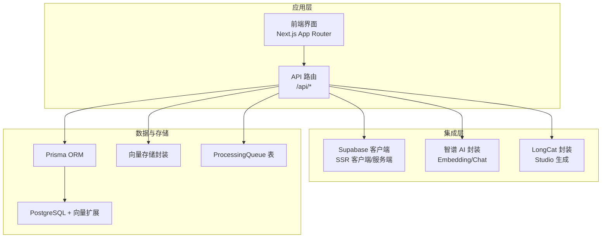
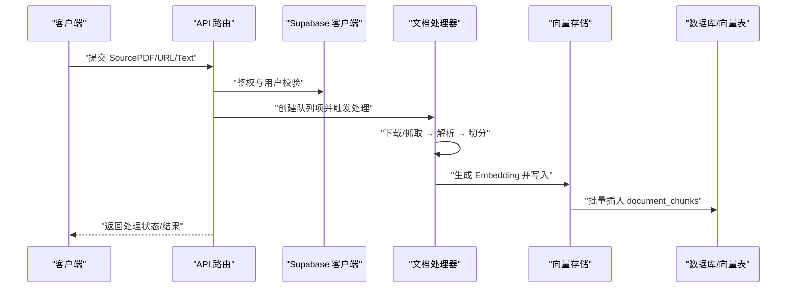
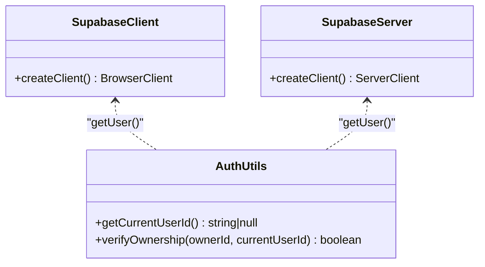
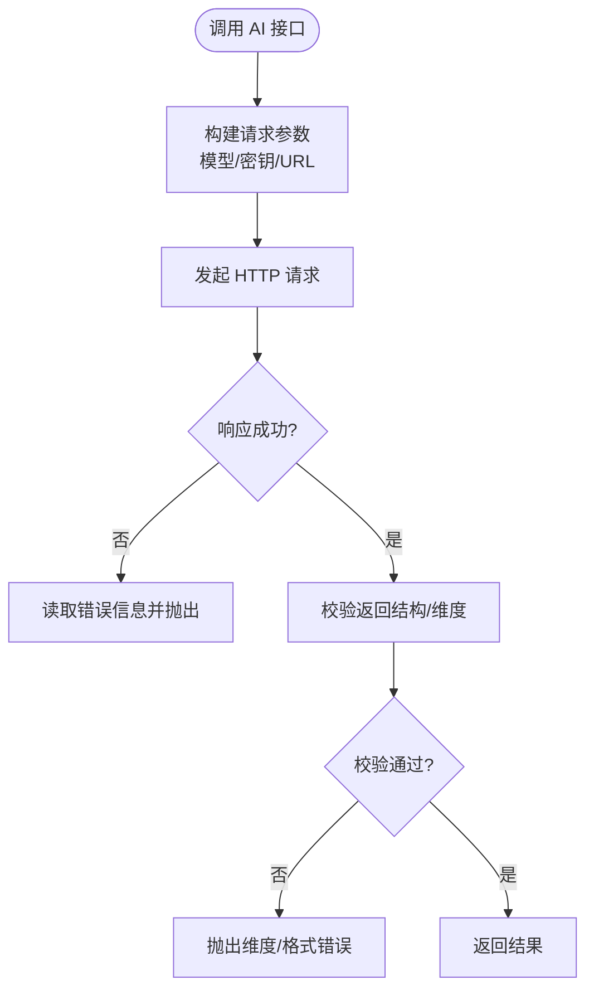
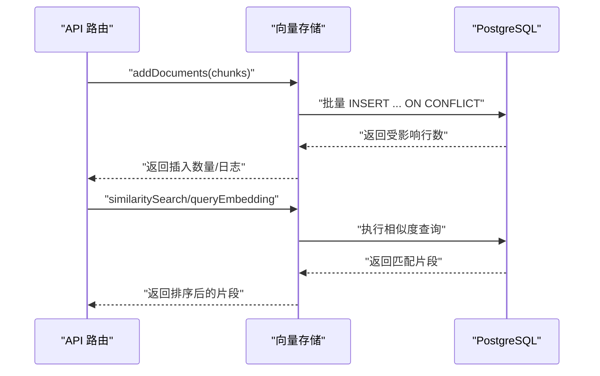
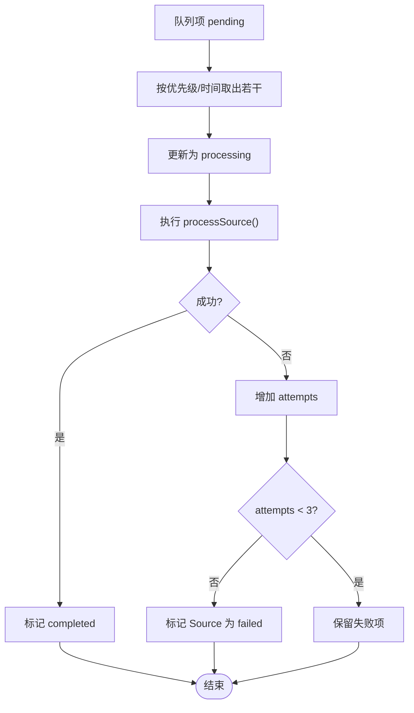
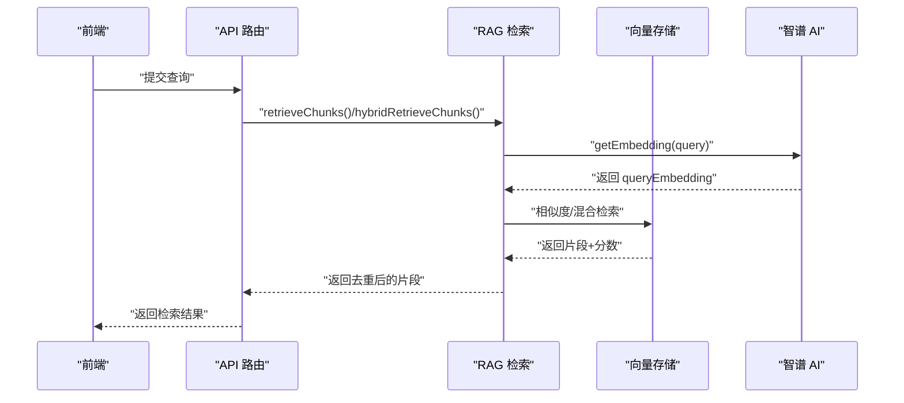
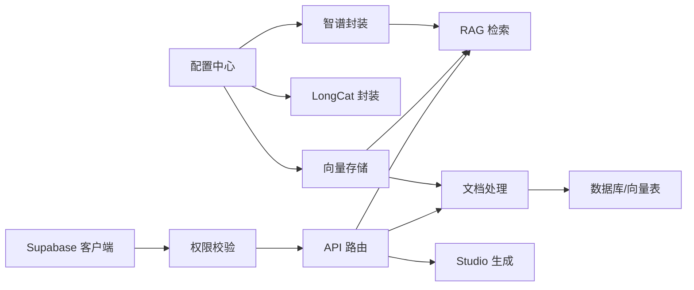

# 集成模式

<cite>
**本文引用的文件**
- [lib/config.ts](file://lib/config.ts)
- [lib/supabase/client.ts](file://lib/supabase/client.ts)
- [lib/supabase/server.ts](file://lib/supabase/server.ts)
- [lib/db/supabase.ts](file://lib/db/supabase.ts)
- [lib/ai/zhipu.ts](file://lib/ai/zhipu.ts)
- [lib/db/vector-store.ts](file://lib/db/vector-store.ts)
- [lib/processing/processor.ts](file://lib/processing/processor.ts)
- [app/api/cron/process-queue/route.ts](file://app/api/cron/process-queue/route.ts)
- [lib/rag/retriever.ts](file://lib/rag/retriever.ts)
- [lib/studio/generator.ts](file://lib/studio/generator.ts)
- [lib/utils/logger.ts](file://lib/utils/logger.ts)
</cite>

## 目录
1. [引言](#引言)
2. [项目结构](#项目结构)
3. [核心组件](#核心组件)
4. [架构总览](#架构总览)
5. [详细组件分析](#详细组件分析)
6. [依赖关系分析](#依赖关系分析)
7. [性能考量](#性能考量)
8. [故障排查指南](#故障排查指南)
9. [结论](#结论)
10. [附录](#附录)

## 引言
本文件面向 notebookLM-clone 项目的集成模式设计，聚焦系统与外部服务的集成架构，包括：
- Supabase 认证与存储服务的客户端与服务端适配
- AI 模型提供商（智谱 AI、LongCat）的统一适配与封装
- 异步任务处理（队列、定时任务、事件驱动与回调）
- 文件存储与对象存储、CDN/分发策略
- 监控与日志、性能指标与告警
- 安全集成（密钥管理、传输加密、访问令牌）
- 版本兼容、降级与故障转移

## 项目结构
项目采用按功能域划分的组织方式，核心集成点集中在以下模块：
- 配置与环境变量：统一管理 Supabase、AI 提供商、应用参数
- Supabase 客户端：浏览器端与服务端两套客户端，分别适配不同运行时
- 向量存储：基于 Prisma 的 PostgreSQL + 向量扩展实现
- 文档处理流水线：下载/抓取 → 解析 → 切分 → 向量化 → 写库
- RAG 检索：向量检索与混合检索
- Studio 生成：快速/精准模式，Map-Reduce 策略
- 异步队列：基于数据库的任务队列与定时 Cron

图表来源
- [lib/supabase/client.ts](file://lib/supabase/client.ts#L1-L14)
- [lib/supabase/server.ts](file://lib/supabase/server.ts#L1-L33)
- [lib/ai/zhipu.ts](file://lib/ai/zhipu.ts#L1-L196)
- [lib/db/vector-store.ts](file://lib/db/vector-store.ts#L1-L446)
- [lib/processing/processor.ts](file://lib/processing/processor.ts#L1-L560)
- [app/api/cron/process-queue/route.ts](file://app/api/cron/process-queue/route.ts#L1-L165)

章节来源
- [lib/config.ts](file://lib/config.ts#L1-L187)
- [lib/supabase/client.ts](file://lib/supabase/client.ts#L1-L14)
- [lib/supabase/server.ts](file://lib/supabase/server.ts#L1-L33)
- [lib/db/vector-store.ts](file://lib/db/vector-store.ts#L1-L446)

## 核心组件
- 配置中心：集中管理 Supabase、AI 提供商、应用参数与环境校验
- Supabase 客户端：浏览器端与服务端两套，分别处理 SSR 与 Cookie 生命周期
- AI 适配层：统一 Embedding/Chat 调用，内置重试与维度校验
- 向量存储：批量写入、相似度检索、混合检索、日志埋点
- 文档处理流水线：PDF/URL/Text 三类 Source 的统一处理与状态机
- 异步队列：数据库驱动的任务队列与定时 Cron
- RAG 检索：Embedding + 向量/混合检索
- Studio 生成：快速/精准模式，Map-Reduce 策略与超时控制

章节来源
- [lib/config.ts](file://lib/config.ts#L1-L187)
- [lib/ai/zhipu.ts](file://lib/ai/zhipu.ts#L1-L196)
- [lib/db/vector-store.ts](file://lib/db/vector-store.ts#L1-L446)
- [lib/processing/processor.ts](file://lib/processing/processor.ts#L1-L560)
- [lib/rag/retriever.ts](file://lib/rag/retriever.ts#L1-L206)
- [lib/studio/generator.ts](file://lib/studio/generator.ts#L1-L311)
- [app/api/cron/process-queue/route.ts](file://app/api/cron/process-queue/route.ts#L1-L165)

## 架构总览
系统通过 API 路由协调 Supabase、AI 提供商与数据库/向量存储；文档处理采用异步队列与定时任务保障可靠性；RAG 检索与 Studio 生成作为上层能力复用底层嵌入与检索能力。

图表来源
- [lib/supabase/server.ts](file://lib/supabase/server.ts#L1-L33)
- [lib/processing/processor.ts](file://lib/processing/processor.ts#L1-L560)
- [lib/db/vector-store.ts](file://lib/db/vector-store.ts#L1-L446)
- [app/api/cron/process-queue/route.ts](file://app/api/cron/process-queue/route.ts#L1-L165)

## 详细组件分析

### Supabase 集成模式
- 浏览器端客户端：通过 SSR 客户端工厂创建，读取公共环境变量
- 服务端客户端：注入 Cookie Store，支持 SSR/Server Action/Route Handler
- 权限校验：统一获取当前用户并校验资源归属，所有 API 路由均依赖该校验

图表来源
- [lib/supabase/client.ts](file://lib/supabase/client.ts#L1-L14)
- [lib/supabase/server.ts](file://lib/supabase/server.ts#L1-L33)
- [lib/db/supabase.ts](file://lib/db/supabase.ts#L1-L39)

章节来源
- [lib/supabase/client.ts](file://lib/supabase/client.ts#L1-L14)
- [lib/supabase/server.ts](file://lib/supabase/server.ts#L1-L33)
- [lib/db/supabase.ts](file://lib/db/supabase.ts#L1-L39)

### AI 模型提供商适配与封装
- 统一配置：支持智谱 AI 与 LongCat，动态选择模型与基础地址
- Embedding：固定维度校验与批量限制，失败即抛错
- Chat：同步与流式两种调用，统一错误处理
- 重试策略：指数退避重试，针对 429/5xx 场景

图表来源
- [lib/ai/zhipu.ts](file://lib/ai/zhipu.ts#L1-L196)
- [lib/config.ts](file://lib/config.ts#L1-L187)

章节来源
- [lib/ai/zhipu.ts](file://lib/ai/zhipu.ts#L1-L196)
- [lib/config.ts](file://lib/config.ts#L1-L187)

### 向量存储与检索
- 批量写入：分批插入，ON CONFLICT 跳过重复，记录向量操作日志
- 相似度检索：CTE 避免重复计算，支持按 Source 过滤
- 混合检索：向量相似度与全文检索（FTS）加权融合
- 日志埋点：统一结构化日志，区分成功/失败与元数据

图表来源
- [lib/db/vector-store.ts](file://lib/db/vector-store.ts#L1-L446)
- [lib/utils/logger.ts](file://lib/utils/logger.ts#L1-L98)

章节来源
- [lib/db/vector-store.ts](file://lib/db/vector-store.ts#L1-L446)
- [lib/utils/logger.ts](file://lib/utils/logger.ts#L1-L98)

### 文档处理流水线与异步队列
- 处理类型：PDF、URL、Text，统一状态机与日志
- 队列驱动：ProcessingQueue 表记录任务，Cron 每次只处理少量以避免超时
- 自修复：扫描“挂起”Source 并补入队列
- 失败重试：最多 3 次，超过阈值更新 Source 状态为失败

图表来源
- [app/api/cron/process-queue/route.ts](file://app/api/cron/process-queue/route.ts#L1-L165)
- [lib/processing/processor.ts](file://lib/processing/processor.ts#L1-L560)

章节来源
- [app/api/cron/process-queue/route.ts](file://app/api/cron/process-queue/route.ts#L1-L165)
- [lib/processing/processor.ts](file://lib/processing/processor.ts#L1-L560)

### RAG 检索与 Studio 生成
- RAG：先生成查询 Embedding，再进行向量/混合检索，去重并补充 Source 信息
- Studio：快速模式智能采样，精准模式 Map-Reduce；统一超时控制与解析兜底

图表来源
- [lib/rag/retriever.ts](file://lib/rag/retriever.ts#L1-L206)
- [lib/db/vector-store.ts](file://lib/db/vector-store.ts#L1-L446)
- [lib/ai/zhipu.ts](file://lib/ai/zhipu.ts#L1-L196)

章节来源
- [lib/rag/retriever.ts](file://lib/rag/retriever.ts#L1-L206)
- [lib/studio/generator.ts](file://lib/studio/generator.ts#L1-L311)

## 依赖关系分析
- 配置层：被 AI 封装、向量存储、RAG 检索、Studio 生成广泛依赖
- Supabase：被认证与权限校验模块依赖，贯穿 API 路由
- 数据层：向量存储依赖 Prisma/PostgreSQL，处理流程依赖队列表与 Source 表
- 外部服务：智谱 AI、LongCat、对象存储（通过 Supabase Admin）

图表来源
- [lib/config.ts](file://lib/config.ts#L1-L187)
- [lib/ai/zhipu.ts](file://lib/ai/zhipu.ts#L1-L196)
- [lib/db/vector-store.ts](file://lib/db/vector-store.ts#L1-L446)
- [lib/rag/retriever.ts](file://lib/rag/retriever.ts#L1-L206)
- [lib/studio/generator.ts](file://lib/studio/generator.ts#L1-L311)
- [lib/supabase/server.ts](file://lib/supabase/server.ts#L1-L33)
- [lib/db/supabase.ts](file://lib/db/supabase.ts#L1-L39)

章节来源
- [lib/config.ts](file://lib/config.ts#L1-L187)
- [lib/supabase/server.ts](file://lib/supabase/server.ts#L1-L33)
- [lib/db/supabase.ts](file://lib/db/supabase.ts#L1-L39)
- [lib/db/vector-store.ts](file://lib/db/vector-store.ts#L1-L446)

## 性能考量
- 向量维度一致性：启动时严格校验，避免运行期异常与性能回退
- 批量写入：分批插入，减少事务开销与内存占用
- 查询优化：CTE 避免重复计算，合理使用索引与阈值过滤
- 检索权重：向量与 FTS 权重可调，平衡召回与精度
- 重试与超时：AI 调用指数退避，Studio 生成超时控制，避免长尾阻塞
- Cron 批量：限制每次处理数量，结合自修复机制降低堆积

章节来源
- [lib/config.ts](file://lib/config.ts#L1-L187)
- [lib/db/vector-store.ts](file://lib/db/vector-store.ts#L1-L446)
- [lib/rag/retriever.ts](file://lib/rag/retriever.ts#L1-L206)
- [lib/studio/generator.ts](file://lib/studio/generator.ts#L1-L311)
- [app/api/cron/process-queue/route.ts](file://app/api/cron/process-queue/route.ts#L1-L165)

## 故障排查指南
- 环境变量缺失：启动前集中校验，定位缺失项并提示修复
- 向量维度不一致：运行期与启动期双重校验，确保与数据库 schema 一致
- AI 调用失败：检查 429/5xx 场景下的重试是否生效，确认密钥与模型配置
- 队列堆积：检查 Cron 是否正常、重试次数上限、挂起 Source 的自修复
- 日志定位：使用统一日志结构，区分向量操作成功/失败与关键元数据

章节来源
- [lib/config.ts](file://lib/config.ts#L1-L187)
- [lib/utils/logger.ts](file://lib/utils/logger.ts#L1-L98)
- [app/api/cron/process-queue/route.ts](file://app/api/cron/process-queue/route.ts#L1-L165)

## 结论
本项目通过“配置中心 + 客户端适配 + 统一封装 + 数据库驱动队列”的集成模式，实现了与 Supabase、智谱 AI、LongCat 的稳定对接，并在向量检索、RAG 与 Studio 生成等场景中体现了可维护性与可扩展性。建议持续完善监控与告警体系，加强对象存储与 CDN 的可观测性，进一步提升生产稳定性。

## 附录

### 安全集成要点
- API 密钥管理：通过环境变量集中管理，避免硬编码
- 传输加密：统一走 HTTPS，确保 AI 与 Supabase 通信安全
- 访问令牌：服务端客户端注入 Cookie，避免泄露
- 授权校验：所有受保护 API 调用前执行用户校验与资源归属校验

章节来源
- [lib/config.ts](file://lib/config.ts#L1-L187)
- [lib/supabase/server.ts](file://lib/supabase/server.ts#L1-L33)
- [lib/db/supabase.ts](file://lib/db/supabase.ts#L1-L39)

### 版本兼容与降级策略
- 向量维度：强制 1024 维（与 embedding-3 一致），不兼容时拒绝启动
- 模型切换：通过配置中心动态切换提供商与模型，保持接口一致
- 降级与故障转移：AI 调用失败时重试，Cron 失败时记录并等待下次调度

章节来源
- [lib/config.ts](file://lib/config.ts#L1-L187)
- [lib/ai/zhipu.ts](file://lib/ai/zhipu.ts#L1-L196)
- [app/api/cron/process-queue/route.ts](file://app/api/cron/process-queue/route.ts#L1-L165)