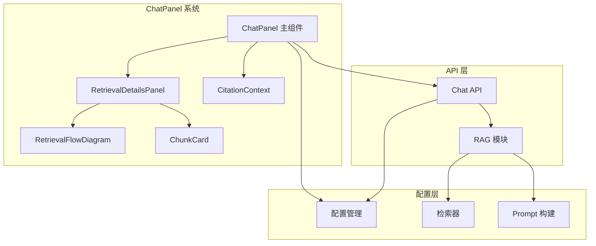
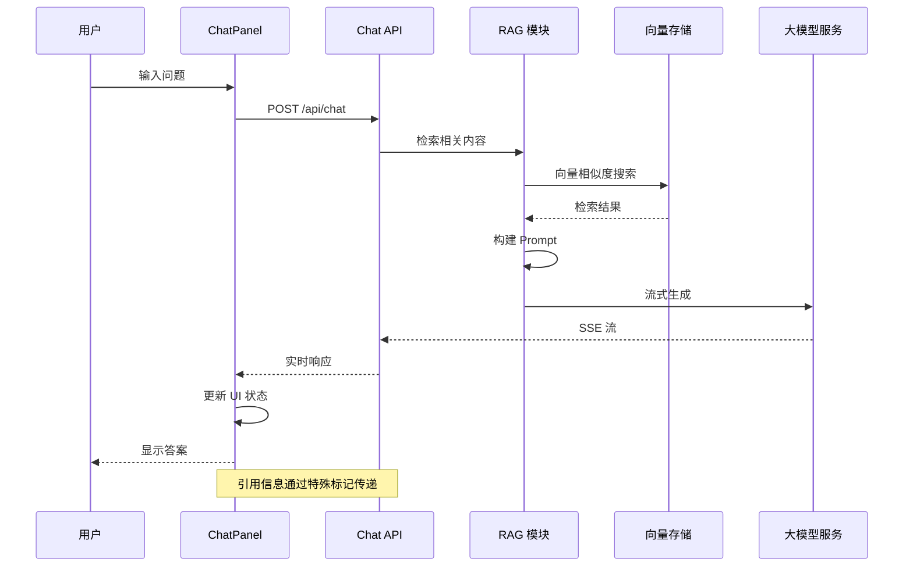
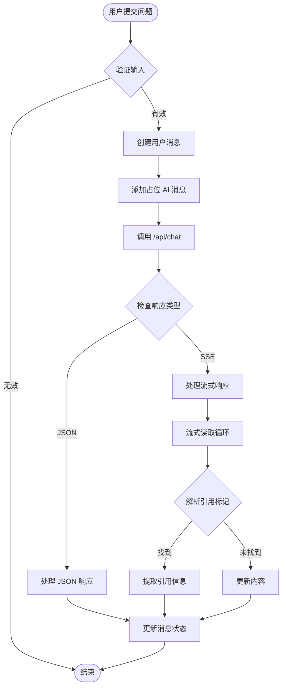
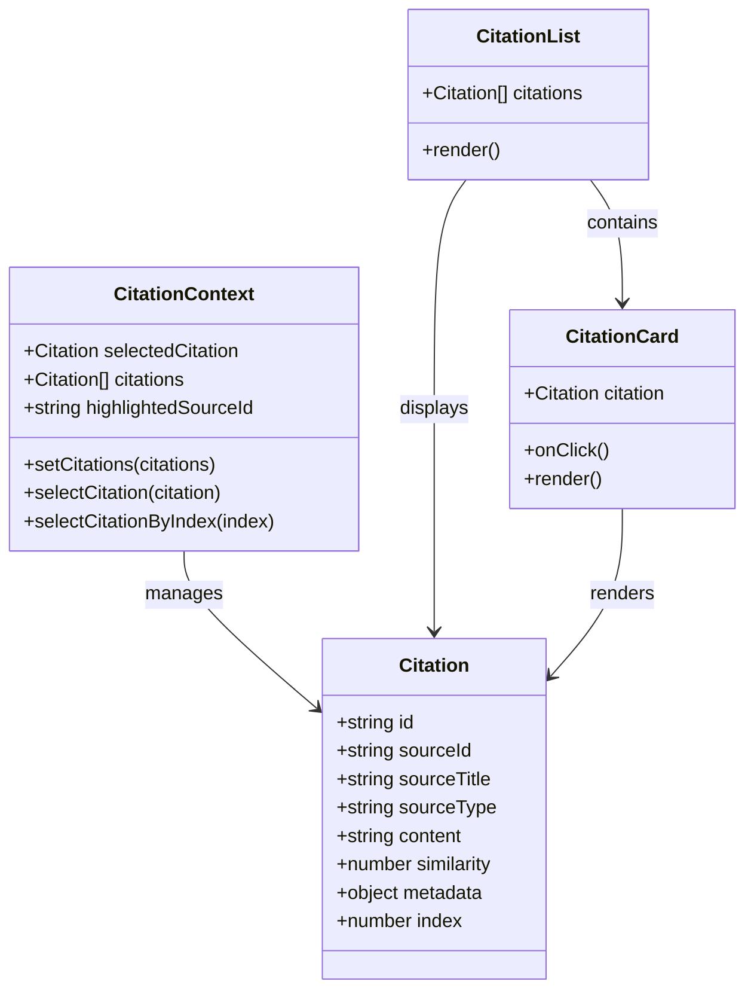
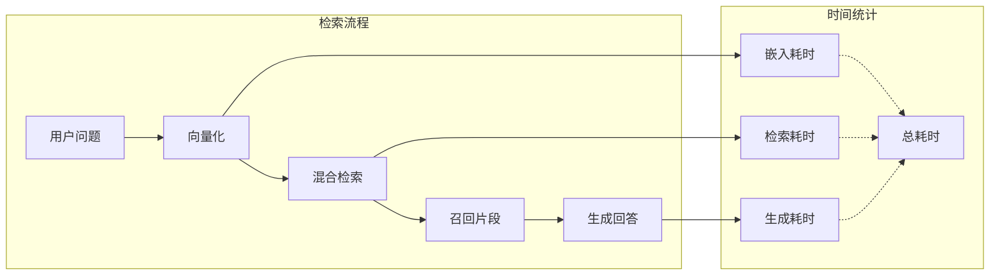
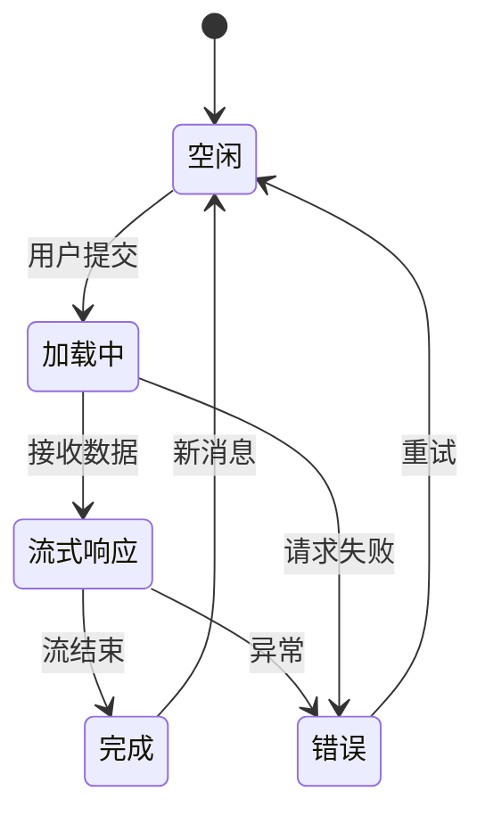
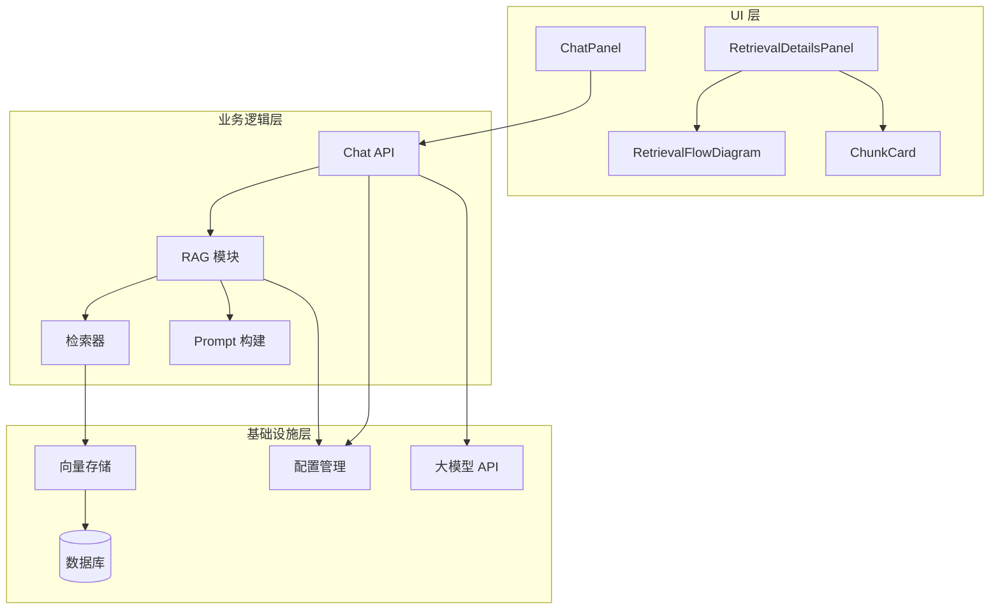
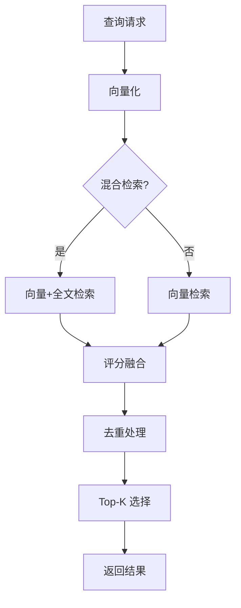

# ChatPanel 问答面板

<cite>
**本文档引用的文件**
- [components/notebook/chat-panel.tsx](file://components/notebook/chat-panel.tsx)
- [components/notebook/retrieval-details-panel.tsx](file://components/notebook/retrieval-details-panel.tsx)
- [components/notebook/retrieval-flow-diagram.tsx](file://components/notebook/retrieval-flow-diagram.tsx)
- [components/notebook/citation-context.tsx](file://components/notebook/citation-context.tsx)
- [components/notebook/chunk-card.tsx](file://components/notebook/chunk-card.tsx)
- [app/api/chat/route.ts](file://app/api/chat/route.ts)
- [lib/config.ts](file://lib/config.ts)
- [lib/rag/index.ts](file://lib/rag/index.ts)
- [lib/rag/retriever.ts](file://lib/rag/retriever.ts)
- [lib/rag/prompt.ts](file://lib/rag/prompt.ts)
- [components/providers.tsx](file://components/providers.tsx)
</cite>

## 目录
1. [简介](#简介)
2. [项目结构](#项目结构)
3. [核心组件](#核心组件)
4. [架构概览](#架构概览)
5. [详细组件分析](#详细组件分析)
6. [依赖关系分析](#依赖关系分析)
7. [性能考虑](#性能考虑)
8. [故障排除指南](#故障排除指南)
9. [结论](#结论)
10. [附录](#附录)

## 简介

ChatPanel 是一个智能问答面板组件，基于 RAG（检索增强生成）技术构建，提供了完整的问答交互体验。该组件集成了消息历史展示、实时流式响应、检索详情可视化、引用溯源等功能，为用户提供了一个专业级的知识问答界面。

主要特性包括：
- 实时流式响应生成
- 检索详情面板可视化
- 引用溯源和高亮
- 多模型支持（GLM-4.7、LongCat等）
- 混合检索算法
- 响应式设计和主题配置

## 项目结构

ChatPanel 组件位于 notebook 目录下，采用模块化设计，包含多个子组件协同工作：



**图表来源**
- [components/notebook/chat-panel.tsx](file://components/notebook/chat-panel.tsx#L60-L412)
- [components/notebook/retrieval-details-panel.tsx](file://components/notebook/retrieval-details-panel.tsx#L42-L158)
- [app/api/chat/route.ts](file://app/api/chat/route.ts#L25-L323)

**章节来源**
- [components/notebook/chat-panel.tsx](file://components/notebook/chat-panel.tsx#L1-L675)
- [components/notebook/retrieval-details-panel.tsx](file://components/notebook/retrieval-details-panel.tsx#L1-L159)

## 核心组件

### ChatPanel 主组件

ChatPanel 是整个问答系统的中枢，负责管理消息状态、处理用户输入、协调 API 调用和渲染 UI。

**关键功能特性：**
- 消息历史管理：维护用户和 AI 的对话历史
- 实时流式响应：支持 SSE 流式传输
- 引用溯源：集成 CitationContext 提供引用高亮
- 检索详情：通过模态面板展示检索过程
- 模型选择：支持多种 AI 模型切换

**章节来源**
- [components/notebook/chat-panel.tsx](file://components/notebook/chat-panel.tsx#L60-L412)

### CitationContext 引用上下文

CitationContext 提供了引用状态管理，支持引用高亮、选中和导航功能。

**核心能力：**
- 引用列表管理
- 选中引用状态跟踪
- 引用高亮显示
- 编号映射和查找

**章节来源**
- [components/notebook/citation-context.tsx](file://components/notebook/citation-context.tsx#L46-L97)

### RetrievalDetailsPanel 检索详情面板

检索详情面板提供了完整的检索过程可视化，包括检索参数、结果片段和流程图。

**功能模块：**
- 检索参数展示
- 片段列表显示
- 检索流程可视化
- 高度配置的评分系统

**章节来源**
- [components/notebook/retrieval-details-panel.tsx](file://components/notebook/retrieval-details-panel.tsx#L42-L158)

## 架构概览

ChatPanel 采用了分层架构设计，确保了良好的可维护性和扩展性：



**图表来源**
- [components/notebook/chat-panel.tsx](file://components/notebook/chat-panel.tsx#L171-L300)
- [app/api/chat/route.ts](file://app/api/chat/route.ts#L79-L314)

## 详细组件分析

### 消息处理与状态管理

ChatPanel 通过 React Hooks 实现了高效的状态管理：



**图表来源**
- [components/notebook/chat-panel.tsx](file://components/notebook/chat-panel.tsx#L171-L300)

**章节来源**
- [components/notebook/chat-panel.tsx](file://components/notebook/chat-panel.tsx#L171-L300)

### 引用溯源系统

引用溯源功能通过 CitationContext 实现，提供了完整的引用管理和高亮机制：



**图表来源**
- [components/notebook/citation-context.tsx](file://components/notebook/citation-context.tsx#L29-L88)
- [components/notebook/chat-panel.tsx](file://components/notebook/chat-panel.tsx#L481-L537)

**章节来源**
- [components/notebook/citation-context.tsx](file://components/notebook/citation-context.tsx#L12-L97)
- [components/notebook/chat-panel.tsx](file://components/notebook/chat-panel.tsx#L481-L537)

### 检索流程可视化

RetrievalFlowDiagram 提供了直观的检索流程展示：



**图表来源**
- [components/notebook/retrieval-flow-diagram.tsx](file://components/notebook/retrieval-flow-diagram.tsx#L16-L81)

**章节来源**
- [components/notebook/retrieval-flow-diagram.tsx](file://components/notebook/retrieval-flow-diagram.tsx#L1-L82)

### 实时更新机制

ChatPanel 实现了完整的实时更新机制，支持流式响应和状态指示：



**图表来源**
- [components/notebook/chat-panel.tsx](file://components/notebook/chat-panel.tsx#L234-L299)

**章节来源**
- [components/notebook/chat-panel.tsx](file://components/notebook/chat-panel.tsx#L234-L299)

## 依赖关系分析

ChatPanel 的依赖关系体现了清晰的分层架构：



**图表来源**
- [components/notebook/chat-panel.tsx](file://components/notebook/chat-panel.tsx#L9-L42)
- [app/api/chat/route.ts](file://app/api/chat/route.ts#L8-L20)

**章节来源**
- [lib/config.ts](file://lib/config.ts#L1-L187)
- [lib/rag/index.ts](file://lib/rag/index.ts#L1-L24)

## 性能考虑

### 流式响应优化

ChatPanel 采用了高效的流式响应处理机制：

- **SSE 流式传输**：使用浏览器原生 EventSource API
- **增量更新**：实时更新消息内容，避免全量重渲染
- **内存管理**：及时清理流式数据，防止内存泄漏
- **错误恢复**：网络中断时自动重连和状态恢复

### 检索性能优化



**图表来源**
- [lib/rag/retriever.ts](file://lib/rag/retriever.ts#L127-L206)

**章节来源**
- [lib/rag/retriever.ts](file://lib/rag/retriever.ts#L6-L206)

## 故障排除指南

### 常见问题及解决方案

**问题 1：流式响应不显示**
- 检查网络连接和 CORS 配置
- 确认服务器端正确设置了 SSE 头部
- 验证客户端 EventSource 连接状态

**问题 2：引用标记不生效**
- 确认引用数据结构正确
- 检查 CitationContext Provider 是否正确包装
- 验证引用索引映射逻辑

**问题 3：检索结果为空**
- 检查向量维度配置是否正确
- 验证嵌入模型版本兼容性
- 确认数据库中存在向量数据

**章节来源**
- [components/notebook/chat-panel.tsx](file://components/notebook/chat-panel.tsx#L290-L299)
- [app/api/chat/route.ts](file://app/api/chat/route.ts#L316-L323)

## 结论

ChatPanel 问答面板组件展现了现代 Web 应用的优秀实践，通过合理的架构设计和丰富的功能实现，为用户提供了专业的问答体验。组件具有以下优势：

- **模块化设计**：清晰的职责分离和依赖关系
- **实时交互**：流畅的流式响应和状态更新
- **可视化展示**：完整的检索过程和结果展示
- **可扩展性**：灵活的配置和插件机制
- **用户体验**：直观的界面和完善的错误处理

该组件为构建企业级问答应用提供了坚实的基础，开发者可以根据具体需求进行定制和扩展。

## 附录

### 配置选项

**模型配置**
- GLM-4.7（质量最高）
- GLM-4.7 FlashX（极速版）
- GLM-4.5 AirX（轻量高性价比）
- GLM-4 Flash（免费体验版）

**检索配置**
- Top-K：默认 8
- 相似度阈值：默认 0.7
- 混合检索权重：向量 0.7 + 全文 0.3

### 使用示例

**基础集成**
```typescript
// 在页面中使用 ChatPanel
<ChatPanel 
  notebookId={notebookId}
  initialMessages={initialMessages}
  selectedSourceIds={selectedSourceIds}
/>
```

**自定义样式**
```typescript
// 通过 Tailwind CSS 自定义样式
<ChatPanel 
  className="custom-chat-panel"
  style={{ minHeight: '600px' }}
/>
```

**事件处理**
```typescript
// 监听消息变化
const handleMessageChange = (messages) => {
  console.log('消息更新:', messages);
};

<ChatPanel 
  onMessagesChange={handleMessageChange}
/>
```

**章节来源**
- [components/notebook/chat-panel.tsx](file://components/notebook/chat-panel.tsx#L54-L72)
- [lib/config.ts](file://lib/config.ts#L104-L147)