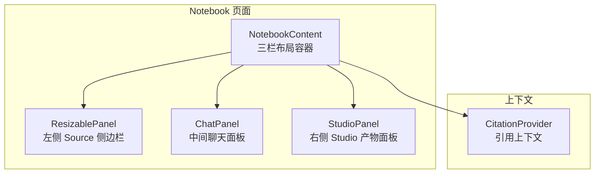
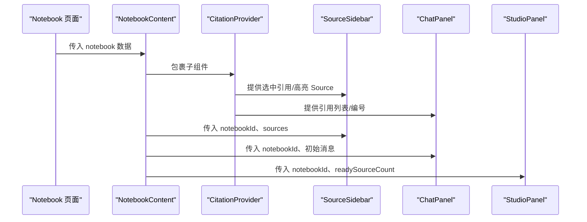
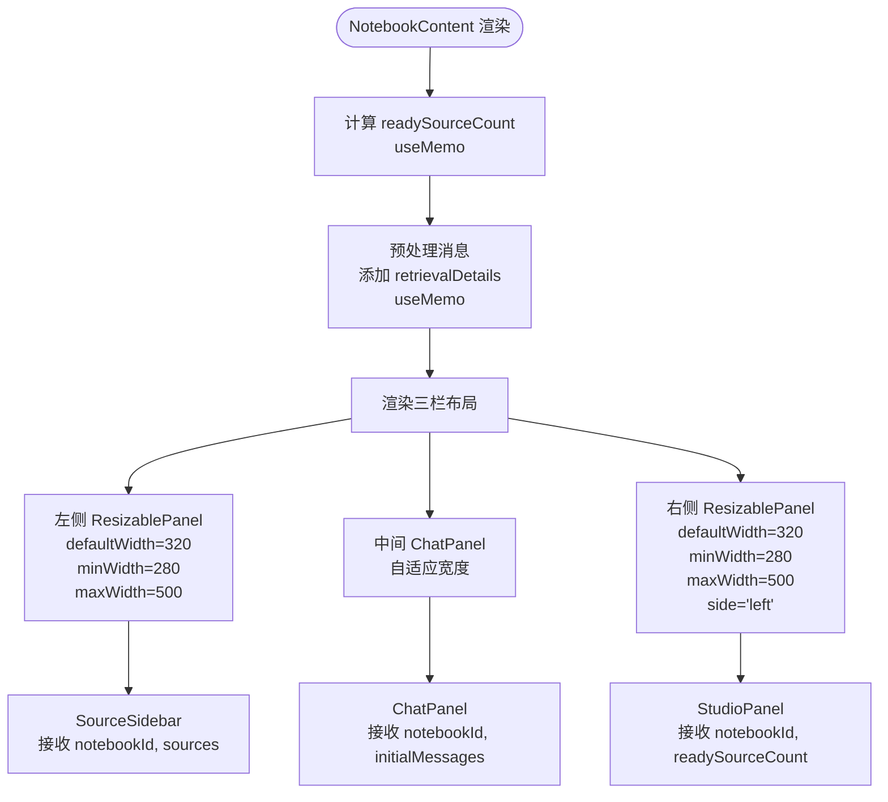
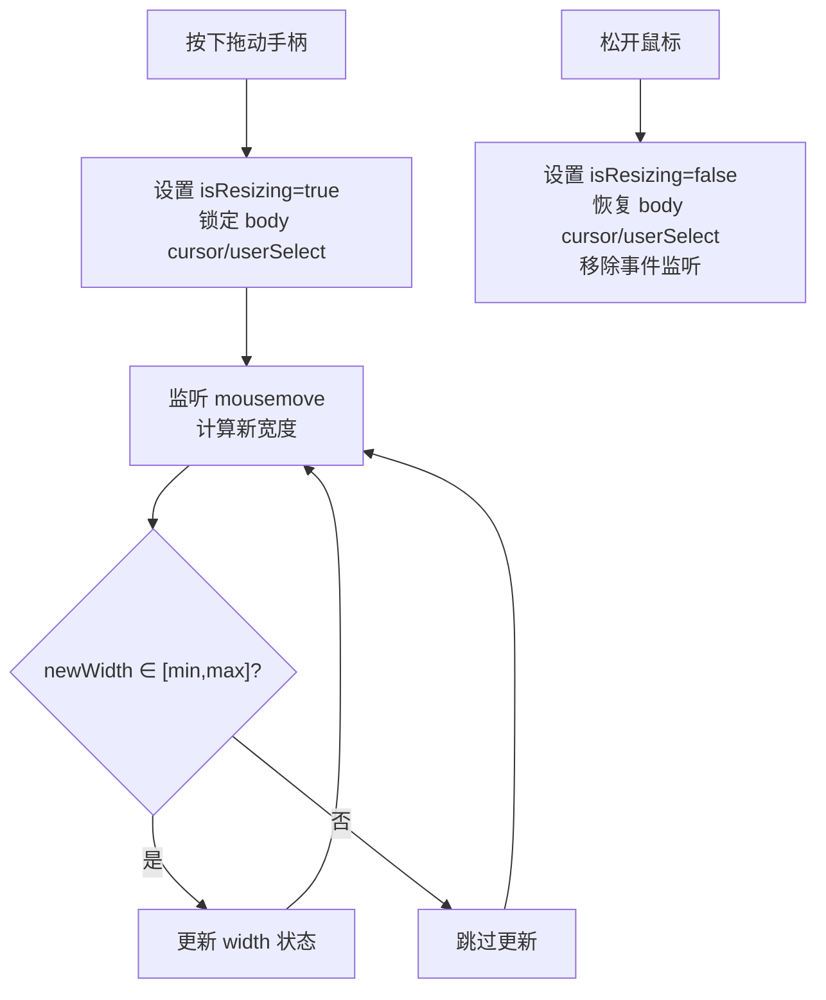
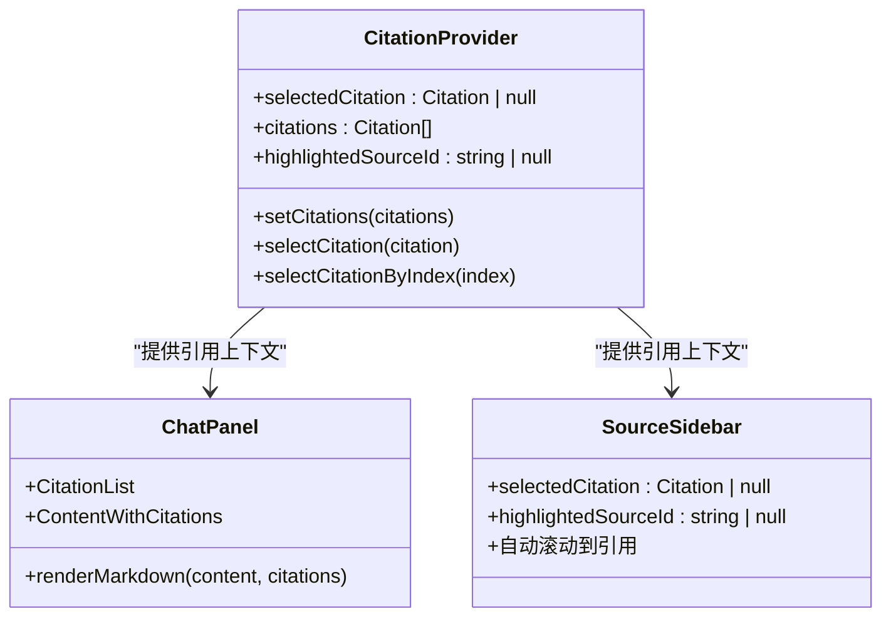
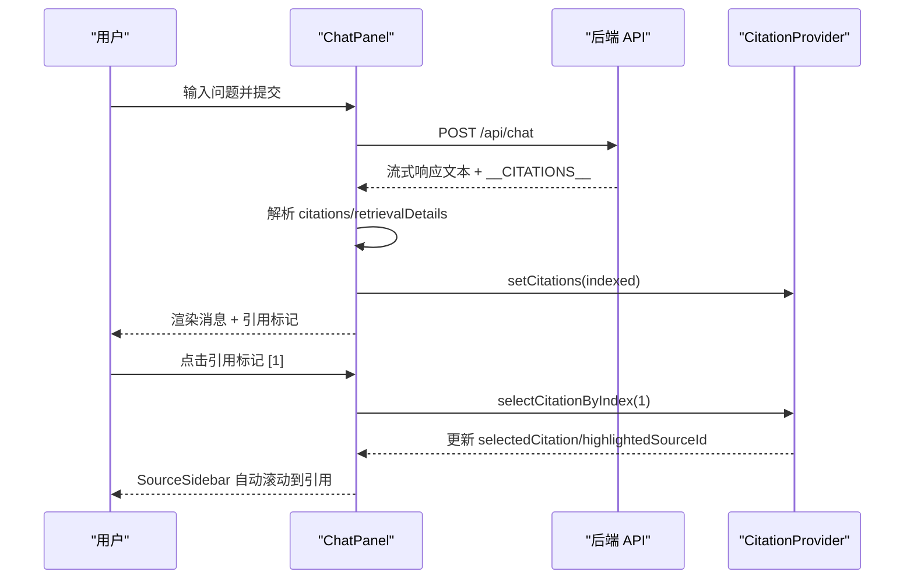
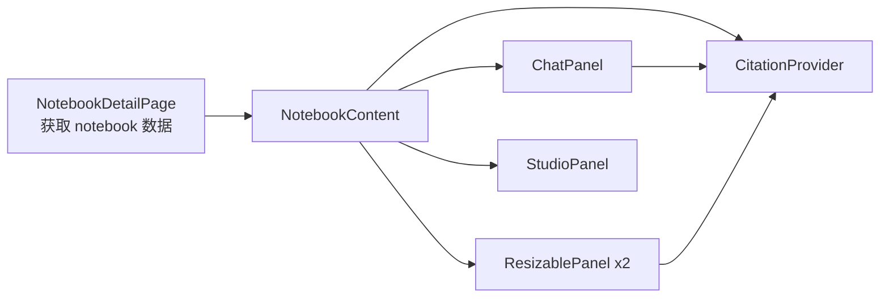

# NotebookContent 主布局

<cite>
**本文档引用的文件**
- [notebook-content.tsx](file://components/notebook/notebook-content.tsx)
- [resizable-panel.tsx](file://components/common/resizable-panel.tsx)
- [citation-context.tsx](file://components/notebook/citation-context.tsx)
- [source-sidebar.tsx](file://components/notebook/source-sidebar.tsx)
- [chat-panel.tsx](file://components/notebook/chat-panel.tsx)
- [studio-panel.tsx](file://components/notebook/studio-panel.tsx)
- [source-card.tsx](file://components/notebook/source-card.tsx)
- [providers.tsx](file://components/providers.tsx)
- [page.tsx](file://app/notebooks/[id]/page.tsx)
- [globals.css](file://app/globals.css)
</cite>

## 目录
1. [简介](#简介)
2. [项目结构](#项目结构)
3. [核心组件](#核心组件)
4. [架构总览](#架构总览)
5. [详细组件分析](#详细组件分析)
6. [依赖关系分析](#依赖关系分析)
7. [性能考量](#性能考量)
8. [故障排查指南](#故障排查指南)
9. [结论](#结论)
10. [附录](#附录)

## 简介
NotebookContent 是 Notebook 页面的主布局组件，采用“三栏可调整布局”设计：左侧为知识源侧边栏（Source Sidebar），中间为主聊天面板（Chat Panel），右侧为 Studio 产物面板（Studio Panel）。该布局通过 ResizablePanel 实现左右两侧面板的拖拽调整，并结合 CitationProvider 上下文实现引用溯源与高亮联动。本文档将深入解析布局设计理念、实现方式、数据流设计、memo 优化策略、尺寸约束与用户体验设计，并提供定制化配置与样式覆盖方法及使用示例。

## 项目结构
NotebookContent 位于 notebook 组件目录中，作为页面级布局容器，协调多个子面板组件协同工作。其直接依赖 ResizablePanel、SourceSidebar、ChatPanel、StudioPanel 以及 CitationProvider 上下文。

图表来源
- [notebook-content.tsx](file://components/notebook/notebook-content.tsx#L85-L127)
- [resizable-panel.tsx](file://components/common/resizable-panel.tsx#L20-L92)
- [citation-context.tsx](file://components/notebook/citation-context.tsx#L46-L89)

章节来源
- [notebook-content.tsx](file://components/notebook/notebook-content.tsx#L1-L128)
- [page.tsx](file://app/notebooks/[id]/page.tsx#L103-L124)

## 核心组件
- NotebookContent：三栏布局容器，负责 props 传递、状态计算与 memo 优化，包裹 CitationProvider。
- ResizablePanel：可拖拽调整宽度的面板容器，支持最小/最大宽度约束与拖动手柄位置控制。
- CitationProvider：引用上下文，管理选中引用、引用列表编号、高亮 Source ID。
- SourceSidebar：左侧知识源列表与队列管理，支持滚动到引用、高亮 Source。
- ChatPanel：中间聊天面板，支持流式响应、引用标记渲染、检索详情弹窗。
- StudioPanel：右侧产物面板，支持生成摘要/大纲/测验/思维导图等产物并进行查看与管理。

章节来源
- [notebook-content.tsx](file://components/notebook/notebook-content.tsx#L67-L127)
- [resizable-panel.tsx](file://components/common/resizable-panel.tsx#L11-L92)
- [citation-context.tsx](file://components/notebook/citation-context.tsx#L29-L97)
- [source-sidebar.tsx](file://components/notebook/source-sidebar.tsx#L41-L316)
- [chat-panel.tsx](file://components/notebook/chat-panel.tsx#L54-L412)
- [studio-panel.tsx](file://components/notebook/studio-panel.tsx#L20-L260)

## 架构总览
NotebookContent 作为布局中枢，将三个主要面板组合为一个响应式三栏布局。左侧与右侧面板由 ResizablePanel 包裹，中间面板为自适应宽度。CitationProvider 在布局外层提供引用上下文，供 ChatPanel 与 SourceSidebar 协同使用。

图表来源
- [page.tsx](file://app/notebooks/[id]/page.tsx#L103-L124)
- [notebook-content.tsx](file://components/notebook/notebook-content.tsx#L71-L127)
- [citation-context.tsx](file://components/notebook/citation-context.tsx#L46-L89)

## 详细组件分析

### NotebookContent 布局与数据流
- 布局结构：三栏布局，左侧与右侧为 ResizablePanel，中间为自适应 flex 容器。
- 尺寸约束：
  - 左侧 Source 侧边栏：defaultWidth=320，minWidth=280，maxWidth=500
  - 右侧 Studio 产物面板：defaultWidth=320，minWidth=280，maxWidth=500，side="left"
- 数据流：
  - props：notebook（包含 sources、messages、计数等）
  - 状态计算：使用 useMemo 计算 readySourceCount 与 processedMessages，避免重复计算
  - 子组件 props：向 SourceSidebar 传入 notebookId 与 sources；向 ChatPanel 传入 notebookId 与 processedMessages；向 StudioPanel 传入 notebookId 与 readySourceCount
- memo 优化策略：
  - readySourceCount 与 processedMessages 仅在 notebook.sources 或 notebook.messages 变化时重新计算
  - ChatPanel 中 bubbleItems 与 roles 使用 useMemo 缓存，避免每次渲染都重建列表项与角色配置

图表来源
- [notebook-content.tsx](file://components/notebook/notebook-content.tsx#L71-L127)

章节来源
- [notebook-content.tsx](file://components/notebook/notebook-content.tsx#L67-L127)

### ResizablePanel 可调整布局实现
- 设计理念：通过鼠标拖拽改变面板宽度，支持左右手柄位置（side），并限制最小/最大宽度。
- 关键实现：
  - 状态：width、isResizing、panelRef
  - 事件：监听 mousemove/mouseup，动态计算新宽度并应用到面板
  - 约束：newWidth 必须满足 minWidth ≤ newWidth ≤ maxWidth
  - 样式：拖动手柄居于面板边缘，悬停显示，拖拽时设置 body cursor 与 userSelect
- 用户体验：拖拽时提供视觉反馈（光标、手柄显隐），拖拽结束自动清理事件监听

图表来源
- [resizable-panel.tsx](file://components/common/resizable-panel.tsx#L32-L65)

章节来源
- [resizable-panel.tsx](file://components/common/resizable-panel.tsx#L11-L92)

### CitationProvider 上下文与引用溯源
- 上下文职责：维护当前选中的引用、引用列表（带编号）、高亮的 Source ID，并提供选择引用的方法。
- 关键能力：
  - setCitations：仅在引用列表真正变化时更新，避免不必要的重渲染
  - selectCitation：设置选中引用并同步高亮 Source ID
  - selectCitationByIndex：按编号选择引用
- 与组件协作：
  - ChatPanel：渲染引用标记 [1]、[2]，点击标记跳转到 Source/Chunk
  - SourceSidebar：根据选中引用自动展开并滚动到对应 Source/Chunk

图表来源
- [citation-context.tsx](file://components/notebook/citation-context.tsx#L29-L97)
- [chat-panel.tsx](file://components/notebook/chat-panel.tsx#L481-L537)
- [source-sidebar.tsx](file://components/notebook/source-sidebar.tsx#L148-L167)

章节来源
- [citation-context.tsx](file://components/notebook/citation-context.tsx#L29-L97)
- [chat-panel.tsx](file://components/notebook/chat-panel.tsx#L481-L675)
- [source-sidebar.tsx](file://components/notebook/source-sidebar.tsx#L148-L176)

### ChatPanel 数据流与渲染优化
- 数据流：
  - 接收 notebookId 与 initialMessages
  - 通过 fetch 请求获取流式响应，解析 __CITATIONS__ 标记，提取 citations 与 retrievalDetails
  - 使用 useMemo 将 messages 转换为 Bubble.List 的 items，避免重复创建
- 渲染优化：
  - bubbleItems 与 roles 使用 useMemo 缓存
  - Markdown 内容通过 XMarkdown 渲染，支持内联引用标记 [1]、[2] 点击跳转
  - 自动滚动到底部，保持输入框始终可见
- 引用交互：
  - CitationList 展示底部引用列表，点击引用高亮 Source
  - ContentWithCitations 将 [1] 等标记渲染为可点击按钮，并提供 Tooltip 提示

图表来源
- [chat-panel.tsx](file://components/notebook/chat-panel.tsx#L171-L300)
- [chat-panel.tsx](file://components/notebook/chat-panel.tsx#L104-L110)
- [chat-panel.tsx](file://components/notebook/chat-panel.tsx#L303-L316)
- [source-sidebar.tsx](file://components/notebook/source-sidebar.tsx#L148-L167)

章节来源
- [chat-panel.tsx](file://components/notebook/chat-panel.tsx#L60-L412)

### StudioPanel 产物管理
- 功能概览：生成摘要、大纲、测验、思维导图等产物，支持查看、删除与模板库调用。
- 关键逻辑：
  - 依赖 readySourceCount 控制生成按钮可用性
  - 生成成功后将产物插入列表顶部并选中
  - 支持模板库一键生成并自动切换到产物列表
- 与 ChatPanel 的协作：当 Studio 生成产物时，产物内容可被 ChatPanel 引用与讨论。

章节来源
- [studio-panel.tsx](file://components/notebook/studio-panel.tsx#L25-L260)

### SourceSidebar 与 SourceCard
- 功能概览：展示知识源列表、队列状态、处理进度与日志；支持立即处理、取消排队、重试、删除等操作。
- 引用联动：根据选中引用自动展开对应 Source 并滚动到指定 Chunk，提供高亮动画。
- 与 CitationProvider 协作：监听 selectedCitation 变化，自动滚动到对应 Source/Chunk。

章节来源
- [source-sidebar.tsx](file://components/notebook/source-sidebar.tsx#L49-L316)
- [source-card.tsx](file://components/notebook/source-card.tsx#L224-L823)

## 依赖关系分析
- NotebookContent 依赖 ResizablePanel、SourceSidebar、ChatPanel、StudioPanel、CitationProvider。
- ResizablePanel 为通用组件，不依赖业务数据。
- CitationProvider 为上下文容器，被 ChatPanel 与 SourceSidebar 使用。
- 页面层（app/notebooks/[id]/page.tsx）负责获取 notebook 数据并传给 NotebookContent。

图表来源
- [page.tsx](file://app/notebooks/[id]/page.tsx#L18-L124)
- [notebook-content.tsx](file://components/notebook/notebook-content.tsx#L71-L127)

章节来源
- [page.tsx](file://app/notebooks/[id]/page.tsx#L18-L124)
- [notebook-content.tsx](file://components/notebook/notebook-content.tsx#L71-L127)

## 性能考量
- memo 优化：
  - NotebookContent 中对 readySourceCount 与 processedMessages 使用 useMemo，减少子组件重渲染
  - ChatPanel 中 bubbleItems 与 roles 使用 useMemo，避免每次渲染都重建列表项与角色配置
- 事件监听：
  - ResizablePanel 在拖拽时动态绑定/解绑 mousemove/mouseup 事件，拖拽结束后清理，避免内存泄漏
- 按需加载：
  - ChatPanel 对 RetrievalDetailsPanel 使用动态导入，减少首屏包体
- 状态最小化：
  - CitationProvider 仅在引用列表真正变化时更新，避免不必要的重渲染

[本节为通用性能指导，无需特定文件来源]

## 故障排查指南
- 引用无法高亮或滚动：
  - 检查 CitationProvider 是否正确包裹子组件
  - 确认 ChatPanel 已将 citations 注入上下文（setCitations）
  - 确认 SourceSidebar 的 selectedCitation 与 highlightedSourceId 是否同步
- ResizablePanel 无法拖拽：
  - 检查 side 参数是否正确（左侧面板需设置 side="left"）
  - 确认 minWidth/maxWidth 设置合理，避免超出边界导致无法更新
- ChatPanel 无法显示引用标记：
  - 确认消息中包含 citations 与 retrievalDetails
  - 检查 ContentWithCitations 的 [1] 标记格式是否正确
- Studio 无法生成产物：
  - 确认 readySourceCount > 0
  - 检查后端接口 /api/studio/generate 是否正常返回

章节来源
- [citation-context.tsx](file://components/notebook/citation-context.tsx#L51-L73)
- [resizable-panel.tsx](file://components/common/resizable-panel.tsx#L32-L65)
- [chat-panel.tsx](file://components/notebook/chat-panel.tsx#L104-L110)
- [studio-panel.tsx](file://components/notebook/studio-panel.tsx#L150-L151)

## 结论
NotebookContent 通过 ResizablePanel 实现灵活的三栏布局，结合 CitationProvider 上下文实现了引用溯源与高亮联动，配合 ChatPanel 与 StudioPanel 提供了完整的知识管理与产物生成体验。通过 useMemo 等优化策略，保证了良好的性能表现。整体设计兼顾了用户体验与可扩展性，便于后续功能迭代与定制化。

[本节为总结性内容，无需特定文件来源]

## 附录

### 布局断点与响应式适配
- 默认断点：左侧与右侧面板默认宽度均为 320px，最小宽度 280px，最大宽度 500px
- 响应式适配：中间 ChatPanel 为自适应宽度，随窗口变化自动调整
- 拖动手柄位置：右侧面板手柄位于右侧边缘，左侧面板手柄位于左侧边缘（side="left"）

章节来源
- [notebook-content.tsx](file://components/notebook/notebook-content.tsx#L89-L116)
- [resizable-panel.tsx](file://components/common/resizable-panel.tsx#L38-L41)

### 尺寸约束与用户体验设计
- defaultWidth：提供初始宽度，确保首次渲染时面板具有合理占比
- minWidth/maxWidth：防止面板被过度收缩或扩张，保障可用性
- 拖拽反馈：拖拽时设置 body cursor 与 userSelect，悬停显示手柄，提升交互感知
- 自动滚动：选中引用后自动滚动到对应 Source/Chunk，减少用户查找成本

章节来源
- [resizable-panel.tsx](file://components/common/resizable-panel.tsx#L57-L59)
- [source-sidebar.tsx](file://components/notebook/source-sidebar.tsx#L148-L167)

### 布局定制化配置与样式覆盖
- 定制化配置：
  - 修改 ResizablePanel 的 defaultWidth/minWidth/maxWidth
  - 调整 side 参数以改变拖动手柄位置
  - 在 NotebookContent 中增加或替换面板组件
- 样式覆盖：
  - 通过 Tailwind 类名覆盖默认样式（如 Card、阴影、溢出等）
  - 全局样式中针对 Ant Design X 组件进行样式覆盖（如 .ant-sender、.ant-bubble-content）

章节来源
- [notebook-content.tsx](file://components/notebook/notebook-content.tsx#L89-L123)
- [globals.css](file://app/globals.css#L171-L224)

### 使用示例与集成指南
- 页面集成：
  - 在页面组件中获取 notebook 数据（包含 sources、messages、计数等）
  - 将 notebook 作为 props 传入 NotebookContent
- 组件扩展：
  - 在 NotebookContent 中新增面板时，确保使用 ResizablePanel 包裹并设置合适的尺寸约束
  - 如需引用溯源，确保组件使用 useCitation 并与 CitationProvider 协作
- 与 Ant Design X 集成：
  - 在根组件中使用 Providers 包裹应用，确保 XProvider 与 ConfigProvider 正常工作

章节来源
- [page.tsx](file://app/notebooks/[id]/page.tsx#L18-L124)
- [providers.tsx](file://components/providers.tsx#L16-L33)