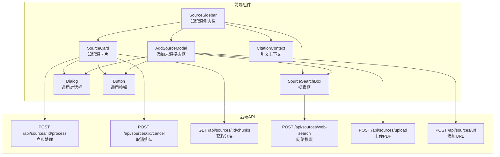
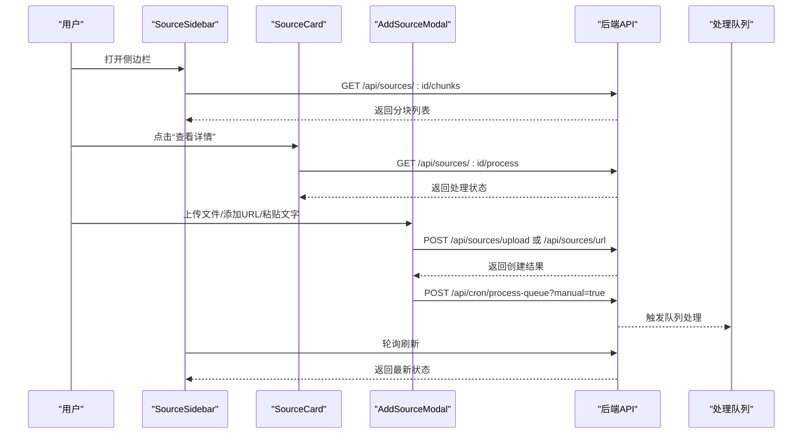
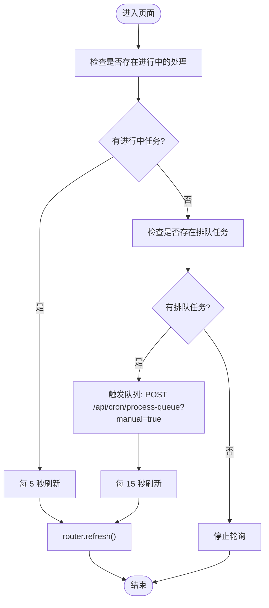
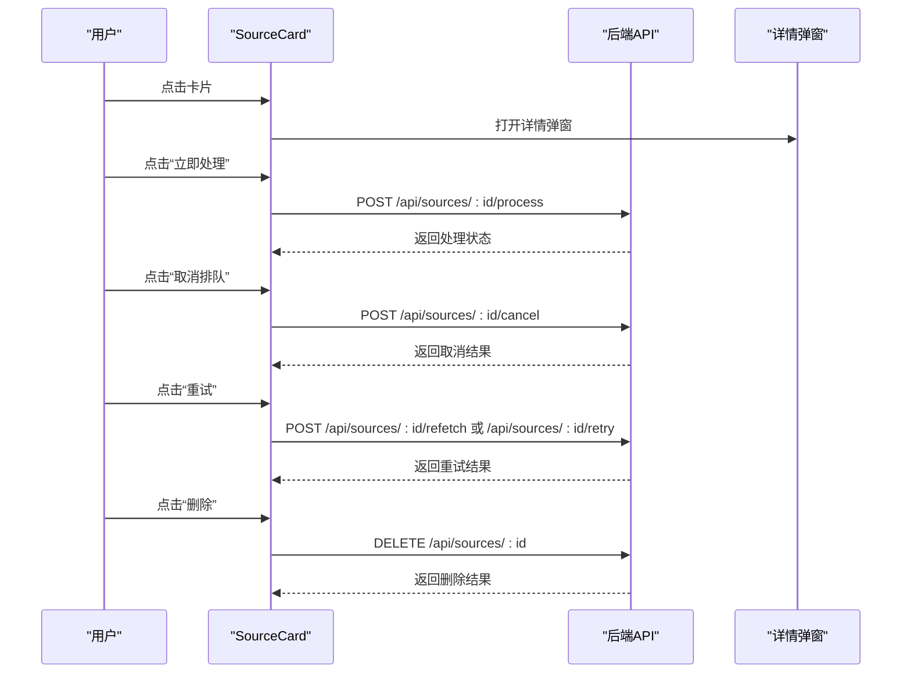
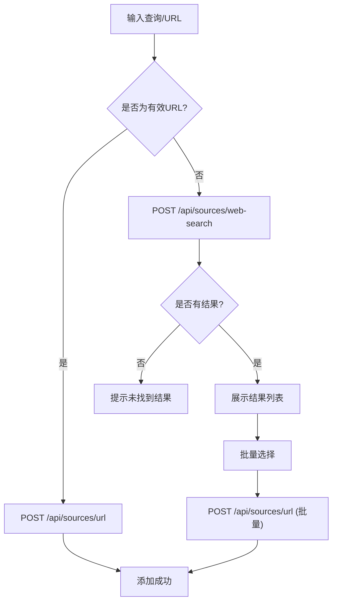
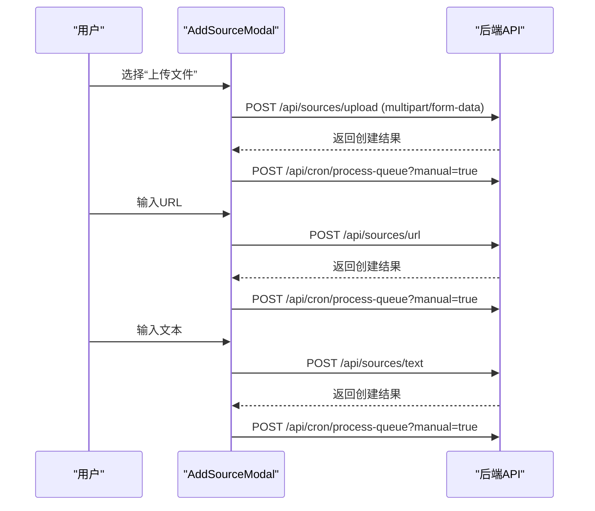
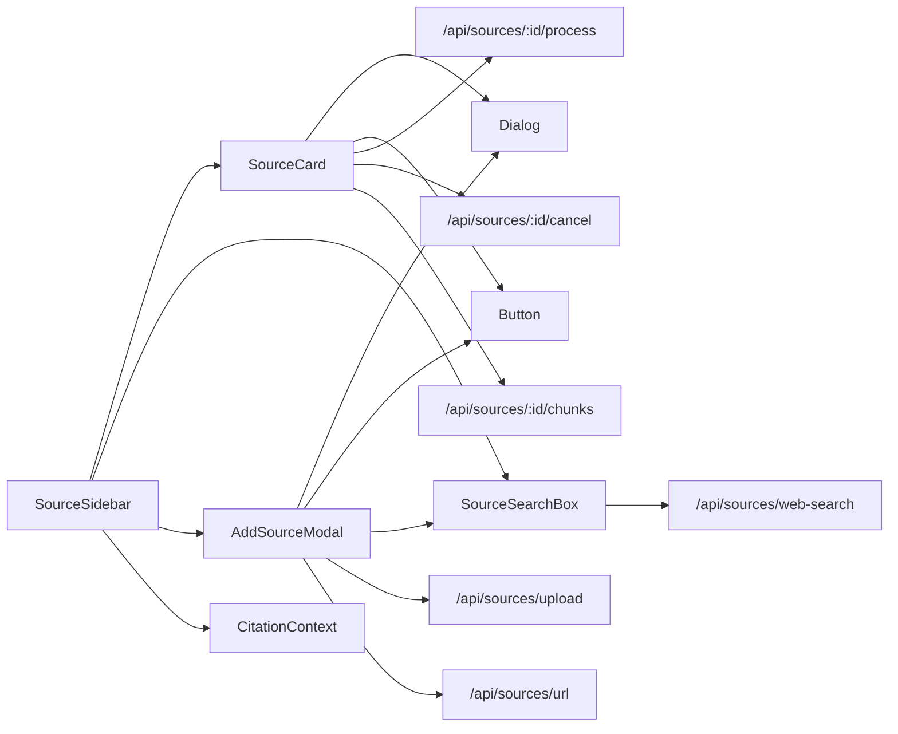

# SourceSidebar 知识源侧边栏

<cite>
**本文档引用的文件**
- [components/notebook/source-sidebar.tsx](file://components/notebook/source-sidebar.tsx)
- [components/notebook/source-card.tsx](file://components/notebook/source-card.tsx)
- [components/notebook/add-source-dialog.tsx](file://components/notebook/add-source-dialog.tsx)
- [components/notebook/source-uploader.tsx](file://components/notebook/source-uploader.tsx)
- [components/notebook/citation-context.tsx](file://components/notebook/citation-context.tsx)
- [components/ui/dialog.tsx](file://components/ui/dialog.tsx)
- [components/ui/button.tsx](file://components/ui/button.tsx)
- [app/api/sources/[id]/process/route.ts](file://app/api/sources/[id]/process/route.ts)
- [app/api/sources/[id]/cancel/route.ts](file://app/api/sources/[id]/cancel/route.ts)
- [app/api/sources/[id]/chunks/route.ts](file://app/api/sources/[id]/chunks/route.ts)
- [app/api/sources/web-search/route.ts](file://app/api/sources/web-search/route.ts)
- [app/api/sources/upload/route.ts](file://app/api/sources/upload/route.ts)
- [app/api/sources/url/route.ts](file://app/api/sources/url/route.ts)
</cite>

## 目录
1. [简介](#简介)
2. [项目结构](#项目结构)
3. [核心组件](#核心组件)
4. [架构总览](#架构总览)
5. [详细组件分析](#详细组件分析)
6. [依赖关系分析](#依赖关系分析)
7. [性能考虑](#性能考虑)
8. [故障排除指南](#故障排除指南)
9. [结论](#结论)
10. [附录](#附录)

## 简介
本文件为 SourceSidebar 知识源侧边栏组件的详细技术文档，涵盖知识源管理界面的设计与实现，包括 SourceCard 卡片组件、AddSourceDialog 对话框以及 SourceUploader 上传组件的功能说明。文档重点阐述知识源的状态管理（ready、processing、error 等）、增删改查操作（拖拽排序、批量操作、实时更新机制）、上传组件的文件处理流程（多格式支持、进度显示、错误处理）、以及筛选、搜索与分类功能的实现细节，并提供使用示例与扩展指南，帮助开发者快速理解与定制知识源管理功能。

## 项目结构
SourceSidebar 位于 notebook 功能域内，围绕知识源的生命周期进行组织：
- 侧边栏容器负责聚合与调度子组件，维护状态与轮询刷新
- SourceCard 负责单个知识源的展示、详情、操作与分块列表
- AddSourceDialog 提供搜索与批量选择能力
- SourceUploader 提供上传、URL 添加与文本输入三种来源添加方式
- CitationContext 提供引文高亮与来源定位能力
- UI 组件库 Dialog/Button 提供基础交互
- API 路由负责后端处理与数据库交互

图表来源
- [components/notebook/source-sidebar.tsx](file://components/notebook/source-sidebar.tsx#L49-L316)
- [components/notebook/source-card.tsx](file://components/notebook/source-card.tsx#L224-L800)
- [components/notebook/add-source-dialog.tsx](file://components/notebook/add-source-dialog.tsx#L42-L365)
- [components/notebook/source-uploader.tsx](file://components/notebook/source-uploader.tsx#L58-L553)
- [components/notebook/citation-context.tsx](file://components/notebook/citation-context.tsx#L46-L98)
- [app/api/sources/[id]/process/route.ts](file://app/api/sources/[id]/process/route.ts#L78-L138)
- [app/api/sources/[id]/cancel/route.ts](file://app/api/sources/[id]/cancel/route.ts#L5-L44)
- [app/api/sources/[id]/chunks/route.ts](file://app/api/sources/[id]/chunks/route.ts#L16-L138)
- [app/api/sources/web-search/route.ts](file://app/api/sources/web-search/route.ts#L5-L72)
- [app/api/sources/upload/route.ts](file://app/api/sources/upload/route.ts#L14-L110)
- [app/api/sources/url/route.ts](file://app/api/sources/url/route.ts#L68-L166)

章节来源
- [components/notebook/source-sidebar.tsx](file://components/notebook/source-sidebar.tsx#L49-L316)
- [components/notebook/source-card.tsx](file://components/notebook/source-card.tsx#L224-L800)
- [components/notebook/add-source-dialog.tsx](file://components/notebook/add-source-dialog.tsx#L42-L365)
- [components/notebook/source-uploader.tsx](file://components/notebook/source-uploader.tsx#L58-L553)
- [components/notebook/citation-context.tsx](file://components/notebook/citation-context.tsx#L46-L98)

## 核心组件
- SourceSidebar：侧边栏容器，负责渲染知识源列表、处理队列弹窗、实时刷新与引用高亮联动
- SourceCard：单个知识源卡片，展示状态、进度、元信息与分块列表，提供详情、重试、删除等操作
- SourceSearchBox：搜索框组件，支持 URL 直接添加与网络搜索结果批量选择
- AddSourceModal：添加来源模态框，整合搜索、文件上传、URL 添加与文本输入
- CitationContext：引文上下文，提供选中引用的高亮与来源定位能力

章节来源
- [components/notebook/source-sidebar.tsx](file://components/notebook/source-sidebar.tsx#L49-L316)
- [components/notebook/source-card.tsx](file://components/notebook/source-card.tsx#L224-L800)
- [components/notebook/add-source-dialog.tsx](file://components/notebook/add-source-dialog.tsx#L42-L365)
- [components/notebook/source-uploader.tsx](file://components/notebook/source-uploader.tsx#L58-L553)
- [components/notebook/citation-context.tsx](file://components/notebook/citation-context.tsx#L46-L98)

## 架构总览
整体采用“前端组件 + 后端 API”的分层设计：
- 前端组件通过 fetch 调用后端 API，实现知识源的增删改查与状态变更
- SourceSidebar 负责状态轮询与队列触发，确保处理流程自动化
- SourceCard 负责用户交互与详情展示，按需加载分块数据
- AddSourceModal 提供多种来源添加入口，统一触发处理队列
- CitationContext 与 SourceCard 协作，实现引用高亮与来源定位

图表来源
- [components/notebook/source-sidebar.tsx](file://components/notebook/source-sidebar.tsx#L64-L84)
- [components/notebook/source-card.tsx](file://components/notebook/source-card.tsx#L244-L257)
- [components/notebook/source-uploader.tsx](file://components/notebook/source-uploader.tsx#L100-L135)
- [app/api/sources/[id]/chunks/route.ts](file://app/api/sources/[id]/chunks/route.ts#L16-L138)
- [app/api/sources/[id]/process/route.ts](file://app/api/sources/[id]/process/route.ts#L78-L138)
- [app/api/sources/upload/route.ts](file://app/api/sources/upload/route.ts#L14-L110)
- [app/api/sources/url/route.ts](file://app/api/sources/url/route.ts#L68-L166)

## 详细组件分析

### SourceSidebar 知识源侧边栏
- 职责
  - 渲染知识源列表与头部操作区（添加来源、队列统计）
  - 管理展开/收起状态与引用高亮联动
  - 实时轮询刷新，自动触发处理队列
  - 提供处理队列弹窗，支持“立即处理”“取消排队”
- 关键状态
  - sources：外部传入的初始知识源数组
  - expandedSourceIds：展开的 Source ID 集合
  - hasActiveProcessingSources / hasQueuedPendingSources：判断是否需要轮询与触发队列
- 轮询策略
  - 存在进行中的处理：每 5 秒刷新一次
  - 仅排队中：每 15 秒刷新一次
  - 页面不可见时不刷新
- 队列触发
  - 当存在排队且无进行中任务时，调用 /api/cron/process-queue?manual=true
- 交互
  - 点击“添加来源”打开 AddSourceModal
  - 点击“队列”打开处理队列弹窗，展示 pending/processing 的排队任务
  - 选中引用时自动滚动到对应 Source 并展开

图表来源
- [components/notebook/source-sidebar.tsx](file://components/notebook/source-sidebar.tsx#L64-L84)

章节来源
- [components/notebook/source-sidebar.tsx](file://components/notebook/source-sidebar.tsx#L49-L316)

### SourceCard 知识源卡片
- 职责
  - 展示单个知识源的标题、状态、进度与元信息
  - 提供详情弹窗，展示处理日志、错误信息、内容预览等
  - 支持“立即处理”“取消排队”“重试”“删除”等操作
  - 在“就绪”状态下可展开查看分块列表
- 状态管理
  - statusConfig：定义 ready、processing、error 等状态的图标、颜色与动画
  - progressValue：根据阶段映射计算进度百分比
  - showProgress：仅在处理阶段显示进度条
- 分块加载
  - 展开时按需加载分块数据，支持高亮与滚动定位
- 引用联动
  - 通过 CitationContext 获取选中引用，自动滚动到对应 chunk

图表来源
- [components/notebook/source-card.tsx](file://components/notebook/source-card.tsx#L307-L447)
- [app/api/sources/[id]/process/route.ts](file://app/api/sources/[id]/process/route.ts#L78-L138)
- [app/api/sources/[id]/cancel/route.ts](file://app/api/sources/[id]/cancel/route.ts#L5-L44)
- [app/api/sources/[id]/chunks/route.ts](file://app/api/sources/[id]/chunks/route.ts#L16-L138)

章节来源
- [components/notebook/source-card.tsx](file://components/notebook/source-card.tsx#L224-L800)

### AddSourceDialog 搜索框
- 职责
  - 支持 URL 直接添加与网络搜索结果展示
  - 提供批量选择与一键添加
  - 支持边栏模式与模态框模式
- 关键逻辑
  - URL 校验：仅允许 http/https
  - 搜索：调用 /api/sources/web-search 获取搜索结果
  - 批量添加：遍历选中结果逐个调用 /api/sources/url
- 状态
  - isSearching：搜索中状态
  - searchResults：搜索结果集
  - selectedResults：选中结果索引集合
  - isExpanded：展开/收起状态

图表来源
- [components/notebook/add-source-dialog.tsx](file://components/notebook/add-source-dialog.tsx#L148-L195)
- [app/api/sources/web-search/route.ts](file://app/api/sources/web-search/route.ts#L5-L72)
- [app/api/sources/url/route.ts](file://app/api/sources/url/route.ts#L68-L166)

章节来源
- [components/notebook/add-source-dialog.tsx](file://components/notebook/add-source-dialog.tsx#L42-L365)

### AddSourceModal 添加来源模态框
- 职责
  - 整合搜索框、文件上传、URL 添加、文本输入四种来源添加方式
  - 展示上传进度与结果，支持手动移除
  - 控制来源数量上限，显示进度条
- 文件上传
  - 仅支持 PDF，大小限制 50MB
  - 上传成功后自动触发处理队列
- URL 添加
  - 支持 http/https 链接，自动检测类型（普通网页、PDF、视频）
  - 视频链接直接标记为 ready，普通网页与 PDF 入队处理
- 文本输入
  - 标题必填，内容长度 10-50000 字符
  - 添加成功后自动触发处理队列

图表来源
- [components/notebook/source-uploader.tsx](file://components/notebook/source-uploader.tsx#L83-L135)
- [components/notebook/source-uploader.tsx](file://components/notebook/source-uploader.tsx#L154-L210)
- [components/notebook/source-uploader.tsx](file://components/notebook/source-uploader.tsx#L226-L283)
- [app/api/sources/upload/route.ts](file://app/api/sources/upload/route.ts#L14-L110)
- [app/api/sources/url/route.ts](file://app/api/sources/url/route.ts#L68-L166)

章节来源
- [components/notebook/source-uploader.tsx](file://components/notebook/source-uploader.tsx#L58-L553)

### CitationContext 引文上下文
- 职责
  - 管理选中的 Citation，提供 setCitations、selectCitation、selectCitationByIndex
  - 维护 highlightedSourceId，用于 SourceSidebar 的高亮联动
- 特性
  - 自动为 Citation 编号（1, 2, 3...）
  - 选中引用时同步高亮对应 Source

章节来源
- [components/notebook/citation-context.tsx](file://components/notebook/citation-context.tsx#L46-L98)

## 依赖关系分析
- 组件耦合
  - SourceSidebar 依赖 SourceCard、AddSourceDialog、AddSourceModal、CitationContext
  - SourceCard 依赖 UI 组件库 Dialog/Button 与 API 路由
  - AddSourceModal 依赖 SourceSearchBox 与 UI 组件库
- 数据流
  - 前端通过 fetch 调用后端 API，后端通过 Prisma 与 Supabase 进行数据库与对象存储操作
- 外部依赖
  - Ant Design Attachments 用于文件上传
  - Radix UI Dialog 用于模态框
  - Lucide Icons 用于图标

图表来源
- [components/notebook/source-sidebar.tsx](file://components/notebook/source-sidebar.tsx#L21-L24)
- [components/notebook/source-card.tsx](file://components/notebook/source-card.tsx#L10-L35)
- [components/notebook/source-uploader.tsx](file://components/notebook/source-uploader.tsx#L13-L30)
- [components/ui/dialog.tsx](file://components/ui/dialog.tsx#L9-L54)
- [components/ui/button.tsx](file://components/ui/button.tsx#L7-L35)

章节来源
- [components/notebook/source-sidebar.tsx](file://components/notebook/source-sidebar.tsx#L49-L316)
- [components/notebook/source-card.tsx](file://components/notebook/source-card.tsx#L224-L800)
- [components/notebook/source-uploader.tsx](file://components/notebook/source-uploader.tsx#L58-L553)
- [components/ui/dialog.tsx](file://components/ui/dialog.tsx#L9-L54)
- [components/ui/button.tsx](file://components/ui/button.tsx#L7-L35)

## 性能考虑
- 轮询优化
  - 根据处理状态动态调整轮询间隔，减少不必要的请求
  - 页面不可见时不轮询，降低资源消耗
- 按需加载
  - 分块列表仅在展开时加载，避免一次性渲染大量数据
- 上传进度
  - 上传进度以本地状态维护，减少后端压力
- 队列触发
  - 仅在无进行中任务时触发队列，避免重复触发

## 故障排除指南
- 无法添加来源
  - 检查 URL 格式是否为 http/https
  - 检查 PDF 文件大小与类型是否符合要求
  - 检查网络搜索接口返回是否为空
- 处理失败
  - 查看 SourceCard 详情中的错误信息
  - 使用“重试”或“重新抓取”恢复处理
- 无法查看分块
  - 确认知识源状态为 ready
  - 检查 /api/sources/:id/chunks 接口返回
- 队列不触发
  - 确认无进行中任务
  - 手动触发 /api/cron/process-queue?manual=true

章节来源
- [components/notebook/source-card.tsx](file://components/notebook/source-card.tsx#L307-L447)
- [components/notebook/source-uploader.tsx](file://components/notebook/source-uploader.tsx#L154-L210)
- [app/api/sources/[id]/chunks/route.ts](file://app/api/sources/[id]/chunks/route.ts#L16-L138)
- [app/api/sources/[id]/process/route.ts](file://app/api/sources/[id]/process/route.ts#L78-L138)

## 结论
SourceSidebar 知识源侧边栏通过清晰的组件划分与完善的 API 集成，实现了从添加、处理到展示的完整闭环。其状态管理、实时刷新与队列触发机制保证了良好的用户体验；多样的来源添加方式与分块展示满足了不同场景的需求。开发者可在现有基础上扩展新的来源类型、优化轮询策略与错误处理，进一步提升系统的稳定性与易用性。

## 附录
- 使用示例
  - 在页面中引入 SourceSidebar 并传入 notebookId 与 sources
  - 在 CitationProvider 包裹下使用，以启用引用高亮联动
- 扩展指南
  - 新增来源类型：在 AddSourceModal 中添加新入口，并在后端 API 中实现相应路由
  - 自定义状态：在 statusConfig 中新增状态配置，更新 SourceCard 的展示逻辑
  - 优化轮询：根据业务需求调整轮询间隔与触发条件
  - 错误处理：在各组件中增加更详细的错误提示与回退策略