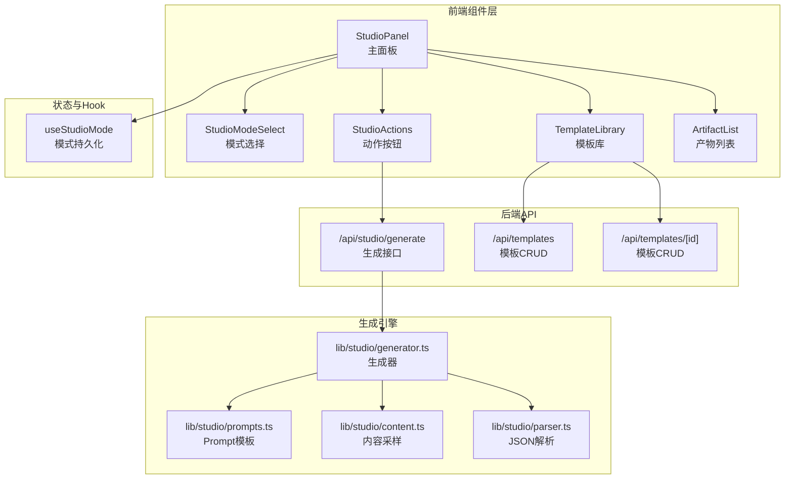
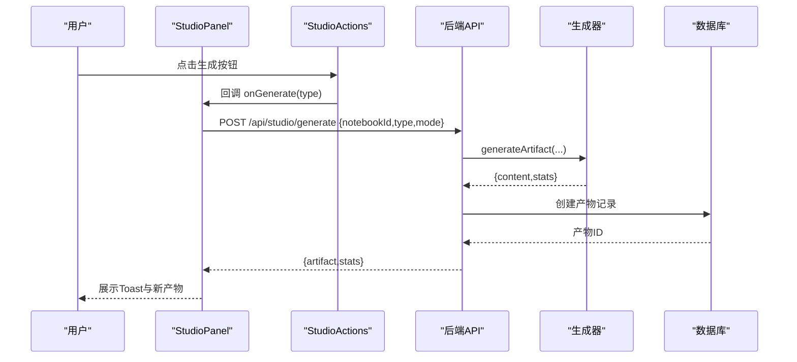
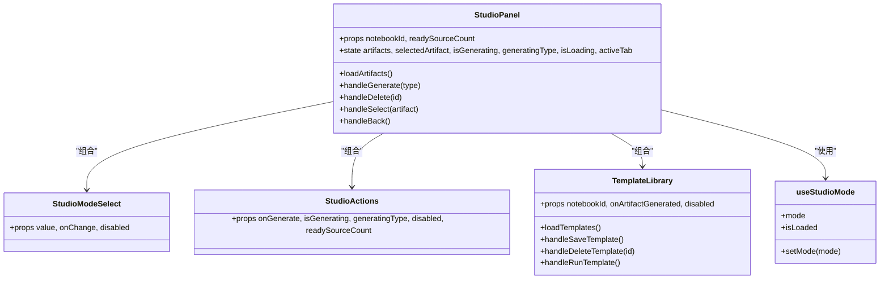
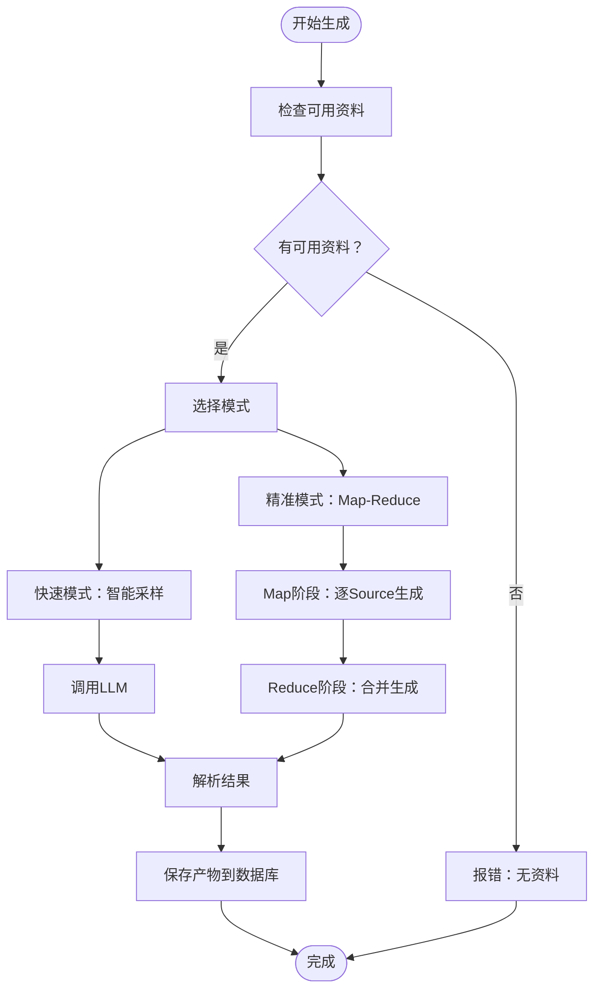
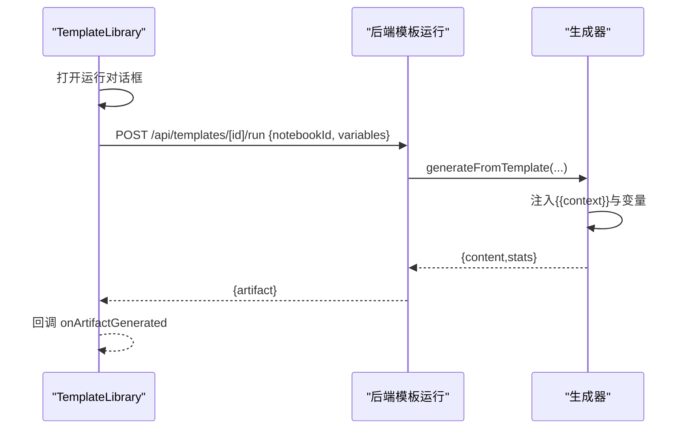

# StudioPanel 内容生成面板

<cite>
**本文档引用的文件**
- [components/notebook/studio-panel.tsx](file://components/notebook/studio-panel.tsx)
- [components/notebook/studio-mode-select.tsx](file://components/notebook/studio-mode-select.tsx)
- [components/notebook/studio-actions.tsx](file://components/notebook/studio-actions.tsx)
- [components/notebook/template-library.tsx](file://components/notebook/template-library.tsx)
- [hooks/use-studio-mode.ts](file://hooks/use-studio-mode.ts)
- [app/api/studio/generate/route.ts](file://app/api/studio/generate/route.ts)
- [app/api/templates/route.ts](file://app/api/templates/route.ts)
- [app/api/templates/[id]/route.ts](file://app/api/templates/[id]/route.ts)
- [lib/studio/index.ts](file://lib/studio/index.ts)
- [lib/studio/generator.ts](file://lib/studio/generator.ts)
- [lib/studio/prompts.ts](file://lib/studio/prompts.ts)
- [lib/studio/content.ts](file://lib/studio/content.ts)
- [lib/studio/parser.ts](file://lib/studio/parser.ts)
- [components/notebook/artifact-list.tsx](file://components/notebook/artifact-list.tsx)
- [types/index.ts](file://types/index.ts)
</cite>

## 目录
1. [简介](#简介)
2. [项目结构](#项目结构)
3. [核心组件](#核心组件)
4. [架构总览](#架构总览)
5. [组件详解](#组件详解)
6. [依赖关系分析](#依赖关系分析)
7. [性能与模式对比](#性能与模式对比)
8. [故障排查指南](#故障排查指南)
9. [结论](#结论)
10. [附录](#附录)

## 简介
本文件为 StudioPanel 内容生成面板组件的详细技术文档，涵盖模板库、模式选择与动作按钮的实现；解释快速/精准两种生成模式的差异与适用场景；详述模板系统的加载、预览与自定义流程；阐述生成过程的状态管理（进度、取消、结果处理）；说明产物生成后的展示与导出能力；并提供参数调优、模板管理与结果优化的实践建议与扩展指南。

## 项目结构
StudioPanel 位于笔记应用前端组件层，围绕“内容生成”这一核心功能，通过一组协同组件与后端 API、底层生成器模块共同完成从用户交互到产物落库的完整链路。

图表来源
- [components/notebook/studio-panel.tsx](file://components/notebook/studio-panel.tsx#L25-L261)
- [components/notebook/studio-mode-select.tsx](file://components/notebook/studio-mode-select.tsx#L30-L65)
- [components/notebook/studio-actions.tsx](file://components/notebook/studio-actions.tsx#L59-L109)
- [components/notebook/template-library.tsx](file://components/notebook/template-library.tsx#L31-L386)
- [hooks/use-studio-mode.ts](file://hooks/use-studio-mode.ts#L14-L39)
- [app/api/studio/generate/route.ts](file://app/api/studio/generate/route.ts#L12-L145)
- [app/api/templates/route.ts](file://app/api/templates/route.ts#L5-L63)
- [app/api/templates/[id]/route.ts](file://app/api/templates/[id]/route.ts#L5-L93)
- [lib/studio/generator.ts](file://lib/studio/generator.ts#L242-L311)
- [lib/studio/prompts.ts](file://lib/studio/prompts.ts#L202-L211)
- [lib/studio/content.ts](file://lib/studio/content.ts#L67-L224)
- [lib/studio/parser.ts](file://lib/studio/parser.ts#L56-L183)

章节来源
- [components/notebook/studio-panel.tsx](file://components/notebook/studio-panel.tsx#L25-L261)
- [components/notebook/studio-mode-select.tsx](file://components/notebook/studio-mode-select.tsx#L30-L65)
- [components/notebook/studio-actions.tsx](file://components/notebook/studio-actions.tsx#L59-L109)
- [components/notebook/template-library.tsx](file://components/notebook/template-library.tsx#L31-L386)
- [hooks/use-studio-mode.ts](file://hooks/use-studio-mode.ts#L14-L39)

## 核心组件
- StudioPanel：主面板容器，负责模式状态、生成流程、产物列表与模板库的切换与渲染。
- StudioModeSelect：模式选择下拉框，支持快速/精准模式，并提供工具提示说明。
- StudioActions：动作按钮组，提供摘要、大纲、测验、思维导图四种生成入口。
- TemplateLibrary：模板库，支持模板的增删改查、变量注入与运行。
- useStudioMode：模式状态 Hook，本地持久化存储模式偏好。

章节来源
- [components/notebook/studio-panel.tsx](file://components/notebook/studio-panel.tsx#L25-L261)
- [components/notebook/studio-mode-select.tsx](file://components/notebook/studio-mode-select.tsx#L30-L65)
- [components/notebook/studio-actions.tsx](file://components/notebook/studio-actions.tsx#L59-L109)
- [components/notebook/template-library.tsx](file://components/notebook/template-library.tsx#L31-L386)
- [hooks/use-studio-mode.ts](file://hooks/use-studio-mode.ts#L14-L39)

## 架构总览
StudioPanel 采用“前端组件 + 后端 API + 底层生成器”的分层架构。前端负责交互与状态管理，后端负责鉴权、参数校验与产物落库，底层生成器负责 Prompt 组装、内容采样、LLM 调用与结果解析。

图表来源
- [components/notebook/studio-panel.tsx](file://components/notebook/studio-panel.tsx#L54-L111)
- [app/api/studio/generate/route.ts](file://app/api/studio/generate/route.ts#L82-L111)
- [lib/studio/generator.ts](file://lib/studio/generator.ts#L242-L262)

## 组件详解

### StudioPanel 主面板
- 职责
  - 管理生成状态（isGenerating、generatingType）、产物列表与选中项。
  - 加载产物列表，支持删除与查看详情。
  - 在“产物/模板”标签页之间切换。
  - 与模式选择、动作按钮、模板库、产物列表等子组件协作。
- 关键交互
  - 生成：调用后端接口，接收产物与统计信息，Toast 提示耗时。
  - 删除：调用删除接口，同步更新列表与选中态。
  - 详情：点击产物卡片进入详情视图，支持返回列表。
- 状态管理
  - 通过 useState 管理本地状态；通过 useStudioMode Hook 管理模式偏好。

章节来源
- [components/notebook/studio-panel.tsx](file://components/notebook/studio-panel.tsx#L25-L261)
- [hooks/use-studio-mode.ts](file://hooks/use-studio-mode.ts#L14-L39)

### StudioModeSelect 模式选择
- 功能
  - 下拉选择“快速/精准”模式，带 Tooltip 说明两种模式的耗时预期。
  - 与 useStudioMode Hook 协同，持久化用户选择。
- 设计要点
  - 禁用态避免在生成过程中切换模式。
  - Tooltip 提供直观的性能与质量预期。

章节来源
- [components/notebook/studio-mode-select.tsx](file://components/notebook/studio-mode-select.tsx#L30-L65)
- [hooks/use-studio-mode.ts](file://hooks/use-studio-mode.ts#L14-L39)

### StudioActions 动作按钮
- 功能
  - 提供四种产物生成入口：摘要、大纲、测验、思维导图。
  - 按钮禁用逻辑：无可用资料或正在生成中且非当前类型。
  - Tooltip 提示描述与来源统计。
- 交互细节
  - 生成中显示加载图标，按钮文案切换为“生成中…”。
  - 生成完成后 Toast 展示耗时统计。

章节来源
- [components/notebook/studio-actions.tsx](file://components/notebook/studio-actions.tsx#L59-L109)

### TemplateLibrary 模板库
- 功能
  - 加载模板：支持系统模板与用户模板，按创建时间倒序。
  - 编辑/创建：对话框输入模板名、描述与 Prompt 内容，自动提取变量占位符。
  - 删除：确认后调用删除接口。
  - 运行：打开运行对话框，收集变量值，调用 /api/templates/[id]/run，回填产物。
- 关键流程
  - 模板保存：POST /api/templates 或 PATCH /api/templates/[id]。
  - 模板运行：POST /api/templates/[id]/run，返回 artifact。
  - 产物回填：回调 onArtifactGenerated，自动刷新列表并切换到产物标签。

章节来源
- [components/notebook/template-library.tsx](file://components/notebook/template-library.tsx#L31-L386)
- [app/api/templates/route.ts](file://app/api/templates/route.ts#L5-L63)
- [app/api/templates/[id]/route.ts](file://app/api/templates/[id]/route.ts#L5-L93)

### 生成器与内容采样
- 生成器（lib/studio/generator.ts）
  - 快速模式：智能采样，优先抽取每个 Source 的头部与尾部 chunks，拼接上下文后调用 LLM。
  - 精准模式：Map-Reduce，先对每个 Source 生成中间结果，再在 Reduce 阶段合并生成最终产物。
  - 超时控制：不同阶段设置不同超时阈值，避免长耗时阻塞。
  - 结果解析：对测验与思维导图进行 JSON 安全解析与结构校验。
- 内容采样（lib/studio/content.ts）
  - 智能截断：按 Source 块边界截断，避免切分不完整。
  - Token 估算：区分中英文字符，估算上下文大小。
  - Map-Reduce 专用采样：限制每个 Source 的 chunk 数量，避免过长输入。
- Prompt 模板（lib/studio/prompts.ts）
  - 提供摘要、大纲、测验、思维导图的标准 Prompt。
  - Map-Reduce 模式下提供 Map/Reduce 两阶段 Prompt。
- JSON 解析（lib/studio/parser.ts）
  - 安全解析：多策略提取 JSON，兼容 LLM 输出的多种格式。
  - Fallback：失败时返回稳定结构，保证前端可展示。

章节来源
- [lib/studio/generator.ts](file://lib/studio/generator.ts#L120-L237)
- [lib/studio/generator.ts](file://lib/studio/generator.ts#L267-L311)
- [lib/studio/content.ts](file://lib/studio/content.ts#L67-L224)
- [lib/studio/prompts.ts](file://lib/studio/prompts.ts#L202-L211)
- [lib/studio/parser.ts](file://lib/studio/parser.ts#L56-L183)

### 产物列表与详情
- 产物列表（components/notebook/artifact-list.tsx）
  - 渲染产物卡片，支持删除、选择与标题更新回调。
- 详情视图
  - StudioPanel 在选中产物时切换到详情视图，展示 ArtifactViewer（由上层传入）。

章节来源
- [components/notebook/artifact-list.tsx](file://components/notebook/artifact-list.tsx#L18-L48)
- [components/notebook/studio-panel.tsx](file://components/notebook/studio-panel.tsx#L153-L170)

## 依赖关系分析

图表来源
- [components/notebook/studio-panel.tsx](file://components/notebook/studio-panel.tsx#L25-L261)
- [components/notebook/studio-mode-select.tsx](file://components/notebook/studio-mode-select.tsx#L30-L65)
- [components/notebook/studio-actions.tsx](file://components/notebook/studio-actions.tsx#L59-L109)
- [components/notebook/template-library.tsx](file://components/notebook/template-library.tsx#L31-L386)
- [hooks/use-studio-mode.ts](file://hooks/use-studio-mode.ts#L14-L39)

## 性能与模式对比
- 快速模式（fast）
  - 特点：智能采样，优先抽取每个 Source 的头部与尾部 chunks，拼接后一次性生成。
  - 优点：速度快，适合快速浏览与概览。
  - 适用场景：资料较多但需要快速产出摘要/大纲/测验/思维导图的初稿。
- 精准模式（precise）
  - 特点：Map-Reduce，先对每个 Source 生成中间结果，再合并生成最终产物。
  - 优点：覆盖面更广，结果更全面。
  - 适用场景：对质量要求较高、需要深入整合多来源信息的场景。
- 超时与资源
  - 不同阶段设置不同超时阈值，避免长时间等待。
  - Map-Reduce 模式下对每个 Source 的 chunk 数量进行限制，降低单次输入长度。

章节来源
- [lib/studio/generator.ts](file://lib/studio/generator.ts#L120-L166)
- [lib/studio/generator.ts](file://lib/studio/generator.ts#L171-L237)
- [lib/studio/content.ts](file://lib/studio/content.ts#L10-L14)
- [components/notebook/studio-mode-select.tsx](file://components/notebook/studio-mode-select.tsx#L55-L60)

## 故障排查指南
- 常见错误与处理
  - 未授权：检查鉴权状态，确保用户已登录。
  - 参数缺失/无效：确认 notebookId、type 等参数合法。
  - 资料不足：当没有 ready 状态的资料时，生成会失败，需先上传资料。
  - 产物数量上限：超过上限需删除旧产物后再生成。
  - 生成超时：根据模式设置的超时阈值，适当调整模式或减少输入长度。
  - 生成失败：检查 LLM 返回内容，必要时启用精准模式或简化 Prompt。
- 前端提示
  - 通过 Toast 展示错误信息与耗时统计，便于定位问题。
  - 模板运行失败时，Toast 展示具体错误消息。

章节来源
- [app/api/studio/generate/route.ts](file://app/api/studio/generate/route.ts#L14-L144)
- [components/notebook/studio-panel.tsx](file://components/notebook/studio-panel.tsx#L100-L107)
- [components/notebook/template-library.tsx](file://components/notebook/template-library.tsx#L176-L182)

## 结论
StudioPanel 通过清晰的组件划分与前后端协作，提供了高效、可扩展的内容生成体验。快速/精准模式满足不同场景需求；模板库支持灵活定制；完善的错误处理与状态反馈提升了可用性。后续可在 Prompt 优化、Token 估算策略与产物导出格式方面进一步增强。

## 附录

### 生成流程状态图

图表来源
- [lib/studio/generator.ts](file://lib/studio/generator.ts#L120-L237)
- [lib/studio/content.ts](file://lib/studio/content.ts#L67-L224)
- [lib/studio/parser.ts](file://lib/studio/parser.ts#L124-L183)
- [app/api/studio/generate/route.ts](file://app/api/studio/generate/route.ts#L82-L111)

### 模板变量注入流程

图表来源
- [components/notebook/template-library.tsx](file://components/notebook/template-library.tsx#L150-L186)
- [lib/studio/generator.ts](file://lib/studio/generator.ts#L267-L311)
- [app/api/templates/[id]/route.ts](file://app/api/templates/[id]/route.ts#L5-L93)

### 类型与数据模型
- 产物类型（ArtifactType）
  - summary、outline、quiz、mindmap
- Prompt 模板（PromptTemplate）
  - id、ownerId、name、description、template、variables、isSystem、createdAt、updatedAt
- 生成结果（GenerateResult）
  - content、stats（含 mode、strategy、duration）

章节来源
- [types/index.ts](file://types/index.ts#L14-L18)
- [types/index.ts](file://types/index.ts#L188-L198)
- [lib/studio/generator.ts](file://lib/studio/generator.ts#L40-L48)
- [lib/studio/prompts.ts](file://lib/studio/prompts.ts#L200-L201)