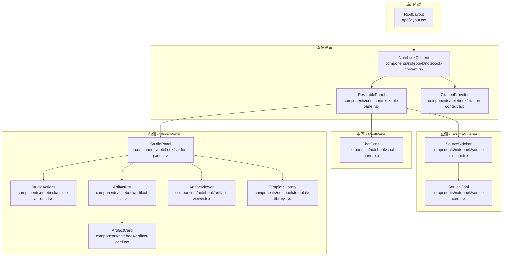
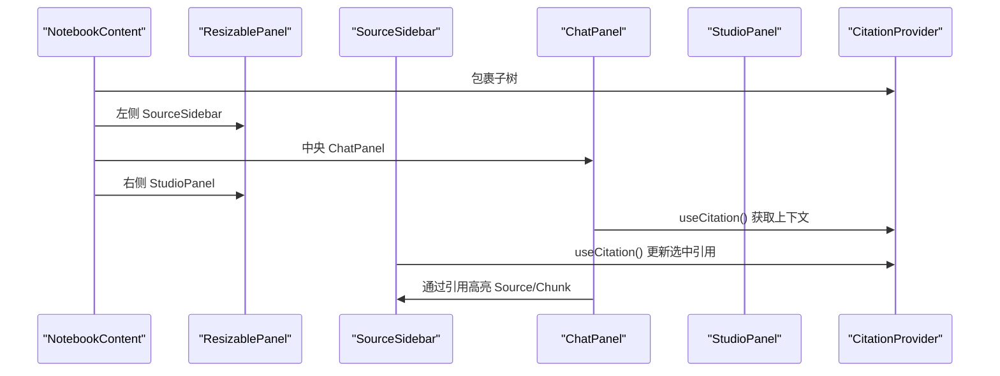
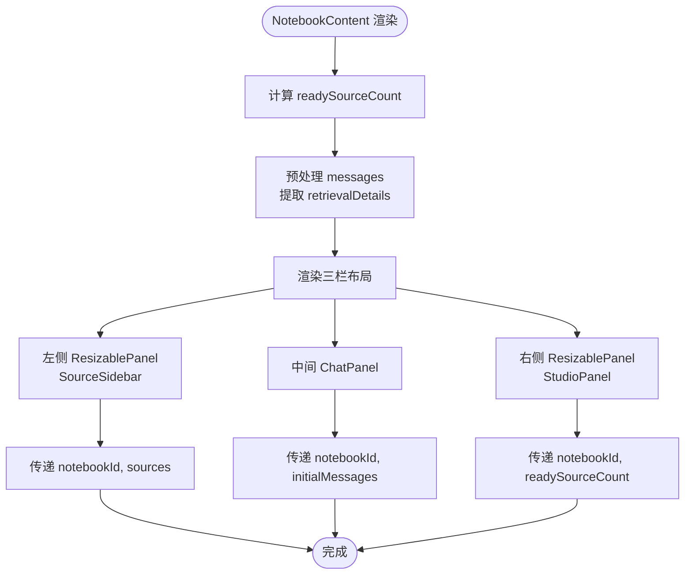
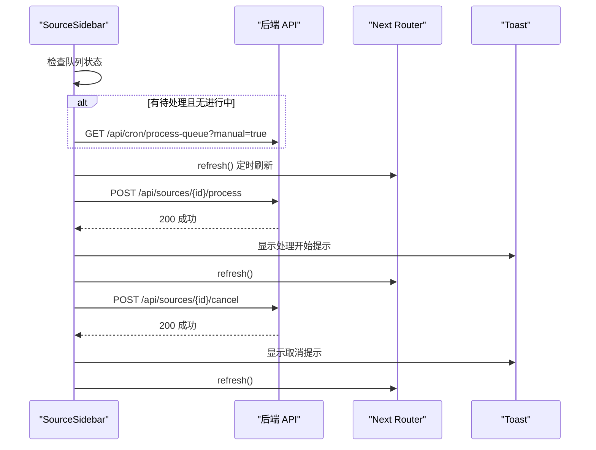
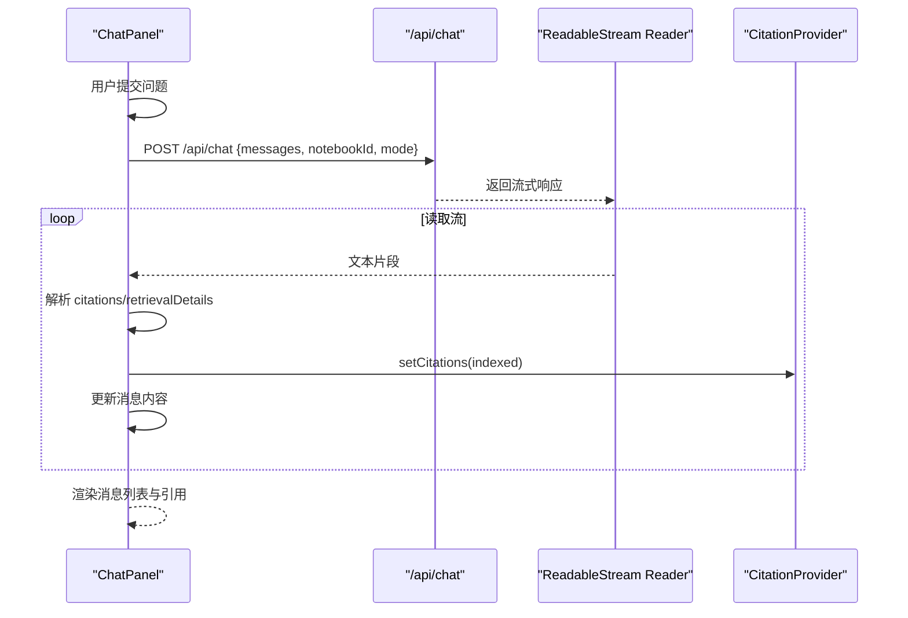
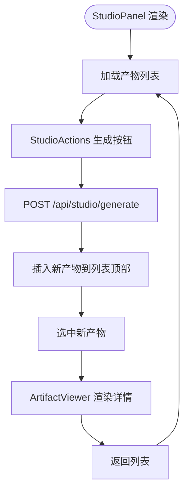
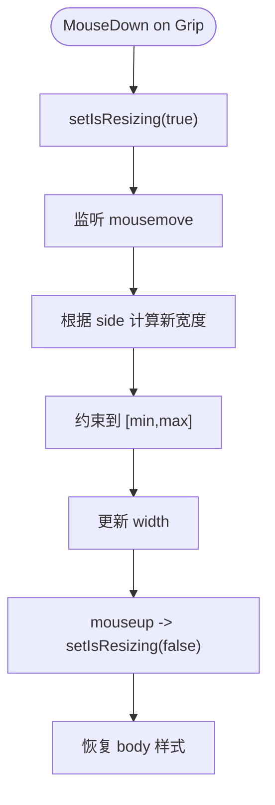
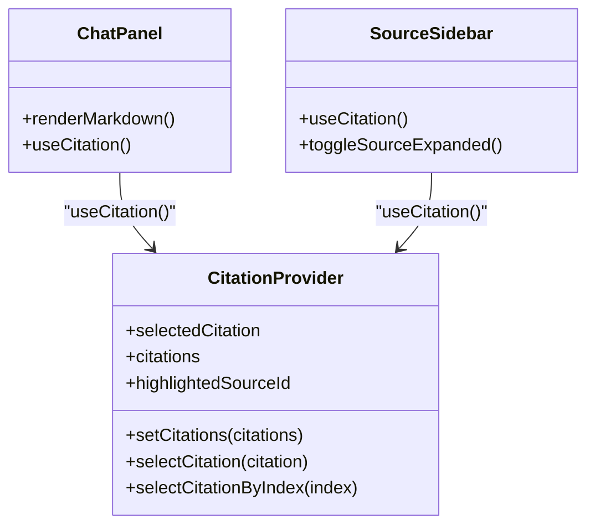
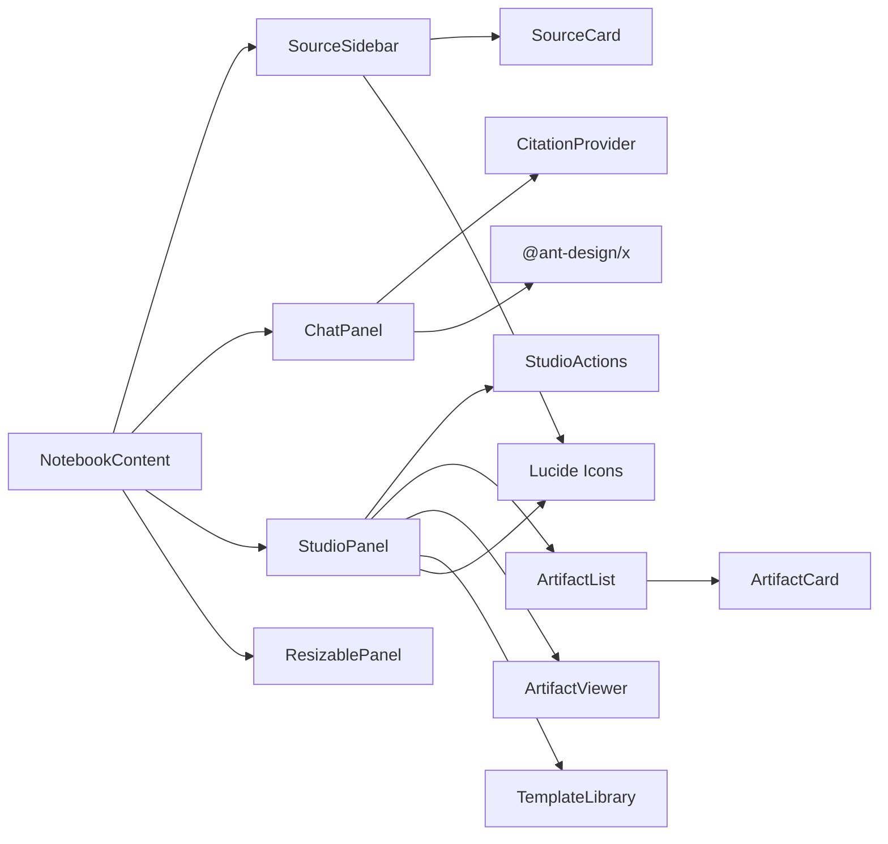

# 主要界面组件

<cite>
**本文档引用的文件**
- [notebook-content.tsx](file://components/notebook/notebook-content.tsx)
- [source-sidebar.tsx](file://components/notebook/source-sidebar.tsx)
- [chat-panel.tsx](file://components/notebook/chat-panel.tsx)
- [studio-panel.tsx](file://components/notebook/studio-panel.tsx)
- [resizable-panel.tsx](file://components/common/resizable-panel.tsx)
- [citation-context.tsx](file://components/notebook/citation-context.tsx)
- [source-card.tsx](file://components/notebook/source-card.tsx)
- [artifact-card.tsx](file://components/notebook/artifact-card.tsx)
- [studio-actions.tsx](file://components/notebook/studio-actions.tsx)
- [artifact-list.tsx](file://components/notebook/artifact-list.tsx)
- [artifact-viewer.tsx](file://components/notebook/artifact-viewer.tsx)
- [template-library.tsx](file://components/notebook/template-library.tsx)
- [use-studio-mode.ts](file://hooks/use-studio-mode.ts)
- [layout.tsx](file://app/layout.tsx)
- [config.ts](file://lib/config.ts)
</cite>

## 目录
1. [简介](#简介)
2. [项目结构](#项目结构)
3. [核心组件](#核心组件)
4. [架构总览](#架构总览)
5. [详细组件分析](#详细组件分析)
6. [依赖关系分析](#依赖关系分析)
7. [性能考量](#性能考量)
8. [故障排查指南](#故障排查指南)
9. [结论](#结论)
10. [附录](#附录)

## 简介
本文件面向 notebookLM-clone 项目的“主要界面组件”，重点围绕 NotebookContent 三栏布局进行深入解析，涵盖：
- 左侧 SourceSidebar 知识源侧边栏：来源管理、处理队列、状态轮询与交互
- 中央 ChatPanel 问答面板：RAG 对话、流式输出、引用高亮与检索详情
- 右侧 StudioPanel 内容生成面板：产物生成、模板库、产物列表与详情

文档将详细说明组件的数据流、状态同步、事件回调、响应式布局、交互设计、定制化配置、性能优化策略，并提供使用示例与集成指南。

## 项目结构
主要界面组件位于 components/notebook 目录下，配合 components/common 的可调整面板组件与 hooks/use-studio-mode.ts 提供 Studio 模式状态管理；应用根布局在 app/layout.tsx 中注入全局 Provider 与 Toast。

图表来源
- [layout.tsx](file://app/layout.tsx#L15-L30)
- [notebook-content.tsx](file://components/notebook/notebook-content.tsx#L85-L126)
- [resizable-panel.tsx](file://components/common/resizable-panel.tsx#L20-L92)
- [citation-context.tsx](file://components/notebook/citation-context.tsx#L46-L88)
- [source-sidebar.tsx](file://components/notebook/source-sidebar.tsx#L49-L316)
- [source-card.tsx](file://components/notebook/source-card.tsx#L224-L626)
- [chat-panel.tsx](file://components/notebook/chat-panel.tsx#L60-L412)
- [studio-panel.tsx](file://components/notebook/studio-panel.tsx#L25-L260)
- [studio-actions.tsx](file://components/notebook/studio-actions.tsx#L59-L108)
- [artifact-list.tsx](file://components/notebook/artifact-list.tsx#L18-L47)
- [artifact-card.tsx](file://components/notebook/artifact-card.tsx#L57-L269)
- [artifact-viewer.tsx](file://components/notebook/artifact-viewer.tsx#L21-L56)
- [template-library.tsx](file://components/notebook/template-library.tsx#L31-L385)

章节来源
- [layout.tsx](file://app/layout.tsx#L15-L30)
- [notebook-content.tsx](file://components/notebook/notebook-content.tsx#L71-L127)

## 核心组件
- NotebookContent：三栏布局容器，负责 props 传递、状态计算与 CitationProvider 上下文包裹
- SourceSidebar：左侧知识源管理，含来源列表、添加来源、处理队列、状态轮询与交互
- ChatPanel：中央问答面板，支持 RAG 对话、流式输出、引用高亮、检索详情弹窗
- StudioPanel：右侧内容生成面板，支持产物生成、产物列表、详情查看、模板库
- ResizablePanel：通用可调整大小面板，支持左右手柄与拖拽调整
- CitationProvider：引用上下文，统一管理选中引用、高亮来源与编号映射
- useStudioMode：Studio 模式（fast/precise）状态钩子，localStorage 持久化

章节来源
- [notebook-content.tsx](file://components/notebook/notebook-content.tsx#L67-L127)
- [source-sidebar.tsx](file://components/notebook/source-sidebar.tsx#L41-L316)
- [chat-panel.tsx](file://components/notebook/chat-panel.tsx#L54-L412)
- [studio-panel.tsx](file://components/notebook/studio-panel.tsx#L20-L260)
- [resizable-panel.tsx](file://components/common/resizable-panel.tsx#L11-L92)
- [citation-context.tsx](file://components/notebook/citation-context.tsx#L29-L97)
- [use-studio-mode.ts](file://hooks/use-studio-mode.ts#L14-L38)

## 架构总览
NotebookContent 作为根容器，将三个子面板通过 ResizablePanel 包裹，形成可拖拽的三栏布局。CitationProvider 在 NotebookContent 内部提供引用上下文，使 ChatPanel 与 SourceSidebar 能够共享引用状态，实现点击引用在侧边栏高亮与定位。

图表来源
- [notebook-content.tsx](file://components/notebook/notebook-content.tsx#L85-L126)
- [citation-context.tsx](file://components/notebook/citation-context.tsx#L91-L97)
- [source-sidebar.tsx](file://components/notebook/source-sidebar.tsx#L148-L167)
- [chat-panel.tsx](file://components/notebook/chat-panel.tsx#L67-L109)

## 详细组件分析

### NotebookContent：三栏布局与数据流
- 布局：左侧 SourceSidebar、中间 ChatPanel、右侧 StudioPanel，均在 ResizablePanel 中，支持拖拽调整宽度
- 数据流：
  - 接收 notebook 参数，计算 readySourceCount 与 processedMessages
  - processedMessages 将消息元数据中的 retrievalDetails 提取到消息对象上，供 ChatPanel 渲染
  - 将 notebookId 传给三个子面板，确保 API 调用与状态同步
- 状态同步：
  - SourceSidebar 通过 router.refresh() 触发服务端刷新，保持状态一致
  - ChatPanel 通过本地状态维护消息列表与输入，流式响应更新
  - StudioPanel 通过本地状态维护产物列表与当前选中产物，异步加载与生成

图表来源
- [notebook-content.tsx](file://components/notebook/notebook-content.tsx#L71-L127)

章节来源
- [notebook-content.tsx](file://components/notebook/notebook-content.tsx#L67-L127)

### SourceSidebar：知识源侧边栏
- 功能要点：
  - 展示来源列表，支持展开/折叠查看 chunks
  - 添加来源（模态框）、处理队列（Dialog）、立即处理、取消排队
  - 状态轮询：根据是否有处理中或排队任务，定时触发 router.refresh()
  - 引用高亮：监听 selectedCitation，自动展开并滚动到对应 Source/Chunk
- 关键交互：
  - handleAddSuccess/handleModalSuccess：添加成功后刷新页面
  - handleSourceDelete：删除后刷新
  - handleProcessNow/handleCancelQueue：对单个来源进行处理控制
  - toggleSourceExpanded：切换 Source 展开状态
  - handleSourceRefUpdate：维护 Source 元素引用，用于滚动定位

图表来源
- [source-sidebar.tsx](file://components/notebook/source-sidebar.tsx#L64-L84)
- [source-sidebar.tsx](file://components/notebook/source-sidebar.tsx#L112-L146)

章节来源
- [source-sidebar.tsx](file://components/notebook/source-sidebar.tsx#L49-L316)

### ChatPanel：问答面板
- 功能要点：
  - 建议问题：首次无消息时加载建议问题
  - RAG 对话：发送消息至 /api/chat，支持 JSON 无依据返回与流式响应
  - 引用高亮：渲染 Markdown 时将 [1][2] 等标记转换为可点击按钮，点击后通过 CitationProvider 高亮对应 Source
  - 检索详情：通过右侧抽屉展示检索链路详情
  - 模型选择：支持 fast/precise 模式，localStorage 持久化
- 关键流程：
  - handleSubmit：构建用户消息与占位 AI 消息，调用 /api/chat，流式读取响应，解析 citations/retrievalDetails，更新消息与当前 citations
  - renderMarkdown：将内容与 citations 绑定，生成带引用标记的可点击内容
  - roles：配置用户/助手头像与样式，AI 内容通过 XMarkdown 渲染

图表来源
- [chat-panel.tsx](file://components/notebook/chat-panel.tsx#L171-L300)
- [chat-panel.tsx](file://components/notebook/chat-panel.tsx#L302-L316)
- [chat-panel.tsx](file://components/notebook/chat-panel.tsx#L103-L109)

章节来源
- [chat-panel.tsx](file://components/notebook/chat-panel.tsx#L60-L412)

### StudioPanel：内容生成面板
- 功能要点：
  - StudioActions：摘要/大纲/测验/思维导图四类产物生成按钮，禁用条件为无 ready 源
  - 产物列表：ArtifactList + ArtifactCard，支持复制、删除、编辑标题
  - 产物详情：ArtifactViewer 根据类型渲染 Markdown 或 JSON 结构（测验/思维导图）
  - 模板库：TemplateLibrary 支持模板 CRUD、变量填充与运行，生成产物后自动回到产物列表并选中
  - Studio 模式：useStudioMode 提供 fast/precise 模式切换与持久化
- 关键流程：
  - handleGenerate：POST /api/studio/generate，成功后插入列表顶部并选中
  - handleDelete：DELETE /api/artifacts/{id}
  - handleSelect/handleBack：详情视图与列表视图切换

图表来源
- [studio-panel.tsx](file://components/notebook/studio-panel.tsx#L34-L111)
- [artifact-viewer.tsx](file://components/notebook/artifact-viewer.tsx#L21-L56)
- [template-library.tsx](file://components/notebook/template-library.tsx#L150-L186)

章节来源
- [studio-panel.tsx](file://components/notebook/studio-panel.tsx#L25-L260)
- [studio-actions.tsx](file://components/notebook/studio-actions.tsx#L59-L108)
- [artifact-list.tsx](file://components/notebook/artifact-list.tsx#L18-L47)
- [artifact-card.tsx](file://components/notebook/artifact-card.tsx#L57-L269)
- [artifact-viewer.tsx](file://components/notebook/artifact-viewer.tsx#L21-L56)
- [template-library.tsx](file://components/notebook/template-library.tsx#L31-L385)
- [use-studio-mode.ts](file://hooks/use-studio-mode.ts#L14-L38)

### ResizablePanel：可调整面板
- 功能要点：
  - 支持左右手柄（side），默认宽度、最小/最大宽度可配置
  - 鼠标拖拽时设置 body 样式，避免文本选择干扰
  - 通过 ref 获取面板尺寸，实时更新 width
- 交互设计：
  - 悬停显示手柄，提升可发现性
  - 边界约束：最小/最大宽度限制

图表来源
- [resizable-panel.tsx](file://components/common/resizable-panel.tsx#L32-L65)
- [resizable-panel.tsx](file://components/common/resizable-panel.tsx#L67-L92)

章节来源
- [resizable-panel.tsx](file://components/common/resizable-panel.tsx#L11-L92)

### CitationProvider：引用上下文
- 功能要点：
  - 管理 selectedCitation、citations 列表与 highlightedSourceId
  - setCitations：去重更新并为每个引用分配 index
  - selectCitation/selectCitationByIndex：选中引用并高亮对应 Source
- 与组件协作：
  - ChatPanel：渲染引用标记，点击跳转 Source/Chunk
  - SourceSidebar：监听选中引用，自动展开并滚动定位

图表来源
- [citation-context.tsx](file://components/notebook/citation-context.tsx#L29-L97)
- [chat-panel.tsx](file://components/notebook/chat-panel.tsx#L67-L109)
- [source-sidebar.tsx](file://components/notebook/source-sidebar.tsx#L148-L167)

章节来源
- [citation-context.tsx](file://components/notebook/citation-context.tsx#L29-L97)

## 依赖关系分析
- 组件耦合：
  - NotebookContent 作为父容器，向下传递 notebookId 与派生状态
  - SourceSidebar 与 ChatPanel 通过 CitationProvider 共享引用状态
  - StudioPanel 与 TemplateLibrary 通过 API 交互生成产物
- 外部依赖：
  - Next.js Navigation/Router：用于页面刷新与路由
  - Ant Design X：聊天气泡与 Markdown 渲染
  - Lucide Icons：UI 图标
  - Supabase/自定义配置：模型与向量维度配置

图表来源
- [notebook-content.tsx](file://components/notebook/notebook-content.tsx#L85-L126)
- [chat-panel.tsx](file://components/notebook/chat-panel.tsx#L39-L42)
- [source-card.tsx](file://components/notebook/source-card.tsx#L224-L626)
- [studio-actions.tsx](file://components/notebook/studio-actions.tsx#L59-L108)
- [artifact-list.tsx](file://components/notebook/artifact-list.tsx#L18-L47)
- [artifact-card.tsx](file://components/notebook/artifact-card.tsx#L57-L269)
- [artifact-viewer.tsx](file://components/notebook/artifact-viewer.tsx#L21-L56)
- [template-library.tsx](file://components/notebook/template-library.tsx#L31-L385)
- [resizable-panel.tsx](file://components/common/resizable-panel.tsx#L20-L92)

章节来源
- [notebook-content.tsx](file://components/notebook/notebook-content.tsx#L85-L126)
- [chat-panel.tsx](file://components/notebook/chat-panel.tsx#L39-L42)
- [source-card.tsx](file://components/notebook/source-card.tsx#L224-L626)
- [studio-actions.tsx](file://components/notebook/studio-actions.tsx#L59-L108)
- [artifact-list.tsx](file://components/notebook/artifact-list.tsx#L18-L47)
- [artifact-card.tsx](file://components/notebook/artifact-card.tsx#L57-L269)
- [artifact-viewer.tsx](file://components/notebook/artifact-viewer.tsx#L21-L56)
- [template-library.tsx](file://components/notebook/template-library.tsx#L31-L385)
- [resizable-panel.tsx](file://components/common/resizable-panel.tsx#L20-L92)

## 性能考量
- 渲染优化：
  - ChatPanel 使用 useMemo 生成 bubbleItems，避免不必要的重渲染
  - CitationProvider setCitations 仅在列表真正变化时更新，减少下游重渲染
- 懒加载与动态导入：
  - ChatPanel 动态导入 RetrievalDetailsPanel，按需加载
  - TemplateLibrary 模板 CRUD 与运行采用对话框，减少主面板负担
- 状态管理：
  - useStudioMode localStorage 持久化，避免每次进入都初始化
  - ChatPanel 本地维护消息列表，减少全局状态复杂度
- I/O 优化：
  - SourceSidebar 定时刷新仅在页面可见时触发，降低不必要请求
  - StudioPanel 产物列表懒加载，首次渲染更快

章节来源
- [chat-panel.tsx](file://components/notebook/chat-panel.tsx#L111-L161)
- [citation-context.tsx](file://components/notebook/citation-context.tsx#L51-L61)
- [chat-panel.tsx](file://components/notebook/chat-panel.tsx#L39-L42)
- [source-sidebar.tsx](file://components/notebook/source-sidebar.tsx#L76-L84)
- [use-studio-mode.ts](file://hooks/use-studio-mode.ts#L18-L31)
- [studio-panel.tsx](file://components/notebook/studio-panel.tsx#L34-L51)

## 故障排查指南
- 引用高亮无效：
  - 确认 CitationProvider 已包裹 ChatPanel/SourceSidebar
  - 检查 ChatPanel 是否正确调用 setCitations 与 selectCitation
- 消息流式输出异常：
  - 检查 /api/chat 返回格式，确保包含 citations/retrievalDetails
  - 确认流式响应中包含 __CITATIONS__ 标记
- 产物生成失败：
  - 检查 readySourceCount 是否为 0（StudioActions 会禁用）
  - 查看 /api/studio/generate 返回的错误信息
- 模板运行失败：
  - 确认模板变量已正确填充
  - 检查 /api/templates/{id}/run 返回的错误信息
- 拖拽失效：
  - 检查 ResizablePanel 的 side 与最小/最大宽度配置
  - 确保鼠标事件未被其他元素拦截

章节来源
- [citation-context.tsx](file://components/notebook/citation-context.tsx#L63-L73)
- [chat-panel.tsx](file://components/notebook/chat-panel.tsx#L215-L232)
- [studio-actions.tsx](file://components/notebook/studio-actions.tsx#L69-L70)
- [studio-panel.tsx](file://components/notebook/studio-panel.tsx#L100-L111)
- [template-library.tsx](file://components/notebook/template-library.tsx#L150-L186)
- [resizable-panel.tsx](file://components/common/resizable-panel.tsx#L32-L65)

## 结论
NotebookContent 三栏布局通过 ResizablePanel 实现灵活的可调整宽度，结合 CitationProvider 实现引用高亮与跨组件联动，ChatPanel 提供流畅的 RAG 对话体验，StudioPanel 则覆盖产物生成与模板库场景。整体设计强调数据流清晰、状态集中管理与性能优化，适合在生产环境中稳定运行。

## 附录

### 响应式布局与断点
- 三栏布局通过 ResizablePanel 的 minWidth/maxWidth 控制宽度范围，保证在不同屏幕尺寸下的可用性
- 移动端适配建议：
  - 在小屏设备上，建议将 ResizablePanel 默认宽度调小或隐藏右侧面板
  - 可通过媒体查询或 Tailwind 断点在布局层面对三栏进行堆叠或隐藏

章节来源
- [resizable-panel.tsx](file://components/common/resizable-panel.tsx#L22-L26)
- [notebook-content.tsx](file://components/notebook/notebook-content.tsx#L89-L123)

### 组件定制化配置
- 样式覆盖：
  - 通过 Card/Container 的 className 覆盖默认阴影与内边距
  - ResizablePanel 支持自定义 className 与 side
- 功能开关：
  - StudioActions 根据 readySourceCount 控制禁用状态
  - ChatPanel 模型选择通过 availableModels 配置
- 行为调整：
  - useStudioMode 持久化模式，可在 StudioPanel 中直接切换
  - ChatPanel localStorage 存储模型选择

章节来源
- [studio-actions.tsx](file://components/notebook/studio-actions.tsx#L69-L105)
- [chat-panel.tsx](file://components/notebook/chat-panel.tsx#L68-L79)
- [use-studio-mode.ts](file://hooks/use-studio-mode.ts#L28-L31)
- [config.ts](file://lib/config.ts#L104-L115)

### 使用示例与集成指南
- 在页面中引入 NotebookContent 并传入 notebook 对象
- 确保根布局已注入 Providers 与 Toaster
- 若需要自定义 Studio 模式或模型，可通过 useStudioMode 与 config.ts 进行配置

章节来源
- [layout.tsx](file://app/layout.tsx#L20-L28)
- [notebook-content.tsx](file://components/notebook/notebook-content.tsx#L71-L79)
- [use-studio-mode.ts](file://hooks/use-studio-mode.ts#L14-L38)
- [config.ts](file://lib/config.ts#L104-L147)