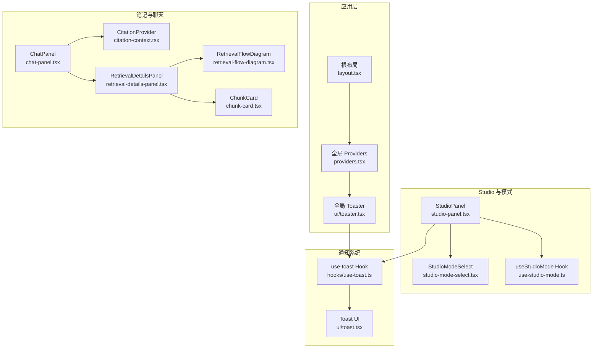
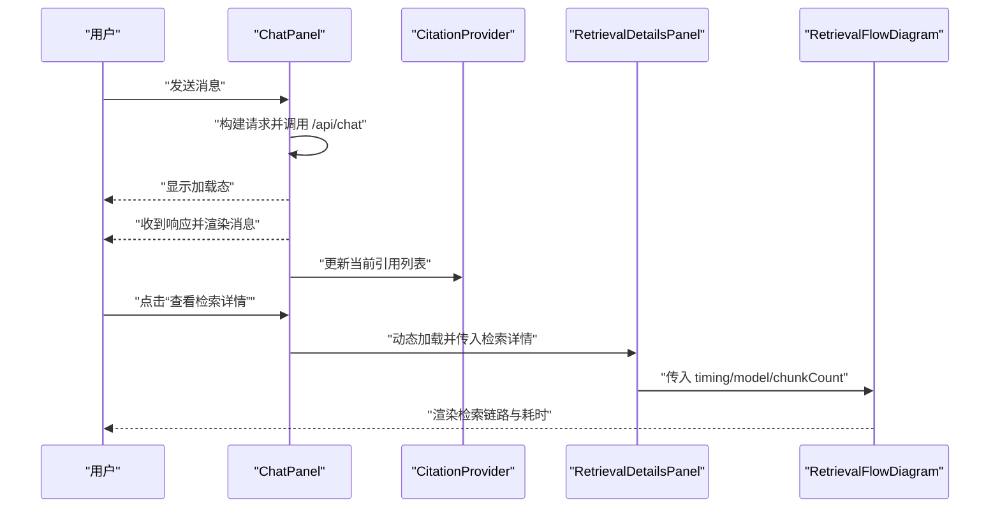
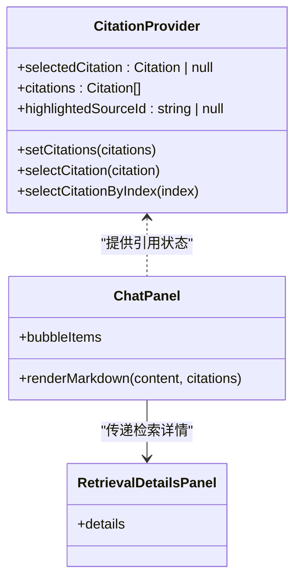
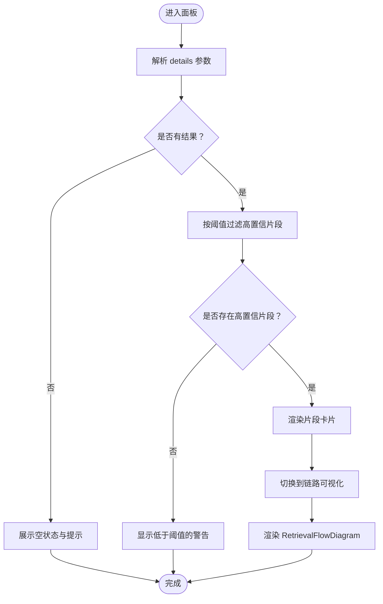
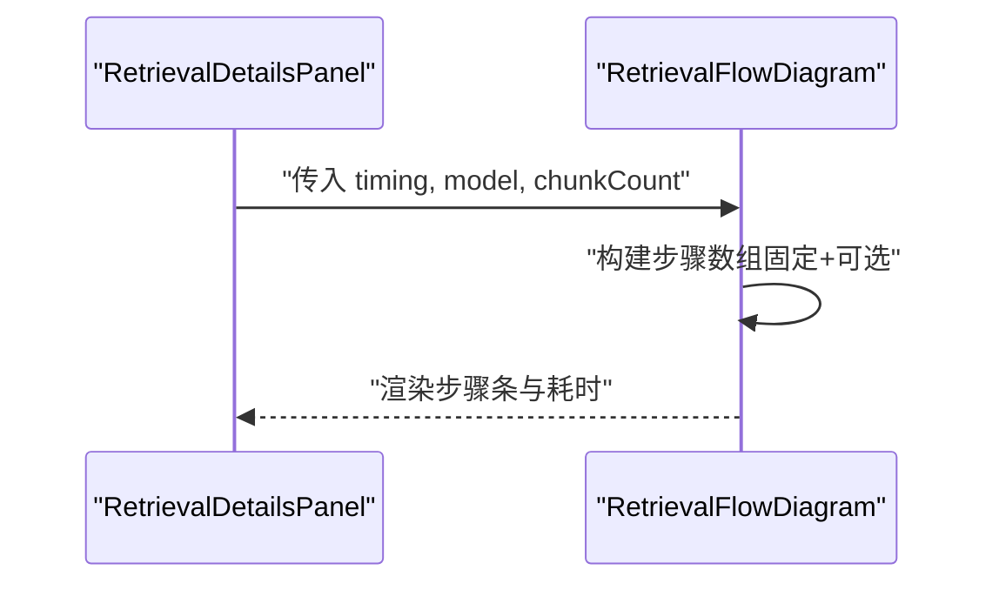
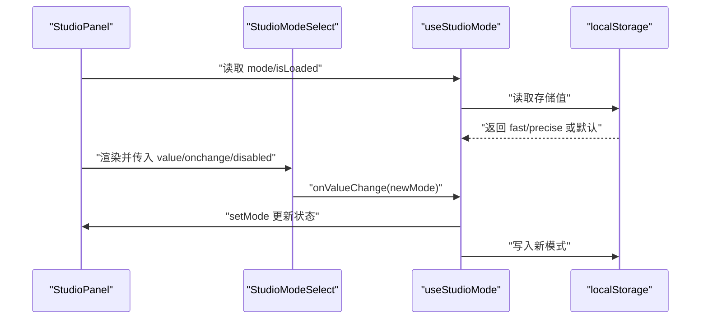
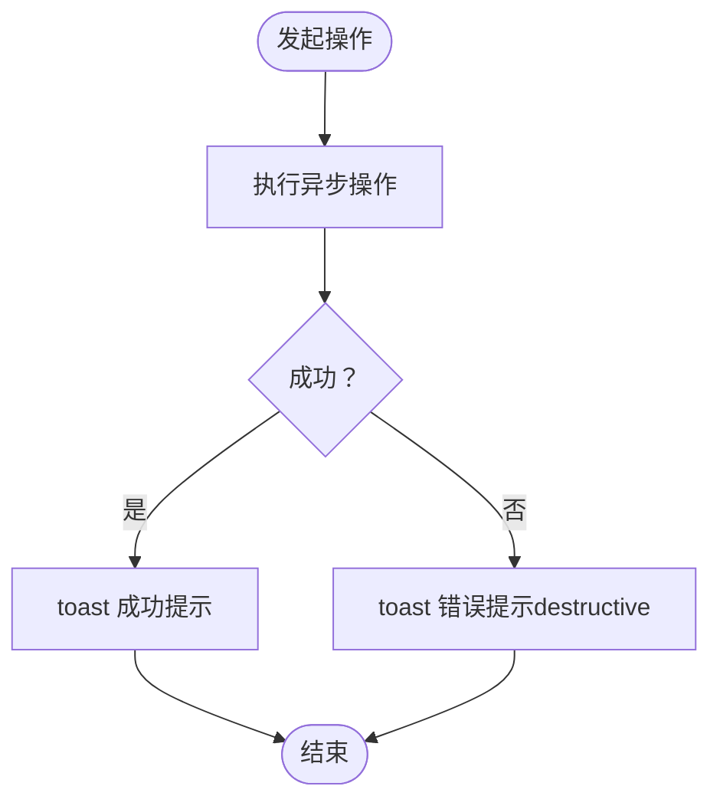
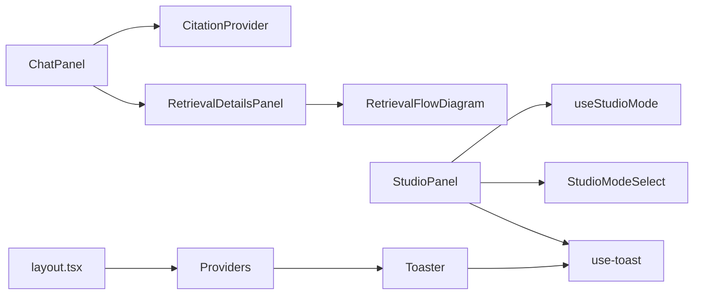

# 交互设计与状态管理

<cite>
**本文档引用的文件**
- [components/providers.tsx](file://components/providers.tsx)
- [app/layout.tsx](file://app/layout.tsx)
- [hooks/use-studio-mode.ts](file://hooks/use-studio-mode.ts)
- [hooks/use-toast.ts](file://hooks/use-toast.ts)
- [components/ui/toast.tsx](file://components/ui/toast.tsx)
- [components/ui/toaster.tsx](file://components/ui/toaster.tsx)
- [components/notebook/citation-context.tsx](file://components/notebook/citation-context.tsx)
- [components/notebook/chat-panel.tsx](file://components/notebook/chat-panel.tsx)
- [components/notebook/retrieval-details-panel.tsx](file://components/notebook/retrieval-details-panel.tsx)
- [components/notebook/retrieval-flow-diagram.tsx](file://components/notebook/retrieval-flow-diagram.tsx)
- [components/notebook/studio-mode-select.tsx](file://components/notebook/studio-mode-select.tsx)
- [components/notebook/studio-panel.tsx](file://components/notebook/studio-panel.tsx)
- [components/notebook/chunk-card.tsx](file://components/notebook/chunk-card.tsx)
- [lib/rag/prompt.ts](file://lib/rag/prompt.ts)
</cite>

## 目录
1. [简介](#简介)
2. [项目结构](#项目结构)
3. [核心组件](#核心组件)
4. [架构总览](#架构总览)
5. [详细组件分析](#详细组件分析)
6. [依赖关系分析](#依赖关系分析)
7. [性能考量](#性能考量)
8. [故障排查指南](#故障排查指南)
9. [结论](#结论)
10. [附录](#附录)

## 简介
本文件聚焦 notebookLM-clone 项目的交互设计与状态管理，围绕以下目标进行系统化梳理：
- CitationProvider 引用上下文的状态管理与引用高亮联动
- RetrievalDetailsPanel 检索详情面板的动态更新与 Tab 切换
- RetrievalFlowDiagram 检索流程图的可视化展示与时间指标呈现
- StudioMode 的状态切换机制（Fast/Precise），以及用户偏好持久化
- 组件间的状态提升策略、全局状态管理、局部状态优化与状态同步
- 用户操作反馈设计（加载、错误、成功提示）
- 动画与过渡效果的实现思路（页面切换、组件显隐、数据更新）
- 手势与键盘快捷键支持（触摸、鼠标、键盘导航）

## 项目结构
项目采用 Next.js App Router 结构，UI 层以组件为中心组织，状态管理通过 React Context、自定义 Hook 与全局 Provider 协同实现；RAG 相关的数据流贯穿 ChatPanel、CitationProvider、RetrievalDetailsPanel 与 RetrievalFlowDiagram。

图表来源
- [app/layout.tsx](file://app/layout.tsx#L15-L30)
- [components/providers.tsx](file://components/providers.tsx#L16-L33)
- [components/ui/toaster.tsx](file://components/ui/toaster.tsx#L12-L27)
- [components/notebook/chat-panel.tsx](file://components/notebook/chat-panel.tsx#L60-L161)
- [components/notebook/citation-context.tsx](file://components/notebook/citation-context.tsx#L46-L88)
- [components/notebook/retrieval-details-panel.tsx](file://components/notebook/retrieval-details-panel.tsx#L42-L158)
- [components/notebook/retrieval-flow-diagram.tsx](file://components/notebook/retrieval-flow-diagram.tsx#L16-L81)
- [components/notebook/chunk-card.tsx](file://components/notebook/chunk-card.tsx#L26-L93)
- [components/notebook/studio-panel.tsx](file://components/notebook/studio-panel.tsx#L25-L260)
- [components/notebook/studio-mode-select.tsx](file://components/notebook/studio-mode-select.tsx#L30-L64)
- [hooks/use-studio-mode.ts](file://hooks/use-studio-mode.ts#L14-L38)
- [hooks/use-toast.ts](file://hooks/use-toast.ts#L77-L130)
- [components/ui/toast.tsx](file://components/ui/toast.tsx#L10-L42)

章节来源
- [app/layout.tsx](file://app/layout.tsx#L15-L30)
- [components/providers.tsx](file://components/providers.tsx#L16-L33)
- [components/ui/toaster.tsx](file://components/ui/toaster.tsx#L12-L27)

## 核心组件
- CitationProvider：集中管理当前选中引用、引用列表与高亮 Source ID，支持按索引选择引用，用于侧边引用详情与高亮联动。
- RetrievalDetailsPanel：根据检索结果动态渲染“检索片段”和“链路可视化”两个标签页，支持阈值提示、混合检索标识与分页滚动。
- RetrievalFlowDiagram：以步骤条形式展示检索链路（用户问题、向量化、混合检索、召回片段、可选生成阶段），并显示耗时统计。
- StudioPanel：管理产物生成流程（摘要、大纲、测验、思维导图），集成 StudioModeSelect 与 useStudioMode Hook，统一处理加载、生成、删除与成功/错误提示。
- useStudioMode Hook：提供 Fast/Precise 模式状态与持久化，首次加载时从 localStorage 读取，变更时写回。
- use-toast Hook 与 Toast UI：提供全局通知队列、自动移除、变体样式与订阅监听，配合 Toaster 在页面顶部展示。

章节来源
- [components/notebook/citation-context.tsx](file://components/notebook/citation-context.tsx#L46-L88)
- [components/notebook/retrieval-details-panel.tsx](file://components/notebook/retrieval-details-panel.tsx#L42-L158)
- [components/notebook/retrieval-flow-diagram.tsx](file://components/notebook/retrieval-flow-diagram.tsx#L16-L81)
- [components/notebook/studio-panel.tsx](file://components/notebook/studio-panel.tsx#L25-L260)
- [components/notebook/studio-mode-select.tsx](file://components/notebook/studio-mode-select.tsx#L30-L64)
- [hooks/use-studio-mode.ts](file://hooks/use-studio-mode.ts#L14-L38)
- [hooks/use-toast.ts](file://hooks/use-toast.ts#L77-L130)
- [components/ui/toast.tsx](file://components/ui/toast.tsx#L10-L42)

## 架构总览
整体交互与状态流以 ChatPanel 为核心枢纽，结合 CitationProvider 实现引用高亮与侧边详情联动；检索详情通过动态导入的 RetrievalDetailsPanel 展示；StudioPanel 负责产物生成与模式切换，并通过 use-toast 提供统一反馈。

图表来源
- [components/notebook/chat-panel.tsx](file://components/notebook/chat-panel.tsx#L171-L300)
- [components/notebook/citation-context.tsx](file://components/notebook/citation-context.tsx#L46-L88)
- [components/notebook/retrieval-details-panel.tsx](file://components/notebook/retrieval-details-panel.tsx#L138-L155)
- [components/notebook/retrieval-flow-diagram.tsx](file://components/notebook/retrieval-flow-diagram.tsx#L16-L81)

## 详细组件分析

### CitationProvider 引用上下文状态管理
- 状态结构
  - selectedCitation：当前选中的引用对象
  - citations：引用列表（带索引）
  - highlightedSourceId：高亮的来源 ID
- 关键方法
  - setCitations：仅在列表真正变化时更新，避免不必要的重渲染；同时为每个引用分配连续索引
  - selectCitation：设置选中引用并同步高亮来源
  - selectCitationByIndex：通过索引查找并选中引用
- 与 ChatPanel 的联动
  - ChatPanel 在消息渲染时注入引用列表，并在“查看检索详情”弹窗中传递给 RetrievalDetailsPanel
  - 引用卡片点击触发 selectCitationByIndex，实现引用高亮与侧边详情联动

图表来源
- [components/notebook/citation-context.tsx](file://components/notebook/citation-context.tsx#L46-L88)
- [components/notebook/chat-panel.tsx](file://components/notebook/chat-panel.tsx#L103-L161)
- [components/notebook/retrieval-details-panel.tsx](file://components/notebook/retrieval-details-panel.tsx#L42-L94)

章节来源
- [components/notebook/citation-context.tsx](file://components/notebook/citation-context.tsx#L46-L88)
- [components/notebook/chat-panel.tsx](file://components/notebook/chat-panel.tsx#L103-L161)

### RetrievalDetailsPanel 动态更新与 Tab 切换
- 功能要点
  - 检索参数区：展示检索方式（向量/混合）、Top K、范围、阈值、返回片段数
  - 片段列表：高置信片段（≥阈值）优先展示；若全部低于阈值，给出提示
  - 链路可视化：切换至“链路可视化”标签页，渲染 RetrievalFlowDiagram
- 数据驱动
  - 通过 props 接收 details 对象，内部计算 hasResults、highConfidenceChunks 并决定 UI 展示
  - 使用 ScrollArea 保证长列表可滚动

图表来源
- [components/notebook/retrieval-details-panel.tsx](file://components/notebook/retrieval-details-panel.tsx#L42-L158)
- [components/notebook/retrieval-flow-diagram.tsx](file://components/notebook/retrieval-flow-diagram.tsx#L16-L81)

章节来源
- [components/notebook/retrieval-details-panel.tsx](file://components/notebook/retrieval-details-panel.tsx#L42-L158)

### RetrievalFlowDiagram 可视化展示
- 步骤序列
  - 用户问题 → 向量化（Embedding）→ 混合检索（pgvector + FTS）→ 召回片段（chunks 数量）
  - 若存在 generation 时间，追加“生成回答”步骤
- 交互细节
  - 每步包含图标、主标题与子标题（如耗时），颜色区分步骤类型
  - 底部显示总耗时（total）

图表来源
- [components/notebook/retrieval-details-panel.tsx](file://components/notebook/retrieval-details-panel.tsx#L146-L154)
- [components/notebook/retrieval-flow-diagram.tsx](file://components/notebook/retrieval-flow-diagram.tsx#L16-L81)

章节来源
- [components/notebook/retrieval-flow-diagram.tsx](file://components/notebook/retrieval-flow-diagram.tsx#L16-L81)

### StudioMode 状态切换与偏好持久化
- 模式枚举：fast | precise
- 生命周期
  - 初始化：从 localStorage 读取存储值，若合法则设为初始模式，标记 isLoaded
  - 切换：setMode 更新状态并写入 localStorage
- 与 StudioPanel 集成
  - StudioPanel 通过 useStudioMode 获取 mode、setMode、isLoaded
  - StudioModeSelect 作为受控组件，禁用生成期间的切换
  - 精准模式下显示耗时较长的提示

图表来源
- [components/notebook/studio-panel.tsx](file://components/notebook/studio-panel.tsx#L25-L184)
- [components/notebook/studio-mode-select.tsx](file://components/notebook/studio-mode-select.tsx#L30-L64)
- [hooks/use-studio-mode.ts](file://hooks/use-studio-mode.ts#L14-L38)

章节来源
- [hooks/use-studio-mode.ts](file://hooks/use-studio-mode.ts#L14-L38)
- [components/notebook/studio-mode-select.tsx](file://components/notebook/studio-mode-select.tsx#L30-L64)
- [components/notebook/studio-panel.tsx](file://components/notebook/studio-panel.tsx#L25-L184)

### 组件状态提升与同步策略
- ChatPanel
  - 局部状态：messages、input、isLoading、currentCitations、suggestedQuestions
  - 全局状态：通过 CitationProvider 管理引用上下文，避免在 ChatPanel 内重复维护
  - 同步点：消息渲染时将 citations 注入，引用点击回调触发 selectCitationByIndex
- StudioPanel
  - 局部状态：artifacts、selectedArtifact、isGenerating、generatingType、isLoading、activeTab
  - 全局状态：useStudioMode 提供模式状态；use-toast 提供通知状态
  - 同步点：生成成功后将新产物插入列表顶部并选中；删除后同步更新列表与选中项
- RetrievalDetailsPanel
  - 局部状态：基于 props 的只读渲染，内部不维护状态
  - 同步点：由 ChatPanel 通过动态导入传入 details，确保与当前检索结果一致

章节来源
- [components/notebook/chat-panel.tsx](file://components/notebook/chat-panel.tsx#L60-L161)
- [components/notebook/studio-panel.tsx](file://components/notebook/studio-panel.tsx#L25-L111)
- [components/notebook/retrieval-details-panel.tsx](file://components/notebook/retrieval-details-panel.tsx#L42-L94)

### 用户操作反馈设计
- 成功反馈
  - 生成产物成功：toast 显示类型与耗时
  - 删除产物成功：toast 显示“已删除”
- 错误反馈
  - 生成失败：toast 显示错误标题与描述，变更为 destructive
  - 删除失败：toast 显示错误标题与描述，变更为 destructive
- 加载反馈
  - StudioPanel：生成中显示 isGenerating，禁用模式切换；加载产物时显示“加载中…”
  - ChatPanel：AI 回复时显示 loading 状态
- 通知系统
  - use-toast：限制最多 3 条通知，自动 2.5 秒后移除
  - Toaster：全局挂载于页面右上角，Toast UI 支持多种变体

图表来源
- [components/notebook/studio-panel.tsx](file://components/notebook/studio-panel.tsx#L94-L137)
- [hooks/use-toast.ts](file://hooks/use-toast.ts#L77-L130)
- [components/ui/toast.tsx](file://components/ui/toast.tsx#L27-L42)

章节来源
- [components/notebook/studio-panel.tsx](file://components/notebook/studio-panel.tsx#L94-L137)
- [hooks/use-toast.ts](file://hooks/use-toast.ts#L77-L130)
- [components/ui/toast.tsx](file://components/ui/toast.tsx#L27-L42)

### 动画与过渡效果实现方案
- 页面与组件显隐
  - 动态导入：ChatPanel 中对 RetrievalDetailsPanel 使用动态导入，加载时显示轻提示，避免阻塞主线程
  - 抽屉弹窗：使用 Sheet 控制右侧详情面板的打开/关闭
- 数据更新动画
  - ChunkCard：使用进度条与百分比展示相似度，支持展开/收起，减少长文本渲染压力
  - Toast：基于 Radix UI 的滑入/滑出与淡出动画，提供自然的过渡
- 建议实现
  - 为 Tabs 切换增加过渡类名（例如在激活态添加透明度渐变）
  - 为列表项新增/删除时加入入场/离场动画（可借助第三方库或 CSS 过渡）
  - 为按钮点击与模式切换增加微动效（如按压缩放）

章节来源
- [components/notebook/chat-panel.tsx](file://components/notebook/chat-panel.tsx#L38-L42)
- [components/notebook/chunk-card.tsx](file://components/notebook/chunk-card.tsx#L26-L93)
- [components/ui/toast.tsx](file://components/ui/toast.tsx#L27-L42)

### 手势与键盘快捷键支持
- 触摸与鼠标
  - 引用卡片与片段卡片支持点击展开/收起，适合移动端与桌面端
  - StudioModeSelect 使用 Ant Design Select，具备良好的触控反馈
- 键盘导航
  - 当前组件未实现专用键盘快捷键；可在后续迭代中考虑：
    - Tab 切换：在 StudioPanel 的标签页之间使用 Tab/Shift+Tab 导航
    - 引用导航：通过数字键快速跳转到对应引用（结合引用索引）
    - 生成快捷：在 StudioPanel 中为生成按钮绑定 Enter 键触发
  - 建议实现
    - 为关键按钮添加 aria-label 与 role，提升可访问性
    - 为 Select/Sheet 等组件补充键盘打开/关闭行为

章节来源
- [components/notebook/studio-mode-select.tsx](file://components/notebook/studio-mode-select.tsx#L30-L64)
- [components/notebook/chunk-card.tsx](file://components/notebook/chunk-card.tsx#L78-L89)

## 依赖关系分析

图表来源
- [components/notebook/chat-panel.tsx](file://components/notebook/chat-panel.tsx#L60-L161)
- [components/notebook/retrieval-details-panel.tsx](file://components/notebook/retrieval-details-panel.tsx#L146-L154)
- [components/notebook/retrieval-flow-diagram.tsx](file://components/notebook/retrieval-flow-diagram.tsx#L16-L81)
- [components/notebook/studio-panel.tsx](file://components/notebook/studio-panel.tsx#L25-L184)
- [hooks/use-studio-mode.ts](file://hooks/use-studio-mode.ts#L14-L38)
- [app/layout.tsx](file://app/layout.tsx#L23-L26)
- [components/providers.tsx](file://components/providers.tsx#L16-L33)
- [components/ui/toaster.tsx](file://components/ui/toaster.tsx#L12-L27)

章节来源
- [components/notebook/chat-panel.tsx](file://components/notebook/chat-panel.tsx#L60-L161)
- [components/notebook/studio-panel.tsx](file://components/notebook/studio-panel.tsx#L25-L184)

## 性能考量
- 渲染优化
  - ChatPanel 使用 useMemo 将消息转换为 Bubble.List 的 items，避免每次渲染都重新构造
  - 动态导入 RetrievalDetailsPanel，减少首屏包体积
- 状态最小化
  - CitationProvider 仅在列表真正变化时更新，降低重渲染频率
  - StudioPanel 将生成状态与 UI 状态分离，避免无关状态影响渲染
- I/O 与缓存
  - useStudioMode 与 ChatPanel 的模型选择均使用 localStorage 缓存，减少网络请求
- 建议
  - 对长列表（如 ChunkCard）启用虚拟滚动（Virtualized List）
  - 对频繁切换的 Tabs 内容进行懒加载与卸载策略

章节来源
- [components/notebook/chat-panel.tsx](file://components/notebook/chat-panel.tsx#L111-L161)
- [components/notebook/citation-context.tsx](file://components/notebook/citation-context.tsx#L51-L61)
- [components/notebook/studio-panel.tsx](file://components/notebook/studio-panel.tsx#L34-L51)

## 故障排查指南
- 引用未高亮或点击无效
  - 检查 CitationProvider 是否包裹 ChatPanel
  - 确认 selectCitationByIndex 的 index 与引用索引一致
- 检索详情为空或不更新
  - 确认 ChatPanel 已将 retrievalDetails 传入 RetrievalDetailsPanel
  - 检查动态导入是否成功加载
- Studio 生成失败
  - 查看控制台错误日志与 toast 错误提示
  - 确认 /api/studio/generate 接口返回格式正确
- 模式切换未持久化
  - 检查 localStorage 中是否存在 "studio-mode" 键
  - 确认 setMode 调用路径与存储写入逻辑

章节来源
- [components/notebook/citation-context.tsx](file://components/notebook/citation-context.tsx#L91-L97)
- [components/notebook/chat-panel.tsx](file://components/notebook/chat-panel.tsx#L125-L149)
- [components/notebook/studio-panel.tsx](file://components/notebook/studio-panel.tsx#L94-L137)
- [hooks/use-studio-mode.ts](file://hooks/use-studio-mode.ts#L28-L31)

## 结论
本项目在交互设计与状态管理方面体现了清晰的职责划分与良好的扩展性：
- 通过 CitationProvider 与 ChatPanel 的协作，实现了引用高亮与详情联动
- RetrievalDetailsPanel 与 RetrievalFlowDiagram 将复杂检索链路以直观方式呈现
- StudioPanel 与 StudioModeSelect 有效整合了用户偏好与生成流程
- use-toast 与全局 Toaster 提供一致的反馈体验
建议在后续迭代中进一步增强键盘导航、可访问性与动画细节，以提升整体交互品质。

## 附录
- 引用去重与索引生成
  - RAG 提示模块在构建 Citations 时进行去重与排序，确保引用质量
  - ChatPanel 与 CitationProvider 均依赖索引进行引用高亮与点击定位

章节来源
- [lib/rag/prompt.ts](file://lib/rag/prompt.ts#L112-L148)
- [components/notebook/chat-panel.tsx](file://components/notebook/chat-panel.tsx#L103-L109)
- [components/notebook/citation-context.tsx](file://components/notebook/citation-context.tsx#L68-L73)