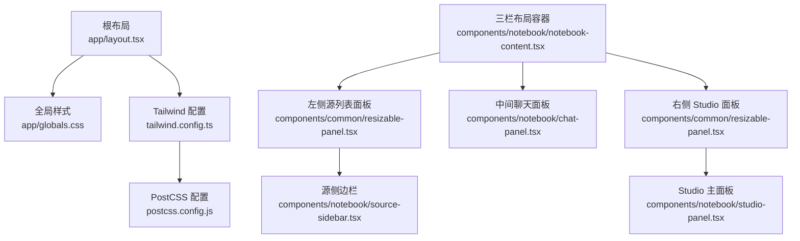
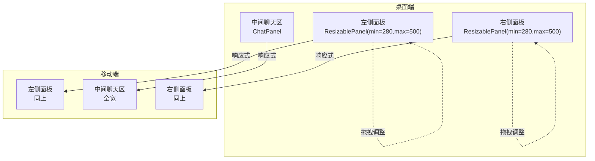
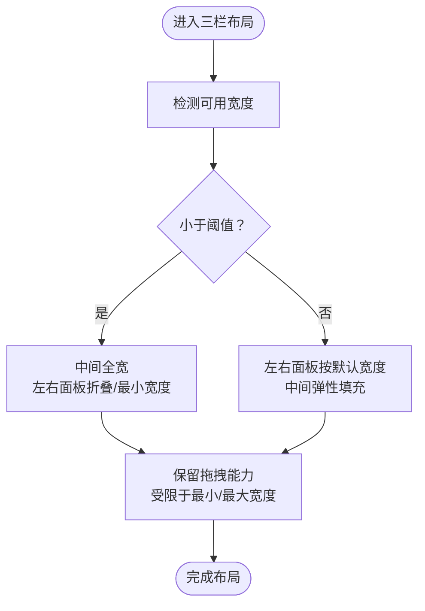
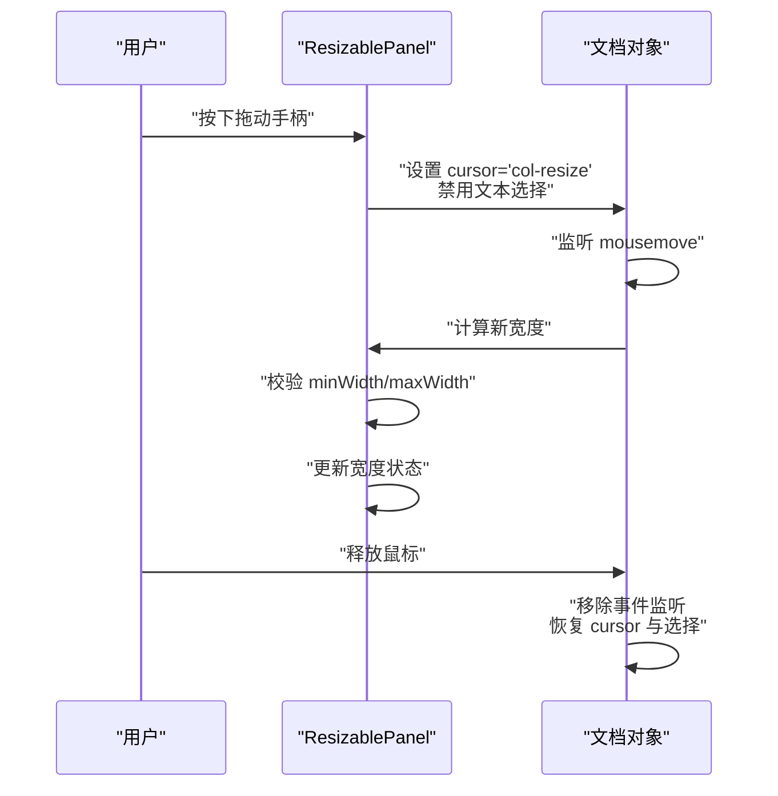
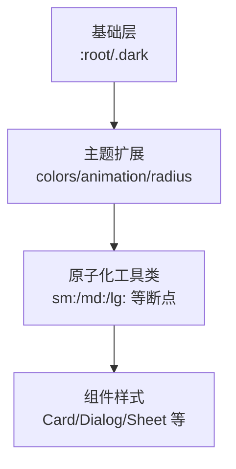
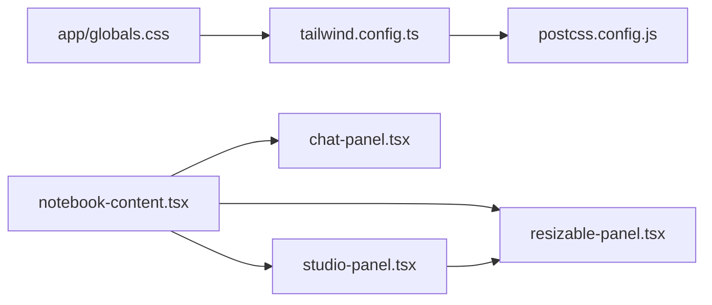

# 响应式设计与布局

<cite>
**本文引用的文件**
- [app/layout.tsx](file://app/layout.tsx)
- [app/globals.css](file://app/globals.css)
- [tailwind.config.ts](file://tailwind.config.ts)
- [postcss.config.js](file://postcss.config.js)
- [components/common/resizable-panel.tsx](file://components/common/resizable-panel.tsx)
- [components/notebook/notebook-content.tsx](file://components/notebook/notebook-content.tsx)
- [components/notebook/source-sidebar.tsx](file://components/notebook/source-sidebar.tsx)
- [components/notebook/chat-panel.tsx](file://components/notebook/chat-panel.tsx)
- [components/notebook/studio-panel.tsx](file://components/notebook/studio-panel.tsx)
- [components/notebook/notebook-list.tsx](file://components/notebook/notebook-list.tsx)
- [components/ui/dialog.tsx](file://components/ui/dialog.tsx)
- [components/ui/sheet.tsx](file://components/ui/sheet.tsx)
</cite>

## 目录
1. [简介](#简介)
2. [项目结构](#项目结构)
3. [核心组件](#核心组件)
4. [架构总览](#架构总览)
5. [详细组件分析](#详细组件分析)
6. [依赖关系分析](#依赖关系分析)
7. [性能考量](#性能考量)
8. [故障排查指南](#故障排查指南)
9. [结论](#结论)
10. [附录](#附录)

## 简介
本文件面向 notebookLM-clone 项目的响应式设计与布局，系统性梳理三栏布局在不同屏幕尺寸下的适配策略、可调整面板在移动端的交互优化、Tailwind CSS 原子化样式的应用方式、移动端与桌面端的差异化体验、无障碍访问支持以及调试技巧。目标是帮助开发者在不牺牲可用性的前提下，实现一致且高效的跨平台体验。

## 项目结构
本项目采用 Next.js App Router 结构，样式通过 Tailwind CSS 与 PostCSS 构建，全局主题变量与暗色模式在全局样式中集中管理；三栏布局由 NotebookContent 组件承载，左右两侧为可调整面板，中间为聊天区。

**图表来源**
- [app/layout.tsx](file://app/layout.tsx#L15-L30)
- [app/globals.css](file://app/globals.css#L1-L225)
- [tailwind.config.ts](file://tailwind.config.ts#L1-L95)
- [postcss.config.js](file://postcss.config.js#L1-L6)
- [components/notebook/notebook-content.tsx](file://components/notebook/notebook-content.tsx#L71-L127)
- [components/common/resizable-panel.tsx](file://components/common/resizable-panel.tsx#L20-L92)
- [components/notebook/chat-panel.tsx](file://components/notebook/chat-panel.tsx#L357-L412)
- [components/notebook/studio-panel.tsx](file://components/notebook/studio-panel.tsx#L25-L260)
- [components/notebook/source-sidebar.tsx](file://components/notebook/source-sidebar.tsx#L49-L316)

**章节来源**
- [app/layout.tsx](file://app/layout.tsx#L15-L30)
- [app/globals.css](file://app/globals.css#L5-L96)
- [tailwind.config.ts](file://tailwind.config.ts#L1-L95)
- [postcss.config.js](file://postcss.config.js#L1-L6)

## 核心组件
- 三栏布局容器：NotebookContent 将左右两侧的 ResizablePanel 与中间 ChatPanel 组合，形成可调整的三栏界面。
- 可调整面板：ResizablePanel 提供拖拽调整宽度的能力，默认最小/最大宽度与拖拽方向可配置。
- 源侧边栏：SourceSidebar 在左侧面板中展示与管理知识源，支持搜索、队列与展开收起等交互。
- 聊天面板：ChatPanel 使用 Ant Design X 的 Bubble/Sender 实现消息流式渲染与输入，支持检索详情弹出。
- Studio 面板：StudioPanel 提供产物生成、模板库与产物列表管理。

**章节来源**
- [components/notebook/notebook-content.tsx](file://components/notebook/notebook-content.tsx#L71-L127)
- [components/common/resizable-panel.tsx](file://components/common/resizable-panel.tsx#L20-L92)
- [components/notebook/source-sidebar.tsx](file://components/notebook/source-sidebar.tsx#L49-L316)
- [components/notebook/chat-panel.tsx](file://components/notebook/chat-panel.tsx#L357-L412)
- [components/notebook/studio-panel.tsx](file://components/notebook/studio-panel.tsx#L25-L260)

## 架构总览
三栏布局在桌面端以固定宽度的左右面板与弹性中间区域为主；在移动端通过响应式工具类与可调整面板的尺寸限制实现最佳可用性。Tailwind 提供断点与原子化样式，配合全局主题变量与暗色模式，确保视觉一致性。

**图表来源**
- [components/notebook/notebook-content.tsx](file://components/notebook/notebook-content.tsx#L85-L127)
- [components/common/resizable-panel.tsx](file://components/common/resizable-panel.tsx#L20-L92)

## 详细组件分析

### 三栏布局与断点策略
- 容器结构：NotebookContent 使用 Flex 布局，左右两侧为 ResizablePanel，中间为 ChatPanel，整体通过 gap 与 min-h-0 控制空间分配。
- 断点与优先级：
  - 移动端优先保证中间聊天区的可读性与交互完整性，左右面板在窄屏下仍保持可调整能力，但默认宽度与最小宽度限制更严格。
  - 桌面端允许更大的面板宽度，提升 Studio 与源列表的可操作性。
- 响应式工具类：在对话详情弹出层中使用 sm: 前缀控制宽度，确保在小屏设备上仍具备良好可读性。

**图表来源**
- [components/notebook/notebook-content.tsx](file://components/notebook/notebook-content.tsx#L85-L127)
- [components/common/resizable-panel.tsx](file://components/common/resizable-panel.tsx#L20-L92)

**章节来源**
- [components/notebook/notebook-content.tsx](file://components/notebook/notebook-content.tsx#L85-L127)
- [components/ui/sheet.tsx](file://components/ui/sheet.tsx#L40-L43)

### ResizablePanel 可调整面板的交互优化
- 拖拽逻辑：通过 mousemove/mouseup 监听计算新宽度，并根据 side 参数决定从左或从右调整。
- 尺寸限制：始终约束在 minWidth 与 maxWidth 之间，避免过窄导致不可用。
- 触摸友好：当前实现基于鼠标事件，建议在移动端结合 touch 事件与指针事件进行统一处理，以获得更顺滑的拖拽体验。
- 视觉反馈：拖拽时设置 body 的 cursor 与 userSelect，提升交互明确性。

**图表来源**
- [components/common/resizable-panel.tsx](file://components/common/resizable-panel.tsx#L32-L65)

**章节来源**
- [components/common/resizable-panel.tsx](file://components/common/resizable-panel.tsx#L20-L92)

### Tailwind CSS 原子化样式与自定义断点
- 主题变量：全局样式中定义了明/暗两套 HSL 变量，配合 Tailwind colors 扩展，使组件样式与全局主题一致。
- 动画与关键帧：通过 theme.extend.animation 与 keyframes 定义淡入与滑入动画，用于组件过渡。
- 圆角半径：通过 theme.extend.borderRadius 使用全局变量，确保视觉统一。
- 响应式前缀：广泛使用 sm:、md:、lg: 等断点前缀，如对话详情弹窗的 sm:w-[540px]、列表网格的 md:grid-cols-2/lg:grid-cols-3。
- 自定义断点：当前仓库未显式扩展 Tailwind 断点，若需更细粒度控制，可在 tailwind.config.ts 的 theme.extend.screens 中新增断点。

**图表来源**
- [app/globals.css](file://app/globals.css#L5-L96)
- [tailwind.config.ts](file://tailwind.config.ts#L10-L86)

**章节来源**
- [app/globals.css](file://app/globals.css#L5-L96)
- [tailwind.config.ts](file://tailwind.config.ts#L10-L86)
- [components/notebook/notebook-list.tsx](file://components/notebook/notebook-list.tsx#L42-L48)
- [components/ui/sheet.tsx](file://components/ui/sheet.tsx#L40-L43)

### 移动端特殊处理与性能优化
- 视口与字体：根布局设置 html lang="zh-CN"，并引入 Google Fonts，确保移动端排版清晰。
- 对话弹窗：在小屏设备上使用 sm:max-w-xx 控制弹窗宽度，避免横向滚动。
- 滚动与性能：聊天面板使用固定高度与内部滚动，避免整页滚动；Studio 列表与源列表均采用 overflow-auto 与合理的容器高度，减少重绘。
- 交互元素：按钮与输入框在移动端保持合适的触控尺寸与间距，提升可点选性。

**章节来源**
- [app/layout.tsx](file://app/layout.tsx#L15-L30)
- [components/ui/dialog.tsx](file://components/ui/dialog.tsx#L36-L53)
- [components/notebook/chat-panel.tsx](file://components/notebook/chat-panel.tsx#L357-L412)
- [components/notebook/studio-panel.tsx](file://components/notebook/studio-panel.tsx#L231-L257)

### 桌面端增强体验
- 键盘快捷键：聊天输入框支持 Enter 发送，便于快速交互。
- 鼠标悬停：拖拽手柄在 group-hover 下显示，提升可发现性。
- 高分辨率显示：全局样式中对滚动条颜色与圆角半径进行定制，适配高 DPI 屏幕。

**章节来源**
- [components/notebook/chat-panel.tsx](file://components/notebook/chat-panel.tsx#L396-L407)
- [components/common/resizable-panel.tsx](file://components/common/resizable-panel.tsx#L76-L89)
- [app/globals.css](file://app/globals.css#L129-L158)

### 无障碍访问支持
- 屏幕阅读器：对话弹窗的关闭按钮包含 sr-only 文本“关闭”，便于读屏软件识别。
- 对比度与色彩：通过明/暗两套 HSL 主题变量，确保在不同背景下维持可读性与对比度。
- 焦点与键盘导航：组件普遍使用语义化标签与原生交互，建议在后续迭代中补充键盘可达性测试与焦点管理。

**章节来源**
- [components/ui/dialog.tsx](file://components/ui/dialog.tsx#L47-L50)
- [app/globals.css](file://app/globals.css#L46-L81)

## 依赖关系分析
- 全局样式依赖 Tailwind 基础层与工具类，通过 @apply 统一基线。
- 组件样式依赖全局主题变量与 Tailwind 扩展，确保一致性。
- 三栏布局依赖 ResizablePanel 的拖拽逻辑与容器 Flex 布局。

**图表来源**
- [app/globals.css](file://app/globals.css#L1-L3)
- [tailwind.config.ts](file://tailwind.config.ts#L1-L95)
- [postcss.config.js](file://postcss.config.js#L1-L6)
- [components/notebook/notebook-content.tsx](file://components/notebook/notebook-content.tsx#L85-L127)
- [components/common/resizable-panel.tsx](file://components/common/resizable-panel.tsx#L20-L92)
- [components/notebook/chat-panel.tsx](file://components/notebook/chat-panel.tsx#L357-L412)
- [components/notebook/studio-panel.tsx](file://components/notebook/studio-panel.tsx#L25-L260)

**章节来源**
- [app/globals.css](file://app/globals.css#L1-L3)
- [tailwind.config.ts](file://tailwind.config.ts#L1-L95)
- [postcss.config.js](file://postcss.config.js#L1-L6)
- [components/notebook/notebook-content.tsx](file://components/notebook/notebook-content.tsx#L85-L127)

## 性能考量
- 惰性加载：聊天面板对检索详情面板采用动态导入，减少初始包体。
- 滚动优化：固定高度 + 内部滚动，避免大列表引发的整页回流。
- 动画与过渡：使用轻量级动画与过渡，避免在低端设备上造成卡顿。
- 图像与资源：建议对图片与图标资源进行懒加载与压缩，进一步降低首屏时间。

[本节为通用指导，无需特定文件引用]

## 故障排查指南
- 布局异常
  - 检查三栏容器的 Flex 与 min-h-0 设置，确认中间区域正确填充。
  - 确认 ResizablePanel 的 minWidth/maxWidth 是否与父容器冲突。
- 响应式表现不佳
  - 核对 sm:/md:/lg: 断点前缀使用是否符合预期。
  - 若需要自定义断点，可在 tailwind.config.ts 中扩展 screens。
- 交互问题
  - 拖拽无效：检查鼠标事件绑定与 isResizing 状态。
  - 触摸设备体验差：建议增加 touch 事件与指针事件的统一处理。
- 无障碍问题
  - 弹窗关闭按钮缺少可读文本：确保包含 sr-only 文本。
  - 颜色对比度不足：检查明/暗主题变量的对比度是否满足 WCAG 要求。

**章节来源**
- [components/notebook/notebook-content.tsx](file://components/notebook/notebook-content.tsx#L85-L127)
- [components/common/resizable-panel.tsx](file://components/common/resizable-panel.tsx#L32-L65)
- [tailwind.config.ts](file://tailwind.config.ts#L10-L86)
- [components/ui/dialog.tsx](file://components/ui/dialog.tsx#L47-L50)

## 结论
本项目通过三栏布局与可调整面板，在桌面端提供高效的工作流，在移动端通过响应式断点与尺寸限制保障可用性。Tailwind 原子化样式与全局主题变量确保了视觉一致性与可维护性。建议在后续迭代中完善移动端触摸交互、自定义断点扩展与无障碍可达性测试，以进一步提升跨平台体验。

[本节为总结性内容，无需特定文件引用]

## 附录

### 常用媒体查询与断点示例
- 小屏设备：sm:（默认 640px 起步）
- 中屏设备：md:（默认 768px 起步）
- 大屏设备：lg:（默认 1024px 起步）
- 示例路径：
  - 对话详情弹窗宽度控制：[components/ui/sheet.tsx](file://components/ui/sheet.tsx#L40-L43)
  - 列表网格断点：[components/notebook/notebook-list.tsx](file://components/notebook/notebook-list.tsx#L42-L48)

**章节来源**
- [components/ui/sheet.tsx](file://components/ui/sheet.tsx#L40-L43)
- [components/notebook/notebook-list.tsx](file://components/notebook/notebook-list.tsx#L42-L48)

### 布局调试技巧
- 使用浏览器开发者工具的设备模拟器，逐级验证 sm/md/lg 表现。
- 临时为容器添加边框或背景色，快速定位布局问题。
- 在 ResizablePanel 上临时输出当前宽度，验证拖拽逻辑与限制生效。
- 检查全局样式中的 :root 与 .dark 块，确认主题变量覆盖是否生效。

**章节来源**
- [components/common/resizable-panel.tsx](file://components/common/resizable-panel.tsx#L28-L45)
- [app/globals.css](file://app/globals.css#L5-L96)