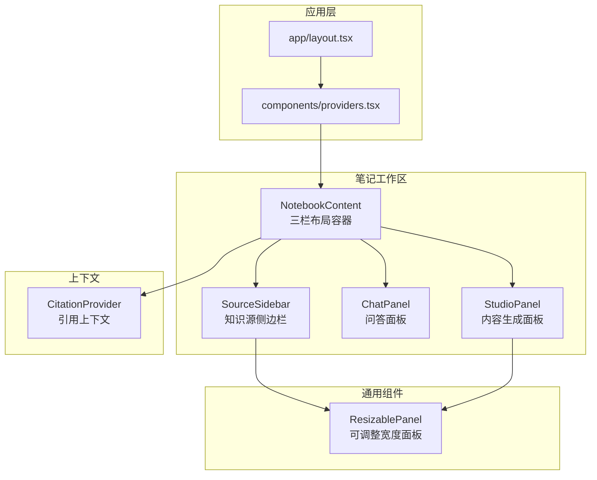
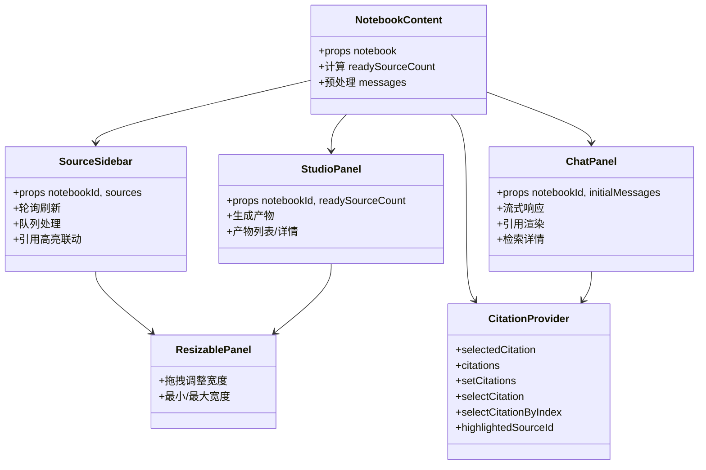
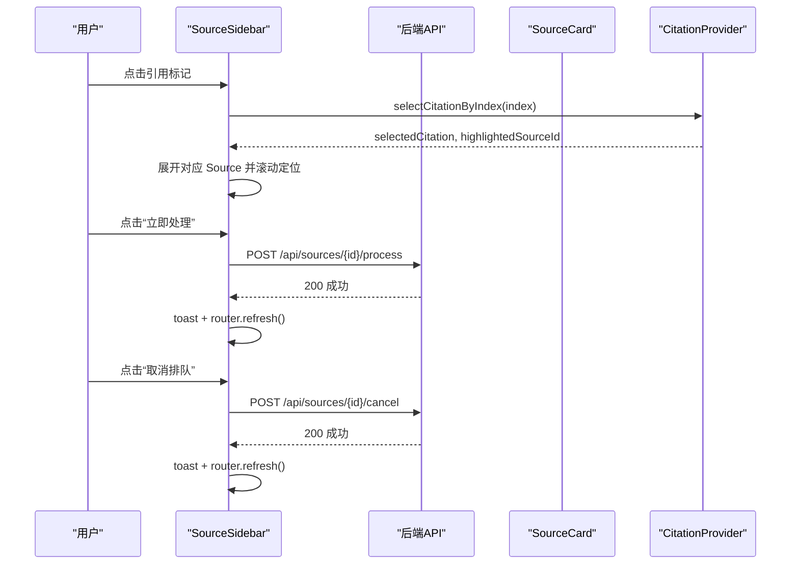
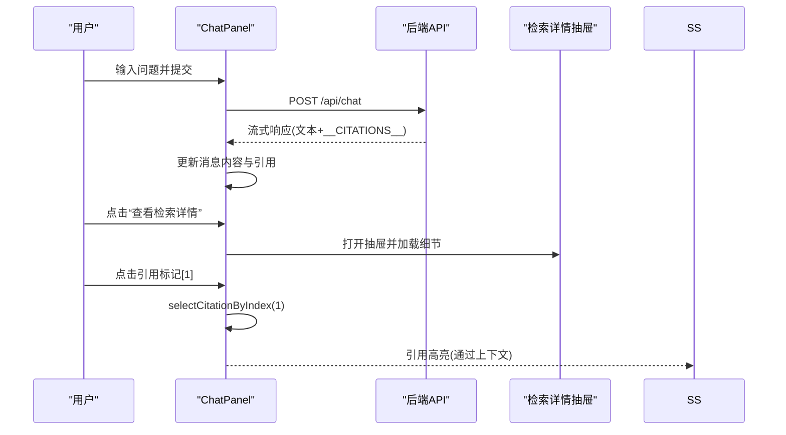
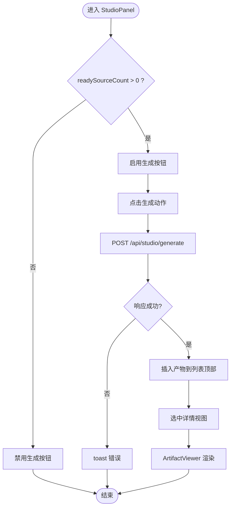
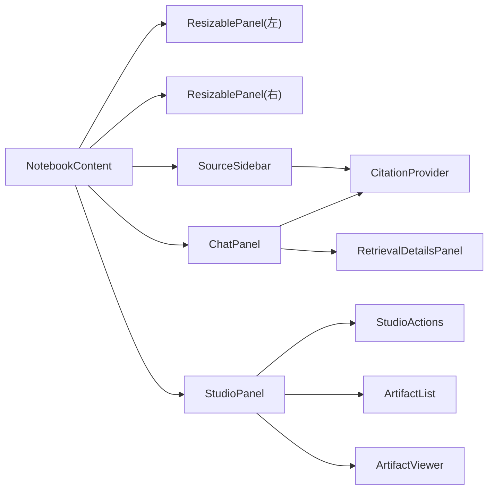

# 用户界面组件

<cite>
**本文档引用的文件**
- [components/notebook/notebook-content.tsx](file://components/notebook/notebook-content.tsx)
- [components/notebook/source-sidebar.tsx](file://components/notebook/source-sidebar.tsx)
- [components/notebook/chat-panel.tsx](file://components/notebook/chat-panel.tsx)
- [components/notebook/studio-panel.tsx](file://components/notebook/studio-panel.tsx)
- [components/common/resizable-panel.tsx](file://components/common/resizable-panel.tsx)
- [components/notebook/citation-context.tsx](file://components/notebook/citation-context.tsx)
- [components/notebook/source-card.tsx](file://components/notebook/source-card.tsx)
- [components/notebook/studio-actions.tsx](file://components/notebook/studio-actions.tsx)
- [components/notebook/artifact-list.tsx](file://components/notebook/artifact-list.tsx)
- [components/notebook/artifact-viewer.tsx](file://components/notebook/artifact-viewer.tsx)
- [components/notebook/retrieval-details-panel.tsx](file://components/notebook/retrieval-details-panel.tsx)
- [components/notebook/studio-mode-select.tsx](file://components/notebook/studio-mode-select.tsx)
- [components/providers.tsx](file://components/providers.tsx)
- [app/layout.tsx](file://app/layout.tsx)
- [tailwind.config.ts](file://tailwind.config.ts)
</cite>

## 目录
1. [简介](#简介)
2. [项目结构](#项目结构)
3. [核心组件](#核心组件)
4. [架构总览](#架构总览)
5. [组件详解](#组件详解)
6. [依赖关系分析](#依赖关系分析)
7. [性能考量](#性能考量)
8. [故障排查指南](#故障排查指南)
9. [结论](#结论)
10. [附录](#附录)

## 简介
本文件面向 notebookLM-clone 项目的用户界面组件，系统性梳理 NotebookContent 主界面、SourceSidebar 知识源侧边栏、ChatPanel 问答面板与 StudioPanel 内容生成面板的架构设计、状态管理、事件处理与样式体系。文档还涵盖组件间通信机制（props 传递、状态共享、事件冒泡）、响应式布局与移动端优化、可定制化指南（样式覆盖、主题配置、功能扩展）、无障碍支持（键盘导航、屏幕阅读器兼容、视觉辅助）、测试策略、性能优化与浏览器兼容性，并提供使用示例与最佳实践。

## 项目结构
UI 组件主要位于 components/notebook 与 components/common 下，采用按功能域划分的组织方式：
- components/notebook：业务域组件（NotebookContent、SourceSidebar、ChatPanel、StudioPanel 及其子组件）
- components/common：通用可复用组件（ResizablePanel）
- components/ui：基于 shadcn/ui 的基础 UI 组件集合
- components/providers.tsx：全局 Provider（Ant Design X 与 Antd ConfigProvider）

图表来源
- [app/layout.tsx](file://app/layout.tsx#L15-L30)
- [components/providers.tsx](file://components/providers.tsx#L16-L33)
- [components/notebook/notebook-content.tsx](file://components/notebook/notebook-content.tsx#L85-L126)
- [components/common/resizable-panel.tsx](file://components/common/resizable-panel.tsx#L20-L92)
- [components/notebook/citation-context.tsx](file://components/notebook/citation-context.tsx#L46-L88)

章节来源
- [app/layout.tsx](file://app/layout.tsx#L15-L30)
- [components/providers.tsx](file://components/providers.tsx#L16-L33)
- [components/notebook/notebook-content.tsx](file://components/notebook/notebook-content.tsx#L85-L126)

## 核心组件
- NotebookContent：三栏布局容器，负责装配 SourceSidebar、ChatPanel、StudioPanel，并提供 CitationProvider 上下文。
- SourceSidebar：知识源列表与管理，支持添加、删除、处理队列、轮询刷新、高亮引用定位。
- ChatPanel：RAG 对话交互，支持流式响应、引用高亮、检索详情查看、模型选择。
- StudioPanel：内容生成入口，支持摘要、大纲、测验、思维导图生成与产物管理。
- ResizablePanel：可拖拽调整宽度的面板容器，左右手柄可配置。
- CitationProvider：跨组件引用状态共享，支持选中引用、高亮来源、索引映射。
- 子组件：SourceCard、StudioActions、ArtifactList、ArtifactViewer、RetrievalDetailsPanel、StudioModeSelect 等。

章节来源
- [components/notebook/notebook-content.tsx](file://components/notebook/notebook-content.tsx#L71-L127)
- [components/notebook/source-sidebar.tsx](file://components/notebook/source-sidebar.tsx#L49-L316)
- [components/notebook/chat-panel.tsx](file://components/notebook/chat-panel.tsx#L60-L412)
- [components/notebook/studio-panel.tsx](file://components/notebook/studio-panel.tsx#L25-L260)
- [components/common/resizable-panel.tsx](file://components/common/resizable-panel.tsx#L20-L92)
- [components/notebook/citation-context.tsx](file://components/notebook/citation-context.tsx#L44-L97)

## 架构总览
整体采用“容器-展示”分层与“上下文共享”模式：
- 容器组件（NotebookContent、ChatPanel、StudioPanel）负责数据聚合、状态管理与副作用。
- 展示组件（SourceCard、ArtifactViewer、RetrievalDetailsPanel 等）专注渲染与交互。
- 上下文（CitationProvider）在 ChatPanel 与 SourceSidebar 之间共享引用状态，实现“引用点击 → 边栏定位”的联动。

图表来源
- [components/notebook/notebook-content.tsx](file://components/notebook/notebook-content.tsx#L71-L127)
- [components/notebook/source-sidebar.tsx](file://components/notebook/source-sidebar.tsx#L49-L316)
- [components/notebook/chat-panel.tsx](file://components/notebook/chat-panel.tsx#L60-L412)
- [components/notebook/studio-panel.tsx](file://components/notebook/studio-panel.tsx#L25-L260)
- [components/common/resizable-panel.tsx](file://components/common/resizable-panel.tsx#L20-L92)
- [components/notebook/citation-context.tsx](file://components/notebook/citation-context.tsx#L44-L97)

## 组件详解

### NotebookContent 主界面
- 职责：三栏布局（左 SourceSidebar、中 ChatPanel、右 StudioPanel），提供 CitationProvider 上下文；预处理消息以注入检索详情字段；计算 ready 源数量供右侧面板禁用逻辑使用。
- 关键点：
  - 使用 ResizablePanel 控制左右侧栏默认/最小/最大宽度。
  - 将 notebook.id 透传给子组件，确保各模块通过 API 识别当前笔记本。
  - 在中间栏放置 ChatPanel，并将预处理后的 messages 作为初始值传入。
  - 在右侧栏放置 StudioPanel，并将 readySourceCount 传入以控制生成按钮可用性。

章节来源
- [components/notebook/notebook-content.tsx](file://components/notebook/notebook-content.tsx#L71-L127)

### SourceSidebar 知识源侧边栏
- 职责：展示与管理知识源列表，支持添加来源（URL/文件）、删除、处理队列、立即处理、取消排队；根据引用点击自动滚动到对应 Source 并展开。
- 关键点：
  - 状态同步：监听外部 sources props 更新，保持本地状态一致。
  - 轮询刷新：当存在“处理中/排队中”状态时以较短间隔刷新，页面可见时执行 router.refresh。
  - 队列管理：展示排队任务，支持“立即处理”“取消排队”。
  - 引用联动：订阅 CitationContext 的 selectedCitation，自动展开并滚动到目标 Source；维护 ref 映射以支持滚动定位。
  - 搜索与上传：嵌入 SourceSearchBox 与 AddSourceModal，统一成功回调触发刷新。

图表来源
- [components/notebook/source-sidebar.tsx](file://components/notebook/source-sidebar.tsx#L112-L146)
- [components/notebook/citation-context.tsx](file://components/notebook/citation-context.tsx#L68-L73)

章节来源
- [components/notebook/source-sidebar.tsx](file://components/notebook/source-sidebar.tsx#L49-L316)
- [components/notebook/source-card.tsx](file://components/notebook/source-card.tsx#L224-L823)

### ChatPanel 问答面板
- 职责：RAG 对话交互，支持流式响应、引用高亮、检索详情查看、模型选择、建议问题。
- 关键点：
  - 流式响应：读取服务器流式输出，解析 __CITATIONS__ 片段，动态更新消息内容与引用。
  - 引用渲染：将 Markdown 内容与引用索引结合，支持点击 [1] 定位到引用卡片与 Source。
  - 检索详情：通过右侧抽屉展示检索参数、片段列表与链路可视化。
  - 模型选择：持久化到本地存储，支持快速模式/精准模式。
  - 空状态：首次进入时加载建议问题，提升引导体验。

图表来源
- [components/notebook/chat-panel.tsx](file://components/notebook/chat-panel.tsx#L171-L300)
- [components/notebook/retrieval-details-panel.tsx](file://components/notebook/retrieval-details-panel.tsx#L42-L158)

章节来源
- [components/notebook/chat-panel.tsx](file://components/notebook/chat-panel.tsx#L60-L412)
- [components/notebook/retrieval-details-panel.tsx](file://components/notebook/retrieval-details-panel.tsx#L42-L158)

### StudioPanel 内容生成面板
- 职责：内容生成入口与产物管理，支持摘要、大纲、测验、思维导图四类产物。
- 关键点：
  - 生成流程：调用 /api/studio/generate，成功后插入到列表顶部并选中详情视图。
  - 产物管理：支持删除、列表/详情视图切换、模板库集成。
  - 模式选择：快速/精准模式，影响生成耗时与质量。
  - 禁用逻辑：当 ready 源数量为 0 时禁用生成按钮。

图表来源
- [components/notebook/studio-panel.tsx](file://components/notebook/studio-panel.tsx#L54-L111)
- [components/notebook/artifact-viewer.tsx](file://components/notebook/artifact-viewer.tsx#L21-L56)

章节来源
- [components/notebook/studio-panel.tsx](file://components/notebook/studio-panel.tsx#L25-L260)
- [components/notebook/studio-actions.tsx](file://components/notebook/studio-actions.tsx#L59-L108)
- [components/notebook/artifact-list.tsx](file://components/notebook/artifact-list.tsx#L18-L47)
- [components/notebook/artifact-viewer.tsx](file://components/notebook/artifact-viewer.tsx#L21-L56)

### ResizablePanel 可调整宽度面板
- 职责：提供拖拽调整宽度能力，支持左右手柄，限制最小/最大宽度。
- 关键点：
  - 鼠标事件：mousedown 开始，mousemove 过程中实时计算宽度，mouseup 结束。
  - 样式：悬停显示手柄，拖拽时设置 body 光标与禁止选择，避免文本选中干扰。

章节来源
- [components/common/resizable-panel.tsx](file://components/common/resizable-panel.tsx#L20-L92)

### CitationProvider 引用上下文
- 职责：在组件树中共享引用状态，实现“引用点击 → 边栏高亮/定位”的联动。
- 关键点：
  - 索引映射：对传入的 citations 列表进行编号，便于 Markdown 中的 [1] 渲染。
  - 选择与高亮：selectCitationByIndex 通过索引查找引用并触发高亮；highlightedSourceId 用于 SourceCard 高亮。

章节来源
- [components/notebook/citation-context.tsx](file://components/notebook/citation-context.tsx#L44-L97)

## 依赖关系分析
- 组件耦合：
  - NotebookContent 作为布局容器，耦合 ResizablePanel 与三个子面板。
  - ChatPanel 与 SourceSidebar 通过 CitationProvider 实现松耦合的状态共享。
  - StudioPanel 与 ArtifactList/ArtifactViewer 形成产物管理闭环。
- 外部依赖：
  - Ant Design X 与 Antd：提供聊天气泡、发送器、Markdown 渲染、主题与本地化。
  - shadcn/ui：提供基础 UI 组件（Button、Dialog、Select、Sheet、Tabs 等）。
  - Tailwind CSS：提供暗色模式、动画与主题变量。

图表来源
- [components/notebook/notebook-content.tsx](file://components/notebook/notebook-content.tsx#L85-L126)
- [components/notebook/chat-panel.tsx](file://components/notebook/chat-panel.tsx#L39-L42)
- [components/notebook/studio-panel.tsx](file://components/notebook/studio-panel.tsx#L13-L18)

章节来源
- [components/notebook/notebook-content.tsx](file://components/notebook/notebook-content.tsx#L85-L126)
- [components/notebook/chat-panel.tsx](file://components/notebook/chat-panel.tsx#L39-L42)
- [components/notebook/studio-panel.tsx](file://components/notebook/studio-panel.tsx#L13-L18)

## 性能考量
- 渲染优化：
  - 使用 useMemo 缓存 ChatPanel 的 bubbleItems 与角色配置，减少不必要的重渲染。
  - ChatPanel 在消息变更时仅更新对应消息项，避免整列表重排。
- 数据获取：
  - SourceSidebar 在页面可见时才刷新，降低后台消耗。
  - StudioPanel 首次进入加载产物列表，避免重复请求。
- 流式响应：
  - ChatPanel 逐段更新内容，避免一次性大对象渲染。
- 懒加载：
  - 动态导入 RetrievalDetailsPanel，减少首屏包体。
- 样式与主题：
  - Tailwind 主题变量与暗色模式开关，减少运行时样式计算成本。

章节来源
- [components/notebook/chat-panel.tsx](file://components/notebook/chat-panel.tsx#L112-L161)
- [components/notebook/chat-panel.tsx](file://components/notebook/chat-panel.tsx#L39-L42)
- [components/notebook/source-sidebar.tsx](file://components/notebook/source-sidebar.tsx#L76-L84)
- [components/notebook/studio-panel.tsx](file://components/notebook/studio-panel.tsx#L35-L51)

## 故障排查指南
- 引用点击无效：
  - 检查 CitationProvider 是否包裹 ChatPanel 与 SourceSidebar。
  - 确认引用索引是否正确映射（CitationProvider 会为 citations 注入 index）。
- 消息不显示或卡住：
  - 检查 /api/chat 返回格式，确保流式响应包含 __CITATIONS__ 或 JSON 响应。
  - 查看网络面板，确认请求成功且未被 CORS/鉴权拦截。
- 产物生成失败：
  - 查看 StudioPanel 的 toast 错误提示，检查 /api/studio/generate 返回。
  - 确认 readySourceCount > 0，否则生成按钮会被禁用。
- Source 列表不刷新：
  - SourceSidebar 使用 router.refresh() 触发刷新，确认路由正常。
  - 检查轮询间隔与页面可见性判断逻辑。

章节来源
- [components/notebook/citation-context.tsx](file://components/notebook/citation-context.tsx#L76-L88)
- [components/notebook/chat-panel.tsx](file://components/notebook/chat-panel.tsx#L196-L300)
- [components/notebook/studio-panel.tsx](file://components/notebook/studio-panel.tsx#L68-L111)
- [components/notebook/source-sidebar.tsx](file://components/notebook/source-sidebar.tsx#L64-L84)

## 结论
本 UI 组件体系围绕“容器-展示-上下文”三层架构构建，通过 ResizablePanel 提供灵活布局，通过 CitationProvider 实现跨组件引用联动，通过 Ant Design X 与 shadcn/ui 提供一致的交互与视觉体验。组件职责清晰、通信路径明确、具备良好的可扩展性与可维护性。后续可在以下方向持续演进：进一步拆分 ChatPanel 的渲染子组件、引入虚拟滚动优化长列表、增强无障碍能力（ARIA、键盘导航）与国际化支持。

## 附录

### 响应式设计与移动端优化
- 断点与布局：
  - 三栏布局在桌面端稳定，侧栏通过 ResizablePanel 可收缩至最小宽度。
  - 移动端建议：在窄屏设备上将三栏改为纵向堆叠，或提供抽屉式侧栏切换。
- 交互优化：
  - SourceCard 展开/收起使用平滑动画，避免突兀跳变。
  - ChatPanel 使用滚动区域与自动滚动到底部，保证对话连续性。

章节来源
- [components/common/resizable-panel.tsx](file://components/common/resizable-panel.tsx#L20-L92)
- [components/notebook/source-card.tsx](file://components/notebook/source-card.tsx#L224-L823)
- [components/notebook/chat-panel.tsx](file://components/notebook/chat-panel.tsx#L164-L168)

### 样式系统与主题配置
- 主题变量：
  - Tailwind 配置了暗色模式与主题变量，颜色体系与 shadcn/ui 保持一致。
- 全局 Provider：
  - Providers 包裹 Antd ConfigProvider 与 XProvider，统一语言与主题风格。
- 组件样式：
  - 使用 Card、Button、Dialog、Select、Sheet、Tabs 等组件实现一致的 UI 语义。

章节来源
- [tailwind.config.ts](file://tailwind.config.ts#L10-L92)
- [components/providers.tsx](file://components/providers.tsx#L16-L33)

### 无障碍支持
- 键盘导航：
  - 使用原生按钮与表单控件，确保 Tab 顺序合理；对话框使用 Esc 关闭。
- 屏幕阅读器：
  - 为关键元素提供语义化标签与可读性文案（如“查看检索详情”）。
- 视觉辅助：
  - 高亮状态与对比度满足明暗模式下的可读性要求。

章节来源
- [components/notebook/chat-panel.tsx](file://components/notebook/chat-panel.tsx#L127-L147)
- [components/notebook/source-card.tsx](file://components/notebook/source-card.tsx#L450-L626)

### 组件定制化指南
- 样式覆盖：
  - 通过 Tailwind 类名覆盖组件默认样式；注意暗色模式下的变量使用。
- 主题配置：
  - 在 Providers 中调整 Antd 主题 token 与颜色，保持与 shadcn/ui 一致。
- 功能扩展：
  - 新增产物类型时，扩展 StudioActions 与 ArtifactViewer 的类型分支。
  - 引入新的检索参数时，在 RetrievalDetailsPanel 中新增展示项。

章节来源
- [components/providers.tsx](file://components/providers.tsx#L18-L27)
- [components/notebook/studio-actions.tsx](file://components/notebook/studio-actions.tsx#L27-L57)
- [components/notebook/artifact-viewer.tsx](file://components/notebook/artifact-viewer.tsx#L34-L56)
- [components/notebook/retrieval-details-panel.tsx](file://components/notebook/retrieval-details-panel.tsx#L42-L94)

### 测试策略
- 单元测试：
  - 对 ChatPanel 的流式解析逻辑、引用索引映射进行单元测试。
  - 对 SourceSidebar 的轮询与队列处理函数进行独立测试。
- 集成测试：
  - 模拟 /api/chat 与 /api/studio/generate 的响应，验证 UI 行为。
- 端到端测试：
  - 覆盖“添加来源 → 处理 → 问答 → 生成产物 → 查看详情”的完整流程。

章节来源
- [components/notebook/chat-panel.tsx](file://components/notebook/chat-panel.tsx#L234-L299)
- [components/notebook/studio-panel.tsx](file://components/notebook/studio-panel.tsx#L68-L111)

### 浏览器兼容性
- 现代浏览器：Ant Design X 与 shadcn/ui 组件在主流浏览器表现稳定。
- 降级方案：对不支持的特性（如 TextDecoder Stream）提供回退逻辑（例如 JSON 响应分支）。
- 移动端：确保触摸交互与滚动区域在 iOS/Android 上流畅。

章节来源
- [components/notebook/chat-panel.tsx](file://components/notebook/chat-panel.tsx#L234-L299)