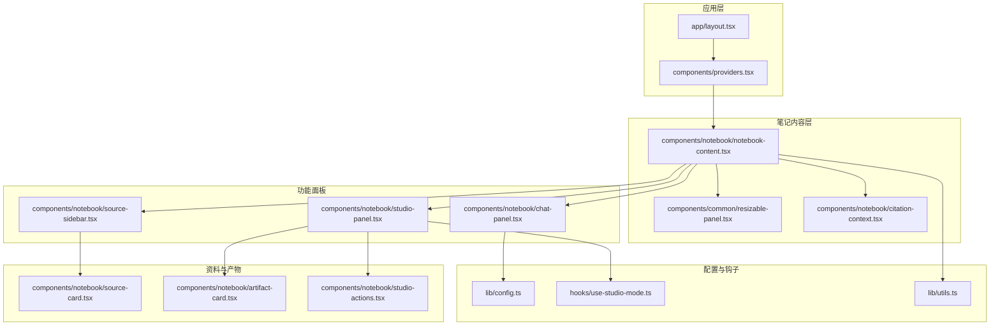
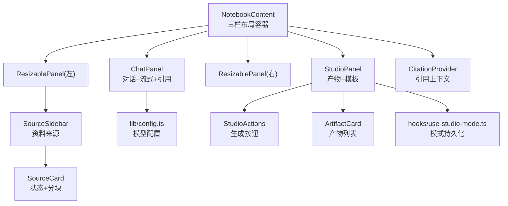
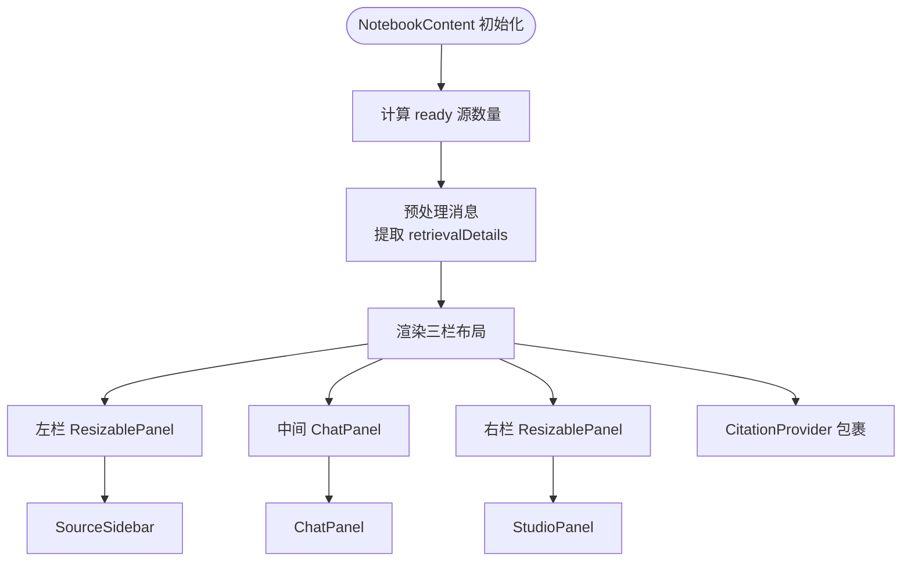
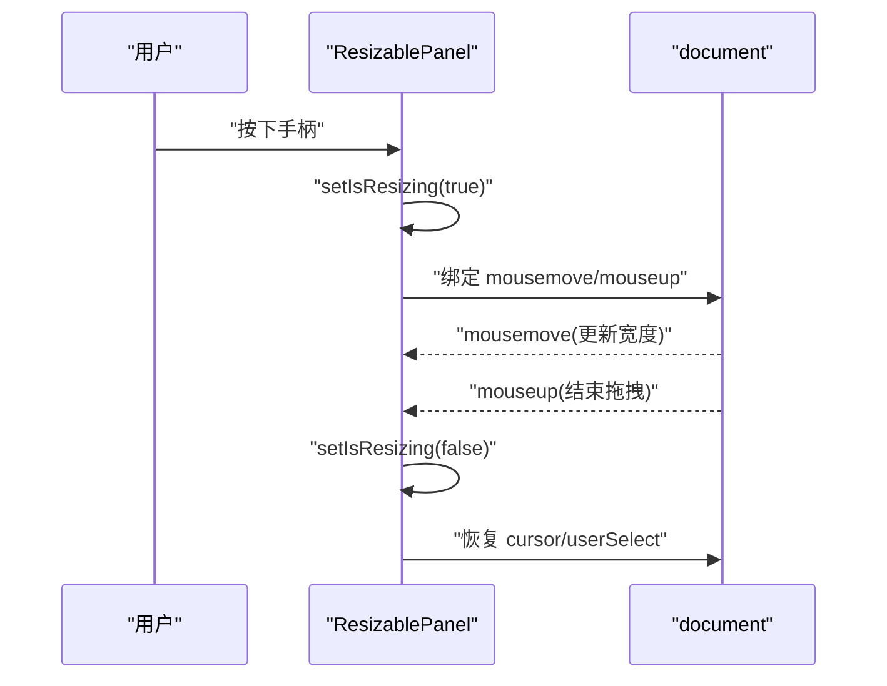
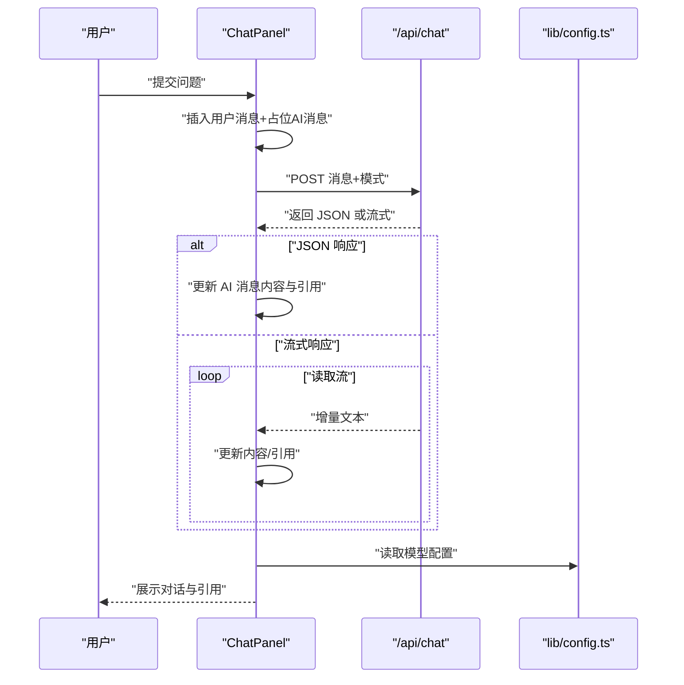
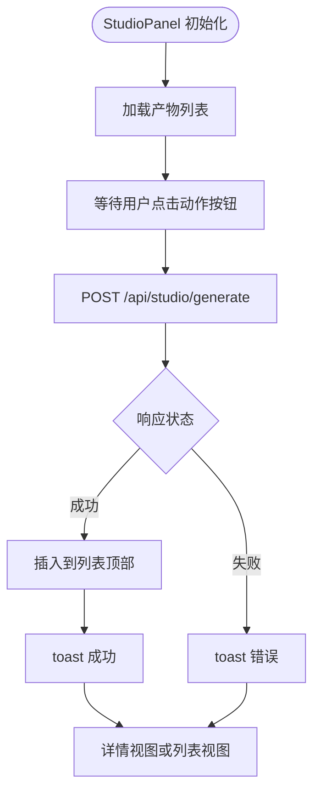
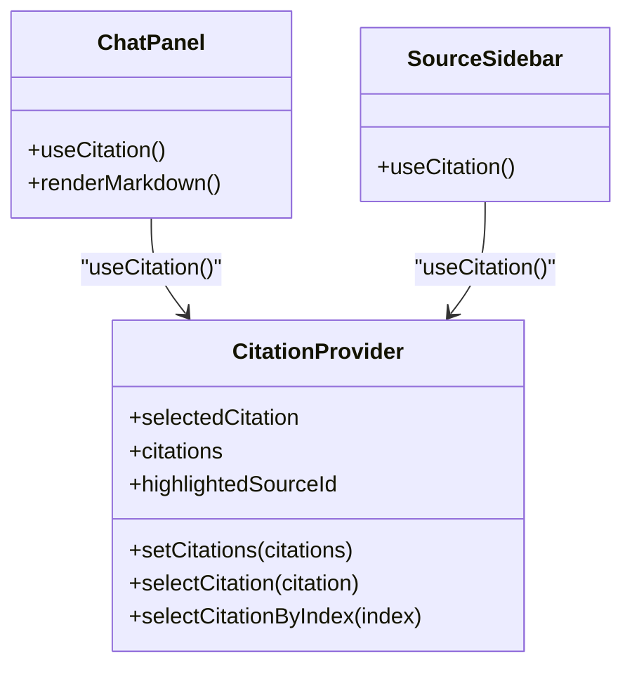
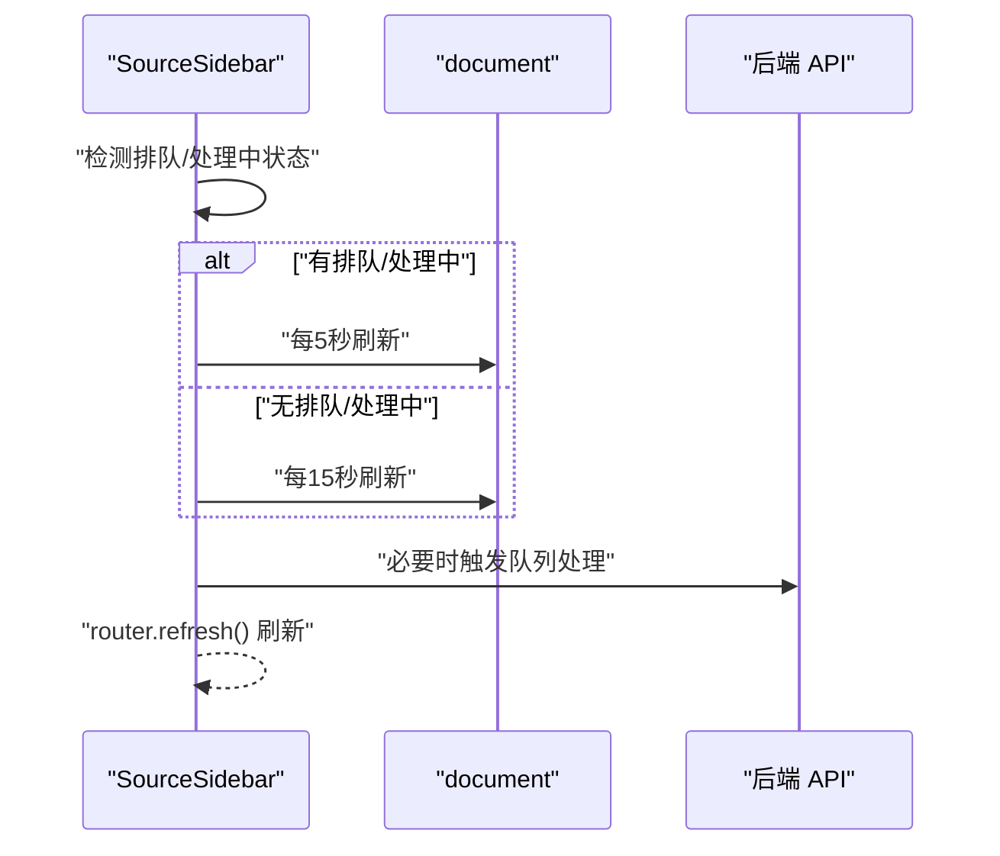
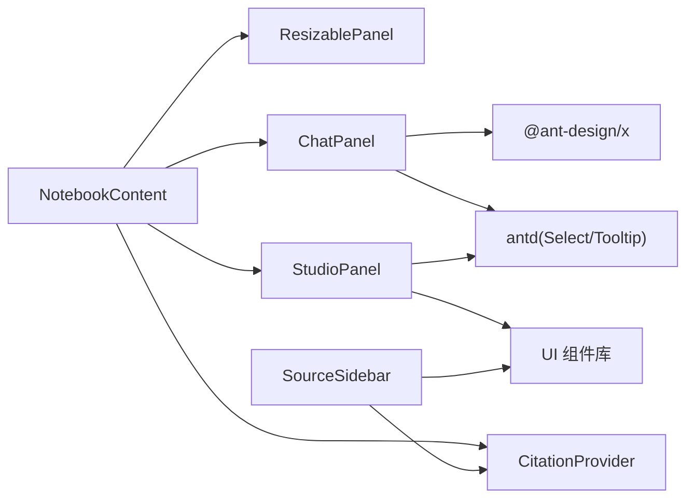

# 组件架构设计

<cite>
**本文档引用的文件**
- [components/notebook/notebook-content.tsx](file://components/notebook/notebook-content.tsx)
- [components/common/resizable-panel.tsx](file://components/common/resizable-panel.tsx)
- [components/notebook/chat-panel.tsx](file://components/notebook/chat-panel.tsx)
- [components/notebook/studio-panel.tsx](file://components/notebook/studio-panel.tsx)
- [components/notebook/citation-context.tsx](file://components/notebook/citation-context.tsx)
- [components/notebook/source-sidebar.tsx](file://components/notebook/source-sidebar.tsx)
- [components/notebook/source-card.tsx](file://components/notebook/source-card.tsx)
- [components/notebook/artifact-card.tsx](file://components/notebook/artifact-card.tsx)
- [components/notebook/studio-actions.tsx](file://components/notebook/studio-actions.tsx)
- [components/providers.tsx](file://components/providers.tsx)
- [app/layout.tsx](file://app/layout.tsx)
- [lib/config.ts](file://lib/config.ts)
- [hooks/use-studio-mode.ts](file://hooks/use-studio-mode.ts)
- [lib/utils.ts](file://lib/utils.ts)
</cite>

## 目录
1. [简介](#简介)
2. [项目结构](#项目结构)
3. [核心组件](#核心组件)
4. [架构总览](#架构总览)
5. [详细组件分析](#详细组件分析)
6. [依赖分析](#依赖分析)
7. [性能考虑](#性能考虑)
8. [故障排查指南](#故障排查指南)
9. [结论](#结论)
10. [附录](#附录)

## 简介
本项目采用三层可调整布局的 Notebook 内容容器作为根组件，结合可调整面板、聊天面板、工作室面板与引用上下文，构建了“资料-对话-产物”的一体化工作流。组件体系强调：
- 布局策略：三栏布局（左资料侧栏-中间对话-右工作室），通过可调整面板实现灵活的空间分配。
- 状态管理：props 透传、上下文共享（引用上下文）、本地状态与持久化（模型与工作室模式）。
- 生命周期：组件初始化、消息与产物加载、轮询刷新、动态导入与流式渲染。
- 可复用性：统一的 UI 组件库、通用属性接口、默认值与扩展点配置。
- 错误边界：全局错误页面、组件级错误提示与回退。

## 项目结构
- 应用入口与全局提供者
  - 应用根布局包裹全局 Provider，注入主题与国际化配置。
  - Notebook 页面作为笔记列表入口，后续进入具体 Notebook 的内容页。
- 组件层
  - NotebookContent 作为根容器，组织三栏布局与上下文提供者。
  - ResizablePanel 实现拖拽调整宽度，支持左右手柄。
  - ChatPanel 负责对话交互、流式响应、引用渲染与检索详情。
  - StudioPanel 负责产物生成、列表与模板库集成。
  - CitationProvider 提供引用高亮与来源定位能力。
  - SourceSidebar 与 SourceCard 管理资料来源的增删改查与处理状态。
  - UI 组件库与工具函数提供通用样式与工具。

**图表来源**
- [app/layout.tsx](file://app/layout.tsx#L15-L30)
- [components/providers.tsx](file://components/providers.tsx#L16-L33)
- [components/notebook/notebook-content.tsx](file://components/notebook/notebook-content.tsx#L71-L127)
- [components/common/resizable-panel.tsx](file://components/common/resizable-panel.tsx#L20-L92)
- [components/notebook/citation-context.tsx](file://components/notebook/citation-context.tsx#L46-L89)
- [components/notebook/source-sidebar.tsx](file://components/notebook/source-sidebar.tsx#L49-L316)
- [components/notebook/chat-panel.tsx](file://components/notebook/chat-panel.tsx#L60-L412)
- [components/notebook/studio-panel.tsx](file://components/notebook/studio-panel.tsx#L25-L260)
- [components/notebook/source-card.tsx](file://components/notebook/source-card.tsx#L224-L823)
- [components/notebook/artifact-card.tsx](file://components/notebook/artifact-card.tsx#L57-L270)
- [components/notebook/studio-actions.tsx](file://components/notebook/studio-actions.tsx#L59-L108)
- [lib/config.ts](file://lib/config.ts#L105-L147)
- [hooks/use-studio-mode.ts](file://hooks/use-studio-mode.ts#L14-L38)
- [lib/utils.ts](file://lib/utils.ts#L4-L6)

**章节来源**
- [app/layout.tsx](file://app/layout.tsx#L15-L30)
- [components/providers.tsx](file://components/providers.tsx#L16-L33)

## 核心组件
- NotebookContent
  - 作用：三栏布局容器，负责计算 ready 源数量与消息预处理，并将上下文提供者包裹在最外层。
  - 关键点：memo 化计算、三栏结构、卡片容器与阴影样式。
- ResizablePanel
  - 作用：实现拖拽调整宽度，支持左右手柄，限制最小/最大宽度。
  - 关键点：鼠标事件监听、body 样式控制、ref 获取面板尺寸。
- ChatPanel
  - 作用：RAG 对话、流式响应、引用渲染、检索详情弹窗、模型选择。
  - 关键点：动态导入、流式读取、引用标记解析、空状态与建议问题。
- StudioPanel
  - 作用：产物生成、列表管理、模板库、模式切换与持久化。
  - 关键点：生成与删除 API、标签页切换、禁用条件（无 ready 源）。
- CitationProvider
  - 作用：引用上下文，提供选中引用、高亮来源、按索引选择等能力。
  - 关键点：索引映射、去抖更新、错误保护。
- SourceSidebar 与 SourceCard
  - 作用：资料来源管理、处理状态轮询、队列操作、详情弹窗与分块高亮。
  - 关键点：轮询刷新、展开加载分块、滚动到引用。
- UI 组件与工具
  - 作用：按钮、输入、下拉、对话框、提示等通用 UI；cn 合并类名。
  - 关键点：变体与尺寸、无障碍与交互。

**章节来源**
- [components/notebook/notebook-content.tsx](file://components/notebook/notebook-content.tsx#L71-L127)
- [components/common/resizable-panel.tsx](file://components/common/resizable-panel.tsx#L20-L92)
- [components/notebook/chat-panel.tsx](file://components/notebook/chat-panel.tsx#L60-L412)
- [components/notebook/studio-panel.tsx](file://components/notebook/studio-panel.tsx#L25-L260)
- [components/notebook/citation-context.tsx](file://components/notebook/citation-context.tsx#L46-L89)
- [components/notebook/source-sidebar.tsx](file://components/notebook/source-sidebar.tsx#L49-L316)
- [components/notebook/source-card.tsx](file://components/notebook/source-card.tsx#L224-L823)
- [lib/utils.ts](file://lib/utils.ts#L4-L6)

## 架构总览
整体采用“根容器 + 上下文 + 三栏面板”的分层架构：
- 根容器 NotebookContent 负责布局与数据预处理。
- ResizablePanel 提供交互式空间分配。
- ChatPanel 与 StudioPanel 分别承担对话与产物两大核心功能域。
- CitationProvider 作为跨组件共享的状态中心。
- SourceSidebar 与 SourceCard 管理资料来源生命周期。
- 全局 Providers 注入主题与国际化。

**图表来源**
- [components/notebook/notebook-content.tsx](file://components/notebook/notebook-content.tsx#L85-L126)
- [components/common/resizable-panel.tsx](file://components/common/resizable-panel.tsx#L20-L92)
- [components/notebook/chat-panel.tsx](file://components/notebook/chat-panel.tsx#L60-L412)
- [components/notebook/studio-panel.tsx](file://components/notebook/studio-panel.tsx#L25-L260)
- [components/notebook/citation-context.tsx](file://components/notebook/citation-context.tsx#L46-L89)
- [components/notebook/source-sidebar.tsx](file://components/notebook/source-sidebar.tsx#L49-L316)
- [components/notebook/source-card.tsx](file://components/notebook/source-card.tsx#L224-L823)
- [components/notebook/studio-actions.tsx](file://components/notebook/studio-actions.tsx#L59-L108)
- [lib/config.ts](file://lib/config.ts#L105-L147)
- [hooks/use-studio-mode.ts](file://hooks/use-studio-mode.ts#L14-L38)

## 详细组件分析

### NotebookContent 布局与数据预处理
- 布局策略
  - 使用 Flex 布局与 gap 控制间距，三栏结构清晰。
  - 左右两栏通过 ResizablePanel 控制宽度，中间栏自适应。
- 数据预处理
  - 计算 ready 源数量，用于 Studio 禁用条件。
  - 预处理消息，提取 retrievalDetails，便于后续展示。
- 上下文提供者
  - 将 CitationProvider 包裹在最外层，确保引用能力在整个三栏范围内生效。

**图表来源**
- [components/notebook/notebook-content.tsx](file://components/notebook/notebook-content.tsx#L71-L127)

**章节来源**
- [components/notebook/notebook-content.tsx](file://components/notebook/notebook-content.tsx#L71-L127)

### ResizablePanel 可调整面板实现原理
- 交互机制
  - 鼠标按下开启拖拽，移动时根据 side 计算新宽度，限制在最小/最大范围内。
  - 鼠标抬起结束拖拽，恢复 body 样式。
- 手柄设计
  - 支持左右手柄，悬停时显示 GripVertical，提升可发现性。
- 状态与样式
  - 通过 ref 获取面板尺寸，动态设置 style 宽度。
  - 提供 className 扩展样式。

**图表来源**
- [components/common/resizable-panel.tsx](file://components/common/resizable-panel.tsx#L20-L92)

**章节来源**
- [components/common/resizable-panel.tsx](file://components/common/resizable-panel.tsx#L20-L92)

### ChatPanel 对话与流式渲染
- 对话流程
  - 用户输入提交后，先插入用户消息与占位 AI 消息。
  - 调用 /api/chat，区分 JSON 与流式响应，逐步更新内容与引用。
- 引用与检索详情
  - 支持引用标记 [1][2]，点击跳转至引用来源。
  - 检索详情通过右侧抽屉展示，动态导入面板组件。
- 空状态与建议问题
  - 无消息时展示建议问题，一键提问。
- 模型选择
  - 本地存储模型偏好，支持 fast/precise 模式切换。

**图表来源**
- [components/notebook/chat-panel.tsx](file://components/notebook/chat-panel.tsx#L171-L300)
- [lib/config.ts](file://lib/config.ts#L105-L147)

**章节来源**
- [components/notebook/chat-panel.tsx](file://components/notebook/chat-panel.tsx#L60-L412)

### StudioPanel 产物生成与管理
- 生成流程
  - 点击动作按钮，调用 /api/studio/generate，成功后插入到列表顶部。
  - 成功与失败均通过 toast 提示，失败时保留生成中状态。
- 列表与详情
  - 支持删除、复制、编辑标题；详情视图展示 ArtifactViewer。
- 模式与禁用
  - 无 ready 源时禁用生成按钮；模式持久化于 localStorage。
- 模板库
  - 提供模板库视图，生成后自动跳转到产物列表并选中。

**图表来源**
- [components/notebook/studio-panel.tsx](file://components/notebook/studio-panel.tsx#L34-L111)
- [components/notebook/studio-actions.tsx](file://components/notebook/studio-actions.tsx#L59-L108)
- [hooks/use-studio-mode.ts](file://hooks/use-studio-mode.ts#L14-L38)

**章节来源**
- [components/notebook/studio-panel.tsx](file://components/notebook/studio-panel.tsx#L25-L260)
- [components/notebook/studio-actions.tsx](file://components/notebook/studio-actions.tsx#L59-L108)
- [hooks/use-studio-mode.ts](file://hooks/use-studio-mode.ts#L14-L38)

### CitationProvider 引用上下文
- 能力
  - 提供 setCitations、selectCitation、selectCitationByIndex、highlightedSourceId。
  - 自动为引用编号（1,2,3...），避免重复渲染。
- 使用场景
  - ChatPanel 底部引用列表与内容中的引用标记联动。
  - SourceSidebar 根据选中引用高亮对应 Source 与 Chunk。

**图表来源**
- [components/notebook/citation-context.tsx](file://components/notebook/citation-context.tsx#L46-L89)
- [components/notebook/chat-panel.tsx](file://components/notebook/chat-panel.tsx#L67-L109)
- [components/notebook/source-sidebar.tsx](file://components/notebook/source-sidebar.tsx#L52-L167)

**章节来源**
- [components/notebook/citation-context.tsx](file://components/notebook/citation-context.tsx#L46-L89)

### SourceSidebar 与 SourceCard 资料来源管理
- 轮询与自动处理
  - 有排队或处理中状态时，定时刷新；无处理任务时降低轮询间隔。
  - 有待处理且无进行中任务时，尝试触发队列处理。
- 详情与分块
  - 展开后加载分块，支持滚动到引用 Chunk。
  - 详情弹窗展示处理日志、状态、元信息与操作按钮。
- 队列对话框
  - 展示当前 Notebook 的排队任务，支持立即处理与取消。

**图表来源**
- [components/notebook/source-sidebar.tsx](file://components/notebook/source-sidebar.tsx#L64-L84)

**章节来源**
- [components/notebook/source-sidebar.tsx](file://components/notebook/source-sidebar.tsx#L49-L316)
- [components/notebook/source-card.tsx](file://components/notebook/source-card.tsx#L224-L823)

## 依赖分析
- 组件耦合
  - NotebookContent 与 ResizablePanel、ChatPanel、StudioPanel、CitationProvider 存在直接依赖。
  - ChatPanel 依赖模型配置与动态组件。
  - StudioPanel 依赖工作室模式钩子与 UI 组件。
  - SourceSidebar 依赖引用上下文与路由刷新。
- 外部依赖
  - Ant Design X（Bubble/Sender/Markdown）用于对话体验。
  - Antd（Button/Select/Tooltip）用于高级交互。
  - Next.js 动态导入与服务端数据获取。

**图表来源**
- [components/notebook/notebook-content.tsx](file://components/notebook/notebook-content.tsx#L85-L126)
- [components/notebook/chat-panel.tsx](file://components/notebook/chat-panel.tsx#L9-L36)
- [components/notebook/studio-panel.tsx](file://components/notebook/studio-panel.tsx#L8-L18)
- [components/notebook/source-sidebar.tsx](file://components/notebook/source-sidebar.tsx#L24-L24)

**章节来源**
- [components/notebook/notebook-content.tsx](file://components/notebook/notebook-content.tsx#L85-L126)
- [components/notebook/chat-panel.tsx](file://components/notebook/chat-panel.tsx#L9-L36)
- [components/notebook/studio-panel.tsx](file://components/notebook/studio-panel.tsx#L8-L18)
- [components/notebook/source-sidebar.tsx](file://components/notebook/source-sidebar.tsx#L24-L24)

## 性能考虑
- 渲染优化
  - 使用 useMemo 缓存消息列表与角色配置，减少 Bubble.List 重渲染。
  - ResizablePanel 仅在拖拽期间绑定事件，拖拽结束后解绑，避免全局监听。
- 网络与流式
  - ChatPanel 使用流式读取，逐步更新内容，避免一次性渲染大文本。
  - StudioPanel 生成成功后插入到列表顶部，避免全量重载。
- 动态导入
  - ChatPanel 中的检索详情面板采用动态导入，按需加载，减小首屏体积。
- 轮询策略
  - SourceSidebar 根据状态动态调整轮询间隔，降低不必要的刷新频率。

[本节为通用性能讨论，不直接分析具体文件]

## 故障排查指南
- 引用上下文错误
  - useCitation 必须在 CitationProvider 内部使用，否则会抛出错误。检查父组件是否正确包裹。
- 对话流式异常
  - 确认后端响应格式与流式协议，注意 LongCat 特殊字段与 citations 标记。
- 产物生成失败
  - 检查 ready 源数量与禁用状态；查看 toast 错误提示；确认 /api/studio/generate 接口返回。
- 资料处理卡住
  - 检查队列状态与轮询间隔；必要时手动触发处理或取消排队。
- 全局错误页面
  - 应用提供全局错误页面与全局错误组件，便于捕获未处理异常。

**章节来源**
- [components/notebook/citation-context.tsx](file://components/notebook/citation-context.tsx#L91-L97)
- [components/notebook/chat-panel.tsx](file://components/notebook/chat-panel.tsx#L290-L299)
- [components/notebook/studio-panel.tsx](file://components/notebook/studio-panel.tsx#L100-L110)
- [components/notebook/source-sidebar.tsx](file://components/notebook/source-sidebar.tsx#L64-L84)

## 结论
该组件架构以 NotebookContent 为核心，通过 ResizablePanel 提供灵活布局，结合 ChatPanel 与 StudioPanel 实现“资料-对话-产物”的闭环工作流。CitationProvider 作为跨组件状态中心，确保引用与来源定位的一致性。整体设计强调可复用性、可维护性与用户体验，具备良好的扩展性与稳定性。

[本节为总结性内容，不直接分析具体文件]

## 附录
- 组件组合最佳实践
  - 父子关系：NotebookContent → ResizablePanel/ChatPanel/StuidoPanel → 子组件。
  - 兄弟组件协作：SourceSidebar 与 ChatPanel 通过 CitationProvider 协同。
  - 跨层级通信：CitationProvider 为跨层级共享状态的首选方案。
- 可复用性设计
  - UI 组件库提供统一的变体与尺寸；工具函数 cn 合并类名。
  - 模型配置集中管理，Studio 模式持久化，减少重复逻辑。
- 错误边界与异常恢复
  - 全局错误页面与组件级错误提示相结合，保证异常可感知与可恢复。

[本节为概念性内容，不直接分析具体文件]