# UI 基础组件

<cite>
**本文引用的文件**
- [components/ui/button.tsx](file://components/ui/button.tsx)
- [components/ui/input.tsx](file://components/ui/input.tsx)
- [components/ui/card.tsx](file://components/ui/card.tsx)
- [components/ui/dialog.tsx](file://components/ui/dialog.tsx)
- [components/ui/dropdown-menu.tsx](file://components/ui/dropdown-menu.tsx)
- [components/ui/select.tsx](file://components/ui/select.tsx)
- [components/ui/tabs.tsx](file://components/ui/tabs.tsx)
- [components/ui/toast.tsx](file://components/ui/toast.tsx)
- [components/ui/toaster.tsx](file://components/ui/toaster.tsx)
- [hooks/use-toast.ts](file://hooks/use-toast.ts)
- [components/ui/avatar.tsx](file://components/ui/avatar.tsx)
- [components/ui/label.tsx](file://components/ui/label.tsx)
- [components/ui/progress.tsx](file://components/ui/progress.tsx)
- [components/ui/scroll-area.tsx](file://components/ui/scroll-area.tsx)
- [components/ui/separator.tsx](file://components/ui/separator.tsx)
- [components/ui/sheet.tsx](file://components/ui/sheet.tsx)
- [components/ui/skeleton.tsx](file://components/ui/skeleton.tsx)
- [components/ui/tooltip.tsx](file://components/ui/tooltip.tsx)
</cite>

## 目录
1. [简介](#简介)
2. [项目结构](#项目结构)
3. [核心组件](#核心组件)
4. [架构总览](#架构总览)
5. [详细组件分析](#详细组件分析)
6. [依赖关系分析](#依赖关系分析)
7. [性能考量](#性能考量)
8. [故障排查指南](#故障排查指南)
9. [结论](#结论)
10. [附录](#附录)

## 简介
本文件系统化梳理 notebookLM-clone 项目中基于 shadcn/ui 的基础 UI 组件，覆盖 Button、Input、Card、Dialog、DropdownMenu、Select、Tabs、Toast/Toaster 等组件的实现细节、接口定义、状态与交互、可访问性支持以及最佳实践。文档以“从代码到文档”的方式呈现，确保技术细节与实际源码一一对应，并提供可视化图示帮助理解。

## 项目结构
UI 组件集中位于 components/ui 目录下，采用按功能分层的组织方式：基础按钮、输入、卡片、对话框、下拉菜单、选择器、标签页、消息提示等。Toast/Toaster 通过自定义 hooks use-toast 驱动全局状态，实现轻量级通知展示。

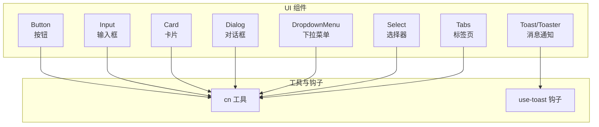

**图表来源**
- [components/ui/button.tsx](file://components/ui/button.tsx#L1-L58)
- [components/ui/input.tsx](file://components/ui/input.tsx#L1-L23)
- [components/ui/card.tsx](file://components/ui/card.tsx#L1-L77)
- [components/ui/dialog.tsx](file://components/ui/dialog.tsx#L1-L123)
- [components/ui/dropdown-menu.tsx](file://components/ui/dropdown-menu.tsx#L1-L202)
- [components/ui/select.tsx](file://components/ui/select.tsx#L1-L161)
- [components/ui/tabs.tsx](file://components/ui/tabs.tsx#L1-L56)
- [components/ui/toast.tsx](file://components/ui/toast.tsx#L1-L102)
- [components/ui/toaster.tsx](file://components/ui/toaster.tsx#L1-L29)
- [hooks/use-toast.ts](file://hooks/use-toast.ts)

**章节来源**
- [components/ui/button.tsx](file://components/ui/button.tsx#L1-L58)
- [components/ui/input.tsx](file://components/ui/input.tsx#L1-L23)
- [components/ui/card.tsx](file://components/ui/card.tsx#L1-L77)
- [components/ui/dialog.tsx](file://components/ui/dialog.tsx#L1-L123)
- [components/ui/dropdown-menu.tsx](file://components/ui/dropdown-menu.tsx#L1-L202)
- [components/ui/select.tsx](file://components/ui/select.tsx#L1-L161)
- [components/ui/tabs.tsx](file://components/ui/tabs.tsx#L1-L56)
- [components/ui/toast.tsx](file://components/ui/toast.tsx#L1-L102)
- [components/ui/toaster.tsx](file://components/ui/toaster.tsx#L1-L29)

## 核心组件
本节对各组件进行要点提炼，便于快速查阅与对比。

- Button（按钮）
  - 变体：default、destructive、outline、secondary、ghost、link
  - 尺寸：default、sm、lg、icon
  - 支持 asChild（Slot）以复用语义标签
  - 状态：禁用、聚焦可见轮廓、Ring 边框动画
- Input（输入框）
  - 默认样式适配边框、背景、占位符、聚焦 Ring
  - 支持禁用、受控/非受控模式（原生 input 行为）
- Card（卡片）
  - 结构化子组件：CardHeader、CardTitle、CardDescription、CardContent、CardFooter
  - 默认圆角、边框、阴影
- Dialog（对话框）
  - Root/Trigger/Portal/Overlay/Content/Close/Title/Description/Footer/Header
  - 模态遮罩、居中动画、关闭按钮、无障碍 sr-only 文本
- DropdownMenu（下拉菜单）
  - 支持 Sub/SubContent/SubTrigger、CheckboxItem、RadioItem、Label、Separator、Shortcut
  - Portal 渲染、侧向动画、焦点管理
- Select（选择器）
  - Trigger、Content、Item、Label、Separator、ScrollUp/DownButton
  - 视口适配、图标、滚动控制
- Tabs（标签页）
  - Root/List/Trigger/Content
  - 激活态样式、禁用态、焦点可见轮廓
- Toast/Toaster（消息通知）
  - Provider、Viewport、Root、Title、Close
  - 多种变体（默认、成功、错误、警告）、滑动与淡出动画、手势滑动取消
  - Toaster 通过 use-toast 钩子消费状态并渲染

**章节来源**
- [components/ui/button.tsx](file://components/ui/button.tsx#L7-L35)
- [components/ui/input.tsx](file://components/ui/input.tsx#L5-L19)
- [components/ui/card.tsx](file://components/ui/card.tsx#L5-L76)
- [components/ui/dialog.tsx](file://components/ui/dialog.tsx#L9-L122)
- [components/ui/dropdown-menu.tsx](file://components/ui/dropdown-menu.tsx#L9-L201)
- [components/ui/select.tsx](file://components/ui/select.tsx#L9-L160)
- [components/ui/tabs.tsx](file://components/ui/tabs.tsx#L8-L55)
- [components/ui/toast.tsx](file://components/ui/toast.tsx#L10-L101)
- [components/ui/toaster.tsx](file://components/ui/toaster.tsx#L12-L28)

## 架构总览
以下图示展示 Toast/Toaster 与 use-toast 钩子之间的协作关系，以及 Toaster 如何消费全局状态并渲染多个 Toast。

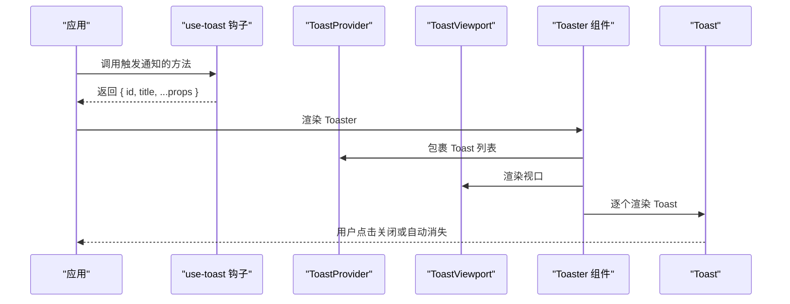

**图表来源**
- [components/ui/toaster.tsx](file://components/ui/toaster.tsx#L12-L28)
- [components/ui/toast.tsx](file://components/ui/toast.tsx#L10-L57)
- [hooks/use-toast.ts](file://hooks/use-toast.ts)

**章节来源**
- [components/ui/toaster.tsx](file://components/ui/toaster.tsx#L1-L29)
- [components/ui/toast.tsx](file://components/ui/toast.tsx#L1-L102)
- [hooks/use-toast.ts](file://hooks/use-toast.ts)

## 详细组件分析

### Button（按钮）
- 设计要点
  - 使用 class-variance-authority 定义变体与尺寸，统一过渡与阴影
  - 支持 asChild，允许将按钮渲染为 a、div 等语义元素
  - 焦点可见轮廓与 Ring 动画增强可访问性
- Props 与行为
  - ButtonProps 扩展 ButtonHTMLAttributes 并混入 VariantProps
  - 支持 className、variant、size、asChild
- 最佳实践
  - 图标按钮优先使用 icon 尺寸
  - 链接型按钮配合 asChild 使用
  - 禁用态保持视觉一致性，避免误导用户

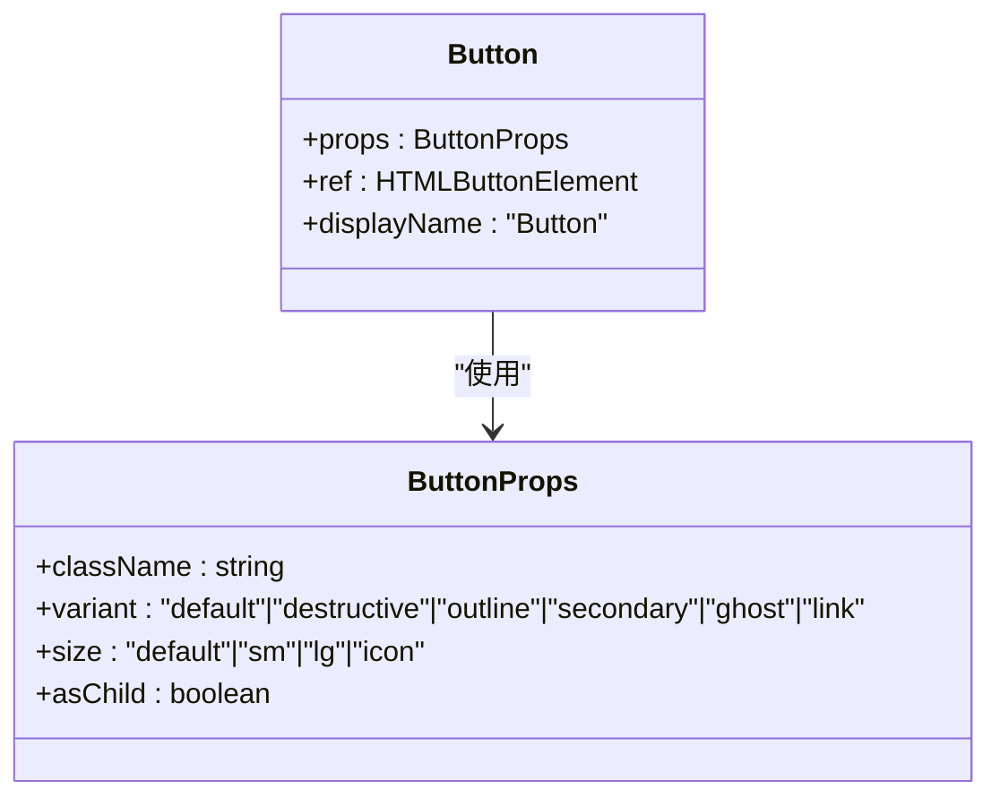

**图表来源**
- [components/ui/button.tsx](file://components/ui/button.tsx#L37-L54)

**章节来源**
- [components/ui/button.tsx](file://components/ui/button.tsx#L1-L58)

### Input（输入框）
- 设计要点
  - 默认适配边框、背景、占位符颜色与聚焦 Ring
  - 支持禁用态与移动端字体大小
- Props 与行为
  - 继承原生 input 所有属性，仅包裹样式类名
  - 受控/非受控由父组件决定，组件本身不强制
- 最佳实践
  - 与 Label 搭配提升可访问性
  - 错误态建议结合外部校验反馈

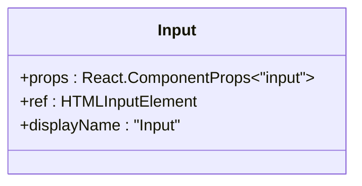

**图表来源**
- [components/ui/input.tsx](file://components/ui/input.tsx#L5-L19)

**章节来源**
- [components/ui/input.tsx](file://components/ui/input.tsx#L1-L23)

### Card（卡片）
- 设计要点
  - 子组件解耦：Header/Title/Description/Content/Footer 提供灵活布局
  - 圆角、边框与阴影统一风格
- Props 与行为
  - 各子组件接收标准 HTML 属性，内部仅拼装样式类
- 最佳实践
  - 标题与描述分离，利于 SEO 与可访问性
  - Footer 内放置操作按钮组

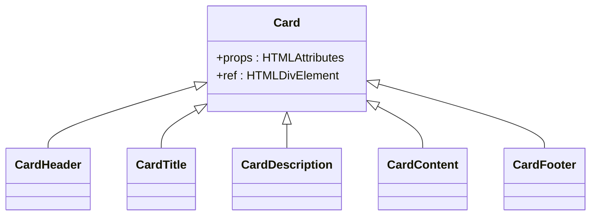

**图表来源**
- [components/ui/card.tsx](file://components/ui/card.tsx#L5-L76)

**章节来源**
- [components/ui/card.tsx](file://components/ui/card.tsx#L1-L77)

### Dialog（对话框）
- 设计要点
  - Portal 渲染至根节点，Overlay 背景遮罩，Content 居中动画
  - 关闭按钮带 sr-only 文本，提升可访问性
- Props 与行为
  - Root/Trigger/Portal/Overlay/Content/Close/Title/Description/Footer/Header
  - 支持键盘交互与焦点管理
- 最佳实践
  - 内容区避免长列表导致滚动困难，必要时使用 ScrollArea
  - Footer 放置确认/取消按钮

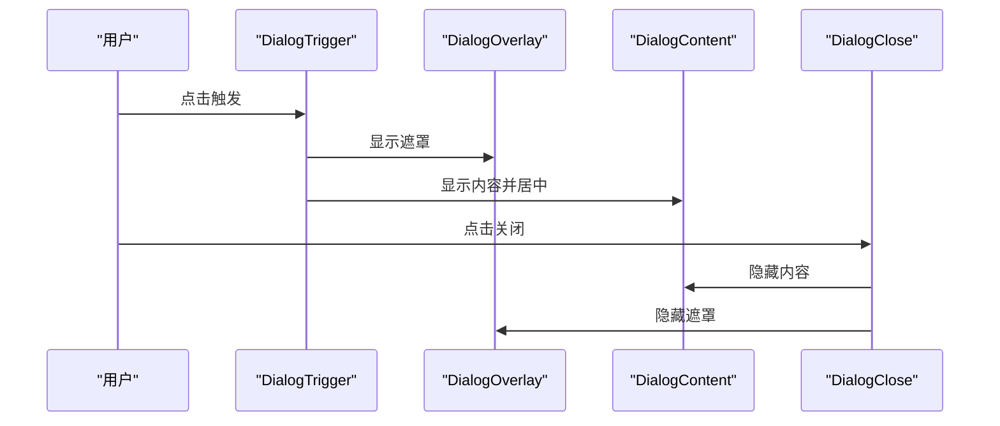

**图表来源**
- [components/ui/dialog.tsx](file://components/ui/dialog.tsx#L9-L54)

**章节来源**
- [components/ui/dialog.tsx](file://components/ui/dialog.tsx#L1-L123)

### DropdownMenu（下拉菜单）
- 设计要点
  - 支持子菜单 Sub/SubContent/SubTrigger，Checkbox/Radio 项，分隔线与快捷键
  - Portal 渲染，侧向动画，焦点在激活时进入
- Props 与行为
  - Root/Trigger/Portal/Content/Item/CheckboxItem/RadioItem/Label/Separator/Shortcut
  - 支持 inset 缩进与侧偏移
- 最佳实践
  - 复杂选项分组使用 Label 与 Separator
  - 长列表配合 ScrollArea 或虚拟化

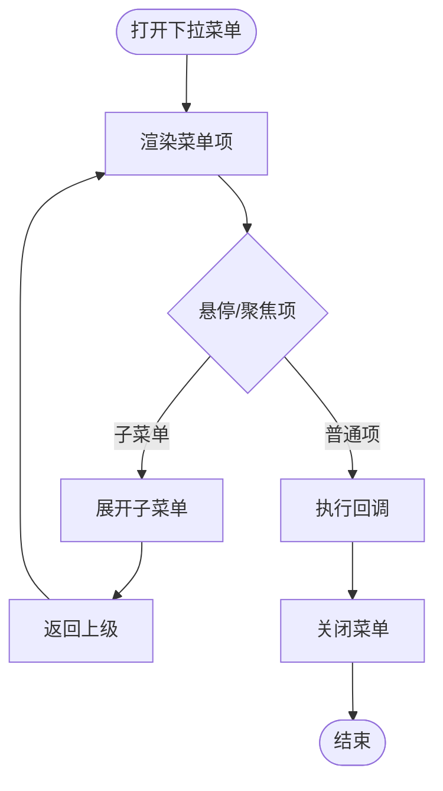

**图表来源**
- [components/ui/dropdown-menu.tsx](file://components/ui/dropdown-menu.tsx#L59-L116)

**章节来源**
- [components/ui/dropdown-menu.tsx](file://components/ui/dropdown-menu.tsx#L1-L202)

### Select（选择器）
- 设计要点
  - Trigger 展示当前值，Content 视口承载滚动选项
  - 支持滚动上下按钮、标签分组、分隔线
- Props 与行为
  - Root/Group/Value/Trigger/Content/Label/Item/Separator/ScrollUp/ScrollDown
  - 支持 popper 位置微调
- 最佳实践
  - 大数据集使用虚拟滚动或分页
  - 多选场景建议使用外部库或自定义扩展

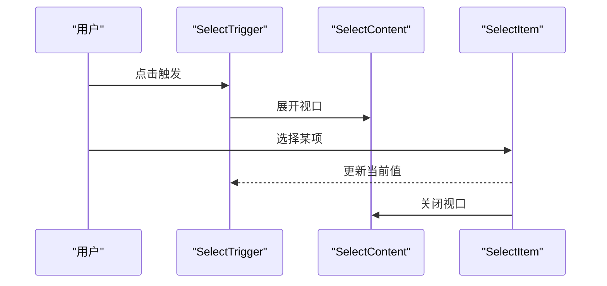

**图表来源**
- [components/ui/select.tsx](file://components/ui/select.tsx#L15-L99)

**章节来源**
- [components/ui/select.tsx](file://components/ui/select.tsx#L1-L161)

### Tabs（标签页）
- 设计要点
  - List/Trigger/Content 解耦，激活态样式明确
  - 焦点可见轮廓与禁用态
- Props 与行为
  - Root/List/Trigger/Content
  - 激活态通过 data-state 控制
- 最佳实践
  - 每个 Tab 对应独立内容容器，避免一次性渲染过多内容

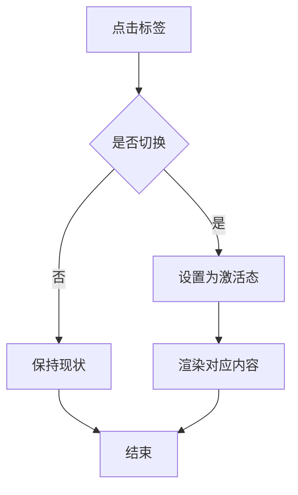

**图表来源**
- [components/ui/tabs.tsx](file://components/ui/tabs.tsx#L10-L53)

**章节来源**
- [components/ui/tabs.tsx](file://components/ui/tabs.tsx#L1-L56)

### Toast/Toaster（消息通知）
- 设计要点
  - Provider/Viewport/Root/Title/Close 组合
  - 多种变体与滑动/淡出动画，支持手势滑动取消
- Props 与行为
  - Toast 支持 variant（默认/成功/错误/警告）
  - Toaster 通过 use-toast 获取 toasts 列表并逐个渲染
- 最佳实践
  - 合理设置自动消失时间
  - 成功/错误信息与业务状态一致

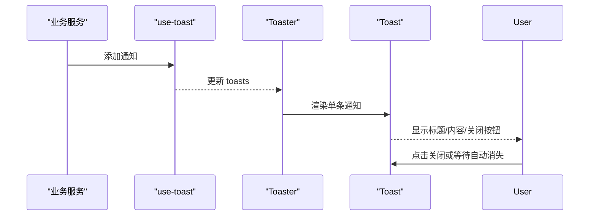

**图表来源**
- [components/ui/toaster.tsx](file://components/ui/toaster.tsx#L12-L28)
- [components/ui/toast.tsx](file://components/ui/toast.tsx#L44-L75)

**章节来源**
- [components/ui/toast.tsx](file://components/ui/toast.tsx#L1-L102)
- [components/ui/toaster.tsx](file://components/ui/toaster.tsx#L1-L29)
- [hooks/use-toast.ts](file://hooks/use-toast.ts)

## 依赖关系分析
- 组件间耦合
  - 所有组件均通过 cn 工具拼装样式类，降低样式耦合
  - Dialog/DropdownMenu/Select/Sheet 均基于 Radix UI primitives，保证可访问性与行为一致性
- 外部依赖
  - class-variance-authority：用于变体与尺寸的样式组合
  - lucide-react：图标库
  - @radix-ui/react-*：可访问性与状态管理的基础 UI 原语
- 潜在循环依赖
  - 组件文件相互独立，未见循环导入

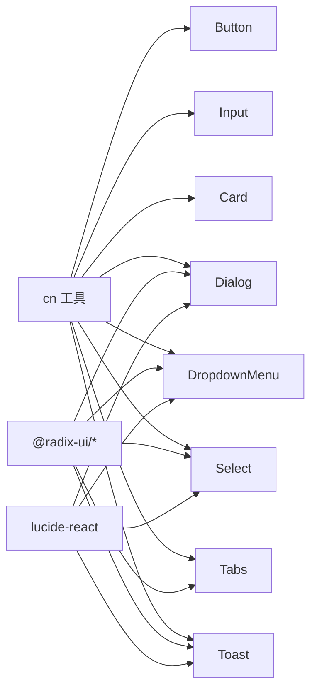

**图表来源**
- [components/ui/button.tsx](file://components/ui/button.tsx#L5-L5)
- [components/ui/dialog.tsx](file://components/ui/dialog.tsx#L4-L5)
- [components/ui/dropdown-menu.tsx](file://components/ui/dropdown-menu.tsx#L4-L5)
- [components/ui/select.tsx](file://components/ui/select.tsx#L4-L5)
- [components/ui/tabs.tsx](file://components/ui/tabs.tsx#L4-L4)
- [components/ui/toast.tsx](file://components/ui/toast.tsx#L5-L6)

**章节来源**
- [components/ui/button.tsx](file://components/ui/button.tsx#L1-L58)
- [components/ui/dialog.tsx](file://components/ui/dialog.tsx#L1-L123)
- [components/ui/dropdown-menu.tsx](file://components/ui/dropdown-menu.tsx#L1-L202)
- [components/ui/select.tsx](file://components/ui/select.tsx#L1-L161)
- [components/ui/tabs.tsx](file://components/ui/tabs.tsx#L1-L56)
- [components/ui/toast.tsx](file://components/ui/toast.tsx#L1-L102)

## 性能考量
- 渲染优化
  - 使用 Portal 渲染浮层组件（Dialog/DropdownMenu/Select/Sheet），减少 DOM 深度与重排
  - 视口滚动组件（Select/ScrollArea）限制渲染范围
- 动画与交互
  - 过渡动画使用 CSS 动画，避免 JS 动画带来的卡顿
  - Toast 使用 CSS 变换与透明度，手势滑动取消避免昂贵计算
- 可访问性
  - 所有交互组件遵循 Radix UI 的可访问性规范，提供键盘导航与焦点管理
  - 关闭按钮与隐藏文本（sr-only）提升屏幕阅读器体验

## 故障排查指南
- Button
  - 症状：图标不居中或尺寸异常
  - 排查：检查 variant/size 是否匹配，确保图标包裹在按钮内
- Input
  - 症状：禁用态仍可编辑
  - 排查：确认父组件传入 disabled，组件已透传该属性
- Dialog
  - 症状：点击遮罩无法关闭
  - 排查：确认使用 DialogClose 或在 Overlay 上绑定关闭逻辑
- DropdownMenu
  - 症状：子菜单无法展开
  - 排查：确认使用 Sub/Portal/Content 组合，且触发元素为 SubTrigger
- Select
  - 症状：选项不显示或滚动无效
  - 排查：确认在 Content 中包含 ScrollUp/DownButton 与 Viewport
- Tabs
  - 症状：切换后内容不更新
  - 排查：确认每个 Tab 对应唯一 Content，且触发元素为 Trigger
- Toast/Toaster
  - 症状：通知不显示
  - 排查：确认已渲染 Toaster，use-toast 返回的 toasts 非空

**章节来源**
- [components/ui/button.tsx](file://components/ui/button.tsx#L37-L54)
- [components/ui/input.tsx](file://components/ui/input.tsx#L5-L19)
- [components/ui/dialog.tsx](file://components/ui/dialog.tsx#L17-L54)
- [components/ui/dropdown-menu.tsx](file://components/ui/dropdown-menu.tsx#L21-L76)
- [components/ui/select.tsx](file://components/ui/select.tsx#L70-L99)
- [components/ui/tabs.tsx](file://components/ui/tabs.tsx#L25-L53)
- [components/ui/toaster.tsx](file://components/ui/toaster.tsx#L12-L28)

## 结论
本项目 UI 基础组件以 Radix UI 为基础，结合 class-variance-authority 与 Tailwind 实现高可定制与可访问性。Button/Input/Card/Dialog/DropdownMenu/Select/Tabs/Toast/Toaster 等组件职责清晰、接口简洁，适合在复杂业务场景中快速搭建一致的交互体验。建议在实际使用中遵循可访问性规范与最佳实践，持续优化动画与渲染性能。

## 附录
- 其他常用组件（简述）
  - Avatar：头像容器与占位
  - Label：表单标签，配合表单控件
  - Progress：进度指示器
  - ScrollArea：滚动区域与滚动条
  - Separator：分割线
  - Sheet：抽屉式面板
  - Skeleton：骨架屏
  - Tooltip：气泡提示

**章节来源**
- [components/ui/avatar.tsx](file://components/ui/avatar.tsx#L8-L50)
- [components/ui/label.tsx](file://components/ui/label.tsx#L13-L24)
- [components/ui/progress.tsx](file://components/ui/progress.tsx#L8-L26)
- [components/ui/scroll-area.tsx](file://components/ui/scroll-area.tsx#L8-L48)
- [components/ui/separator.tsx](file://components/ui/separator.tsx#L8-L31)
- [components/ui/sheet.tsx](file://components/ui/sheet.tsx#L10-L140)
- [components/ui/skeleton.tsx](file://components/ui/skeleton.tsx#L3-L15)
- [components/ui/tooltip.tsx](file://components/ui/tooltip.tsx#L8-L30)