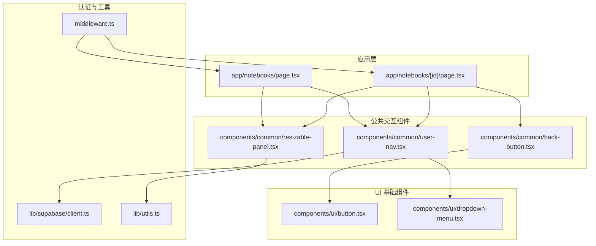
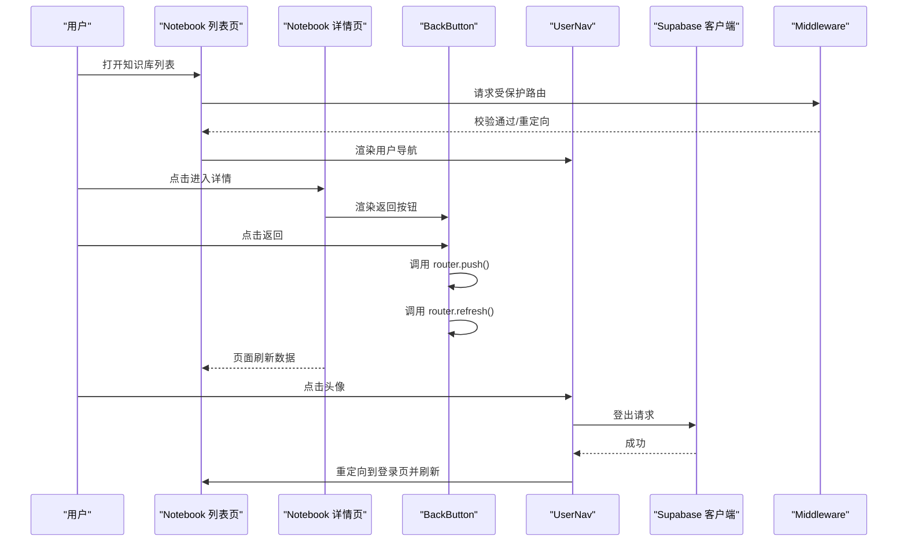
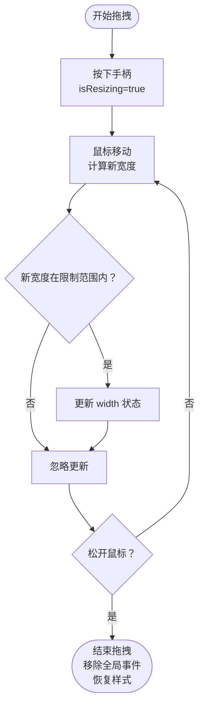
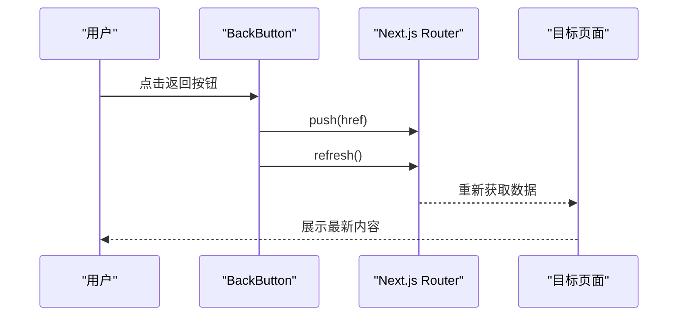
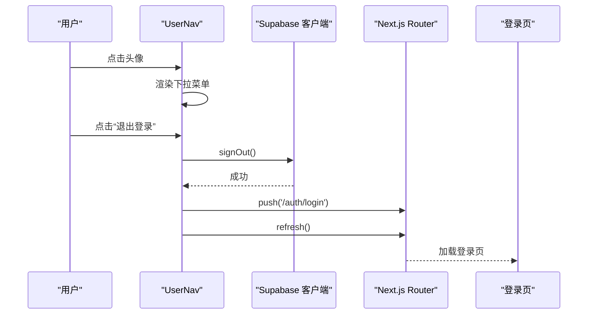
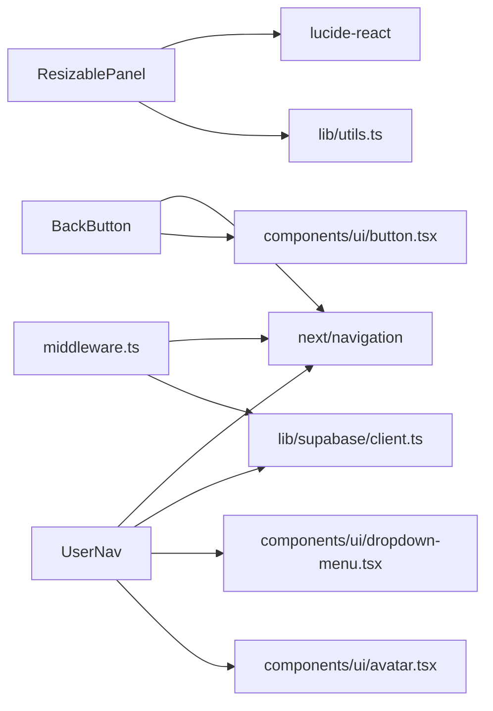

# 交互组件

<cite>
**本文引用的文件**
- [components/common/resizable-panel.tsx](file://components/common/resizable-panel.tsx)
- [components/common/back-button.tsx](file://components/common/back-button.tsx)
- [components/common/user-nav.tsx](file://components/common/user-nav.tsx)
- [components/ui/button.tsx](file://components/ui/button.tsx)
- [components/ui/dropdown-menu.tsx](file://components/ui/dropdown-menu.tsx)
- [lib/supabase/client.ts](file://lib/supabase/client.ts)
- [lib/utils.ts](file://lib/utils.ts)
- [app/notebooks/page.tsx](file://app/notebooks/page.tsx)
- [app/notebooks/[id]/page.tsx](file://app/notebooks/[id]/page.tsx)
- [middleware.ts](file://middleware.ts)
- [package.json](file://package.json)
</cite>

## 目录
1. [简介](#简介)
2. [项目结构](#项目结构)
3. [核心组件](#核心组件)
4. [架构总览](#架构总览)
5. [详细组件分析](#详细组件分析)
6. [依赖关系分析](#依赖关系分析)
7. [性能考虑](#性能考虑)
8. [故障排查指南](#故障排查指南)
9. [结论](#结论)
10. [附录](#附录)

## 简介
本文件聚焦 notebookLM-clone 项目中的交互组件，系统性梳理以下三类组件的实现原理与最佳实践：
- ResizablePanel 可调整面板：拖拽事件处理、最小/最大尺寸限制、动画过渡效果与状态持久化策略
- BackButton 返回按钮：导航逻辑、数据刷新机制与用户体验优化
- UserNav 用户导航菜单：权限控制、动态菜单项生成、用户状态检测与安全验证

同时，文档覆盖组件间通信（props 传递、事件冒泡、状态同步）、性能优化（防抖、内存管理、渲染优化）以及使用示例、集成指南与故障排查方法，帮助开发者快速理解并正确使用这些组件。

## 项目结构
交互组件主要位于 components/common 目录，并在应用页面中被广泛使用。UI 基础组件来自 components/ui，认证与会话管理通过 Supabase 客户端与中间件保障，工具函数提供通用样式合并能力。

图表来源
- [app/notebooks/page.tsx](file://app/notebooks/page.tsx#L1-L65)
- [app/notebooks/[id]/page.tsx](file://app/notebooks/[id]/page.tsx#L1-L128)
- [components/common/resizable-panel.tsx](file://components/common/resizable-panel.tsx#L1-L93)
- [components/common/back-button.tsx](file://components/common/back-button.tsx#L1-L32)
- [components/common/user-nav.tsx](file://components/common/user-nav.tsx#L1-L82)
- [components/ui/button.tsx](file://components/ui/button.tsx#L1-L58)
- [components/ui/dropdown-menu.tsx](file://components/ui/dropdown-menu.tsx#L1-L202)
- [lib/supabase/client.ts](file://lib/supabase/client.ts#L1-L14)
- [lib/utils.ts](file://lib/utils.ts#L1-L7)
- [middleware.ts](file://middleware.ts#L1-L78)

章节来源
- [app/notebooks/page.tsx](file://app/notebooks/page.tsx#L1-L65)
- [app/notebooks/[id]/page.tsx](file://app/notebooks/[id]/page.tsx#L1-L128)
- [components/common/resizable-panel.tsx](file://components/common/resizable-panel.tsx#L1-L93)
- [components/common/back-button.tsx](file://components/common/back-button.tsx#L1-L32)
- [components/common/user-nav.tsx](file://components/common/user-nav.tsx#L1-L82)
- [components/ui/button.tsx](file://components/ui/button.tsx#L1-L58)
- [components/ui/dropdown-menu.tsx](file://components/ui/dropdown-menu.tsx#L1-L202)
- [lib/supabase/client.ts](file://lib/supabase/client.ts#L1-L14)
- [lib/utils.ts](file://lib/utils.ts#L1-L7)
- [middleware.ts](file://middleware.ts#L1-L78)

## 核心组件
本节概述三个交互组件的功能定位与关键特性：
- ResizablePanel：提供可拖拽调整宽度的侧边栏或内容区域，支持左右手柄、最小/最大宽度约束、鼠标样式与选择禁用以提升拖拽体验。
- BackButton：封装 Next.js 导航与数据刷新，确保返回后目标页面能重新获取最新数据。
- UserNav：基于 Supabase 的用户信息展示与登出流程，结合 Radix DropdownMenu 提供下拉菜单交互。

章节来源
- [components/common/resizable-panel.tsx](file://components/common/resizable-panel.tsx#L1-L93)
- [components/common/back-button.tsx](file://components/common/back-button.tsx#L1-L32)
- [components/common/user-nav.tsx](file://components/common/user-nav.tsx#L1-L82)

## 架构总览
交互组件与应用页面、UI 基础组件、认证与中间件之间的关系如下：

图表来源
- [app/notebooks/page.tsx](file://app/notebooks/page.tsx#L1-L65)
- [app/notebooks/[id]/page.tsx](file://app/notebooks/[id]/page.tsx#L1-L128)
- [components/common/back-button.tsx](file://components/common/back-button.tsx#L1-L32)
- [components/common/user-nav.tsx](file://components/common/user-nav.tsx#L1-L82)
- [lib/supabase/client.ts](file://lib/supabase/client.ts#L1-L14)
- [middleware.ts](file://middleware.ts#L1-L78)

## 详细组件分析

### ResizablePanel 可调整面板
- 设计要点
  - 使用 use client 与 useRef/useState 管理面板宽度与拖拽状态
  - 在拖拽期间监听全局 mousemove/mouseup，计算新宽度并限制在最小/最大值范围内
  - 通过 CSS 类名与内联样式控制宽度与手柄位置，支持左右手柄
  - 设置 document.body 的 cursor 与 userSelect 以改善拖拽体验
- 事件处理
  - 鼠标按下触发 isResizing=true，绑定全局事件；鼠标抬起解除绑定并恢复样式
  - 鼠标移动时根据 side 计算新宽度：右侧手柄用右边界减去鼠标坐标，左侧手柄用左边界减去鼠标坐标
- 尺寸限制
  - 默认默认宽度、最小宽度、最大宽度均可通过 props 注入
  - 新宽度必须满足 minWidth ≤ width ≤ maxWidth，否则不更新
- 动画与过渡
  - 手柄容器使用 group hover 触发透明度过渡，提供视觉反馈
  - 内容区域宽度变化由内联样式驱动，无额外动画
- 状态持久化
  - 当前实现仅在组件内部维护 width 状态，未进行本地存储持久化
  - 若需跨会话记忆宽度，可在 mount 时从 localStorage 读取，unmount 时写回

图表来源
- [components/common/resizable-panel.tsx](file://components/common/resizable-panel.tsx#L32-L65)

章节来源
- [components/common/resizable-panel.tsx](file://components/common/resizable-panel.tsx#L1-L93)
- [lib/utils.ts](file://lib/utils.ts#L1-L7)

### BackButton 返回按钮
- 导航逻辑
  - 接收目标 href 作为 props，点击时调用 router.push() 进行页面跳转
  - 跳转后立即调用 router.refresh() 强制重新获取服务器数据，确保返回后的页面数据是最新的
- 用户体验优化
  - 使用 Ghost 样式按钮与图标，尺寸适中，便于识别与点击
  - title 属性支持自定义提示文本，默认“返回”
- 与页面的关系
  - 在 Notebook 详情页中作为头部元素之一，配合标题与用户导航共同构成顶部工具区

图表来源
- [components/common/back-button.tsx](file://components/common/back-button.tsx#L17-L31)
- [app/notebooks/[id]/page.tsx](file://app/notebooks/[id]/page.tsx#L109-L109)

章节来源
- [components/common/back-button.tsx](file://components/common/back-button.tsx#L1-L32)
- [components/ui/button.tsx](file://components/ui/button.tsx#L1-L58)
- [app/notebooks/[id]/page.tsx](file://app/notebooks/[id]/page.tsx#L1-L128)

### UserNav 用户导航菜单
- 权限控制与安全验证
  - 组件接收 user 对象，页面在服务端已通过 Supabase 校验用户身份
  - 中间件对受保护路由进行会话校验，避免未登录访问
- 动态菜单项生成
  - 根据用户信息动态生成显示名称与头像占位符
  - 下拉菜单包含用户信息标签、分隔线、功能项与登出项
- 登出流程
  - 调用 Supabase 客户端执行 signOut
  - 跳转至登录页并刷新，确保客户端状态清空
- UI 与交互
  - 使用 DropdownMenu 触发器与内容，提供动画与对齐控制
  - 个人设置项当前标记为 disabled，便于后续扩展

图表来源
- [components/common/user-nav.tsx](file://components/common/user-nav.tsx#L33-L41)
- [lib/supabase/client.ts](file://lib/supabase/client.ts#L8-L13)
- [middleware.ts](file://middleware.ts#L15-L71)

章节来源
- [components/common/user-nav.tsx](file://components/common/user-nav.tsx#L1-L82)
- [components/ui/dropdown-menu.tsx](file://components/ui/dropdown-menu.tsx#L1-L202)
- [lib/supabase/client.ts](file://lib/supabase/client.ts#L1-L14)
- [middleware.ts](file://middleware.ts#L1-L78)

## 依赖关系分析
- 组件依赖
  - ResizablePanel 依赖 lucide-react 的 GripVertical 图标与 lib/utils 的 cn 工具
  - BackButton 依赖 Next.js 的 useRouter 与 UI Button
  - UserNav 依赖 Next.js useRouter、Supabase 客户端、UI DropdownMenu 与 Avatar
- 外部依赖
  - Next.js Navigation API 用于路由与数据刷新
  - Supabase SSR 客户端用于浏览器端认证操作
  - Radix UI DropdownMenu 提供可访问性与动画支持
- 中间件与路由保护
  - middleware.ts 对受保护路由进行会话校验，防止未登录访问

图表来源
- [components/common/resizable-panel.tsx](file://components/common/resizable-panel.tsx#L8-L9)
- [lib/utils.ts](file://lib/utils.ts#L1-L7)
- [components/common/back-button.tsx](file://components/common/back-button.tsx#L8-L10)
- [components/ui/button.tsx](file://components/ui/button.tsx#L1-L58)
- [components/common/user-nav.tsx](file://components/common/user-nav.tsx#L8-L20)
- [lib/supabase/client.ts](file://lib/supabase/client.ts#L1-L14)
- [components/ui/dropdown-menu.tsx](file://components/ui/dropdown-menu.tsx#L1-L202)
- [middleware.ts](file://middleware.ts#L1-L78)

章节来源
- [package.json](file://package.json#L17-L64)
- [components/common/resizable-panel.tsx](file://components/common/resizable-panel.tsx#L1-L93)
- [components/common/back-button.tsx](file://components/common/back-button.tsx#L1-L32)
- [components/common/user-nav.tsx](file://components/common/user-nav.tsx#L1-L82)
- [lib/supabase/client.ts](file://lib/supabase/client.ts#L1-L14)
- [middleware.ts](file://middleware.ts#L1-L78)

## 性能考虑
- 防抖与节流
  - ResizablePanel 的 mousemove 事件在拖拽期间频繁触发，建议在计算新宽度时加入防抖/节流，减少重排与重绘
- 内存管理
  - 拖拽结束后及时移除全局事件监听器，避免内存泄漏
  - 在组件卸载时清理所有副作用，确保不会残留监听器
- 渲染优化
  - 将手柄与内容分离渲染，避免拖拽过程中不必要的子树重渲染
  - 使用 React.memo 或 useMemo 缓存计算结果（如宽度计算）
- 数据刷新
  - BackButton 的 router.refresh() 会在服务端重新获取数据，注意避免在高频操作中重复调用
- 样式与动画
  - 使用 CSS 过渡而非 JS 动画，减少主线程压力
  - 合理使用 transform 与 opacity，避免触发布局与绘制

[本节为通用性能指导，无需特定文件来源]

## 故障排查指南
- 拖拽无效或卡顿
  - 检查是否正确绑定与解绑全局 mousemove/mouseup 事件
  - 确认 isResizing 状态切换逻辑与条件判断
  - 避免在拖拽期间执行昂贵的计算或副作用
- 尺寸越界
  - 确认 minWidth/maxWidth 的设置是否合理
  - 检查 side 参数与坐标计算逻辑
- 返回后数据未刷新
  - 确认目标页面确实调用了数据获取逻辑
  - 检查 router.refresh() 是否在正确的时机调用
- 登出后仍可访问受保护页面
  - 检查 middleware.ts 的路由匹配与会话校验逻辑
  - 确认 Supabase 客户端的 signOut 是否成功
- 头像与名称显示异常
  - 检查 user 对象的字段是否存在与格式是否正确
  - 确认 fallback 名称生成逻辑

章节来源
- [components/common/resizable-panel.tsx](file://components/common/resizable-panel.tsx#L32-L65)
- [components/common/back-button.tsx](file://components/common/back-button.tsx#L20-L24)
- [components/common/user-nav.tsx](file://components/common/user-nav.tsx#L37-L41)
- [middleware.ts](file://middleware.ts#L45-L68)

## 结论
- ResizablePanel 提供了直观的拖拽调整能力，通过最小/最大宽度约束与样式优化提升了可用性
- BackButton 将导航与数据刷新解耦，确保返回后页面数据一致性
- UserNav 将用户状态与安全控制整合进 UI，结合 Supabase 与中间件形成完整的认证链路
- 建议在现有基础上引入防抖、本地存储与更完善的错误处理，进一步提升稳定性与用户体验

[本节为总结性内容，无需特定文件来源]

## 附录

### 使用示例与集成指南
- ResizablePanel
  - 在页面布局中包裹侧边栏或可调整区域，传入默认宽度、最小/最大宽度与手柄位置
  - 如需跨会话记住宽度，可在组件挂载时读取 localStorage 并在卸载时写回
- BackButton
  - 在详情页头部工具区使用，传入目标列表页的 href
  - 确保目标页面具备数据刷新逻辑
- UserNav
  - 在页面头部渲染，传入 user 对象
  - 登出后自动跳转并刷新，确保客户端状态清空

章节来源
- [app/notebooks/page.tsx](file://app/notebooks/page.tsx#L33-L46)
- [app/notebooks/[id]/page.tsx](file://app/notebooks/[id]/page.tsx#L103-L121)
- [components/common/resizable-panel.tsx](file://components/common/resizable-panel.tsx#L20-L27)
- [components/common/back-button.tsx](file://components/common/back-button.tsx#L17-L24)
- [components/common/user-nav.tsx](file://components/common/user-nav.tsx#L33-L41)