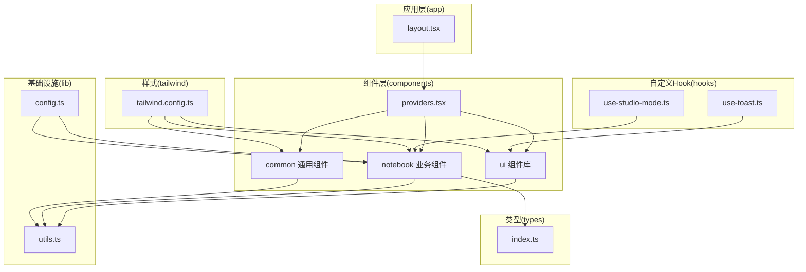
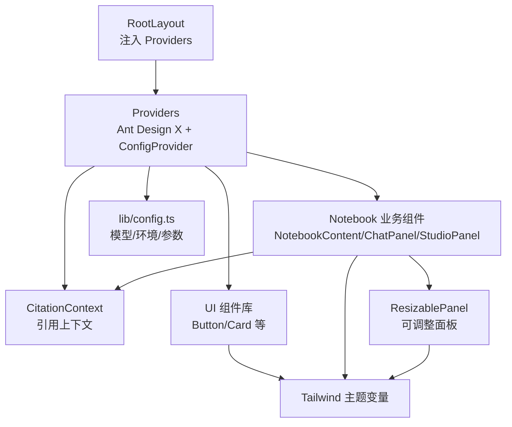
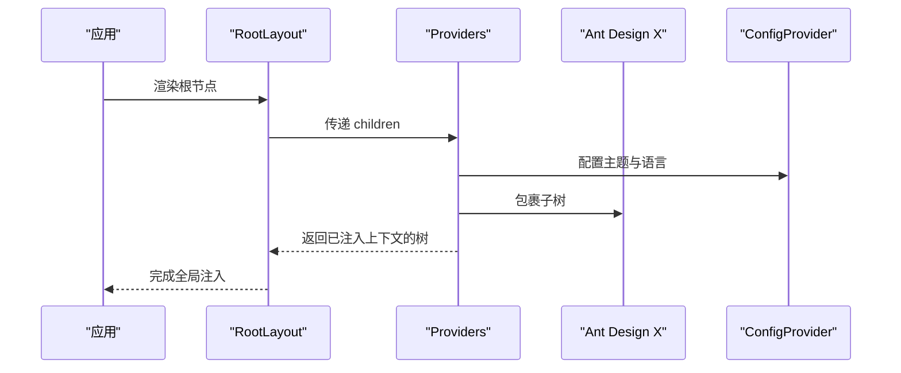
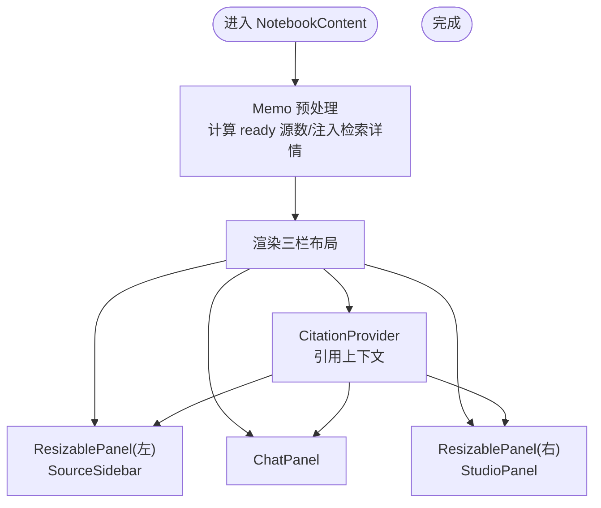
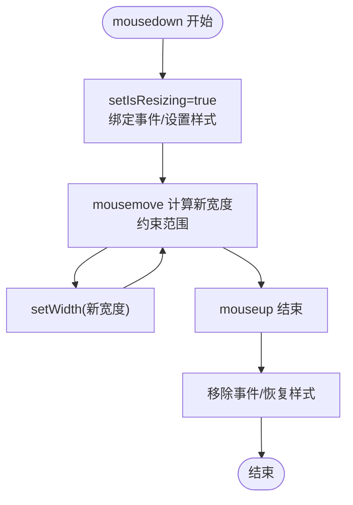
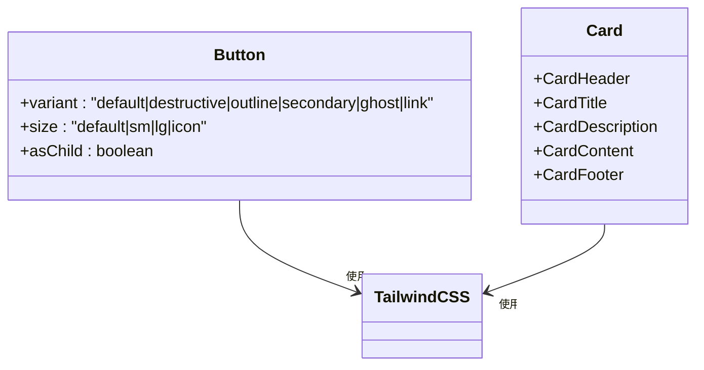
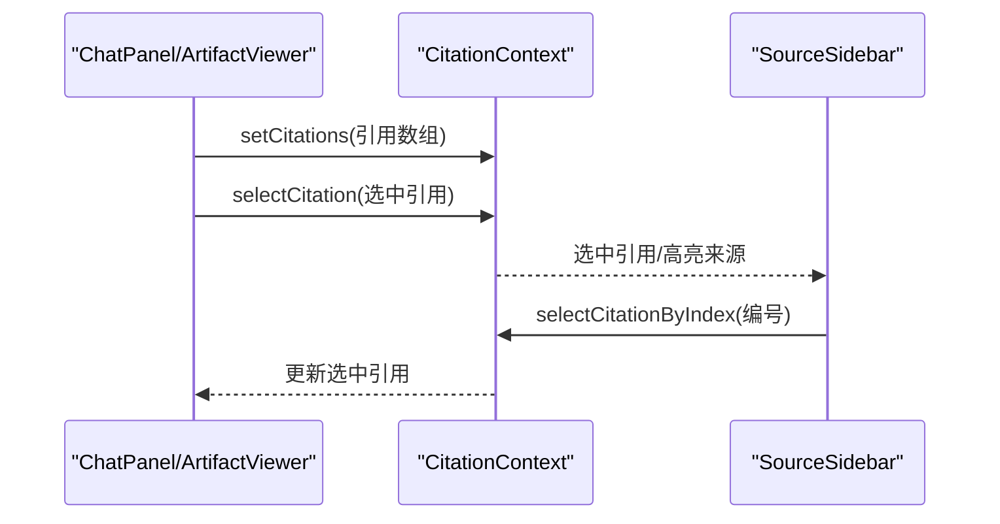
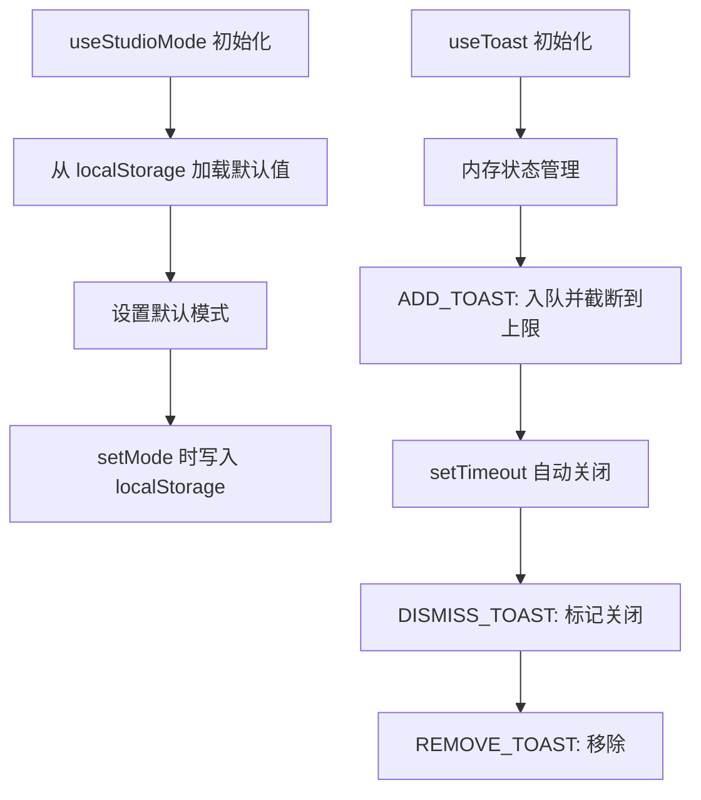
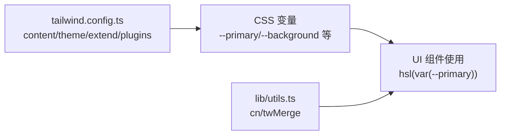
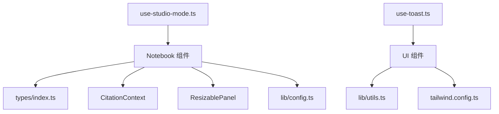

# 组件架构设计

<cite>
**本文档引用的文件**
- [components/providers.tsx](file://components/providers.tsx)
- [app/layout.tsx](file://app/layout.tsx)
- [tailwind.config.ts](file://tailwind.config.ts)
- [components/ui/button.tsx](file://components/ui/button.tsx)
- [components/ui/card.tsx](file://components/ui/card.tsx)
- [components/common/resizable-panel.tsx](file://components/common/resizable-panel.tsx)
- [components/notebook/notebook-content.tsx](file://components/notebook/notebook-content.tsx)
- [hooks/use-studio-mode.ts](file://hooks/use-studio-mode.ts)
- [hooks/use-toast.ts](file://hooks/use-toast.ts)
- [lib/config.ts](file://lib/config.ts)
- [components/notebook/citation-context.tsx](file://components/notebook/citation-context.tsx)
- [components/ui/toaster.tsx](file://components/ui/toaster.tsx)
- [types/index.ts](file://types/index.ts)
- [lib/utils.ts](file://lib/utils.ts)
- [package.json](file://package.json)
</cite>

## 目录
1. [引言](#引言)
2. [项目结构](#项目结构)
3. [核心组件](#核心组件)
4. [架构总览](#架构总览)
5. [详细组件分析](#详细组件分析)
6. [依赖分析](#依赖分析)
7. [性能考虑](#性能考虑)
8. [故障排查指南](#故障排查指南)
9. [结论](#结论)
10. [附录](#附录)

## 引言
本文件面向 notebookLM-clone 项目的前端组件体系，系统梳理组件库的整体架构模式、分层设计、依赖关系与模块化组织方式；重点阐述 Providers 组件的全局状态与主题提供者配置；总结组件设计原则（单一职责、可复用性、可扩展性）；说明组件生命周期管理与数据流、通信机制；解析样式系统（Tailwind CSS 配置、主题变量、响应式设计）；并给出组件开发最佳实践与架构图表，帮助开发者快速理解与高效迭代。

## 项目结构
项目采用 Next.js App Router 结构，按功能域与通用层进行模块化组织：
- app：应用入口与页面路由层，负责根布局、全局样式与 Providers 注入
- components：组件库，分为通用组件(common)、业务组件(notebook)与 UI 组件(ui)
- hooks：自定义 Hook，如状态管理与通知
- lib：基础设施与配置，如 AI 提供商配置、数据库客户端、处理管线等
- types：全局 TypeScript 类型定义
- 样式与工具：Tailwind 配置、工具函数

图表来源
- [app/layout.tsx](file://app/layout.tsx#L15-L30)
- [components/providers.tsx](file://components/providers.tsx#L16-L33)
- [tailwind.config.ts](file://tailwind.config.ts#L1-L95)
- [lib/config.ts](file://lib/config.ts#L1-L187)
- [types/index.ts](file://types/index.ts#L1-L214)

章节来源
- [app/layout.tsx](file://app/layout.tsx#L1-L31)
- [components/providers.tsx](file://components/providers.tsx#L1-L34)
- [tailwind.config.ts](file://tailwind.config.ts#L1-L95)
- [lib/config.ts](file://lib/config.ts#L1-L187)
- [types/index.ts](file://types/index.ts#L1-L214)

## 核心组件
- Providers：全局状态与主题提供者，注入 Ant Design X 与 ConfigProvider，统一主题与语言包
- NotebookContent：三栏布局容器，组合 SourceSidebar、ChatPanel、StudioPanel，并提供引用上下文
- ResizablePanel：可拖拽调整宽度的面板，支持左右手柄与尺寸约束
- UI 组件库：Button、Card 等，基于 class-variance-authority 与 Tailwind，提供变体与尺寸
- 自定义 Hook：useStudioMode（Studio 模式持久化）、useToast（通知队列与去重）
- CitationContext：引用上下文，集中管理选中引用、高亮来源与编号映射
- Toaster：通知渲染器，消费 useToast 状态并渲染 Toast

章节来源
- [components/providers.tsx](file://components/providers.tsx#L16-L33)
- [components/notebook/notebook-content.tsx](file://components/notebook/notebook-content.tsx#L71-L127)
- [components/common/resizable-panel.tsx](file://components/common/resizable-panel.tsx#L20-L92)
- [components/ui/button.tsx](file://components/ui/button.tsx#L43-L54)
- [components/ui/card.tsx](file://components/ui/card.tsx#L5-L76)
- [hooks/use-studio-mode.ts](file://hooks/use-studio-mode.ts#L14-L38)
- [hooks/use-toast.ts](file://hooks/use-toast.ts#L179-L197)
- [components/notebook/citation-context.tsx](file://components/notebook/citation-context.tsx#L46-L88)
- [components/ui/toaster.tsx](file://components/ui/toaster.tsx#L12-L28)

## 架构总览
整体架构以“布局-组件-上下文-样式-配置”为主线：
- 布局层：RootLayout 注入 Providers，确保全局主题与国际化生效
- 组件层：UI 组件提供基础能力；业务组件承载领域逻辑；通用组件复用性强
- 上下文层：CitationContext、Studio 模式状态等通过 React Context 管理跨层级状态
- 样式层：Tailwind CSS 与 CSS 变量结合，提供主题、动画与响应式能力
- 配置层：lib/config.ts 统一模型提供商、环境变量与应用参数校验

图表来源
- [app/layout.tsx](file://app/layout.tsx#L15-L30)
- [components/providers.tsx](file://components/providers.tsx#L16-L33)
- [components/notebook/notebook-content.tsx](file://components/notebook/notebook-content.tsx#L71-L127)
- [components/common/resizable-panel.tsx](file://components/common/resizable-panel.tsx#L20-L92)
- [components/notebook/citation-context.tsx](file://components/notebook/citation-context.tsx#L46-L88)
- [lib/config.ts](file://lib/config.ts#L1-L187)
- [tailwind.config.ts](file://tailwind.config.ts#L10-L86)

## 详细组件分析

### Providers 组件
- 作用：作为全局 Provider 根节点，注入 Ant Design X 与 ConfigProvider，统一主题与语言包
- 实现要点：
  - 使用 ConfigProvider 设置 locale 与主题 token（主色、圆角等），与 UI 设计保持一致
  - 使用 XProvider 包裹子树，提供 Ant Design X 的上下文能力
  - 通过 RootLayout 注入到整个应用树根部，保证全局生效

图表来源
- [app/layout.tsx](file://app/layout.tsx#L15-L30)
- [components/providers.tsx](file://components/providers.tsx#L16-L33)

章节来源
- [components/providers.tsx](file://components/providers.tsx#L16-L33)
- [app/layout.tsx](file://app/layout.tsx#L15-L30)

### NotebookContent 三栏布局
- 作用：三栏布局容器，左侧 SourceSidebar、中间 ChatPanel、右侧 StudioPanel
- 关键点：
  - 使用 ResizablePanel 控制两侧面板默认宽度、最小/最大宽度与拖拽方向
  - 通过 Memo 化预处理数据（统计 ready 源数量、注入检索详情）
  - 通过 CitationProvider 提供引用上下文，支撑引用高亮与来源定位

图表来源
- [components/notebook/notebook-content.tsx](file://components/notebook/notebook-content.tsx#L71-L127)
- [components/common/resizable-panel.tsx](file://components/common/resizable-panel.tsx#L20-L92)
- [components/notebook/citation-context.tsx](file://components/notebook/citation-context.tsx#L46-L88)

章节来源
- [components/notebook/notebook-content.tsx](file://components/notebook/notebook-content.tsx#L71-L127)

### ResizablePanel 可调整面板
- 作用：支持左右手柄拖拽调整宽度，限制最小/最大宽度
- 生命周期与状态：
  - 初始化：读取 defaultWidth，设置 isResizing=false
  - 拖拽开始：注册全局 mousemove/mouseup，设置 body 样式
  - 拖拽中：根据 side 计算新宽度，约束在 [minWidth, maxWidth]
  - 拖拽结束：清理事件监听，恢复 body 样式
- 交互细节：手柄悬浮显示、居中对齐、视觉反馈

图表来源
- [components/common/resizable-panel.tsx](file://components/common/resizable-panel.tsx#L32-L65)

章节来源
- [components/common/resizable-panel.tsx](file://components/common/resizable-panel.tsx#L20-L92)

### UI 组件库（Button、Card）
- Button：基于 class-variance-authority 定义变体与尺寸，支持 asChild 透传
- Card：卡片容器与子块（Header/Title/Description/Content/Footer）组合，统一边框、背景与阴影
- 样式系统：依赖 Tailwind CSS 与 CSS 变量，通过 cn 工具合并类名

图表来源
- [components/ui/button.tsx](file://components/ui/button.tsx#L43-L54)
- [components/ui/card.tsx](file://components/ui/card.tsx#L5-L76)
- [lib/utils.ts](file://lib/utils.ts#L4-L6)

章节来源
- [components/ui/button.tsx](file://components/ui/button.tsx#L1-L58)
- [components/ui/card.tsx](file://components/ui/card.tsx#L1-L77)
- [lib/utils.ts](file://lib/utils.ts#L1-L7)

### CitationContext 引用上下文
- 作用：集中管理选中引用、引用列表与高亮来源，支持按编号选择
- 状态与行为：
  - setCitations：去重更新并为每个引用分配序号
  - selectCitation/selectCitationByIndex：选中引用并同步高亮来源
  - 严格校验：在非 Provider 内使用 useCitation 将抛出错误

图表来源
- [components/notebook/citation-context.tsx](file://components/notebook/citation-context.tsx#L46-L88)

章节来源
- [components/notebook/citation-context.tsx](file://components/notebook/citation-context.tsx#L46-L98)

### 自定义 Hook：useStudioMode 与 useToast
- useStudioMode：Studio 快速/精准模式状态，localStorage 持久化，加载时回填
- useToast：通知队列与去重，最多保留 N 条，自动定时关闭，支持 dismiss/remove

图表来源
- [hooks/use-studio-mode.ts](file://hooks/use-studio-mode.ts#L14-L38)
- [hooks/use-toast.ts](file://hooks/use-toast.ts#L77-L130)

章节来源
- [hooks/use-studio-mode.ts](file://hooks/use-studio-mode.ts#L1-L39)
- [hooks/use-toast.ts](file://hooks/use-toast.ts#L1-L200)

### 样式系统与主题变量
- Tailwind 配置：启用暗色模式、内容扫描路径、CSS 变量扩展、动画与插件
- 主题变量：通过 CSS 变量映射到 hsl(var(--xxx))，在组件中直接使用
- 工具函数：cn 合并类名，twMerge 解决冲突
- 动画与过渡：fade-in、slide-in 等动画，配合组件使用

图表来源
- [tailwind.config.ts](file://tailwind.config.ts#L3-L95)
- [lib/utils.ts](file://lib/utils.ts#L4-L6)

章节来源
- [tailwind.config.ts](file://tailwind.config.ts#L1-L95)
- [lib/utils.ts](file://lib/utils.ts#L1-L7)

### 组件设计原则
- 单一职责：UI 组件只负责外观与交互；业务组件只负责领域逻辑；通用组件只负责可复用能力
- 可复用性：通过变体与尺寸、透传属性、Context 抽象跨层级状态
- 可扩展性：通过 ConfigProvider/XProvider 注入能力；通过类型定义约束接口；通过插件扩展 Tailwind

章节来源
- [components/ui/button.tsx](file://components/ui/button.tsx#L43-L54)
- [components/ui/card.tsx](file://components/ui/card.tsx#L5-L76)
- [components/providers.tsx](file://components/providers.tsx#L16-L33)

### 组件生命周期管理
- 挂载：Providers 在 RootLayout 中一次性注入，确保全局可用
- 更新：useMemo 预处理 Notebook 数据；useStudioMode 在首次渲染后加载持久化状态；useToast 通过内存状态与订阅者模式更新
- 卸载：ResizablePanel 在拖拽结束后清理事件监听；Toaster 渲染后由组件树管理

章节来源
- [components/notebook/notebook-content.tsx](file://components/notebook/notebook-content.tsx#L71-L127)
- [hooks/use-studio-mode.ts](file://hooks/use-studio-mode.ts#L19-L25)
- [hooks/use-toast.ts](file://hooks/use-toast.ts#L136-L141)
- [components/common/resizable-panel.tsx](file://components/common/resizable-panel.tsx#L61-L65)

### 组件间数据流与通信
- 父子组件：NotebookContent -> SourceSidebar/ChatPanel/StudioPanel
- 兄弟组件：通过共享 Context（CitationContext）实现引用状态共享
- 跨层级通信：CitationContext 为跨层级提供统一入口；Toaster 通过全局 Provider 渲染

章节来源
- [components/notebook/notebook-content.tsx](file://components/notebook/notebook-content.tsx#L85-L125)
- [components/notebook/citation-context.tsx](file://components/notebook/citation-context.tsx#L46-L88)
- [components/ui/toaster.tsx](file://components/ui/toaster.tsx#L12-L28)

## 依赖分析
- 组件依赖：UI 组件依赖工具函数与 Tailwind；业务组件依赖类型定义与上下文；通用组件被多处复用
- 外部依赖：Ant Design X、Radix UI、Lucide、@tailwindcss/typography、tailwindcss-animate 等
- 配置依赖：lib/config.ts 为模型与环境变量提供统一入口

图表来源
- [components/ui/button.tsx](file://components/ui/button.tsx#L1-L58)
- [components/ui/card.tsx](file://components/ui/card.tsx#L1-L77)
- [components/notebook/notebook-content.tsx](file://components/notebook/notebook-content.tsx#L71-L127)
- [components/common/resizable-panel.tsx](file://components/common/resizable-panel.tsx#L20-L92)
- [components/notebook/citation-context.tsx](file://components/notebook/citation-context.tsx#L46-L88)
- [hooks/use-studio-mode.ts](file://hooks/use-studio-mode.ts#L1-L39)
- [hooks/use-toast.ts](file://hooks/use-toast.ts#L1-L200)
- [lib/config.ts](file://lib/config.ts#L1-L187)
- [types/index.ts](file://types/index.ts#L1-L214)
- [lib/utils.ts](file://lib/utils.ts#L1-L7)

章节来源
- [package.json](file://package.json#L17-L64)
- [lib/config.ts](file://lib/config.ts#L1-L187)
- [types/index.ts](file://types/index.ts#L1-L214)

## 性能考虑
- 渲染优化：useMemo 预处理昂贵计算（如 ready 源计数、消息元数据注入）
- 事件清理：ResizablePanel 在拖拽结束后移除全局事件监听，避免内存泄漏
- 通知控制：useToast 限制队列长度与自动关闭，降低 UI 抖动
- 样式合并：使用 twMerge 合并类名，减少重复样式导致的重绘

章节来源
- [components/notebook/notebook-content.tsx](file://components/notebook/notebook-content.tsx#L73-L83)
- [components/common/resizable-panel.tsx](file://components/common/resizable-panel.tsx#L61-L65)
- [hooks/use-toast.ts](file://hooks/use-toast.ts#L11-L12)
- [lib/utils.ts](file://lib/utils.ts#L4-L6)

## 故障排查指南
- 环境变量缺失：lib/config.ts 在启动时校验必需变量，若缺失会抛出错误提示
- 向量维度不一致：lib/config.ts 强制校验 EMBEDDING_DIM 必须为 1024，否则抛错
- 引用上下文未包裹：在非 Provider 内调用 useCitation 将抛出错误
- 通知异常：useToast 通过内存状态与订阅者模式驱动 UI 更新，若出现异常可检查 listeners 与 dispatch

章节来源
- [lib/config.ts](file://lib/config.ts#L9-L29)
- [lib/config.ts](file://lib/config.ts#L169-L186)
- [components/notebook/citation-context.tsx](file://components/notebook/citation-context.tsx#L91-L97)
- [hooks/use-toast.ts](file://hooks/use-toast.ts#L132-L141)

## 结论
本项目采用清晰的分层与模块化设计：以 Providers 为根注入全局能力，以 UI 组件提供基础能力，以业务组件承载领域逻辑，以通用组件提升复用性。通过 Context 抽象跨层级状态，借助 Tailwind CSS 与 CSS 变量实现一致的主题与响应式设计。自定义 Hook 提供稳定的全局状态与通知能力。整体架构兼顾可维护性与可扩展性，适合持续演进。

## 附录
- 全局类型定义参考 types/index.ts，涵盖数据模型、消息元数据、Chunk 与 API 请求/响应等
- 样式工具函数 cn 位于 lib/utils.ts，建议在自定义组件中统一使用
- 模型与环境配置集中在 lib/config.ts，便于集中管理与校验

章节来源
- [types/index.ts](file://types/index.ts#L1-L214)
- [lib/utils.ts](file://lib/utils.ts#L1-L7)
- [lib/config.ts](file://lib/config.ts#L1-L187)