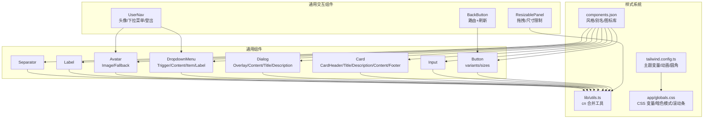
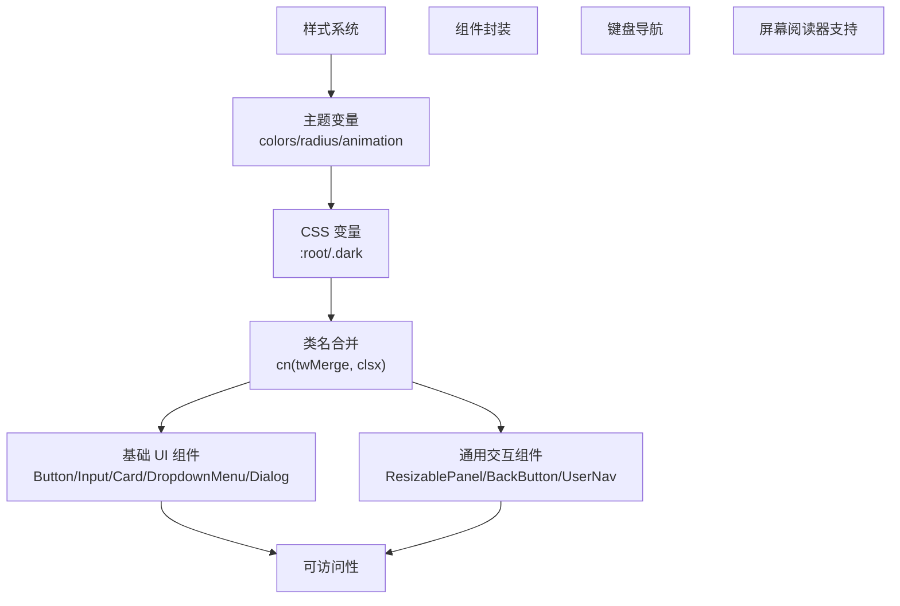
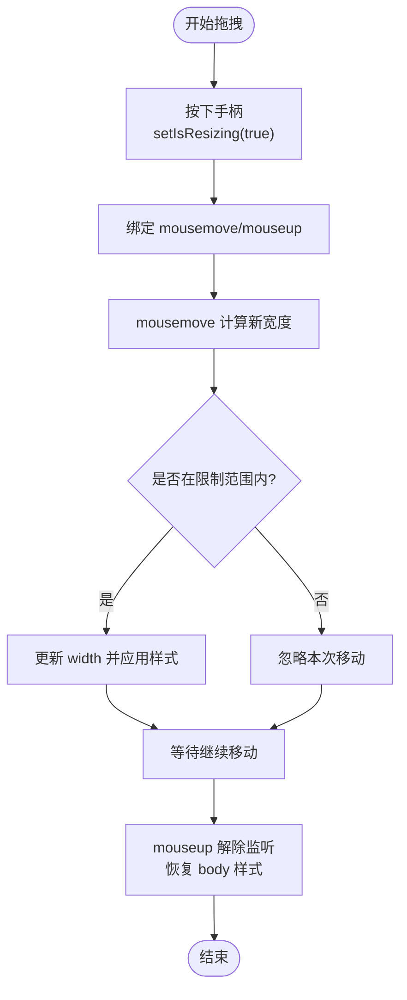
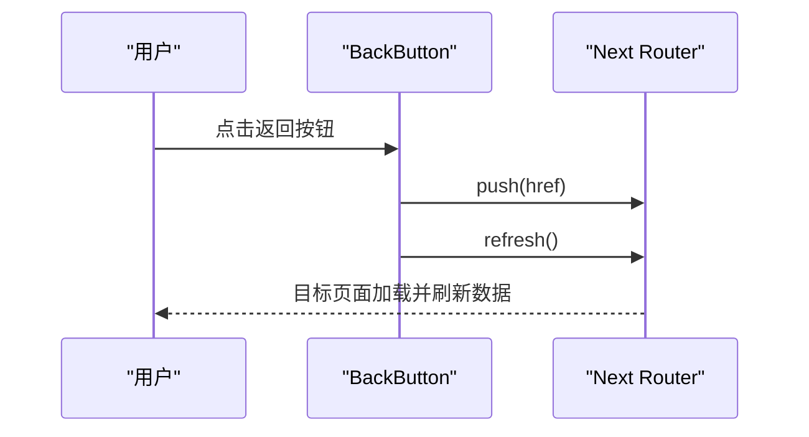
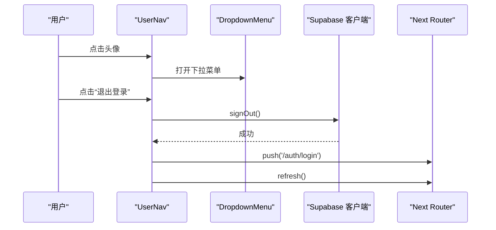
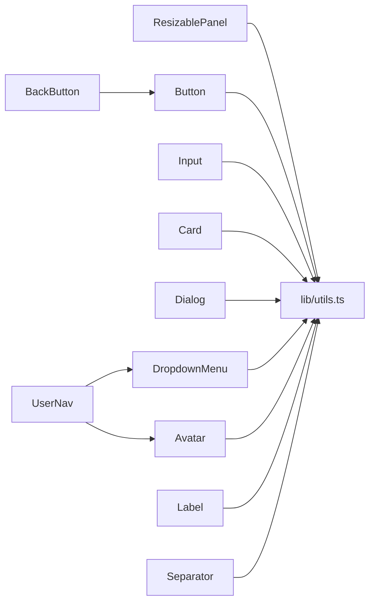

# 通用组件库

<cite>
**本文引用的文件**
- [components/ui/button.tsx](file://components/ui/button.tsx)
- [components/ui/input.tsx](file://components/ui/input.tsx)
- [components/ui/card.tsx](file://components/ui/card.tsx)
- [components/common/resizable-panel.tsx](file://components/common/resizable-panel.tsx)
- [components/common/back-button.tsx](file://components/common/back-button.tsx)
- [components/common/user-nav.tsx](file://components/common/user-nav.tsx)
- [components/ui/avatar.tsx](file://components/ui/avatar.tsx)
- [components/ui/dropdown-menu.tsx](file://components/ui/dropdown-menu.tsx)
- [components/ui/dialog.tsx](file://components/ui/dialog.tsx)
- [components/ui/label.tsx](file://components/ui/label.tsx)
- [components/ui/separator.tsx](file://components/ui/separator.tsx)
- [tailwind.config.ts](file://tailwind.config.ts)
- [components.json](file://components.json)
- [lib/utils.ts](file://lib/utils.ts)
- [app/globals.css](file://app/globals.css)
</cite>

## 目录
1. [简介](#简介)
2. [项目结构](#项目结构)
3. [核心组件](#核心组件)
4. [架构总览](#架构总览)
5. [详细组件分析](#详细组件分析)
6. [依赖关系分析](#依赖关系分析)
7. [性能考量](#性能考量)
8. [故障排查指南](#故障排查指南)
9. [结论](#结论)
10. [附录](#附录)

## 简介
本文件为 notebookLM-clone 项目的通用组件库文档，聚焦基础 UI 组件与通用交互组件的设计规范与实现细节。内容涵盖 Button 按钮、Input 输入框、Card 卡片等基础组件；ResizablePanel 可调整面板的拖拽交互与尺寸限制；BackButton 返回按钮的导航逻辑；UserNav 用户导航菜单的权限与动态展示机制；样式系统（Tailwind CSS 类名规范、主题变量与响应式断点）；可访问性支持（键盘导航、ARIA 属性与屏幕阅读器兼容）；以及测试策略与质量保障建议。文档同时提供使用示例与最佳实践，帮助开发者正确使用与扩展通用组件库。

## 项目结构
通用组件主要位于 components/ui 与 components/common 目录中，采用按功能分层组织：UI 基础组件（如 Button、Input、Card、DropdownMenu、Dialog 等）与通用交互组件（如 ResizablePanel、BackButton、UserNav）。样式系统通过 Tailwind CSS 与自定义主题变量统一管理，并在 app/globals.css 中集中声明。

图表来源
- [components/ui/button.tsx](file://components/ui/button.tsx#L1-L58)
- [components/ui/input.tsx](file://components/ui/input.tsx#L1-L23)
- [components/ui/card.tsx](file://components/ui/card.tsx#L1-L77)
- [components/common/resizable-panel.tsx](file://components/common/resizable-panel.tsx#L1-L93)
- [components/common/back-button.tsx](file://components/common/back-button.tsx#L1-L32)
- [components/common/user-nav.tsx](file://components/common/user-nav.tsx#L1-L82)
- [components/ui/avatar.tsx](file://components/ui/avatar.tsx#L1-L51)
- [components/ui/dropdown-menu.tsx](file://components/ui/dropdown-menu.tsx#L1-L202)
- [components/ui/dialog.tsx](file://components/ui/dialog.tsx#L1-L123)
- [tailwind.config.ts](file://tailwind.config.ts#L1-L95)
- [components.json](file://components.json#L1-L23)
- [lib/utils.ts](file://lib/utils.ts#L1-L7)
- [app/globals.css](file://app/globals.css#L1-L225)

章节来源
- [components/ui/button.tsx](file://components/ui/button.tsx#L1-L58)
- [components/ui/input.tsx](file://components/ui/input.tsx#L1-L23)
- [components/ui/card.tsx](file://components/ui/card.tsx#L1-L77)
- [components/common/resizable-panel.tsx](file://components/common/resizable-panel.tsx#L1-L93)
- [components/common/back-button.tsx](file://components/common/back-button.tsx#L1-L32)
- [components/common/user-nav.tsx](file://components/common/user-nav.tsx#L1-L82)
- [components/ui/avatar.tsx](file://components/ui/avatar.tsx#L1-L51)
- [components/ui/dropdown-menu.tsx](file://components/ui/dropdown-menu.tsx#L1-L202)
- [components/ui/dialog.tsx](file://components/ui/dialog.tsx#L1-L123)
- [tailwind.config.ts](file://tailwind.config.ts#L1-L95)
- [components.json](file://components.json#L1-L23)
- [lib/utils.ts](file://lib/utils.ts#L1-L7)
- [app/globals.css](file://app/globals.css#L1-L225)

## 核心组件
本节对基础 UI 组件进行设计规范与实现要点说明，便于统一风格与行为。

- Button 按钮
  - 设计要点：通过变体（variant）与尺寸（size）组合实现多形态按钮；支持 asChild 渲染为任意元素；内置焦点可见性与禁用态样式；支持内嵌 SVG 图标。
  - 关键实现路径：[按钮变体与尺寸定义](file://components/ui/button.tsx#L7-L35)，[按钮渲染与转发引用](file://components/ui/button.tsx#L43-L55)。
  - 使用建议：优先使用语义化变体（如 default、destructive、ghost、link），避免直接覆盖样式；配合 Tooltip 提升可发现性。

- Input 输入框
  - 设计要点：统一边框、圆角、占位符与焦点环；移动端与桌面端字体大小适配；禁用态与不可输入状态一致化。
  - 关键实现路径：[输入框渲染与类名合并](file://components/ui/input.tsx#L5-L19)。
  - 使用建议：与 Label 配合使用，确保可访问性标签关联；在表单场景中结合错误提示组件。

- Card 卡片
  - 设计要点：卡片容器与头部、标题、描述、内容、底部的标准结构；语义化子组件便于组合与复用。
  - 关键实现路径：[卡片容器与子组件](file://components/ui/card.tsx#L5-L76)。
  - 使用建议：在信息展示与操作区域之间清晰分层；配合阴影与圆角提升层级感。

章节来源
- [components/ui/button.tsx](file://components/ui/button.tsx#L1-L58)
- [components/ui/input.tsx](file://components/ui/input.tsx#L1-L23)
- [components/ui/card.tsx](file://components/ui/card.tsx#L1-L77)

## 架构总览
通用组件库围绕“样式系统 + 组件封装 + 可访问性”的架构展开。样式系统通过 Tailwind CSS 与主题变量统一视觉语言；组件以最小职责原则封装，提供稳定的 API；可访问性通过语义化标签、键盘导航与 ARIA 属性保障。

图表来源
- [tailwind.config.ts](file://tailwind.config.ts#L10-L86)
- [app/globals.css](file://app/globals.css#L5-L82)
- [lib/utils.ts](file://lib/utils.ts#L4-L6)
- [components/ui/button.tsx](file://components/ui/button.tsx#L7-L35)
- [components/common/resizable-panel.tsx](file://components/common/resizable-panel.tsx#L20-L92)
- [components/common/back-button.tsx](file://components/common/back-button.tsx#L17-L31)
- [components/common/user-nav.tsx](file://components/common/user-nav.tsx#L33-L81)

## 详细组件分析

### ResizablePanel 可调整面板
- 交互逻辑
  - 拖拽处理：监听全局 mousemove 与 mouseup，根据 side 判断计算新宽度；仅在 isResizing 状态下生效。
  - 尺寸限制：受 minWidth 与 maxWidth 约束，防止面板过窄或过宽。
  - 动画效果：通过 hover 透明度过渡与拖拽时的 body 光标与选择状态控制，提供直观反馈。
- 关键实现路径
  - [拖拽事件绑定与清理](file://components/common/resizable-panel.tsx#L32-L65)
  - [手柄渲染与定位](file://components/common/resizable-panel.tsx#L75-L89)
  - [宽度计算与样式应用](file://components/common/resizable-panel.tsx#L38-L46)
- 使用建议
  - 在左右布局中合理选择 side，确保手柄不被遮挡；
  - 结合父容器的 flex 布局，避免固定宽度导致溢出；
  - 注意在拖拽过程中禁用文本选择与修改光标，提升体验。

图表来源
- [components/common/resizable-panel.tsx](file://components/common/resizable-panel.tsx#L32-L65)

章节来源
- [components/common/resizable-panel.tsx](file://components/common/resizable-panel.tsx#L1-L93)

### BackButton 返回按钮
- 导航逻辑
  - 使用 Next.js 客户端路由跳转至指定 href；
  - 调用 router.refresh() 强制刷新目标页面数据，确保返回后最新状态。
- 关键实现路径
  - [路由跳转与刷新](file://components/common/back-button.tsx#L20-L24)
  - [按钮渲染与图标](file://components/common/back-button.tsx#L26-L30)
- 使用建议
  - 为不同页面提供明确的返回目标；
  - 与页面标题或面包屑配合，增强上下文感知。

图表来源
- [components/common/back-button.tsx](file://components/common/back-button.tsx#L17-L31)

章节来源
- [components/common/back-button.tsx](file://components/common/back-button.tsx#L1-L32)

### UserNav 用户导航菜单
- 权限与动态显示
  - 基于 Supabase 客户端鉴权，提供登出能力；
  - 头像与昵称动态生成：优先使用头像 URL 与全名，否则回退到邮箱前缀与默认名称；
  - 下拉菜单包含用户信息展示与登出项，登出后重定向至登录页并刷新。
- 关键实现路径
  - [头像与昵称计算](file://components/common/user-nav.tsx#L43-L45)
  - [登出流程与路由刷新](file://components/common/user-nav.tsx#L37-L41)
  - [下拉菜单触发与内容](file://components/common/user-nav.tsx#L48-L80)
- 使用建议
  - 在页面顶部固定位置放置，确保点击区域足够大；
  - 登出后清除本地缓存与会话状态，避免数据残留。

图表来源
- [components/common/user-nav.tsx](file://components/common/user-nav.tsx#L33-L81)

章节来源
- [components/common/user-nav.tsx](file://components/common/user-nav.tsx#L1-L82)
- [components/ui/avatar.tsx](file://components/ui/avatar.tsx#L1-L51)
- [components/ui/dropdown-menu.tsx](file://components/ui/dropdown-menu.tsx#L1-L202)

### Button 按钮
- 设计规范
  - 变体：default、destructive、outline、secondary、ghost、link；
  - 尺寸：default、sm、lg、icon；
  - 行为：支持 asChild 渲染为任意元素；内置焦点环与禁用态；支持内嵌 SVG。
- 关键实现路径
  - [变体与尺寸定义](file://components/ui/button.tsx#L7-L35)
  - [渲染与转发引用](file://components/ui/button.tsx#L43-L55)
- 使用建议
  - 主要操作使用 default 或 primary 对应变体；
  - 危险操作使用 destructive；
  - 图标按钮使用 icon 尺寸并确保可读性。

章节来源
- [components/ui/button.tsx](file://components/ui/button.tsx#L1-L58)

### Input 输入框
- 设计规范
  - 统一边框、圆角、占位符与焦点环；
  - 移动端与桌面端字体大小适配；
  - 禁用态与不可输入状态一致化。
- 关键实现路径
  - [输入框渲染与类名合并](file://components/ui/input.tsx#L5-L19)
- 使用建议
  - 与 Label 配合使用，确保可访问性标签关联；
  - 在表单场景中结合错误提示组件。

章节来源
- [components/ui/input.tsx](file://components/ui/input.tsx#L1-L23)

### Card 卡片
- 设计规范
  - 标准结构：CardHeader、CardTitle、CardDescription、CardContent、CardFooter；
  - 语义化子组件便于组合与复用。
- 关键实现路径
  - [卡片容器与子组件](file://components/ui/card.tsx#L5-L76)
- 使用建议
  - 在信息展示与操作区域之间清晰分层；
  - 配合阴影与圆角提升层级感。

章节来源
- [components/ui/card.tsx](file://components/ui/card.tsx#L1-L77)

### 其他常用组件
- DropdownMenu 下拉菜单
  - 提供 Trigger、Content、Item、Label、Separator 等子组件，支持子菜单与动画入场。
  - 关键实现路径：[下拉菜单内容与动画](file://components/ui/dropdown-menu.tsx#L59-L76)。
- Dialog 对话框
  - 提供 Overlay、Content、Title、Description、Close 等子组件，支持 ESC 关闭与背景遮罩。
  - 关键实现路径：[对话框内容与关闭按钮](file://components/ui/dialog.tsx#L32-L54)。
- Label 标签
  - 与表单控件配对使用，支持禁用态与可访问性。
  - 关键实现路径：[标签样式与变体](file://components/ui/label.tsx#L9-L24)。
- Separator 分隔线
  - 支持水平与垂直方向，用于内容分组与层次分隔。
  - 关键实现路径：[分隔线渲染](file://components/ui/separator.tsx#L12-L28)。

章节来源
- [components/ui/dropdown-menu.tsx](file://components/ui/dropdown-menu.tsx#L1-L202)
- [components/ui/dialog.tsx](file://components/ui/dialog.tsx#L1-L123)
- [components/ui/label.tsx](file://components/ui/label.tsx#L1-L27)
- [components/ui/separator.tsx](file://components/ui/separator.tsx#L1-L32)

## 依赖关系分析
- 组件间耦合
  - ResizablePanel 与工具函数 cn 有直接依赖，用于类名合并与样式控制；
  - BackButton 依赖 Next.js 路由与 Button 组件；
  - UserNav 依赖 Supabase 客户端、Avatar 与 DropdownMenu。
- 外部依赖
  - Radix UI：提供无障碍与可访问性的基础原语；
  - Lucide：提供图标库；
  - Tailwind CSS：提供原子化样式与主题变量；
  - class-variance-authority：提供变体与尺寸的样式组合能力。

图表来源
- [lib/utils.ts](file://lib/utils.ts#L4-L6)
- [components/common/resizable-panel.tsx](file://components/common/resizable-panel.tsx#L20-L92)
- [components/common/back-button.tsx](file://components/common/back-button.tsx#L17-L31)
- [components/common/user-nav.tsx](file://components/common/user-nav.tsx#L33-L81)
- [components/ui/button.tsx](file://components/ui/button.tsx#L43-L55)
- [components/ui/input.tsx](file://components/ui/input.tsx#L5-L19)
- [components/ui/card.tsx](file://components/ui/card.tsx#L5-L76)
- [components/ui/dialog.tsx](file://components/ui/dialog.tsx#L32-L54)
- [components/ui/dropdown-menu.tsx](file://components/ui/dropdown-menu.tsx#L59-L76)
- [components/ui/avatar.tsx](file://components/ui/avatar.tsx#L8-L21)
- [components/ui/label.tsx](file://components/ui/label.tsx#L13-L24)
- [components/ui/separator.tsx](file://components/ui/separator.tsx#L12-L28)

章节来源
- [lib/utils.ts](file://lib/utils.ts#L1-L7)
- [components/common/resizable-panel.tsx](file://components/common/resizable-panel.tsx#L1-L93)
- [components/common/back-button.tsx](file://components/common/back-button.tsx#L1-L32)
- [components/common/user-nav.tsx](file://components/common/user-nav.tsx#L1-L82)
- [components/ui/button.tsx](file://components/ui/button.tsx#L1-L58)
- [components/ui/input.tsx](file://components/ui/input.tsx#L1-L23)
- [components/ui/card.tsx](file://components/ui/card.tsx#L1-L77)
- [components/ui/dialog.tsx](file://components/ui/dialog.tsx#L1-L123)
- [components/ui/dropdown-menu.tsx](file://components/ui/dropdown-menu.tsx#L1-L202)
- [components/ui/avatar.tsx](file://components/ui/avatar.tsx#L1-L51)
- [components/ui/label.tsx](file://components/ui/label.tsx#L1-L27)
- [components/ui/separator.tsx](file://components/ui/separator.tsx#L1-L32)

## 性能考量
- 事件监听管理
  - ResizablePanel 在拖拽期间仅绑定 mousemove 与 mouseup，且在组件卸载时清理监听，避免内存泄漏。
- 样式合并
  - 使用 twMerge 与 clsx 合并类名，减少重复与冲突，降低样式计算成本。
- 动画与交互
  - 下拉菜单与对话框使用 CSS 动画入场，避免 JavaScript 控制动画带来的卡顿。
- 建议
  - 避免在渲染路径中执行昂贵计算；
  - 对频繁变化的状态使用防抖或节流；
  - 合理拆分组件，减少不必要的重渲染。

## 故障排查指南
- 按钮无焦点环或禁用态异常
  - 检查是否正确引入 cn 工具与 Tailwind 样式；
  - 确认变体与尺寸参数传入正确。
  - 参考路径：[按钮样式与变体](file://components/ui/button.tsx#L7-L35)。
- 输入框无法获得焦点或样式错乱
  - 确认类名合并顺序与 Tailwind 片段顺序；
  - 检查禁用态与只读态的条件样式。
  - 参考路径：[输入框类名合并](file://components/ui/input.tsx#L10-L13)。
- 下拉菜单不显示或无法关闭
  - 检查 DropdownMenu 的 Portal 与 Trigger 是否正确包裹；
  - 确认子项的禁用态与点击回调未被意外阻止。
  - 参考路径：[下拉菜单内容与子项](file://components/ui/dropdown-menu.tsx#L59-L94)。
- 对话框无法关闭或背景遮罩无效
  - 确认 DialogClose 与 Overlay 的样式与事件绑定；
  - 检查 ESC 键盘事件是否被其他组件拦截。
  - 参考路径：[对话框关闭与遮罩](file://components/ui/dialog.tsx#L17-L54)。
- 可访问性问题
  - 确保所有交互元素具备可访问名称（aria-label 或标题属性）；
  - 为图标按钮提供 title 或 sr-only 文本；
  - 使用语义化标签与正确的角色属性。
  - 参考路径：[对话框关闭按钮的 sr-only 文本](file://components/ui/dialog.tsx#L49-L49)。

章节来源
- [components/ui/button.tsx](file://components/ui/button.tsx#L7-L35)
- [components/ui/input.tsx](file://components/ui/input.tsx#L10-L13)
- [components/ui/dropdown-menu.tsx](file://components/ui/dropdown-menu.tsx#L59-L94)
- [components/ui/dialog.tsx](file://components/ui/dialog.tsx#L17-L54)

## 结论
通用组件库通过统一的样式系统与组件封装，实现了高内聚、低耦合的基础 UI 能力与通用交互体验。ResizablePanel、BackButton、UserNav 等组件在交互一致性、可访问性与性能方面均提供了良好实践。建议在业务组件中遵循本文档的设计规范与最佳实践，确保整体风格一致与用户体验稳定。

## 附录
- 样式系统说明
  - Tailwind CSS 类名规范
    - 使用原子化类名组合，避免内联样式；
    - 通过变体与尺寸参数控制外观，减少定制化样式。
  - 主题变量
    - 在 :root 与 .dark 中定义主题变量，支持明暗主题切换；
    - 使用 hsl(var(--xxx)) 形式，便于统一换算与主题扩展。
  - 响应式断点
    - 使用 Tailwind 默认断点（sm、md、lg、xl、2xl）适配多设备；
    - 在组件中避免硬编码像素值，优先使用相对单位与语义化尺寸。
  - 关键实现路径
    - [主题变量与动画定义](file://tailwind.config.ts#L10-L86)
    - [CSS 变量与暗色模式](file://app/globals.css#L5-L82)
    - [类名合并工具](file://lib/utils.ts#L4-L6)
    - [组件样式配置](file://components.json#L6-L12)
- 可访问性支持
  - 键盘导航：确保所有交互元素可通过 Tab 到达，Enter/Space 触发；
  - ARIA 属性：为复杂组件提供 role、aria-expanded、aria-controls 等；
  - 屏幕阅读器：为图标与隐藏文本提供替代文本或 sr-only 文本。
  - 关键实现路径
    - [对话框关闭按钮的 sr-only 文本](file://components/ui/dialog.tsx#L49-L49)
- 测试策略与质量保证
  - 单元测试：针对组件 props 与状态变更进行断言；
  - 可访问性测试：使用 axe-core 或 Lighthouse 进行自动化检查；
  - 交互测试：模拟拖拽、点击、键盘操作等关键流程；
  - 回归测试：在主题切换、窗口尺寸变化等场景验证组件表现。

章节来源
- [tailwind.config.ts](file://tailwind.config.ts#L10-L86)
- [app/globals.css](file://app/globals.css#L5-L82)
- [lib/utils.ts](file://lib/utils.ts#L4-L6)
- [components.json](file://components.json#L6-L12)
- [components/ui/dialog.tsx](file://components/ui/dialog.tsx#L49-L49)