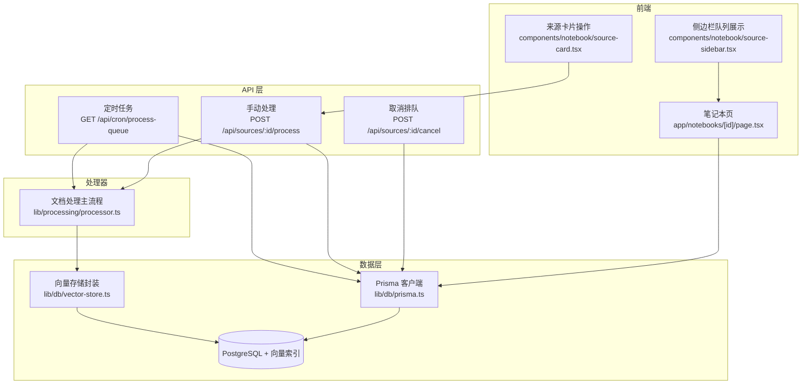
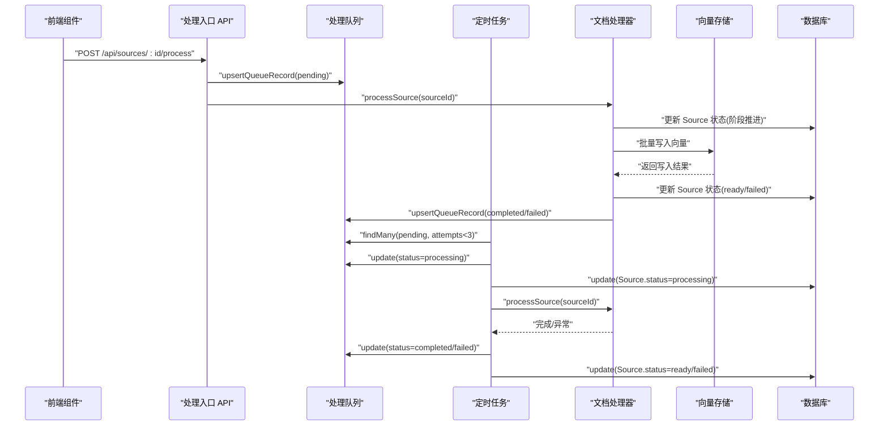
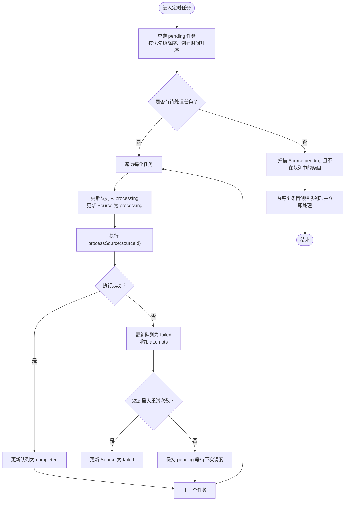
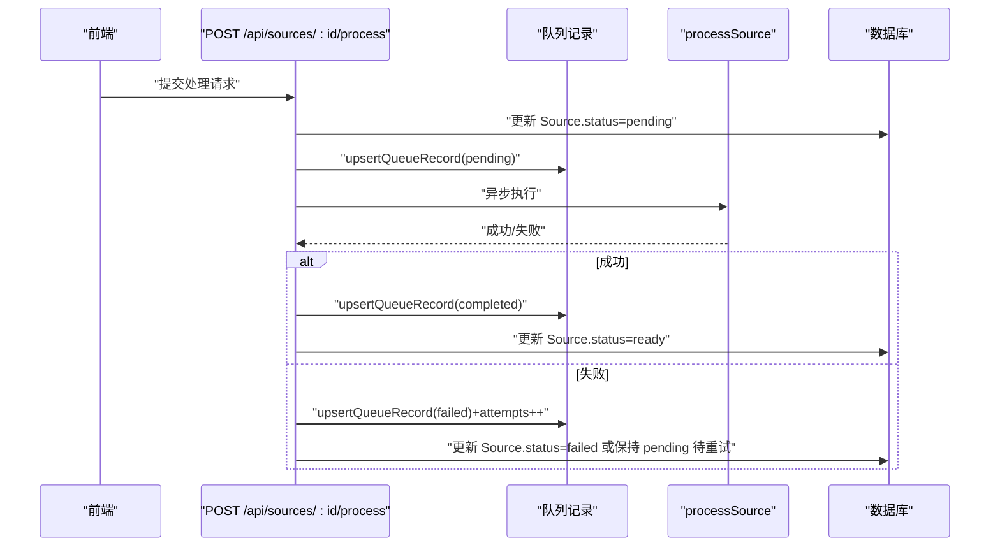
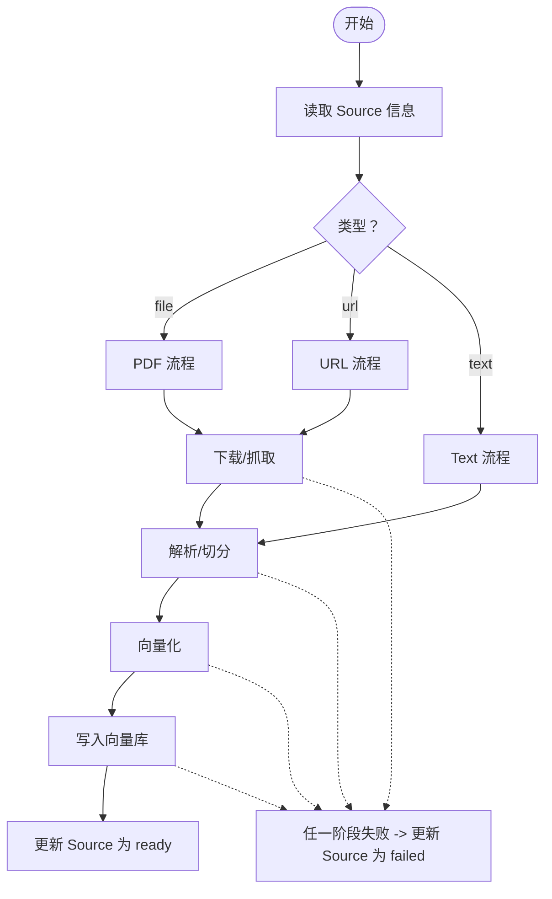
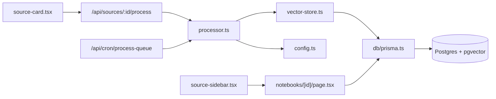
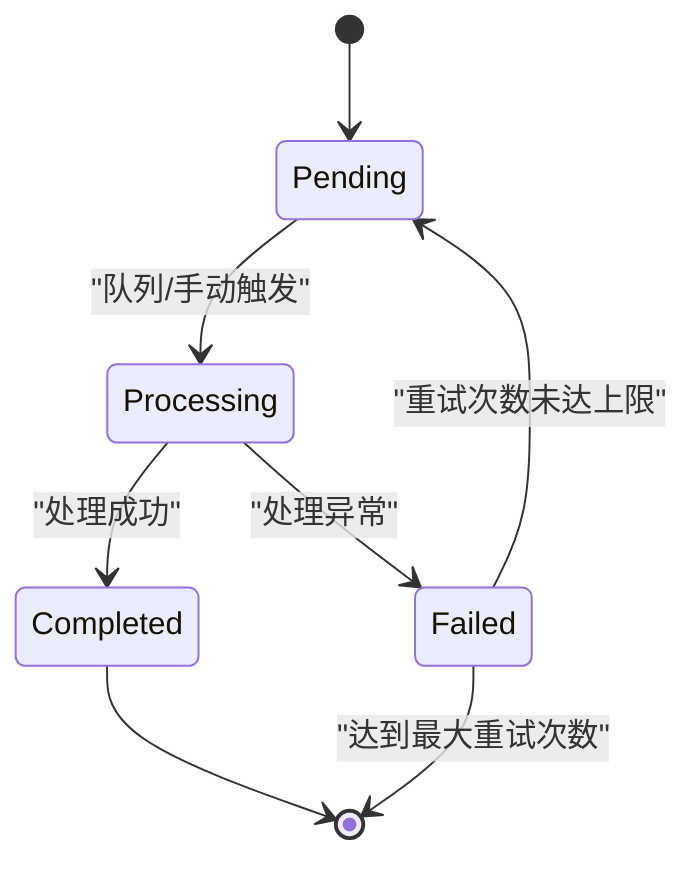

# 处理队列系统

<cite>
**本文引用的文件**
- [app/api/cron/process-queue/route.ts](file://app/api/cron/process-queue/route.ts)
- [app/api/sources/[id]/process/route.ts](file://app/api/sources/[id]/process/route.ts)
- [app/api/sources/[id]/cancel/route.ts](file://app/api/sources/[id]/cancel/route.ts)
- [lib/processing/processor.ts](file://lib/processing/processor.ts)
- [lib/db/prisma.ts](file://lib/db/prisma.ts)
- [lib/db/vector-store.ts](file://lib/db/vector-store.ts)
- [lib/config.ts](file://lib/config.ts)
- [types/index.ts](file://types/index.ts)
- [app/notebooks/[id]/page.tsx](file://app/notebooks/[id]/page.tsx)
- [components/notebook/source-sidebar.tsx](file://components/notebook/source-sidebar.tsx)
- [components/notebook/source-card.tsx](file://components/notebook/source-card.tsx)
- [prisma/migrations/20260120120000_add_unique_constraint/migration.sql](file://prisma/migrations/20260120120000_add_unique_constraint/migration.sql)
- [prisma/migrations/20260120120300_add_composite_indexes/migration.sql](file://prisma/migrations/20260120120300_add_composite_indexes/migration.sql)
</cite>

## 目录
1. [简介](#简介)
2. [项目结构](#项目结构)
3. [核心组件](#核心组件)
4. [架构总览](#架构总览)
5. [详细组件分析](#详细组件分析)
6. [依赖关系分析](#依赖关系分析)
7. [性能考量](#性能考量)
8. [故障排除指南](#故障排除指南)
9. [结论](#结论)
10. [附录](#附录)

## 简介
本文件系统化梳理 notebookLM-clone 项目的“处理队列系统”，围绕异步任务处理的设计与实现展开，覆盖队列管理、任务调度、状态跟踪、错误与重试、监控与管理、扩展性设计、配置与调优以及与数据库的集成方式。文档以代码为依据，辅以图示帮助读者快速理解从“提交任务”到“完成入库”的全链路。

## 项目结构
处理队列系统主要由以下模块构成：
- API 层：定时拉取与手动触发的任务入口；取消队列项的接口
- 处理器：统一的文档处理流程编排（PDF/URL/Text），负责阶段状态推进与向量写入
- 数据层：Prisma 客户端与连接池、向量存储封装、数据库迁移与索引
- 前端：展示队列状态、位置与操作入口（立即处理、取消排队）

**图表来源**
- [app/api/cron/process-queue/route.ts](file://app/api/cron/process-queue/route.ts#L11-L164)
- [app/api/sources/[id]/process/route.ts](file://app/api/sources/[id]/process/route.ts#L78-L138)
- [app/api/sources/[id]/cancel/route.ts](file://app/api/sources/[id]/cancel/route.ts#L5-L44)
- [lib/processing/processor.ts](file://lib/processing/processor.ts#L402-L420)
- [lib/db/prisma.ts](file://lib/db/prisma.ts#L1-L41)
- [lib/db/vector-store.ts](file://lib/db/vector-store.ts#L77-L173)
- [app/notebooks/[id]/page.tsx](file://app/notebooks/[id]/page.tsx#L54-L95)
- [components/notebook/source-sidebar.tsx](file://components/notebook/source-sidebar.tsx#L276-L307)
- [components/notebook/source-card.tsx](file://components/notebook/source-card.tsx#L396-L447)

**章节来源**
- [app/api/cron/process-queue/route.ts](file://app/api/cron/process-queue/route.ts#L11-L164)
- [app/api/sources/[id]/process/route.ts](file://app/api/sources/[id]/process/route.ts#L78-L138)
- [app/api/sources/[id]/cancel/route.ts](file://app/api/sources/[id]/cancel/route.ts#L5-L44)
- [lib/processing/processor.ts](file://lib/processing/processor.ts#L1-L560)
- [lib/db/prisma.ts](file://lib/db/prisma.ts#L1-L41)
- [lib/db/vector-store.ts](file://lib/db/vector-store.ts#L1-L446)
- [app/notebooks/[id]/page.tsx](file://app/notebooks/[id]/page.tsx#L54-L95)
- [components/notebook/source-sidebar.tsx](file://components/notebook/source-sidebar.tsx#L276-L307)
- [components/notebook/source-card.tsx](file://components/notebook/source-card.tsx#L396-L447)

## 核心组件
- 处理队列实体与状态
  - 队列状态：pending、processing、completed、failed、cancelled
  - 任务属性：优先级、重试次数、开始/完成时间、错误信息等
  - 与 Source 状态联动：当队列状态变化时同步更新 Source 的状态与日志字段
- 定时任务处理器
  - 每次仅拉取少量任务（BATCH_SIZE），避免超时
  - 优先级与创建时间排序，确保高优先级与更早任务优先
  - 自修复：若发现 Source 处于 pending 却不在队列中，则补入队列并立即处理
- 手动处理入口
  - 将 Source 置为 pending，创建/更新队列记录，异步执行处理流程
  - 处理完成后更新队列与 Source 状态
- 取消排队
  - 将处于 pending/processing 的队列项标记为 cancelled，并写入完成时间
- 文档处理主流程
  - 支持 PDF、URL、Text 三种来源类型
  - 阶段化推进：下载/抓取、解析、切分、向量化、写入数据库
  - 严格维度校验与批量写入，保障向量一致性与性能
- 数据库与向量存储
  - Prisma 使用 Postgres + pgvector，提供批量插入、相似度检索、混合检索
  - 迁移中添加唯一约束与复合索引，提升一致性与查询性能

**章节来源**
- [types/index.ts](file://types/index.ts#L10-L16)
- [app/api/cron/process-queue/route.ts](file://app/api/cron/process-queue/route.ts#L38-L152)
- [app/api/sources/[id]/process/route.ts](file://app/api/sources/[id]/process/route.ts#L10-L76)
- [app/api/sources/[id]/cancel/route.ts](file://app/api/sources/[id]/cancel/route.ts#L28-L37)
- [lib/processing/processor.ts](file://lib/processing/processor.ts#L82-L209)
- [lib/db/vector-store.ts](file://lib/db/vector-store.ts#L77-L173)
- [prisma/migrations/20260120120000_add_unique_constraint/migration.sql](file://prisma/migrations/20260120120000_add_unique_constraint/migration.sql#L1-L26)
- [prisma/migrations/20260120120300_add_composite_indexes/migration.sql](file://prisma/migrations/20260120120300_add_composite_indexes/migration.sql#L1-L20)

## 架构总览
下图展示了“手动触发”和“定时拉取”两条路径如何协同工作，最终将处理结果写入向量数据库并回写 Source 状态。

**图表来源**
- [app/api/sources/[id]/process/route.ts](file://app/api/sources/[id]/process/route.ts#L10-L76)
- [app/api/cron/process-queue/route.ts](file://app/api/cron/process-queue/route.ts#L38-L107)
- [lib/processing/processor.ts](file://lib/processing/processor.ts#L402-L420)
- [lib/db/vector-store.ts](file://lib/db/vector-store.ts#L77-L173)

## 详细组件分析

### 组件 A：定时任务处理器（/api/cron/process-queue）
- 设计要点
  - 限流：每次仅取固定数量的任务，避免超时
  - 排序：优先级降序、创建时间升序，兼顾公平与紧急
  - 自修复：若发现 Source 处于 pending 但不在队列中，补入队列并立即处理
  - 错误处理：捕获异常，更新队列与 Source 的失败状态与重试次数
- 关键行为
  - 查询 pending 且重试次数小于阈值的任务
  - 将任务置为 processing，更新 Source 状态
  - 调用处理函数，完成后更新队列为 completed 或失败
  - 若队列为空，扫描 Source 表进行兜底修复

**图表来源**
- [app/api/cron/process-queue/route.ts](file://app/api/cron/process-queue/route.ts#L38-L152)

**章节来源**
- [app/api/cron/process-queue/route.ts](file://app/api/cron/process-queue/route.ts#L11-L164)

### 组件 B：手动处理入口（/api/sources/:id/process）
- 设计要点
  - 权限校验：基于 Supabase 的用户与笔记所有权验证
  - 队列记录：通过 upsertQueueRecord 统一维护队列状态、优先级、重试次数与时间戳
  - 异步执行：不阻塞请求，完成后回调更新队列与 Source 状态
  - 重试策略：根据最大重试次数决定是否将 Source 置为 failed
- 关键行为
  - 将 Source 状态置为 pending
  - 创建/更新队列记录为 processing
  - 异步执行 processSource，成功则 completed，失败则进入 handleFailure 流程

**图表来源**
- [app/api/sources/[id]/process/route.ts](file://app/api/sources/[id]/process/route.ts#L78-L138)
- [app/api/sources/[id]/process/route.ts](file://app/api/sources/[id]/process/route.ts#L10-L76)

**章节来源**
- [app/api/sources/[id]/process/route.ts](file://app/api/sources/[id]/process/route.ts#L1-L140)

### 组件 C：取消排队（/api/sources/:id/cancel）
- 设计要点
  - 仅对处于 pending/processing 的队列项进行取消
  - 标记为 cancelled 并写入完成时间
- 关键行为
  - 查询 Source 与所有权验证
  - 批量更新队列项状态为 cancelled

**章节来源**
- [app/api/sources/[id]/cancel/route.ts](file://app/api/sources/[id]/cancel/route.ts#L1-L46)

### 组件 D：文档处理主流程（lib/processing/processor）
- 设计要点
  - 阶段化：download/fetch → parse → chunk → embed → index
  - 统一日志：记录各阶段耗时、数量、tokens 使用等
  - 维度一致性：严格校验 embedding 维度与配置一致
  - 批量写入：分批插入，避免单次过大事务
- 关键行为
  - 根据 Source 类型（file/url/text）选择对应处理分支
  - 每个阶段更新 Source 状态与处理日志
  - 向量写入前去重（基于 content_hash），写入后更新 Source 元信息

**图表来源**
- [lib/processing/processor.ts](file://lib/processing/processor.ts#L402-L420)
- [lib/processing/processor.ts](file://lib/processing/processor.ts#L82-L209)
- [lib/processing/processor.ts](file://lib/processing/processor.ts#L215-L397)
- [lib/processing/processor.ts](file://lib/processing/processor.ts#L426-L526)

**章节来源**
- [lib/processing/processor.ts](file://lib/processing/processor.ts#L1-L560)

### 组件 E：数据层与向量存储（lib/db）
- Prisma 客户端
  - 使用连接池适配器，Serverless 环境下限制每实例连接数
  - 开发环境下输出日志，生产环境减少噪声
- 向量存储封装
  - 批量插入：分批写入，避免单次过大
  - 维度校验：写入前检查 embedding 维度
  - 搜索与混合检索：支持向量相似度与全文检索组合
  - 去重：基于 content_hash，避免重复写入
- 数据库迁移
  - 唯一约束：确保 (source_id, chunk_index) 唯一
  - 复合索引：优化 notebook_id 过滤与时间范围查询

**章节来源**
- [lib/db/prisma.ts](file://lib/db/prisma.ts#L1-L41)
- [lib/db/vector-store.ts](file://lib/db/vector-store.ts#L77-L173)
- [lib/db/vector-store.ts](file://lib/db/vector-store.ts#L175-L297)
- [lib/db/vector-store.ts](file://lib/db/vector-store.ts#L305-L310)
- [prisma/migrations/20260120120000_add_unique_constraint/migration.sql](file://prisma/migrations/20260120120000_add_unique_constraint/migration.sql#L1-L26)
- [prisma/migrations/20260120120300_add_composite_indexes/migration.sql](file://prisma/migrations/20260120120300_add_composite_indexes/migration.sql#L1-L20)

### 组件 F：前端队列展示与交互
- 笔记本页聚合队列状态，计算队列位置（基于优先级与创建时间）
- 侧边栏展示队列项，显示“处理中/队列第 N 位”等信息
- 来源卡片提供“立即处理”“取消排队”按钮，触发相应 API

**章节来源**
- [app/notebooks/[id]/page.tsx](file://app/notebooks/[id]/page.tsx#L54-L95)
- [components/notebook/source-sidebar.tsx](file://components/notebook/source-sidebar.tsx#L276-L307)
- [components/notebook/source-card.tsx](file://components/notebook/source-card.tsx#L396-L447)

## 依赖关系分析
- 组件耦合
  - API 层依赖 Prisma 与处理器；处理器依赖向量存储与配置
  - 前端依赖 API 返回的队列状态与 Source 信息
- 外部依赖
  - Supabase 存储与认证
  - Postgres + pgvector
- 潜在循环依赖
  - 当前结构清晰，无明显循环导入

**图表来源**
- [app/api/sources/[id]/process/route.ts](file://app/api/sources/[id]/process/route.ts#L1-L140)
- [app/api/cron/process-queue/route.ts](file://app/api/cron/process-queue/route.ts#L1-L165)
- [lib/processing/processor.ts](file://lib/processing/processor.ts#L1-L560)
- [lib/db/vector-store.ts](file://lib/db/vector-store.ts#L1-L446)
- [lib/db/prisma.ts](file://lib/db/prisma.ts#L1-L41)
- [lib/config.ts](file://lib/config.ts#L1-L187)
- [app/notebooks/[id]/page.tsx](file://app/notebooks/[id]/page.tsx#L54-L95)
- [components/notebook/source-sidebar.tsx](file://components/notebook/source-sidebar.tsx#L276-L307)
- [components/notebook/source-card.tsx](file://components/notebook/source-card.tsx#L396-L447)

**章节来源**
- [app/api/sources/[id]/process/route.ts](file://app/api/sources/[id]/process/route.ts#L1-L140)
- [app/api/cron/process-queue/route.ts](file://app/api/cron/process-queue/route.ts#L1-L165)
- [lib/processing/processor.ts](file://lib/processing/processor.ts#L1-L560)
- [lib/db/vector-store.ts](file://lib/db/vector-store.ts#L1-L446)
- [lib/db/prisma.ts](file://lib/db/prisma.ts#L1-L41)
- [lib/config.ts](file://lib/config.ts#L1-L187)
- [app/notebooks/[id]/page.tsx](file://app/notebooks/[id]/page.tsx#L54-L95)
- [components/notebook/source-sidebar.tsx](file://components/notebook/source-sidebar.tsx#L276-L307)
- [components/notebook/source-card.tsx](file://components/notebook/source-card.tsx#L396-L447)

## 性能考量
- 并发与限流
  - 定时任务每次仅处理少量任务，避免超时与资源争用
  - Serverless 环境下限制每实例连接数，降低数据库压力
- 批量写入与索引
  - 向量写入采用分批（默认每批上限）策略，减少单次事务开销
  - 唯一约束与复合索引提升写入一致性与查询效率
- 维度校验与去重
  - 写入前严格校验 embedding 维度，避免后续检索异常
  - 基于 content_hash 去重，减少重复写入与存储浪费
- 超时与重试
  - 队列项具备最大重试次数限制，超过阈值标记失败并停止重试
  - 定时任务自修复兜底，确保“挂起”任务最终被处理

**章节来源**
- [app/api/cron/process-queue/route.ts](file://app/api/cron/process-queue/route.ts#L7-L7)
- [lib/db/prisma.ts](file://lib/db/prisma.ts#L8-L16)
- [lib/db/vector-store.ts](file://lib/db/vector-store.ts#L9-L9)
- [lib/db/vector-store.ts](file://lib/db/vector-store.ts#L92-L99)
- [lib/db/vector-store.ts](file://lib/db/vector-store.ts#L105-L140)
- [app/api/sources/[id]/process/route.ts](file://app/api/sources/[id]/process/route.ts#L6-L8)
- [app/api/cron/process-queue/route.ts](file://app/api/cron/process-queue/route.ts#L43-L43)

## 故障排除指南
- 常见问题与定位
  - 任务长时间 pending：检查定时任务是否正常运行、是否达到最大重试次数
  - Source 处于 pending 但无队列记录：查看定时任务自修复逻辑是否生效
  - 处理失败：查看队列与 Source 的错误信息字段，结合处理日志定位阶段
  - 向量维度不匹配：确认 EMBEDDING_DIM 配置与数据库一致
- 建议排查步骤
  - 查看队列记录：确认 status、priority、attempts、createdAt、startedAt、completedAt
  - 查看 Source 状态与处理日志：定位具体失败阶段
  - 检查数据库索引与唯一约束：确保写入一致性
  - 核对环境变量与配置：确保数据库连接与模型维度正确

**章节来源**
- [app/api/cron/process-queue/route.ts](file://app/api/cron/process-queue/route.ts#L111-L152)
- [app/api/sources/[id]/process/route.ts](file://app/api/sources/[id]/process/route.ts#L44-L76)
- [lib/config.ts](file://lib/config.ts#L6-L29)
- [prisma/migrations/20260120120000_add_unique_constraint/migration.sql](file://prisma/migrations/20260120120000_add_unique_constraint/migration.sql#L1-L26)

## 结论
本队列系统以“最小可用”为目标，在 Serverless 与受限资源环境下实现了稳定的异步处理能力。通过统一的队列记录、阶段化的处理流程、严格的维度与去重校验，以及定时任务自修复机制，系统在可靠性与可维护性之间取得平衡。后续可在水平扩展、分布式调度与更细粒度的监控指标方面进一步演进。

## 附录

### 队列数据结构与字段说明
- processing_queue 表（抽象）
  - 字段：id、sourceId、status、priority、attempts、startedAt、completedAt、errorMessage、createdAt、updatedAt
  - 约束：唯一性与索引（参考迁移文件）
- source 表（抽象）
  - 字段：id、status、retryCount、errorMessage、processingLog、meta、updatedAt
  - 与队列状态联动更新

**章节来源**
- [types/index.ts](file://types/index.ts#L10-L16)
- [app/api/sources/[id]/process/route.ts](file://app/api/sources/[id]/process/route.ts#L10-L42)
- [app/api/cron/process-queue/route.ts](file://app/api/cron/process-queue/route.ts#L58-L79)
- [lib/processing/processor.ts](file://lib/processing/processor.ts#L56-L77)
- [prisma/migrations/20260120120000_add_unique_constraint/migration.sql](file://prisma/migrations/20260120120000_add_unique_constraint/migration.sql#L1-L26)

### 任务执行流程与状态机

**图表来源**
- [types/index.ts](file://types/index.ts#L10-L16)
- [app/api/sources/[id]/process/route.ts](file://app/api/sources/[id]/process/route.ts#L44-L76)
- [app/api/cron/process-queue/route.ts](file://app/api/cron/process-queue/route.ts#L87-L106)

### 队列监控与管理
- 任务状态查询：前端页面聚合队列记录，计算队列位置
- 进度跟踪：阶段化日志与处理时长
- 性能统计：向量写入与检索的日志指标
- 容量管理：通过批量大小与重试阈值控制吞吐与资源占用

**章节来源**
- [app/notebooks/[id]/page.tsx](file://app/notebooks/[id]/page.tsx#L54-L95)
- [lib/processing/processor.ts](file://lib/processing/processor.ts#L33-L51)
- [lib/db/vector-store.ts](file://lib/db/vector-store.ts#L142-L172)
- [lib/db/vector-store.ts](file://lib/db/vector-store.ts#L268-L296)

### 扩展性设计与分布式处理
- 水平扩展
  - 多实例定时任务：各自拉取队列任务，互不冲突（依赖唯一性与幂等）
  - 连接池：限制每实例连接数，避免数据库过载
- 分布式处理
  - 通过队列解耦前端与后台处理，便于引入消息队列或外部调度器
- 集群协调
  - 建议在多实例部署时统一时间源与幂等写入策略，避免重复处理

**章节来源**
- [lib/db/prisma.ts](file://lib/db/prisma.ts#L8-L16)
- [app/api/cron/process-queue/route.ts](file://app/api/cron/process-queue/route.ts#L7-L7)

### 配置选项与性能调优
- 关键配置
  - EMBEDDING_DIM：必须与数据库向量维度一致
  - BATCH_SIZE：定时任务每次处理的任务数
  - maxAttempts：队列项最大重试次数
- 调优建议
  - 根据实例资源调整 BATCH_SIZE
  - 合理设置重试阈值，避免无限重试
  - 优化数据库索引与批量写入批次大小

**章节来源**
- [lib/config.ts](file://lib/config.ts#L6-L29)
- [app/api/cron/process-queue/route.ts](file://app/api/cron/process-queue/route.ts#L7-L7)
- [app/api/sources/[id]/process/route.ts](file://app/api/sources/[id]/process/route.ts#L6-L8)
- [lib/db/vector-store.ts](file://lib/db/vector-store.ts#L9-L9)

### 与数据库的集成方式
- 事务与一致性
  - 写入向量前进行维度校验与去重，避免脏数据
  - 批量写入采用分批策略，降低单次事务风险
- 数据同步
  - 队列状态与 Source 状态双向同步，确保前端展示与后端处理一致
- 索引与查询优化
  - 唯一约束保证 (source_id, chunk_index) 唯一
  - 复合索引支持 notebook_id 过滤与时间范围查询

**章节来源**
- [lib/db/vector-store.ts](file://lib/db/vector-store.ts#L92-L99)
- [lib/db/vector-store.ts](file://lib/db/vector-store.ts#L105-L140)
- [lib/db/vector-store.ts](file://lib/db/vector-store.ts#L175-L297)
- [prisma/migrations/20260120120000_add_unique_constraint/migration.sql](file://prisma/migrations/20260120120000_add_unique_constraint/migration.sql#L1-L26)
- [prisma/migrations/20260120120300_add_composite_indexes/migration.sql](file://prisma/migrations/20260120120300_add_composite_indexes/migration.sql#L1-L20)