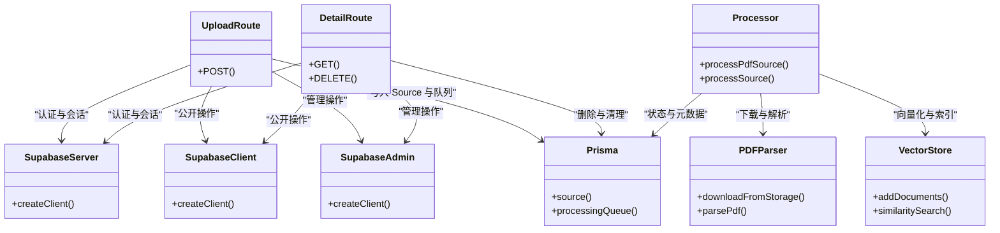

# 文件存储集成

<cite>
**本文引用的文件**
- [app/api/sources/upload/route.ts](file://app/api/sources/upload/route.ts)
- [app/api/sources/[id]/route.ts](file://app/api/sources/[id]/route.ts)
- [lib/supabase/admin.ts](file://lib/supabase/admin.ts)
- [lib/supabase/client.ts](file://lib/supabase/client.ts)
- [lib/supabase/server.ts](file://lib/supabase/server.ts)
- [lib/db/supabase.ts](file://lib/db/supabase.ts)
- [lib/db/prisma.ts](file://lib/db/prisma.ts)
- [lib/processing/pdf-parser.ts](file://lib/processing/pdf-parser.ts)
- [lib/processing/processor.ts](file://lib/processing/processor.ts)
- [components/notebook/source-uploader.tsx](file://components/notebook/source-uploader.tsx)
- [types/index.ts](file://types/index.ts)
- [next.config.js](file://next.config.js)
- [lib/utils/logger.ts](file://lib/utils/logger.ts)
- [lib/db/vector-store.ts](file://lib/db/vector-store.ts)
- [app/api/sources/[id]/process/route.ts](file://app/api/sources/[id]/process/route.ts)
- [app/api/cron/process-queue/route.ts](file://app/api/cron/process-queue/route.ts)
</cite>

## 目录
1. [简介](#简介)
2. [项目结构](#项目结构)
3. [核心组件](#核心组件)
4. [架构总览](#架构总览)
5. [组件详解](#组件详解)
6. [依赖关系分析](#依赖关系分析)
7. [性能考量](#性能考量)
8. [故障排查指南](#故障排查指南)
9. [结论](#结论)
10. [附录](#附录)

## 简介
本文件存储集成文档围绕 notebookLM-clone 项目中基于 Supabase Storage 的文件上传、下载、删除与访问控制展开，系统性阐述文件命名规则、目录结构、版本管理与生命周期控制策略；解释访问权限控制、加密传输、签名 URL 与防盗链保护；梳理上传验证、格式检查、大小限制与存储配额管理；说明元数据管理与查询优化；并提供性能优化（CDN、缓存、批量与带宽管理）、监控与日志记录以及与其他系统的备份、灾备与数据迁移实践。

## 项目结构
与文件存储相关的关键模块分布如下：
- API 层：负责上传、删除、签名 URL 生成等入口
- 存储层：Supabase Storage（notebook-sources 容器）
- 处理层：PDF 解析、文本切分、向量化与写入向量库
- 客户端与服务端 Supabase 客户端：浏览器端与服务端认证与会话
- 数据持久化：Prisma + Postgres（向量库封装在向量存储模块）
- 前端组件：文件上传 UI 与交互

图表来源
- [app/api/sources/upload/route.ts](file://app/api/sources/upload/route.ts#L1-L111)
- [app/api/sources/[id]/route.ts](file://app/api/sources/[id]/route.ts#L1-L119)
- [lib/supabase/admin.ts](file://lib/supabase/admin.ts#L1-L18)
- [lib/supabase/server.ts](file://lib/supabase/server.ts#L1-L33)
- [lib/processing/pdf-parser.ts](file://lib/processing/pdf-parser.ts#L1-L150)
- [lib/processing/processor.ts](file://lib/processing/processor.ts#L1-L560)
- [lib/db/vector-store.ts](file://lib/db/vector-store.ts#L73-L213)
- [lib/db/prisma.ts](file://lib/db/prisma.ts#L1-L41)

章节来源
- [app/api/sources/upload/route.ts](file://app/api/sources/upload/route.ts#L1-L111)
- [app/api/sources/[id]/route.ts](file://app/api/sources/[id]/route.ts#L1-L119)
- [lib/supabase/admin.ts](file://lib/supabase/admin.ts#L1-L18)
- [lib/supabase/server.ts](file://lib/supabase/server.ts#L1-L33)
- [lib/processing/pdf-parser.ts](file://lib/processing/pdf-parser.ts#L1-L150)
- [lib/processing/processor.ts](file://lib/processing/processor.ts#L1-L560)
- [lib/db/vector-store.ts](file://lib/db/vector-store.ts#L73-L213)
- [lib/db/prisma.ts](file://lib/db/prisma.ts#L1-L41)

## 核心组件
- Supabase 客户端
  - 浏览器端客户端：用于前端组件与路由处理器中的公开操作
  - 服务端客户端：用于服务端认证与会话管理
  - 管理端客户端：使用 Secret Key，绕过 RLS，仅用于服务端管理操作
- 文件上传 API：校验用户、笔记本所有权、文件类型与大小，生成存储路径并上传至 Supabase Storage，同时写入数据库并入队处理
- 文件删除 API：校验权限，删除 Storage 文件与数据库记录，并清理向量库与处理队列
- PDF 解析与处理：从 Storage 下载 PDF，解析文本、页码与统计信息，进行切分、向量化并写入向量库
- 队列与处理：统一的状态机与日志记录，支持立即处理与定时队列处理
- 元数据与类型：ProcessingLog、ChunkMetadata 等类型定义，支撑查询与可视化

章节来源
- [lib/supabase/client.ts](file://lib/supabase/client.ts#L1-L14)
- [lib/supabase/server.ts](file://lib/supabase/server.ts#L1-L33)
- [lib/supabase/admin.ts](file://lib/supabase/admin.ts#L1-L18)
- [app/api/sources/upload/route.ts](file://app/api/sources/upload/route.ts#L1-L111)
- [app/api/sources/[id]/route.ts](file://app/api/sources/[id]/route.ts#L1-L119)
- [lib/processing/pdf-parser.ts](file://lib/processing/pdf-parser.ts#L1-L150)
- [lib/processing/processor.ts](file://lib/processing/processor.ts#L1-L560)
- [types/index.ts](file://types/index.ts#L45-L69)

## 架构总览
文件存储集成遵循“前端上传 → 服务端校验与入库 → Storage 存储 → 后台处理 → 向量库索引”的闭环流程。权限控制贯穿始终，确保只有资源所有者可访问与删除文件；处理过程具备可观测性与可恢复能力。

图表来源
- [app/api/sources/upload/route.ts](file://app/api/sources/upload/route.ts#L14-L110)
- [lib/supabase/server.ts](file://lib/supabase/server.ts#L9-L31)
- [lib/db/prisma.ts](file://lib/db/prisma.ts#L29-L41)

## 组件详解

### 文件上传流程
- 上传接口负责：
  - 用户认证与会话获取
  - 笔记本所有权校验
  - 文件类型与大小限制
  - 生成唯一存储路径（用户 ID / 笔记本 ID / 源 ID_时间戳.pdf）
  - 上传至 Supabase Storage（指定 MIME 类型）
  - 写入数据库（Source 记录与元数据）
  - 入队处理（ProcessingQueue）

图表来源
- [app/api/sources/upload/route.ts](file://app/api/sources/upload/route.ts#L14-L110)

章节来源
- [app/api/sources/upload/route.ts](file://app/api/sources/upload/route.ts#L1-L111)
- [lib/db/supabase.ts](file://lib/db/supabase.ts#L12-L33)
- [next.config.js](file://next.config.js#L1-L20)

### 文件下载与签名 URL
- 详情接口：
  - 校验用户与所有权
  - 若存在 storagePath，则生成 1 小时有效期的签名 URL
  - 返回 Source 详情（不含敏感字段）

图表来源
- [app/api/sources/[id]/route.ts](file://app/api/sources/[id]/route.ts#L17-L62)

章节来源
- [app/api/sources/[id]/route.ts](file://app/api/sources/[id]/route.ts#L1-L119)

### 文件删除流程
- 删除接口：
  - 校验用户与所有权
  - 删除 Storage 中的文件
  - 清理数据库中的 chunks（原始 SQL）
  - 删除处理队列记录
  - 删除 Source 记录

图表来源
- [app/api/sources/[id]/route.ts](file://app/api/sources/[id]/route.ts#L65-L119)

章节来源
- [app/api/sources/[id]/route.ts](file://app/api/sources/[id]/route.ts#L1-L119)

### PDF 解析与处理流程
- PDF 解析器：
  - 使用管理端客户端从 Storage 下载文件
  - 动态导入 pdf-parse 进行解析
  - 统计页数、字数与构建页码信息
  - 检测扫描件（平均每页字符数过少）
- 处理器：
  - 状态机：pending → downloading → parsing → chunking → embedding → ready
  - 记录阶段耗时与指标（pages、chunks、tokens 等）
  - 写入向量库并更新 Source 元数据

图表来源
- [lib/processing/processor.ts](file://lib/processing/processor.ts#L82-L209)
- [lib/processing/pdf-parser.ts](file://lib/processing/pdf-parser.ts#L41-L117)
- [lib/db/vector-store.ts](file://lib/db/vector-store.ts#L77-L173)

章节来源
- [lib/processing/pdf-parser.ts](file://lib/processing/pdf-parser.ts#L1-L150)
- [lib/processing/processor.ts](file://lib/processing/processor.ts#L1-L560)
- [lib/db/vector-store.ts](file://lib/db/vector-store.ts#L73-L213)

### 访问控制与权限校验
- 用户认证：服务端客户端获取当前用户
- 所有权校验：通过工具函数校验资源归属
- 接口约束：所有 API 在关键操作前必须调用所有权校验
- 管理端客户端：使用 Secret Key 绕过 RLS，仅用于后台管理与清理

章节来源
- [lib/db/supabase.ts](file://lib/db/supabase.ts#L12-L33)
- [lib/supabase/admin.ts](file://lib/supabase/admin.ts#L1-L18)
- [app/api/sources/upload/route.ts](file://app/api/sources/upload/route.ts#L35-L47)
- [app/api/sources/[id]/route.ts](file://app/api/sources/[id]/route.ts#L67-L90)

### 文件命名规则与目录结构
- 存储路径采用“用户 ID/笔记本 ID/源 ID_时间戳.pdf”的层级结构，便于按用户与笔记本聚合与清理
- 源 ID 由 UUID 生成，时间戳确保同源多次上传的区分

章节来源
- [app/api/sources/upload/route.ts](file://app/api/sources/upload/route.ts#L60-L62)

### 版本管理与生命周期控制
- 当前实现未显式引入版本号字段；通过“源 ID_时间戳”组合实现多版本共存与顺序区分
- 生命周期：上传后进入处理队列，处理完成后 Ready；删除时同步清理 Storage 与数据库

章节来源
- [app/api/sources/upload/route.ts](file://app/api/sources/upload/route.ts#L60-L103)
- [app/api/sources/[id]/route.ts](file://app/api/sources/[id]/route.ts#L92-L113)

### 元数据管理与查询优化
- 元数据字段：原始文件名、MIME 类型、大小、上传时间、解析统计（页数、字数、块数）、处理日志等
- 查询优化：向量库封装对维度校验、CTE 去重计算、TopK 与阈值过滤，日志记录插入/检索性能指标

章节来源
- [app/api/sources/upload/route.ts](file://app/api/sources/upload/route.ts#L87-L94)
- [lib/db/vector-store.ts](file://lib/db/vector-store.ts#L175-L213)
- [types/index.ts](file://types/index.ts#L51-L59)

### 处理队列与并发控制
- 队列记录：包含状态、优先级、尝试次数、开始/完成时间
- 批处理：定时 Cron 每批处理若干条，支持自我修复（扫描状态为 pending 但不在队列中的 Source）
- 立即处理：前端可触发立即处理接口

章节来源
- [app/api/cron/process-queue/route.ts](file://app/api/cron/process-queue/route.ts#L38-L164)
- [app/api/sources/[id]/process/route.ts](file://app/api/sources/[id]/process/route.ts#L1-L42)
- [components/notebook/source-card.tsx](file://components/notebook/source-card.tsx#L396-L447)

## 依赖关系分析

图表来源
- [lib/supabase/admin.ts](file://lib/supabase/admin.ts#L1-L18)
- [lib/supabase/server.ts](file://lib/supabase/server.ts#L1-L33)
- [lib/supabase/client.ts](file://lib/supabase/client.ts#L1-L14)
- [app/api/sources/upload/route.ts](file://app/api/sources/upload/route.ts#L1-L111)
- [app/api/sources/[id]/route.ts](file://app/api/sources/[id]/route.ts#L1-L119)
- [lib/processing/pdf-parser.ts](file://lib/processing/pdf-parser.ts#L1-L150)
- [lib/processing/processor.ts](file://lib/processing/processor.ts#L1-L560)
- [lib/db/vector-store.ts](file://lib/db/vector-store.ts#L73-L213)
- [lib/db/prisma.ts](file://lib/db/prisma.ts#L1-L41)

章节来源
- [lib/supabase/admin.ts](file://lib/supabase/admin.ts#L1-L18)
- [lib/supabase/server.ts](file://lib/supabase/server.ts#L1-L33)
- [lib/supabase/client.ts](file://lib/supabase/client.ts#L1-L14)
- [lib/processing/pdf-parser.ts](file://lib/processing/pdf-parser.ts#L1-L150)
- [lib/processing/processor.ts](file://lib/processing/processor.ts#L1-L560)
- [lib/db/vector-store.ts](file://lib/db/vector-store.ts#L73-L213)
- [lib/db/prisma.ts](file://lib/db/prisma.ts#L1-L41)

## 性能考量
- CDN 集成：通过 Next.js 图片优化配置允许 Supabase 域名，结合 Supabase Storage 的 CDN 加速可提升静态资源访问速度
- 缓存策略：签名 URL 1 小时有效期，前端可缓存短时间内的预览；向量检索使用 TopK 与阈值过滤减少计算
- 批量操作：处理队列按批次处理，避免单次高负载；支持自我修复扫描 Pending 但未入队的任务
- 带宽管理：上传大小限制与队列节流，避免突发流量冲击；向量库插入记录日志，便于容量规划

章节来源
- [next.config.js](file://next.config.js#L4-L12)
- [app/api/cron/process-queue/route.ts](file://app/api/cron/process-queue/route.ts#L38-L50)
- [lib/utils/logger.ts](file://lib/utils/logger.ts#L75-L94)

## 故障排查指南
- 上传失败
  - 检查用户认证与笔记本所有权
  - 确认文件类型为 PDF、大小不超过 50MB
  - 查看 Storage 上传错误日志与数据库回滚
- 下载/签名 URL 失败
  - 确认 storagePath 存在且未被删除
  - 检查签名 URL 有效期与防盗链设置
- 处理失败
  - 查看 ProcessingLog 各阶段耗时与错误
  - 检查向量维度与插入日志
- 删除异常
  - 确认删除接口权限校验通过
  - 检查 chunks 清理与队列记录删除

章节来源
- [app/api/sources/upload/route.ts](file://app/api/sources/upload/route.ts#L49-L76)
- [app/api/sources/[id]/route.ts](file://app/api/sources/[id]/route.ts#L44-L51)
- [lib/processing/processor.ts](file://lib/processing/processor.ts#L515-L525)
- [lib/utils/logger.ts](file://lib/utils/logger.ts#L75-L94)

## 结论
本项目通过 Supabase Storage 实现了从上传、存储、解析、向量化到检索的完整文件处理链路。权限控制贯穿全流程，处理过程具备可观测性与可恢复能力。建议后续在现有基础上完善版本管理、生命周期策略与更细粒度的配额控制，以进一步提升稳定性与可维护性。

## 附录
- 前端上传组件：提供拖拽上传、进度反馈与立即触发处理的能力
- 配置要点：Next.js 对 Supabase 域名的图片优化与大体积请求体限制

章节来源
- [components/notebook/source-uploader.tsx](file://components/notebook/source-uploader.tsx#L83-L135)
- [next.config.js](file://next.config.js#L13-L17)