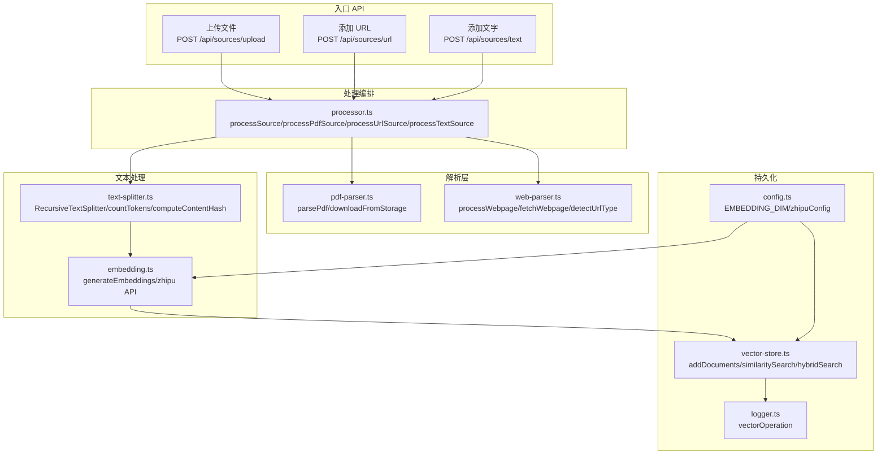
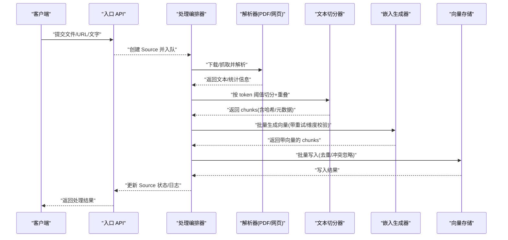
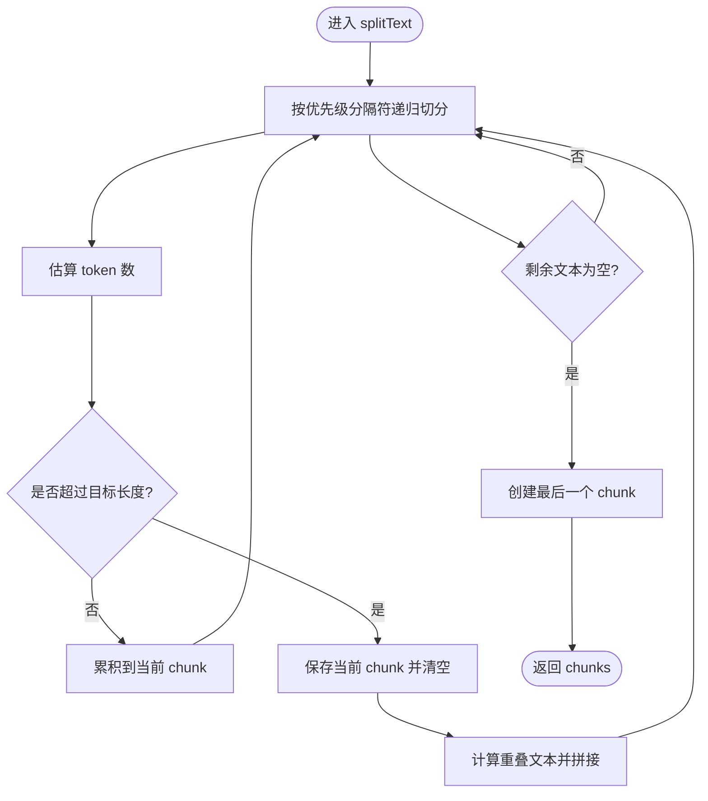
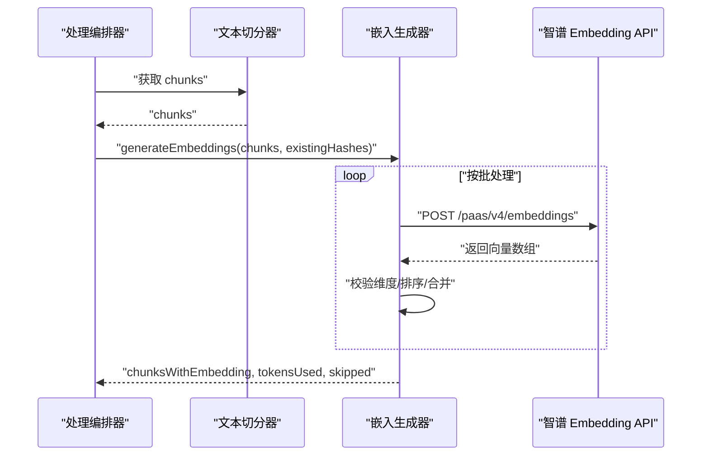
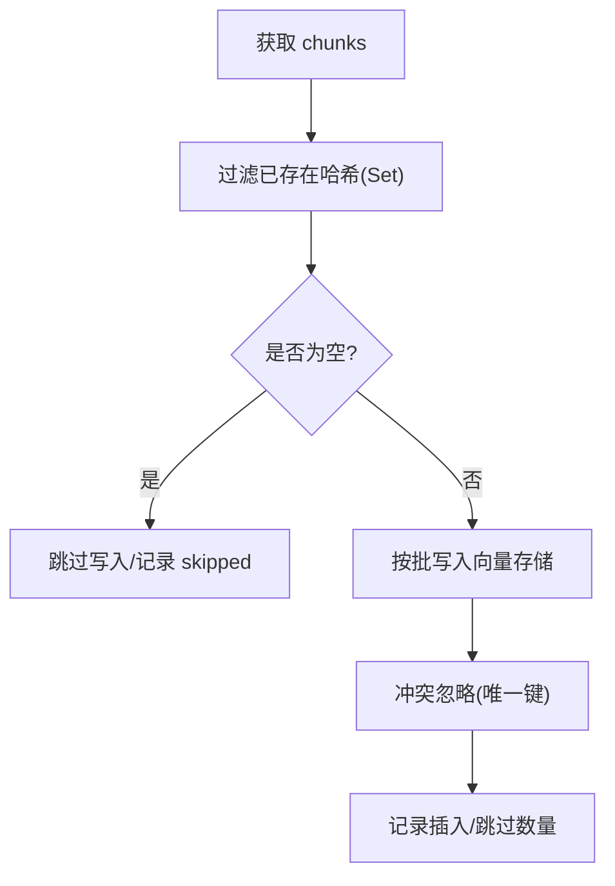
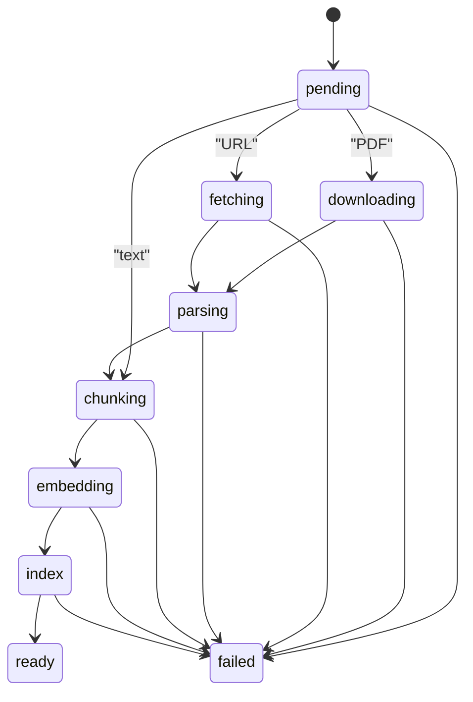
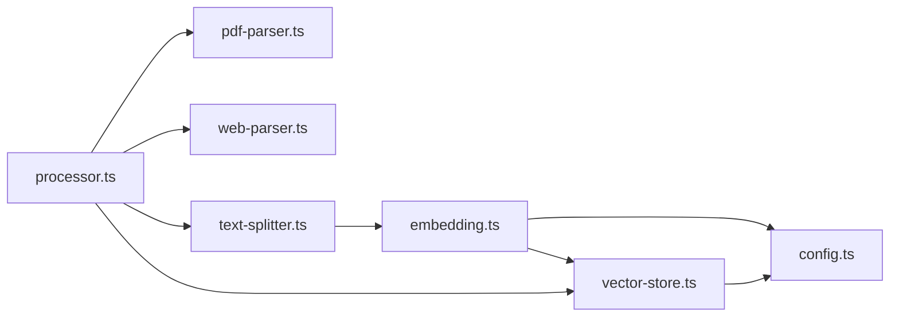

# 文本处理流水线

<cite>
**本文引用的文件**
- [lib/processing/processor.ts](file://lib/processing/processor.ts)
- [lib/processing/text-splitter.ts](file://lib/processing/text-splitter.ts)
- [lib/processing/embedding.ts](file://lib/processing/embedding.ts)
- [lib/processing/pdf-parser.ts](file://lib/processing/pdf-parser.ts)
- [lib/processing/web-parser.ts](file://lib/processing/web-parser.ts)
- [lib/db/vector-store.ts](file://lib/db/vector-store.ts)
- [lib/config.ts](file://lib/config.ts)
- [lib/utils/logger.ts](file://lib/utils/logger.ts)
- [app/api/sources/upload/route.ts](file://app/api/sources/upload/route.ts)
- [app/api/sources/url/route.ts](file://app/api/sources/url/route.ts)
- [app/api/sources/text/route.ts](file://app/api/sources/text/route.ts)
</cite>

## 目录
1. [简介](#简介)
2. [项目结构](#项目结构)
3. [核心组件](#核心组件)
4. [架构总览](#架构总览)
5. [详细组件分析](#详细组件分析)
6. [依赖关系分析](#依赖关系分析)
7. [性能考量](#性能考量)
8. [故障排查指南](#故障排查指南)
9. [结论](#结论)
10. [附录](#附录)

## 简介
本文件面向 notebookLM-clone 项目的“文本处理流水线”，系统性阐述从原始内容输入到最终写入向量存储的完整流程。重点覆盖以下方面：
- 文本切分算法：语义分割、长度控制、重叠处理与上下文保持
- 向量嵌入生成：模型选择、批量处理、维度标准化与质量控制
- 文本去重与清洗：哈希计算、重复检测、噪声过滤与格式标准化
- 文本预处理：编码转换、特殊字符处理、空白规范化与内容压缩
- 性能优化：内存管理、并发控制、缓存策略与批处理大小调整
- 质量评估：指标体系、错误检测与修复机制
- 日志与状态：日志记录、进度跟踪与状态管理

## 项目结构
文本处理流水线由“入口 API”“处理编排”“解析器”“切分器”“嵌入生成”“向量存储”等模块组成，采用分层设计，职责清晰、耦合可控。

**图示来源**
- [lib/processing/processor.ts](file://lib/processing/processor.ts#L82-L420)
- [lib/processing/pdf-parser.ts](file://lib/processing/pdf-parser.ts#L57-L149)
- [lib/processing/web-parser.ts](file://lib/processing/web-parser.ts#L174-L190)
- [lib/processing/text-splitter.ts](file://lib/processing/text-splitter.ts#L83-L269)
- [lib/processing/embedding.ts](file://lib/processing/embedding.ts#L140-L188)
- [lib/db/vector-store.ts](file://lib/db/vector-store.ts#L77-L443)
- [lib/config.ts](file://lib/config.ts#L6-L52)
- [lib/utils/logger.ts](file://lib/utils/logger.ts#L29-L94)
- [app/api/sources/upload/route.ts](file://app/api/sources/upload/route.ts#L14-L110)
- [app/api/sources/url/route.ts](file://app/api/sources/url/route.ts#L68-L166)
- [app/api/sources/text/route.ts](file://app/api/sources/text/route.ts#L19-L121)

**章节来源**
- [lib/processing/processor.ts](file://lib/processing/processor.ts#L1-L560)
- [lib/processing/text-splitter.ts](file://lib/processing/text-splitter.ts#L1-L270)
- [lib/processing/embedding.ts](file://lib/processing/embedding.ts#L1-L189)
- [lib/processing/pdf-parser.ts](file://lib/processing/pdf-parser.ts#L1-L150)
- [lib/processing/web-parser.ts](file://lib/processing/web-parser.ts#L1-L228)
- [lib/db/vector-store.ts](file://lib/db/vector-store.ts#L1-L446)
- [lib/config.ts](file://lib/config.ts#L1-L187)
- [lib/utils/logger.ts](file://lib/utils/logger.ts#L1-L98)
- [app/api/sources/upload/route.ts](file://app/api/sources/upload/route.ts#L1-L111)
- [app/api/sources/url/route.ts](file://app/api/sources/url/route.ts#L1-L167)
- [app/api/sources/text/route.ts](file://app/api/sources/text/route.ts#L1-L122)

## 核心组件
- 处理编排器：统一调度 PDF、URL、文本三类来源的处理流程，维护阶段日志与状态更新。
- 解析器：PDF 解析与网页抓取/正文抽取，负责清洗与基础统计。
- 文本切分器：基于多级分隔符的递归切分，结合 token 估算与重叠窗口，保证语义完整性。
- 嵌入生成器：调用智谱 Embedding API，内置指数退避重试、批处理与维度校验。
- 向量存储：批量写入、相似度检索与混合检索，具备维度一致性校验与日志记录。
- 配置与日志：统一的维度配置、提供商配置与向量操作日志。

**章节来源**
- [lib/processing/processor.ts](file://lib/processing/processor.ts#L82-L526)
- [lib/processing/pdf-parser.ts](file://lib/processing/pdf-parser.ts#L57-L149)
- [lib/processing/web-parser.ts](file://lib/processing/web-parser.ts#L174-L190)
- [lib/processing/text-splitter.ts](file://lib/processing/text-splitter.ts#L83-L269)
- [lib/processing/embedding.ts](file://lib/processing/embedding.ts#L140-L188)
- [lib/db/vector-store.ts](file://lib/db/vector-store.ts#L77-L443)
- [lib/config.ts](file://lib/config.ts#L6-L52)
- [lib/utils/logger.ts](file://lib/utils/logger.ts#L29-L94)

## 架构总览
文本处理流水线以“入口 API -> 处理编排 -> 解析/切分/嵌入 -> 向量存储”的链路运行，各阶段通过统一的状态与日志进行进度追踪与质量监控。

**图示来源**
- [lib/processing/processor.ts](file://lib/processing/processor.ts#L82-L526)
- [lib/processing/pdf-parser.ts](file://lib/processing/pdf-parser.ts#L57-L149)
- [lib/processing/web-parser.ts](file://lib/processing/web-parser.ts#L174-L190)
- [lib/processing/text-splitter.ts](file://lib/processing/text-splitter.ts#L83-L269)
- [lib/processing/embedding.ts](file://lib/processing/embedding.ts#L140-L188)
- [lib/db/vector-store.ts](file://lib/db/vector-store.ts#L77-L173)

## 详细组件分析

### 文本切分算法
- 目标与约束
  - 目标 chunk 大小：以 token 为单位的目标长度
  - 重叠窗口：避免关键信息被截断，提升检索连贯性
  - 分隔符优先级：优先保留自然边界（标题、段落、句子、空格、字符）
- 实现要点
  - 递归切分：按优先级分隔符拆分，若子片段仍超长则继续细分
  - token 估算：根据中英文字符比例加权估算，便于长度控制
  - 重叠计算：按字符数估算重叠长度，确保上下文连续
  - 元数据：记录起止字符位置、token 数、来源类型与页码映射
  - 去重：基于内容哈希，避免重复 chunk

**图示来源**
- [lib/processing/text-splitter.ts](file://lib/processing/text-splitter.ts#L97-L152)
- [lib/processing/text-splitter.ts](file://lib/processing/text-splitter.ts#L158-L194)
- [lib/processing/text-splitter.ts](file://lib/processing/text-splitter.ts#L228-L263)

**章节来源**
- [lib/processing/text-splitter.ts](file://lib/processing/text-splitter.ts#L14-L31)
- [lib/processing/text-splitter.ts](file://lib/processing/text-splitter.ts#L38-L49)
- [lib/processing/text-splitter.ts](file://lib/processing/text-splitter.ts#L54-L56)
- [lib/processing/text-splitter.ts](file://lib/processing/text-splitter.ts#L83-L269)

### 向量嵌入生成
- 模型与维度
  - 模型：智谱 embedding-3
  - 维度：严格锁定为 1024，启动时强制校验
- 批处理与重试
  - 批大小上限与单条 token 上限
  - 指数退避重试，支持特定错误码自动重试
- 质量控制
  - 返回向量维度一致性校验
  - 统计 tokens 使用量（估算）
  - Source 内去重：基于内容哈希过滤已存在 chunk

**图示来源**
- [lib/processing/embedding.ts](file://lib/processing/embedding.ts#L140-L188)
- [lib/processing/embedding.ts](file://lib/processing/embedding.ts#L72-L110)
- [lib/config.ts](file://lib/config.ts#L6-L52)

**章节来源**
- [lib/processing/embedding.ts](file://lib/processing/embedding.ts#L12-L26)
- [lib/processing/embedding.ts](file://lib/processing/embedding.ts#L52-L67)
- [lib/processing/embedding.ts](file://lib/processing/embedding.ts#L72-L110)
- [lib/processing/embedding.ts](file://lib/processing/embedding.ts#L140-L188)
- [lib/config.ts](file://lib/config.ts#L6-L52)

### 文本去重与清洗
- 去重策略
  - Source 内去重：基于内容哈希集合过滤
  - 数据库层面：写入时使用唯一键，冲突忽略，避免重复
- 清洗与标准化
  - PDF：解析后统计词数、构建页码映射；检测扫描件（平均每页字符数过少）
  - 网页：Readability 正文抽取，清理多余空白；超时与错误处理
  - 文本：直接切分，统计字符/词数，避免空内容

**图示来源**
- [lib/processing/embedding.ts](file://lib/processing/embedding.ts#L152-L161)
- [lib/db/vector-store.ts](file://lib/db/vector-store.ts#L109-L140)

**章节来源**
- [lib/processing/pdf-parser.ts](file://lib/processing/pdf-parser.ts#L122-L128)
- [lib/processing/web-parser.ts](file://lib/processing/web-parser.ts#L131-L169)
- [lib/db/vector-store.ts](file://lib/db/vector-store.ts#L109-L140)

### 文本预处理
- 编码与下载
  - PDF：从 Supabase Storage 下载为 Buffer
  - 网页：带超时的 fetch，读取 HTML 或 PDF 二进制
- 特殊字符与空白
  - 网页正文：统一空白、段落折叠
  - 文本：按空白分词统计词数
- 内容压缩
  - 通过 token 估算与重叠切分减少冗余

**章节来源**
- [lib/processing/pdf-parser.ts](file://lib/processing/pdf-parser.ts#L41-L52)
- [lib/processing/web-parser.ts](file://lib/processing/web-parser.ts#L58-L77)
- [lib/processing/web-parser.ts](file://lib/processing/web-parser.ts#L147-L150)
- [lib/processing/text-splitter.ts](file://lib/processing/text-splitter.ts#L38-L49)

### 处理流程与状态管理
- 流程阶段
  - PDF：下载 -> 解析 -> 切分 -> 向量 -> 写库 -> 就绪
  - URL：抓取 -> 解析 -> 切分 -> 向量 -> 写库 -> 就绪
  - 文本：切分 -> 向量 -> 写库 -> 就绪
- 状态与日志
  - 每阶段记录状态、时间戳、耗时、指标（如 token 数、chunks 数）
  - 总耗时与错误信息汇总，失败时记录错误详情

**图示来源**
- [lib/processing/processor.ts](file://lib/processing/processor.ts#L22-L28)
- [lib/processing/processor.ts](file://lib/processing/processor.ts#L82-L526)

**章节来源**
- [lib/processing/processor.ts](file://lib/processing/processor.ts#L33-L51)
- [lib/processing/processor.ts](file://lib/processing/processor.ts#L56-L77)
- [lib/processing/processor.ts](file://lib/processing/processor.ts#L82-L526)

## 依赖关系分析
- 组件耦合
  - 处理编排器依赖解析器、切分器、嵌入生成器与向量存储
  - 嵌入生成器与向量存储强依赖配置中的维度与模型
- 外部依赖
  - Supabase Storage（文件下载）
  - 智谱 AI Embedding API
  - PostgreSQL + 向量扩展（向量存储）

**图示来源**
- [lib/processing/processor.ts](file://lib/processing/processor.ts#L10-L17)
- [lib/processing/pdf-parser.ts](file://lib/processing/pdf-parser.ts#L6-L25)
- [lib/processing/web-parser.ts](file://lib/processing/web-parser.ts#L6-L7)
- [lib/processing/text-splitter.ts](file://lib/processing/text-splitter.ts#L11)
- [lib/processing/embedding.ts](file://lib/processing/embedding.ts#L6-L7)
- [lib/db/vector-store.ts](file://lib/db/vector-store.ts#L1-L4)
- [lib/config.ts](file://lib/config.ts#L6-L52)

**章节来源**
- [lib/processing/processor.ts](file://lib/processing/processor.ts#L10-L17)
- [lib/processing/embedding.ts](file://lib/processing/embedding.ts#L6-L7)
- [lib/db/vector-store.ts](file://lib/db/vector-store.ts#L1-L4)
- [lib/config.ts](file://lib/config.ts#L6-L52)

## 性能考量
- 内存与并发
  - 切分阶段使用增量累积与重叠窗口，避免一次性加载大文本
  - 嵌入生成批处理与指数退避，降低 API 压力
- 批处理大小
  - 嵌入批大小与单条 token 上限可调，建议根据模型与网络状况优化
- 存储写入
  - 向量存储按固定批次批量插入，冲突忽略，减少重复写入
- 日志与可观测性
  - 统一向量操作日志，记录成功/失败、耗时、插入/跳过数量

**章节来源**
- [lib/processing/text-splitter.ts](file://lib/processing/text-splitter.ts#L15-L31)
- [lib/processing/embedding.ts](file://lib/processing/embedding.ts#L23-L26)
- [lib/db/vector-store.ts](file://lib/db/vector-store.ts#L9-L10)
- [lib/utils/logger.ts](file://lib/utils/logger.ts#L75-L94)

## 故障排查指南
- 常见错误与定位
  - PDF 解析失败：检查加密、损坏、扫描件（字符密度过低）
  - 网页抓取失败：超时、401/403/404、Content-Type 为 PDF
  - 嵌入维度不匹配：确认 EMBEDDING_DIM 与模型一致
  - 写库失败：检查唯一键冲突、SQL 执行异常
- 重试与降级
  - 嵌入 API 使用指数退避重试
  - URL 为 PDF 时走 PDF 解析分支
- 日志与指标
  - 通过向量操作日志查看插入/查询耗时与成功率
  - 处理编排器阶段日志记录 token 数、chunks 数、耗时

**章节来源**
- [lib/processing/pdf-parser.ts](file://lib/processing/pdf-parser.ts#L88-L116)
- [lib/processing/web-parser.ts](file://lib/processing/web-parser.ts#L93-L126)
- [lib/processing/embedding.ts](file://lib/processing/embedding.ts#L98-L104)
- [lib/db/vector-store.ts](file://lib/db/vector-store.ts#L158-L172)
- [lib/utils/logger.ts](file://lib/utils/logger.ts#L75-L94)
- [lib/processing/processor.ts](file://lib/processing/processor.ts#L33-L51)

## 结论
本流水线以“可扩展、可观测、可恢复”为目标，通过严格的维度校验、批处理与重试机制、去重与日志记录，确保从 PDF、网页、文字三种来源输入的文本能够稳定、高效地转化为向量并写入数据库。建议在生产环境中持续关注批大小与重试参数，并结合日志与指标进行容量与性能优化。

## 附录

### 入口 API 与处理触发
- 上传文件：创建 file 类型 Source，入队处理
- 添加 URL：识别类型（网页/PDF/视频），非视频入队处理
- 添加文字：创建 text 类型 Source，入队处理

**章节来源**
- [app/api/sources/upload/route.ts](file://app/api/sources/upload/route.ts#L14-L110)
- [app/api/sources/url/route.ts](file://app/api/sources/url/route.ts#L68-L166)
- [app/api/sources/text/route.ts](file://app/api/sources/text/route.ts#L19-L121)