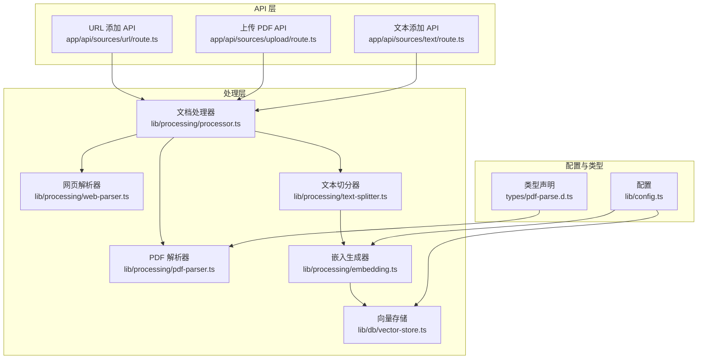
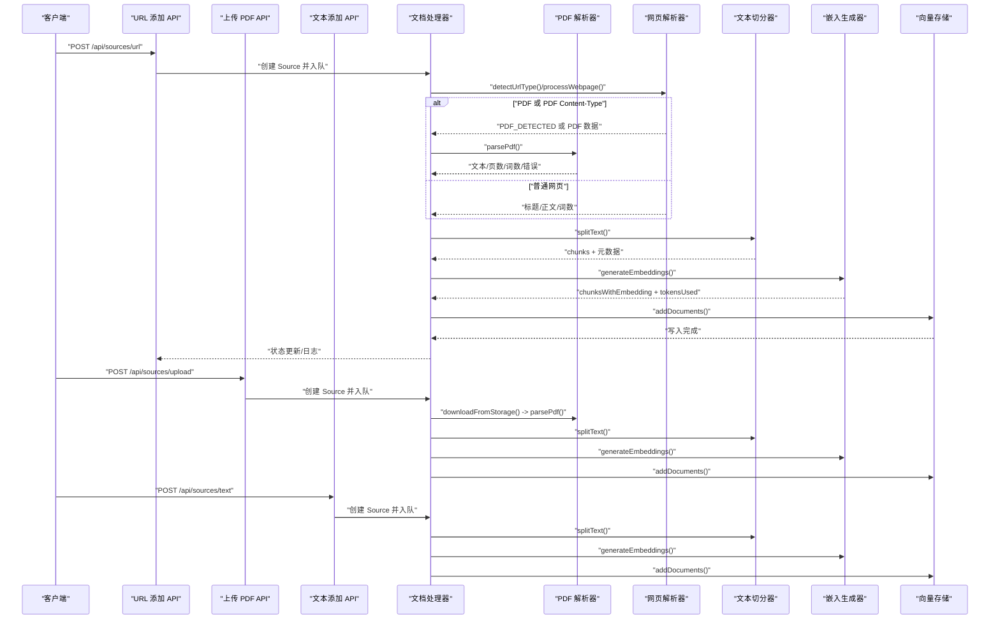
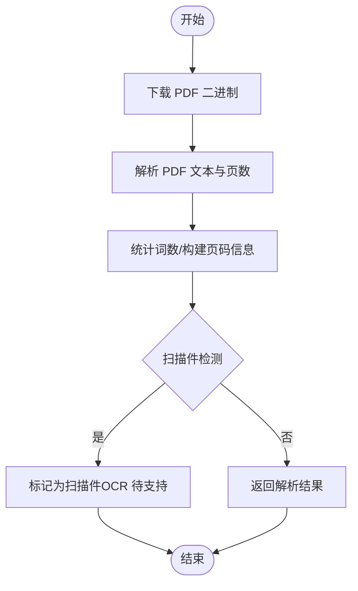
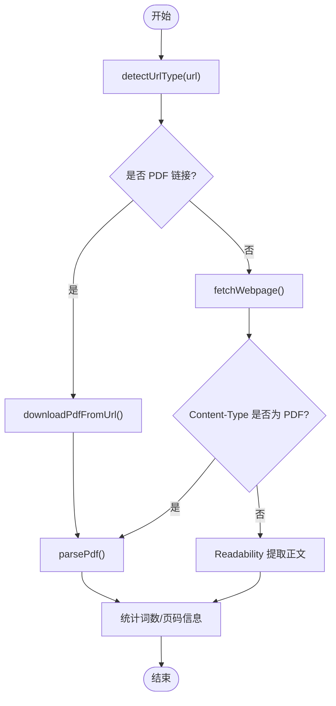
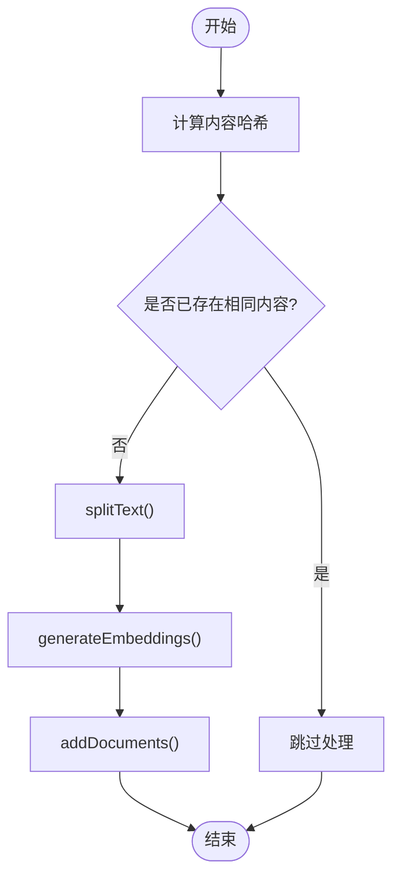
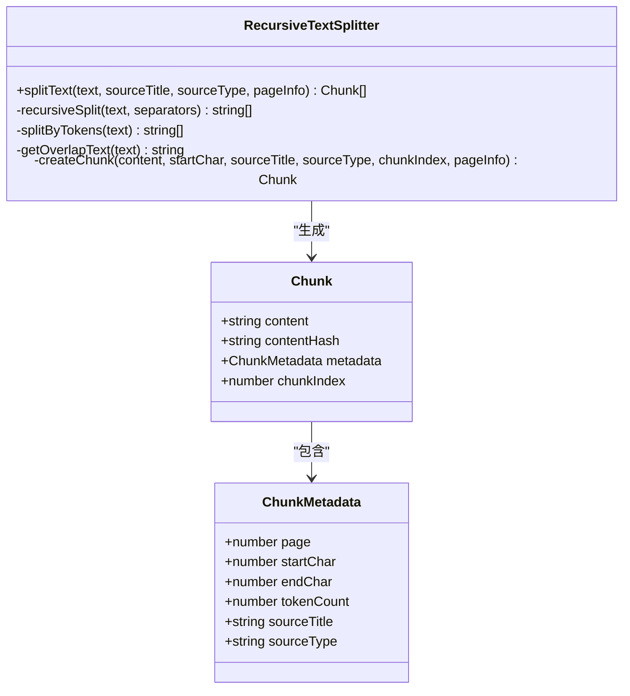
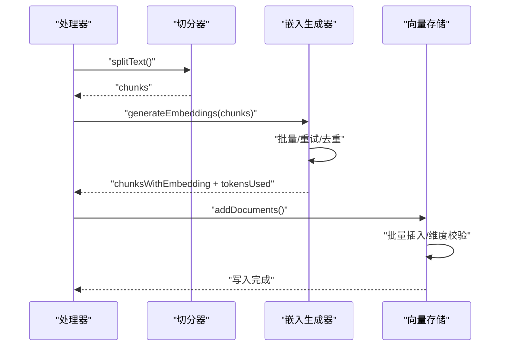
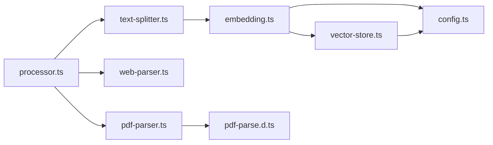

# 文档格式支持

<cite>
**本文引用的文件**
- [lib/processing/pdf-parser.ts](file://lib/processing/pdf-parser.ts)
- [lib/processing/web-parser.ts](file://lib/processing/web-parser.ts)
- [lib/processing/processor.ts](file://lib/processing/processor.ts)
- [lib/processing/text-splitter.ts](file://lib/processing/text-splitter.ts)
- [lib/processing/embedding.ts](file://lib/processing/embedding.ts)
- [lib/db/vector-store.ts](file://lib/db/vector-store.ts)
- [lib/config.ts](file://lib/config.ts)
- [app/api/sources/url/route.ts](file://app/api/sources/url/route.ts)
- [app/api/sources/upload/route.ts](file://app/api/sources/upload/route.ts)
- [app/api/sources/text/route.ts](file://app/api/sources/text/route.ts)
- [types/pdf-parse.d.ts](file://types/pdf-parse.d.ts)
</cite>

## 目录
1. [简介](#简介)
2. [项目结构](#项目结构)
3. [核心组件](#核心组件)
4. [架构总览](#架构总览)
5. [详细组件分析](#详细组件分析)
6. [依赖关系分析](#依赖关系分析)
7. [性能考量](#性能考量)
8. [故障排查指南](#故障排查指南)
9. [结论](#结论)

## 简介
本文件面向 notebookLM-clone 项目的“文档格式支持”能力，系统性说明项目对多种知识源格式的支持与处理流程，包括：
- PDF 文件：二进制解析、页码统计、扫描件检测、错误处理
- 网页链接：URL 类型识别、Content-Type 检测、网页正文提取、超时与异常处理
- 文本内容：直接处理、去重与哈希校验、字符/词数统计
- 元数据提取：PDF 页数、网页标题、文本字符统计
- 格式转换与标准化：编码处理、格式统一、内容清理
- 性能优化：向量化批量、指数退避重试、分批写入、维度校验
- 错误处理与异常：统一的状态更新、阶段日志、错误提示

## 项目结构
围绕“文档格式支持”，核心代码分布在以下模块：
- 处理器与路由：负责接收请求、类型判定、调用解析器、写入向量库
- 解析器：PDF 解析、网页抓取与正文提取、文本切分
- 向量与嵌入：批量生成向量、重试与去重、数据库写入
- 配置与类型：向量维度、API 配置、类型声明

图表来源
- [app/api/sources/url/route.ts](file://app/api/sources/url/route.ts#L1-L167)
- [app/api/sources/upload/route.ts](file://app/api/sources/upload/route.ts#L1-L111)
- [app/api/sources/text/route.ts](file://app/api/sources/text/route.ts#L1-L122)
- [lib/processing/processor.ts](file://lib/processing/processor.ts#L1-L560)
- [lib/processing/pdf-parser.ts](file://lib/processing/pdf-parser.ts#L1-L150)
- [lib/processing/web-parser.ts](file://lib/processing/web-parser.ts#L1-L228)
- [lib/processing/text-splitter.ts](file://lib/processing/text-splitter.ts#L1-L270)
- [lib/processing/embedding.ts](file://lib/processing/embedding.ts#L1-L189)
- [lib/db/vector-store.ts](file://lib/db/vector-store.ts#L1-L446)
- [lib/config.ts](file://lib/config.ts#L1-L187)
- [types/pdf-parse.d.ts](file://types/pdf-parse.d.ts#L1-L14)

章节来源
- [lib/processing/processor.ts](file://lib/processing/processor.ts#L1-L560)
- [lib/processing/pdf-parser.ts](file://lib/processing/pdf-parser.ts#L1-L150)
- [lib/processing/web-parser.ts](file://lib/processing/web-parser.ts#L1-L228)
- [lib/processing/text-splitter.ts](file://lib/processing/text-splitter.ts#L1-L270)
- [lib/processing/embedding.ts](file://lib/processing/embedding.ts#L1-L189)
- [lib/db/vector-store.ts](file://lib/db/vector-store.ts#L1-L446)
- [lib/config.ts](file://lib/config.ts#L1-L187)
- [app/api/sources/url/route.ts](file://app/api/sources/url/route.ts#L1-L167)
- [app/api/sources/upload/route.ts](file://app/api/sources/upload/route.ts#L1-L111)
- [app/api/sources/text/route.ts](file://app/api/sources/text/route.ts#L1-L122)
- [types/pdf-parse.d.ts](file://types/pdf-parse.d.ts#L1-L14)

## 核心组件
- 文档处理器（processor）：统一调度 PDF、URL、文本三类来源的处理流程，维护阶段日志与状态更新。
- PDF 解析器（pdf-parser）：从 Supabase Storage 下载 PDF，使用 pdf-parse 解析文本，统计页数与词数，构建页码信息，检测扫描件并返回错误信息。
- 网页解析器（web-parser）：检测 URL 类型，抓取网页并基于 Content-Type 判定是否为 PDF；使用 @mozilla/readability 提取正文，清理空白，统计词数。
- 文本切分器（text-splitter）：基于递归字符分隔符的切分策略，优先保持自然边界，支持中英文混合估算 token 数量，生成 chunk 元数据。
- 嵌入生成器（embedding）：批量调用智谱 Embedding API，带指数退避重试与去重优化，统计 token 使用量。
- 向量存储（vector-store）：批量写入 document_chunks，维度校验，相似度检索与混合检索，删除与去重哈希查询。
- 配置（config）：向量维度强制校验（1024 维）、模型与 API 配置、应用参数。
- API 路由：URL 添加、PDF 上传、文本添加，输入校验、类型判定、去重与队列调度。

章节来源
- [lib/processing/processor.ts](file://lib/processing/processor.ts#L1-L560)
- [lib/processing/pdf-parser.ts](file://lib/processing/pdf-parser.ts#L1-L150)
- [lib/processing/web-parser.ts](file://lib/processing/web-parser.ts#L1-L228)
- [lib/processing/text-splitter.ts](file://lib/processing/text-splitter.ts#L1-L270)
- [lib/processing/embedding.ts](file://lib/processing/embedding.ts#L1-L189)
- [lib/db/vector-store.ts](file://lib/db/vector-store.ts#L1-L446)
- [lib/config.ts](file://lib/config.ts#L1-L187)
- [app/api/sources/url/route.ts](file://app/api/sources/url/route.ts#L1-L167)
- [app/api/sources/upload/route.ts](file://app/api/sources/upload/route.ts#L1-L111)
- [app/api/sources/text/route.ts](file://app/api/sources/text/route.ts#L1-L122)

## 架构总览
下图展示“文档格式支持”的端到端流程，涵盖 URL、PDF、文本三种来源的处理路径与关键决策点。

图表来源
- [app/api/sources/url/route.ts](file://app/api/sources/url/route.ts#L1-L167)
- [app/api/sources/upload/route.ts](file://app/api/sources/upload/route.ts#L1-L111)
- [app/api/sources/text/route.ts](file://app/api/sources/text/route.ts#L1-L122)
- [lib/processing/processor.ts](file://lib/processing/processor.ts#L1-L560)
- [lib/processing/pdf-parser.ts](file://lib/processing/pdf-parser.ts#L1-L150)
- [lib/processing/web-parser.ts](file://lib/processing/web-parser.ts#L1-L228)
- [lib/processing/text-splitter.ts](file://lib/processing/text-splitter.ts#L1-L270)
- [lib/processing/embedding.ts](file://lib/processing/embedding.ts#L1-L189)
- [lib/db/vector-store.ts](file://lib/db/vector-store.ts#L1-L446)

## 详细组件分析

### PDF 文件处理
- 输入来源：Supabase Storage 路径（文件上传后存储）
- 关键步骤：
  1) 下载二进制数据
  2) 动态导入 pdf-parse，解析文本与页数
  3) 统计词数，构建页码信息（按平均字符数分配）
  4) 扫描件检测：平均每页字符数低于阈值则标记为“需要 OCR”
  5) 错误分类：加密、损坏、其他异常分别返回不同错误信息
- 元数据：页数、词数、页码信息数组
- 标准化：统一返回结构，错误字段便于上层处理

图表来源
- [lib/processing/pdf-parser.ts](file://lib/processing/pdf-parser.ts#L1-L150)

章节来源
- [lib/processing/pdf-parser.ts](file://lib/processing/pdf-parser.ts#L1-L150)
- [types/pdf-parse.d.ts](file://types/pdf-parse.d.ts#L1-L14)

### 网页链接处理
- URL 类型识别：
  - 以 .pdf 结尾：视为 PDF
  - 包含 youtube.com/youtu.be/youtube.com/embed：视为视频
  - 其他：普通网页
- 抓取与解析：
  - 设置超时与 UA/语言头
  - Content-Type 检测：若为 application/pdf，则按 PDF 流程处理
  - 使用 @mozilla/readability 提取正文，清理多余空白，统计词数
- 元数据：标题、正文、词数、摘要
- 错误处理：HTTP 状态码映射、超时、解析失败

图表来源
- [lib/processing/web-parser.ts](file://lib/processing/web-parser.ts#L1-L228)
- [lib/processing/processor.ts](file://lib/processing/processor.ts#L215-L397)

章节来源
- [lib/processing/web-parser.ts](file://lib/processing/web-parser.ts#L1-L228)
- [lib/processing/processor.ts](file://lib/processing/processor.ts#L215-L397)

### 文本内容处理
- 输入：复制的文字内容（title + content）
- 处理：直接进入切分与嵌入流程，跳过下载与解析
- 去重：基于 content_hash 查询已有 chunk，避免重复写入
- 元数据：字符数、词数、来源类型标记

图表来源
- [app/api/sources/text/route.ts](file://app/api/sources/text/route.ts#L1-L122)
- [lib/processing/text-splitter.ts](file://lib/processing/text-splitter.ts#L1-L270)
- [lib/processing/embedding.ts](file://lib/processing/embedding.ts#L1-L189)
- [lib/db/vector-store.ts](file://lib/db/vector-store.ts#L1-L446)

章节来源
- [app/api/sources/text/route.ts](file://app/api/sources/text/route.ts#L1-L122)
- [lib/processing/text-splitter.ts](file://lib/processing/text-splitter.ts#L1-L270)
- [lib/processing/embedding.ts](file://lib/processing/embedding.ts#L1-L189)
- [lib/db/vector-store.ts](file://lib/db/vector-store.ts#L1-L446)

### 文本切分与标准化
- 切分策略：优先级分隔符（标题 > 段落 > 句子 > 空格 > 字符），重叠窗口避免截断关键信息
- Token 估算：按中文与非中文混合估算，用于控制 chunk 大小
- 元数据：chunkIndex、tokenCount、起止字符位置、来源标题与类型、可选页码
- 标准化：统一输出结构，便于后续嵌入与检索

图表来源
- [lib/processing/text-splitter.ts](file://lib/processing/text-splitter.ts#L1-L270)

章节来源
- [lib/processing/text-splitter.ts](file://lib/processing/text-splitter.ts#L1-L270)

### 嵌入与向量存储
- 批量嵌入：最大批大小与单条 token 上限控制，指数退避重试，失败状态码自动重试
- 去重优化：根据 content_hash 过滤已存在 chunk，减少重复计算
- 写入优化：批量插入，分批处理，维度校验，日志记录
- 检索：相似度检索与混合检索（向量 + 全文），支持阈值与 topK 控制

图表来源
- [lib/processing/embedding.ts](file://lib/processing/embedding.ts#L1-L189)
- [lib/db/vector-store.ts](file://lib/db/vector-store.ts#L1-L446)
- [lib/processing/processor.ts](file://lib/processing/processor.ts#L1-L560)

章节来源
- [lib/processing/embedding.ts](file://lib/processing/embedding.ts#L1-L189)
- [lib/db/vector-store.ts](file://lib/db/vector-store.ts#L1-L446)
- [lib/processing/processor.ts](file://lib/processing/processor.ts#L1-L560)

## 依赖关系分析
- 处理器依赖解析器、切分器、嵌入生成器与向量存储
- 解析器依赖外部库（pdf-parse、@mozilla/readability、jsdom）
- 嵌入生成器依赖配置中的模型与 API Key
- 向量存储依赖数据库 schema 与索引（唯一约束、TSV 列与索引）

图表来源
- [lib/processing/processor.ts](file://lib/processing/processor.ts#L1-L560)
- [lib/processing/pdf-parser.ts](file://lib/processing/pdf-parser.ts#L1-L150)
- [lib/processing/web-parser.ts](file://lib/processing/web-parser.ts#L1-L228)
- [lib/processing/text-splitter.ts](file://lib/processing/text-splitter.ts#L1-L270)
- [lib/processing/embedding.ts](file://lib/processing/embedding.ts#L1-L189)
- [lib/db/vector-store.ts](file://lib/db/vector-store.ts#L1-L446)
- [lib/config.ts](file://lib/config.ts#L1-L187)
- [types/pdf-parse.d.ts](file://types/pdf-parse.d.ts#L1-L14)

章节来源
- [lib/processing/processor.ts](file://lib/processing/processor.ts#L1-L560)
- [lib/processing/pdf-parser.ts](file://lib/processing/pdf-parser.ts#L1-L150)
- [lib/processing/web-parser.ts](file://lib/processing/web-parser.ts#L1-L228)
- [lib/processing/text-splitter.ts](file://lib/processing/text-splitter.ts#L1-L270)
- [lib/processing/embedding.ts](file://lib/processing/embedding.ts#L1-L189)
- [lib/db/vector-store.ts](file://lib/db/vector-store.ts#L1-L446)
- [lib/config.ts](file://lib/config.ts#L1-L187)
- [types/pdf-parse.d.ts](file://types/pdf-parse.d.ts#L1-L14)

## 性能考量
- 向量化批量与去重
  - 批大小与 token 上限控制，避免单次请求过大
  - 基于 content_hash 的去重，减少重复嵌入与写入
- 写入优化
  - 分批插入（每批固定大小），降低单次写入压力
  - 维度校验前置，避免无效写入
- 超时与重试
  - 网页抓取与 PDF 下载均设置超时，超时抛出明确错误
  - 嵌入 API 指数退避重试，支持常见服务端错误码
- 维度一致性
  - 启动时强制校验 EMBEDDING_DIM，确保与数据库向量维度一致

章节来源
- [lib/processing/embedding.ts](file://lib/processing/embedding.ts#L1-L189)
- [lib/db/vector-store.ts](file://lib/db/vector-store.ts#L1-L446)
- [lib/config.ts](file://lib/config.ts#L1-L187)
- [lib/processing/web-parser.ts](file://lib/processing/web-parser.ts#L1-L228)
- [lib/processing/pdf-parser.ts](file://lib/processing/pdf-parser.ts#L1-L150)

## 故障排查指南
- PDF 相关
  - 加密/密码保护：返回“文件已加密，无法解析”
  - 文件损坏：返回“文件损坏，无法读取”
  - 扫描件：检测到平均每页字符数过低，返回“文件为图片，需要 OCR（暂不支持）”
- 网页抓取
  - HTTP 401/403/404：映射为“需要登录/网站拒绝/页面不存在”
  - 超时：统一抛出“请求超时”
  - Readability 解析失败：返回“内容解析失败: ...”
- 文本添加
  - 内容重复：检测到相同 content_hash，返回“相同内容已存在于当前 Notebook”
- 嵌入与写入
  - API 错误：记录状态码与响应文本，重试后仍失败则抛错
  - 维度不匹配：启动时即校验，运行期也进行维度校验，避免写入失败
- 状态与日志
  - 处理器在各阶段更新 Source 状态与 processingLog，包含时间戳、耗时、统计指标等，便于定位问题

章节来源
- [lib/processing/pdf-parser.ts](file://lib/processing/pdf-parser.ts#L85-L116)
- [lib/processing/web-parser.ts](file://lib/processing/web-parser.ts#L93-L125)
- [app/api/sources/text/route.ts](file://app/api/sources/text/route.ts#L60-L74)
- [lib/processing/embedding.ts](file://lib/processing/embedding.ts#L90-L134)
- [lib/db/vector-store.ts](file://lib/db/vector-store.ts#L92-L99)
- [lib/processing/processor.ts](file://lib/processing/processor.ts#L56-L77)

## 结论
notebookLM-clone 的“文档格式支持”通过清晰的模块划分与严格的错误处理，实现了对 PDF、网页链接与文本内容的统一接入与标准化处理。系统在性能方面采用批量与去重策略，在可靠性方面引入超时与指数退避重试，并通过严格的维度校验与阶段日志保障了整体稳定性。对于未来扩展（如 OCR、视频内容），可在现有框架基础上平滑演进。