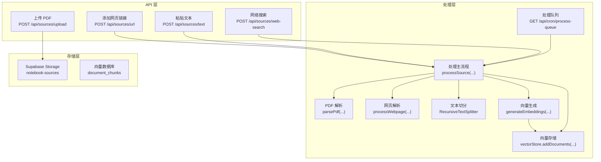
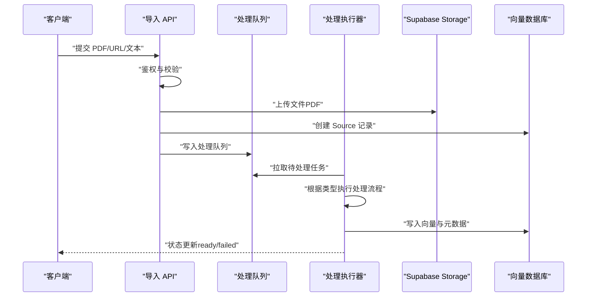
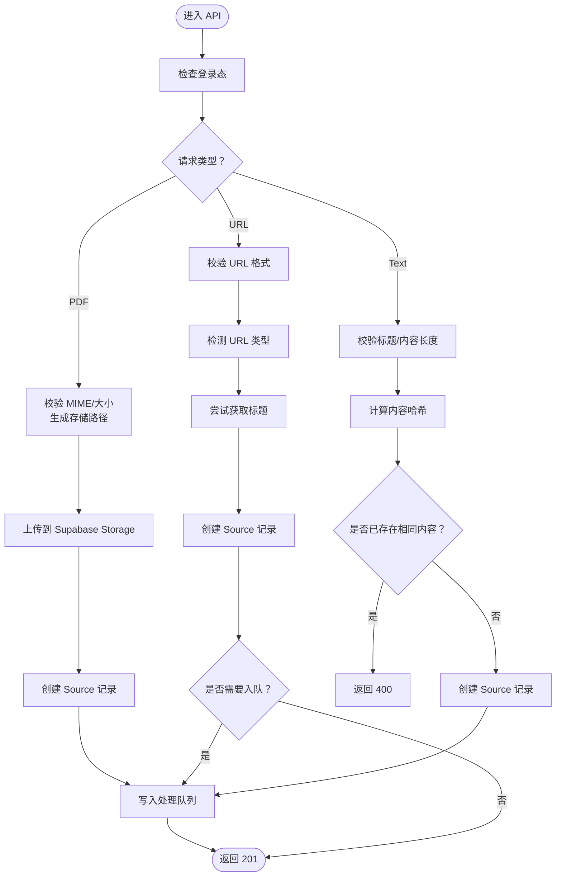
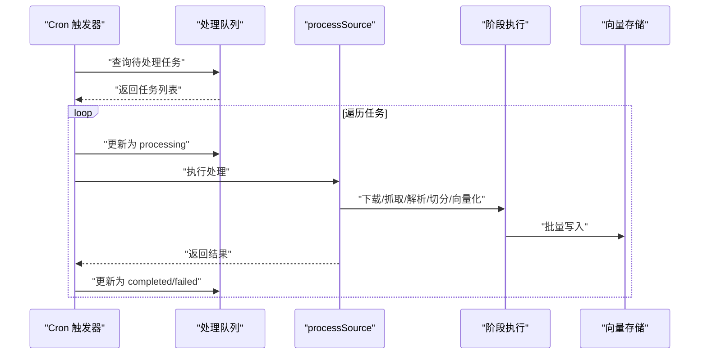
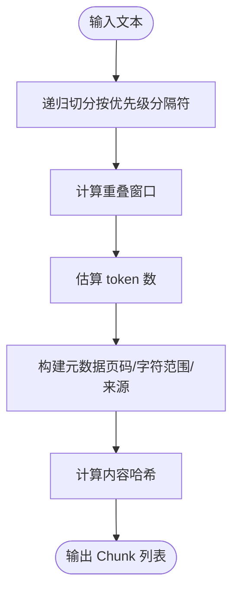
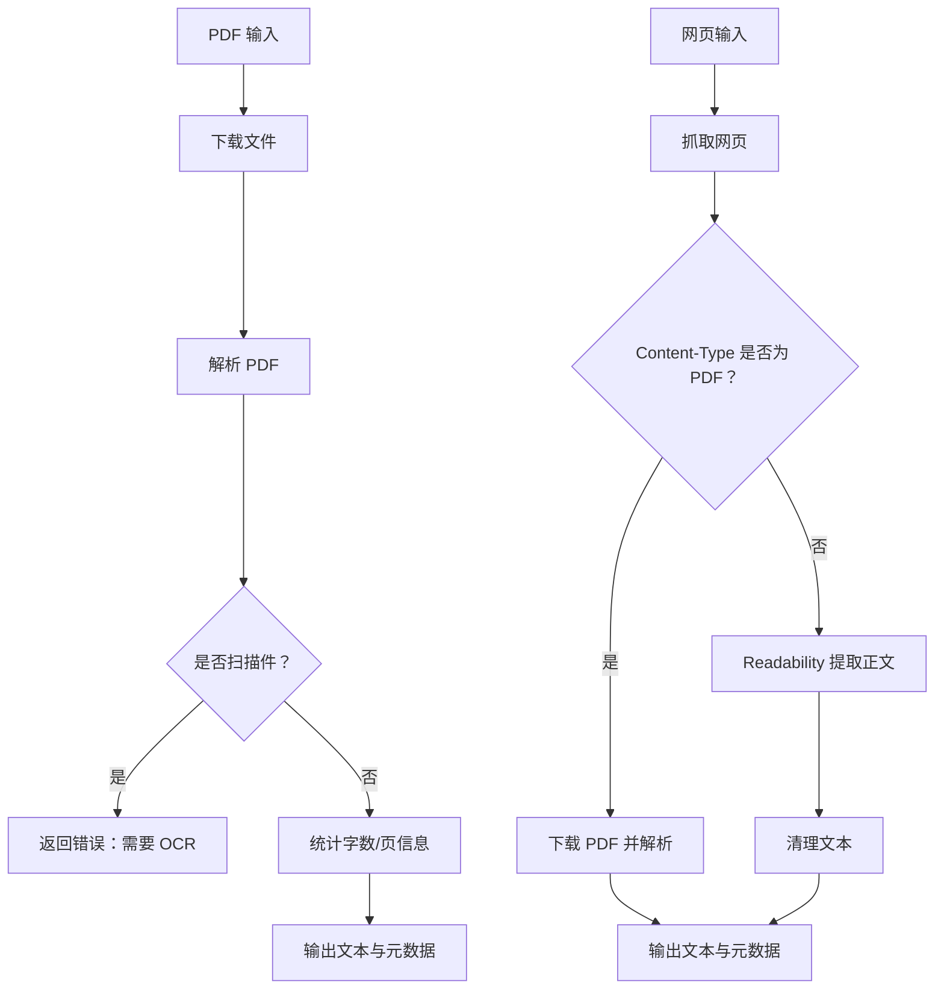
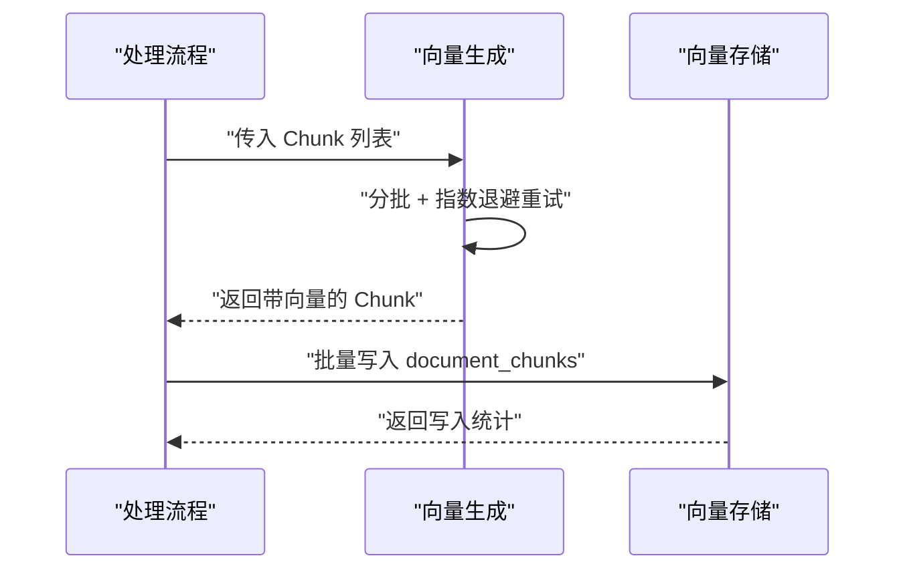
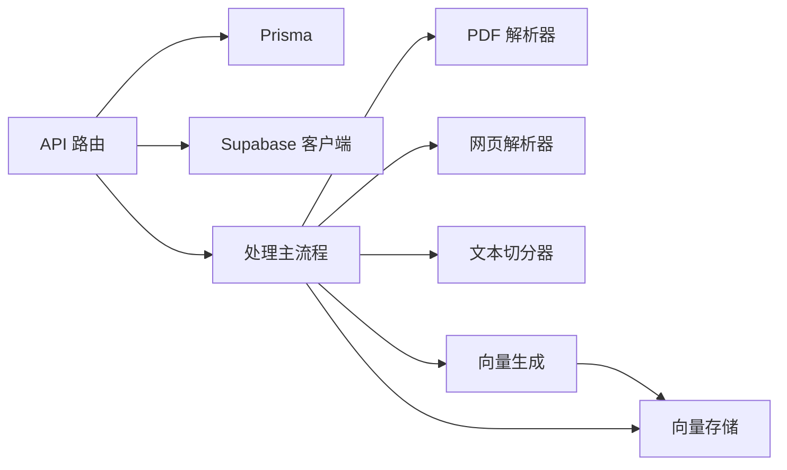
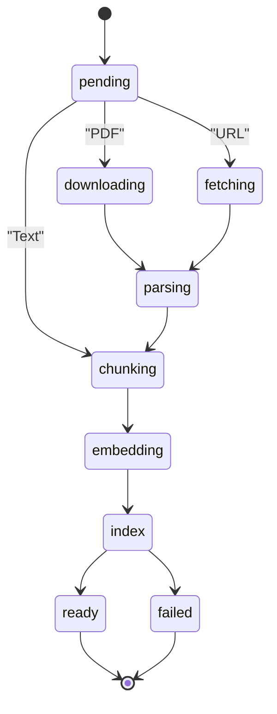

# 知识源导入系统

<cite>
**本文引用的文件**
- [app/api/sources/upload/route.ts](file://app/api/sources/upload/route.ts)
- [app/api/sources/url/route.ts](file://app/api/sources/url/route.ts)
- [app/api/sources/text/route.ts](file://app/api/sources/text/route.ts)
- [app/api/sources/web-search/route.ts](file://app/api/sources/web-search/route.ts)
- [app/api/cron/process-queue/route.ts](file://app/api/cron/process-queue/route.ts)
- [lib/processing/index.ts](file://lib/processing/index.ts)
- [lib/processing/pdf-parser.ts](file://lib/processing/pdf-parser.ts)
- [lib/processing/web-parser.ts](file://lib/processing/web-parser.ts)
- [lib/processing/text-splitter.ts](file://lib/processing/text-splitter.ts)
- [lib/processing/processor.ts](file://lib/processing/processor.ts)
- [lib/processing/embedding.ts](file://lib/processing/embedding.ts)
- [lib/db/vector-store.ts](file://lib/db/vector-store.ts)
- [lib/utils/logger.ts](file://lib/utils/logger.ts)
</cite>

## 目录
1. [简介](#简介)
2. [项目结构](#项目结构)
3. [核心组件](#核心组件)
4. [架构总览](#架构总览)
5. [详细组件分析](#详细组件分析)
6. [依赖关系分析](#依赖关系分析)
7. [性能考量](#性能考量)
8. [故障排查指南](#故障排查指南)
9. [结论](#结论)
10. [附录](#附录)

## 简介
本文件系统性梳理 notebookLM-clone 项目的“知识源导入系统”，覆盖多格式文档支持（PDF、网页、文本）、内容解析与切分、去重与格式标准化、处理队列设计（异步任务、重试、错误恢复、进度跟踪）、文件存储集成（Supabase Storage）、以及性能优化与监控。目标是帮助开发者与产品人员快速理解并高效维护该系统。

## 项目结构
导入系统由三层组成：
- API 层：负责接收用户输入、鉴权与校验、创建 Source 记录、写入处理队列
- 处理层：负责具体的内容抓取/解析、文本切分、向量化、写入向量库
- 存储层：负责 Supabase Storage 文件上传与向量数据库持久化

图表来源
- [app/api/sources/upload/route.ts](file://app/api/sources/upload/route.ts#L1-L111)
- [app/api/sources/url/route.ts](file://app/api/sources/url/route.ts#L1-L167)
- [app/api/sources/text/route.ts](file://app/api/sources/text/route.ts#L1-L122)
- [app/api/sources/web-search/route.ts](file://app/api/sources/web-search/route.ts#L1-L74)
- [app/api/cron/process-queue/route.ts](file://app/api/cron/process-queue/route.ts#L1-L165)
- [lib/processing/processor.ts](file://lib/processing/processor.ts#L1-L560)
- [lib/processing/pdf-parser.ts](file://lib/processing/pdf-parser.ts#L1-L150)
- [lib/processing/web-parser.ts](file://lib/processing/web-parser.ts#L1-L228)
- [lib/processing/text-splitter.ts](file://lib/processing/text-splitter.ts#L1-L270)
- [lib/processing/embedding.ts](file://lib/processing/embedding.ts#L1-L189)
- [lib/db/vector-store.ts](file://lib/db/vector-store.ts#L1-L446)

章节来源
- [app/api/sources/upload/route.ts](file://app/api/sources/upload/route.ts#L1-L111)
- [app/api/sources/url/route.ts](file://app/api/sources/url/route.ts#L1-L167)
- [app/api/sources/text/route.ts](file://app/api/sources/text/route.ts#L1-L122)
- [app/api/sources/web-search/route.ts](file://app/api/sources/web-search/route.ts#L1-L74)
- [app/api/cron/process-queue/route.ts](file://app/api/cron/process-queue/route.ts#L1-L165)
- [lib/processing/index.ts](file://lib/processing/index.ts#L1-L51)

## 核心组件
- 多源导入 API
  - PDF 上传：鉴权、文件类型/大小校验、上传至 Supabase Storage、创建 Source、入队
  - 网页链接：URL 类型检测（普通网页/PDF/YouTube）、抓取与标题提取、创建 Source、必要时入队
  - 文本粘贴：内容去重（基于内容哈希）、创建 Source、入队
  - 网络搜索：调用外部模型进行网络检索
- 处理队列与执行
  - Cron 触发：按优先级与创建时间拉取待处理任务，更新队列与 Source 状态，执行处理流程
- 文档处理流水线
  - PDF：下载 -> 解析 -> 切分 -> 向量化 -> 写入
  - 网页：抓取 -> 解析 -> 切分 -> 向量化 -> 写入
  - 文本：切分 -> 向量化 -> 写入
- 存储与去重
  - Supabase Storage：统一文件存储
  - 向量库：按 Source 去重（内容哈希），批量写入，支持相似度与混合检索

章节来源
- [app/api/sources/upload/route.ts](file://app/api/sources/upload/route.ts#L1-L111)
- [app/api/sources/url/route.ts](file://app/api/sources/url/route.ts#L1-L167)
- [app/api/sources/text/route.ts](file://app/api/sources/text/route.ts#L1-L122)
- [app/api/cron/process-queue/route.ts](file://app/api/cron/process-queue/route.ts#L1-L165)
- [lib/processing/processor.ts](file://lib/processing/processor.ts#L1-L560)
- [lib/db/vector-store.ts](file://lib/db/vector-store.ts#L1-L446)

## 架构总览
系统采用“事件驱动 + 队列”的异步处理模式。用户提交知识源后，API 层创建 Source 并写入处理队列；后台 Cron 定时拉取任务，逐阶段执行处理，并将结果写入向量数据库。所有阶段均记录日志与统计，便于监控与排障。

图表来源
- [app/api/sources/upload/route.ts](file://app/api/sources/upload/route.ts#L78-L105)
- [app/api/sources/url/route.ts](file://app/api/sources/url/route.ts#L129-L156)
- [app/api/sources/text/route.ts](file://app/api/sources/text/route.ts#L79-L103)
- [app/api/cron/process-queue/route.ts](file://app/api/cron/process-queue/route.ts#L38-L107)
- [lib/processing/processor.ts](file://lib/processing/processor.ts#L402-L420)
- [lib/db/vector-store.ts](file://lib/db/vector-store.ts#L77-L173)

## 详细组件分析

### 组件 A：多源导入 API
- PDF 上传
  - 校验：登录态、notebook 所有权、MIME 类型、大小上限
  - 存储：生成唯一路径，上传至 Supabase Storage
  - 记录：创建 Source（status=pending），写入 ProcessingQueue
- 网页链接
  - 校验：登录态、notebook 所有权、URL 格式
  - 类型检测：YouTube/PDF/普通网页
  - 标题提取：尝试抓取 HTML title
  - 记录：创建 Source，非视频类入队
- 文本粘贴
  - 校验：登录态、notebook 所有权、标题/内容长度
  - 去重：基于内容哈希检查是否已存在相同内容
  - 记录：创建 Source，入队
- 网络搜索
  - 调用外部模型进行网络检索，返回结构化结果

图表来源
- [app/api/sources/upload/route.ts](file://app/api/sources/upload/route.ts#L14-L110)
- [app/api/sources/url/route.ts](file://app/api/sources/url/route.ts#L68-L166)
- [app/api/sources/text/route.ts](file://app/api/sources/text/route.ts#L19-L121)

章节来源
- [app/api/sources/upload/route.ts](file://app/api/sources/upload/route.ts#L1-L111)
- [app/api/sources/url/route.ts](file://app/api/sources/url/route.ts#L1-L167)
- [app/api/sources/text/route.ts](file://app/api/sources/text/route.ts#L1-L122)
- [app/api/sources/web-search/route.ts](file://app/api/sources/web-search/route.ts#L1-L74)

### 组件 B：处理队列与执行
- 队列管理
  - 拉取：按优先级降序、创建时间升序，限制批量大小
  - 状态：pending -> processing -> completed/failed
  - 重试：最多 3 次，失败后若达到阈值则标记 Source 为 failed
  - 自修复：扫描状态为 pending 但不在队列中的 Source，自动补入并处理
- 执行流程
  - processSource：根据 Source.type 分派到对应处理器
  - processPdfSource/processUrlSource/processTextSource：分别执行下载/抓取 -> 解析 -> 切分 -> 向量化 -> 写库
  - 日志：记录各阶段耗时、token 数、chunk 数等

图表来源
- [app/api/cron/process-queue/route.ts](file://app/api/cron/process-queue/route.ts#L11-L158)
- [lib/processing/processor.ts](file://lib/processing/processor.ts#L402-L420)

章节来源
- [app/api/cron/process-queue/route.ts](file://app/api/cron/process-queue/route.ts#L1-L165)
- [lib/processing/processor.ts](file://lib/processing/processor.ts#L1-L560)

### 组件 C：文本处理与切分
- 切分器
  - 递归优先级：Markdown 标题 -> 段落 -> 换行 -> 中文标点 -> 英文句号 -> 空格 -> 字符
  - 重叠窗口：避免关键信息被截断
  - Token 估算：中文约 1.5 字符/token，英文约 4 字符/token
  - 元数据：包含页码、字符范围、token 数、来源类型等
- 去重
  - Source 内去重：基于内容哈希集合，避免重复写入
  - 全局去重：文本粘贴时基于内容哈希检查是否已存在

图表来源
- [lib/processing/text-splitter.ts](file://lib/processing/text-splitter.ts#L83-L264)

章节来源
- [lib/processing/text-splitter.ts](file://lib/processing/text-splitter.ts#L1-L270)
- [lib/processing/processor.ts](file://lib/processing/processor.ts#L426-L526)

### 组件 D：PDF 与网页解析
- PDF
  - 下载：从 Supabase Storage 按路径下载
  - 解析：使用 pdf-parse 提取文本、页数、字数；检测扫描件（平均每页字符数过少）
  - 结果：返回文本、页信息、统计与可选错误
- 网页
  - 抓取：带超时与重定向控制
  - 解析：@mozilla/readability 提取正文；清理多余空白；估算字数
  - 类型检测：区分普通网页、PDF、YouTube
  - 特殊处理：Content-Type 为 PDF 时走 PDF 流程

图表来源
- [lib/processing/pdf-parser.ts](file://lib/processing/pdf-parser.ts#L133-L149)
- [lib/processing/web-parser.ts](file://lib/processing/web-parser.ts#L174-L190)

章节来源
- [lib/processing/pdf-parser.ts](file://lib/processing/pdf-parser.ts#L1-L150)
- [lib/processing/web-parser.ts](file://lib/processing/web-parser.ts#L1-L228)

### 组件 E：向量生成与写库
- 向量生成
  - 批量 API：限制每批大小与单条 token 上限
  - 指数退避重试：对 429/500/502/503/504 等错误进行重试
  - 维度校验：确保返回向量维度一致
- 写库
  - 批量插入：分批写入，避免单次过大
  - 去重：按 (source_id, chunk_index) 去重
  - 日志：记录插入/查询耗时、成功/失败、跳过数量等

图表来源
- [lib/processing/embedding.ts](file://lib/processing/embedding.ts#L140-L188)
- [lib/db/vector-store.ts](file://lib/db/vector-store.ts#L77-L173)

章节来源
- [lib/processing/embedding.ts](file://lib/processing/embedding.ts#L1-L189)
- [lib/db/vector-store.ts](file://lib/db/vector-store.ts#L1-L446)

## 依赖关系分析
- API 层依赖 Supabase 客户端与 Prisma
- 处理层依赖 pdf-parse、@mozilla/readability、智谱 Embedding API
- 存储层依赖 Supabase Storage 与向量数据库（document_chunks）

图表来源
- [lib/processing/index.ts](file://lib/processing/index.ts#L1-L51)
- [lib/processing/pdf-parser.ts](file://lib/processing/pdf-parser.ts#L1-L150)
- [lib/processing/web-parser.ts](file://lib/processing/web-parser.ts#L1-L228)
- [lib/processing/text-splitter.ts](file://lib/processing/text-splitter.ts#L1-L270)
- [lib/processing/embedding.ts](file://lib/processing/embedding.ts#L1-L189)
- [lib/db/vector-store.ts](file://lib/db/vector-store.ts#L1-L446)

章节来源
- [lib/processing/index.ts](file://lib/processing/index.ts#L1-L51)

## 性能考量
- 批量与并发
  - 向量生成：每批最多 64 条，单条最多 3072 tokens
  - 向量写库：每批最多 500 条
  - 处理队列：每次最多处理 2 个任务，避免超时
- 资源限制
  - PDF 上传大小限制 50MB，URL 抓取超时 30 秒
  - 文本粘贴长度限制（标题与内容）
- 去重优化
  - Source 内去重（内容哈希集合）
  - 文本粘贴全局去重（基于内容哈希）
- 指数退避与容错
  - 向量 API 重试最多 3 次，延迟指数增长，上限 30 秒
- 监控与日志
  - 统一日志工具，记录向量操作耗时、成功/失败、跳过数量等

章节来源
- [lib/processing/embedding.ts](file://lib/processing/embedding.ts#L23-L26)
- [lib/db/vector-store.ts](file://lib/db/vector-store.ts#L9-L9)
- [app/api/cron/process-queue/route.ts](file://app/api/cron/process-queue/route.ts#L7-L7)
- [lib/utils/logger.ts](file://lib/utils/logger.ts#L1-L98)

## 故障排查指南
- 常见错误与定位
  - PDF 解析失败：检查文件是否加密/损坏；扫描件检测会提示需要 OCR
  - 网页抓取失败：检查 URL 可达性、是否 401/403/404；查看超时与内容类型
  - 向量生成失败：检查 API 返回状态、重试日志；确认向量维度一致
  - 队列堆积：检查 Cron 触发频率与批量大小；确认任务状态与重试次数
- 用户反馈策略
  - API 层返回明确错误码与消息（如“文件大小超出限制”、“URL 不合法”）
  - 处理失败时在 Source 中记录 errorMessage，前端可展示
- 调试工具
  - 开发环境启用日志输出，关注向量操作日志
  - 使用 Cron 接口参数 manual=true 进行手动触发与验证

章节来源
- [lib/processing/pdf-parser.ts](file://lib/processing/pdf-parser.ts#L88-L116)
- [lib/processing/web-parser.ts](file://lib/processing/web-parser.ts#L93-L125)
- [lib/processing/embedding.ts](file://lib/processing/embedding.ts#L115-L134)
- [app/api/cron/process-queue/route.ts](file://app/api/cron/process-queue/route.ts#L33-L36)
- [lib/utils/logger.ts](file://lib/utils/logger.ts#L75-L94)

## 结论
该知识源导入系统以清晰的职责分离与异步队列为核心，实现了对 PDF、网页与文本的统一接入与标准化处理。通过严格的去重、批量与重试机制、以及完善的日志监控，系统在可用性与稳定性方面具备良好表现。建议持续关注外部服务稳定性与队列容量，结合业务增长逐步扩大批量与并发能力。

## 附录
- 处理流程状态机（概念示意）
