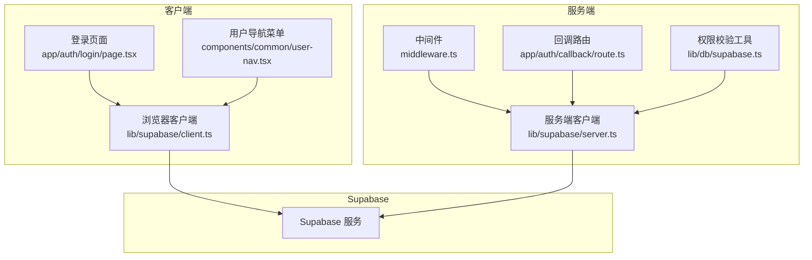
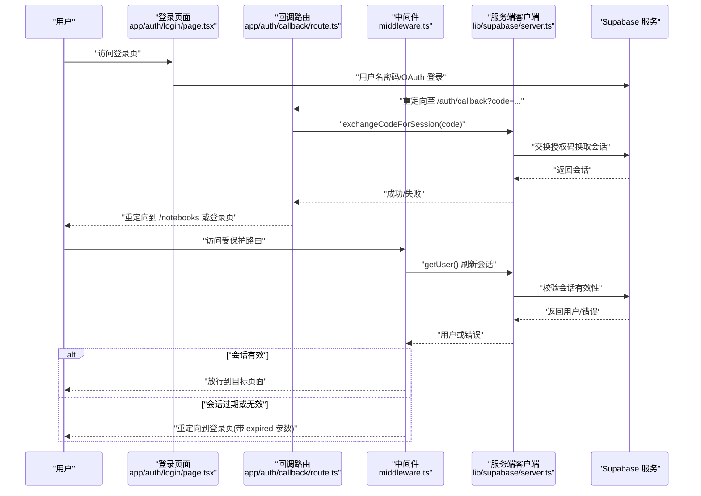
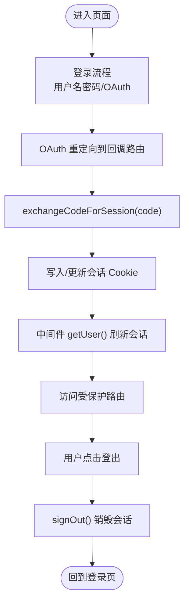
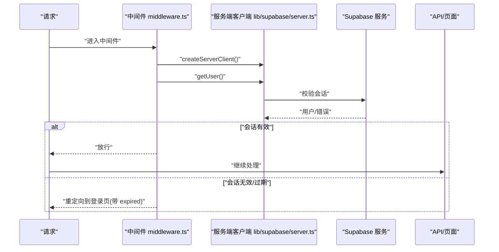
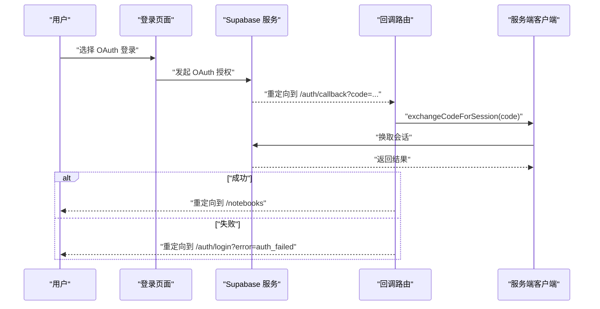
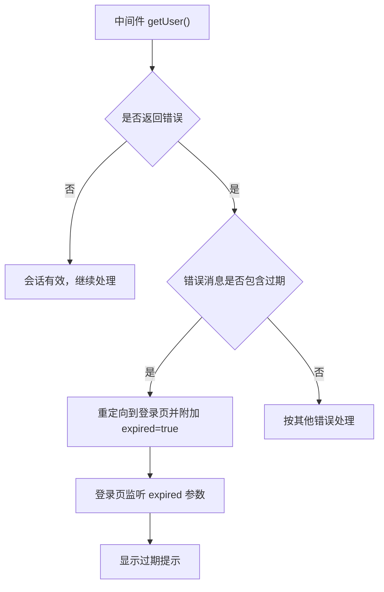
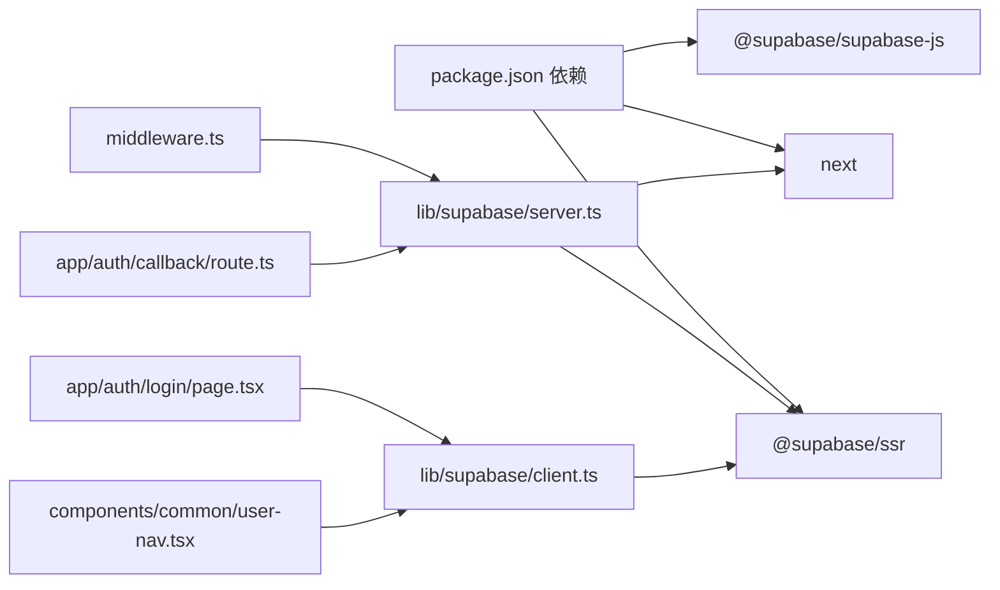

# 会话管理

<cite>
**本文引用的文件**
- [lib/supabase/client.ts](file://lib/supabase/client.ts)
- [lib/supabase/server.ts](file://lib/supabase/server.ts)
- [lib/supabase/admin.ts](file://lib/supabase/admin.ts)
- [app/auth/login/page.tsx](file://app/auth/login/page.tsx)
- [app/auth/callback/route.ts](file://app/auth/callback/route.ts)
- [middleware.ts](file://middleware.ts)
- [lib/db/supabase.ts](file://lib/db/supabase.ts)
- [components/common/user-nav.tsx](file://components/common/user-nav.tsx)
- [package.json](file://package.json)
- [next.config.js](file://next.config.js)
- [lib/config.ts](file://lib/config.ts)
- [lib/db/prisma.ts](file://lib/db/prisma.ts)
</cite>

## 目录
1. [简介](#简介)
2. [项目结构](#项目结构)
3. [核心组件](#核心组件)
4. [架构总览](#架构总览)
5. [详细组件分析](#详细组件分析)
6. [依赖关系分析](#依赖关系分析)
7. [性能考量](#性能考量)
8. [故障排除指南](#故障排除指南)
9. [结论](#结论)
10. [附录](#附录)

## 简介
本文件系统性梳理本项目的会话管理系统，覆盖 Supabase 会话的生命周期管理（创建、自动刷新、手动销毁）、客户端会话存储（浏览器 Cookie 的读写与跨页面同步）、服务端会话验证（createServerClient 的使用与 getUser() 调用时机）、会话过期处理策略（自动续期、错误检测与用户提示）、会话安全措施（Secure、HttpOnly、SameSite 等属性的配置现状与建议）、不同环境下的处理差异（开发、生产、SSR），以及会话相关的监控指标、清理与垃圾回收机制、故障排除与性能优化建议。

## 项目结构
围绕会话管理的关键文件分布如下：
- 客户端与服务端 Supabase 客户端封装：lib/supabase/client.ts、lib/supabase/server.ts、lib/supabase/admin.ts
- 认证流程入口与回调：app/auth/login/page.tsx、app/auth/callback/route.ts
- 路由保护与会话刷新：middleware.ts
- 服务端权限校验工具：lib/db/supabase.ts
- 用户登出与会话销毁：components/common/user-nav.tsx
- 依赖与配置：package.json、next.config.js、lib/config.ts、lib/db/prisma.ts

图表来源
- [lib/supabase/client.ts](file://lib/supabase/client.ts#L1-L14)
- [lib/supabase/server.ts](file://lib/supabase/server.ts#L1-L33)
- [app/auth/login/page.tsx](file://app/auth/login/page.tsx#L1-L230)
- [components/common/user-nav.tsx](file://components/common/user-nav.tsx#L1-L82)
- [middleware.ts](file://middleware.ts#L1-L78)
- [app/auth/callback/route.ts](file://app/auth/callback/route.ts#L1-L26)
- [lib/db/supabase.ts](file://lib/db/supabase.ts#L1-L39)

章节来源
- [lib/supabase/client.ts](file://lib/supabase/client.ts#L1-L14)
- [lib/supabase/server.ts](file://lib/supabase/server.ts#L1-L33)
- [lib/supabase/admin.ts](file://lib/supabase/admin.ts#L1-L19)
- [app/auth/login/page.tsx](file://app/auth/login/page.tsx#L1-L230)
- [app/auth/callback/route.ts](file://app/auth/callback/route.ts#L1-L26)
- [middleware.ts](file://middleware.ts#L1-L78)
- [lib/db/supabase.ts](file://lib/db/supabase.ts#L1-L39)
- [components/common/user-nav.tsx](file://components/common/user-nav.tsx#L1-L82)
- [package.json](file://package.json#L1-L82)
- [next.config.js](file://next.config.js#L1-L20)
- [lib/config.ts](file://lib/config.ts#L1-L186)
- [lib/db/prisma.ts](file://lib/db/prisma.ts#L1-L41)

## 核心组件
- 客户端 Supabase 客户端：封装 createBrowserClient，供客户端组件使用，负责本地会话读写与自动刷新。
- 服务端 Supabase 客户端：封装 createServerClient，通过 Next.js headers/cookies 接口读写会话，用于 Server Components、Server Actions、Route Handlers。
- 管理端 Supabase 客户端：使用 Secret Key，禁用自动刷新与持久化，仅用于服务端管理操作。
- 中间件：每次请求刷新会话并进行路由保护，识别过期错误并引导用户重新登录。
- 登录页面与回调：处理用户名密码登录、OAuth 登录、交换授权码换取会话等。
- 权限校验工具：服务端获取当前用户并校验资源所有权。
- 用户导航：提供登出功能，触发会话销毁。

章节来源
- [lib/supabase/client.ts](file://lib/supabase/client.ts#L1-L14)
- [lib/supabase/server.ts](file://lib/supabase/server.ts#L1-L33)
- [lib/supabase/admin.ts](file://lib/supabase/admin.ts#L1-L19)
- [middleware.ts](file://middleware.ts#L1-L78)
- [app/auth/login/page.tsx](file://app/auth/login/page.tsx#L1-L230)
- [app/auth/callback/route.ts](file://app/auth/callback/route.ts#L1-L26)
- [lib/db/supabase.ts](file://lib/db/supabase.ts#L1-L39)
- [components/common/user-nav.tsx](file://components/common/user-nav.tsx#L1-L82)

## 架构总览
下图展示从用户访问到会话验证与路由保护的整体流程，涵盖客户端登录、OAuth 回调、中间件刷新、服务端校验与权限控制。

图表来源
- [app/auth/login/page.tsx](file://app/auth/login/page.tsx#L1-L230)
- [app/auth/callback/route.ts](file://app/auth/callback/route.ts#L1-L26)
- [middleware.ts](file://middleware.ts#L1-L78)
- [lib/supabase/server.ts](file://lib/supabase/server.ts#L1-L33)

## 详细组件分析

### 客户端会话生命周期（创建、自动刷新、销毁）
- 创建与使用
  - 客户端通过 lib/supabase/client.ts 封装的 createClient() 获取浏览器端 Supabase 客户端，随后在登录页面与用户导航组件中使用。
  - 登录页面通过用户名密码登录或 OAuth 登录，OAuth 登录会携带 redirectTo 指向回调路由。
- 自动刷新
  - 客户端 Supabase 客户端在内部维护会话状态与自动刷新逻辑；在中间件中也会显式调用 getUser() 触发服务端侧刷新，确保会话有效性。
- 手动销毁
  - 用户导航组件提供登出入口，调用客户端的 signOut() 触发会话销毁，并重定向到登录页。

图表来源
- [app/auth/login/page.tsx](file://app/auth/login/page.tsx#L1-L230)
- [app/auth/callback/route.ts](file://app/auth/callback/route.ts#L1-L26)
- [middleware.ts](file://middleware.ts#L1-L78)
- [components/common/user-nav.tsx](file://components/common/user-nav.tsx#L1-L82)

章节来源
- [lib/supabase/client.ts](file://lib/supabase/client.ts#L1-L14)
- [app/auth/login/page.tsx](file://app/auth/login/page.tsx#L1-L230)
- [app/auth/callback/route.ts](file://app/auth/callback/route.ts#L1-L26)
- [components/common/user-nav.tsx](file://components/common/user-nav.tsx#L1-L82)

### 服务端会话验证与路由保护
- 服务端客户端
  - 通过 lib/supabase/server.ts 的 createClient() 获取服务端客户端，使用 Next.js headers/cookies 接口读写 Cookie，确保在服务端可访问与修改会话。
- 路由保护
  - middleware.ts 在每次请求时创建服务端客户端并调用 getUser()，根据用户是否存在与路由类型进行重定向，若检测到会话过期则在登录页附加 expired 参数提示。
- 权限校验
  - lib/db/supabase.ts 提供 getCurrentUserId() 与 verifyOwnership()，统一在服务端获取当前用户并校验资源所有权，所有 API 必须调用以保证架构约束。

图表来源
- [middleware.ts](file://middleware.ts#L1-L78)
- [lib/supabase/server.ts](file://lib/supabase/server.ts#L1-L33)
- [lib/db/supabase.ts](file://lib/db/supabase.ts#L1-L39)

章节来源
- [lib/supabase/server.ts](file://lib/supabase/server.ts#L1-L33)
- [middleware.ts](file://middleware.ts#L1-L78)
- [lib/db/supabase.ts](file://lib/db/supabase.ts#L1-L39)

### OAuth 登录与会话交换
- 登录页面支持用户名密码与 OAuth（Google/GitHub）。OAuth 登录时设置 redirectTo 指向回调路由。
- 回调路由接收授权码，调用服务端客户端的 exchangeCodeForSession() 将授权码换取会话，成功后重定向到笔记本列表，失败则重定向到登录页并附带错误参数。

图表来源
- [app/auth/login/page.tsx](file://app/auth/login/page.tsx#L1-L230)
- [app/auth/callback/route.ts](file://app/auth/callback/route.ts#L1-L26)
- [lib/supabase/server.ts](file://lib/supabase/server.ts#L1-L33)

章节来源
- [app/auth/login/page.tsx](file://app/auth/login/page.tsx#L1-L230)
- [app/auth/callback/route.ts](file://app/auth/callback/route.ts#L1-L26)

### 会话过期处理策略
- 自动续期
  - 客户端 Supabase 客户端具备自动刷新能力；中间件在每次请求时调用 getUser()，可视为“显式刷新”，确保会话在服务端侧保持有效。
- 错误检测
  - 中间件在 getUser() 返回错误且消息包含过期标识时，重定向到登录页并附加 expired 参数，前端登录页监听该参数显示过期提示。
- 用户提示
  - 登录页在检测到 expired=true 时显示“登录已过期，请重新登录”的警告信息。

图表来源
- [middleware.ts](file://middleware.ts#L1-L78)
- [app/auth/login/page.tsx](file://app/auth/login/page.tsx#L1-L230)

章节来源
- [middleware.ts](file://middleware.ts#L1-L78)
- [app/auth/login/page.tsx](file://app/auth/login/page.tsx#L1-L230)

### 会话安全措施
- 当前实现
  - 客户端与服务端均通过 Supabase SSr 客户端进行会话读写，具体 Cookie 的 Secure、HttpOnly、SameSite 等属性由 Supabase SDK 默认行为决定。
- 建议
  - 在生产环境中，建议在 Supabase 项目后台或通过自定义 Cookie 策略启用 Secure（仅 HTTPS）、HttpOnly（防 XSS）、SameSite（防 CSRF）等属性，以提升安全性。
  - 若需细粒度控制 Cookie 属性，可在服务端客户端的 cookies.setAll(options) 中传入相应选项（需结合 Supabase SDK 版本支持情况）。

章节来源
- [lib/supabase/server.ts](file://lib/supabase/server.ts#L1-L33)
- [lib/supabase/client.ts](file://lib/supabase/client.ts#L1-L14)

### 不同环境下的处理差异
- 开发环境
  - next.config.js 支持较大的 Server Actions 请求体大小，便于本地调试与上传场景；Supabase URL 与密钥来自环境变量。
- 生产环境
  - 依赖 .env.local 中的 NEXT_PUBLIC_SUPABASE_URL、NEXT_PUBLIC_SUPABASE_ANON_KEY、SUPABASE_SECRET_KEY 等；建议在 Supabase 项目后台开启更严格的 Cookie 安全策略。
- SSR 场景
  - 中间件与服务端客户端在 SSR 请求中通过 headers/cookies 接口读写会话，确保在服务端渲染期间也能正确刷新与验证会话。

章节来源
- [next.config.js](file://next.config.js#L1-L20)
- [lib/config.ts](file://lib/config.ts#L1-L186)
- [middleware.ts](file://middleware.ts#L1-L78)
- [lib/supabase/server.ts](file://lib/supabase/server.ts#L1-L33)

### 会话状态在不同环境下的处理差异
- 开发环境：允许较大的请求体，便于本地调试；Supabase URL 与密钥来自 .env.local。
- 生产环境：严格校验环境变量，缺失时抛出错误；建议启用更严格的 Cookie 安全策略。
- SSR 场景：中间件与服务端客户端通过 headers/cookies 接口读写会话，确保在服务端渲染期间也能正确刷新与验证会话。

章节来源
- [lib/config.ts](file://lib/config.ts#L168-L186)
- [next.config.js](file://next.config.js#L1-L20)
- [middleware.ts](file://middleware.ts#L1-L78)
- [lib/supabase/server.ts](file://lib/supabase/server.ts#L1-L33)

### 会话管理的监控指标
以下为建议的监控指标（概念性说明，非现有实现）：
- 活跃用户数：基于 getUser() 成功次数统计。
- 会话时长：记录会话创建时间与最近活动时间，计算平均会话时长。
- 失败率：统计 getUser() 返回错误的比例，特别是过期错误占比。
- 登录/登出事件：统计 signOut() 调用次数与 OAuth 登录成功率。
- Cookie 读写：统计中间件中会话刷新与 Cookie 设置次数。

[本节为通用指导，不直接分析具体文件，故无章节来源]

### 会话清理与垃圾回收
- 过期会话自动清理
  - Supabase 会在服务端侧校验会话有效期；当会话过期时，中间件 getUser() 返回错误，触发重定向与提示。
- 内存管理
  - 客户端与服务端客户端实例在各组件/请求中按需创建与销毁，避免长期持有导致内存泄漏；登出后应确保不再复用旧会话上下文。

[本节为通用指导，不直接分析具体文件，故无章节来源]

## 依赖关系分析
- 依赖版本
  - @supabase/ssr 与 @supabase/supabase-js 用于客户端与服务端会话管理。
  - Next.js 提供 headers/cookies 接口，支撑中间件与服务端客户端的会话读写。
- 关键耦合点
  - 中间件依赖服务端客户端；服务端客户端依赖 Next.js cookies 接口；登录页面与回调路由依赖客户端/服务端客户端完成会话创建与交换。
- 循环依赖
  - 当前文件组织未见循环依赖迹象。

图表来源
- [package.json](file://package.json#L1-L82)
- [middleware.ts](file://middleware.ts#L1-L78)
- [lib/supabase/server.ts](file://lib/supabase/server.ts#L1-L33)
- [lib/supabase/client.ts](file://lib/supabase/client.ts#L1-L14)
- [app/auth/login/page.tsx](file://app/auth/login/page.tsx#L1-L230)
- [app/auth/callback/route.ts](file://app/auth/callback/route.ts#L1-L26)
- [components/common/user-nav.tsx](file://components/common/user-nav.tsx#L1-L82)

章节来源
- [package.json](file://package.json#L1-L82)
- [middleware.ts](file://middleware.ts#L1-L78)
- [lib/supabase/server.ts](file://lib/supabase/server.ts#L1-L33)
- [lib/supabase/client.ts](file://lib/supabase/client.ts#L1-L14)
- [app/auth/login/page.tsx](file://app/auth/login/page.tsx#L1-L230)
- [app/auth/callback/route.ts](file://app/auth/callback/route.ts#L1-L26)
- [components/common/user-nav.tsx](file://components/common/user-nav.tsx#L1-L82)

## 性能考量
- 会话刷新频率
  - 中间件每次请求都会调用 getUser()，建议在高并发场景下评估其开销，必要时可引入轻量缓存或降低刷新频率。
- Cookie 体积与数量
  - 控制会话 Cookie 的大小与数量，避免影响请求头体积与网络传输效率。
- 请求体大小
  - next.config.js 已放宽 Server Actions 请求体限制，便于大文件上传场景；注意与 CDN/边缘节点的兼容性。
- 数据库连接
  - 服务端客户端与数据库连接池配置需与 Supabase 事务池配合，避免连接争用与超时。

[本节为通用指导，不直接分析具体文件，故无章节来源]

## 故障排除指南
- 环境变量缺失
  - lib/config.ts 在启动时校验必需环境变量，缺失时抛出错误；请检查 .env.local 是否正确配置 NEXT_PUBLIC_SUPABASE_URL、NEXT_PUBLIC_SUPABASE_ANON_KEY、SUPABASE_SECRET_KEY、DATABASE_URL、ZHIPU_API_KEY、EMBEDDING_DIM。
- 会话过期
  - 中间件检测到过期错误时会重定向到登录页并附加 expired=true；登录页监听该参数显示过期提示。请确认 Supabase 会话有效期与客户端自动刷新配置。
- OAuth 回调失败
  - 回调路由在 exchangeCodeForSession() 失败时重定向到登录页并附带错误参数；请检查 Supabase 项目中的 OAuth 配置与回调地址。
- 登出无效
  - 用户导航组件调用 signOut() 后应重定向到登录页；若仍显示已登录，请检查客户端会话是否被清除或浏览器 Cookie 是否被阻止。

章节来源
- [lib/config.ts](file://lib/config.ts#L168-L186)
- [middleware.ts](file://middleware.ts#L1-L78)
- [app/auth/callback/route.ts](file://app/auth/callback/route.ts#L1-L26)
- [components/common/user-nav.tsx](file://components/common/user-nav.tsx#L1-L82)

## 结论
本项目采用客户端与服务端双通道的 Supabase 会话管理方案：客户端负责本地会话读写与自动刷新，服务端通过中间件与服务端客户端统一刷新与校验会话，配合权限校验工具实现资源级访问控制。OAuth 登录与回调流程清晰，过期处理通过中间件与登录页参数联动实现用户体验闭环。建议在生产环境进一步强化 Cookie 安全策略，并结合业务场景优化会话刷新频率与监控指标，以获得更稳定与安全的会话体验。

## 附录
- 环境变量清单（必需）
  - NEXT_PUBLIC_SUPABASE_URL
  - NEXT_PUBLIC_SUPABASE_ANON_KEY
  - SUPABASE_SECRET_KEY
  - DATABASE_URL
  - ZHIPU_API_KEY
  - EMBEDDING_DIM
- 依赖版本要点
  - @supabase/ssr：提供 createBrowserClient/createServerClient 与 cookies 接口适配。
  - @supabase/supabase-js：提供管理员客户端与基础 SDK 能力。
  - next：提供 headers/cookies 接口，支撑 SSR 与中间件。

章节来源
- [lib/config.ts](file://lib/config.ts#L168-L186)
- [package.json](file://package.json#L1-L82)