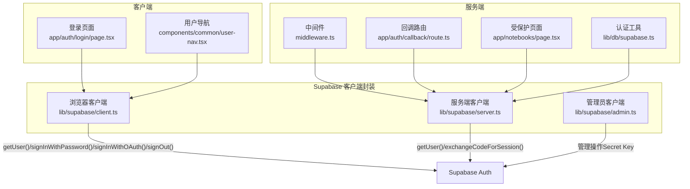
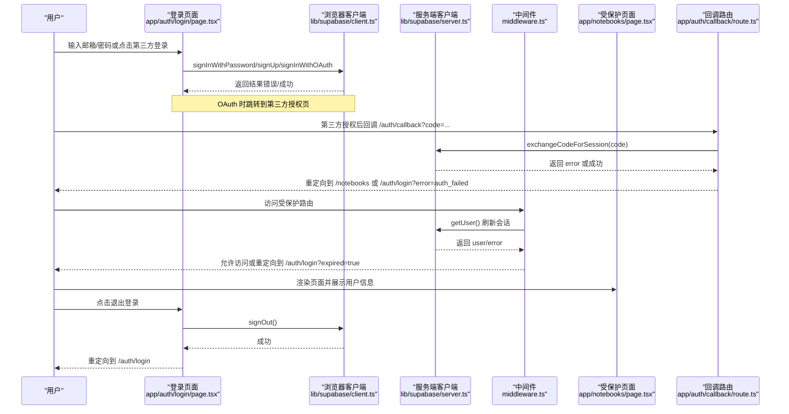
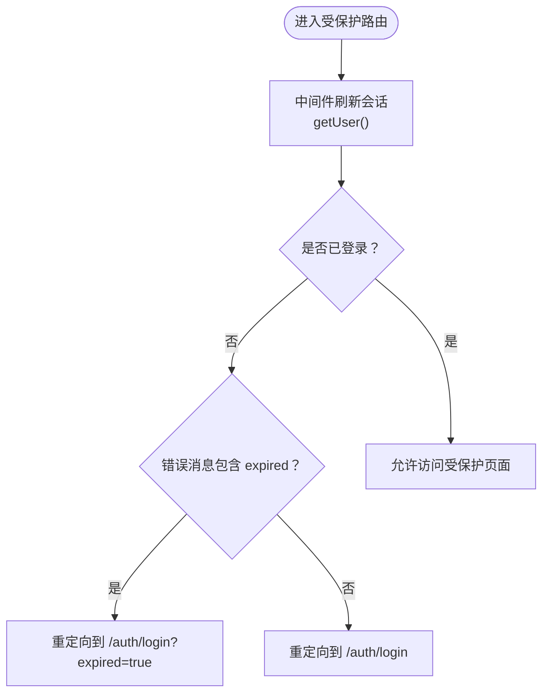
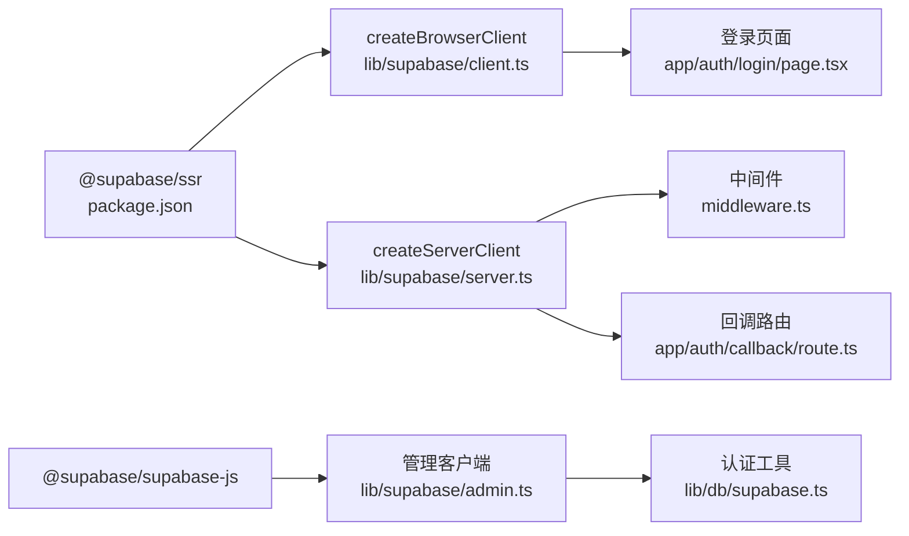

# 用户认证流程

<cite>
**本文引用的文件**
- [app/auth/login/page.tsx](file://app/auth/login/page.tsx)
- [app/auth/callback/route.ts](file://app/auth/callback/route.ts)
- [lib/supabase/client.ts](file://lib/supabase/client.ts)
- [lib/supabase/server.ts](file://lib/supabase/server.ts)
- [lib/supabase/admin.ts](file://lib/supabase/admin.ts)
- [components/common/user-nav.tsx](file://components/common/user-nav.tsx)
- [middleware.ts](file://middleware.ts)
- [lib/db/supabase.ts](file://lib/db/supabase.ts)
- [app/notebooks/page.tsx](file://app/notebooks/page.tsx)
- [lib/config.ts](file://lib/config.ts)
- [package.json](file://package.json)
</cite>

## 目录
1. [简介](#简介)
2. [项目结构](#项目结构)
3. [核心组件](#核心组件)
4. [架构总览](#架构总览)
5. [详细组件分析](#详细组件分析)
6. [依赖关系分析](#依赖关系分析)
7. [性能考量](#性能考量)
8. [故障排除指南](#故障排除指南)
9. [结论](#结论)

## 简介
本文件系统性梳理本项目的用户认证流程，涵盖 Supabase Auth 的客户端与服务端集成方式、OAuth 登录（Google/GitHub）配置与回调处理、会话生命周期（创建、刷新、销毁）、用户状态获取与验证、认证状态在客户端与服务端的同步机制（cookies 管理与状态持久化）、认证失败的恢复策略（过期会话、无效令牌、网络错误），以及安全注意事项（CSRF、XSS、会话劫持防护）。同时提供调试与排障建议，帮助开发者快速定位问题并优化体验。

## 项目结构
认证相关的关键文件分布如下：
- 客户端登录与交互：app/auth/login/page.tsx
- OAuth 回调处理：app/auth/callback/route.ts
- 客户端/服务端/管理员 Supabase 客户端封装：lib/supabase/client.ts、lib/supabase/server.ts、lib/supabase/admin.ts
- 用户导航与登出：components/common/user-nav.tsx
- 路由保护与会话刷新：middleware.ts
- 服务端用户状态与权限校验工具：lib/db/supabase.ts
- 受保护页面示例：app/notebooks/page.tsx
- 环境变量与配置：lib/config.ts
- 依赖声明：package.json

图表来源
- [app/auth/login/page.tsx](file://app/auth/login/page.tsx#L1-L230)
- [components/common/user-nav.tsx](file://components/common/user-nav.tsx#L1-L82)
- [middleware.ts](file://middleware.ts#L1-L78)
- [app/auth/callback/route.ts](file://app/auth/callback/route.ts#L1-L26)
- [app/notebooks/page.tsx](file://app/notebooks/page.tsx#L1-L65)
- [lib/db/supabase.ts](file://lib/db/supabase.ts#L1-L39)
- [lib/supabase/client.ts](file://lib/supabase/client.ts#L1-L14)
- [lib/supabase/server.ts](file://lib/supabase/server.ts#L1-L33)
- [lib/supabase/admin.ts](file://lib/supabase/admin.ts#L1-L19)

章节来源
- [app/auth/login/page.tsx](file://app/auth/login/page.tsx#L1-L230)
- [app/auth/callback/route.ts](file://app/auth/callback/route.ts#L1-L26)
- [lib/supabase/client.ts](file://lib/supabase/client.ts#L1-L14)
- [lib/supabase/server.ts](file://lib/supabase/server.ts#L1-L33)
- [lib/supabase/admin.ts](file://lib/supabase/admin.ts#L1-L19)
- [components/common/user-nav.tsx](file://components/common/user-nav.tsx#L1-L82)
- [middleware.ts](file://middleware.ts#L1-L78)
- [lib/db/supabase.ts](file://lib/db/supabase.ts#L1-L39)
- [app/notebooks/page.tsx](file://app/notebooks/page.tsx#L1-L65)
- [lib/config.ts](file://lib/config.ts#L168-L186)
- [package.json](file://package.json#L37-L38)

## 核心组件
- 浏览器端客户端封装：提供 createClient()，用于在客户端组件中调用 Supabase Auth 的 getUser、signInWithPassword、signInWithOAuth、signOut 等方法。
- 服务端客户端封装：提供 createClient()，通过 cookies 接口在服务端读写会话 Cookie，用于中间件与服务端组件刷新会话与进行权限校验。
- 管理端客户端：使用 Secret Key 创建客户端，绕过 RLS，仅用于服务端管理操作。
- 登录页面：支持邮箱/密码登录与注册；支持 Google/GitHub OAuth；处理注册邮件验证回调。
- OAuth 回调路由：接收授权码，调用 exchangeCodeForSession 完成会话建立，并重定向至目标页面或登录页。
- 中间件：统一刷新会话，对受保护路由进行访问控制，处理会话过期与重复登录跳转。
- 认证工具：提供 getCurrentUserId 与 verifyOwnership，确保 API 层权限校验的一致性。
- 用户导航：展示用户信息并提供退出登录功能。

章节来源
- [lib/supabase/client.ts](file://lib/supabase/client.ts#L1-L14)
- [lib/supabase/server.ts](file://lib/supabase/server.ts#L1-L33)
- [lib/supabase/admin.ts](file://lib/supabase/admin.ts#L1-L19)
- [app/auth/login/page.tsx](file://app/auth/login/page.tsx#L1-L230)
- [app/auth/callback/route.ts](file://app/auth/callback/route.ts#L1-L26)
- [middleware.ts](file://middleware.ts#L1-L78)
- [lib/db/supabase.ts](file://lib/db/supabase.ts#L1-L39)
- [components/common/user-nav.tsx](file://components/common/user-nav.tsx#L1-L82)

## 架构总览
下图展示了从用户发起登录到会话建立、中间件刷新、页面渲染与登出的完整流程。

图表来源
- [app/auth/login/page.tsx](file://app/auth/login/page.tsx#L35-L84)
- [app/auth/callback/route.ts](file://app/auth/callback/route.ts#L9-L25)
- [lib/supabase/server.ts](file://lib/supabase/server.ts#L9-L32)
- [middleware.ts](file://middleware.ts#L15-L71)
- [app/notebooks/page.tsx](file://app/notebooks/page.tsx#L14-L20)
- [components/common/user-nav.tsx](file://components/common/user-nav.tsx#L37-L41)

## 详细组件分析

### 客户端登录与交互（邮箱/密码与 OAuth）
- 功能要点
  - 支持登录与注册两种模式切换。
  - 注册时校验密码长度；注册成功提示用户检查邮箱完成验证。
  - OAuth 登录支持 Google 与 GitHub，回调地址指向 /auth/callback。
  - 处理登录/注册过程中的错误消息展示。
- 关键调用
  - 登录：调用浏览器客户端的登录方法。
  - 注册：调用浏览器客户端的注册方法并传入回调地址。
  - OAuth：调用浏览器客户端的 OAuth 登录方法并传入回调地址。
- 错误处理
  - 将错误信息以消息框形式展示；注册密码过短时即时反馈。

章节来源
- [app/auth/login/page.tsx](file://app/auth/login/page.tsx#L17-L84)

### OAuth 回调处理（Google/GitHub）
- 功能要点
  - 从查询参数提取授权码。
  - 使用服务端客户端调用 exchangeCodeForSession 完成会话建立。
  - 成功则重定向到目标路径（默认 /notebooks），失败则重定向到登录页并附带错误参数。
- 关键调用
  - 服务端客户端：exchangeCodeForSession(code)。
- 安全注意
  - 回调路由应仅处理授权码交换，不暴露敏感逻辑。

章节来源
- [app/auth/callback/route.ts](file://app/auth/callback/route.ts#L9-L25)
- [lib/supabase/server.ts](file://lib/supabase/server.ts#L9-L32)

### 会话管理机制（创建、刷新、销毁）
- 会话创建
  - 邮箱/密码登录：客户端调用登录方法后，服务端通过 cookies 建立会话。
  - OAuth 登录：授权完成后，回调路由通过 exchangeCodeForSession 建立会话。
- 会话刷新
  - 中间件每次请求都会调用 getUser() 刷新会话并读取用户信息。
  - 若检测到会话过期，自动附加 expired 参数重定向到登录页。
- 会话销毁
  - 用户导航组件调用客户端的 signOut()，清除本地会话并重定向到登录页。

图表来源
- [middleware.ts](file://middleware.ts#L40-L68)

章节来源
- [middleware.ts](file://middleware.ts#L15-L71)
- [components/common/user-nav.tsx](file://components/common/user-nav.tsx#L37-L41)

### 用户状态获取与验证（getUser 与权限校验）
- 用户状态获取
  - 服务端组件与中间件通过 createClient().auth.getUser() 获取当前用户。
  - 受保护页面在服务端渲染前先获取用户，若未登录则重定向到登录页。
- 权限校验
  - 提供 getCurrentUserId 与 verifyOwnership，确保所有 API 层都进行所有权校验。
- 错误处理
  - 当 getUser() 返回错误且包含过期标识时，中间件会附加 expired 参数引导用户重新登录。

章节来源
- [app/notebooks/page.tsx](file://app/notebooks/page.tsx#L14-L20)
- [middleware.ts](file://middleware.ts#L40-L41)
- [lib/db/supabase.ts](file://lib/db/supabase.ts#L12-L33)

### 认证状态在客户端与服务端的同步（Cookies 管理与状态持久化）
- 客户端
  - 浏览器客户端封装基于 @supabase/ssr 的 createBrowserClient，自动维护本地会话。
- 服务端
  - 服务端客户端封装通过 cookies 接口读取与写入会话 Cookie，确保中间件与服务端组件能正确刷新会话。
  - 中间件在响应头中同步设置 Cookie，保证后续请求携带最新会话。
- 状态持久化
  - 会话状态通过 Cookie 在浏览器与服务端之间保持一致，避免跨请求丢失。

章节来源
- [lib/supabase/client.ts](file://lib/supabase/client.ts#L8-L13)
- [lib/supabase/server.ts](file://lib/supabase/server.ts#L9-L32)
- [middleware.ts](file://middleware.ts#L22-L38)

### 认证失败的处理策略
- 会话过期
  - 中间件检测到过期错误时，重定向到登录页并附加 expired 参数，提示用户重新登录。
- 无效令牌/授权失败
  - OAuth 回调路由在交换授权码失败时，重定向到登录页并附带错误参数。
- 网络错误
  - 客户端与服务端调用均可能因网络异常返回错误；登录页面捕获错误并展示给用户。

章节来源
- [middleware.ts](file://middleware.ts#L56-L62)
- [app/auth/callback/route.ts](file://app/auth/callback/route.ts#L23-L24)
- [app/auth/login/page.tsx](file://app/auth/login/page.tsx#L67-L71)

### 安全考虑（CSRF、XSS、会话劫持）
- CSRF 防护
  - 使用 Supabase 的 OAuth 回调与内置会话机制，减少手写 CSRF Token 的复杂度；确保回调地址与应用域名一致。
- XSS 防护
  - 不在客户端存储敏感数据；仅使用 Cookie 保存会话；避免在前端渲染敏感信息。
- 会话劫持防护
  - 使用 HTTPS；合理设置 Cookie 属性（HttpOnly、Secure、SameSite）；定期刷新会话；在中间件中及时检测过期并重定向。
- 管理端密钥使用
  - 管理端客户端使用 Secret Key，仅在服务端执行管理操作，避免在客户端暴露。

章节来源
- [lib/supabase/admin.ts](file://lib/supabase/admin.ts#L9-L18)
- [lib/supabase/server.ts](file://lib/supabase/server.ts#L15-L31)

## 依赖关系分析
- 客户端依赖
  - @supabase/ssr：提供 createBrowserClient 与 createServerClient。
  - @supabase/supabase-js：提供服务端管理客户端能力。
- 服务端依赖
  - next/headers：用于读取与设置 cookies。
  - next/server：用于重定向与响应处理。
- 项目依赖
  - package.json 中声明了 @supabase/ssr 与 @supabase/supabase-js。

图表来源
- [package.json](file://package.json#L37-L38)
- [lib/supabase/client.ts](file://lib/supabase/client.ts#L6)
- [lib/supabase/server.ts](file://lib/supabase/server.ts#L6)
- [lib/supabase/admin.ts](file://lib/supabase/admin.ts#L7)

章节来源
- [package.json](file://package.json#L37-L38)
- [lib/supabase/client.ts](file://lib/supabase/client.ts#L6)
- [lib/supabase/server.ts](file://lib/supabase/server.ts#L6)
- [lib/supabase/admin.ts](file://lib/supabase/admin.ts#L7)

## 性能考量
- 中间件每次请求都会调用 getUser() 刷新会话，建议：
  - 控制中间件匹配范围，避免对静态资源与非受保护路由频繁刷新。
  - 合理设置会话过期时间与刷新频率，平衡安全与性能。
- 客户端调用
  - 避免在高频事件中重复触发登录/注册/OAuth 请求。
  - 对错误进行去抖与合并提示，提升用户体验。

## 故障排除指南
- 环境变量缺失
  - 确保 NEXT_PUBLIC_SUPABASE_URL、NEXT_PUBLIC_SUPABASE_ANON_KEY、SUPABASE_SECRET_KEY 等关键变量已配置。
- OAuth 回调失败
  - 检查回调地址是否与 Supabase 项目配置一致；确认回调路由能正确接收授权码并调用 exchangeCodeForSession。
- 会话过期导致无法访问受保护页面
  - 中间件会在检测到过期时重定向到登录页并附带 expired 参数；引导用户重新登录。
- 登出后仍可访问受保护页面
  - 确认客户端调用了 signOut() 并重定向到登录页；检查中间件是否正确刷新会话。
- 管理端操作报错
  - 确认使用的是管理端客户端（Secret Key），且仅在服务端执行管理操作。

章节来源
- [lib/config.ts](file://lib/config.ts#L168-L186)
- [app/auth/callback/route.ts](file://app/auth/callback/route.ts#L9-L25)
- [middleware.ts](file://middleware.ts#L56-L68)
- [components/common/user-nav.tsx](file://components/common/user-nav.tsx#L37-L41)
- [lib/supabase/admin.ts](file://lib/supabase/admin.ts#L9-L18)

## 结论
本项目采用 Supabase Auth 的客户端与服务端封装，结合中间件统一会话刷新与路由保护，实现了完整的认证与权限控制流程。OAuth 登录（Google/GitHub）通过标准回调机制完成会话建立；中间件负责会话过期检测与重定向；服务端工具提供统一的用户状态获取与权限校验。遵循本文的安全建议与排障指南，可有效提升系统的安全性与稳定性。