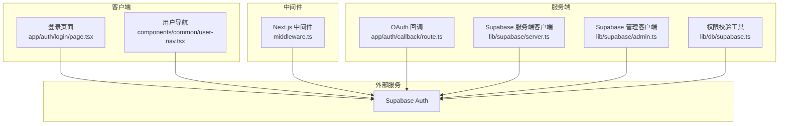
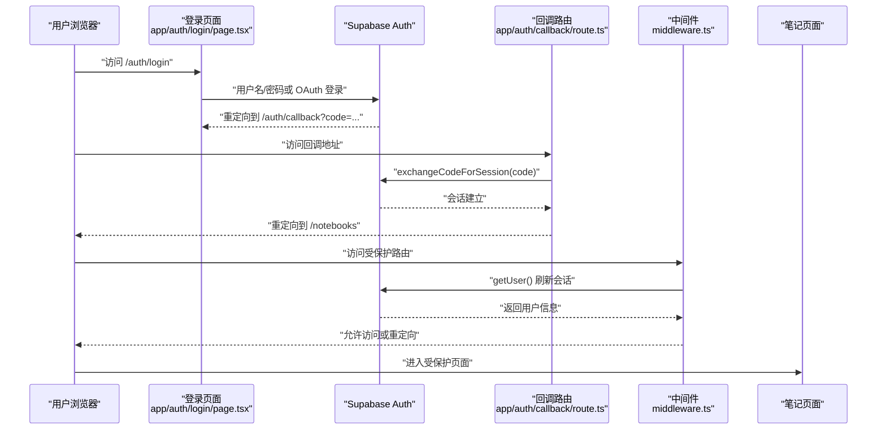
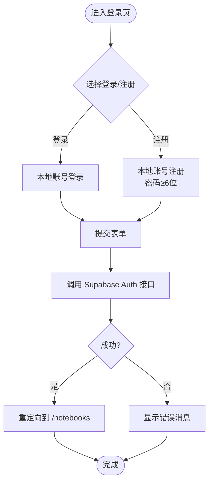
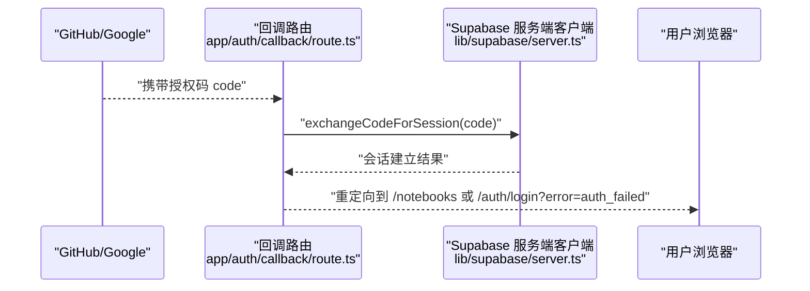
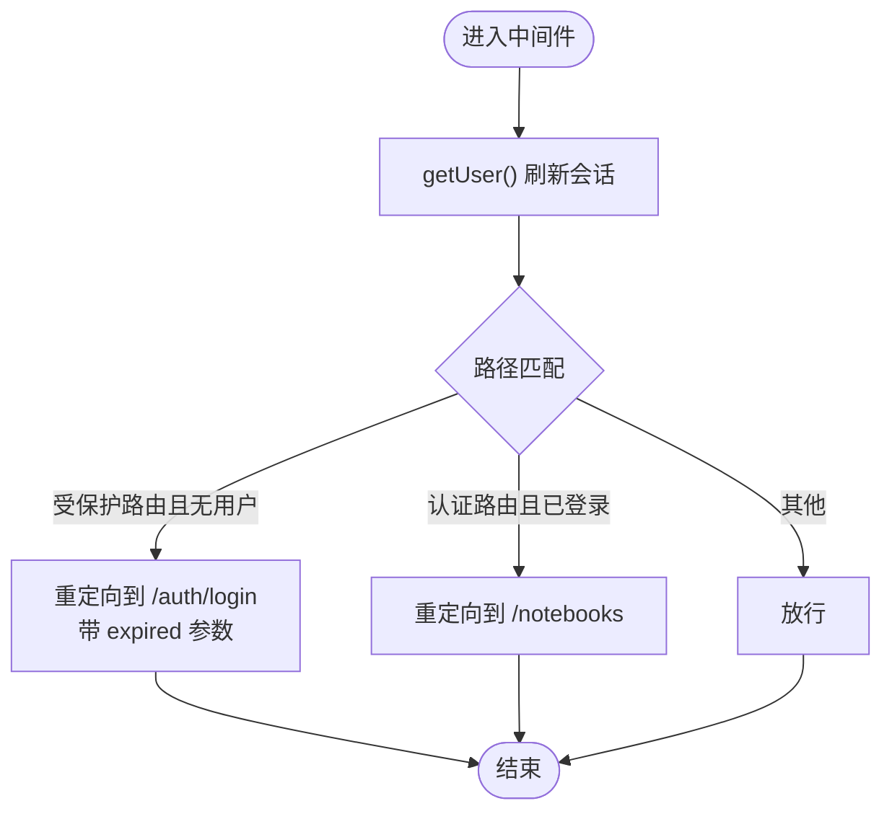
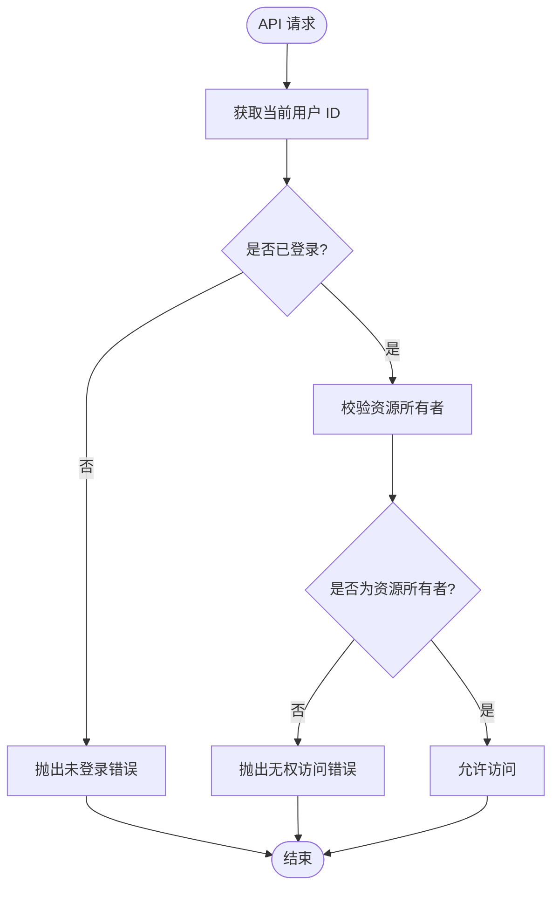
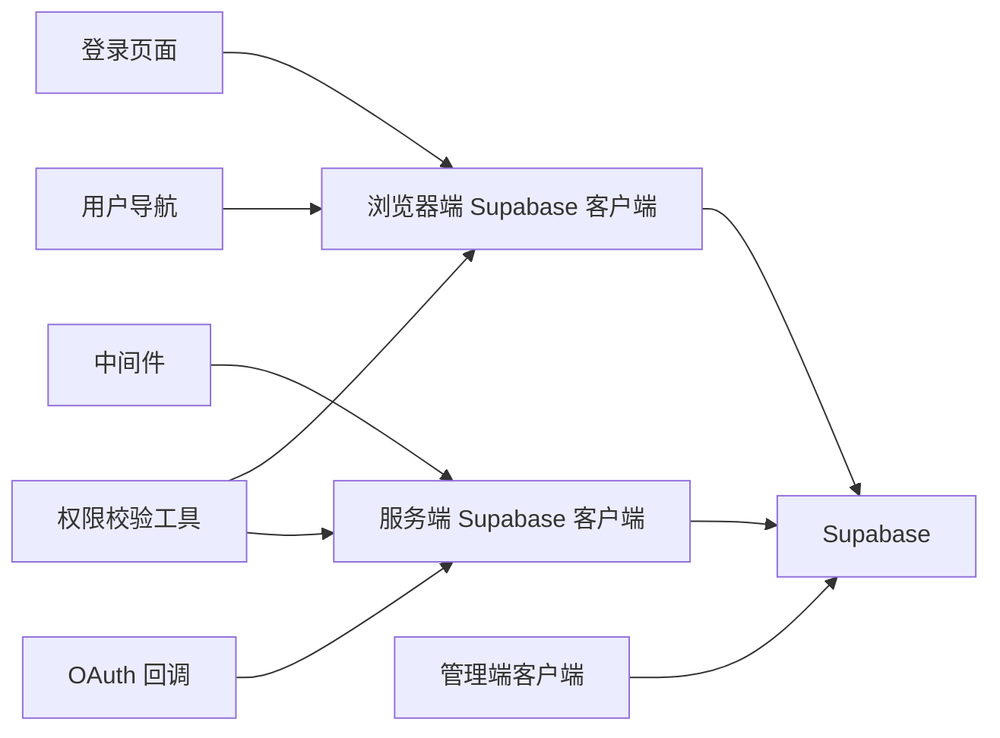

# 认证与权限系统

<cite>
**本文档引用的文件**
- [app/auth/login/page.tsx](file://app/auth/login/page.tsx)
- [app/auth/callback/route.ts](file://app/auth/callback/route.ts)
- [middleware.ts](file://middleware.ts)
- [lib/supabase/client.ts](file://lib/supabase/client.ts)
- [lib/supabase/server.ts](file://lib/supabase/server.ts)
- [lib/supabase/admin.ts](file://lib/supabase/admin.ts)
- [lib/db/supabase.ts](file://lib/db/supabase.ts)
- [components/common/user-nav.tsx](file://components/common/user-nav.tsx)
- [app/403/page.tsx](file://app/403/page.tsx)
- [lib/utils/logger.ts](file://lib/utils/logger.ts)
- [lib/config.ts](file://lib/config.ts)
- [prisma/migrations/20260120042257_sync_schema_changes/migration.sql](file://prisma/migrations/20260120042257_sync_schema_changes/migration.sql)
- [prisma/migrations/20260120120000_add_unique_constraint/migration.sql](file://prisma/migrations/20260120120000_add_unique_constraint/migration.sql)
</cite>

## 目录
1. [简介](#简介)
2. [项目结构](#项目结构)
3. [核心组件](#核心组件)
4. [架构总览](#架构总览)
5. [详细组件分析](#详细组件分析)
6. [依赖关系分析](#依赖关系分析)
7. [性能考量](#性能考量)
8. [故障排除指南](#故障排除指南)
9. [结论](#结论)
10. [附录](#附录)

## 简介
本文件系统性梳理 notebookLM-clone 项目的认证与权限体系，覆盖以下主题：
- 用户认证流程：Supabase Auth 集成、OAuth 登录、会话管理与令牌刷新
- 权限控制机制：资源级所有权校验、403 页面与访问隔离
- 中间件设计：路由保护、身份验证与权限检查的执行流程
- SSR 中的认证处理：服务端认证、客户端同步与状态管理
- 认证状态管理最佳实践：全局状态、持久化存储与安全考虑
- 会话安全措施：CSRF 防护、XSS 防护与会话劫持防护
- 监控指标、日志记录与安全审计
- 故障排除、调试工具与测试策略

## 项目结构
认证与权限相关的核心文件分布如下：
- 客户端登录与交互：app/auth/login/page.tsx
- OAuth 回调处理：app/auth/callback/route.ts
- 全局中间件：middleware.ts
- Supabase 客户端封装：lib/supabase/client.ts、lib/supabase/server.ts、lib/supabase/admin.ts
- 权限校验工具：lib/db/supabase.ts
- 用户导航与登出：components/common/user-nav.tsx
- 403 禁止访问页面：app/403/page.tsx
- 日志工具：lib/utils/logger.ts
- 应用配置与环境校验：lib/config.ts
- 数据库迁移与约束：prisma/migrations/.../migration.sql

图表来源
- [app/auth/login/page.tsx](file://app/auth/login/page.tsx#L1-L230)
- [components/common/user-nav.tsx](file://components/common/user-nav.tsx#L1-L82)
- [middleware.ts](file://middleware.ts#L1-L78)
- [app/auth/callback/route.ts](file://app/auth/callback/route.ts#L1-L26)
- [lib/supabase/server.ts](file://lib/supabase/server.ts#L1-L33)
- [lib/supabase/admin.ts](file://lib/supabase/admin.ts#L1-L19)
- [lib/db/supabase.ts](file://lib/db/supabase.ts#L1-L38)

章节来源
- [app/auth/login/page.tsx](file://app/auth/login/page.tsx#L1-L230)
- [middleware.ts](file://middleware.ts#L1-L78)
- [lib/supabase/server.ts](file://lib/supabase/server.ts#L1-L33)
- [lib/supabase/admin.ts](file://lib/supabase/admin.ts#L1-L19)
- [lib/db/supabase.ts](file://lib/db/supabase.ts#L1-L38)

## 核心组件
- 客户端 Supabase 客户端：用于浏览器端登录、注册与登出等交互
- 服务端 Supabase 客户端：用于 Server Components、Server Actions、Route Handlers 的会话读取与写入
- 管理端 Supabase 客户端：使用 Secret Key，绕过 RLS，仅用于服务端管理操作
- 中间件：统一进行路由保护、会话刷新与重定向
- 权限校验工具：提供当前用户 ID 获取与资源所有权校验
- 登录页面与用户导航：提供表单登录、OAuth 登录、注册与登出入口
- OAuth 回调：接收并交换授权码，建立会话并重定向

章节来源
- [lib/supabase/client.ts](file://lib/supabase/client.ts#L1-L14)
- [lib/supabase/server.ts](file://lib/supabase/server.ts#L1-L33)
- [lib/supabase/admin.ts](file://lib/supabase/admin.ts#L1-L19)
- [middleware.ts](file://middleware.ts#L1-L78)
- [lib/db/supabase.ts](file://lib/db/supabase.ts#L1-L38)
- [app/auth/login/page.tsx](file://app/auth/login/page.tsx#L1-L230)
- [components/common/user-nav.tsx](file://components/common/user-nav.tsx#L1-L82)
- [app/auth/callback/route.ts](file://app/auth/callback/route.ts#L1-L26)

## 架构总览
下图展示从用户访问到会话建立与路由保护的整体流程。

图表来源
- [app/auth/login/page.tsx](file://app/auth/login/page.tsx#L35-L84)
- [app/auth/callback/route.ts](file://app/auth/callback/route.ts#L9-L25)
- [middleware.ts](file://middleware.ts#L15-L71)

## 详细组件分析

### 客户端认证与登录
- 支持本地账号登录与注册（密码长度校验）、Google/GitHub OAuth 登录
- 登录成功后跳转至笔记本列表页；注册后提示邮箱验证
- OAuth 登录通过 Supabase 服务端回调交换授权码并建立会话

图表来源
- [app/auth/login/page.tsx](file://app/auth/login/page.tsx#L35-L84)

章节来源
- [app/auth/login/page.tsx](file://app/auth/login/page.tsx#L1-L230)

### OAuth 回调与会话建立
- 回调路由接收授权码，调用 Supabase 服务端客户端交换会话
- 成功则重定向到目标路径（默认笔记本页），失败则回退到登录页并带错误参数

图表来源
- [app/auth/callback/route.ts](file://app/auth/callback/route.ts#L9-L25)
- [lib/supabase/server.ts](file://lib/supabase/server.ts#L9-L32)

章节来源
- [app/auth/callback/route.ts](file://app/auth/callback/route.ts#L1-L26)
- [lib/supabase/server.ts](file://lib/supabase/server.ts#L1-L33)

### 中间件：路由保护与会话刷新
- 定义受保护路由与认证路由
- 每次请求通过 Supabase 服务端客户端刷新会话并获取用户
- 未登录访问受保护路由重定向到登录页（带过期提示），已登录访问登录页重定向到笔记本页

图表来源
- [middleware.ts](file://middleware.ts#L15-L71)

章节来源
- [middleware.ts](file://middleware.ts#L1-L78)

### 权限控制：资源级所有权校验
- 提供当前用户 ID 获取与资源所有权校验工具
- 未登录访问抛出“未登录”错误，非资源所有者抛出“无权访问”错误
- 403 页面用于无权访问场景的用户提示

图表来源
- [lib/db/supabase.ts](file://lib/db/supabase.ts#L12-L33)
- [app/403/page.tsx](file://app/403/page.tsx#L1-L33)

章节来源
- [lib/db/supabase.ts](file://lib/db/supabase.ts#L1-L38)
- [app/403/page.tsx](file://app/403/page.tsx#L1-L33)

### 用户导航与登出
- 展示用户头像与基本信息，提供退出登录入口
- 登出后清空会话并重定向到登录页

章节来源
- [components/common/user-nav.tsx](file://components/common/user-nav.tsx#L1-L82)

### Supabase 客户端封装
- 浏览器端客户端：用于 Client Components 的认证交互
- 服务端客户端：用于 Server Components/Actions/Route Handlers 的会话读取与写入
- 管理端客户端：使用 Secret Key，绕过 RLS，仅用于服务端管理操作

章节来源
- [lib/supabase/client.ts](file://lib/supabase/client.ts#L1-L14)
- [lib/supabase/server.ts](file://lib/supabase/server.ts#L1-L33)
- [lib/supabase/admin.ts](file://lib/supabase/admin.ts#L1-L19)

### 数据库与权限约束
- 数据库迁移定义了 notebooks、sources、messages、artifacts、prompt_templates 等表及索引
- 通过外键约束保证资源层级关系
- 唯一性约束确保同源分片不重复

章节来源
- [prisma/migrations/20260120042257_sync_schema_changes/migration.sql](file://prisma/migrations/20260120042257_sync_schema_changes/migration.sql#L11-L146)
- [prisma/migrations/20260120120000_add_unique_constraint/migration.sql](file://prisma/migrations/20260120120000_add_unique_constraint/migration.sql#L1-L26)

## 依赖关系分析
- 客户端登录与用户导航依赖浏览器端 Supabase 客户端
- 中间件依赖服务端 Supabase 客户端进行会话刷新
- OAuth 回调依赖服务端 Supabase 客户端交换授权码
- 权限校验工具依赖 Supabase 会话信息进行资源所有权判断
- 管理端客户端独立于会话，直接使用 Secret Key

图表来源
- [app/auth/login/page.tsx](file://app/auth/login/page.tsx#L8-L26)
- [components/common/user-nav.tsx](file://components/common/user-nav.tsx#L33-L41)
- [middleware.ts](file://middleware.ts#L22-L41)
- [app/auth/callback/route.ts](file://app/auth/callback/route.ts#L14-L21)
- [lib/db/supabase.ts](file://lib/db/supabase.ts#L12-L33)
- [lib/supabase/client.ts](file://lib/supabase/client.ts#L8-L13)
- [lib/supabase/server.ts](file://lib/supabase/server.ts#L9-L32)
- [lib/supabase/admin.ts](file://lib/supabase/admin.ts#L9-L18)

章节来源
- [app/auth/login/page.tsx](file://app/auth/login/page.tsx#L1-L230)
- [components/common/user-nav.tsx](file://components/common/user-nav.tsx#L1-L82)
- [middleware.ts](file://middleware.ts#L1-L78)
- [app/auth/callback/route.ts](file://app/auth/callback/route.ts#L1-L26)
- [lib/db/supabase.ts](file://lib/db/supabase.ts#L1-L38)
- [lib/supabase/client.ts](file://lib/supabase/client.ts#L1-L14)
- [lib/supabase/server.ts](file://lib/supabase/server.ts#L1-L33)
- [lib/supabase/admin.ts](file://lib/supabase/admin.ts#L1-L19)

## 性能考量
- 中间件每次请求都会调用 getUser() 刷新会话，建议结合缓存策略减少不必要的调用
- OAuth 回调仅在授权完成后触发，避免频繁网络往返
- 权限校验工具应尽量在服务端执行，避免客户端侧重复校验
- 大量查询可利用数据库索引与分页，降低响应时间

## 故障排除指南
- 登录失败或会话过期
  - 检查登录页是否带有 expired 参数，确认会话刷新逻辑
  - 查看 Supabase 控制台的会话状态与错误日志
- OAuth 登录后无法建立会话
  - 确认回调地址配置正确，检查授权码是否有效
  - 查看回调路由的错误返回与 Supabase 返回信息
- 403 访问被拒绝
  - 确认当前用户是否为资源所有者
  - 检查权限校验工具的调用位置与时机
- 中间件重定向异常
  - 检查受保护路由与认证路由的匹配规则
  - 确认会话状态与用户信息获取是否正常

章节来源
- [app/auth/login/page.tsx](file://app/auth/login/page.tsx#L28-L33)
- [app/auth/callback/route.ts](file://app/auth/callback/route.ts#L14-L25)
- [lib/db/supabase.ts](file://lib/db/supabase.ts#L22-L33)
- [middleware.ts](file://middleware.ts#L55-L68)

## 结论
本项目采用 Supabase Auth 作为统一认证与会话管理基础，结合中间件实现路由级保护，配合服务端权限校验工具实现资源级所有权控制。客户端与服务端分别封装了对应的 Supabase 客户端以满足不同场景需求。整体架构清晰、职责分离明确，具备良好的扩展性与安全性基础。

## 附录

### 认证状态管理最佳实践
- 全局状态：在应用层维护用户会话状态，确保跨组件共享
- 持久化存储：利用 Supabase 的会话持久化能力，避免频繁重新登录
- 安全考虑：严格区分浏览器端与服务端客户端，避免密钥泄露

章节来源
- [lib/supabase/client.ts](file://lib/supabase/client.ts#L1-L14)
- [lib/supabase/server.ts](file://lib/supabase/server.ts#L1-L33)
- [lib/supabase/admin.ts](file://lib/supabase/admin.ts#L1-L19)

### 会话安全措施
- CSRF 防护：结合 Supabase 的安全策略与应用层 Token 校验
- XSS 防护：对用户输入与输出进行严格的转义与校验
- 会话劫持防护：启用安全 Cookie、限制 SameSite 策略、定期刷新令牌

章节来源
- [lib/supabase/server.ts](file://lib/supabase/server.ts#L15-L30)

### 监控指标、日志记录与安全审计
- 日志工具：提供 info/warn/error/debug 分级日志，开发环境输出更详细信息
- 安全审计：记录登录、登出、权限校验与资源访问事件，便于追踪与审计

章节来源
- [lib/utils/logger.ts](file://lib/utils/logger.ts#L1-L98)

### 环境变量与配置校验
- 应用配置：包含 Supabase、模型提供商等关键配置项
- 环境校验：启动时强制校验必需环境变量，确保系统正常运行

章节来源
- [lib/config.ts](file://lib/config.ts#L31-L52)
- [lib/config.ts](file://lib/config.ts#L169-L187)