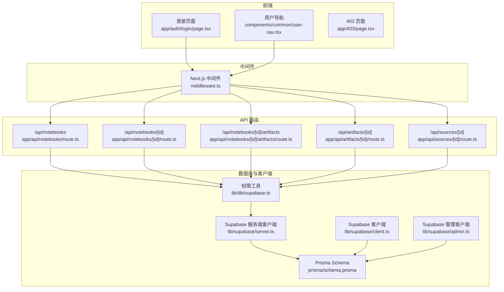
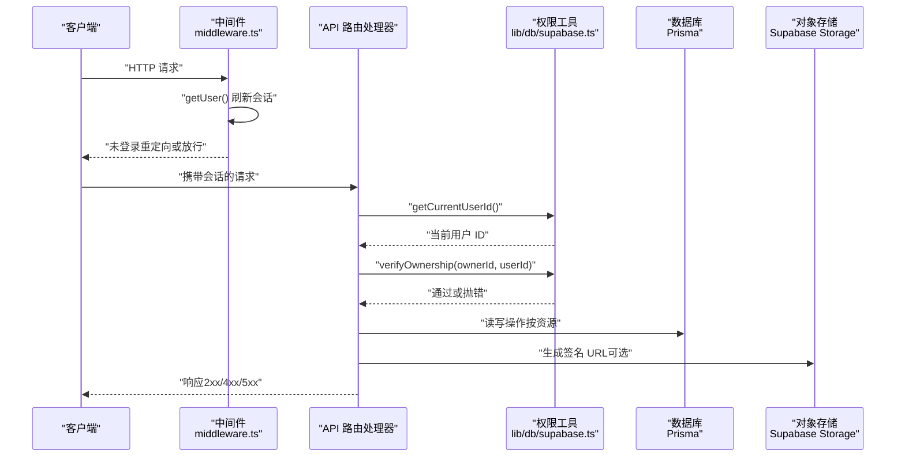
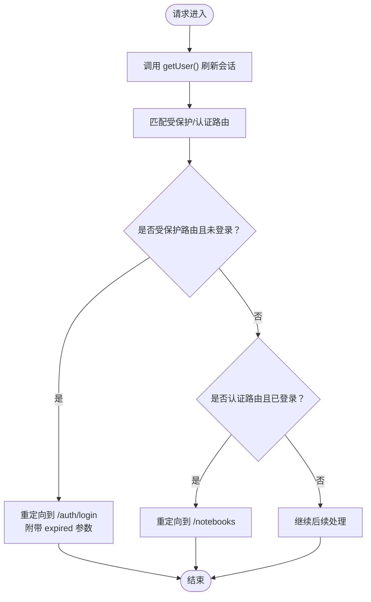
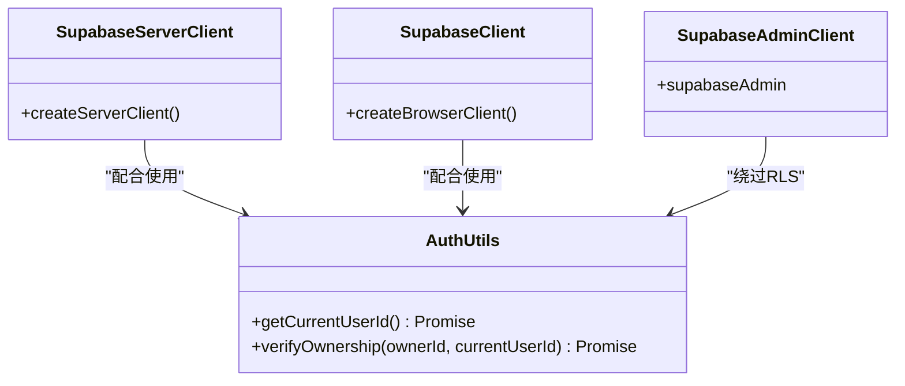
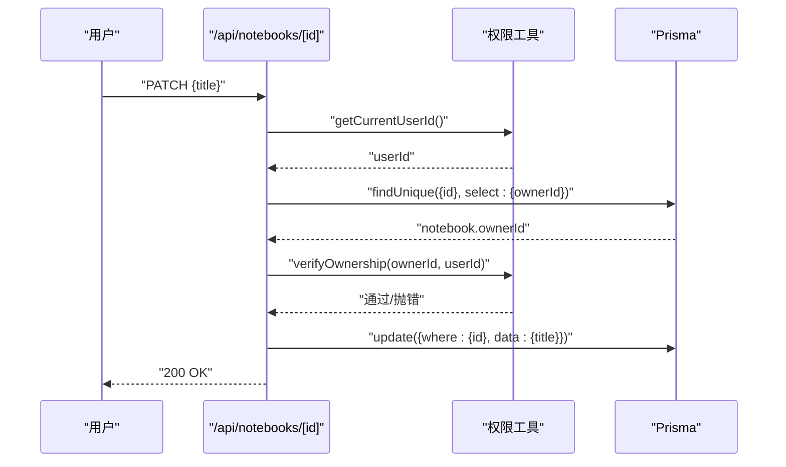
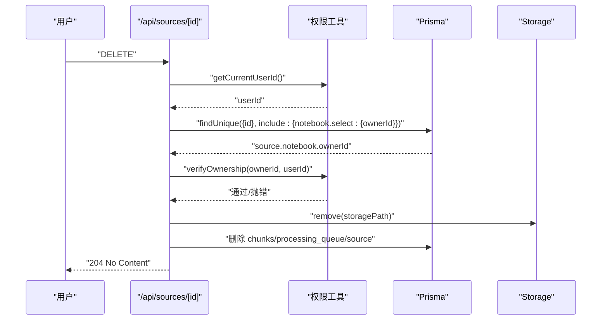
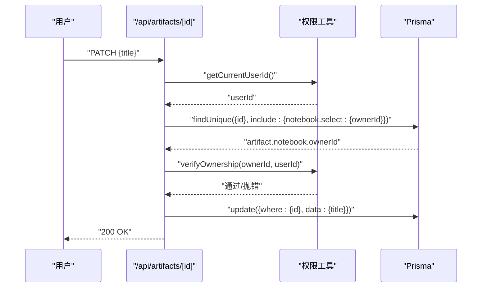
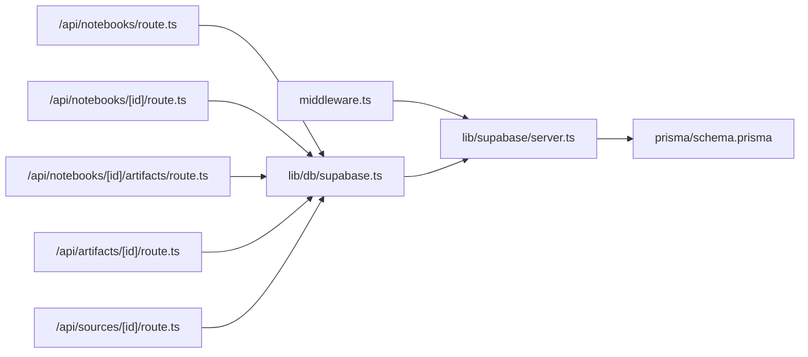

# 访问控制

<cite>
**本文引用的文件**
- [lib/supabase/client.ts](file://lib/supabase/client.ts)
- [lib/supabase/server.ts](file://lib/supabase/server.ts)
- [lib/supabase/admin.ts](file://lib/supabase/admin.ts)
- [lib/db/supabase.ts](file://lib/db/supabase.ts)
- [middleware.ts](file://middleware.ts)
- [app/api/notebooks/route.ts](file://app/api/notebooks/route.ts)
- [app/api/notebooks/[id]/route.ts](file://app/api/notebooks/[id]/route.ts)
- [app/api/notebooks/[id]/artifacts/route.ts](file://app/api/notebooks/[id]/artifacts/route.ts)
- [app/api/artifacts/[id]/route.ts](file://app/api/artifacts/[id]/route.ts)
- [app/api/sources/[id]/route.ts](file://app/api/sources/[id]/route.ts)
- [prisma/schema.prisma](file://prisma/schema.prisma)
- [lib/utils/logger.ts](file://lib/utils/logger.ts)
- [app/403/page.tsx](file://app/403/page.tsx)
- [components/common/user-nav.tsx](file://components/common/user-nav.tsx)
- [app/auth/login/page.tsx](file://app/auth/login/page.tsx)
</cite>

## 目录
1. [简介](#简介)
2. [项目结构](#项目结构)
3. [核心组件](#核心组件)
4. [架构总览](#架构总览)
5. [详细组件分析](#详细组件分析)
6. [依赖关系分析](#依赖关系分析)
7. [性能考虑](#性能考虑)
8. [故障排查指南](#故障排查指南)
9. [结论](#结论)
10. [附录](#附录)

## 简介
本文件系统性梳理本项目的访问控制系统，重点覆盖以下方面：
- 基于角色的访问控制（RBAC）现状与扩展建议
- 资源级权限控制：笔记本、知识源、生成产物
- 操作权限与细粒度控制：CRUD 权限验证流程
- Supabase Row Level Security（RLS）策略现状与建议
- 管理员权限与超级用户能力
- 权限继承与组合：用户组、角色层级与权限叠加
- 审计日志：用户行为、权限变更与异常访问
- 权限缓存与性能优化：预加载与失效策略
- 测试与安全评估：方法与工具

## 项目结构
项目采用 Next.js App Router 结构，访问控制主要分布在以下层次：
- 路由中间件：统一进行会话校验与受保护路由拦截
- API 路由处理器：对每个资源执行所有权验证
- Supabase 客户端封装：区分浏览器端、服务端与管理端客户端
- 数据模型：Prisma 定义的资源关系与索引
- 前端组件：登录、导航与 403 页面

图表来源
- [middleware.ts](file://middleware.ts#L1-L78)
- [app/api/notebooks/route.ts](file://app/api/notebooks/route.ts#L1-L67)
- [app/api/notebooks/[id]/route.ts](file://app/api/notebooks/[id]/route.ts#L1-L138)
- [app/api/notebooks/[id]/artifacts/route.ts](file://app/api/notebooks/[id]/artifacts/route.ts#L1-L77)
- [app/api/artifacts/[id]/route.ts](file://app/api/artifacts/[id]/route.ts#L1-L141)
- [app/api/sources/[id]/route.ts](file://app/api/sources/[id]/route.ts#L1-L120)
- [lib/db/supabase.ts](file://lib/db/supabase.ts#L1-L39)
- [lib/supabase/server.ts](file://lib/supabase/server.ts#L1-L33)
- [lib/supabase/client.ts](file://lib/supabase/client.ts#L1-L14)
- [lib/supabase/admin.ts](file://lib/supabase/admin.ts#L1-L19)
- [prisma/schema.prisma](file://prisma/schema.prisma#L1-L140)

章节来源
- [middleware.ts](file://middleware.ts#L1-L78)
- [lib/db/supabase.ts](file://lib/db/supabase.ts#L1-L39)
- [lib/supabase/server.ts](file://lib/supabase/server.ts#L1-L33)
- [lib/supabase/client.ts](file://lib/supabase/client.ts#L1-L14)
- [lib/supabase/admin.ts](file://lib/supabase/admin.ts#L1-L19)
- [prisma/schema.prisma](file://prisma/schema.prisma#L1-L140)

## 核心组件
- Supabase 客户端族
  - 浏览器端客户端：用于客户端组件与浏览器逻辑
  - 服务端客户端：用于服务端组件、Server Actions、路由处理器，自动管理 Cookie
  - 管理客户端：使用 Secret Key 绕过 RLS，仅用于服务端管理操作
- 权限工具
  - 当前用户 ID 获取：服务端获取当前用户 ID，作为资源所有权校验的基础
  - 资源归属验证：统一的 verifyOwnership 函数，抛出错误以触发 403
- 中间件
  - 受保护路由与认证路由匹配
  - 会话刷新与未登录重定向
- API 路由
  - 每个资源的 CRUD 操作均执行用户身份校验与所有权验证
  - 对存储资源（如知识源文件）提供带时效的签名 URL

章节来源
- [lib/supabase/client.ts](file://lib/supabase/client.ts#L1-L14)
- [lib/supabase/server.ts](file://lib/supabase/server.ts#L1-L33)
- [lib/supabase/admin.ts](file://lib/supabase/admin.ts#L1-L19)
- [lib/db/supabase.ts](file://lib/db/supabase.ts#L1-L39)
- [middleware.ts](file://middleware.ts#L1-L78)
- [app/api/notebooks/route.ts](file://app/api/notebooks/route.ts#L1-L67)
- [app/api/notebooks/[id]/route.ts](file://app/api/notebooks/[id]/route.ts#L1-L138)
- [app/api/notebooks/[id]/artifacts/route.ts](file://app/api/notebooks/[id]/artifacts/route.ts#L1-L77)
- [app/api/artifacts/[id]/route.ts](file://app/api/artifacts/[id]/route.ts#L1-L141)
- [app/api/sources/[id]/route.ts](file://app/api/sources/[id]/route.ts#L1-L120)

## 架构总览
下图展示从请求进入至资源访问的总体流程，强调“身份校验 → 资源归属验证 → 数据库/存储操作”的关键步骤。

图表来源
- [middleware.ts](file://middleware.ts#L15-L71)
- [lib/db/supabase.ts](file://lib/db/supabase.ts#L12-L33)
- [app/api/sources/[id]/route.ts](file://app/api/sources/[id]/route.ts#L17-L62)
- [app/api/notebooks/[id]/route.ts](file://app/api/notebooks/[id]/route.ts#L17-L61)

## 详细组件分析

### 中间件与会话管理
- 受保护路由：/notebooks 开头的路径需登录
- 认证路由：/auth/login 对已登录用户重定向
- 会话刷新：每次请求调用 getUser()，并处理过期场景
- Cookie 管理：服务端客户端通过 cookies 接口同步状态

图表来源
- [middleware.ts](file://middleware.ts#L15-L71)

章节来源
- [middleware.ts](file://middleware.ts#L1-L78)

### Supabase 客户端与权限工具
- 客户端差异
  - 浏览器端：用于客户端组件
  - 服务端：自动读写 Cookie，适合 SSR/SSG/路由处理器
  - 管理端：Secret Key，绕过 RLS，仅用于服务端管理任务
- 权限工具
  - getCurrentUserId：获取当前用户 ID，作为资源所有权校验依据
  - verifyOwnership：比较 ownerId 与当前用户 ID，不一致则抛错（触发 403）

图表来源
- [lib/supabase/client.ts](file://lib/supabase/client.ts#L8-L13)
- [lib/supabase/server.ts](file://lib/supabase/server.ts#L9-L31)
- [lib/supabase/admin.ts](file://lib/supabase/admin.ts#L9-L18)
- [lib/db/supabase.ts](file://lib/db/supabase.ts#L12-L33)

章节来源
- [lib/supabase/client.ts](file://lib/supabase/client.ts#L1-L14)
- [lib/supabase/server.ts](file://lib/supabase/server.ts#L1-L33)
- [lib/supabase/admin.ts](file://lib/supabase/admin.ts#L1-L19)
- [lib/db/supabase.ts](file://lib/db/supabase.ts#L1-L39)

### 资源级权限控制：笔记本
- 创建：POST /api/notebooks 将 ownerId 设为当前用户 ID
- 列表：GET /api/notebooks 仅返回当前用户的笔记本
- 详情/更新/删除：GET/PATCH/DELETE /api/notebooks/[id] 均先 verifyOwnership

图表来源
- [app/api/notebooks/[id]/route.ts](file://app/api/notebooks/[id]/route.ts#L64-L102)
- [lib/db/supabase.ts](file://lib/db/supabase.ts#L22-L33)

章节来源
- [app/api/notebooks/route.ts](file://app/api/notebooks/route.ts#L1-L67)
- [app/api/notebooks/[id]/route.ts](file://app/api/notebooks/[id]/route.ts#L1-L138)
- [lib/db/supabase.ts](file://lib/db/supabase.ts#L1-L39)

### 资源级权限控制：知识源
- 详情：GET /api/sources/[id] 验证 notebook.ownerId 与当前用户 ID
- 删除：DELETE /api/sources/[id] 同样执行所有权验证，并清理存储与相关记录

图表来源
- [app/api/sources/[id]/route.ts](file://app/api/sources/[id]/route.ts#L65-L119)

章节来源
- [app/api/sources/[id]/route.ts](file://app/api/sources/[id]/route.ts#L1-L120)

### 资源级权限控制：生成产物
- 列表：GET /api/notebooks/[id]/artifacts 在查询前先验证 notebook.ownerId
- 更新/删除：PATCH/DELETE /api/artifacts/[id] 先获取 artifact 并验证其 notebook.ownerId

图表来源
- [app/api/artifacts/[id]/route.ts](file://app/api/artifacts/[id]/route.ts#L11-L83)

章节来源
- [app/api/notebooks/[id]/artifacts/route.ts](file://app/api/notebooks/[id]/artifacts/route.ts#L1-L77)
- [app/api/artifacts/[id]/route.ts](file://app/api/artifacts/[id]/route.ts#L1-L141)

### 操作权限与细粒度控制
- 当前实现：所有资源操作均基于“资源拥有者”这一单一维度进行授权
- 建议扩展：
  - 引入角色与权限矩阵：如 owner、editor、viewer
  - 引入资源级权限：针对不同操作（读/写/删）授予不同角色
  - 引入用户组与继承：组内角色叠加，支持层级继承

章节来源
- [app/api/notebooks/[id]/route.ts](file://app/api/notebooks/[id]/route.ts#L45-L81)
- [app/api/artifacts/[id]/route.ts](file://app/api/artifacts/[id]/route.ts#L54-L60)
- [app/api/sources/[id]/route.ts](file://app/api/sources/[id]/route.ts#L40-L42)

### Supabase Row Level Security（RLS）
- 现状：项目中未发现显式的 RLS 策略定义文件；数据库访问通过服务端客户端与权限工具实现
- 建议：
  - 为每张表定义 RLS 策略，例如：
    - notebooks：RLS 策略允许用户仅查询/修改自己的记录
    - sources：RLS 策略基于 notebook.ownerId
    - artifacts：RLS 策略基于 notebook.ownerId
  - 策略应与应用层 verifyOwnership 保持一致，确保双重防护
  - 管理端操作使用 supabaseAdmin 绕过 RLS，仅限服务端

章节来源
- [lib/db/supabase.ts](file://lib/db/supabase.ts#L22-L33)
- [lib/supabase/admin.ts](file://lib/supabase/admin.ts#L9-L18)

### 管理员权限与超级用户
- 管理客户端：supabaseAdmin 使用 Secret Key，绕过 RLS，适合系统管理任务
- 建议：
  - 为管理员角色建立独立的用户组或元数据标识
  - 管理员操作记录审计日志，严格限制使用范围与时机

章节来源
- [lib/supabase/admin.ts](file://lib/supabase/admin.ts#L1-L19)

### 权限继承与组合
- 当前实现：无用户组与角色层级，权限以“资源拥有者”为准
- 建议：
  - 用户组：支持将用户加入多个组，组内角色叠加
  - 角色层级：支持父角色继承子角色权限
  - 权限叠加：用户直接权限 + 组内角色权限 + 角色层级继承权限

章节来源
- [prisma/schema.prisma](file://prisma/schema.prisma#L16-L97)

### 审计日志
- 日志工具：提供 info/warn/error/debug 输出，开发环境默认开启
- 建议：
  - 记录用户 ID、资源 ID、操作类型、时间戳、结果
  - 记录权限变更与异常访问尝试（401/403）
  - 生产环境可接入集中式日志系统

章节来源
- [lib/utils/logger.ts](file://lib/utils/logger.ts#L1-L98)

### 权限缓存与性能优化
- 当前实现：未发现权限缓存机制
- 建议：
  - 缓存策略：用户角色与权限映射短期缓存（如 5 分钟）
  - 预加载：在中间件或路由处理器中预取用户权限
  - 失效机制：用户组/角色变更时主动失效缓存
  - CDN/边缘缓存：对只读资源的公共信息进行边缘缓存

章节来源
- [middleware.ts](file://middleware.ts#L15-L71)

### 测试与安全评估
- 单元测试：为 verifyOwnership 与各 API 路由编写单元测试
- 集成测试：模拟未登录、非拥有者访问、管理员绕过 RLS 等场景
- 安全扫描：定期扫描 Supabase 密钥与 RLS 配置
- 渗透测试：模拟越权访问、暴力破解、CSRF 等攻击

章节来源
- [app/403/page.tsx](file://app/403/page.tsx#L1-L34)
- [components/common/user-nav.tsx](file://components/common/user-nav.tsx#L1-L82)
- [app/auth/login/page.tsx](file://app/auth/login/page.tsx#L1-L230)

## 依赖关系分析
- API 路由依赖权限工具与数据库层
- 权限工具依赖 Supabase 服务端客户端
- 中间件依赖 Supabase 服务端客户端进行会话刷新
- 数据模型定义资源关系与索引，支撑权限判断

图表来源
- [middleware.ts](file://middleware.ts#L22-L38)
- [lib/db/supabase.ts](file://lib/db/supabase.ts#L6-L16)
- [app/api/notebooks/route.ts](file://app/api/notebooks/route.ts#L9)
- [app/api/notebooks/[id]/route.ts](file://app/api/notebooks/[id]/route.ts#L10)
- [app/api/notebooks/[id]/artifacts/route.ts](file://app/api/notebooks/[id]/artifacts/route.ts#L9)
- [app/api/artifacts/[id]/route.ts](file://app/api/artifacts/[id]/route.ts#L9)
- [app/api/sources/[id]/route.ts](file://app/api/sources/[id]/route.ts#L10)
- [prisma/schema.prisma](file://prisma/schema.prisma#L16-L97)

章节来源
- [middleware.ts](file://middleware.ts#L1-L78)
- [lib/db/supabase.ts](file://lib/db/supabase.ts#L1-L39)
- [lib/supabase/server.ts](file://lib/supabase/server.ts#L1-L33)
- [prisma/schema.prisma](file://prisma/schema.prisma#L1-L140)

## 性能考虑
- 会话刷新成本：中间件每次请求调用 getUser()，建议结合缓存与边缘缓存
- 查询过滤：Prisma 查询已按 ownerId 过滤，避免跨用户数据泄露
- 存储签名 URL：按需生成，避免频繁创建签名
- 日志输出：生产环境关闭 debug，减少 I/O

## 故障排查指南
- 401 未登录：检查中间件是否正确刷新会话，确认 Cookie 设置
- 403 无权访问：检查 verifyOwnership 是否被调用，notebook.ownerId 是否正确
- 404 资源不存在：确认资源 ID 与关联关系
- 管理端异常：确认使用 supabaseAdmin，且 Secret Key 配置正确

章节来源
- [middleware.ts](file://middleware.ts#L40-L68)
- [app/403/page.tsx](file://app/403/page.tsx#L1-L34)
- [lib/db/supabase.ts](file://lib/db/supabase.ts#L22-L33)

## 结论
本项目已实现以“资源拥有者”为核心的访问控制，通过中间件与权限工具形成统一的授权链路。为进一步提升安全性与可维护性，建议引入角色与权限矩阵、完善 RLS 策略、建立审计日志与权限缓存机制，并持续开展测试与安全评估。

## 附录
- 数据模型概览（与权限相关的关键字段）
  - Notebook.ownerId：资源拥有者标识
  - Source.notebookId：关联笔记本
  - Artifact.notebookId：关联笔记本
  - PromptTemplate.ownerId/notebookId：模板拥有者与作用域

章节来源
- [prisma/schema.prisma](file://prisma/schema.prisma#L16-L97)