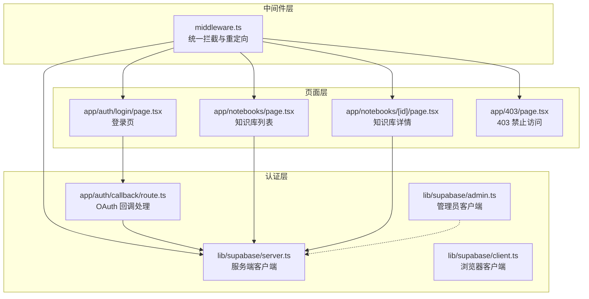
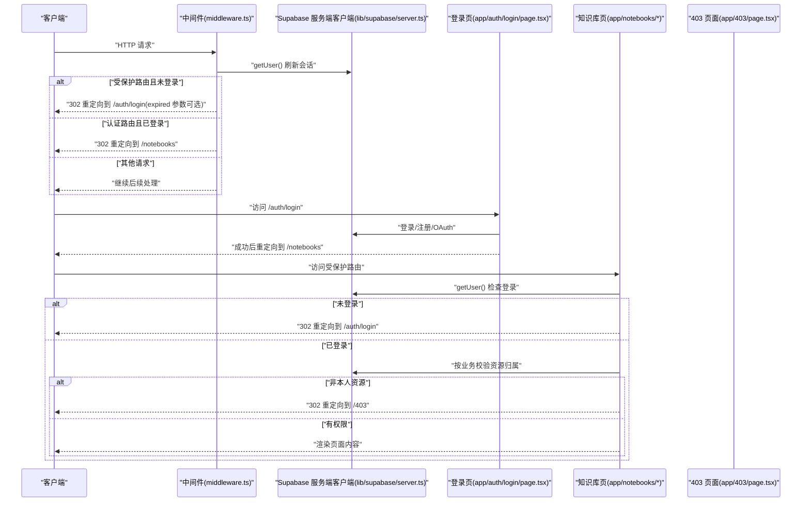
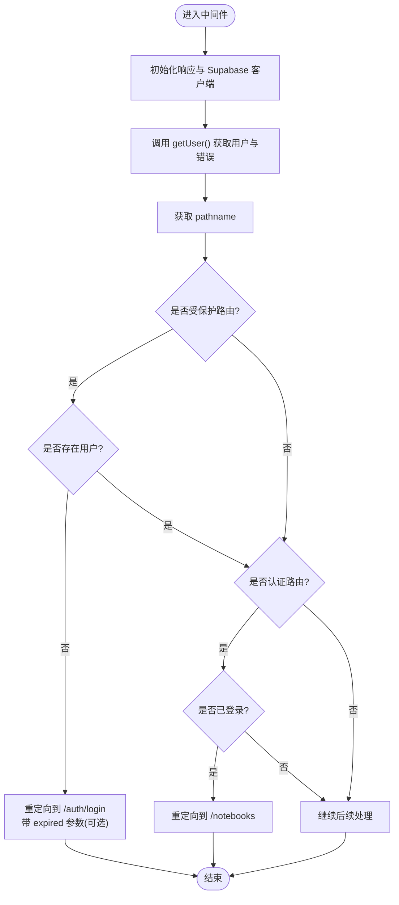
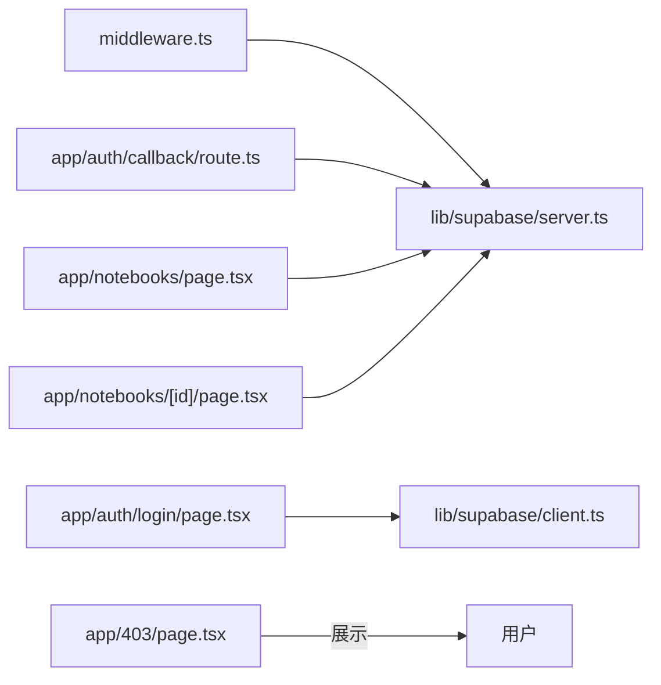

# 路由保护机制

<cite>
**本文引用的文件**
- [middleware.ts](file://middleware.ts)
- [app/403/page.tsx](file://app/403/page.tsx)
- [app/auth/login/page.tsx](file://app/auth/login/page.tsx)
- [app/auth/callback/route.ts](file://app/auth/callback/route.ts)
- [app/notebooks/page.tsx](file://app/notebooks/page.tsx)
- [app/notebooks/[id]/page.tsx](file://app/notebooks/[id]/page.tsx)
- [lib/supabase/server.ts](file://lib/supabase/server.ts)
- [lib/supabase/client.ts](file://lib/supabase/client.ts)
- [lib/supabase/admin.ts](file://lib/supabase/admin.ts)
</cite>

## 目录
1. [简介](#简介)
2. [项目结构](#项目结构)
3. [核心组件](#核心组件)
4. [架构总览](#架构总览)
5. [详细组件分析](#详细组件分析)
6. [依赖关系分析](#依赖关系分析)
7. [性能考虑](#性能考虑)
8. [故障排查指南](#故障排查指南)
9. [结论](#结论)
10. [附录](#附录)

## 简介
本文件系统性阐述本项目的路由保护机制，重点覆盖以下方面：
- Next.js 中间件的工作原理与实现方式（路由匹配、条件判断、重定向逻辑）
- 受保护路由的定义与管理（如 /notebooks 等需登录访问的页面）
- 已登录用户不应访问的路由保护（如 /auth/login 的访问控制）
- 中间件执行顺序与优先级（请求拦截、用户验证、响应处理）
- 认证状态检查的实现细节（getUser() 调用、错误处理、状态判断）
- 403 禁止访问页面的实现与自定义配置
- 中间件性能优化策略（缓存机制、请求过滤）
- 中间件配置选项（matcher 规则、排除路径）
- 路由保护的测试方法与调试技巧

## 项目结构
本项目采用 Next.js App Router 结构，路由保护主要通过中间件与页面级保护协同实现：
- 中间件层：统一拦截请求，进行基础的登录态校验与重定向
- 页面层：针对具体业务场景进行细粒度权限校验（如资源归属校验）
- 认证层：基于 Supabase 的服务端与浏览器客户端封装

图表来源
- [middleware.ts](file://middleware.ts#L1-L78)
- [lib/supabase/server.ts](file://lib/supabase/server.ts#L1-L33)
- [lib/supabase/client.ts](file://lib/supabase/client.ts#L1-L14)
- [lib/supabase/admin.ts](file://lib/supabase/admin.ts#L1-L19)
- [app/auth/callback/route.ts](file://app/auth/callback/route.ts#L1-L26)
- [app/auth/login/page.tsx](file://app/auth/login/page.tsx#L1-L230)
- [app/notebooks/page.tsx](file://app/notebooks/page.tsx#L1-L65)
- [app/notebooks/[id]/page.tsx](file://app/notebooks/[id]/page.tsx#L1-L128)
- [app/403/page.tsx](file://app/403/page.tsx#L1-L34)

章节来源
- [middleware.ts](file://middleware.ts#L1-L78)
- [lib/supabase/server.ts](file://lib/supabase/server.ts#L1-L33)
- [lib/supabase/client.ts](file://lib/supabase/client.ts#L1-L14)
- [lib/supabase/admin.ts](file://lib/supabase/admin.ts#L1-L19)
- [app/auth/callback/route.ts](file://app/auth/callback/route.ts#L1-L26)
- [app/auth/login/page.tsx](file://app/auth/login/page.tsx#L1-L230)
- [app/notebooks/page.tsx](file://app/notebooks/page.tsx#L1-L65)
- [app/notebooks/[id]/page.tsx](file://app/notebooks/[id]/page.tsx#L1-L128)
- [app/403/page.tsx](file://app/403/page.tsx#L1-L34)

## 核心组件
- 中间件（middleware.ts）：负责全局路由保护，拦截请求，基于路径前缀判断是否需要登录，并在必要时重定向至登录页或知识库页；同时处理会话过期提示参数。
- 登录页（app/auth/login/page.tsx）：提供用户名密码登录与注册、OAuth 登录入口，支持会话过期提示展示。
- OAuth 回调（app/auth/callback/route.ts）：接收 Supabase OAuth 回调，交换授权码为会话并重定向。
- 知识库页面（app/notebooks/page.tsx）：页面级保护，若未登录则重定向至登录页。
- 知识库详情（app/notebooks/[id]/page.tsx）：页面级保护，除登录外还校验资源归属（ownerId），非本人资源重定向至 403。
- 403 页面（app/403/page.tsx）：无权访问的友好提示页面。
- Supabase 客户端封装：
  - 服务端客户端（lib/supabase/server.ts）：在服务端组件/服务器动作中使用，自动同步 Cookie。
  - 浏览器客户端（lib/supabase/client.ts）：在客户端组件中使用。
  - 管理员客户端（lib/supabase/admin.ts）：使用 Secret Key，绕过 RLS，仅用于服务端管理操作。

章节来源
- [middleware.ts](file://middleware.ts#L1-L78)
- [app/auth/login/page.tsx](file://app/auth/login/page.tsx#L1-L230)
- [app/auth/callback/route.ts](file://app/auth/callback/route.ts#L1-L26)
- [app/notebooks/page.tsx](file://app/notebooks/page.tsx#L1-L65)
- [app/notebooks/[id]/page.tsx](file://app/notebooks/[id]/page.tsx#L1-L128)
- [app/403/page.tsx](file://app/403/page.tsx#L1-L34)
- [lib/supabase/server.ts](file://lib/supabase/server.ts#L1-L33)
- [lib/supabase/client.ts](file://lib/supabase/client.ts#L1-L14)
- [lib/supabase/admin.ts](file://lib/supabase/admin.ts#L1-L19)

## 架构总览
下图展示了从请求进入系统到最终响应的关键交互流程，涵盖中间件拦截、认证检查、权限校验与重定向。

图表来源
- [middleware.ts](file://middleware.ts#L15-L71)
- [lib/supabase/server.ts](file://lib/supabase/server.ts#L9-L32)
- [app/auth/login/page.tsx](file://app/auth/login/page.tsx#L17-L84)
- [app/notebooks/page.tsx](file://app/notebooks/page.tsx#L14-L20)
- [app/notebooks/[id]/page.tsx](file://app/notebooks/[id]/page.tsx#L18-L52)
- [app/403/page.tsx](file://app/403/page.tsx#L10-L33)

## 详细组件分析

### 中间件（middleware.ts）
- 路由匹配与保护范围
  - 受保护路由：以 /notebooks 开头的路径均需登录访问。
  - 已登录用户不应访问的路由：/auth/login 对已登录用户重定向至 /notebooks。
- 执行流程
  - 初始化响应对象，保留请求头信息。
  - 基于 Supabase SSR 客户端读取/写入 Cookie，刷新会话。
  - 调用 getUser() 获取当前用户状态与错误信息。
  - 基于 pathname 前缀判断是否受保护或认证路由。
  - 若访问受保护路由且未登录，则重定向到 /auth/login，并在会话过期时附加 expired 参数。
  - 若已登录用户访问 /auth/login，则重定向到 /notebooks。
  - 其他情况放行。
- 配置项
  - matcher：排除静态资源、图片、favicon 等，仅对动态请求生效，减少中间件开销。

图表来源
- [middleware.ts](file://middleware.ts#L15-L71)

章节来源
- [middleware.ts](file://middleware.ts#L1-L78)

### 登录页（app/auth/login/page.tsx）
- 功能要点
  - 支持登录/注册两种模式切换。
  - 提供用户名密码登录与注册，注册时校验密码长度。
  - 支持 Google/GitHub OAuth 登录，回调地址指向 /auth/callback。
  - 接收并展示会话过期提示参数（来自中间件重定向）。
  - 登录成功后跳转至 /notebooks 并刷新页面。
- 与中间件的协作
  - 中间件在会话过期时会在重定向链接上附加 expired 参数，登录页通过查询参数显示相应提示。

章节来源
- [app/auth/login/page.tsx](file://app/auth/login/page.tsx#L17-L84)
- [app/auth/login/page.tsx](file://app/auth/login/page.tsx#L28-L33)

### OAuth 回调（app/auth/callback/route.ts）
- 功能要点
  - 从回调 URL 中提取授权码，调用 exchangeCodeForSession 将其转换为会话。
  - 成功后根据 next 参数重定向至目标页面（默认 /notebooks）。
  - 失败时重定向回 /auth/login 并携带错误参数。
- 与 Supabase 的集成
  - 使用服务端客户端创建实例，确保 Cookie 同步与会话持久化。

章节来源
- [app/auth/callback/route.ts](file://app/auth/callback/route.ts#L9-L25)
- [lib/supabase/server.ts](file://lib/supabase/server.ts#L9-L32)

### 知识库列表页（app/notebooks/page.tsx）
- 页面级保护
  - 在服务端调用 getUser() 检查登录状态，未登录则重定向至 /auth/login。
  - 已登录则加载当前用户的所有知识库列表并渲染。
- 与中间件的关系
  - 中间件负责全局拦截与基础重定向；页面级保护作为第二道防线，确保数据安全。

章节来源
- [app/notebooks/page.tsx](file://app/notebooks/page.tsx#L14-L20)

### 知识库详情页（app/notebooks/[id]/page.tsx）
- 页面级保护与权限校验
  - 服务端检查登录状态，未登录重定向至 /auth/login。
  - 查询目标知识库，不存在则 notFound()。
  - 校验知识库的 owner 与当前用户是否一致，不一致则重定向至 /403。
  - 更新最近打开时间等业务逻辑。
- 403 场景
  - 当用户尝试访问他人知识库时触发重定向至 /403。

章节来源
- [app/notebooks/[id]/page.tsx](file://app/notebooks/[id]/page.tsx#L18-L52)
- [app/403/page.tsx](file://app/403/page.tsx#L10-L33)

### 403 禁止访问页面（app/403/page.tsx）
- 设计目的
  - 为无权访问资源的用户提供清晰的错误提示与便捷的导航按钮。
- 内容组成
  - 展示 403 错误标题与说明文案。
  - 提供返回首页与前往知识库的快捷链接。

章节来源
- [app/403/page.tsx](file://app/403/page.tsx#L10-L33)

### Supabase 客户端封装
- 服务端客户端（lib/supabase/server.ts）
  - 在服务端组件/服务器动作中使用，自动同步 Cookie，避免在某些上下文中设置 Cookie 导致异常。
- 浏览器客户端（lib/supabase/client.ts）
  - 在客户端组件中使用，简化浏览器端认证调用。
- 管理员客户端（lib/supabase/admin.ts）
  - 使用 Secret Key，绕过 RLS，仅用于服务端管理操作，注意权限风险。

章节来源
- [lib/supabase/server.ts](file://lib/supabase/server.ts#L9-L32)
- [lib/supabase/client.ts](file://lib/supabase/client.ts#L8-L13)
- [lib/supabase/admin.ts](file://lib/supabase/admin.ts#L9-L18)

## 依赖关系分析
- 中间件依赖 Supabase SSR 客户端进行会话刷新与用户状态获取。
- 登录页依赖 Supabase 浏览器客户端进行登录/注册/OAuth。
- OAuth 回调依赖服务端客户端进行授权码交换与会话建立。
- 页面级保护依赖服务端客户端进行用户状态与资源归属校验。
- 403 页面作为受保护路由访问失败时的兜底展示。

图表来源
- [middleware.ts](file://middleware.ts#L6-L38)
- [lib/supabase/server.ts](file://lib/supabase/server.ts#L9-L32)
- [lib/supabase/client.ts](file://lib/supabase/client.ts#L8-L13)
- [app/auth/login/page.tsx](file://app/auth/login/page.tsx#L8-L26)
- [app/auth/callback/route.ts](file://app/auth/callback/route.ts#L6-L16)
- [app/notebooks/page.tsx](file://app/notebooks/page.tsx#L7-L16)
- [app/notebooks/[id]/page.tsx](file://app/notebooks/[id]/page.tsx#L7-L21)
- [app/403/page.tsx](file://app/403/page.tsx#L10-L33)

章节来源
- [middleware.ts](file://middleware.ts#L1-L78)
- [lib/supabase/server.ts](file://lib/supabase/server.ts#L1-L33)
- [lib/supabase/client.ts](file://lib/supabase/client.ts#L1-L14)
- [lib/supabase/admin.ts](file://lib/supabase/admin.ts#L1-L19)
- [app/auth/login/page.tsx](file://app/auth/login/page.tsx#L1-L230)
- [app/auth/callback/route.ts](file://app/auth/callback/route.ts#L1-L26)
- [app/notebooks/page.tsx](file://app/notebooks/page.tsx#L1-L65)
- [app/notebooks/[id]/page.tsx](file://app/notebooks/[id]/page.tsx#L1-L128)
- [app/403/page.tsx](file://app/403/page.tsx#L1-L34)

## 性能考虑
- 中间件过滤策略
  - matcher 排除了静态资源、图片与 favicon，仅对动态请求执行中间件逻辑，降低不必要的开销。
- 会话刷新成本
  - 中间件每次都会调用 getUser() 刷新会话，建议结合业务实际评估频率，必要时可在上游增加缓存或节流策略。
- Cookie 同步
  - 中间件通过自定义 cookies getAll/setAll 实现请求与响应的 Cookie 同步，避免重复网络往返。
- 页面级保护
  - 页面层也进行 getUser() 调用，形成双重保障；对于高并发场景，可在页面层引入更精细的缓存与权限缓存策略。

章节来源
- [middleware.ts](file://middleware.ts#L73-L77)
- [middleware.ts](file://middleware.ts#L22-L38)
- [app/notebooks/page.tsx](file://app/notebooks/page.tsx#L15-L16)
- [app/notebooks/[id]/page.tsx](file://app/notebooks/[id]/page.tsx#L20-L21)

## 故障排查指南
- 会话过期导致的循环重定向
  - 现象：访问受保护路由被重定向到 /auth/login，并带有 expired=true。
  - 处理：登录页会显示过期提示；登录成功后应能正常访问。
  - 关联代码：中间件在检测到过期错误时附加 expired 参数；登录页读取该参数并展示提示。
- 已登录用户仍被重定向到登录页
  - 检查点：
    - 中间件是否正确排除了 /auth/login。
    - matcher 是否正确过滤了静态资源。
    - Supabase 服务端客户端的 Cookie 同步是否正常。
- 访问他人知识库被重定向到 403
  - 检查点：
    - 页面级保护是否正确校验 owner 与当前用户一致。
    - 数据库中知识库的 owner 字段是否正确。
- OAuth 登录失败
  - 检查点：
    - 回调 URL 中的 code 是否有效。
    - 回调处理器是否成功交换为会话。
    - 回调重定向的目标路径是否正确。

章节来源
- [middleware.ts](file://middleware.ts#L55-L68)
- [app/auth/login/page.tsx](file://app/auth/login/page.tsx#L28-L33)
- [app/notebooks/[id]/page.tsx](file://app/notebooks/[id]/page.tsx#L49-L52)
- [app/auth/callback/route.ts](file://app/auth/callback/route.ts#L14-L21)

## 结论
本项目通过“中间件 + 页面级保护”的双层防护体系实现了完善的路由保护：
- 中间件负责全局拦截与基础重定向，确保受保护路由不会被未登录用户访问。
- 页面级保护进一步细化权限校验，特别是资源归属校验，防止越权访问。
- 403 页面提供了友好的错误提示与导航。
- Supabase 客户端封装保证了在不同运行环境下的认证一致性与 Cookie 同步。

## 附录

### 中间件配置选项详解
- matcher
  - 作用：定义中间件生效的请求路径规则，排除静态资源与媒体文件，仅对动态请求执行。
  - 影响：减少中间件执行次数，提升性能。
- 受保护路由与认证路由
  - 受保护路由：以 /notebooks 开头的路径。
  - 认证路由：/auth/login。
- 重定向行为
  - 未登录访问受保护路由：重定向至 /auth/login，若检测到会话过期则附加 expired 参数。
  - 已登录访问 /auth/login：重定向至 /notebooks。

章节来源
- [middleware.ts](file://middleware.ts#L73-L77)
- [middleware.ts](file://middleware.ts#L9-L13)
- [middleware.ts](file://middleware.ts#L55-L68)

### 测试与调试建议
- 单元测试（概念性指导）
  - 路由匹配：构造不同 pathname，验证 isProtectedRoute/isAuthRoute 的判断结果。
  - 重定向逻辑：模拟 user 存在与否与错误消息，验证重定向目标与参数。
  - Cookie 同步：验证 cookies.getAll()/setAll 的调用顺序与结果。
- 端到端测试（概念性指导）
  - 未登录访问 /notebooks：断言 302 重定向至 /auth/login。
  - 已登录访问 /auth/login：断言 302 重定向至 /notebooks。
  - 访问他人知识库：断言 302 重定向至 /403。
  - OAuth 回调：断言成功后重定向至目标页面，失败时重定向至 /auth/login 并携带错误参数。
- 调试技巧
  - 在中间件中输出 pathname 与 user 状态，定位重定向触发点。
  - 在登录页打印查询参数，确认 expired 参数传递是否正确。
  - 在页面级保护处记录 owner 与当前用户 ID，排查权限校验问题。