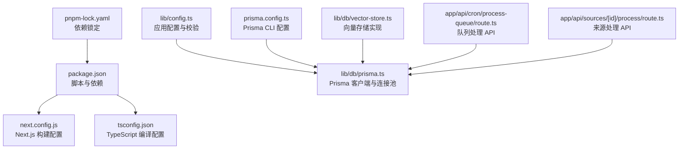
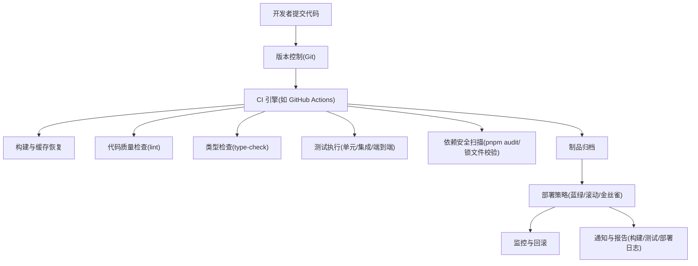
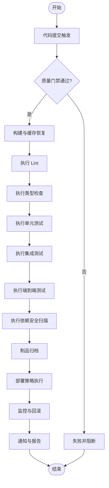
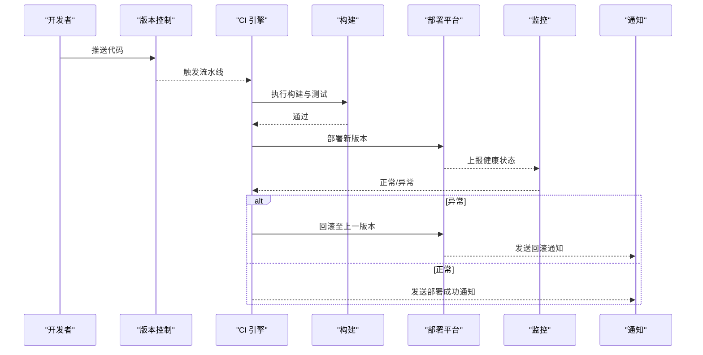
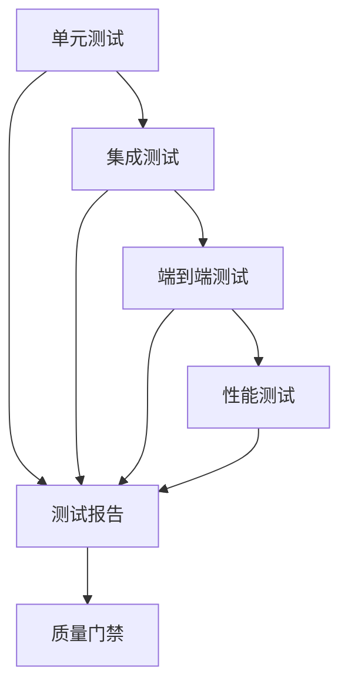
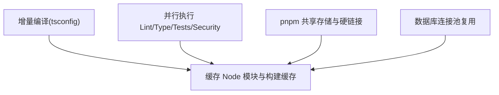
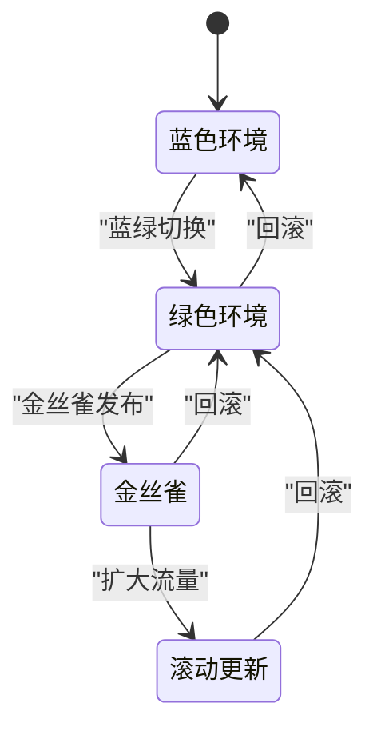
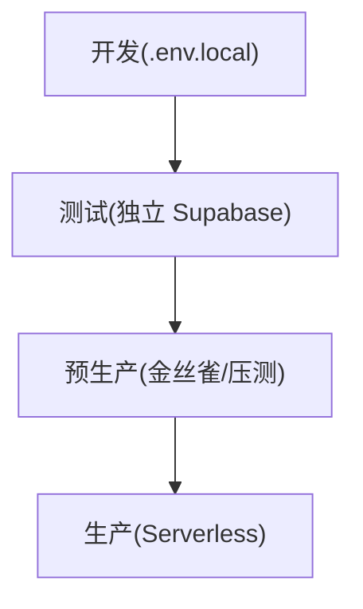
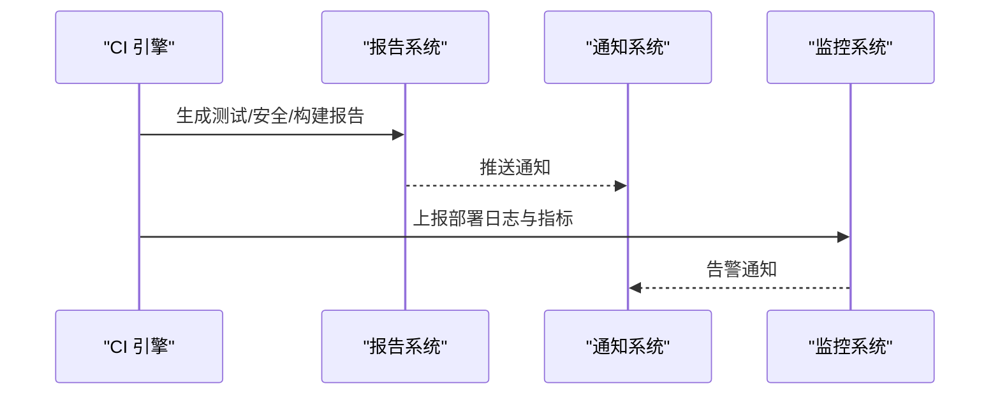
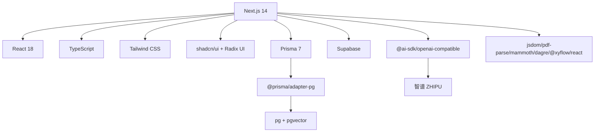

# CI/CD 流水线

<cite>
**本文档引用的文件**
- [package.json](file://package.json)
- [next.config.js](file://next.config.js)
- [tsconfig.json](file://tsconfig.json)
- [README.md](file://README.md)
- [pnpm-lock.yaml](file://pnpm-lock.yaml)
- [prisma.config.ts](file://prisma.config.ts)
- [lib/db/prisma.ts](file://lib/db/prisma.ts)
- [lib/config.ts](file://lib/config.ts)
- [app/api/cron/process-queue/route.ts](file://app/api/cron/process-queue/route.ts)
- [app/api/sources/[id]/process/route.ts](file://app/api/sources/[id]/process/route.ts)
- [lib/db/vector-store.ts](file://lib/db/vector-store.ts)
</cite>

## 目录
1. [简介](#简介)
2. [项目结构](#项目结构)
3. [核心组件](#核心组件)
4. [架构总览](#架构总览)
5. [详细组件分析](#详细组件分析)
6. [依赖关系分析](#依赖关系分析)
7. [性能考虑](#性能考虑)
8. [故障排查指南](#故障排查指南)
9. [结论](#结论)
10. [附录](#附录)

## 简介
本文件面向 notebookLM-clone 项目的 CI/CD 流水线设计与实施，覆盖从代码提交触发、自动化测试、代码质量检查、依赖安全扫描，到持续部署、分支策略、构建优化、部署策略与回滚、环境管理、通知与报告等全生命周期实践。结合项目现有 Next.js 14 + Supabase + Prisma + pgvector 的技术栈与现有脚本配置，给出可落地的流水线方案。

## 项目结构
项目采用 Next.js App Router 结构，核心目录与文件如下：
- 应用层：app/（页面与 API 路由）、components/（UI 组件）、hooks/、lib/（业务逻辑与工具）
- 数据与配置：lib/db/（Prisma 客户端与适配器）、lib/config.ts（应用配置与校验）、prisma.config.ts（Prisma 配置）
- 构建与类型：next.config.js、tsconfig.json、package.json（脚本与依赖）
- 其他：README.md（快速开始与常用命令）、pnpm-lock.yaml（依赖锁）

**图表来源**
- [package.json](file://package.json#L1-L82)
- [next.config.js](file://next.config.js#L1-L21)
- [tsconfig.json](file://tsconfig.json#L1-L28)
- [lib/config.ts](file://lib/config.ts#L1-L186)
- [lib/db/prisma.ts](file://lib/db/prisma.ts#L1-L41)
- [prisma.config.ts](file://prisma.config.ts#L1-L20)
- [lib/db/vector-store.ts](file://lib/db/vector-store.ts#L73-L103)
- [app/api/cron/process-queue/route.ts](file://app/api/cron/process-queue/route.ts#L1-L108)
- [app/api/sources/[id]/process/route.ts](file://app/api/sources/[id]/process/route.ts#L1-L99)
- [pnpm-lock.yaml](file://pnpm-lock.yaml#L1-L800)

**章节来源**
- [package.json](file://package.json#L1-L82)
- [next.config.js](file://next.config.js#L1-L21)
- [tsconfig.json](file://tsconfig.json#L1-L28)
- [README.md](file://README.md#L1-L141)

## 核心组件
- 构建与质量脚本
  - 开发：dev
  - 构建：build
  - 启动：start
  - Lint：lint
  - 类型检查：type-check
  - Prisma：db:generate、db:push、db:migrate、db:studio
- 数据库与连接
  - Prisma 客户端通过 @prisma/adapter-pg 与 pg Pool 连接 Supabase 数据库
  - 支持 Serverless 环境下的连接池参数与限制
- 配置与校验
  - 应用配置集中于 lib/config.ts，包含向量维度校验、环境变量校验等
- API 与处理
  - 队列处理 API（/api/cron/process-queue）与来源处理 API（/api/sources/[id]/process）负责异步处理与重试

**章节来源**
- [package.json](file://package.json#L5-L16)
- [lib/db/prisma.ts](file://lib/db/prisma.ts#L1-L41)
- [lib/config.ts](file://lib/config.ts#L1-L186)
- [app/api/cron/process-queue/route.ts](file://app/api/cron/process-queue/route.ts#L1-L108)
- [app/api/sources/[id]/process/route.ts](file://app/api/sources/[id]/process/route.ts#L1-L99)

## 架构总览
下图展示 CI/CD 流水线在项目中的位置与交互关系，涵盖代码提交触发、质量门禁、构建与测试、安全扫描、部署与回滚等环节。

[此图为概念性架构示意，无需图表来源]

## 详细组件分析

### 持续集成流程设计
- 触发条件
  - 推送至主分支、拉取请求、特定标签等
  - 建议在 PR 中执行质量检查与测试，主分支合并前执行安全扫描
- 质量门禁
  - Lint 与类型检查必须通过
  - 单元/集成测试覆盖率阈值（建议 80%+）
  - 依赖安全扫描通过（pnpm audit）
- 自动化测试
  - 单元测试：对纯函数与工具模块（如 lib/config.ts、lib/db/vector-store.ts）进行
  - 集成测试：对 API 路由（/api/cron/process-queue、/api/sources/[id]/process）进行
  - 端到端测试：对关键用户路径（登录、导入、聊天、产物生成）进行
  - 性能测试：对关键 API（如 /api/chat、/api/sources/[id]/process）进行压力与延迟测试
- 依赖安全扫描
  - 使用 pnpm audit 对依赖进行漏洞扫描
  - 锁文件校验（pnpm-lock.yaml）确保依赖一致性
- 构建优化
  - 利用 Next.js 构建缓存与增量编译（tsconfig.json 的 incremental）
  - 并行化任务（lint、type-check、测试、安全扫描）以缩短流水线时间

[此图为概念性流程示意，无需图表来源]

**章节来源**
- [package.json](file://package.json#L5-L16)
- [tsconfig.json](file://tsconfig.json#L15-L15)
- [pnpm-lock.yaml](file://pnpm-lock.yaml#L1-L800)

### 持续部署流水线
- 分支策略
  - 主分支：稳定发布通道，合并前必须通过质量门禁
  - 开发分支：日常开发，PR 合并前执行质量检查
  - 预发布分支：发布候选版本，执行更严格的测试与安全扫描
- 构建环境配置
  - Node.js 版本：根据 README 要求 Node.js 20（≥18.17）
  - 包管理：pnpm（与 pnpm-lock.yaml 对应）
  - Next.js 构建：使用 next build，按需启用 Serverless 环境配置
- 部署策略选择
  - 蓝绿部署：零停机切换，适合高可用场景
  - 滚动更新：逐步替换实例，降低风险
  - 金丝雀发布：小流量灰度，配合监控指标
- 发布管理
  - 版本号：语义化版本（MAJOR.MINOR.PATCH）
  - 标签：打 Tag 作为发布标识
  - 变更日志：自动生成变更记录
- 回滚机制
  - 快速回滚：保留上一版本镜像/制品，一键回退
  - 数据回滚：Prisma 迁移回滚（谨慎使用）

[此图为概念性序列示意，无需图表来源]

**章节来源**
- [README.md](file://README.md#L53-L122)
- [pnpm-lock.yaml](file://pnpm-lock.yaml#L1-L800)

### 自动化测试集成策略
- 单元测试
  - 目标：lib/config.ts（配置校验）、lib/db/vector-store.ts（向量维度校验与入库）
  - 方法：使用 Jest/React Testing Library，模拟环境变量与数据库适配器
- 集成测试
  - 目标：/api/cron/process-queue（队列处理与鉴权）、/api/sources/[id]/process（来源处理与重试）
  - 方法：启动 Next.js 开发服务器，调用 API 并断言数据库状态
- 端到端测试
  - 目标：登录、导入知识源、聊天对话、产物生成
  - 方法：使用 Playwright/Cypress，模拟真实用户操作
- 性能测试
  - 目标：/api/chat、/api/sources/[id]/process 的响应时间与吞吐
  - 方法：使用 Artillery/JMeter，设定并发与目标 SLA

[此图为概念性流程示意，无需图表来源]

**章节来源**
- [lib/config.ts](file://lib/config.ts#L1-L186)
- [lib/db/vector-store.ts](file://lib/db/vector-store.ts#L73-L103)
- [app/api/cron/process-queue/route.ts](file://app/api/cron/process-queue/route.ts#L1-L108)
- [app/api/sources/[id]/process/route.ts](file://app/api/sources/[id]/process/route.ts#L1-L99)

### 构建优化技术
- 增量构建
  - TypeScript 启用增量编译（incremental），减少重复编译时间
- 并行构建
  - 将 Lint、类型检查、测试、安全扫描并行执行
- 缓存策略
  - 缓存 Node 模块与 Next.js 构建缓存，缩短二次构建时间
- 资源复用
  - 使用 pnpm 的共享存储与硬链接，减少磁盘占用
  - 数据库连接池复用（Prisma + pg Pool）

[此图为概念性流程示意，无需图表来源]

**章节来源**
- [tsconfig.json](file://tsconfig.json#L15-L15)
- [pnpm-lock.yaml](file://pnpm-lock.yaml#L1-L800)
- [lib/db/prisma.ts](file://lib/db/prisma.ts#L23-L39)

### 部署策略配置
- 蓝绿部署
  - 准备两套环境（蓝/绿），切换路由或负载均衡器指向新版本
- 滚动更新
  - 逐批替换实例，保持服务可用
- 金丝雀发布
  - 将少量流量引入新版本，观察指标后扩大流量
- 回滚机制
  - 通过版本标签与镜像回滚，或数据库迁移回滚

[此图为概念性状态示意，无需图表来源]

**章节来源**
- [README.md](file://README.md#L53-L122)

### 环境管理
- 开发环境
  - 使用 .env.local，启用开发日志与调试模式
  - Next.js 开发服务器（dev），数据库使用本地或 Supabase 开发实例
- 测试环境
  - 使用独立的 Supabase 项目与数据库，隔离测试数据
  - 执行完整的测试套件与安全扫描
- 预生产环境
  - 使用与生产相近的配置与资源，执行金丝雀发布与压测
- 生产环境
  - 使用 Serverless 部署（如 Vercel），启用连接池与限流
  - 监控与告警，支持快速回滚

[此图为概念性流程示意，无需图表来源]

**章节来源**
- [README.md](file://README.md#L64-L122)
- [lib/db/prisma.ts](file://lib/db/prisma.ts#L8-L16)

### 通知与报告机制
- 构建状态通知
  - 成功/失败邮件或 IM 通知（Slack/Teams）
- 测试结果报告
  - 生成测试报告与覆盖率报告，上传制品
- 部署日志记录
  - 记录部署版本、回滚操作与影响范围
- 监控与告警
  - 响应时间、错误率、吞吐量等关键指标告警

[此图为概念性序列示意，无需图表来源]

**章节来源**
- [package.json](file://package.json#L5-L16)

## 依赖关系分析
- 语言与框架
  - Next.js 14（App Router）、React 18、TypeScript
- UI 与组件库
  - Tailwind CSS、shadcn/ui、Radix UI
- 数据与 ORM
  - Prisma 7、@prisma/adapter-pg、pg、pgvector
- Supabase
  - Auth、Storage、Postgres（含 pgvector 扩展）
- AI 与嵌入
  - @ai-sdk/openai-compatible、智谱 ZHIPU、LangChain
- 工具与辅助
  - jsdom、pdf-parse、mammoth、dagre、@xyflow/react

**图表来源**
- [package.json](file://package.json#L17-L80)
- [next.config.js](file://next.config.js#L1-L21)
- [tsconfig.json](file://tsconfig.json#L1-L28)

**章节来源**
- [package.json](file://package.json#L17-L80)
- [next.config.js](file://next.config.js#L1-L21)
- [tsconfig.json](file://tsconfig.json#L1-L28)

## 性能考虑
- 构建性能
  - 启用增量编译与并行任务，缓存依赖与构建产物
- 数据库性能
  - 使用连接池，限制每实例连接数；合理设置索引与查询计划
- API 性能
  - 控制 Serverless 执行时间（队列处理限制批次大小），避免超时
- 资源复用
  - pnpm 硬链接与共享存储，减少磁盘与网络开销

**章节来源**
- [tsconfig.json](file://tsconfig.json#L15-L15)
- [lib/db/prisma.ts](file://lib/db/prisma.ts#L8-L16)
- [app/api/cron/process-queue/route.ts](file://app/api/cron/process-queue/route.ts#L5-L7)

## 故障排查指南
- 环境变量缺失
  - 症状：启动时报缺少必要环境变量
  - 处理：检查 .env.local 是否存在并包含必需字段
- 向量维度不匹配
  - 症状：向量存储写入时报维度错误
  - 处理：确保 EMBEDDING_DIM 与数据库 vector(D) 一致
- 数据库连接问题
  - 症状：Serverless 环境连接超时或失败
  - 处理：启用 Supabase Transaction Pooler，设置连接池参数
- 队列处理超时
  - 症状：/api/cron/process-queue 处理中断
  - 处理：限制批次大小，确保在 Serverless 时间限制内完成

**章节来源**
- [lib/config.ts](file://lib/config.ts#L169-L186)
- [lib/db/vector-store.ts](file://lib/db/vector-store.ts#L92-L99)
- [lib/db/prisma.ts](file://lib/db/prisma.ts#L8-L16)
- [app/api/cron/process-queue/route.ts](file://app/api/cron/process-queue/route.ts#L5-L7)

## 结论
本方案基于项目现有 Next.js + Supabase + Prisma + pgvector 技术栈，提出了一套完整的 CI/CD 流水线实践：以质量门禁为核心，结合增量构建、并行任务与缓存策略提升效率；以蓝绿/滚动/金丝雀等部署策略保障稳定性，并配套完善的监控、回滚与通知机制。建议在落地过程中持续优化测试覆盖率与性能指标，确保交付质量与用户体验。

## 附录
- 常用命令参考
  - 开发：npm run dev
  - 构建与启动：npm run build、npm run start
  - 质量检查：npm run lint、npm run type-check
  - Prisma：npm run db:generate、db:push、db:migrate、db:studio
- 环境变量参考
  - Supabase：NEXT_PUBLIC_SUPABASE_URL、NEXT_PUBLIC_SUPABASE_ANON_KEY、SUPABASE_SECRET_KEY
  - 数据库：DATABASE_URL、DIRECT_URL
  - 模型：ZHIPU_API_KEY、ZHIPU_BASE_URL、ZHIPU_EMBEDDING_MODEL、ZHIPU_CHAT_MODEL、LONGCAT_API_KEY、LONGCAT_BASE_URL、LONGCAT_CHAT_MODEL
  - 向量维度：EMBEDDING_DIM
  - Worker 鉴权：CRON_SECRET

**章节来源**
- [README.md](file://README.md#L64-L122)