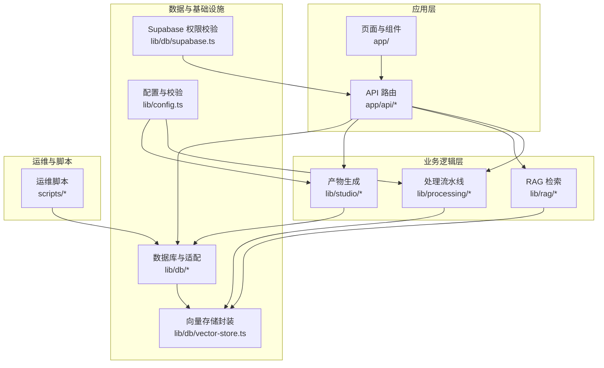
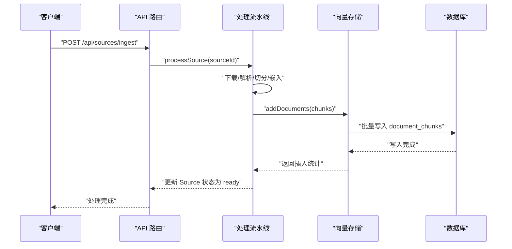
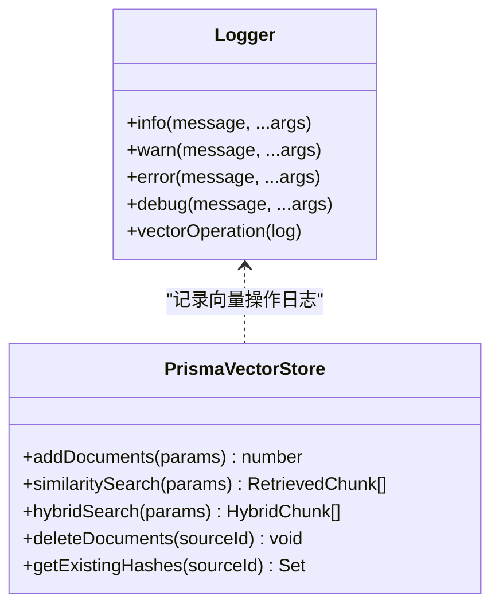
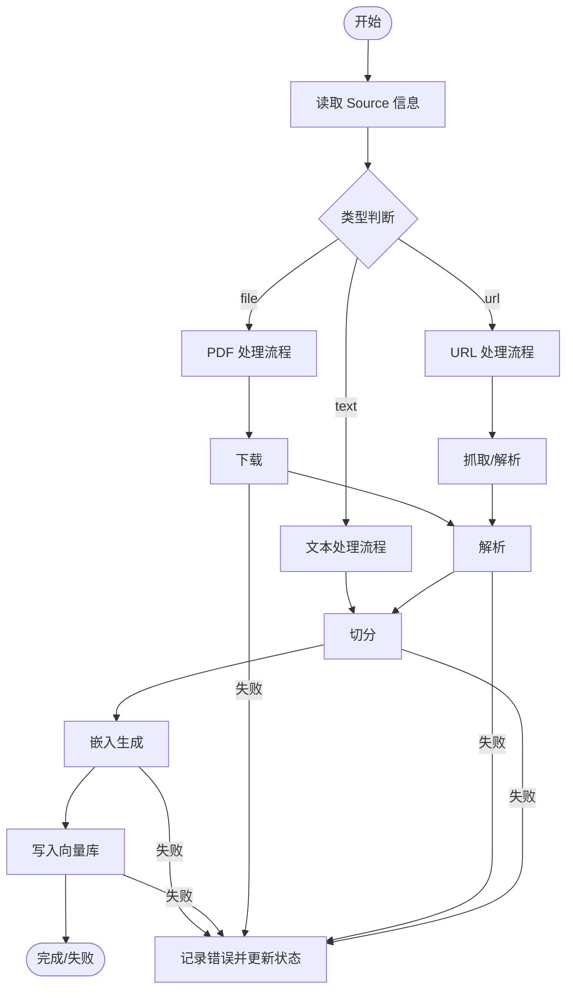
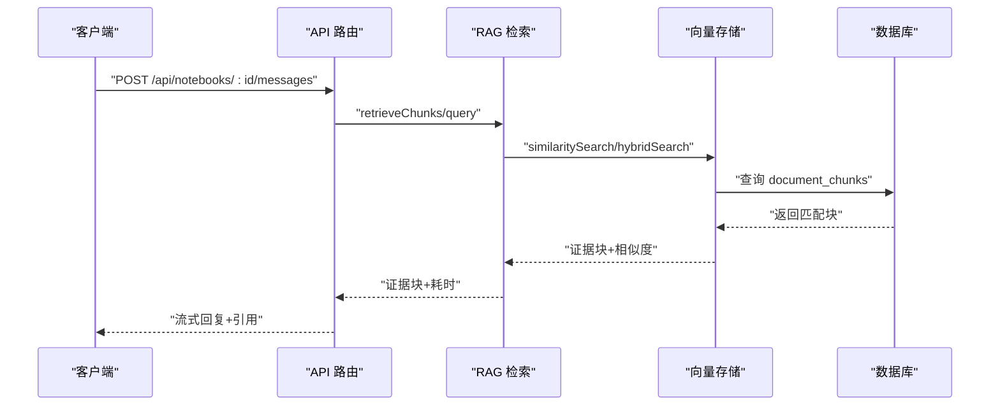
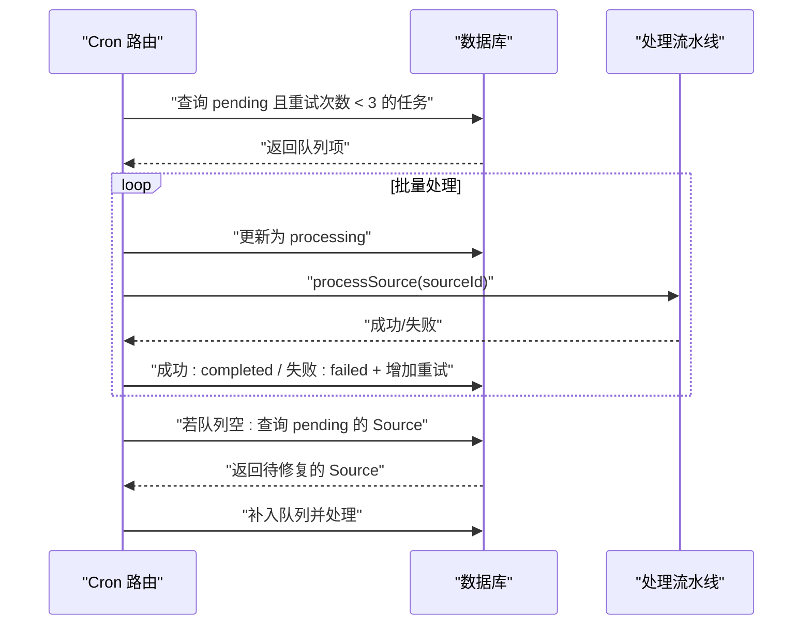
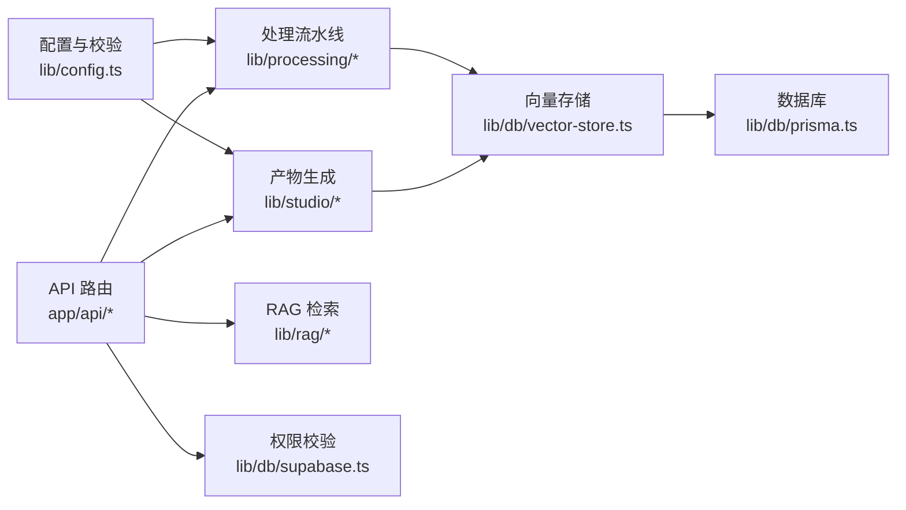

# 故障排查与运维

<cite>
**本文引用的文件**
- [README.md](file://README.md)
- [package.json](file://package.json)
- [lib/utils/logger.ts](file://lib/utils/logger.ts)
- [lib/db/prisma.ts](file://lib/db/prisma.ts)
- [lib/db/supabase.ts](file://lib/db/supabase.ts)
- [lib/config.ts](file://lib/config.ts)
- [lib/db/vector-store.ts](file://lib/db/vector-store.ts)
- [lib/processing/index.ts](file://lib/processing/index.ts)
- [lib/processing/processor.ts](file://lib/processing/processor.ts)
- [lib/processing/embedding.ts](file://lib/processing/embedding.ts)
- [lib/processing/text-splitter.ts](file://lib/processing/text-splitter.ts)
- [lib/rag/retriever.ts](file://lib/rag/retriever.ts)
- [lib/studio/generator.ts](file://lib/studio/generator.ts)
- [app/api/cron/process-queue/route.ts](file://app/api/cron/process-queue/route.ts)
- [app/error.tsx](file://app/error.tsx)
- [scripts/test-supabase.ts](file://scripts/test-supabase.ts)
- [scripts/cleanup-templates.ts](file://scripts/cleanup-templates.ts)
- [lib/utils/date.ts](file://lib/utils/date.ts)
</cite>

## 目录
1. [简介](#简介)
2. [项目结构](#项目结构)
3. [核心组件](#核心组件)
4. [架构总览](#架构总览)
5. [详细组件分析](#详细组件分析)
6. [依赖关系分析](#依赖关系分析)
7. [性能考量](#性能考量)
8. [故障排查指南](#故障排查指南)
9. [结论](#结论)
10. [附录](#附录)

## 简介
本指南面向 notebookLM-clone 项目的运维与故障排查，提供系统化的问题诊断方法、常见问题定位流程、日志分析技巧、性能诊断要点、自动化运维工具使用、应急响应流程、知识库建设与效率提升工具建议。目标是在保障服务稳定性的同时，快速定位并解决应用崩溃、数据库连接失败、API 响应超时、性能下降等问题。

## 项目结构
项目采用 Next.js App Router 架构，核心模块围绕“知识源导入—处理与索引—RAG 检索—Studio 产物生成—定时队列处理”展开。关键目录与职责如下：
- app/api/*：REST 风格的后端路由，负责处理队列、聊天、笔记、源、模板等 API。
- lib/db/*：数据库适配与向量存储，包含 Prisma 客户端、Supabase 权限校验、向量存储封装。
- lib/processing/*：文档处理流水线，PDF/URL/文本解析、切分、嵌入、写库。
- lib/rag/*：RAG 检索与提示词组装。
- lib/studio/*：产物生成（测验、思维导图等）与解析。
- scripts/*：运维辅助脚本（Supabase 连接测试、模板清理）。
- prisma/migrations/*：数据库迁移与向量表结构。

**图表来源**
- [lib/db/vector-store.ts](file://lib/db/vector-store.ts#L1-L446)
- [lib/processing/processor.ts](file://lib/processing/processor.ts#L1-L560)
- [lib/rag/retriever.ts](file://lib/rag/retriever.ts#L1-L206)
- [lib/studio/generator.ts](file://lib/studio/generator.ts#L1-L311)
- [lib/db/prisma.ts](file://lib/db/prisma.ts#L1-L41)
- [lib/db/supabase.ts](file://lib/db/supabase.ts#L1-L39)
- [lib/config.ts](file://lib/config.ts#L1-L187)
- [scripts/test-supabase.ts](file://scripts/test-supabase.ts#L1-L40)
- [scripts/cleanup-templates.ts](file://scripts/cleanup-templates.ts#L1-L24)

**章节来源**
- [README.md](file://README.md#L42-L49)
- [package.json](file://package.json#L1-L82)

## 核心组件
- 日志与可观测性：统一日志工具，支持向量操作专用日志结构，便于追踪向量插入/搜索/混合检索的耗时与成功率。
- 数据库与连接池：Prisma 客户端通过 Postgres Pool 适配，支持开发/生产日志级别控制与全局连接池缓存。
- Supabase 权限校验：服务端获取当前用户并校验资源归属，确保 API 的访问控制。
- 配置与环境校验：启动时强制校验向量维度与必要环境变量，避免配置漂移导致的系统性异常。
- 向量存储封装：提供批量插入、相似度检索、混合检索、删除与去重哈希查询，内置维度校验与日志记录。
- 处理流水线：PDF/URL/文本三种源的统一处理流程，包含下载、解析、切分、嵌入、写库与状态更新。
- RAG 检索：支持向量与混合检索，返回证据块与检索耗时，便于前端展示与性能分析。
- Studio 产物生成：快慢两种模式（智能采样/Map-Reduce），带超时控制与解析容错。
- 定时队列：Cron 路由负责拉取待处理任务、更新状态、失败重试与自我修复。

**章节来源**
- [lib/utils/logger.ts](file://lib/utils/logger.ts#L1-L98)
- [lib/db/prisma.ts](file://lib/db/prisma.ts#L1-L41)
- [lib/db/supabase.ts](file://lib/db/supabase.ts#L1-L39)
- [lib/config.ts](file://lib/config.ts#L1-L187)
- [lib/db/vector-store.ts](file://lib/db/vector-store.ts#L1-L446)
- [lib/processing/processor.ts](file://lib/processing/processor.ts#L1-L560)
- [lib/rag/retriever.ts](file://lib/rag/retriever.ts#L1-L206)
- [lib/studio/generator.ts](file://lib/studio/generator.ts#L1-L311)
- [app/api/cron/process-queue/route.ts](file://app/api/cron/process-queue/route.ts#L1-L165)

## 架构总览
系统以“API 路由 -> 业务逻辑 -> 数据层”的分层设计组织，关键链路包括：
- 源导入与处理：API 路由触发处理流水线，写入向量表；失败时记录错误并更新状态。
- RAG 检索：生成查询向量，调用向量存储检索，聚合来源元数据返回证据块。
- Studio 生成：根据模式选择策略，调用 LLM，解析产物并返回统计信息。
- 定时队列：Cron 路由按优先级与重试次数处理任务，具备自我修复能力。

**图表来源**
- [lib/processing/processor.ts](file://lib/processing/processor.ts#L402-L420)
- [lib/db/vector-store.ts](file://lib/db/vector-store.ts#L77-L173)
- [app/api/cron/process-queue/route.ts](file://app/api/cron/process-queue/route.ts#L38-L107)

## 详细组件分析

### 向量存储与日志（P1-6）
- 统一日志结构：包含操作类型、笔记本/源 ID、耗时、成功与否、元数据（插入/跳过数、TopK、阈值、平均相似度等）。
- 操作类型：insert/search/hybrid_search/delete，分别对应写入、相似度检索、混合检索与删除。
- 维度校验：在插入与查询前强制校验嵌入维度，避免与数据库 vector(D) 不一致导致的异常。
- 批量优化：插入分批、CTE 消除重复计算、混合检索权重可调。

**图表来源**
- [lib/utils/logger.ts](file://lib/utils/logger.ts#L29-L98)
- [lib/db/vector-store.ts](file://lib/db/vector-store.ts#L77-L446)

**章节来源**
- [lib/utils/logger.ts](file://lib/utils/logger.ts#L1-L98)
- [lib/db/vector-store.ts](file://lib/db/vector-store.ts#L77-L173)
- [lib/db/vector-store.ts](file://lib/db/vector-store.ts#L175-L297)
- [lib/db/vector-store.ts](file://lib/db/vector-store.ts#L312-L442)

### 处理流水线（PDF/URL/文本）
- 状态机：pending -> downloading/fetching/parsing/chunking/embedding/index -> ready 或 failed。
- 日志结构：记录各阶段耗时、字数/页数/块数、token 使用、跳过数等。
- 去重：基于内容哈希过滤已存在块，减少重复写入。
- 失败处理：捕获异常、记录错误消息、更新状态与日志。

**图表来源**
- [lib/processing/processor.ts](file://lib/processing/processor.ts#L82-L209)
- [lib/processing/processor.ts](file://lib/processing/processor.ts#L215-L397)
- [lib/processing/processor.ts](file://lib/processing/processor.ts#L426-L526)

**章节来源**
- [lib/processing/processor.ts](file://lib/processing/processor.ts#L1-L560)
- [lib/processing/text-splitter.ts](file://lib/processing/text-splitter.ts#L1-L270)
- [lib/processing/embedding.ts](file://lib/processing/embedding.ts#L1-L189)

### RAG 检索与 Studio 生成
- RAG：支持向量检索与混合检索，返回证据块、相似度与检索耗时；可选去重。
- Studio：快/精准两种模式，快模式智能采样，精准模式 Map-Reduce；统一超时控制与解析容错。

**图表来源**
- [lib/rag/retriever.ts](file://lib/rag/retriever.ts#L53-L116)
- [lib/rag/retriever.ts](file://lib/rag/retriever.ts#L131-L206)
- [lib/db/vector-store.ts](file://lib/db/vector-store.ts#L175-L297)
- [lib/db/vector-store.ts](file://lib/db/vector-store.ts#L312-L442)

**章节来源**
- [lib/rag/retriever.ts](file://lib/rag/retriever.ts#L1-L206)
- [lib/studio/generator.ts](file://lib/studio/generator.ts#L1-L311)

### 定时队列与自我修复
- 鉴权：Bearer Token 校验；支持 manual 参数用于前端触发。
- 批量处理：限制每轮处理数量，避免 Serverless 超时。
- 重试与失败：记录错误、增加重试次数；超过阈值更新 Source 状态为 failed。
- 自我修复：扫描状态为 pending 但不在队列中的 Source，自动补入队列并处理。

**图表来源**
- [app/api/cron/process-queue/route.ts](file://app/api/cron/process-queue/route.ts#L38-L152)

**章节来源**
- [app/api/cron/process-queue/route.ts](file://app/api/cron/process-queue/route.ts#L1-L165)

## 依赖关系分析
- 配置强依赖：向量维度与模型配置在启动时严格校验，任何不一致都会抛出致命错误。
- 数据库依赖：Prisma 通过 Postgres Pool 连接 Supabase 数据库；向量表与检索函数在迁移中创建。
- 外部服务依赖：智谱/LongCat 模型服务，嵌入与生成均依赖外部 API。
- 权限依赖：所有 API 路由依赖 Supabase 校验当前用户与资源归属。

**图表来源**
- [lib/config.ts](file://lib/config.ts#L1-L187)
- [lib/db/prisma.ts](file://lib/db/prisma.ts#L1-L41)
- [lib/db/supabase.ts](file://lib/db/supabase.ts#L1-L39)
- [lib/db/vector-store.ts](file://lib/db/vector-store.ts#L1-L446)
- [lib/processing/processor.ts](file://lib/processing/processor.ts#L1-L560)
- [lib/rag/retriever.ts](file://lib/rag/retriever.ts#L1-L206)
- [lib/studio/generator.ts](file://lib/studio/generator.ts#L1-L311)

**章节来源**
- [lib/config.ts](file://lib/config.ts#L1-L187)
- [lib/db/prisma.ts](file://lib/db/prisma.ts#L1-L41)
- [lib/db/supabase.ts](file://lib/db/supabase.ts#L1-L39)

## 性能考量
- 插入性能：批量写入（默认每批 500）、冲突忽略（避免重复写入）、维度校验前置。
- 检索性能：CTE 避免重复计算，阈值过滤，TopK 限制；混合检索权重可调。
- 嵌入性能：指数退避重试、分批请求、维度校验、Token 估算。
- 连接池：开发环境开启错误/警告日志，生产环境仅错误日志，降低噪声。
- 超时控制：Studio 生成按模式设置超时，避免长耗时阻塞。

**章节来源**
- [lib/db/vector-store.ts](file://lib/db/vector-store.ts#L7-L173)
- [lib/db/vector-store.ts](file://lib/db/vector-store.ts#L175-L297)
- [lib/db/vector-store.ts](file://lib/db/vector-store.ts#L312-L442)
- [lib/processing/embedding.ts](file://lib/processing/embedding.ts#L1-L189)
- [lib/db/prisma.ts](file://lib/db/prisma.ts#L32-L34)
- [lib/studio/generator.ts](file://lib/studio/generator.ts#L23-L115)

## 故障排查指南

### 问题分类与影响评估
- 应用崩溃
  - 现象：页面白屏、错误弹窗、控制台报错。
  - 影响：用户无法使用功能，服务不可用。
  - 常见原因：未捕获异常、路由错误、权限校验失败、外部服务不可用。
- 数据库连接失败
  - 现象：初始化失败、查询超时、连接池耗尽。
  - 影响：所有依赖数据库的功能不可用。
  - 常见原因：DATABASE_URL/DIRECT_URL 错误、连接池配置不当、Supabase Transaction Pooler 未启用。
- API 响应超时
  - 现象：前端长时间无响应、Cron 路由超时。
  - 影响：处理队列积压、用户等待时间延长。
  - 常见原因：Serverless 执行时间限制、外部 API 超时、大文本处理未分批。
- 性能下降
  - 现象：检索耗时上升、嵌入生成缓慢、UI 卡顿。
  - 影响：用户体验下降。
  - 常见原因：索引缺失、阈值设置不当、向量维度不一致、Token 估算错误。

### 根因分析与解决方案制定
- 应用崩溃
  - 检查全局错误页面与控制台日志，区分开发/生产环境输出。
  - 确认 Supabase 权限校验是否通过，API 是否正确返回错误。
  - 参考：全局错误页面与权限校验逻辑。
- 数据库连接失败
  - 使用 Supabase 连接测试脚本验证基础连通性与表存在性。
  - 检查 DATABASE_URL/DIRECT_URL 与连接池参数，确认 Serverless 环境使用 Transaction Pooler。
  - 参考：数据库连接池与配置说明。
- API 响应超时
  - 检查 Cron 路由的批量大小与重试策略，避免单次处理时间过长。
  - 优化外部 API 调用（嵌入/生成）的超时与重试。
  - 参考：Cron 路由与嵌入生成超时控制。
- 性能下降
  - 使用向量操作日志分析插入/检索耗时与成功率。
  - 调整 TopK、阈值与混合检索权重，评估索引与查询计划。
  - 参考：向量操作日志结构与检索实现。

**章节来源**
- [app/error.tsx](file://app/error.tsx#L1-L68)
- [lib/db/supabase.ts](file://lib/db/supabase.ts#L12-L33)
- [scripts/test-supabase.ts](file://scripts/test-supabase.ts#L1-L40)
- [lib/db/prisma.ts](file://lib/db/prisma.ts#L5-L16)
- [app/api/cron/process-queue/route.ts](file://app/api/cron/process-queue/route.ts#L5-L7)
- [lib/processing/embedding.ts](file://lib/processing/embedding.ts#L12-L26)
- [lib/studio/generator.ts](file://lib/studio/generator.ts#L23-L27)
- [lib/utils/logger.ts](file://lib/utils/logger.ts#L11-L27)
- [lib/db/vector-store.ts](file://lib/db/vector-store.ts#L175-L297)

### 常见问题排查流程
- 应用崩溃
  1) 检查全局错误页面是否渲染，记录错误摘要。
  2) 在开发环境查看控制台日志，定位具体调用栈。
  3) 确认 Supabase 权限校验是否抛出“未登录/无权访问”。
  4) 若为 API 路由错误，检查 NextResponse 返回与状态码。
- 数据库连接失败
  1) 使用 Supabase 连接测试脚本验证 URL 与 Key。
  2) 确认 Prisma 连接池参数与 Serverless 环境配置。
  3) 检查迁移是否执行，向量表与检索函数是否存在。
- API 响应超时
  1) 检查 Cron 路由的 Authorization 与 manual 参数。
  2) 限制每轮处理数量，观察队列状态变化。
  3) 对外部 API 调用增加超时与重试，记录失败原因。
- 性能下降
  1) 查看向量操作日志，关注插入/检索耗时与成功率。
  2) 调整 TopK、阈值与混合检索权重，对比平均相似度。
  3) 检查嵌入维度与模型配置，避免不一致导致的异常。

**章节来源**
- [app/error.tsx](file://app/error.tsx#L15-L20)
- [lib/db/supabase.ts](file://lib/db/supabase.ts#L22-L33)
- [scripts/test-supabase.ts](file://scripts/test-supabase.ts#L17-L37)
- [lib/db/prisma.ts](file://lib/db/prisma.ts#L23-L39)
- [app/api/cron/process-queue/route.ts](file://app/api/cron/process-queue/route.ts#L11-L36)
- [lib/studio/generator.ts](file://lib/studio/generator.ts#L53-L115)
- [lib/utils/logger.ts](file://lib/utils/logger.ts#L75-L94)
- [lib/db/vector-store.ts](file://lib/db/vector-store.ts#L143-L172)

### 日志分析技巧
- 日志格式解读
  - 时间戳、级别、消息体；向量操作日志包含操作类型、笔记本/源 ID、耗时、成功与否与元数据。
- 关键信息提取
  - 操作类型：insert/search/hybrid_search/delete。
  - 成功与否：success 字段；失败时记录 error。
  - 元数据：插入/跳过数、TopK、阈值、平均相似度等。
- 时间序列分析
  - 统计插入/检索耗时分布，识别异常峰值。
  - 对比不同模式（快/精准）的生成耗时与解析成功率。
- 关联分析
  - 将处理流水线各阶段耗时与最终状态关联，定位瓶颈阶段。
  - 将外部 API 错误与重试次数关联，评估服务稳定性。

**章节来源**
- [lib/utils/logger.ts](file://lib/utils/logger.ts#L32-L54)
- [lib/utils/logger.ts](file://lib/utils/logger.ts#L75-L94)
- [lib/processing/processor.ts](file://lib/processing/processor.ts#L84-L208)
- [lib/studio/generator.ts](file://lib/studio/generator.ts#L53-L115)

### 性能问题诊断
- CPU 使用率分析
  - 关注嵌入生成与文本切分阶段的 CPU 占用，优化分批大小与重试策略。
- 内存泄漏检测
  - 检查大对象（向量数组、文本缓冲区）生命周期，避免累积。
- 数据库查询优化
  - 使用 CTE 与阈值过滤，合理设置 TopK；检查索引与查询计划。
- 网络延迟排查
  - 对外部 API 设置超时与指数退避，记录响应时间与错误码。

**章节来源**
- [lib/processing/embedding.ts](file://lib/processing/embedding.ts#L52-L67)
- [lib/processing/embedding.ts](file://lib/processing/embedding.ts#L115-L134)
- [lib/db/vector-store.ts](file://lib/db/vector-store.ts#L204-L252)
- [lib/db/vector-store.ts](file://lib/db/vector-store.ts#L349-L429)
- [lib/studio/generator.ts](file://lib/studio/generator.ts#L53-L115)

### 运维自动化工具使用
- 监控脚本
  - 使用 Supabase 连接测试脚本验证基础连通性。
- 清理任务
  - 使用模板清理脚本删除旧模板，释放空间。
- 备份与恢复
  - 通过 Prisma 迁移与数据库备份策略，确保可回滚与恢复。
- 批量操作
  - 使用 Prisma 客户端执行批量删除/更新，结合事务保证一致性。

**章节来源**
- [scripts/test-supabase.ts](file://scripts/test-supabase.ts#L1-L40)
- [scripts/cleanup-templates.ts](file://scripts/cleanup-templates.ts#L1-L24)
- [lib/db/prisma.ts](file://lib/db/prisma.ts#L1-L41)

### 应急响应流程
- 故障分级
  - P0：系统性配置错误（向量维度不一致）、数据库不可用。
  - P1：外部服务超时/错误、检索性能严重下降。
  - P2：个别功能异常、日志噪声。
- 响应团队
  - 前端/后端/数据库/平台（Supabase）协同处理。
- 沟通机制
  - 使用统一错误页面与日志输出，便于快速定位。
- 恢复计划
  - 临时降级（禁用混合检索/降低 TopK）、重启服务、回滚迁移。

**章节来源**
- [lib/config.ts](file://lib/config.ts#L9-L29)
- [lib/db/prisma.ts](file://lib/db/prisma.ts#L5-L16)
- [app/error.tsx](file://app/error.tsx#L15-L20)

### 运维知识库建设
- 问题案例整理
  - 记录常见问题现象、根因、处理步骤与预防措施。
- 最佳实践总结
  - 配置校验、连接池参数、批量大小、超时与重试策略。
- 培训材料
  - 日志解读、性能分析、应急响应流程与工具使用。

**章节来源**
- [lib/utils/logger.ts](file://lib/utils/logger.ts#L1-L98)
- [lib/db/vector-store.ts](file://lib/db/vector-store.ts#L7-L173)
- [lib/processing/embedding.ts](file://lib/processing/embedding.ts#L12-L26)

### 运维效率提升工具
- 自动化运维脚本
  - Supabase 连接测试、模板清理、迁移执行。
- 配置管理工具
  - 环境变量集中管理，启动时强制校验。
- 变更管理流程
  - 迁移前备份、灰度发布、回滚策略与变更通知。

**章节来源**
- [scripts/test-supabase.ts](file://scripts/test-supabase.ts#L1-L40)
- [scripts/cleanup-templates.ts](file://scripts/cleanup-templates.ts#L1-L24)
- [lib/config.ts](file://lib/config.ts#L169-L187)
- [README.md](file://README.md#L95-L122)

## 结论
通过统一的日志体系、严格的配置校验、完善的处理流水线与定时队列机制，notebookLM-clone 在稳定性与可维护性方面具备良好基础。建议在生产环境中持续关注外部服务稳定性、数据库连接池与索引性能，并建立标准化的应急响应与知识库体系，以进一步提升运维效率与系统韧性。

## 附录
- 常用命令
  - 开发：npm run dev
  - 构建与启动：npm run build && npm run start
  - 质量检查：npm run lint && npm run type-check
  - 数据库：npm run db:migrate && npm run db:studio
- 环境变量
  - Supabase：NEXT_PUBLIC_SUPABASE_URL、NEXT_PUBLIC_SUPABASE_ANON_KEY、SUPABASE_SECRET_KEY
  - 数据库：DATABASE_URL、DIRECT_URL
  - 模型：ZHIPU_API_KEY、ZHIPU_BASE_URL、ZHIPU_EMBEDDING_MODEL、ZHIPU_CHAT_MODEL、LONGCAT_API_KEY、LONGCAT_BASE_URL、LONGCAT_CHAT_MODEL
  - 向量维度：EMBEDDING_DIM
  - Worker 鉴权：CRON_SECRET

**章节来源**
- [README.md](file://README.md#L64-L93)
- [README.md](file://README.md#L106-L122)
- [package.json](file://package.json#L5-L16)