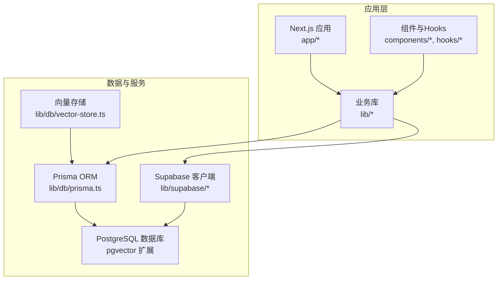
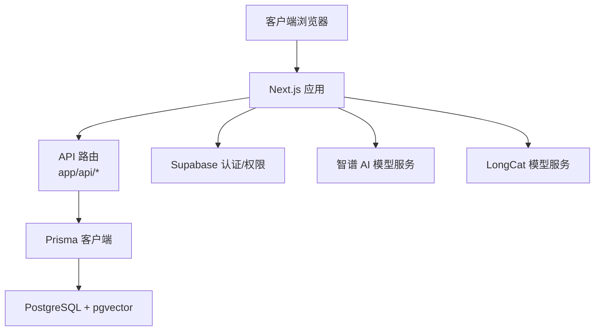
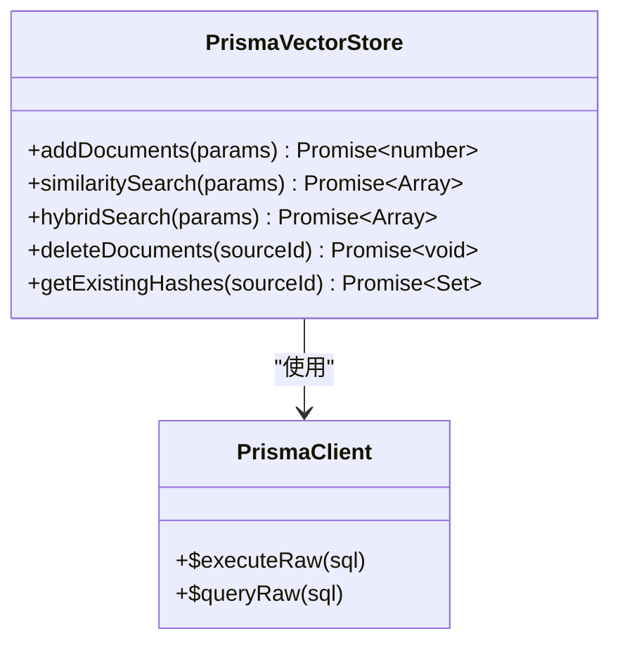
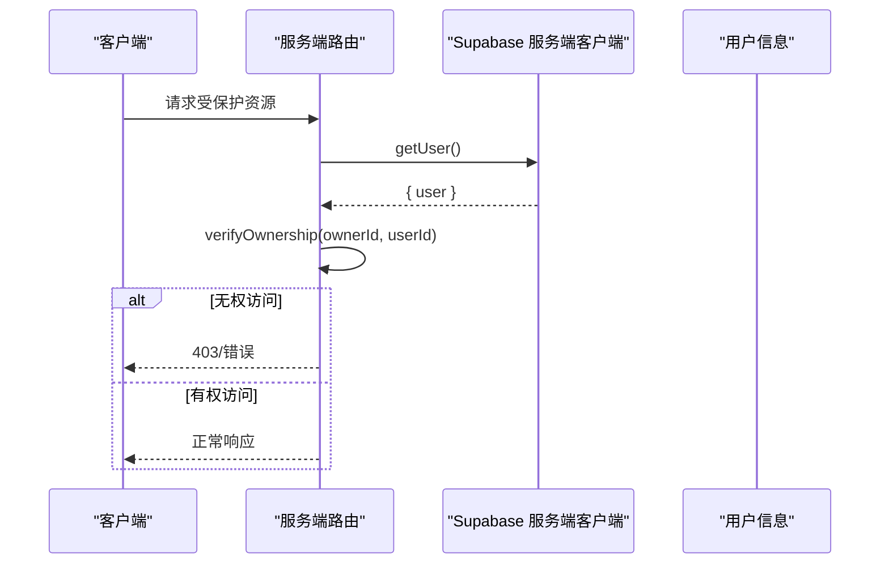
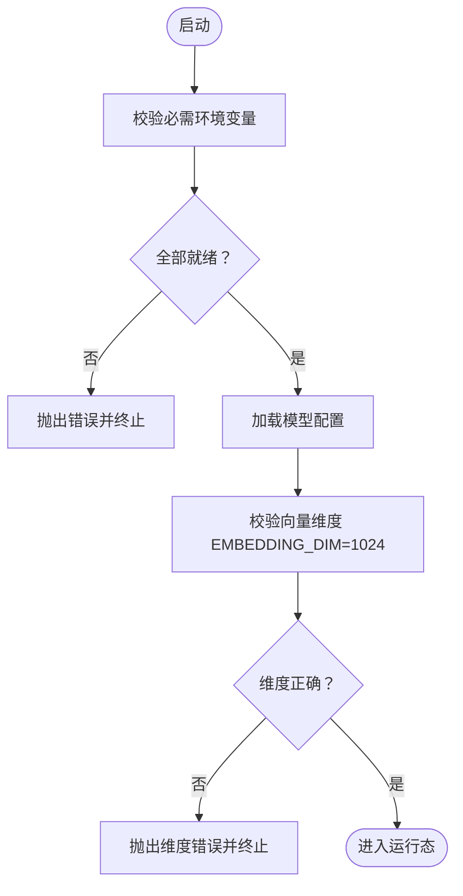
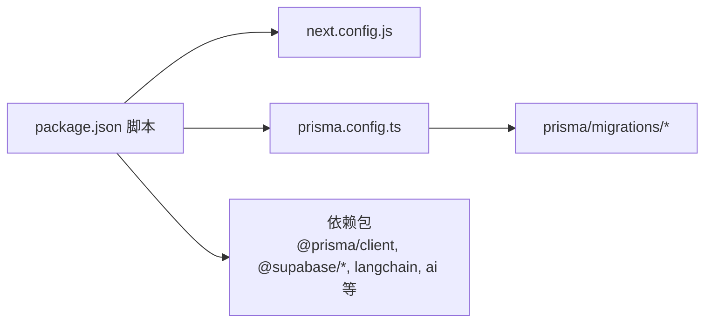

# 生产环境部署

<cite>
**本文引用的文件**
- [package.json](file://package.json)
- [next.config.js](file://next.config.js)
- [prisma.config.ts](file://prisma.config.ts)
- [lib/config.ts](file://lib/config.ts)
- [lib/db/prisma.ts](file://lib/db/prisma.ts)
- [lib/db/vector-store.ts](file://lib/db/vector-store.ts)
- [lib/db/supabase.ts](file://lib/db/supabase.ts)
- [lib/supabase/client.ts](file://lib/supabase/client.ts)
- [lib/supabase/server.ts](file://lib/supabase/server.ts)
- [prisma/migrations/00000000000000_init_vector/migration.sql](file://prisma/migrations/00000000000000_init_vector/migration.sql)
- [prisma/migrations/20241223_create_vector_table/migration.sql](file://prisma/migrations/20241223_create_vector_table/migration.sql)
- [prisma/migrations/20260120042257_sync_schema_changes/migration.sql](file://prisma/migrations/20260120042257_sync_schema_changes/migration.sql)
- [prisma/migrations/20260120050505_add_content_tsv/migration.sql](file://prisma/migrations/20260120050505_add_content_tsv/migration.sql)
- [prisma/migrations/20260120050654_test/migration.sql](file://prisma/migrations/20260120050654_test/migration.sql)
- [prisma/migrations/20260120120000_add_unique_constraint/migration.sql](file://prisma/migrations/20260120120000_add_unique_constraint/migration.sql)
- [prisma/migrations/20260120120100_fix_fts_language/migration.sql](file://prisma/migrations/20260120120100_fix_fts_language/migration.sql)
- [prisma/migrations/20260120120200_optimize_hnsw_index/migration.sql](file://prisma/migrations/20260120120200_optimize_hnsw_index/migration.sql)
- [prisma/migrations/20260120120300_add_composite_indexes/migration.sql](file://prisma/migrations/20260120120300_add_composite_indexes/migration.sql)
</cite>

## 目录
1. [简介](#简介)
2. [项目结构](#项目结构)
3. [核心组件](#核心组件)
4. [架构总览](#架构总览)
5. [详细组件分析](#详细组件分析)
6. [依赖关系分析](#依赖关系分析)
7. [性能考量](#性能考量)
8. [故障排查指南](#故障排查指南)
9. [结论](#结论)
10. [附录](#附录)

## 简介
本指南面向 notebookLM-clone 项目的生产环境部署，覆盖从服务器环境准备、依赖安装、环境变量配置、数据库初始化，到应用构建与启动、外部服务集成、部署验证、配置优化以及回滚与应急处理的完整流程。内容基于仓库中的配置与实现进行提炼，确保可操作性与可追溯性。

## 项目结构
该项目采用 Next.js 14 应用，结合 Prisma ORM、Supabase、向量检索与 RAG 能力，核心目录与职责如下：
- app：页面与 API 路由
- components：UI 组件与通用组件
- hooks：自定义 React Hooks
- lib：业务逻辑与工具库，包含 AI、数据库、处理管线、RAG、Studio、Supabase 客户端与工具、配置与工具函数
- prisma：数据库模式与迁移脚本
- scripts：种子与测试脚本
- 配置文件：package.json、next.config.js、prisma.config.ts、lib/config.ts 等

图表来源
- [lib/db/prisma.ts](file://lib/db/prisma.ts#L1-L41)
- [lib/db/vector-store.ts](file://lib/db/vector-store.ts#L1-L446)
- [lib/supabase/client.ts](file://lib/supabase/client.ts#L1-L14)
- [lib/supabase/server.ts](file://lib/supabase/server.ts#L1-L33)

章节来源
- [package.json](file://package.json#L1-L82)
- [next.config.js](file://next.config.js#L1-L21)
- [prisma.config.ts](file://prisma.config.ts#L1-L20)

## 核心组件
- 应用配置与模型选择：通过 lib/config.ts 提供统一的环境变量校验、模型提供商配置与默认模型选择，强制向量维度为 1024，并对缺失变量进行严格校验。
- 数据库与连接池：lib/db/prisma.ts 使用 @prisma/adapter-pg 与 pg Pool，支持生产环境连接池与日志级别控制；同时提供 Serverless 环境下的连接参数建议。
- 向量存储与检索：lib/db/vector-store.ts 实现了基于 PostgreSQL + pgvector 的向量存储，支持相似度检索、混合检索（向量+全文），并内置批量插入、维度校验与日志记录。
- Supabase 集成：lib/supabase/client.ts 与 lib/supabase/server.ts 分别提供浏览器与服务端的 Supabase 客户端封装，配合 lib/db/supabase.ts 提供所有权校验等安全控制。

章节来源
- [lib/config.ts](file://lib/config.ts#L1-L187)
- [lib/db/prisma.ts](file://lib/db/prisma.ts#L1-L41)
- [lib/db/vector-store.ts](file://lib/db/vector-store.ts#L1-L446)
- [lib/db/supabase.ts](file://lib/db/supabase.ts#L1-L39)
- [lib/supabase/client.ts](file://lib/supabase/client.ts#L1-L14)
- [lib/supabase/server.ts](file://lib/supabase/server.ts#L1-L33)

## 架构总览
下图展示了生产环境的关键交互：应用通过 Prisma 访问数据库，使用 pgvector 存储与检索向量；Supabase 提供认证与权限；AI 模型服务（智谱/LongCat）通过配置注入。

图表来源
- [lib/db/prisma.ts](file://lib/db/prisma.ts#L1-L41)
- [lib/db/vector-store.ts](file://lib/db/vector-store.ts#L1-L446)
- [lib/supabase/client.ts](file://lib/supabase/client.ts#L1-L14)
- [lib/config.ts](file://lib/config.ts#L31-L66)

## 详细组件分析

### 数据库与向量存储
- 连接与适配：使用 Prisma + @prisma/adapter-pg + pg Pool，生产环境启用错误日志，开发环境增加警告日志；提供 Serverless 环境连接参数建议（如 pgbouncer、connection_limit）。
- 向量维度：强制要求 EMBEDDING_DIM=1024，与智谱 embedding-3 对齐；运行时对插入与查询的向量维度进行校验。
- 批量写入：分批插入（每批最多 500 条），避免单次事务过大；使用 ON CONFLICT (source_id, chunk_index) DO NOTHING 避免重复。
- 检索能力：支持相似度检索与混合检索（向量+全文），使用 CTE 减少重复计算，支持阈值过滤与排序限制。
- 日志与可观测性：对插入/查询操作记录耗时、成功率与指标，便于问题定位。

图表来源
- [lib/db/vector-store.ts](file://lib/db/vector-store.ts#L77-L446)
- [lib/db/prisma.ts](file://lib/db/prisma.ts#L29-L34)

章节来源
- [lib/db/prisma.ts](file://lib/db/prisma.ts#L1-L41)
- [lib/db/vector-store.ts](file://lib/db/vector-store.ts#L1-L446)

### Supabase 集成
- 客户端封装：分别提供浏览器端与服务端客户端，读取 NEXT_PUBLIC_SUPABASE_URL 与 NEXT_PUBLIC_SUPABASE_ANON_KEY。
- 服务端鉴权：getCurrentUserId 获取当前用户 ID，verifyOwnership 校验资源归属，所有 API 必须调用以保证数据安全。
- 管理端重导出：向后兼容导出 supabaseAdmin。

图表来源
- [lib/db/supabase.ts](file://lib/db/supabase.ts#L12-L33)
- [lib/supabase/server.ts](file://lib/supabase/server.ts#L9-L32)

章节来源
- [lib/db/supabase.ts](file://lib/db/supabase.ts#L1-L39)
- [lib/supabase/client.ts](file://lib/supabase/client.ts#L1-L14)
- [lib/supabase/server.ts](file://lib/supabase/server.ts#L1-L33)

### 应用配置与模型选择
- 环境变量校验：validateEnv 检查 NEXT_PUBLIC_SUPABASE_URL、NEXT_PUBLIC_SUPABASE_ANON_KEY、DATABASE_URL、ZHIPU_API_KEY、EMBEDDING_DIM 是否齐全。
- 模型配置：支持 zhipu 与 longcat 两种提供商，默认 Studio 使用 longcat；getModelConfig/getStudioModelConfig 返回对应提供商的 API Key、Base URL 与模型名。
- 应用参数：最大文件大小、分块大小、TopK、相似度阈值等参数集中管理。

图表来源
- [lib/config.ts](file://lib/config.ts#L169-L186)
- [lib/config.ts](file://lib/config.ts#L17-L29)

章节来源
- [lib/config.ts](file://lib/config.ts#L1-L187)

## 依赖关系分析
- 包管理与脚本：package.json 定义了开发、构建、启动与 Prisma 相关脚本；postinstall 自动执行 prisma generate。
- Next.js 配置：images.domains/remotePatterns 支持本地与 Supabase 图片域名；serverActions.bodySizeLimit 提升上传体积上限。
- Prisma 配置：prisma.config.ts 通过 dotenv 加载 .env.local，指定 schema 与 migrations 路径，并从 DIRECT_URL 读取数据库连接。

图表来源
- [package.json](file://package.json#L5-L16)
- [next.config.js](file://next.config.js#L1-L21)
- [prisma.config.ts](file://prisma.config.ts#L6-L19)

章节来源
- [package.json](file://package.json#L1-L82)
- [next.config.js](file://next.config.js#L1-L21)
- [prisma.config.ts](file://prisma.config.ts#L1-L20)

## 性能考量
- 连接池与并发：生产环境建议使用 Supabase Transaction Pooler（端口 6543），并设置 connection_limit=1 以适配 Serverless 场景。
- 批量写入：向量存储按 500 条一批进行插入，减少单次事务压力。
- 查询优化：相似度与混合检索使用 CTE 与 LIMIT，避免全表扫描；全文检索使用 'simple' 分词器提升多语言支持。
- 日志与监控：对向量操作记录耗时与成功率，便于后续性能分析与告警。

章节来源
- [lib/db/prisma.ts](file://lib/db/prisma.ts#L8-L16)
- [lib/db/vector-store.ts](file://lib/db/vector-store.ts#L9-L10)
- [lib/db/vector-store.ts](file://lib/db/vector-store.ts#L204-L296)
- [lib/db/vector-store.ts](file://lib/db/vector-store.ts#L349-L429)

## 故障排查指南
- 环境变量缺失：validateEnv 会在缺少必要变量时抛错，检查 .env.local 是否包含 NEXT_PUBLIC_SUPABASE_URL、NEXT_PUBLIC_SUPABASE_ANON_KEY、DATABASE_URL、ZHIPU_API_KEY、EMBEDDING_DIM。
- 向量维度不匹配：当 EMBEDDING_DIM 不等于 1024 或向量维度与预期不符时，运行时会抛出错误；请确认 embedding-3 模型与数据库表结构一致。
- 数据库连接异常：检查 DATABASE_URL 与连接池参数；在 Serverless 环境中使用 Supabase Transaction Pooler 并设置 pgbouncer=true 与合适的 connection_limit。
- 权限与归属：所有 API 路由应调用 verifyOwnership 校验资源归属，若出现 403，请检查 Supabase 用户会话与资源 owner 关联。

章节来源
- [lib/config.ts](file://lib/config.ts#L169-L186)
- [lib/config.ts](file://lib/config.ts#L17-L29)
- [lib/db/prisma.ts](file://lib/db/prisma.ts#L8-L16)
- [lib/db/supabase.ts](file://lib/db/supabase.ts#L22-L33)

## 结论
本指南基于仓库现有配置与实现，给出了 notebookLM-clone 生产部署的完整路径：先完成服务器与数据库准备，再进行环境变量与数据库迁移，随后构建应用并启动服务，最后通过健康检查与功能测试验证部署结果。建议在上线前完成性能基准测试与安全加固，并制定回滚与应急流程以保障稳定性。

## 附录

### A. 服务器环境准备与依赖安装
- 操作系统：推荐 Ubuntu 22.04 LTS 或同等发行版
- 运行时：Node.js 18.x（Next.js 14 要求）
- 包管理：pnpm（根据 lockfile 推断）
- 数据库：PostgreSQL 14+，启用 pgvector 扩展
- 外部服务：Supabase（认证/存储）、智谱 AI、LongCat（可选）

章节来源
- [package.json](file://package.json#L17-L64)

### B. 环境变量配置清单
- 必需变量：NEXT_PUBLIC_SUPABASE_URL、NEXT_PUBLIC_SUPABASE_ANON_KEY、DATABASE_URL、ZHIPU_API_KEY、EMBEDDING_DIM（必须为 1024）
- 可选变量：SUPABASE_SECRET_KEY、LONGCAT_API_KEY、LONGCAT_BASE_URL、ZHIPU_BASE_URL、ZHIPU_EMBEDDING_MODEL、ZHIPU_CHAT_MODEL、ZHIPU_STUDIO_MODEL、NEXT_PUBLIC_APP_URL、LONGCAT_CHAT_MODEL

章节来源
- [lib/config.ts](file://lib/config.ts#L169-L186)
- [lib/config.ts](file://lib/config.ts#L31-L66)

### C. 数据库初始化与迁移
- 初始化 pgvector：在目标数据库中启用扩展
- 执行 Prisma 迁移：使用 prisma migrate dev 或 prisma deploy 方式（依据部署平台）
- 迁移脚本位置：prisma/migrations 下包含多版本迁移，涵盖向量表、全文检索字段、索引优化等

章节来源
- [prisma.config.ts](file://prisma.config.ts#L1-L20)
- [prisma/migrations/00000000000000_init_vector/migration.sql](file://prisma/migrations/00000000000000_init_vector/migration.sql)
- [prisma/migrations/20241223_create_vector_table/migration.sql](file://prisma/migrations/20241223_create_vector_table/migration.sql)
- [prisma/migrations/20260120042257_sync_schema_changes/migration.sql](file://prisma/migrations/20260120042257_sync_schema_changes/migration.sql)
- [prisma/migrations/20260120050505_add_content_tsv/migration.sql](file://prisma/migrations/20260120050505_add_content_tsv/migration.sql)
- [prisma/migrations/20260120050654_test/migration.sql](file://prisma/migrations/20260120050654_test/migration.sql)
- [prisma/migrations/20260120120000_add_unique_constraint/migration.sql](file://prisma/migrations/20260120120000_add_unique_constraint/migration.sql)
- [prisma/migrations/20260120120100_fix_fts_language/migration.sql](file://prisma/migrations/20260120120100_fix_fts_language/migration.sql)
- [prisma/migrations/20260120120200_optimize_hnsw_index/migration.sql](file://prisma/migrations/20260120120200_optimize_hnsw_index/migration.sql)
- [prisma/migrations/20260120120300_add_composite_indexes/migration.sql](file://prisma/migrations/20260120120300_add_composite_indexes/migration.sql)

### D. 应用部署流程
- 代码构建：执行构建脚本生成静态产物
- 静态资源：Next.js 默认生成静态资源，无需额外生成步骤
- 配置文件：确保 .env.local 与数据库连接、AI 密钥、Supabase 凭证正确
- 进程启动：使用生产命令启动 Next.js 服务

章节来源
- [package.json](file://package.json#L5-L16)
- [next.config.js](file://next.config.js#L1-L21)

### E. 外部服务集成
- Supabase：配置 NEXT_PUBLIC_SUPABASE_URL 与 NEXT_PUBLIC_SUPABASE_ANON_KEY；服务端通过 server.ts 客户端读取会话并校验资源归属
- AI 模型服务：通过 lib/config.ts 注入智谱或 LongCat 的 API Key 与 Base URL；Studio 默认使用 LongCat

章节来源
- [lib/supabase/client.ts](file://lib/supabase/client.ts#L1-L14)
- [lib/supabase/server.ts](file://lib/supabase/server.ts#L1-L33)
- [lib/config.ts](file://lib/config.ts#L31-L66)
- [lib/config.ts](file://lib/config.ts#L149-L157)

### F. 部署验证方法
- 健康检查：访问应用根路径与关键 API 路由，确认返回状态正常
- 功能测试：上传文档、发起聊天、检索向量、查看生成内容
- 性能基准：对向量插入与检索进行压测，观察延迟与吞吐

章节来源
- [lib/db/vector-store.ts](file://lib/db/vector-store.ts#L105-L173)
- [lib/db/vector-store.ts](file://lib/db/vector-store.ts#L175-L297)

### G. 部署后优化
- 缓存策略：利用 CDN 缓存静态资源与图片（Supabase 图片域名已配置）
- 压缩配置：开启 Next.js 图像优化与服务端压缩
- 安全加固：限制上传文件类型与大小、启用 HTTPS、最小权限原则管理数据库凭据

章节来源
- [next.config.js](file://next.config.js#L4-L17)

### H. 回滚与应急处理
- 回滚方案：保留上一个稳定版本镜像/容器，回退数据库迁移至上一个稳定版本
- 应急流程：快速切换到备用 AI 模型服务、临时关闭高负载功能、启用只读模式

章节来源
- [prisma.config.ts](file://prisma.config.ts#L1-L20)