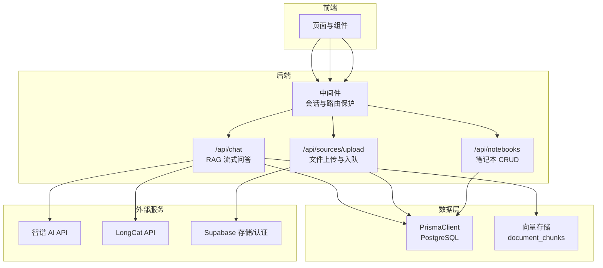
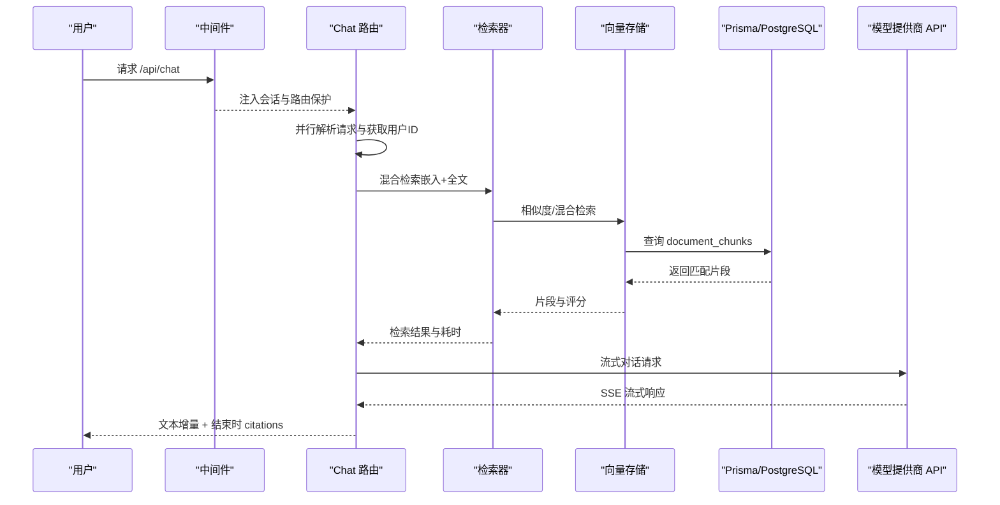
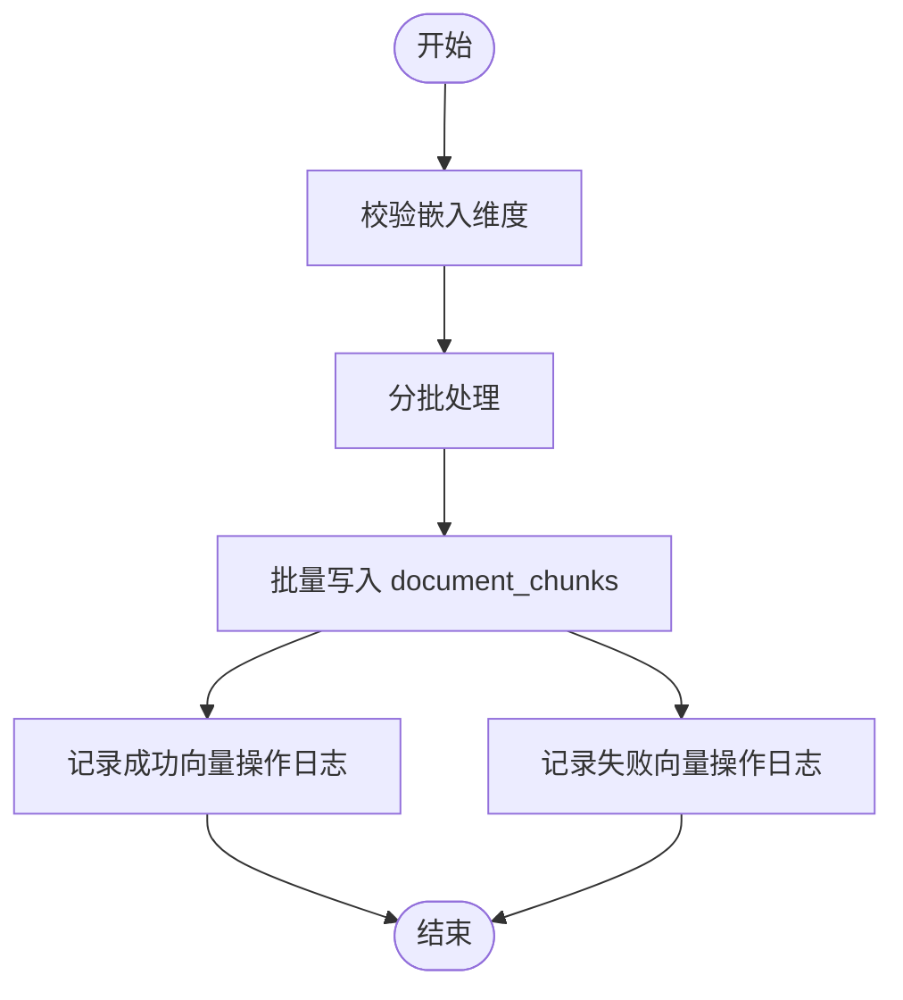
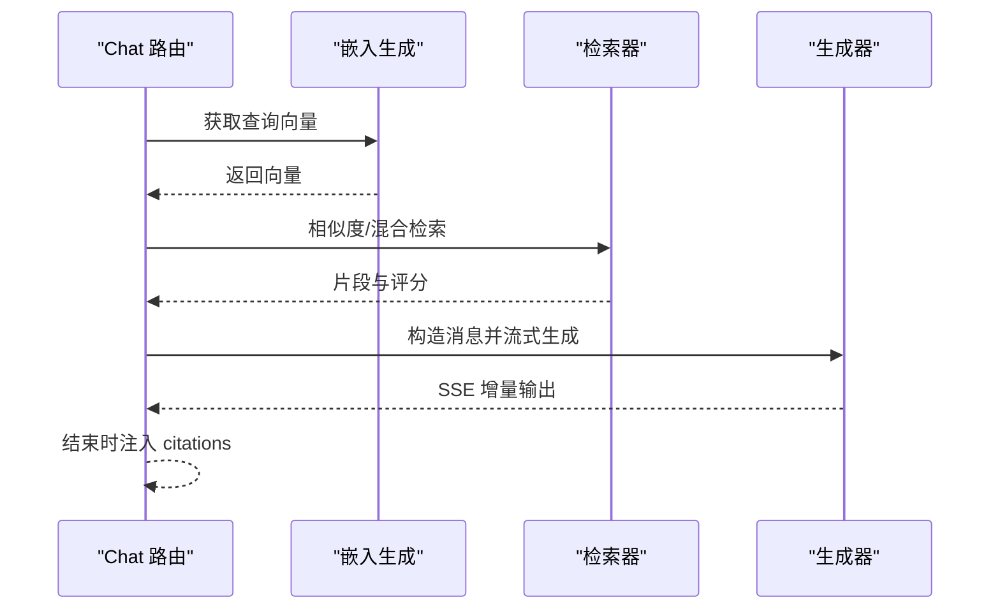
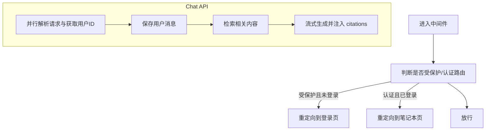
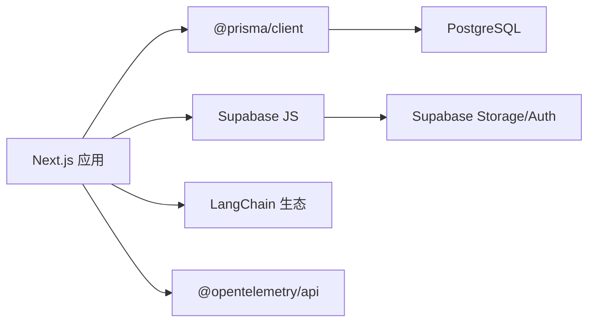

# 监控与告警

<cite>
**本文引用的文件**
- [package.json](file://package.json)
- [next.config.js](file://next.config.js)
- [lib/utils/logger.ts](file://lib/utils/logger.ts)
- [lib/config.ts](file://lib/config.ts)
- [lib/db/vector-store.ts](file://lib/db/vector-store.ts)
- [lib/processing/embedding.ts](file://lib/processing/embedding.ts)
- [lib/rag/retriever.ts](file://lib/rag/retriever.ts)
- [lib/ai/zhipu.ts](file://lib/ai/zhipu.ts)
- [lib/db/prisma.ts](file://lib/db/prisma.ts)
- [app/api/chat/route.ts](file://app/api/chat/route.ts)
- [app/api/sources/upload/route.ts](file://app/api/sources/upload/route.ts)
- [app/api/notebooks/route.ts](file://app/api/notebooks/route.ts)
- [middleware.ts](file://middleware.ts)
- [app/global-error.tsx](file://app/global-error.tsx)
- [app/notebooks/error.tsx](file://app/notebooks/error.tsx)
- [lib/studio/generator.ts](file://lib/studio/generator.ts)
</cite>

## 目录
1. [简介](#简介)
2. [项目结构](#项目结构)
3. [核心组件](#核心组件)
4. [架构总览](#架构总览)
5. [详细组件分析](#详细组件分析)
6. [依赖关系分析](#依赖关系分析)
7. [性能考量](#性能考量)
8. [故障排查指南](#故障排查指南)
9. [结论](#结论)
10. [附录](#附录)

## 简介
本文件面向 notebookLM-clone 项目的监控与告警体系建设，围绕应用性能监控（APM）、业务指标监控、用户体验监控与基础设施监控四类目标，给出指标定义、数据采集、告警规则、仪表板设计、日志管理策略与最佳实践，并提供与 APM 工具、日志平台、告警系统集成的方案建议。文档以代码库现有实现为依据，结合 API 路由、日志工具、数据库与检索链路等关键节点，形成可落地的监控配置蓝图。

## 项目结构
项目采用 Next.js 14 应用，后端逻辑集中在 app/api 下的路由处理器，数据访问通过 Prisma + PostgreSQL，向量化检索基于向量存储与全文检索的混合策略，AI 服务通过外部模型提供商 API 调用。

**图表来源**
- [middleware.ts](file://middleware.ts#L15-L71)
- [app/api/chat/route.ts](file://app/api/chat/route.ts#L25-L323)
- [app/api/sources/upload/route.ts](file://app/api/sources/upload/route.ts#L14-L110)
- [app/api/notebooks/route.ts](file://app/api/notebooks/route.ts#L12-L66)
- [lib/db/vector-store.ts](file://lib/db/vector-store.ts#L77-L445)
- [lib/db/prisma.ts](file://lib/db/prisma.ts#L23-L34)
- [lib/ai/zhipu.ts](file://lib/ai/zhipu.ts#L53-L101)

**章节来源**
- [package.json](file://package.json#L1-L82)
- [next.config.js](file://next.config.js#L1-L21)

## 核心组件
- 日志与可观测性工具：统一日志工具，按环境输出，支持向量操作专用日志结构。
- 数据访问层：Prisma + PostgreSQL，向量存储封装，支持批量插入、相似度检索与混合检索。
- 检索与生成链路：嵌入生成、检索去重、混合检索、流式生成与引用标注。
- API 路由：聊天问答、文件上传、笔记本管理，均具备基础错误处理与并发优化。
- 中间件：会话与路由保护，统一拦截未登录访问受保护路由。

**章节来源**
- [lib/utils/logger.ts](file://lib/utils/logger.ts#L29-L97)
- [lib/db/vector-store.ts](file://lib/db/vector-store.ts#L77-L445)
- [lib/rag/retriever.ts](file://lib/rag/retriever.ts#L53-L206)
- [app/api/chat/route.ts](file://app/api/chat/route.ts#L25-L323)
- [middleware.ts](file://middleware.ts#L15-L71)

## 架构总览
下图展示从用户请求到外部模型 API 的关键调用链，以及内部检索与数据库交互路径，便于建立端到端的监控与告警边界。

**图表来源**
- [app/api/chat/route.ts](file://app/api/chat/route.ts#L25-L323)
- [lib/rag/retriever.ts](file://lib/rag/retriever.ts#L53-L206)
- [lib/db/vector-store.ts](file://lib/db/vector-store.ts#L175-L442)
- [lib/db/prisma.ts](file://lib/db/prisma.ts#L29-L34)

## 详细组件分析

### 日志与可观测性
- 统一日志工具支持 info/warn/error/debug 四级，开发环境全量输出，生产环境仅 error 输出，避免噪声。
- 向量操作日志结构包含操作类型、持续时间、成功与否、元信息（如 topK、阈值、平均相似度、插入/跳过数量等），便于快速定位向量化流程中的异常。
- 建议：将日志输出对接企业日志平台（如 ELK、Cloud Logging、DataDog），并为向量操作日志建立专门的字段映射与查询索引。

**章节来源**
- [lib/utils/logger.ts](file://lib/utils/logger.ts#L29-L97)

### 数据访问与向量存储
- 批量插入：分批处理，避免单次事务过大；前置维度校验，确保嵌入维度与配置一致。
- 相似度检索与混合检索：CTE 消除重复计算，支持按来源过滤与阈值控制；混合检索融合向量分数与全文评分。
- 错误处理：捕获异常并记录向量操作日志，区分成功/失败路径。

**图表来源**
- [lib/db/vector-store.ts](file://lib/db/vector-store.ts#L88-L173)
- [lib/utils/logger.ts](file://lib/utils/logger.ts#L75-L94)

**章节来源**
- [lib/db/vector-store.ts](file://lib/db/vector-store.ts#L77-L445)

### 检索与生成链路
- 嵌入生成：指数退避重试、分批处理、维度校验与去重。
- 检索：向量检索与混合检索，返回片段、相似度与来源信息；支持去重与评分聚合。
- 生成：根据模式选择模型配置，流式返回并追加引用信息；记录检索与生成耗时。

**图表来源**
- [lib/processing/embedding.ts](file://lib/processing/embedding.ts#L140-L188)
- [lib/rag/retriever.ts](file://lib/rag/retriever.ts#L53-L206)
- [app/api/chat/route.ts](file://app/api/chat/route.ts#L160-L314)

**章节来源**
- [lib/processing/embedding.ts](file://lib/processing/embedding.ts#L140-L188)
- [lib/rag/retriever.ts](file://lib/rag/retriever.ts#L53-L206)
- [app/api/chat/route.ts](file://app/api/chat/route.ts#L25-L323)

### API 路由与中间件
- 中间件：统一会话刷新与路由保护，受保护路由未登录重定向至登录页，已登录用户访问登录页重定向至笔记本页。
- Chat API：并行解析请求与获取用户ID，保存用户消息与检索细节，流式返回并在结束时注入 citations。
- 上传 API：校验用户、文件类型与大小，上传至 Supabase Storage 并创建 Source 记录与处理队列。
- 笔记本 API：创建与列出笔记本，包含计数统计。

**图表来源**
- [middleware.ts](file://middleware.ts#L15-L71)
- [app/api/chat/route.ts](file://app/api/chat/route.ts#L25-L323)
- [app/api/sources/upload/route.ts](file://app/api/sources/upload/route.ts#L14-L110)
- [app/api/notebooks/route.ts](file://app/api/notebooks/route.ts#L12-L66)

**章节来源**
- [middleware.ts](file://middleware.ts#L15-L71)
- [app/api/chat/route.ts](file://app/api/chat/route.ts#L25-L323)
- [app/api/sources/upload/route.ts](file://app/api/sources/upload/route.ts#L14-L110)
- [app/api/notebooks/route.ts](file://app/api/notebooks/route.ts#L12-L66)

## 依赖关系分析
- 外部依赖：Next.js、Prisma、PostgreSQL、Supabase、LangChain（通过依赖锁可见）、OpenTelemetry API（用于链路追踪）。
- 关键运行时：Node.js 18、Serverless（Vercel），数据库连接池通过 Supabase Transaction Pooler 适配。

**图表来源**
- [package.json](file://package.json#L17-L64)
- [pnpm-lock.yaml](file://pnpm-lock.yaml#L4610-L4632)
- [lib/db/prisma.ts](file://lib/db/prisma.ts#L23-L34)

**章节来源**
- [package.json](file://package.json#L17-L64)
- [pnpm-lock.yaml](file://pnpm-lock.yaml#L4610-L4632)
- [lib/db/prisma.ts](file://lib/db/prisma.ts#L23-L34)

## 性能考量
- 响应时间
  - Chat API：端到端总耗时包含检索、嵌入与生成三段，建议分别埋点并聚合为 p50/p95/p99。
  - 向量检索：CTE 与阈值过滤减少扫描；建议对常用查询建立索引与物化视图。
- 吞吐量
  - 批量插入：分批大小与并发度需平衡内存与数据库压力；建议按资源上限动态调整。
  - 流式生成：SSE 增量输出降低首字节时间，提升感知性能。
- 错误率
  - 外部 API（智谱/LongCat）错误与限流：指数退避与超时控制，建议记录状态码与重试次数。
- 资源利用率
  - 数据库连接池：Serverless 环境建议使用 Supabase Transaction Pooler，限制每实例连接数。
  - 向量维度一致性：严格校验避免运行时异常与回滚成本。
- 业务转化率
  - 可通过“有证据回答”与“无证据回答”的比例、citations 使用率等指标衡量。

**章节来源**
- [lib/db/vector-store.ts](file://lib/db/vector-store.ts#L175-L442)
- [lib/processing/embedding.ts](file://lib/processing/embedding.ts#L140-L188)
- [lib/ai/zhipu.ts](file://lib/ai/zhipu.ts#L168-L195)
- [lib/db/prisma.ts](file://lib/db/prisma.ts#L8-L16)

## 故障排查指南
- 全局错误处理
  - 开发环境打印错误堆栈；生产环境返回通用错误信息并记录日志。
- Chat API 常见问题
  - 未登录/无权限：中间件与路由鉴权拦截。
  - 模型 API 错误：记录状态码与响应体，触发重试或降级。
  - 流式传输中断：检查超时与网络波动，必要时增加重连与断点续传。
- 向量检索异常
  - 维度不匹配：抛出明确错误并记录失败日志。
  - 查询慢：检查阈值、topK 与来源过滤条件，评估索引与分区策略。
- 上传失败
  - 文件类型/大小校验失败；Supabase 上传错误需记录并提示用户重试。

**章节来源**
- [app/global-error.tsx](file://app/global-error.tsx#L12-L17)
- [app/notebooks/error.tsx](file://app/notebooks/error.tsx#L39-L67)
- [app/api/chat/route.ts](file://app/api/chat/route.ts#L316-L322)
- [lib/db/vector-store.ts](file://lib/db/vector-store.ts#L92-L99)

## 结论
本项目已具备完善的日志与错误处理基础，建议在此基础上扩展指标采集、告警规则与可视化面板，覆盖应用性能、业务指标、用户体验与基础设施四个维度，形成闭环的监控与告警体系，保障在 Serverless 场景下的稳定性与可运维性。

## 附录

### 关键指标定义与采集建议
- 应用性能指标
  - 响应时间：端到端、检索、嵌入、生成三段 p50/p95/p99。
  - 吞吐量：QPS、并发会话数、流式传输速率。
  - 错误率：HTTP 5xx、外部 API 错误、重试失败率。
- 业务指标
  - 有/无证据回答比例、citations 使用率、平均检索命中数。
- 用户体验指标
  - 首字节时间（TTFB）、流式首包时间、会话完成率。
- 基础设施指标
  - 数据库连接数、查询耗时分布、向量维度一致性、文件上传成功率。

### 监控数据采集
- 日志采集：统一输出到日志平台，向量操作日志建立结构化字段。
- 指标采集：埋点响应时间与错误事件，结合数据库慢查询日志。
- 追踪数据：OpenTelemetry API 可用于链路追踪，建议在关键路径打点。
- 用户行为分析：通过埋点收集检索关键词、点击引用、生成产物使用情况。

### 告警规则配置
- 阈值设定：响应时间 p95 超过阈值、错误率突增、数据库连接池耗尽。
- 告警级别：P1（服务不可用）、P2（性能严重下降）、P3（异常增多）。
- 通知渠道：邮件、IM、电话（按级别分级）。
- 升级策略：首次告警通知负责人，未关闭自动升级至更高层级。

### 监控仪表板设计
- 实时监控视图：QPS、错误率、响应时间、数据库连接数。
- 趋势分析图表：近 24 小时指标趋势、同比/环比。
- 异常检测界面：慢查询 TopN、高频错误、维度不匹配告警。

### 日志管理策略
- 日志分类：应用日志、向量操作日志、外部 API 调用日志、错误日志。
- 存储策略：按天滚动、保留 30/90 天、热温冷分层。
- 查询优化：为常用字段建立索引，使用结构化字段过滤。
- 隐私保护：脱敏用户输入、敏感头信息、数据库凭据。

### 性能监控最佳实践
- 基准测试：在不同数据规模与并发下测量响应时间与资源占用。
- 容量规划：基于峰值 QPS 与数据库连接池上限进行扩容评估。
- 瓶颈识别：结合火焰图与慢查询日志定位热点函数与 SQL。

### 监控工具集成方案
- APM 工具：选择支持 Next.js 与 Serverless 的 APM（如 DataDog、New Relic、Sentry），启用 OpenTelemetry。
- 日志平台：ELK/EFK 或云厂商日志服务，接入结构化日志。
- 告警系统：Prometheus/Grafana 或云厂商告警，结合 Webhook 通知。
- 集成步骤：在关键路由与工具函数中埋点，统一上报到平台，配置仪表板与告警规则。