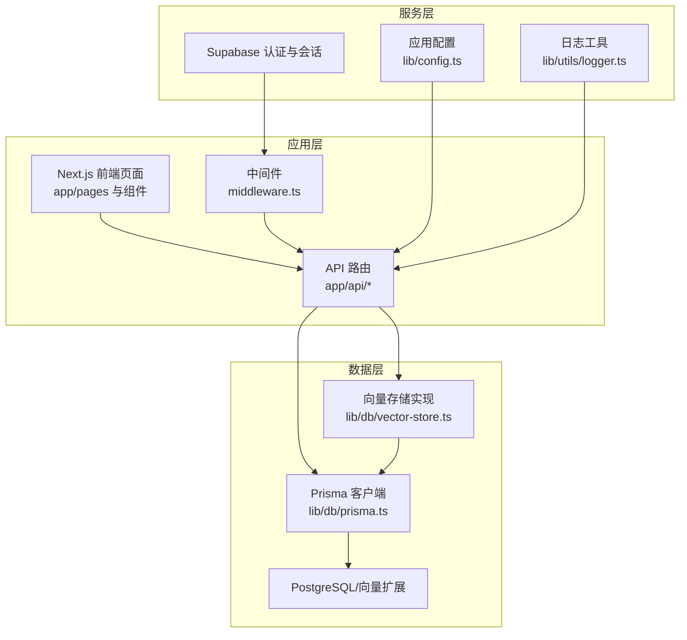
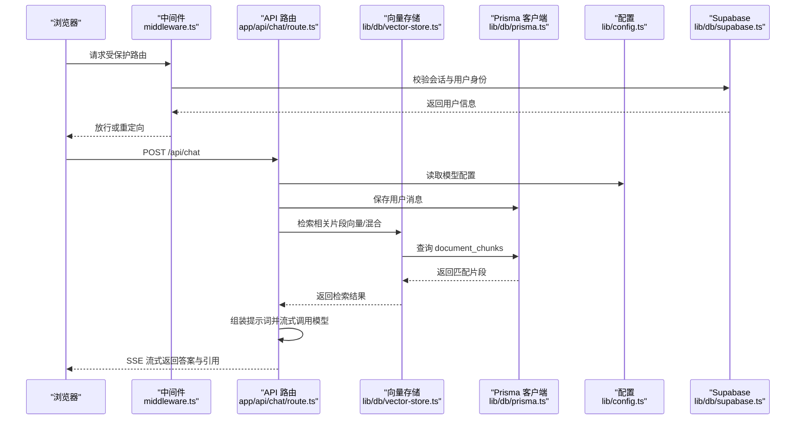
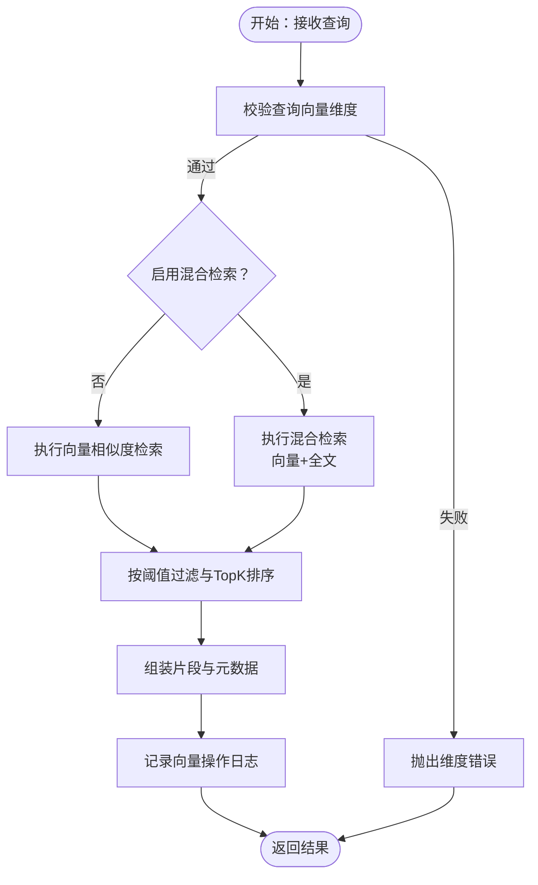
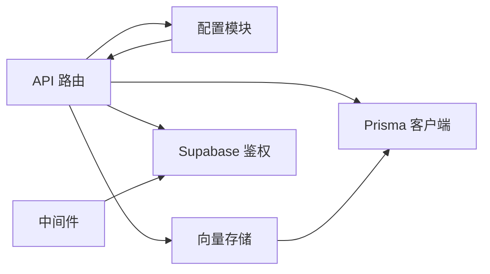

# 部署与运维

<cite>
**本文引用的文件**
- [package.json](file://package.json)
- [next.config.js](file://next.config.js)
- [prisma.config.ts](file://prisma.config.ts)
- [lib/config.ts](file://lib/config.ts)
- [lib/db/prisma.ts](file://lib/db/prisma.ts)
- [lib/db/supabase.ts](file://lib/db/supabase.ts)
- [lib/utils/logger.ts](file://lib/utils/logger.ts)
- [middleware.ts](file://middleware.ts)
- [lib/studio/index.ts](file://lib/studio/index.ts)
- [lib/processing/index.ts](file://lib/processing/index.ts)
- [app/api/notebooks/route.ts](file://app/api/notebooks/route.ts)
- [app/api/chat/route.ts](file://app/api/chat/route.ts)
- [lib/rag/retriever.ts](file://lib/rag/retriever.ts)
- [lib/db/vector-store.ts](file://lib/db/vector-store.ts)
</cite>

## 目录
1. [简介](#简介)
2. [项目结构](#项目结构)
3. [核心组件](#核心组件)
4. [架构总览](#架构总览)
5. [详细组件分析](#详细组件分析)
6. [依赖关系分析](#依赖关系分析)
7. [性能考量](#性能考量)
8. [故障排查指南](#故障排查指南)
9. [结论](#结论)
10. [附录](#附录)

## 简介
本文件面向 notebookLM-clone 项目的部署与运维，围绕容器化部署、微服务架构、负载均衡与高可用、生产环境部署流程、CI/CD 设计、监控与告警、运维最佳实践、故障排查方法、运维自动化工具以及团队培训与知识转移等方面进行系统化说明。文档严格基于仓库现有源码与配置文件进行分析与总结，避免臆测。

## 项目结构
该项目采用 Next.js 14 应用，前端与后端 API 通过 App Router 的 API 路由组织，数据库通过 Prisma 访问，Supabase 提供鉴权与会话能力，RAG 检索链路贯穿向量与全文检索，并通过中间件实现路由级鉴权保护。

图表来源
- [next.config.js](file://next.config.js#L1-L21)
- [lib/config.ts](file://lib/config.ts#L1-L187)
- [lib/db/prisma.ts](file://lib/db/prisma.ts#L1-L41)
- [lib/db/vector-store.ts](file://lib/db/vector-store.ts#L1-L446)
- [lib/db/supabase.ts](file://lib/db/supabase.ts#L1-L39)
- [middleware.ts](file://middleware.ts#L1-L78)
- [app/api/notebooks/route.ts](file://app/api/notebooks/route.ts#L1-L67)
- [app/api/chat/route.ts](file://app/api/chat/route.ts#L1-L324)

章节来源
- [package.json](file://package.json#L1-L82)
- [next.config.js](file://next.config.js#L1-L21)

## 核心组件
- 应用配置与模型提供方
  - 应用通过统一配置模块加载环境变量与模型参数，强制校验向量维度与必需环境变量，确保运行一致性与安全性。
- 数据库与连接池
  - 使用 Prisma 客户端与 Postgres 连接池适配器，针对 Serverless 环境给出连接池参数建议，降低并发连接压力。
- 向量存储与检索
  - 向量存储实现封装了批量插入、相似度检索与混合检索（向量+全文），并内置维度校验与日志记录。
- 中间件与鉴权
  - 基于 Supabase 的中间件实现受保护路由与登录状态校验，保障资源访问控制。
- 日志与可观测性
  - 统一日志工具在开发环境输出，生产环境仅输出错误级别；向量操作具备专用日志结构，便于追踪性能与异常。

章节来源
- [lib/config.ts](file://lib/config.ts#L1-L187)
- [lib/db/prisma.ts](file://lib/db/prisma.ts#L1-L41)
- [lib/db/vector-store.ts](file://lib/db/vector-store.ts#L1-L446)
- [middleware.ts](file://middleware.ts#L1-L78)
- [lib/utils/logger.ts](file://lib/utils/logger.ts#L1-L98)

## 架构总览
下图展示从浏览器到 API、数据库与外部模型提供方的整体调用链路，以及中间件与鉴权在其中的作用。

图表来源
- [middleware.ts](file://middleware.ts#L1-L78)
- [app/api/chat/route.ts](file://app/api/chat/route.ts#L1-L324)
- [lib/db/vector-store.ts](file://lib/db/vector-store.ts#L1-L446)
- [lib/db/prisma.ts](file://lib/db/prisma.ts#L1-L41)
- [lib/config.ts](file://lib/config.ts#L1-L187)
- [lib/db/supabase.ts](file://lib/db/supabase.ts#L1-L39)

## 详细组件分析

### 配置与环境管理
- 关键点
  - 强制校验向量维度与必需环境变量，防止运行期配置错误。
  - 模型提供方配置集中管理，支持动态切换与默认模型选择。
- 部署建议
  - 生产环境务必提供 .env.local 或等效机制，确保 DATABASE_URL、NEXT_PUBLIC_SUPABASE_*、ZHIPU_*、EMBEDDING_DIM 等变量完整。
  - 将敏感密钥纳入平台机密管理，避免硬编码。

章节来源
- [lib/config.ts](file://lib/config.ts#L1-L187)

### 数据库与连接池
- 关键点
  - 使用 PrismaPg 适配器与独立连接池，减少 Serverless 冻结前的事务未完成风险。
  - 开发与生产日志级别不同，降低生产噪音。
- 部署建议
  - Serverless 环境建议使用 Supabase Transaction Pooler（端口 6543），并设置连接池参数以限制并发连接数。
  - 数据库迁移与生成命令通过脚本统一入口，确保一致性。

章节来源
- [lib/db/prisma.ts](file://lib/db/prisma.ts#L1-L41)
- [prisma.config.ts](file://prisma.config.ts#L1-L20)
- [package.json](file://package.json#L5-L16)

### 向量存储与检索
- 关键点
  - 向量维度强制校验，防止与数据库 schema 不一致导致的查询失败。
  - 批量插入分批处理，提升吞吐并减少单次事务开销。
  - 相似度检索与混合检索均支持按来源过滤与阈值控制。
- 性能与可靠性
  - 使用 CTE 减少重复计算，SQL 层面进行排序与过滤。
  - 向量操作具备专用日志，记录耗时、命中数量与平均相似度，便于性能分析。

图表来源
- [lib/db/vector-store.ts](file://lib/db/vector-store.ts#L175-L297)
- [lib/db/vector-store.ts](file://lib/db/vector-store.ts#L312-L442)
- [lib/utils/logger.ts](file://lib/utils/logger.ts#L75-L94)

章节来源
- [lib/db/vector-store.ts](file://lib/db/vector-store.ts#L1-L446)
- [lib/rag/retriever.ts](file://lib/rag/retriever.ts#L1-L206)
- [lib/utils/logger.ts](file://lib/utils/logger.ts#L1-L98)

### 中间件与鉴权
- 关键点
  - 受保护路由与认证路由分离，未登录访问受保护路由将被重定向至登录页。
  - 会话过期场景携带参数提示，改善用户体验。
- 部署建议
  - 确保 NEXT_PUBLIC_SUPABASE_URL 与匿名密钥正确配置，避免中间件无法初始化会话客户端。

章节来源
- [middleware.ts](file://middleware.ts#L1-L78)
- [lib/db/supabase.ts](file://lib/db/supabase.ts#L1-L39)

### API 路由与流式响应
- 关键点
  - Chat API 支持流式返回，结合 SSE 将引用信息作为特殊标记追加在流末尾。
  - 并行执行用户消息保存与检索，缩短首字节时间。
  - 模型调用根据提供方差异构造请求体，兼容不同 API 协议。
- 部署建议
  - Serverless 环境对最大执行时长有限制，需合理控制上下文大小与检索 TopK。
  - 控制台日志仅在开发环境输出，生产环境通过专用日志通道收集。

章节来源
- [app/api/chat/route.ts](file://app/api/chat/route.ts#L1-L324)
- [lib/config.ts](file://lib/config.ts#L1-L187)

### 文档处理与 Studio 导出
- 关键点
  - 文档处理模块统一导出文本切分、PDF/网页解析、Embedding 生成与主流程编排。
  - Studio 模块导出生成产物、提示词与解析器，支撑多种产出类型。
- 部署建议
  - 处理流程中的 Token 估算与分块策略需与模型上下文长度匹配，避免超限。

章节来源
- [lib/processing/index.ts](file://lib/processing/index.ts#L1-L51)
- [lib/studio/index.ts](file://lib/studio/index.ts#L1-L25)

## 依赖关系分析
- 组件耦合
  - API 路由依赖配置、Supabase 鉴权、Prisma 与向量存储。
  - 向量存储依赖 Prisma 与配置中的维度常量。
  - 中间件依赖 Supabase 客户端与路由匹配规则。
- 外部依赖
  - Supabase 提供认证与会话；PostgreSQL 与向量扩展承载结构化数据与向量索引。
  - 模型提供方（如 Zhipu/LongCat）通过配置注入，API 路由按提供方差异化调用。

图表来源
- [app/api/chat/route.ts](file://app/api/chat/route.ts#L1-L324)
- [lib/db/vector-store.ts](file://lib/db/vector-store.ts#L1-L446)
- [lib/db/prisma.ts](file://lib/db/prisma.ts#L1-L41)
- [lib/db/supabase.ts](file://lib/db/supabase.ts#L1-L39)
- [lib/config.ts](file://lib/config.ts#L1-L187)
- [middleware.ts](file://middleware.ts#L1-L78)

章节来源
- [app/api/notebooks/route.ts](file://app/api/notebooks/route.ts#L1-L67)
- [app/api/chat/route.ts](file://app/api/chat/route.ts#L1-L324)
- [lib/db/vector-store.ts](file://lib/db/vector-store.ts#L1-L446)
- [lib/db/prisma.ts](file://lib/db/prisma.ts#L1-L41)
- [lib/db/supabase.ts](file://lib/db/supabase.ts#L1-L39)
- [lib/config.ts](file://lib/config.ts#L1-L187)
- [middleware.ts](file://middleware.ts#L1-L78)

## 性能考量
- 连接池与并发
  - Serverless 环境建议使用 Supabase Transaction Pooler 并限制每个实例连接数，避免连接争用。
- 向量检索
  - 使用 CTE 与阈值过滤减少扫描范围；按来源过滤进一步缩小搜索空间。
  - 批量插入分批处理，避免单次事务过大。
- 流式响应
  - 并行执行检索与消息保存，缩短首字节时间；流式传输避免一次性缓冲大量数据。
- 上下文与 Token
  - 检索 TopK 与相似度阈值需与模型上下文长度匹配，避免超限与性能退化。

章节来源
- [lib/db/prisma.ts](file://lib/db/prisma.ts#L8-L16)
- [lib/db/vector-store.ts](file://lib/db/vector-store.ts#L175-L297)
- [lib/db/vector-store.ts](file://lib/db/vector-store.ts#L312-L442)
- [app/api/chat/route.ts](file://app/api/chat/route.ts#L70-L96)

## 故障排查指南
- 常见问题定位
  - 未登录或会话过期：检查中间件重定向逻辑与 Supabase 会话状态。
  - 数据库连接失败：核对 DATABASE_URL 与连接池参数；确认 Serverless 环境端口与连接限制。
  - 向量维度不一致：检查 EMBEDDING_DIM 与数据库向量维度是否匹配。
  - 模型调用失败：确认模型提供方 API Key 与基础地址配置正确。
- 日志与观测
  - 开发环境可查看控制台日志；生产环境通过专用日志通道收集向量操作日志与错误信息。
- 快速恢复
  - 若出现检索异常，优先检查阈值与 TopK 设置；必要时临时放宽阈值验证问题来源。

章节来源
- [middleware.ts](file://middleware.ts#L55-L68)
- [lib/db/prisma.ts](file://lib/db/prisma.ts#L8-L16)
- [lib/config.ts](file://lib/config.ts#L17-L29)
- [lib/utils/logger.ts](file://lib/utils/logger.ts#L75-L94)
- [app/api/chat/route.ts](file://app/api/chat/route.ts#L193-L206)

## 结论
本项目在架构上以 Next.js API 路由为核心，结合 Supabase 鉴权、Prisma 数据访问与 PostgreSQL 向量扩展，形成清晰的前后端分离与数据层抽象。通过严格的配置校验、连接池优化与向量检索优化，能够在 Serverless 环境中保持较好的性能与稳定性。建议在生产环境中完善 CI/CD、监控告警与运维自动化体系，以确保持续交付与长期可维护性。

## 附录

### 生产环境部署流程（建议）
- 环境准备
  - 准备域名与 SSL 证书；配置 CDN 与 WAF（如需）。
  - 准备数据库实例（推荐托管 PostgreSQL + 向量扩展），并配置连接池参数。
  - 准备 Supabase 项目，配置认证与匿名密钥。
- 依赖安装与数据库初始化
  - 安装依赖并生成 Prisma 客户端；执行数据库迁移与初始化种子数据。
- 应用启动
  - 配置环境变量（DATABASE_URL、NEXT_PUBLIC_SUPABASE_*、ZHIPU_*、EMBEDDING_DIM 等）。
  - 构建并启动应用；验证中间件鉴权与 API 路由连通性。
- 高可用与负载均衡
  - 使用反向代理或平台提供的负载均衡；配置健康检查与自动扩缩容。
  - 将静态资源与媒体文件托管于对象存储或 CDN，减少应用服务器压力。

章节来源
- [package.json](file://package.json#L5-L16)
- [prisma.config.ts](file://prisma.config.ts#L1-L20)
- [lib/config.ts](file://lib/config.ts#L169-L186)
- [lib/db/prisma.ts](file://lib/db/prisma.ts#L8-L16)
- [next.config.js](file://next.config.js#L1-L21)

### CI/CD 流程设计（建议）
- 自动化构建
  - 触发条件：合并到主分支或打标签。
  - 步骤：安装依赖、类型检查、构建、单元/集成测试。
- 部署流水线
  - 预发布：部署到预发布环境，执行端到端测试。
  - 生产发布：蓝绿/金丝雀发布，逐步切换流量。
- 回滚策略
  - 记录镜像版本与部署时间；一键回滚至上一个稳定版本。
  - 回滚时同步回滚数据库迁移（如需要）。

章节来源
- [package.json](file://package.json#L5-L16)

### 监控与告警（建议）
- 应用监控
  - 指标：请求延迟、错误率、并发数、向量操作耗时与成功率。
  - 日志：统一采集向量操作日志与错误堆栈。
- 基础设施监控
  - 指标：CPU/内存/连接数/队列长度；数据库慢查询与连接池饱和。
- 业务监控
  - 指标：RAG 命中率、平均检索耗时、生成耗时、引用完整性。
- 告警规则
  - 错误率突增、延迟超过阈值、数据库连接池耗尽、向量维度不一致事件。

章节来源
- [lib/utils/logger.ts](file://lib/utils/logger.ts#L75-L94)
- [lib/db/vector-store.ts](file://lib/db/vector-store.ts#L143-L172)
- [lib/db/vector-store.ts](file://lib/db/vector-store.ts#L268-L295)

### 运维最佳实践（建议）
- 日志管理
  - 生产环境仅输出错误级别日志，向量操作单独记录结构化日志。
- 备份策略
  - 数据库定期备份与快照；保留迁移历史以便回溯。
- 安全加固
  - 最小权限原则；密钥轮换；HTTPS 强制；CORS 与图片域名白名单。
- 性能调优
  - 调整 TopK 与阈值；优化分块策略；缓存热点查询结果（如可行）。

章节来源
- [lib/utils/logger.ts](file://lib/utils/logger.ts#L29-L54)
- [lib/config.ts](file://lib/config.ts#L160-L166)
- [next.config.js](file://next.config.js#L4-L12)

### 运维自动化工具（建议）
- 基础设施即代码（IaC）
  - 使用 Terraform/CloudFormation/ARM 模板定义数据库、网络与 CDN。
- 配置管理
  - 使用平台机密与环境变量管理器，避免明文配置。
- 服务发现
  - 通过平台提供的服务网格或负载均衡实现服务发现与健康检查。

### 运维团队培训与知识转移（建议）
- 培训内容
  - 架构与关键组件职责；部署流程与回滚策略；监控指标与告警规则；常见故障排查步骤。
- 知识转移
  - 编写 SOP 文档与演练手册；建立值班与交接制度；定期进行故障演练。