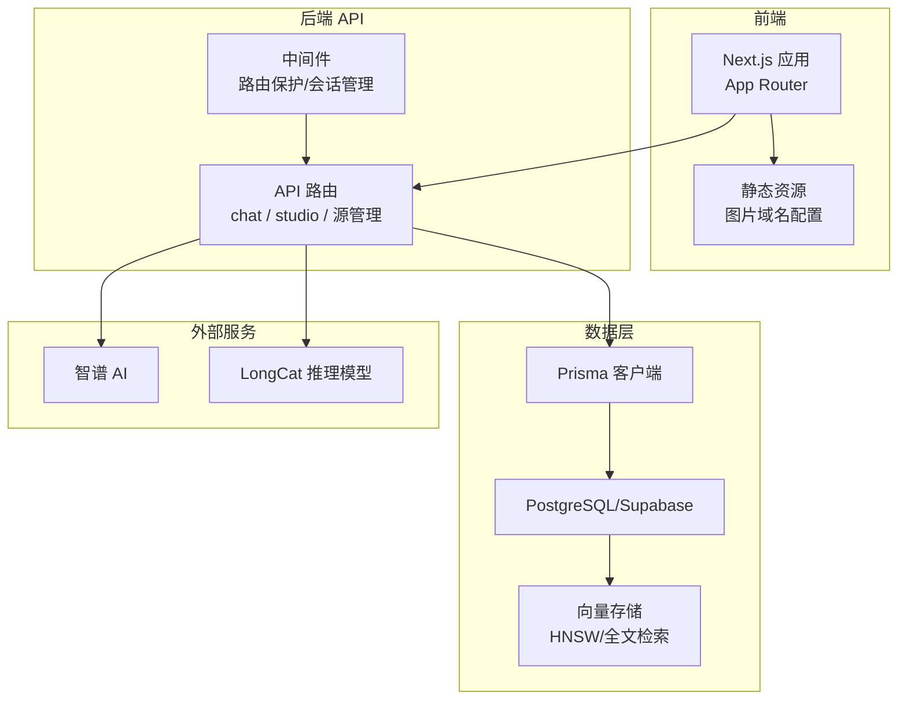
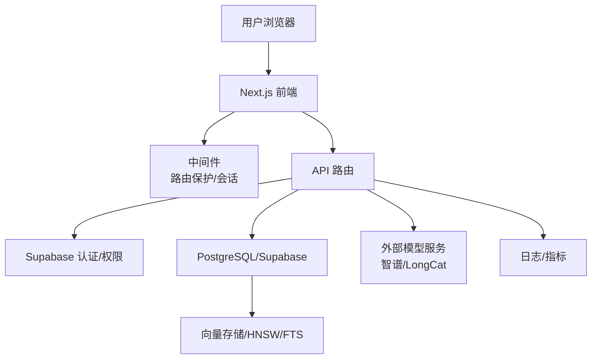
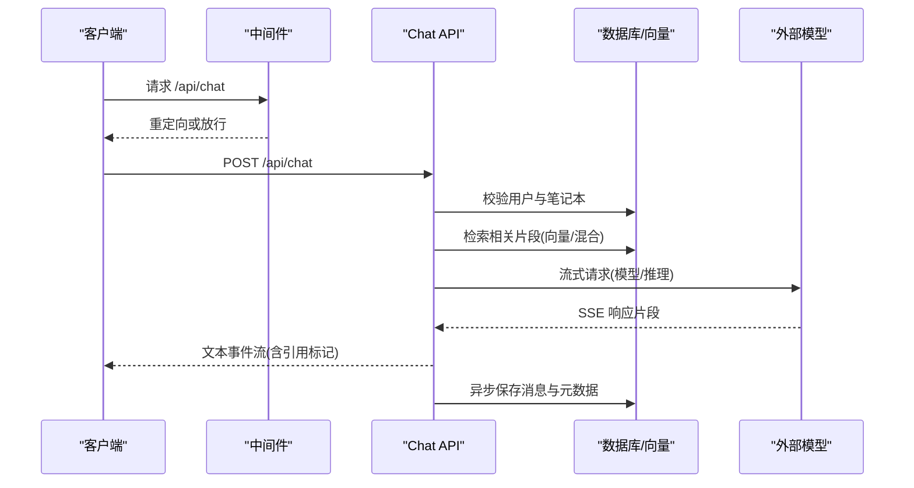
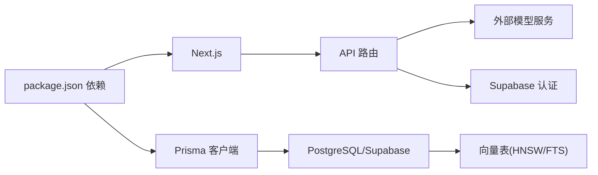

# 部署架构设计

<cite>
**本文档引用的文件**
- [next.config.js](file://next.config.js)
- [package.json](file://package.json)
- [prisma.config.ts](file://prisma.config.ts)
- [lib/config.ts](file://lib/config.ts)
- [middleware.ts](file://middleware.ts)
- [lib/db/supabase.ts](file://lib/db/supabase.ts)
- [lib/db/vector-store.ts](file://lib/db/vector-store.ts)
- [lib/db/prisma.ts](file://lib/db/prisma.ts)
- [app/api/chat/route.ts](file://app/api/chat/route.ts)
- [lib/studio/generator.ts](file://lib/studio/generator.ts)
</cite>

## 目录
1. [引言](#引言)
2. [项目结构](#项目结构)
3. [核心组件](#核心组件)
4. [架构总览](#架构总览)
5. [详细组件分析](#详细组件分析)
6. [依赖关系分析](#依赖关系分析)
7. [性能考量](#性能考量)
8. [故障排查指南](#故障排查指南)
9. [结论](#结论)
10. [附录](#附录)

## 引言
本文件面向 notebookLM-clone 项目的部署架构设计，围绕前端静态资源部署、API 服务部署、数据库与外部服务集成展开，结合 Next.js 应用的构建与运行配置、微服务化设计原则、负载均衡与高可用策略、容器化与 Kubernetes 编排以及网络与安全配置，提供可落地的部署指导。

## 项目结构
该项目采用 Next.js 14 应用，采用 App Router 结构，API 路由位于 app/api 下，数据库通过 Prisma 与 PostgreSQL/Supabase 连接，AI 服务通过外部模型提供商（如智谱、LongCat）进行推理与嵌入。

图表来源
- [next.config.js](file://next.config.js#L4-L12)
- [middleware.ts](file://middleware.ts#L15-L71)
- [lib/db/prisma.ts](file://lib/db/prisma.ts#L23-L34)
- [lib/db/vector-store.ts](file://lib/db/vector-store.ts#L77-L446)
- [app/api/chat/route.ts](file://app/api/chat/route.ts#L25-L323)
- [lib/studio/generator.ts](file://lib/studio/generator.ts#L53-L115)

章节来源
- [next.config.js](file://next.config.js#L1-L21)
- [package.json](file://package.json#L1-L82)
- [middleware.ts](file://middleware.ts#L1-L78)

## 核心组件
- 前端静态资源与图片域名：Next.js 图片优化与远程图片域名白名单配置，支持本地与 Supabase 存储的图片访问。
- API 服务：基于 App Router 的 API 路由，实现聊天、检索、Studio 生成等能力；使用中间件进行路由保护与会话同步。
- 数据库与向量存储：Prisma 客户端通过 Postgres/Supabase 连接，向量存储采用 HNSW 与全文检索（TSV），支持混合检索与去重。
- 外部模型服务：通过智谱与 LongCat 提供对话与推理能力，支持流式输出与超时控制。

章节来源
- [next.config.js](file://next.config.js#L4-L17)
- [middleware.ts](file://middleware.ts#L15-L71)
- [lib/db/vector-store.ts](file://lib/db/vector-store.ts#L77-L446)
- [app/api/chat/route.ts](file://app/api/chat/route.ts#L25-L323)
- [lib/studio/generator.ts](file://lib/studio/generator.ts#L53-L115)

## 架构总览
整体采用“前端静态 + 服务端 API + 数据库/向量”的三层架构。前端通过 Next.js 构建并托管静态资源，API 层负责业务逻辑与外部服务交互，数据层负责结构化数据与向量检索。

图表来源
- [middleware.ts](file://middleware.ts#L15-L71)
- [lib/db/supabase.ts](file://lib/db/supabase.ts#L12-L33)
- [lib/db/vector-store.ts](file://lib/db/vector-store.ts#L77-L446)
- [app/api/chat/route.ts](file://app/api/chat/route.ts#L25-L323)
- [lib/studio/generator.ts](file://lib/studio/generator.ts#L53-L115)

## 详细组件分析

### 前端静态资源与 Next.js 配置
- 图片域名配置：允许 localhost 与 Supabase 域名访问，确保图片资源加载安全可控。
- 实验性功能：启用服务器端动作（Server Actions）并设置上传体大小上限，满足大文件上传场景。
- 构建与运行：通过 package.json 的脚本进行开发、构建与启动，Prisma 在安装后自动生成客户端。

章节来源
- [next.config.js](file://next.config.js#L4-L17)
- [package.json](file://package.json#L5-L16)
- [prisma.config.ts](file://prisma.config.ts#L6-L19)

### 中间件与路由保护
- 保护路径：对笔记本相关路径进行登录保护，未登录用户访问将被重定向至登录页。
- 登录状态：通过 Supabase SSR 客户端刷新会话，维护 Cookie 同步。
- 匹配器：排除静态资源与特定文件，减少中间件处理开销。

章节来源
- [middleware.ts](file://middleware.ts#L9-L71)

### API 服务与聊天流程
- 请求入口：POST /api/chat，接收消息、笔记本 ID、源选择与模式（fast/precise）。
- 权限校验：通过 Supabase 获取当前用户，并验证笔记本所有权。
- 检索策略：支持向量检索与混合检索（向量 + 全文），并进行去重与引用构建。
- 流式输出：调用外部模型 API，使用 TransformStream 将流式响应透传给客户端，结束时附加引用信息与检索详情。
- 超时与日志：严格控制最大执行时间，记录检索与生成耗时，便于监控与优化。

图表来源
- [middleware.ts](file://middleware.ts#L15-L71)
- [app/api/chat/route.ts](file://app/api/chat/route.ts#L25-L323)
- [lib/db/supabase.ts](file://lib/db/supabase.ts#L12-L33)
- [lib/db/vector-store.ts](file://lib/db/vector-store.ts#L175-L297)

章节来源
- [app/api/chat/route.ts](file://app/api/chat/route.ts#L25-L323)

### Studio 生成与内容策略
- 模式选择：fast（智能采样）与 precise（Map-Reduce）两种模式，分别适用于快速与高质量生成。
- 上下文采样：根据类型与源集合智能截取与拼接上下文，避免超出 Token 限制。
- 解析与回退：对生成结果进行结构化解析（如测验、思维导图），失败时保留原始内容并记录日志。
- 超时控制：不同阶段设置不同超时时间，保障长推理任务的稳定性。

章节来源
- [lib/studio/generator.ts](file://lib/studio/generator.ts#L120-L237)

### 数据库与向量存储
- 连接池：在 Serverless 环境下推荐使用 Supabase Transaction Pooler（端口 6543），并限制每实例连接数，降低并发压力。
- 向量维度：强制校验嵌入维度（1024），与数据库向量列保持一致，避免检索异常。
- 检索算法：支持向量相似度检索与混合检索（向量 + 全文），并提供去重与评分组合策略。
- 批量写入：按批次插入向量数据，减少单次事务压力，提升吞吐。

章节来源
- [lib/db/prisma.ts](file://lib/db/prisma.ts#L8-L16)
- [lib/db/prisma.ts](file://lib/db/prisma.ts#L23-L34)
- [lib/config.ts](file://lib/config.ts#L6-L29)
- [lib/db/vector-store.ts](file://lib/db/vector-store.ts#L77-L446)

### 外部服务集成
- 模型提供商：支持智谱与 LongCat，统一通过配置中心选择模型与基础地址，兼容不同响应字段。
- 流式与超时：外部调用采用流式传输与超时控制，保障用户体验与资源占用。

章节来源
- [lib/config.ts](file://lib/config.ts#L46-L52)
- [lib/studio/generator.ts](file://lib/studio/generator.ts#L53-L115)
- [app/api/chat/route.ts](file://app/api/chat/route.ts#L174-L200)

## 依赖关系分析
- 前端依赖：Next.js、Tailwind、Radix UI、React 生态，以及 Prisma 生成的客户端。
- 数据依赖：Prisma 客户端 → Postgres/Supabase → 向量表（HNSW/FTS）。
- 外部依赖：Supabase（认证/权限）、智谱/LongCat（推理与嵌入）。
- 配置依赖：环境变量驱动模型选择、数据库连接、图片域名与上传限制。

图表来源
- [package.json](file://package.json#L17-L64)
- [lib/db/prisma.ts](file://lib/db/prisma.ts#L23-L34)
- [lib/db/vector-store.ts](file://lib/db/vector-store.ts#L77-L446)
- [lib/config.ts](file://lib/config.ts#L32-L52)

章节来源
- [package.json](file://package.json#L17-L64)

## 性能考量
- 构建优化：开启 React 严格模式与图片域名白名单，减少不必要的渲染与跨域请求。
- 数据库连接：Serverless 环境使用连接池与限制连接数，避免瞬时高并发导致的连接耗尽。
- 检索优化：向量检索与混合检索结合，批量插入与去重策略降低 IO 与重复计算。
- 流式输出：SSE 流式传输减少首字节延迟，提升交互体验。
- 超时与降级：为长推理任务设置超时，必要时返回兜底回复，避免长时间占用资源。

章节来源
- [next.config.js](file://next.config.js#L3-L17)
- [lib/db/prisma.ts](file://lib/db/prisma.ts#L8-L16)
- [lib/db/vector-store.ts](file://lib/db/vector-store.ts#L105-L173)
- [app/api/chat/route.ts](file://app/api/chat/route.ts#L22-L23)
- [lib/studio/generator.ts](file://lib/studio/generator.ts#L23-L26)

## 故障排查指南
- 环境变量缺失：应用启动前会校验必需变量，若缺失将抛出明确错误，需检查 .env.local。
- 向量维度不一致：当 EMBEDDING_DIM 与数据库向量维度不匹配时，启动即报错，需调整配置或迁移数据库。
- 权限校验失败：Supabase 用户为空或资源归属不符将返回 401/403，需检查会话与所有权。
- 外部模型错误：流式响应非 200 时记录错误并返回 JSON，需检查 API Key、模型与网络连通性。
- 数据库连接问题：Serverless 环境下连接池参数不当可能导致连接失败，需参考连接池配置建议。

章节来源
- [lib/config.ts](file://lib/config.ts#L169-L186)
- [lib/config.ts](file://lib/config.ts#L6-L29)
- [lib/db/supabase.ts](file://lib/db/supabase.ts#L22-L33)
- [app/api/chat/route.ts](file://app/api/chat/route.ts#L202-L206)

## 结论
本项目采用清晰的前后端分离与数据层架构，结合外部模型服务实现 RAG 问答与内容生成。通过严格的配置校验、连接池与检索优化、流式输出与超时控制，能够在 Serverless 环境下稳定运行。建议在生产环境中完善监控告警、自动扩缩容与灾备策略，并持续优化检索与生成链路以提升性能与成本效率。

## 附录

### 部署要点清单
- 前端：Next.js 构建产物托管于 CDN 或静态托管平台，确保图片域名与实验性功能配置正确。
- API：Serverless 部署（如 Vercel），注意最大执行时间与冷启动；中间件仅处理必要路径。
- 数据库：使用 Supabase Transaction Pooler（端口 6543），限制每实例连接数；定期迁移与索引优化。
- 外部服务：配置模型提供商 API Key 与基础地址，启用流式输出与超时控制。
- 安全：中间件进行路由保护，Cookie 同步，HTTPS 与 CDN 加速，防火墙仅开放必要端口。

### 微服务拆分建议
- API 服务：保持单一职责，聊天、Studio、源管理等作为独立路由模块，便于独立扩展。
- 数据服务：向量检索与全文检索封装为独立模块，支持多模型与多租户隔离。
- 外部服务：模型提供商抽象为统一接口，支持动态切换与熔断降级。

### 负载均衡与高可用
- 请求路由：基于路径与方法的路由规则，结合中间件进行权限与会话处理。
- 健康检查：API 路由暴露最小健康端点，数据库与外部服务增加探针。
- 故障转移：外部模型提供者可配置备用地址与超时策略，数据库使用连接池与只读副本。

### 容器化与 Kubernetes 编排
- 镜像构建：基于 Node.js 运行时，安装依赖后构建 Next.js，使用多阶段镜像减小体积。
- 服务编排：Frontend 与 API 服务分别部署，共享数据库与缓存；为 API 服务配置水平自动扩缩容。
- 配置管理：Secrets 管理 API Key，ConfigMap 管理 Next.js 与 Prisma 配置。

### 网络与安全
- 防火墙：仅开放 80/443，内部数据库端口仅对内网开放。
- SSL 证书：CDN/边缘节点终止 TLS，后端服务使用内网通信。
- CDN 加速：静态资源与图片通过 CDN 缓存，减少源站压力。