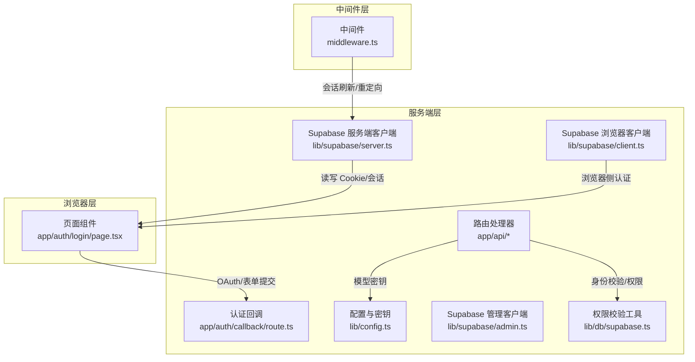
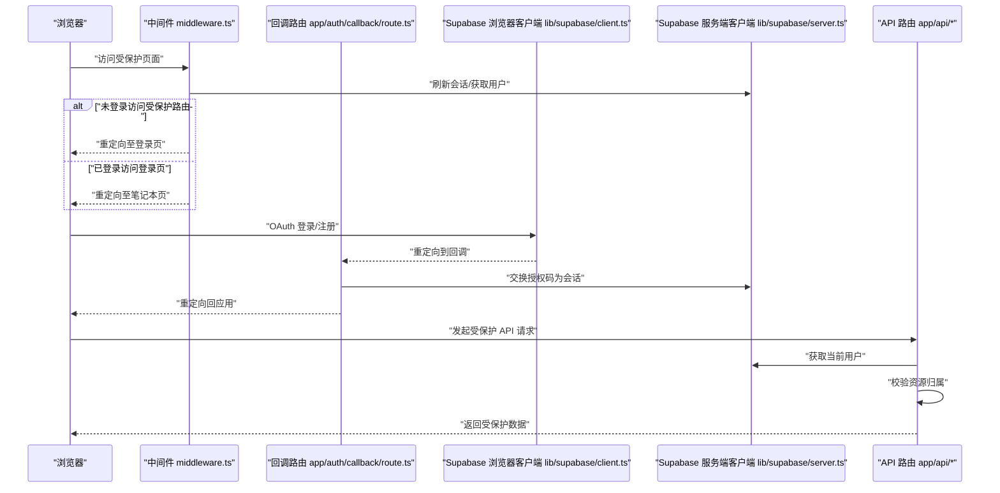
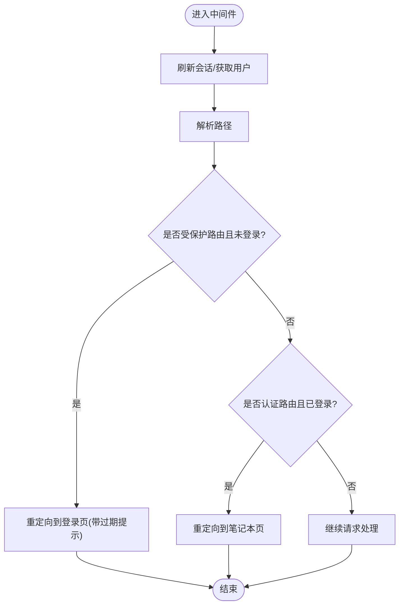
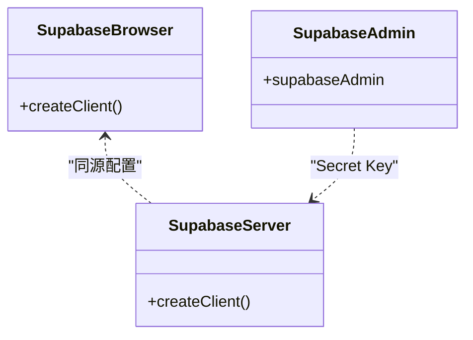
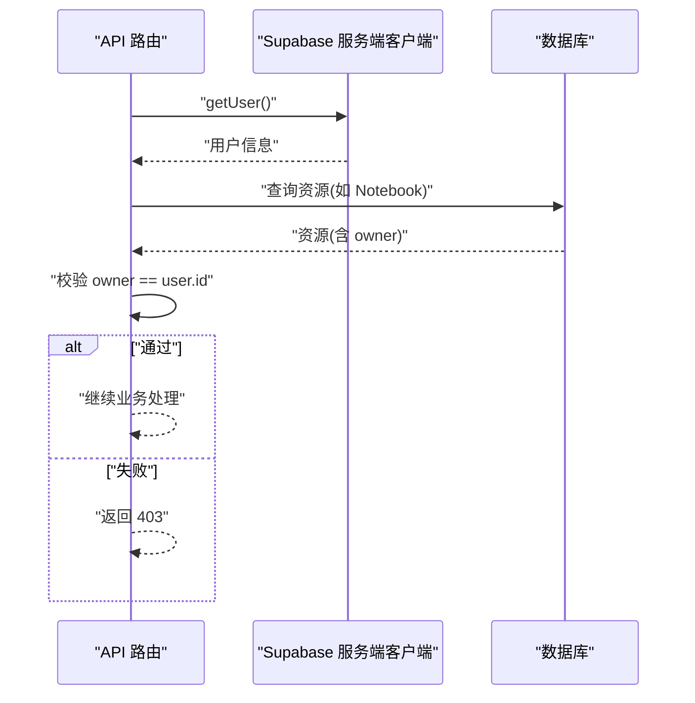
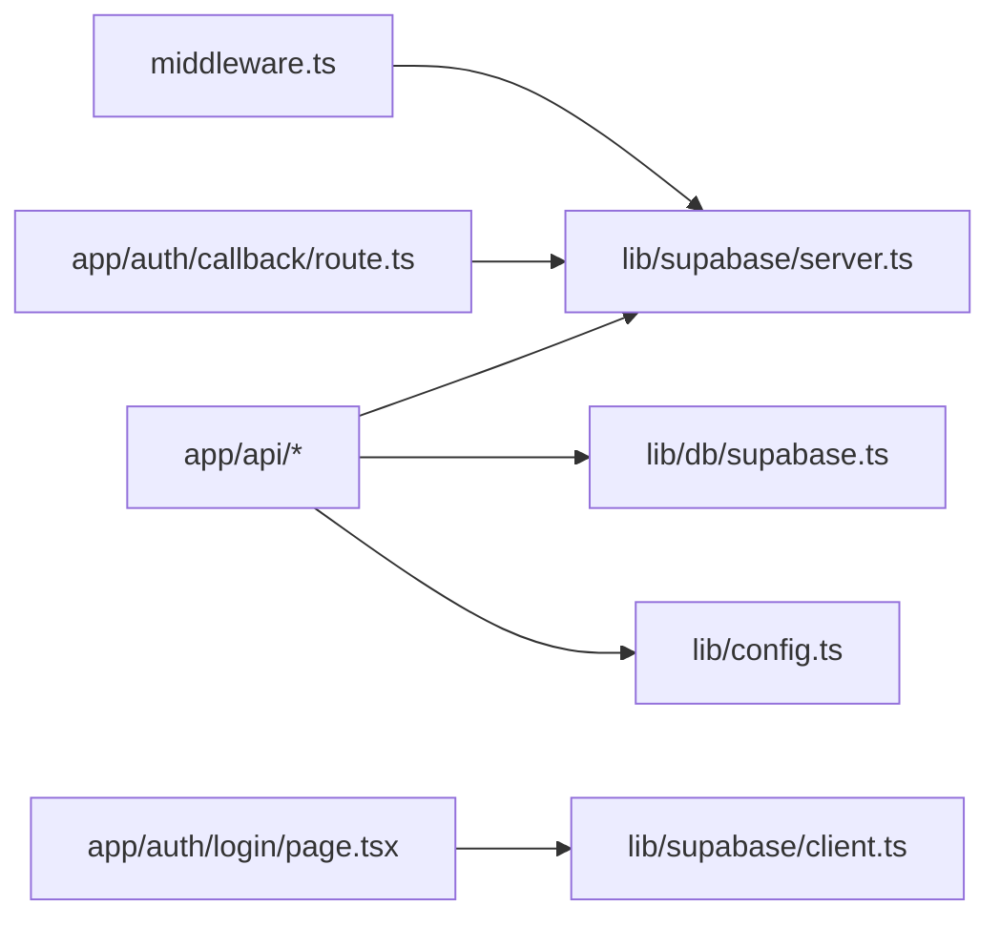

# 安全配置

<cite>
**本文引用的文件**
- [middleware.ts](file://middleware.ts)
- [next.config.js](file://next.config.js)
- [lib/config.ts](file://lib/config.ts)
- [lib/supabase/server.ts](file://lib/supabase/server.ts)
- [lib/supabase/client.ts](file://lib/supabase/client.ts)
- [lib/supabase/admin.ts](file://lib/supabase/admin.ts)
- [lib/db/supabase.ts](file://lib/db/supabase.ts)
- [app/auth/login/page.tsx](file://app/auth/login/page.tsx)
- [app/auth/callback/route.ts](file://app/auth/callback/route.ts)
- [app/api/chat/route.ts](file://app/api/chat/route.ts)
- [app/api/notebooks/route.ts](file://app/api/notebooks/route.ts)
- [app/api/cron/process-queue/route.ts](file://app/api/cron/process-queue/route.ts)
- [lib/utils/logger.ts](file://lib/utils/logger.ts)
</cite>

## 目录
1. [引言](#引言)
2. [项目结构](#项目结构)
3. [核心组件](#核心组件)
4. [架构总览](#架构总览)
5. [详细组件分析](#详细组件分析)
6. [依赖关系分析](#依赖关系分析)
7. [性能考量](#性能考量)
8. [故障排查指南](#故障排查指南)
9. [结论](#结论)
10. [附录](#附录)

## 引言
本文件聚焦于本项目的“安全配置管理”，围绕以下目标展开：
- CORS 配置策略：跨域请求控制、预检请求处理与安全头设置现状与建议
- HTTPS 配置要求：SSL/TLS 证书管理、安全连接建立与混合内容处理
- API 密钥管理最佳实践：密钥存储、访问控制与轮换策略
- 中间件安全配置：认证中间件、权限验证与请求过滤
- 安全头配置指南：CSP、HSTS、X-Frame-Options 等安全头的设置与作用
- 审计与监控：日志记录、错误处理与常见安全漏洞的防护

## 项目结构
本项目基于 Next.js，采用中间件进行路由级认证与会话刷新；认证与权限通过 Supabase 实现；API 路由在服务端执行并进行用户身份与资源所有权校验；部分第三方模型提供商通过环境变量注入密钥。

图表来源
- [middleware.ts](file://middleware.ts#L15-L71)
- [app/auth/login/page.tsx](file://app/auth/login/page.tsx#L17-L84)
- [app/auth/callback/route.ts](file://app/auth/callback/route.ts#L9-L25)
- [lib/db/supabase.ts](file://lib/db/supabase.ts#L12-L33)
- [lib/supabase/server.ts](file://lib/supabase/server.ts#L9-L32)
- [lib/supabase/client.ts](file://lib/supabase/client.ts#L8-L13)
- [lib/supabase/admin.ts](file://lib/supabase/admin.ts#L9-L17)
- [lib/config.ts](file://lib/config.ts#L32-L52)

章节来源
- [middleware.ts](file://middleware.ts#L15-L71)
- [lib/db/supabase.ts](file://lib/db/supabase.ts#L12-L33)
- [lib/supabase/server.ts](file://lib/supabase/server.ts#L9-L32)
- [lib/supabase/client.ts](file://lib/supabase/client.ts#L8-L13)
- [lib/supabase/admin.ts](file://lib/supabase/admin.ts#L9-L17)
- [lib/config.ts](file://lib/config.ts#L32-L52)

## 核心组件
- 中间件认证与会话刷新：统一拦截请求，刷新 Supabase 会话，对受保护路由与认证路由进行重定向控制
- Supabase 客户端体系：浏览器端、服务端、管理端三类客户端，分别用于不同场景下的认证与数据访问
- 权限校验工具：统一的当前用户 ID 获取与资源所有权校验
- API 路由安全：在路由中进行用户身份校验、资源归属校验与错误处理
- 配置与密钥：集中管理 Supabase 与模型提供商密钥，提供环境变量校验

章节来源
- [middleware.ts](file://middleware.ts#L15-L71)
- [lib/supabase/server.ts](file://lib/supabase/server.ts#L9-L32)
- [lib/supabase/client.ts](file://lib/supabase/client.ts#L8-L13)
- [lib/supabase/admin.ts](file://lib/supabase/admin.ts#L9-L17)
- [lib/db/supabase.ts](file://lib/db/supabase.ts#L12-L33)
- [lib/config.ts](file://lib/config.ts#L32-L52)

## 架构总览
下图展示从浏览器到服务端的关键交互路径，以及认证与权限校验的落点。

图表来源
- [middleware.ts](file://middleware.ts#L15-L71)
- [app/auth/callback/route.ts](file://app/auth/callback/route.ts#L9-L25)
- [lib/supabase/client.ts](file://lib/supabase/client.ts#L8-L13)
- [lib/supabase/server.ts](file://lib/supabase/server.ts#L9-L32)
- [app/api/notebooks/route.ts](file://app/api/notebooks/route.ts#L12-L41)

## 详细组件分析

### 中间件安全配置（认证与权限过滤）
- 受保护路由与认证路由定义：对特定路径进行访问控制
- 会话刷新与用户状态获取：通过 Supabase 服务端客户端刷新会话并判断用户状态
- 重定向逻辑：未登录访问受保护路由跳转登录页；已登录访问登录页跳转笔记本页
- 匹配器：对静态资源与媒体文件放行，减少不必要的中间件开销

图表来源
- [middleware.ts](file://middleware.ts#L15-L71)

章节来源
- [middleware.ts](file://middleware.ts#L9-L13)
- [middleware.ts](file://middleware.ts#L40-L68)
- [middleware.ts](file://middleware.ts#L73-L77)

### Supabase 客户端与会话管理
- 浏览器端客户端：用于前端组件与浏览器侧操作
- 服务端客户端：用于 Server Components、Server Actions、Route Handlers，自动携带与更新 Cookie
- 管理端客户端：使用 Secret Key，绕过 RLS，仅用于服务端管理操作

图表来源
- [lib/supabase/client.ts](file://lib/supabase/client.ts#L8-L13)
- [lib/supabase/server.ts](file://lib/supabase/server.ts#L9-L32)
- [lib/supabase/admin.ts](file://lib/supabase/admin.ts#L9-L17)

章节来源
- [lib/supabase/client.ts](file://lib/supabase/client.ts#L8-L13)
- [lib/supabase/server.ts](file://lib/supabase/server.ts#L9-L32)
- [lib/supabase/admin.ts](file://lib/supabase/admin.ts#L9-L17)

### 权限校验与资源归属
- 当前用户 ID 获取：在服务端获取当前用户 ID，作为后续校验基础
- 资源归属校验：对 Notebook 等资源进行拥有者校验，防止越权访问
- API 路由中的统一校验：在路由入口处进行身份与归属校验

图表来源
- [lib/db/supabase.ts](file://lib/db/supabase.ts#L12-L33)
- [app/api/notebooks/route.ts](file://app/api/notebooks/route.ts#L12-L41)
- [app/api/chat/route.ts](file://app/api/chat/route.ts#L48-L60)

章节来源
- [lib/db/supabase.ts](file://lib/db/supabase.ts#L12-L33)
- [app/api/notebooks/route.ts](file://app/api/notebooks/route.ts#L12-L41)
- [app/api/chat/route.ts](file://app/api/chat/route.ts#L48-L60)

### API 密钥管理最佳实践
- 集中式配置：在配置模块中集中管理 Supabase 与模型提供商密钥
- 环境变量校验：启动时校验必需环境变量，缺失时报错
- 机密存储：密钥通过环境变量注入，不在代码仓库中硬编码
- 访问控制：管理端客户端使用 Secret Key，仅在服务端使用
- 轮换策略：建议通过 CI/CD 更新环境变量并滚动重启，确保平滑切换

章节来源
- [lib/config.ts](file://lib/config.ts#L32-L52)
- [lib/config.ts](file://lib/config.ts#L168-L186)
- [lib/supabase/admin.ts](file://lib/supabase/admin.ts#L9-L17)

### HTTPS 与安全连接
- 应用 URL：通过配置项指定应用 URL，用于回调与重定向
- 图片加载：限制图片域名与协议，仅允许受信域名与 HTTPS
- 建议：生产环境务必启用 HTTPS，强制 HSTS，禁用混合内容

章节来源
- [lib/config.ts](file://lib/config.ts#L160-L166)
- [next.config.js](file://next.config.js#L4-L12)

### CORS 配置策略
- 当前实现：未显式配置 CORS 中间件或响应头
- 建议：
  - 明确允许的来源、方法与头部
  - 对预检请求（OPTIONS）进行快速响应
  - 严格限制 Credentials 传递范围
  - 为 API 路由添加安全响应头

[本节为概念性指导，不直接分析具体文件，故无章节来源]

### 安全头配置指南
- Content-Security-Policy（CSP）：限制脚本来源、内联脚本与外链资源
- X-Frame-Options：防止点击劫持
- X-Content-Type-Options：阻止 MIME 类型嗅探
- Referrer-Policy：控制引用信息
- Permissions-Policy：声明功能授权
- HSTS：强制 HTTPS 连接
- 建议：在边缘或反向代理层统一注入，或在 Next.js 中间件/响应头中设置

[本节为概念性指导，不直接分析具体文件，故无章节来源]

### 审计与监控
- 日志策略：区分开发与生产环境的日志级别，避免敏感信息泄露
- 错误处理：在 API 路由中捕获异常并返回标准化错误
- 审计要点：记录登录/登出、资源访问、权限拒绝等关键事件

章节来源
- [lib/utils/logger.ts](file://lib/utils/logger.ts#L29-L54)
- [lib/utils/logger.ts](file://lib/utils/logger.ts#L75-L94)
- [app/api/chat/route.ts](file://app/api/chat/route.ts#L316-L323)

## 依赖关系分析
- 中间件依赖 Supabase 服务端客户端以刷新会话
- API 路由依赖 Supabase 服务端客户端与权限校验工具
- 配置模块集中管理密钥与应用 URL
- 浏览器端客户端用于 OAuth 与表单登录

图表来源
- [middleware.ts](file://middleware.ts#L22-L38)
- [app/api/chat/route.ts](file://app/api/chat/route.ts#L10-L11)
- [lib/db/supabase.ts](file://lib/db/supabase.ts#L12-L16)
- [lib/config.ts](file://lib/config.ts#L160-L166)
- [lib/supabase/client.ts](file://lib/supabase/client.ts#L8-L13)
- [app/auth/callback/route.ts](file://app/auth/callback/route.ts#L15-L16)

章节来源
- [middleware.ts](file://middleware.ts#L22-L38)
- [app/api/chat/route.ts](file://app/api/chat/route.ts#L10-L11)
- [lib/db/supabase.ts](file://lib/db/supabase.ts#L12-L16)
- [lib/config.ts](file://lib/config.ts#L160-L166)
- [lib/supabase/client.ts](file://lib/supabase/client.ts#L8-L13)
- [app/auth/callback/route.ts](file://app/auth/callback/route.ts#L15-L16)

## 性能考量
- 中间件匹配器：排除静态资源与媒体文件，降低中间件负担
- 异步并行：在 API 路由中并行获取用户与解析请求体，提升吞吐
- 流式响应：聊天接口采用流式返回，改善用户体验与首字延迟

章节来源
- [middleware.ts](file://middleware.ts#L73-L77)
- [app/api/chat/route.ts](file://app/api/chat/route.ts#L29-L33)
- [app/api/chat/route.ts](file://app/api/chat/route.ts#L308-L314)

## 故障排查指南
- 中间件重定向循环：检查受保护路由与认证路由的匹配规则
- 会话过期：中间件会在重定向链接中附加过期参数，前端据此提示
- API 401/403：确认用户已登录且资源归属校验通过
- 环境变量缺失：启动时会抛出错误，检查必需变量是否配置

章节来源
- [middleware.ts](file://middleware.ts#L56-L62)
- [app/auth/login/page.tsx](file://app/auth/login/page.tsx#L28-L33)
- [app/api/notebooks/route.ts](file://app/api/notebooks/route.ts#L14-L17)
- [lib/config.ts](file://lib/config.ts#L168-L186)

## 结论
本项目在认证与权限方面具备清晰的分层设计：中间件负责全局会话刷新与路由级访问控制，服务端客户端与权限工具保证资源归属校验，API 路由在入口处统一拦截未授权访问。建议在现有基础上补充 CORS 与安全头策略、HTTPS 强制与 HSTS、密钥轮换流程与审计日志，以进一步提升整体安全性与合规性。

## 附录
- 常见安全漏洞防护清单
  - 强制 HTTPS 与 HSTS
  - 设置严格的 CSP
  - 禁用不必要的安全头默认值
  - 限制与最小化 Cookie 属性
  - 严格校验与清理用户输入
  - 最小权限原则与最小暴露面
  - 定期轮换密钥与审计访问日志

[本节为通用指导，不直接分析具体文件，故无章节来源]