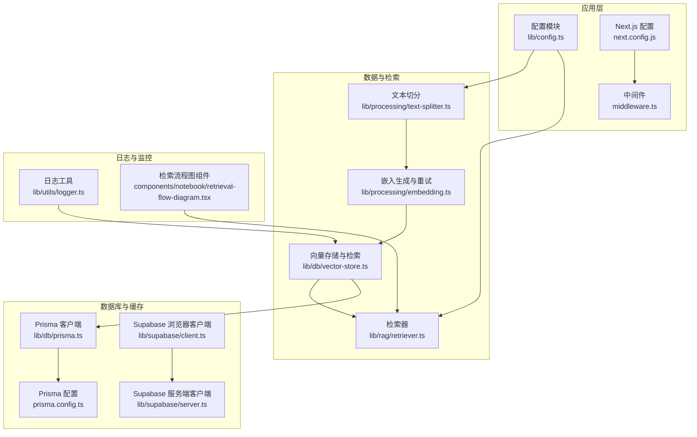
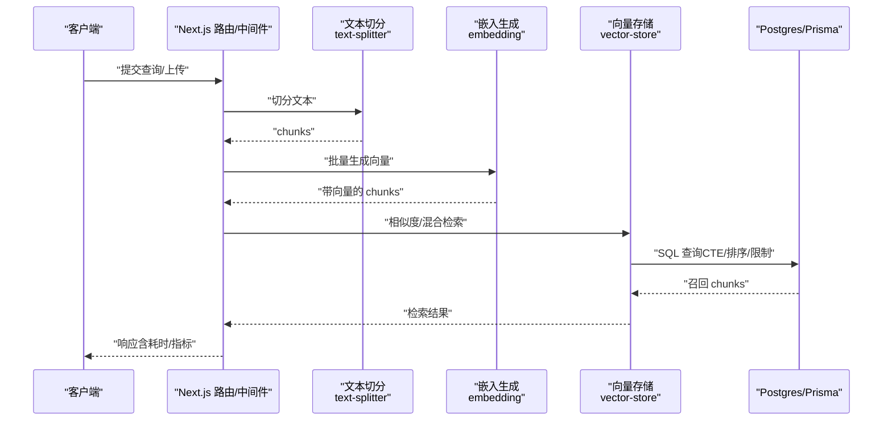
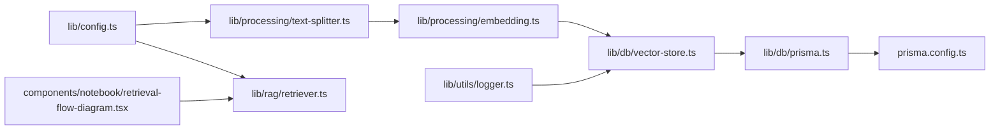

# 性能配置

<cite>
**本文引用的文件**
- [lib/config.ts](file://lib/config.ts)
- [next.config.js](file://next.config.js)
- [prisma.config.ts](file://prisma.config.ts)
- [lib/db/prisma.ts](file://lib/db/prisma.ts)
- [lib/utils/logger.ts](file://lib/utils/logger.ts)
- [lib/db/vector-store.ts](file://lib/db/vector-store.ts)
- [lib/rag/retriever.ts](file://lib/rag/retriever.ts)
- [lib/processing/text-splitter.ts](file://lib/processing/text-splitter.ts)
- [lib/processing/embedding.ts](file://lib/processing/embedding.ts)
- [lib/supabase/client.ts](file://lib/supabase/client.ts)
- [lib/supabase/server.ts](file://lib/supabase/server.ts)
- [middleware.ts](file://middleware.ts)
- [components/notebook/retrieval-flow-diagram.tsx](file://components/notebook/retrieval-flow-diagram.tsx)
- [package.json](file://package.json)
</cite>

## 目录
1. [简介](#简介)
2. [项目结构](#项目结构)
3. [核心组件](#核心组件)
4. [架构总览](#架构总览)
5. [详细组件分析](#详细组件分析)
6. [依赖关系分析](#依赖关系分析)
7. [性能考量](#性能考量)
8. [故障排查指南](#故障排查指南)
9. [结论](#结论)
10. [附录](#附录)

## 简介
本文件系统性梳理本项目的性能配置与调优实践，覆盖以下方面：
- 应用层性能配置：文件大小限制、分块大小、相似度阈值等
- 缓存策略：浏览器缓存、服务器缓存、数据库查询缓存
- 连接池配置：数据库连接数、超时与资源限制
- 日志级别与性能监控：日志开关、向量操作日志、耗时统计
- 性能监控与告警：指标采集、可视化展示、基准测试建议
- 调优指南：内存、网络、数据库查询优化
- 配置对系统性能的影响与权衡

## 项目结构
本项目采用 Next.js 14 应用，结合 Supabase 与 pgvector 向量数据库，围绕“文本切分 → 向量化 → 检索（向量+全文）”的 RAG 流程构建。性能相关配置主要分布在配置模块、数据库适配层、文本切分与嵌入模块、日志与中间件等处。

图表来源
- [lib/config.ts](file://lib/config.ts#L160-L166)
- [next.config.js](file://next.config.js#L13-L17)
- [middleware.ts](file://middleware.ts#L15-L71)
- [lib/processing/text-splitter.ts](file://lib/processing/text-splitter.ts#L14-L31)
- [lib/processing/embedding.ts](file://lib/processing/embedding.ts#L23-L26)
- [lib/db/vector-store.ts](file://lib/db/vector-store.ts#L77-L443)
- [lib/rag/retriever.ts](file://lib/rag/retriever.ts#L6-L13)
- [lib/db/prisma.ts](file://lib/db/prisma.ts#L18-L39)
- [prisma.config.ts](file://prisma.config.ts#L9-L19)
- [lib/supabase/client.ts](file://lib/supabase/client.ts#L8-L12)
- [lib/supabase/server.ts](file://lib/supabase/server.ts#L9-L31)
- [lib/utils/logger.ts](file://lib/utils/logger.ts#L29-L94)
- [components/notebook/retrieval-flow-diagram.tsx](file://components/notebook/retrieval-flow-diagram.tsx#L16-L51)

章节来源
- [lib/config.ts](file://lib/config.ts#L160-L166)
- [next.config.js](file://next.config.js#L1-L21)
- [lib/db/prisma.ts](file://lib/db/prisma.ts#L1-L41)
- [lib/db/vector-store.ts](file://lib/db/vector-store.ts#L1-L446)
- [lib/rag/retriever.ts](file://lib/rag/retriever.ts#L1-L206)
- [lib/processing/text-splitter.ts](file://lib/processing/text-splitter.ts#L1-L270)
- [lib/processing/embedding.ts](file://lib/processing/embedding.ts#L1-L189)
- [lib/utils/logger.ts](file://lib/utils/logger.ts#L1-L98)
- [lib/supabase/client.ts](file://lib/supabase/client.ts#L1-L13)
- [lib/supabase/server.ts](file://lib/supabase/server.ts#L1-L32)
- [middleware.ts](file://middleware.ts#L1-L78)
- [components/notebook/retrieval-flow-diagram.tsx](file://components/notebook/retrieval-flow-diagram.tsx#L1-L81)

## 核心组件
- 应用配置与阈值
  - 文件大小限制：应用层通过 Next.js 配置限制上传体大小
  - 分块大小：文本切分器默认目标 chunk 大小与重叠
  - 相似度阈值：检索器与向量存储分别定义阈值与 topK
- 数据库与连接池
  - Prisma 客户端与 Postgres 连接池；Serverless 环境下建议使用 Supabase Transaction Pooler
- 日志与监控
  - 统一日志工具，区分开发/生产环境输出；向量操作日志记录耗时与元数据
- 缓存策略
  - 浏览器缓存：Next.js 图片域名与远程模式配置
  - 服务器缓存：中间件与 Supabase 会话管理
  - 数据库查询缓存：无显式 ORM 查询缓存，通过 SQL 与索引优化替代

章节来源
- [lib/config.ts](file://lib/config.ts#L160-L166)
- [next.config.js](file://next.config.js#L13-L17)
- [lib/processing/text-splitter.ts](file://lib/processing/text-splitter.ts#L14-L31)
- [lib/rag/retriever.ts](file://lib/rag/retriever.ts#L6-L13)
- [lib/db/vector-store.ts](file://lib/db/vector-store.ts#L189-L297)
- [lib/db/prisma.ts](file://lib/db/prisma.ts#L18-L39)
- [lib/utils/logger.ts](file://lib/utils/logger.ts#L29-L94)
- [lib/supabase/client.ts](file://lib/supabase/client.ts#L8-L12)
- [lib/supabase/server.ts](file://lib/supabase/server.ts#L9-L31)

## 架构总览
RAG 请求处理链路的关键性能点：
- 文本切分：控制 chunk 大小与重叠，平衡上下文完整性与向量存储/检索成本
- 向量化：批量与重试策略，确保维度一致性与稳定性
- 检索：向量相似度与全文检索融合，阈值与 topK 控制召回质量与性能
- 数据库：批量插入、CTE 计算、索引与并发连接池
- 日志：向量操作耗时与成功率统计，辅助定位瓶颈

图表来源
- [lib/processing/text-splitter.ts](file://lib/processing/text-splitter.ts#L83-L152)
- [lib/processing/embedding.ts](file://lib/processing/embedding.ts#L140-L188)
- [lib/db/vector-store.ts](file://lib/db/vector-store.ts#L175-L297)
- [lib/rag/retriever.ts](file://lib/rag/retriever.ts#L53-L116)

## 详细组件分析

### 应用层性能配置
- 文件大小限制
  - Next.js 服务端动作体大小限制，支持较大文件上传
- 分块大小设置
  - 文本切分器目标 chunk 大小与重叠，兼顾 token 估算与上下文连续性
- 相似度阈值与召回规模
  - 检索器默认 topK 与相似度阈值；向量存储查询同样支持阈值过滤与 topK 限制

章节来源
- [next.config.js](file://next.config.js#L13-L17)
- [lib/processing/text-splitter.ts](file://lib/processing/text-splitter.ts#L14-L31)
- [lib/rag/retriever.ts](file://lib/rag/retriever.ts#L6-L13)
- [lib/db/vector-store.ts](file://lib/db/vector-store.ts#L189-L297)

### 缓存策略配置
- 浏览器缓存
  - Next.js 图片域名与远程模式配置，允许从指定域加载图片，减少跨域与重复下载
- 服务器缓存
  - 中间件负责会话刷新与路由保护，配合 Supabase 服务端/浏览器客户端进行会话状态同步
- 数据库查询缓存
  - 未启用 ORM 查询缓存；通过 SQL CTE、阈值过滤、LIMIT、索引与批量写入降低查询开销

章节来源
- [next.config.js](file://next.config.js#L4-L12)
- [middleware.ts](file://middleware.ts#L15-L71)
- [lib/supabase/client.ts](file://lib/supabase/client.ts#L8-L12)
- [lib/supabase/server.ts](file://lib/supabase/server.ts#L9-L31)
- [lib/db/vector-store.ts](file://lib/db/vector-store.ts#L204-L252)

### 连接池配置
- Prisma 客户端与 Postgres 连接池
  - 使用 pg 的 Pool 管理连接；开发环境开启错误/警告日志，生产环境仅错误日志
  - Serverless 环境建议使用 Supabase Transaction Pooler（端口 6543），并设置连接池参数
- 资源限制
  - 通过连接池参数限制每实例最大连接数，避免冷启动与并发峰值导致的连接争用

章节来源
- [lib/db/prisma.ts](file://lib/db/prisma.ts#L18-L39)
- [prisma.config.ts](file://prisma.config.ts#L9-L19)

### 日志级别配置
- 开发/生产环境差异
  - 开发环境输出 info/warn/debug/error；生产环境仅输出 error
- 向量操作日志
  - 记录插入/查询/混合检索的耗时、成功与否、topK、阈值、平均相似度等元数据
- 日志粒度
  - 仅在必要时输出 debug，避免生产环境噪声

章节来源
- [lib/utils/logger.ts](file://lib/utils/logger.ts#L29-L94)
- [lib/db/vector-store.ts](file://lib/db/vector-store.ts#L143-L173)
- [lib/db/vector-store.ts](file://lib/db/vector-store.ts#L268-L296)

### 性能监控配置
- 指标采集
  - 向量操作日志中包含耗时与成功率；检索器返回检索耗时与嵌入耗时
- 可视化展示
  - 检索流程图组件展示各阶段耗时与召回数量
- 告警与基准测试
  - 建议基于日志中的耗时阈值与错误率设置告警；对不同 chunk 大小、topK、阈值组合进行基准测试

章节来源
- [lib/db/vector-store.ts](file://lib/db/vector-store.ts#L143-L173)
- [lib/db/vector-store.ts](file://lib/db/vector-store.ts#L268-L296)
- [lib/rag/retriever.ts](file://lib/rag/retriever.ts#L44-L51)
- [components/notebook/retrieval-flow-diagram.tsx](file://components/notebook/retrieval-flow-diagram.tsx#L16-L51)

### 调优指南
- 内存使用优化
  - 文本切分器按 token 估算与重叠控制，避免过大的单 chunk 导致内存峰值
  - 嵌入生成采用分批与指数退避重试，降低瞬时内存与网络压力
- 网络请求优化
  - 嵌入 API 调用具备重试与延迟策略，提升稳定性
  - Supabase 客户端在服务端/浏览器端分别初始化，减少不必要的往返
- 数据库查询优化
  - 批量插入使用分批与 ON CONFLICT DO NOTHING，减少重复写入
  - 查询使用 CTE 消除重复计算，结合阈值过滤与 LIMIT 控制返回规模
  - 通过索引与向量维度一致性保障检索效率

章节来源
- [lib/processing/text-splitter.ts](file://lib/processing/text-splitter.ts#L83-L152)
- [lib/processing/embedding.ts](file://lib/processing/embedding.ts#L140-L188)
- [lib/db/vector-store.ts](file://lib/db/vector-store.ts#L105-L140)
- [lib/db/vector-store.ts](file://lib/db/vector-store.ts#L204-L252)
- [lib/db/vector-store.ts](file://lib/db/vector-store.ts#L363-L429)

## 依赖关系分析
- 配置模块为全局入口，影响切分、检索与嵌入的默认行为
- 文本切分与嵌入模块依赖配置模块提供的维度与批量参数
- 向量存储模块依赖 Prisma 客户端与数据库连接池，并通过日志模块输出性能数据
- 检索器模块聚合向量与全文检索结果，返回耗时指标供前端展示

图表来源
- [lib/config.ts](file://lib/config.ts#L160-L166)
- [lib/processing/text-splitter.ts](file://lib/processing/text-splitter.ts#L14-L31)
- [lib/processing/embedding.ts](file://lib/processing/embedding.ts#L23-L26)
- [lib/rag/retriever.ts](file://lib/rag/retriever.ts#L6-L13)
- [lib/db/vector-store.ts](file://lib/db/vector-store.ts#L77-L443)
- [lib/db/prisma.ts](file://lib/db/prisma.ts#L18-L39)
- [prisma.config.ts](file://prisma.config.ts#L9-L19)
- [lib/utils/logger.ts](file://lib/utils/logger.ts#L29-L94)
- [components/notebook/retrieval-flow-diagram.tsx](file://components/notebook/retrieval-flow-diagram.tsx#L16-L51)

章节来源
- [lib/config.ts](file://lib/config.ts#L160-L166)
- [lib/processing/text-splitter.ts](file://lib/processing/text-splitter.ts#L1-L270)
- [lib/processing/embedding.ts](file://lib/processing/embedding.ts#L1-L189)
- [lib/rag/retriever.ts](file://lib/rag/retriever.ts#L1-L206)
- [lib/db/vector-store.ts](file://lib/db/vector-store.ts#L1-L446)
- [lib/db/prisma.ts](file://lib/db/prisma.ts#L1-L41)
- [prisma.config.ts](file://prisma.config.ts#L1-L20)
- [lib/utils/logger.ts](file://lib/utils/logger.ts#L1-L98)
- [components/notebook/retrieval-flow-diagram.tsx](file://components/notebook/retrieval-flow-diagram.tsx#L1-L81)

## 性能考量
- 配置对性能的影响与权衡
  - chunk 大小与重叠：增大提升上下文完整性但增加向量维度与存储/检索成本；减小可降低内存与 IO，但可能破坏语义边界
  - topK 与阈值：增大 topK 提升召回率但增加排序与传输开销；降低阈值提升相关性但可能漏召回
  - 批量大小与重试：增大批量提升吞吐但增加单次失败成本；重试策略提升稳定性但增加总耗时
  - 连接池：合理限制连接数避免资源争用；在 Serverless 环境使用专用池器
- 生产环境建议
  - 严格区分日志级别，避免生产环境输出过多 debug
  - 使用索引与阈值过滤，结合 LIMIT 控制查询规模
  - 对高频路径（嵌入、检索）建立基准测试基线，持续监控耗时与错误率

## 故障排查指南
- 嵌入维度不一致
  - 现象：运行时报错提示维度不匹配
  - 处理：确保 EMBEDDING_DIM 与所选模型一致；如需更换模型，执行数据库迁移重建表
- 上传体过大
  - 现象：上传超过限制触发错误
  - 处理：调整 Next.js 服务端动作体大小限制或拆分文件
- 数据库连接异常
  - 现象：Serverless 环境连接数过多或超时
  - 处理：使用 Supabase Transaction Pooler 并设置连接池参数
- 检索性能下降
  - 现象：相似度查询耗时上升
  - 处理：检查阈值与 topK 设置；确认索引与查询计划；查看向量操作日志定位瓶颈

章节来源
- [lib/config.ts](file://lib/config.ts#L10-L29)
- [next.config.js](file://next.config.js#L13-L17)
- [lib/db/prisma.ts](file://lib/db/prisma.ts#L5-L16)
- [lib/db/vector-store.ts](file://lib/db/vector-store.ts#L189-L297)
- [lib/utils/logger.ts](file://lib/utils/logger.ts#L75-L94)

## 结论
本项目在配置层、数据层与日志层均内置了多项性能优化与可观测性措施。通过合理设置 chunk 大小、topK 与阈值，结合批量插入、CTE 计算与连接池策略，可在保证检索质量的同时获得稳定性能。建议在生产环境中持续监控日志与指标，针对不同业务场景进行基准测试与参数调优。

## 附录
- 关键配置项速览
  - 应用层：文件大小限制、分块大小、topK、相似度阈值
  - 数据库：连接池参数、Serverless 池器配置
  - 日志：开发/生产环境日志级别、向量操作日志字段
- 相关依赖版本
  - Next.js、Prisma、pg、Supabase 等

章节来源
- [lib/config.ts](file://lib/config.ts#L160-L166)
- [lib/db/prisma.ts](file://lib/db/prisma.ts#L5-L16)
- [lib/utils/logger.ts](file://lib/utils/logger.ts#L29-L94)
- [package.json](file://package.json#L17-L64)