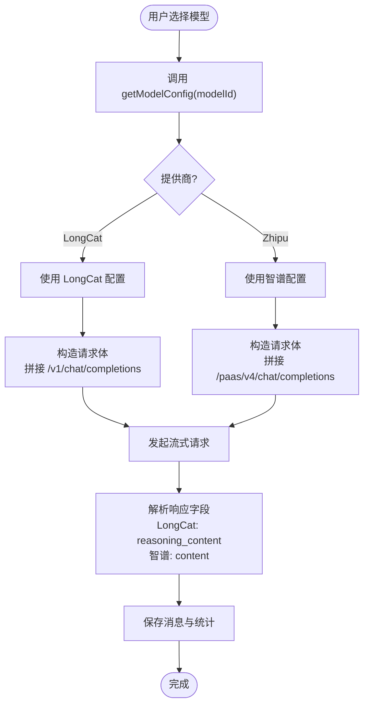

# 模型提供商配置

<cite>
**本文档引用的文件**
- [lib/config.ts](file://lib/config.ts)
- [lib/ai/zhipu.ts](file://lib/ai/zhipu.ts)
- [app/api/chat/route.ts](file://app/api/chat/route.ts)
- [components/notebook/chat-panel.tsx](file://components/notebook/chat-panel.tsx)
- [components/notebook/studio-mode-select.tsx](file://components/notebook/studio-mode-select.tsx)
- [hooks/use-studio-mode.ts](file://hooks/use-studio-mode.ts)
- [lib/studio/generator.ts](file://lib/studio/generator.ts)
- [lib/utils/logger.ts](file://lib/utils/logger.ts)
</cite>

## 目录
1. [简介](#简介)
2. [项目结构](#项目结构)
3. [核心组件](#核心组件)
4. [架构概览](#架构概览)
5. [详细组件分析](#详细组件分析)
6. [依赖关系分析](#依赖关系分析)
7. [性能考量](#性能考量)
8. [故障排除指南](#故障排除指南)
9. [结论](#结论)
10. [附录](#附录)

## 简介
本文件系统性梳理了本项目的模型提供商配置体系，重点对比智谱 AI 与 LongCat（LongCat-Flash-Thinking）两大模型的配置差异，涵盖 API 密钥管理、基础 URL 配置、模型参数设置；阐明模型配置数据结构（ModelConfig 接口、模型列表管理、动态配置获取）；解释模型切换机制（运行时模型选择、配置热更新、兼容性检查）；并提供不同模型的特点与适用场景、故障排除指南及最佳实践与性能调优建议。

## 项目结构
围绕模型配置的关键文件分布如下：
- 配置与模型清单：lib/config.ts
- 智谱 AI 封装：lib/ai/zhipu.ts
- 聊天 API 入口：app/api/chat/route.ts
- 运行时模型选择 UI：components/notebook/chat-panel.tsx
- Studio 模式选择 UI：components/notebook/studio-mode-select.tsx
- Studio 模式状态 Hook：hooks/use-studio-mode.ts
- Studio 内容生成器（强制 LongCat）：lib/studio/generator.ts
- 日志工具：lib/utils/logger.ts

图表来源
- [lib/config.ts](file://lib/config.ts#L38-L166)
- [lib/ai/zhipu.ts](file://lib/ai/zhipu.ts#L1-L196)
- [app/api/chat/route.ts](file://app/api/chat/route.ts#L1-L324)
- [components/notebook/chat-panel.tsx](file://components/notebook/chat-panel.tsx#L414-L438)
- [components/notebook/studio-mode-select.tsx](file://components/notebook/studio-mode-select.tsx#L24-L64)
- [hooks/use-studio-mode.ts](file://hooks/use-studio-mode.ts#L1-L38)
- [lib/studio/generator.ts](file://lib/studio/generator.ts#L1-L311)
- [lib/utils/logger.ts](file://lib/utils/logger.ts#L1-L98)

章节来源
- [lib/config.ts](file://lib/config.ts#L38-L166)
- [app/api/chat/route.ts](file://app/api/chat/route.ts#L1-L324)

## 核心组件
- 模型配置数据结构与环境变量
  - ModelConfig 接口定义了模型标识、提供商、模型名、显示名、描述与图标等字段。
  - 环境变量通过 process.env 读取，统一在 lib/config.ts 中集中管理。
- 模型列表管理
  - availableModels：聚合所有可用模型（智谱对话模型 + LongCat）。
  - zhipuChatModels：智谱对话模型清单。
- 动态配置获取
  - getModelConfig(modelId)：根据模型 ID 返回对应提供商的 apiKey、baseUrl、model。
  - getStudioModelConfig()：强制返回 LongCat Studio 默认配置。
  - isLongCatModel(modelId)：判断模型是否为 LongCat。
  - getModelDisplayName(modelId)：获取模型显示名。
- 智谱封装
  - 提供 Embedding 与 Chat（含流式）能力，并内置带指数回退的重试机制。
- 聊天 API
  - 根据模型提供商自动拼接不同 API 路径，统一处理流式响应。
- Studio 生成器
  - 强制使用 LongCat 配置，实现快速/精准两种模式的 Map-Reduce 生成流程。
- 运行时模型选择 UI
  - 下拉框展示 availableModels，支持用户即时切换模型。

章节来源
- [lib/config.ts](file://lib/config.ts#L59-L166)
- [lib/ai/zhipu.ts](file://lib/ai/zhipu.ts#L49-L195)
- [app/api/chat/route.ts](file://app/api/chat/route.ts#L174-L200)
- [lib/studio/generator.ts](file://lib/studio/generator.ts#L28-L36)

## 架构概览
模型配置在系统中的流转路径如下：
- 配置层：lib/config.ts 定义环境变量、模型清单与动态配置获取函数。
- 适配层：lib/ai/zhipu.ts 提供智谱 API 能力与重试封装。
- 接口层：app/api/chat/route.ts 依据模型配置调用对应提供商 API。
- UI 层：components/notebook/chat-panel.tsx 与 hooks/use-studio-mode.ts 实现运行时模型/模式选择。
- 工具层：lib/utils/logger.ts 提供统一日志输出。

图表来源
- [app/api/chat/route.ts](file://app/api/chat/route.ts#L42-L200)
- [lib/config.ts](file://lib/config.ts#L117-L135)
- [lib/ai/zhipu.ts](file://lib/ai/zhipu.ts#L136-L156)

## 详细组件分析

### 模型配置数据结构与环境变量
- ModelConfig 接口
  - 字段：id、provider、model、displayName、description、icon。
  - 作用：统一描述各模型的元信息，便于 UI 展示与逻辑判断。
- 环境变量与默认值
  - LongCat：LONGCAT_API_KEY、LONGCAT_BASE_URL、LONGCAT_CHAT_MODEL。
  - 智谱：ZHIPU_API_KEY、ZHIPU_BASE_URL、ZHIPU_EMBEDDING_MODEL、ZHIPU_CHAT_MODEL、ZHIPU_STUDIO_MODEL。
  - 应用级：NEXT_PUBLIC_APP_URL、EMBEDDING_DIM、DATABASE_URL 等。
- 模型清单
  - availableModels：包含智谱对话模型与 LongCat。
  - zhipuChatModels：包含 glm-4.7、glm-4.7-flashx、glm-4.5-airx、glm-4-flash。
- 动态配置获取
  - getModelConfig：按模型 ID 返回对应提供商配置。
  - getStudioModelConfig：强制 LongCat 配置（Studio 场景）。
  - isLongCatModel / getModelDisplayName：辅助判断与展示。

章节来源
- [lib/config.ts](file://lib/config.ts#L38-L166)

### 智谱 AI 与 LongCat 配置差异
- API 密钥管理
  - 智谱：ZHIPU_API_KEY。
  - LongCat：LONGCAT_API_KEY。
- 基础 URL 配置
  - 智谱：ZHIPU_BASE_URL，默认 https://open.bigmodel.cn/api。
  - LongCat：LONGCAT_BASE_URL，默认 https://api.longcat.chat/openai。
- 模型参数设置
  - 智谱：embeddingModel（默认 embedding-3）、chatModel（默认 glm-4.7），Studio 模型由 ZHIPU_STUDIO_MODEL 或 LONGCAT_CHAT_MODEL 决定。
  - LongCat：chatModel（默认 LongCat-Flash-Thinking），Studio 强制使用 LongCat 配置。
- 兼容性与差异
  - Embedding 维度：系统强制要求 EMBEDDING_DIM=1024（与智谱 embedding-3 对齐）。
  - Chat API 路径：智谱使用 /paas/v4/chat/completions，LongCat 使用 /v1/chat/completions。
  - 流式响应字段：LongCat 的 delta 字段为 reasoning_content，智谱为 content。

章节来源
- [lib/config.ts](file://lib/config.ts#L38-L52)
- [lib/ai/zhipu.ts](file://lib/ai/zhipu.ts#L68-L156)
- [app/api/chat/route.ts](file://app/api/chat/route.ts#L174-L183)

### 模型切换机制
- 运行时模型选择
  - UI 层：chat-panel.tsx 下拉框展示 availableModels，onValueChange 更新模型 ID。
  - 模式层：use-studio-mode.ts 管理 fast/precise 模式并持久化至 localStorage。
  - 配置层：getModelConfig 根据 modelId 返回对应提供商配置。
- 配置热更新
  - 通过重新调用 getModelConfig 获取最新配置，无需重启服务。
- 兼容性检查
  - isLongCatModel 用于区分提供商，确保请求路径与响应字段解析正确。
  - getModelDisplayName 保证 UI 显示一致性。

图表来源
- [lib/config.ts](file://lib/config.ts#L117-L135)
- [app/api/chat/route.ts](file://app/api/chat/route.ts#L174-L200)
- [lib/ai/zhipu.ts](file://lib/ai/zhipu.ts#L136-L156)

章节来源
- [components/notebook/chat-panel.tsx](file://components/notebook/chat-panel.tsx#L414-L438)
- [hooks/use-studio-mode.ts](file://hooks/use-studio-mode.ts#L14-L31)
- [lib/config.ts](file://lib/config.ts#L117-L147)
- [app/api/chat/route.ts](file://app/api/chat/route.ts#L174-L200)

### Studio 模式与 LongCat 强制配置
- Studio 默认模型提供商：LongCat（STUDIO_DEFAULT_MODEL='longcat'）。
- 强制配置：getStudioModelConfig 与 studio 生成器内部均强制使用 LongCat 配置。
- 模式差异
  - 快速模式（fast）：智能采样，单轮调用，超时时间较短。
  - 精准模式（precise）：Map-Reduce，多轮调用，超时时间较长。
- 生成流程
  - fast：getSourceContentSmart -> callLLM -> 解析产物。
  - precise：Map 阶段对每个 Source 生成中间结果，Reduce 阶段合并并调用 LLM。

图表来源
- [lib/studio/generator.ts](file://lib/studio/generator.ts#L28-L36)
- [lib/config.ts](file://lib/config.ts#L149-L157)
- [components/notebook/studio-mode-select.tsx](file://components/notebook/studio-mode-select.tsx#L24-L64)
- [hooks/use-studio-mode.ts](file://hooks/use-studio-mode.ts#L14-L31)

章节来源
- [lib/studio/generator.ts](file://lib/studio/generator.ts#L22-L27)
- [lib/studio/generator.ts](file://lib/studio/generator.ts#L117-L237)
- [lib/config.ts](file://lib/config.ts#L57-L58)
- [lib/config.ts](file://lib/config.ts#L149-L157)

### 智谱封装与重试策略
- Embedding：批量限制（最多 64 条，每条最多 3072 tokens），强制维度 1024。
- Chat：支持非流式与流式两种方式。
- 重试封装：对 429 与 5xx 错误进行指数回退重试（最多 4 次）。

章节来源
- [lib/ai/zhipu.ts](file://lib/ai/zhipu.ts#L58-L101)
- [lib/ai/zhipu.ts](file://lib/ai/zhipu.ts#L107-L156)
- [lib/ai/zhipu.ts](file://lib/ai/zhipu.ts#L165-L195)

## 依赖关系分析
- 组件耦合
  - app/api/chat/route.ts 依赖 lib/config.ts 的 getModelConfig 与提供商 API。
  - components/notebook/chat-panel.tsx 依赖 availableModels 进行 UI 渲染。
  - lib/studio/generator.ts 强制依赖 LongCat 配置。
- 外部依赖
  - 环境变量：NEXT_PUBLIC_SUPABASE_URL、NEXT_PUBLIC_SUPABASE_ANON_KEY、DATABASE_URL、ZHIPU_API_KEY、LONGCAT_API_KEY、EMBEDDING_DIM 等。
- 潜在循环依赖
  - 当前文件间无明显循环导入；配置模块被多个层依赖，属于合理的中心化配置。

图表来源
- [lib/config.ts](file://lib/config.ts#L38-L166)
- [app/api/chat/route.ts](file://app/api/chat/route.ts#L1-L324)
- [lib/ai/zhipu.ts](file://lib/ai/zhipu.ts#L1-L196)
- [lib/studio/generator.ts](file://lib/studio/generator.ts#L1-L311)
- [components/notebook/chat-panel.tsx](file://components/notebook/chat-panel.tsx#L414-L438)
- [hooks/use-studio-mode.ts](file://hooks/use-studio-mode.ts#L1-L38)
- [lib/utils/logger.ts](file://lib/utils/logger.ts#L1-L98)

章节来源
- [lib/config.ts](file://lib/config.ts#L38-L166)
- [app/api/chat/route.ts](file://app/api/chat/route.ts#L1-L324)

## 性能考量
- 质量与速度权衡
  - 智谱：glm-4.7（质量最高）、glm-4.7-flashx（极速版）、glm-4.5-airx（轻量高性价比）、glm-4-flash（速度最快）。
  - LongCat：LongCat-Flash-Thinking（精准模式，适合复杂推理）。
- 成本控制
  - 通过 Studio 模式选择 fast/precise 控制生成成本与时长。
  - 适当调整 chunkSize、topK 与相似度阈值以平衡召回质量与成本。
- 性能优化建议
  - 使用流式响应降低首字延迟。
  - 对长上下文进行截断与去重，减少无效 token。
  - 合理设置超时时间，避免长时间占用资源。
  - 在开发环境开启必要日志，生产环境关闭冗余日志。

[本节为通用性能指导，不直接分析具体文件]

## 故障排除指南
- 连接问题诊断
  - 确认环境变量齐全且正确（validateEnv）。
  - 检查提供商 API Key 是否有效。
  - 核对基础 URL 与模型名是否匹配。
- API 限制处理
  - 智谱封装内置重试（withRetry），自动处理 429/5xx。
  - Studio 生成器设置合理超时，避免长时间等待。
- 错误重试策略
  - 智谱封装：最多 4 次指数回退重试。
  - 聊天接口：对非 200 响应抛出错误，前端可结合 withRetry 重试。
- 日志与可观测性
  - 使用 lib/utils/logger.ts 输出结构化日志，定位问题根因。

章节来源
- [lib/config.ts](file://lib/config.ts#L168-L186)
- [lib/ai/zhipu.ts](file://lib/ai/zhipu.ts#L165-L195)
- [lib/studio/generator.ts](file://lib/studio/generator.ts#L53-L115)
- [lib/utils/logger.ts](file://lib/utils/logger.ts#L29-L94)

## 结论
本项目通过 lib/config.ts 实现模型配置的集中化管理，结合 UI 层的运行时选择与 Studio 的模式切换，实现了灵活的模型与模式组合。智谱与 LongCat 在 API 路径、响应字段与默认模型上存在差异，系统通过 getModelConfig 与 isLongCatModel 等函数进行兼容处理。配合嵌入式重试与日志工具，整体具备良好的稳定性与可维护性。

[本节为总结性内容，不直接分析具体文件]

## 附录
- 环境变量清单
  - NEXT_PUBLIC_SUPABASE_URL、NEXT_PUBLIC_SUPABASE_ANON_KEY、DATABASE_URL、ZHIPU_API_KEY、LONGCAT_API_KEY、EMBEDDING_DIM、ZHIPU_BASE_URL、ZHIPU_EMBEDDING_MODEL、ZHIPU_CHAT_MODEL、ZHIPU_STUDIO_MODEL、LONGCAT_BASE_URL、LONGCAT_CHAT_MODEL、NEXT_PUBLIC_APP_URL。
- 关键函数与路径
  - getModelConfig(modelId)：[lib/config.ts](file://lib/config.ts#L117-L135)
  - getStudioModelConfig()：[lib/config.ts](file://lib/config.ts#L149-L157)
  - isLongCatModel(modelId)：[lib/config.ts](file://lib/config.ts#L137-L141)
  - getModelDisplayName(modelId)：[lib/config.ts](file://lib/config.ts#L143-L147)
  - withRetry(fn)：[lib/ai/zhipu.ts](file://lib/ai/zhipu.ts#L165-L195)
  - chatStream(messages)：[lib/ai/zhipu.ts](file://lib/ai/zhipu.ts#L136-L156)
  - 聊天 API（流式）：[app/api/chat/route.ts](file://app/api/chat/route.ts#L174-L200)