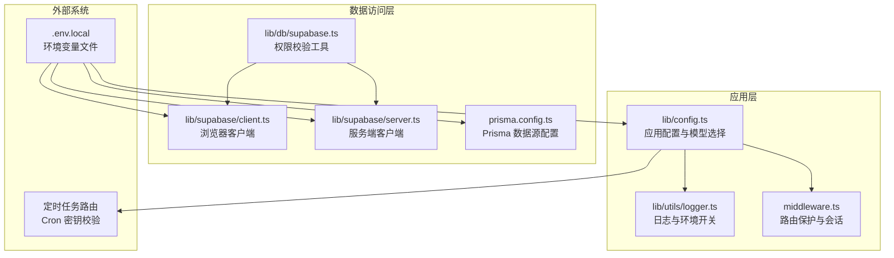
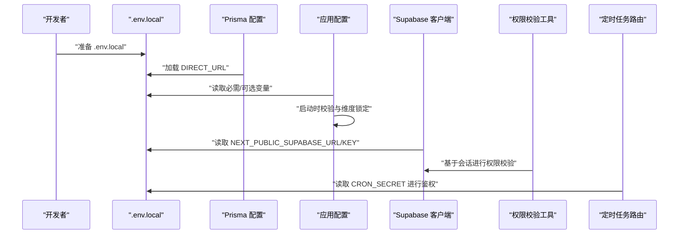
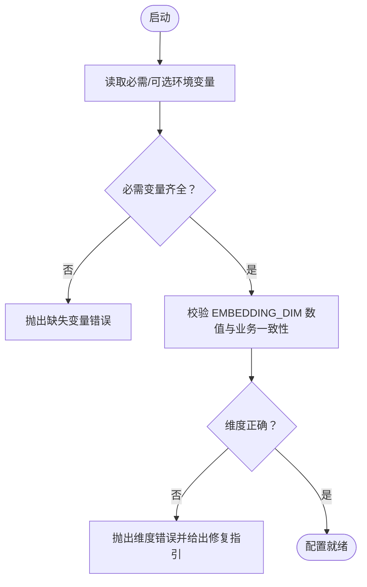
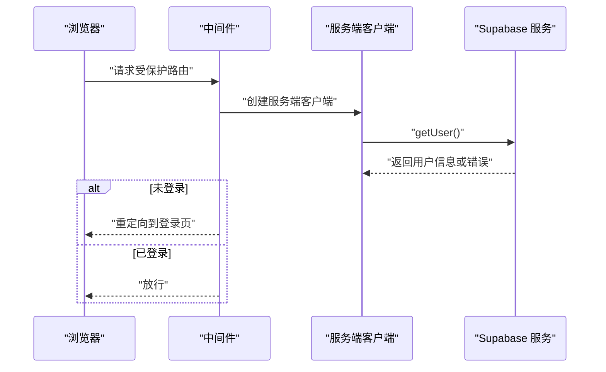
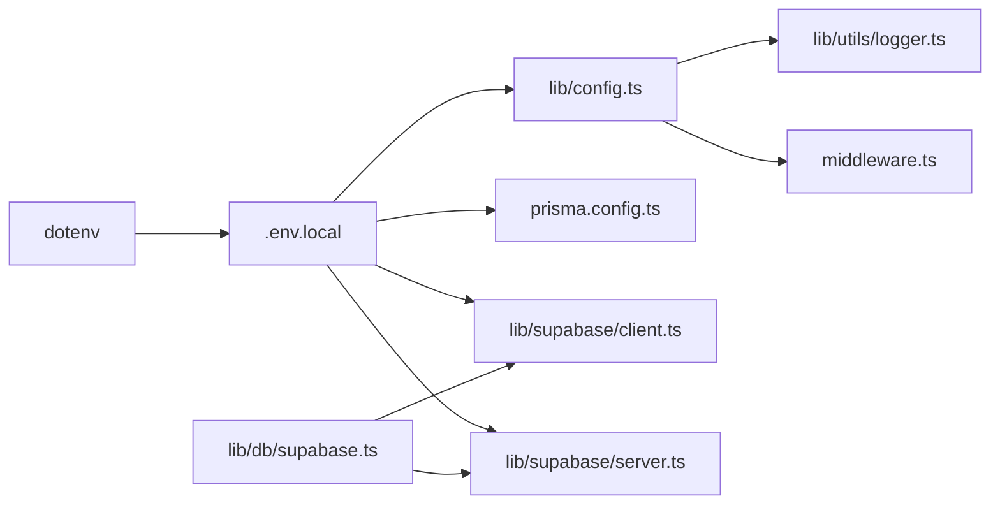

# 环境配置

<cite>
**本文引用的文件**
- [lib/config.ts](file://lib/config.ts)
- [prisma.config.ts](file://prisma.config.ts)
- [package.json](file://package.json)
- [lib/supabase/client.ts](file://lib/supabase/client.ts)
- [lib/supabase/server.ts](file://lib/supabase/server.ts)
- [lib/db/supabase.ts](file://lib/db/supabase.ts)
- [lib/utils/logger.ts](file://lib/utils/logger.ts)
- [middleware.ts](file://middleware.ts)
- [app/api/cron/process-queue/route.ts](file://app/api/cron/process-queue/route.ts)
- [app/global-error.tsx](file://app/global-error.tsx)
</cite>

## 目录
1. [简介](#简介)
2. [项目结构](#项目结构)
3. [核心组件](#核心组件)
4. [架构总览](#架构总览)
5. [详细组件分析](#详细组件分析)
6. [依赖分析](#依赖分析)
7. [性能考虑](#性能考虑)
8. [故障排查指南](#故障排查指南)
9. [结论](#结论)
10. [附录](#附录)

## 简介
本文件系统化梳理本项目的环境配置管理，覆盖以下主题：
- 环境变量设计与组织：必需项、可选项与默认值
- .env.local 结构与命名规范：开发/测试/生产差异
- 安全管理：敏感信息保护、密钥轮换、访问控制
- 配置验证：启动时与运行时检查、错误处理策略
- 最佳实践：分类、版本管理与团队协作
- 常见问题排查与解决方案

## 项目结构
围绕环境配置的关键文件与模块如下：
- 应用配置与模型选择：lib/config.ts
- 数据库连接与 Prisma 配置：prisma.config.ts
- Supabase 客户端与中间件：lib/supabase/*、middleware.ts
- 日志与错误处理：lib/utils/logger.ts、app/global-error.tsx
- 其他敏感配置使用点：app/api/cron/process-queue/route.ts

**图表来源**
- [lib/config.ts](file://lib/config.ts#L1-L187)
- [lib/utils/logger.ts](file://lib/utils/logger.ts#L1-L98)
- [lib/supabase/client.ts](file://lib/supabase/client.ts#L1-L14)
- [lib/supabase/server.ts](file://lib/supabase/server.ts#L1-L33)
- [lib/db/supabase.ts](file://lib/db/supabase.ts#L1-L39)
- [prisma.config.ts](file://prisma.config.ts#L1-L20)
- [app/api/cron/process-queue/route.ts](file://app/api/cron/process-queue/route.ts#L20-L40)

**章节来源**
- [lib/config.ts](file://lib/config.ts#L1-L187)
- [prisma.config.ts](file://prisma.config.ts#L1-L20)
- [lib/supabase/client.ts](file://lib/supabase/client.ts#L1-L14)
- [lib/supabase/server.ts](file://lib/supabase/server.ts#L1-L33)
- [lib/db/supabase.ts](file://lib/db/supabase.ts#L1-L39)
- [lib/utils/logger.ts](file://lib/utils/logger.ts#L1-L98)
- [middleware.ts](file://middleware.ts#L1-L78)
- [app/api/cron/process-queue/route.ts](file://app/api/cron/process-queue/route.ts#L20-L40)

## 核心组件
- 应用配置与模型选择：集中定义嵌入维度、模型提供商、默认模型、应用参数，并进行启动时严格校验。
- Supabase 客户端：分别面向浏览器与服务端，统一从环境变量读取公共 URL 与匿名密钥。
- Prisma 配置：通过 dotenv 加载 .env.local，读取 DIRECT_URL 作为数据源连接。
- 日志与错误处理：根据 NODE_ENV 控制日志输出级别；全局错误组件在开发环境打印详细错误。

**章节来源**
- [lib/config.ts](file://lib/config.ts#L6-L166)
- [lib/supabase/client.ts](file://lib/supabase/client.ts#L8-L13)
- [lib/supabase/server.ts](file://lib/supabase/server.ts#L9-L32)
- [prisma.config.ts](file://prisma.config.ts#L6-L19)
- [lib/utils/logger.ts](file://lib/utils/logger.ts#L29-L98)
- [app/global-error.tsx](file://app/global-error.tsx#L12-L17)

## 架构总览
环境配置贯穿应用启动、运行与数据库交互的全过程，形成“配置加载 → 校验 → 使用”的闭环。

**图表来源**
- [prisma.config.ts](file://prisma.config.ts#L6-L19)
- [lib/config.ts](file://lib/config.ts#L6-L186)
- [lib/supabase/client.ts](file://lib/supabase/client.ts#L8-L13)
- [lib/db/supabase.ts](file://lib/db/supabase.ts#L12-L33)
- [app/api/cron/process-queue/route.ts](file://app/api/cron/process-queue/route.ts#L20-L40)

## 详细组件分析

### 应用配置与模型选择（lib/config.ts）
- 必需环境变量
  - NEXT_PUBLIC_SUPABASE_URL
  - NEXT_PUBLIC_SUPABASE_ANON_KEY
  - DATABASE_URL
  - ZHIPU_API_KEY
  - EMBEDDING_DIM
- 可选配置与默认值
  - LONGCAT_BASE_URL 默认值
  - LONGCAT_CHAT_MODEL 默认值
  - ZHIPU_BASE_URL 默认值
  - ZHIPU_EMBEDDING_MODEL 默认值
  - ZHIPU_CHAT_MODEL 默认值
  - ZHIPU_STUDIO_MODEL 默认值
  - APP_URL 默认值
- 启动时严格校验
  - 若缺少任一必需变量，抛出错误并提示复制 .env.example 到 .env.local
  - 对 EMBEDDING_DIM 进行数值与业务一致性双重校验（必须为正整数且等于 1024）
- 模型与提供商
  - 提供模型列表与默认模型选择逻辑
  - Studio 默认强制使用 LongCat 配置

**图表来源**
- [lib/config.ts](file://lib/config.ts#L168-L186)
- [lib/config.ts](file://lib/config.ts#L6-L29)

**章节来源**
- [lib/config.ts](file://lib/config.ts#L6-L186)

### Supabase 客户端与中间件（lib/supabase/* 与 middleware.ts）
- 浏览器端客户端
  - 从环境变量读取公共 URL 与匿名密钥，创建浏览器可用的客户端实例
- 服务端客户端
  - 从环境变量读取公共 URL 与匿名密钥，结合 Cookie Store 实现服务端会话管理
- 中间件
  - 基于 Supabase 会话判断访问权限，对受保护路由进行登录拦截
  - 对已登录用户访问登录页进行重定向

**图表来源**
- [lib/supabase/server.ts](file://lib/supabase/server.ts#L9-L32)
- [middleware.ts](file://middleware.ts#L15-L71)

**章节来源**
- [lib/supabase/client.ts](file://lib/supabase/client.ts#L8-L13)
- [lib/supabase/server.ts](file://lib/supabase/server.ts#L9-L32)
- [lib/db/supabase.ts](file://lib/db/supabase.ts#L12-L33)
- [middleware.ts](file://middleware.ts#L9-L71)

### 数据库与 Prisma 配置（prisma.config.ts）
- 通过 dotenv 显式加载 .env.local
- 从环境变量 DIRECT_URL 读取数据库连接字符串
- 指定 schema 与 migrations 路径

**章节来源**
- [prisma.config.ts](file://prisma.config.ts#L6-L19)

### 日志与错误处理（lib/utils/logger.ts 与 app/global-error.tsx）
- 日志
  - 根据 NODE_ENV 决定日志输出行为：开发环境输出 info/warn/debug/error；生产环境仅输出 error
  - 提供向量操作专用日志结构，便于追踪向量检索/插入等操作
- 全局错误
  - 开发环境打印完整错误信息；生产环境展示通用错误提示并提供重试与返回首页按钮

**章节来源**
- [lib/utils/logger.ts](file://lib/utils/logger.ts#L29-L98)
- [app/global-error.tsx](file://app/global-error.tsx#L12-L17)

### 敏感配置使用点（定时任务鉴权）
- 定时任务路由通过读取环境变量 CRON_SECRET 进行 Bearer Token 鉴权
- 该变量属于敏感配置，应避免硬编码与泄露

**章节来源**
- [app/api/cron/process-queue/route.ts](file://app/api/cron/process-queue/route.ts#L20-L40)

## 依赖分析
- 外部依赖
  - dotenv：用于加载 .env.local
  - @supabase/ssr：用于构建 Supabase 浏览器与服务端客户端
  - prisma：用于数据库 schema 与迁移管理
- 内部耦合
  - 应用配置依赖 dotenv 加载的环境变量
  - Supabase 客户端与中间件依赖应用配置中的公共 URL 与匿名密钥
  - Prisma 配置依赖 dotenv 加载的 DIRECT_URL

**图表来源**
- [package.json](file://package.json#L48-L64)
- [lib/config.ts](file://lib/config.ts#L6-L186)
- [prisma.config.ts](file://prisma.config.ts#L6-L19)
- [lib/supabase/client.ts](file://lib/supabase/client.ts#L8-L13)
- [lib/supabase/server.ts](file://lib/supabase/server.ts#L9-L32)
- [lib/utils/logger.ts](file://lib/utils/logger.ts#L29-L98)
- [middleware.ts](file://middleware.ts#L15-L71)
- [lib/db/supabase.ts](file://lib/db/supabase.ts#L12-L33)

**章节来源**
- [package.json](file://package.json#L48-L64)

## 性能考虑
- 环境变量读取为进程启动时一次性操作，对运行时性能影响极小
- 日志输出按 NODE_ENV 控制，生产环境仅输出 error，降低 I/O 压力
- 建议在 CI/CD 中提前注入环境变量，避免运行时动态解析带来的不确定性

[本节为通用建议，无需特定文件引用]

## 故障排查指南
- 启动时报“缺少必需的环境变量”
  - 症状：启动即抛错，提示缺失若干变量
  - 排查：确认 .env.local 是否存在且包含 NEXT_PUBLIC_SUPABASE_URL、NEXT_PUBLIC_SUPABASE_ANON_KEY、DATABASE_URL、ZHIPU_API_KEY、EMBEDDING_DIM
  - 处理：复制 .env.example 到 .env.local 并填入实际值
  - 参考：lib/config.ts 的 validateEnv 与必需变量清单
- 启动时报“向量维度配置无效/错误”
  - 症状：抛出维度错误并给出修复指引
  - 排查：确认 EMBEDDING_DIM 设置为 1024，或按指引调整模型与数据库迁移
  - 处理：在 .env.local 中设置 EMBEDDING_DIM=1024 或执行数据库迁移重建表
  - 参考：lib/config.ts 的维度校验逻辑
- Supabase 访问异常
  - 症状：登录失败或受保护路由被重定向
  - 排查：确认 NEXT_PUBLIC_SUPABASE_URL 与 NEXT_PUBLIC_SUPABASE_ANON_KEY 正确；检查中间件路由匹配与会话状态
  - 处理：修正 .env.local 中的 Supabase 配置；清理过期 Cookie
  - 参考：lib/supabase/*、middleware.ts
- Prisma 连接失败
  - 症状：迁移或生成报错
  - 排查：确认 .env.local 中 DIRECT_URL 正确；确保 Prisma CLI 与项目路径一致
  - 处理：修正 DIRECT_URL；重新执行 prisma 命令
  - 参考：prisma.config.ts
- 生产环境无日志
  - 症状：生产环境不输出 info/warn/debug
  - 排查：确认 NODE_ENV 为 production
  - 处理：保持现状或在本地临时切换为 development 以调试
  - 参考：lib/utils/logger.ts
- 定时任务鉴权失败
  - 症状：定时任务无法访问
  - 排查：确认 CRON_SECRET 是否正确设置
  - 处理：在 .env.local 中设置 CRON_SECRET 并同步至部署平台
  - 参考：app/api/cron/process-queue/route.ts

**章节来源**
- [lib/config.ts](file://lib/config.ts#L168-L186)
- [lib/config.ts](file://lib/config.ts#L6-L29)
- [lib/supabase/client.ts](file://lib/supabase/client.ts#L8-L13)
- [lib/supabase/server.ts](file://lib/supabase/server.ts#L9-L32)
- [middleware.ts](file://middleware.ts#L15-L71)
- [prisma.config.ts](file://prisma.config.ts#L6-L19)
- [lib/utils/logger.ts](file://lib/utils/logger.ts#L29-L98)
- [app/api/cron/process-queue/route.ts](file://app/api/cron/process-queue/route.ts#L20-L40)

## 结论
本项目采用集中式环境配置与严格的启动校验机制，结合 Prisma 与 Supabase 的环境驱动，实现了清晰的开发/生产隔离与安全控制。建议团队遵循本文档的命名规范、安全策略与排障流程，确保配置的稳定性与可维护性。

[本节为总结，无需特定文件引用]

## 附录

### 环境变量清单与默认值
- 必需项
  - NEXT_PUBLIC_SUPABASE_URL：Supabase 公共 URL
  - NEXT_PUBLIC_SUPABASE_ANON_KEY：Supabase 匿名密钥
  - DATABASE_URL：数据库连接（用于 Prisma）
  - ZHIPU_API_KEY：智谱 AI API 密钥
  - EMBEDDING_DIM：嵌入维度（必须为 1024）
- 可选项与默认值
  - LONGCAT_BASE_URL：LongCat 基础地址，默认值
  - LONGCAT_CHAT_MODEL：LongCat 对话模型，默认值
  - ZHIPU_BASE_URL：智谱基础地址，默认值
  - ZHIPU_EMBEDDING_MODEL：智谱嵌入模型，默认值
  - ZHIPU_CHAT_MODEL：智谱对话模型，默认值
  - ZHIPU_STUDIO_MODEL：Studio 默认模型，默认值
  - APP_URL：应用 URL，默认值
  - CRON_SECRET：定时任务鉴权密钥（敏感）

**章节来源**
- [lib/config.ts](file://lib/config.ts#L32-L166)
- [app/api/cron/process-queue/route.ts](file://app/api/cron/process-queue/route.ts#L20-L40)

### .env.local 结构与命名规范
- 文件位置：仓库根目录
- 加载时机：Prisma 配置显式加载 .env.local；应用配置通过 dotenv 读取
- 命名规范：键名全大写，单词以下划线分隔；敏感信息使用独立键名（如 API_KEY、SECRET）
- 环境区分
  - 开发：NODE_ENV=development；日志输出更丰富
  - 生产：NODE_ENV=production；日志仅输出 error

**章节来源**
- [prisma.config.ts](file://prisma.config.ts#L6-L19)
- [lib/config.ts](file://lib/config.ts#L32-L166)
- [lib/utils/logger.ts](file://lib/utils/logger.ts#L29-L98)

### 安全管理最佳实践
- 敏感信息保护
  - 不将 .env.local 提交至版本库；使用 .gitignore 屏蔽
  - 将密钥拆分为独立键（如 API_KEY、SECRET），避免混杂
- 密钥轮换
  - 更新 .env.local 后重启应用；对定时任务密钥更新后同步至部署平台
- 访问控制
  - 限制对 .env.local 的文件系统访问权限
  - 在 CI/CD 中使用加密的密钥存储与解密流程

[本节为通用建议，无需特定文件引用]

### 配置验证机制
- 启动时验证
  - 必需变量检查：缺失则立即抛错
  - 维度一致性检查：数值合法性与业务要求（1024）双重校验
- 运行时验证
  - Supabase 会话校验：中间件与权限工具统一校验资源归属
  - 日志级别控制：按 NODE_ENV 输出不同级别的日志
- 错误处理策略
  - 全局错误组件在开发环境打印详细错误，在生产环境提供友好提示

**章节来源**
- [lib/config.ts](file://lib/config.ts#L168-L186)
- [lib/config.ts](file://lib/config.ts#L6-L29)
- [lib/db/supabase.ts](file://lib/db/supabase.ts#L12-L33)
- [lib/utils/logger.ts](file://lib/utils/logger.ts#L29-L98)
- [app/global-error.tsx](file://app/global-error.tsx#L12-L17)

### 团队协作规范
- 配置分类
  - 基础设施类：DATABASE_URL、DIRECT_URL
  - 第三方服务类：NEXT_PUBLIC_SUPABASE_*、ZHIPU_*、LONGCAT_*
  - 安全类：CRON_SECRET 等
- 版本管理
  - .env.example 作为模板随代码库；.env.local 仅在本地/服务器维护
  - 变更 .env.local 后同步至部署平台并记录变更日志
- 审核流程
  - 敏感配置变更需双人复核；CI 中增加环境变量存在性检查

[本节为通用建议，无需特定文件引用]