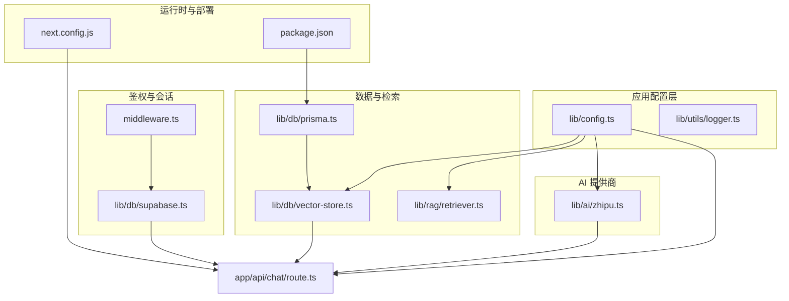
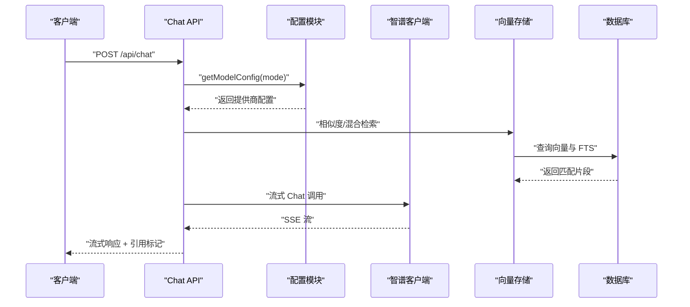
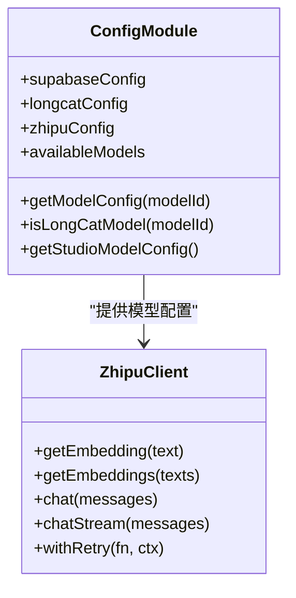
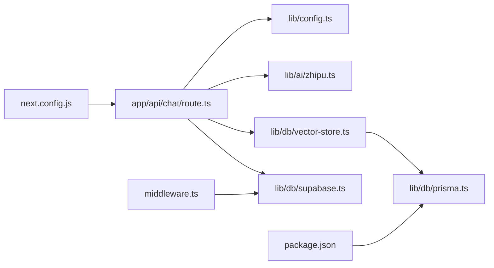

# 配置管理

<cite>
**本文引用的文件**
- [lib/config.ts](file://lib/config.ts)
- [lib/ai/zhipu.ts](file://lib/ai/zhipu.ts)
- [lib/db/vector-store.ts](file://lib/db/vector-store.ts)
- [lib/db/prisma.ts](file://lib/db/prisma.ts)
- [lib/db/supabase.ts](file://lib/db/supabase.ts)
- [lib/utils/logger.ts](file://lib/utils/logger.ts)
- [lib/rag/retriever.ts](file://lib/rag/retriever.ts)
- [app/api/chat/route.ts](file://app/api/chat/route.ts)
- [middleware.ts](file://middleware.ts)
- [next.config.js](file://next.config.js)
- [package.json](file://package.json)
</cite>

## 目录
1. [简介](#简介)
2. [项目结构](#项目结构)
3. [核心组件](#核心组件)
4. [架构总览](#架构总览)
5. [详细组件分析](#详细组件分析)
6. [依赖关系分析](#依赖关系分析)
7. [性能考量](#性能考量)
8. [故障排除指南](#故障排除指南)
9. [结论](#结论)
10. [附录](#附录)

## 简介
本文件系统化梳理 notebookLM-clone 的配置管理体系，覆盖环境变量与配置文件组织、敏感信息保护、模型提供商配置（智谱 AI 与 LongCat）、安全配置最佳实践、性能配置选项、配置验证与默认值、动态更新与热重载、监控与审计以及故障排除与调试工具。目标是帮助开发者与运维人员快速理解并正确维护系统的配置层。

## 项目结构
配置相关的关键位置与职责：
- 应用级配置与模型提供商配置：lib/config.ts
- 智谱 AI 客户端封装：lib/ai/zhipu.ts
- 向量存储与检索：lib/db/vector-store.ts
- 数据库连接池与 Prisma 客户端：lib/db/prisma.ts
- Supabase 权限与会话：lib/db/supabase.ts、lib/supabase/server.ts
- 日志与向量操作审计：lib/utils/logger.ts
- RAG 检索参数：lib/rag/retriever.ts
- API 层集成与流式响应：app/api/chat/route.ts
- 中间件路由保护：middleware.ts
- Next.js 运行时配置：next.config.js
- 依赖与脚本：package.json

图表来源
- [lib/config.ts](file://lib/config.ts#L1-L187)
- [lib/ai/zhipu.ts](file://lib/ai/zhipu.ts#L1-L196)
- [lib/db/vector-store.ts](file://lib/db/vector-store.ts#L1-L446)
- [lib/db/prisma.ts](file://lib/db/prisma.ts#L1-L41)
- [lib/db/supabase.ts](file://lib/db/supabase.ts#L1-L39)
- [lib/utils/logger.ts](file://lib/utils/logger.ts#L1-L98)
- [lib/rag/retriever.ts](file://lib/rag/retriever.ts#L1-L206)
- [app/api/chat/route.ts](file://app/api/chat/route.ts#L1-L324)
- [middleware.ts](file://middleware.ts#L1-L78)
- [next.config.js](file://next.config.js#L1-L21)
- [package.json](file://package.json#L1-L82)

章节来源
- [lib/config.ts](file://lib/config.ts#L1-L187)
- [next.config.js](file://next.config.js#L1-L21)

## 核心组件
- 应用配置与模型提供商
  - 向量维度强制校验与错误提示
  - Supabase、LongCat、智谱 AI 的配置项与默认值
  - 模型列表与默认模型选择
  - 环境变量完整性校验
- AI 客户端封装
  - Embedding 与 Chat API 调用
  - 请求重试策略与错误处理
- 数据库与检索
  - Prisma 客户端与连接池
  - 向量存储批量写入、相似度检索、混合检索
  - 检索参数与阈值
- 鉴权与中间件
  - 路由保护、会话刷新与重定向
- 日志与审计
  - 开发/生产日志级别控制
  - 向量操作日志结构与记录

章节来源
- [lib/config.ts](file://lib/config.ts#L6-L187)
- [lib/ai/zhipu.ts](file://lib/ai/zhipu.ts#L53-L196)
- [lib/db/vector-store.ts](file://lib/db/vector-store.ts#L77-L446)
- [lib/db/prisma.ts](file://lib/db/prisma.ts#L1-L41)
- [lib/db/supabase.ts](file://lib/db/supabase.ts#L12-L33)
- [lib/utils/logger.ts](file://lib/utils/logger.ts#L29-L98)
- [lib/rag/retriever.ts](file://lib/rag/retriever.ts#L6-L13)

## 架构总览
配置在系统中的作用路径：
- 启动阶段：读取环境变量，进行必需项校验与维度一致性检查
- 运行阶段：API 路由根据模型 ID 获取提供商配置，调用 AI 客户端；向量检索使用统一的检索参数；数据库通过 Prisma 客户端与连接池访问；中间件负责会话与路由保护；日志记录关键操作与耗时

图表来源
- [app/api/chat/route.ts](file://app/api/chat/route.ts#L25-L324)
- [lib/config.ts](file://lib/config.ts#L118-L157)
- [lib/ai/zhipu.ts](file://lib/ai/zhipu.ts#L136-L156)
- [lib/db/vector-store.ts](file://lib/db/vector-store.ts#L175-L297)

## 详细组件分析

### 环境配置与敏感信息保护
- 环境变量来源与用途
  - 必需项：Supabase URL/Anon Key、数据库连接串、智谱 API Key、向量维度
  - 可选项：LongCat 基础地址、模型名、应用 URL、Studio 默认模型
- 敏感信息保护
  - 服务器侧读取密钥，前端仅使用公开的匿名 Key
  - 中间件与鉴权逻辑确保资源访问控制
- 配置验证
  - 启动时校验必需变量是否存在
  - 向量维度强制为 1024，否则抛错并给出修复指引

章节来源
- [lib/config.ts](file://lib/config.ts#L32-L52)
- [lib/config.ts](file://lib/config.ts#L169-L187)
- [lib/config.ts](file://lib/config.ts#L17-L29)
- [lib/db/supabase.ts](file://lib/db/supabase.ts#L12-L33)
- [middleware.ts](file://middleware.ts#L15-L71)

### 模型提供商配置（智谱 AI 与 LongCat）
- 配置差异
  - 基础地址与模型名默认值不同
  - Chat API 路径差异：智谱使用 paas/v4/chat/completions，LongCat 使用 v1/chat/completions
  - 流式响应字段差异：LongCat 使用 reasoning_content，智谱使用 content
- 模型参数与默认值
  - 智谱：embedding-3、glm-4.7（或可选的更快模型）
  - LongCat：默认模型可在配置中指定，Studio 默认使用 LongCat
- 获取与切换
  - 根据模型 ID 返回对应提供商配置
  - isLongCatModel 用于判断是否为 LongCat 模型

图表来源
- [lib/config.ts](file://lib/config.ts#L32-L157)
- [lib/ai/zhipu.ts](file://lib/ai/zhipu.ts#L53-L196)

章节来源
- [lib/config.ts](file://lib/config.ts#L38-L157)
- [app/api/chat/route.ts](file://app/api/chat/route.ts#L174-L191)
- [lib/ai/zhipu.ts](file://lib/ai/zhipu.ts#L136-L156)

### 安全配置最佳实践
- 路由保护
  - 中间件对受保护路由进行会话校验与重定向
- CORS 与图片源
  - Next.js 配置允许特定域名与远程模式，限制图片来源以降低风险
- HTTPS 与 Cookie
  - Supabase 客户端通过 SSR 客户端管理 Cookie，确保会话安全
- 安全头
  - API 层返回 SSE 时设置合适的缓存与连接头；生产环境建议结合反向代理或平台安全策略补充安全头

章节来源
- [middleware.ts](file://middleware.ts#L9-L71)
- [next.config.js](file://next.config.js#L4-L12)
- [lib/db/supabase.ts](file://lib/db/supabase.ts#L12-L33)
- [app/api/chat/route.ts](file://app/api/chat/route.ts#L308-L314)

### 性能配置选项
- 向量维度与批量写入
  - 维度强制 1024，批量插入分批（每批最多 500），减少事务压力
- 检索参数
  - topK、相似度阈值、混合检索权重（向量 0.7、全文 0.3）
- 连接池与数据库
  - Prisma 使用 pg Pool，Serverless 建议使用 Supabase Transaction Pooler 并限制连接数
- 流式响应
  - Chat API 使用流式返回，前端按块解码，提升感知性能
- 图片与上传
  - Next.js 限制 Server Actions 请求体大小，支持较大文件上传

章节来源
- [lib/db/vector-store.ts](file://lib/db/vector-store.ts#L9-L10)
- [lib/db/vector-store.ts](file://lib/db/vector-store.ts#L175-L297)
- [lib/db/prisma.ts](file://lib/db/prisma.ts#L8-L16)
- [lib/rag/retriever.ts](file://lib/rag/retriever.ts#L6-L13)
- [app/api/chat/route.ts](file://app/api/chat/route.ts#L214-L306)
- [next.config.js](file://next.config.js#L13-L17)

### 配置验证机制
- 启动时验证
  - 缺失必需环境变量时抛错，提示复制 .env.example 到 .env.local
- 运行时验证
  - 向量维度在多个环节校验（配置加载、批量写入、相似度检索、混合检索）
  - Embedding 返回维度校验，防止与预期不符
- 默认值设置
  - 多处提供默认值（如模型名、基础地址、URL、阈值等）

章节来源
- [lib/config.ts](file://lib/config.ts#L169-L187)
- [lib/config.ts](file://lib/config.ts#L17-L29)
- [lib/ai/zhipu.ts](file://lib/ai/zhipu.ts#L88-L95)
- [lib/db/vector-store.ts](file://lib/db/vector-store.ts#L92-L99)
- [lib/db/vector-store.ts](file://lib/db/vector-store.ts#L198-L202)
- [lib/db/vector-store.ts](file://lib/db/vector-store.ts#L343-L347)

### 动态更新与热重载机制
- 当前实现
  - 配置在启动时读取并校验，运行时不可动态修改
  - 数据库连接池在进程内复用，重启即生效新配置
- 建议方案
  - 对于需要热更新的参数（如阈值、权重），可在运行时从配置中心或环境注入，配合缓存与版本标识
  - 对于密钥类敏感信息，建议通过平台密钥管理服务轮换，避免重启

章节来源
- [lib/config.ts](file://lib/config.ts#L6-L187)
- [lib/db/prisma.ts](file://lib/db/prisma.ts#L18-L41)

### 监控与审计
- 日志级别
  - 开发环境输出 info/warn/debug，生产环境仅 error
- 向量操作审计
  - 统一的日志结构，记录操作、耗时、成功与否、元数据（如插入数量、相似度均值）
- 建议增强
  - 增加配置变更事件记录（如监听环境变量变化或配置文件变更）
  - 引入指标上报（如检索耗时、向量维度错误率、API 调用成功率）

章节来源
- [lib/utils/logger.ts](file://lib/utils/logger.ts#L29-L98)
- [lib/db/vector-store.ts](file://lib/db/vector-store.ts#L143-L172)
- [lib/db/vector-store.ts](file://lib/db/vector-store.ts#L268-L296)

## 依赖关系分析
- 组件耦合
  - API 路由依赖配置模块与 AI 客户端；向量存储依赖数据库与配置；中间件依赖鉴权模块
- 外部依赖
  - Next.js、Prisma、PostgreSQL、Supabase、智谱 AI、LongCat
- 循环依赖
  - 未发现明显循环依赖

图表来源
- [app/api/chat/route.ts](file://app/api/chat/route.ts#L1-L324)
- [lib/config.ts](file://lib/config.ts#L1-L187)
- [lib/ai/zhipu.ts](file://lib/ai/zhipu.ts#L1-L196)
- [lib/db/vector-store.ts](file://lib/db/vector-store.ts#L1-L446)
- [lib/db/prisma.ts](file://lib/db/prisma.ts#L1-L41)
- [lib/db/supabase.ts](file://lib/db/supabase.ts#L1-L39)
- [middleware.ts](file://middleware.ts#L1-L78)
- [next.config.js](file://next.config.js#L1-L21)
- [package.json](file://package.json#L1-L82)

章节来源
- [package.json](file://package.json#L17-L64)

## 性能考量
- 向量维度与数据库一致性
  - 强制 1024 维，避免后续迁移成本与性能波动
- 批量写入与分页
  - 每批最多 500，减少单次事务开销
- 检索参数
  - 合理设置 topK 与阈值，避免过多无效匹配
- 连接池
  - Serverless 场景限制每个实例连接数，降低并发峰值
- 流式响应
  - 减少首字节延迟，改善用户体验

章节来源
- [lib/config.ts](file://lib/config.ts#L17-L29)
- [lib/db/vector-store.ts](file://lib/db/vector-store.ts#L9-L10)
- [lib/db/vector-store.ts](file://lib/db/vector-store.ts#L175-L297)
- [lib/db/prisma.ts](file://lib/db/prisma.ts#L8-L16)
- [app/api/chat/route.ts](file://app/api/chat/route.ts#L214-L306)

## 故障排除指南
- 启动报错：向量维度无效或不匹配
  - 检查 .env.local 中 EMBEDDING_DIM 是否为 1024
  - 若更换模型，参考文档进行数据库迁移重建表
- 缺少必需环境变量
  - 复制 .env.example 到 .env.local 并填入实际值
- Chat API 错误
  - 检查提供商 API Key、基础地址与模型名
  - 关注流式响应解析差异（LongCat 与智谱字段不同）
- 检索结果为空或质量差
  - 调整 topK 与相似度阈值
  - 启用混合检索并调整权重
- 数据库连接问题
  - 确认 DATABASE_URL 正确，必要时使用 Supabase Transaction Pooler 并限制连接数
- 日志定位
  - 开发环境查看 info/warn/debug；生产环境仅 error；向量操作有专门审计日志

章节来源
- [lib/config.ts](file://lib/config.ts#L169-L187)
- [lib/config.ts](file://lib/config.ts#L17-L29)
- [lib/ai/zhipu.ts](file://lib/ai/zhipu.ts#L81-L84)
- [lib/rag/retriever.ts](file://lib/rag/retriever.ts#L6-L13)
- [lib/db/prisma.ts](file://lib/db/prisma.ts#L8-L16)
- [lib/utils/logger.ts](file://lib/utils/logger.ts#L29-L98)

## 结论
本项目在配置管理上实现了严格的启动校验、明确的提供商配置与默认值、完善的日志与审计能力，并在性能方面通过批量写入、连接池与流式响应做了针对性优化。建议在现有基础上引入配置中心与热重载机制，完善敏感信息轮换与安全头策略，持续提升可维护性与安全性。

## 附录
- 常用配置键
  - NEXT_PUBLIC_SUPABASE_URL、NEXT_PUBLIC_SUPABASE_ANON_KEY、DATABASE_URL、ZHIPU_API_KEY、EMBEDDING_DIM、LONGCAT_API_KEY、LONGCAT_BASE_URL、LONGCAT_CHAT_MODEL、ZHIPU_BASE_URL、ZHIPU_EMBEDDING_MODEL、ZHIPU_CHAT_MODEL、ZHIPU_STUDIO_MODEL、NEXT_PUBLIC_APP_URL
- 相关实现路径
  - 配置加载与校验：[lib/config.ts](file://lib/config.ts#L6-L187)
  - 智谱客户端封装：[lib/ai/zhipu.ts](file://lib/ai/zhipu.ts#L53-L196)
  - 向量存储与检索：[lib/db/vector-store.ts](file://lib/db/vector-store.ts#L77-L446)
  - 数据库连接池：[lib/db/prisma.ts](file://lib/db/prisma.ts#L1-L41)
  - 鉴权与中间件：[lib/db/supabase.ts](file://lib/db/supabase.ts#L12-L33)、[middleware.ts](file://middleware.ts#L15-L71)
  - 日志与审计：[lib/utils/logger.ts](file://lib/utils/logger.ts#L29-L98)
  - RAG 检索参数：[lib/rag/retriever.ts](file://lib/rag/retriever.ts#L6-L13)
  - API 集成与流式响应：[app/api/chat/route.ts](file://app/api/chat/route.ts#L25-L324)
  - Next.js 运行时配置：[next.config.js](file://next.config.js#L1-L21)
  - 依赖与脚本：[package.json](file://package.json#L1-L82)