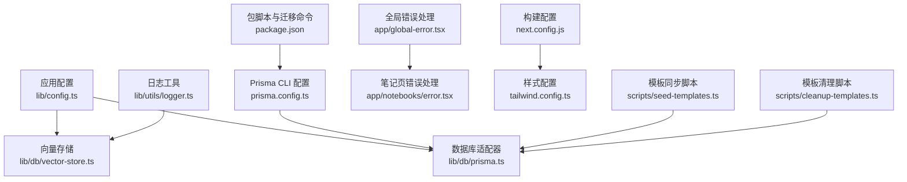
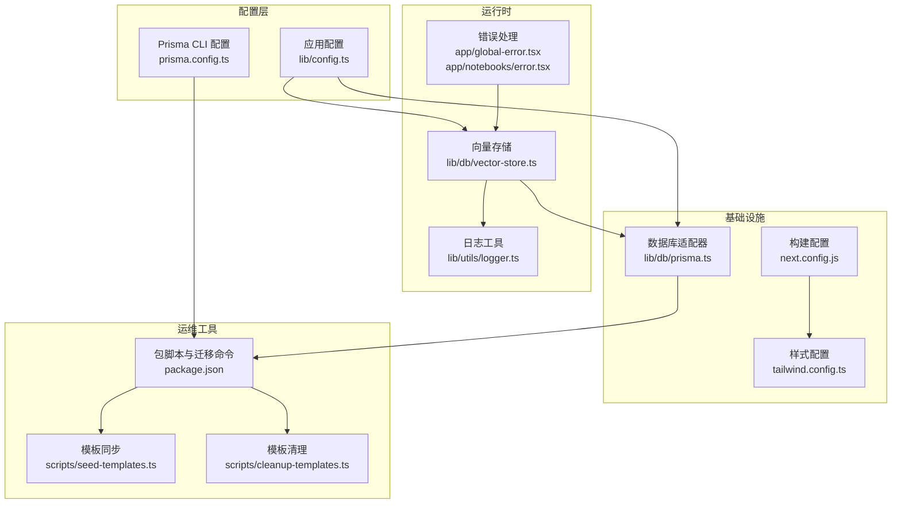
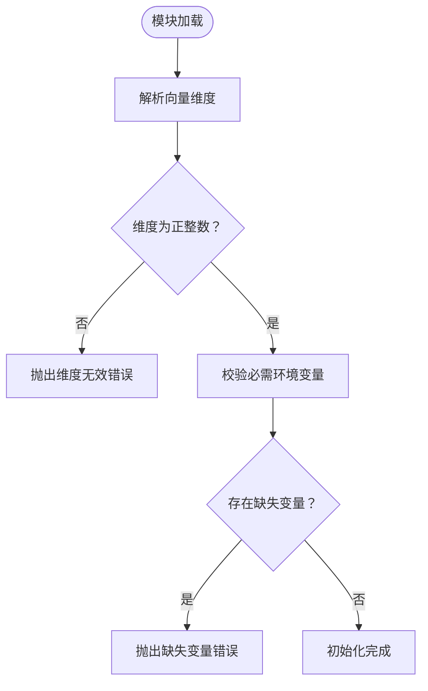
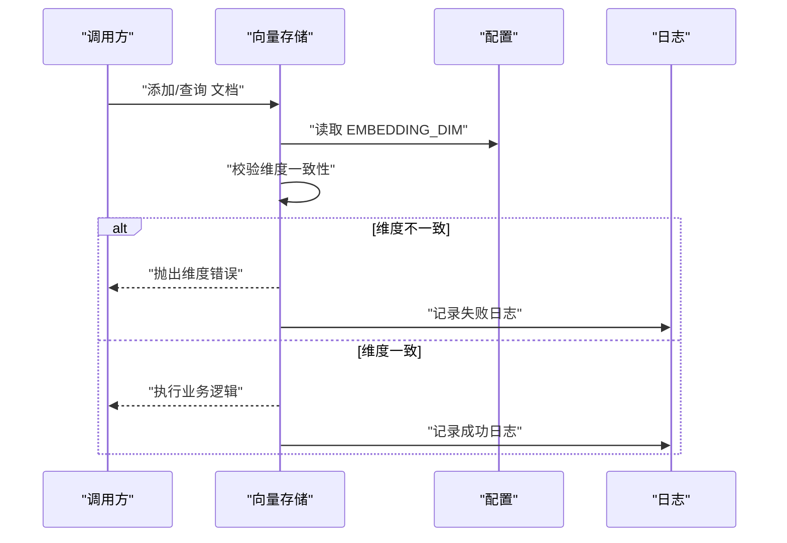
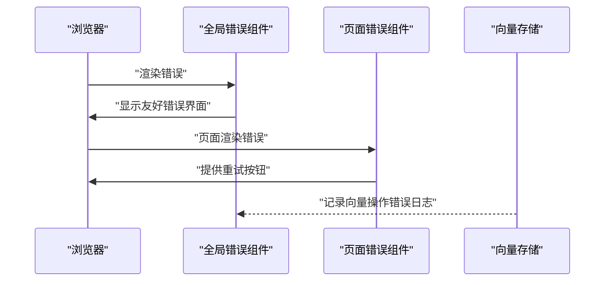
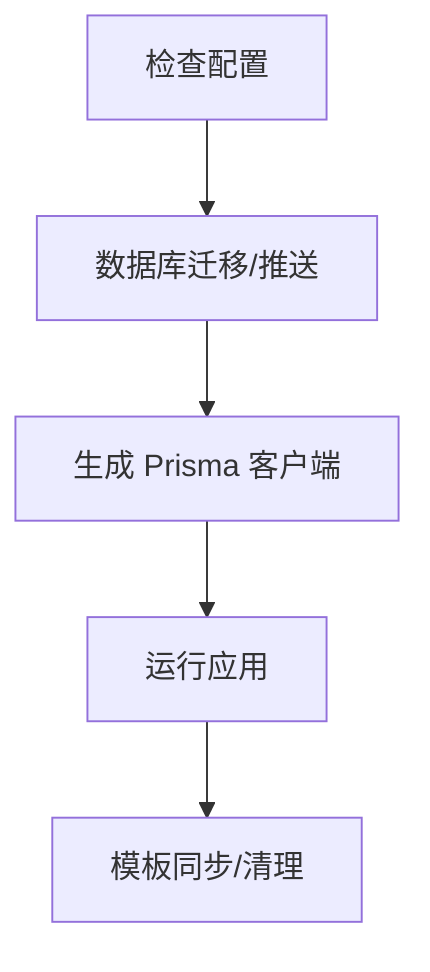
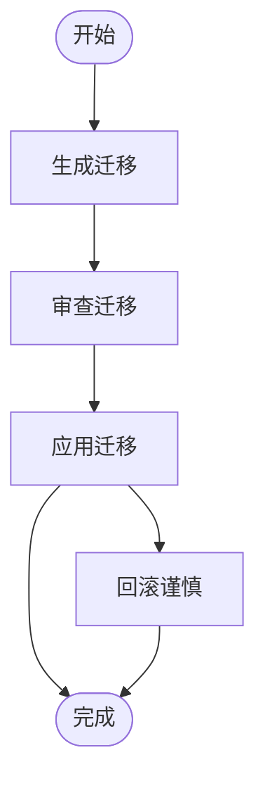
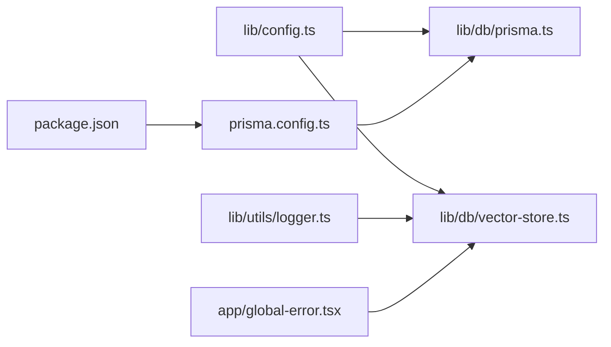

# 配置验证与管理

<cite>
**本文引用的文件**
- [lib/config.ts](file://lib/config.ts)
- [lib/db/vector-store.ts](file://lib/db/vector-store.ts)
- [lib/db/prisma.ts](file://lib/db/prisma.ts)
- [lib/db/supabase.ts](file://lib/db/supabase.ts)
- [lib/utils/logger.ts](file://lib/utils/logger.ts)
- [prisma.config.ts](file://prisma.config.ts)
- [package.json](file://package.json)
- [next.config.js](file://next.config.js)
- [tailwind.config.ts](file://tailwind.config.ts)
- [scripts/seed-templates.ts](file://scripts/seed-templates.ts)
- [scripts/cleanup-templates.ts](file://scripts/cleanup-templates.ts)
- [app/global-error.tsx](file://app/global-error.tsx)
- [app/notebooks/error.tsx](file://app/notebooks/error.tsx)
</cite>

## 目录
1. [简介](#简介)
2. [项目结构](#项目结构)
3. [核心组件](#核心组件)
4. [架构总览](#架构总览)
5. [详细组件分析](#详细组件分析)
6. [依赖关系分析](#依赖关系分析)
7. [性能考量](#性能考量)
8. [故障排查指南](#故障排查指南)
9. [结论](#结论)
10. [附录](#附录)

## 简介
本文件系统性梳理本项目的配置验证与管理机制，覆盖启动时配置检查、运行时配置验证、动态配置更新策略、错误处理与降级、配置版本与变更追踪、配置工具链（检查、导出、导入）、最佳实践与 CI/CD 集成建议。目标是帮助开发者在不深入源码的前提下，也能高效地理解并安全地维护配置体系。

## 项目结构
围绕配置验证与管理的关键目录与文件如下：
- 配置定义与校验：lib/config.ts
- 数据库与向量存储：lib/db/prisma.ts、lib/db/vector-store.ts
- 数据库迁移与 CLI：prisma.config.ts、package.json 脚本
- 日志与错误处理：lib/utils/logger.ts、app/global-error.tsx、app/notebooks/error.tsx
- 构建与样式：next.config.js、tailwind.config.ts
- 模板同步与清理：scripts/seed-templates.ts、scripts/cleanup-templates.ts

图表来源
- [lib/config.ts](file://lib/config.ts#L1-L187)
- [lib/db/vector-store.ts](file://lib/db/vector-store.ts#L1-L446)
- [lib/db/prisma.ts](file://lib/db/prisma.ts#L1-L41)
- [prisma.config.ts](file://prisma.config.ts#L1-L20)
- [package.json](file://package.json#L5-L16)
- [lib/utils/logger.ts](file://lib/utils/logger.ts#L1-L98)
- [app/global-error.tsx](file://app/global-error.tsx#L1-L131)
- [app/notebooks/error.tsx](file://app/notebooks/error.tsx#L39-L67)
- [next.config.js](file://next.config.js#L1-L21)
- [tailwind.config.ts](file://tailwind.config.ts#L1-L95)
- [scripts/seed-templates.ts](file://scripts/seed-templates.ts#L1-L86)
- [scripts/cleanup-templates.ts](file://scripts/cleanup-templates.ts#L1-L24)

章节来源
- [lib/config.ts](file://lib/config.ts#L1-L187)
- [lib/db/vector-store.ts](file://lib/db/vector-store.ts#L1-L446)
- [lib/db/prisma.ts](file://lib/db/prisma.ts#L1-L41)
- [prisma.config.ts](file://prisma.config.ts#L1-L20)
- [package.json](file://package.json#L5-L16)
- [lib/utils/logger.ts](file://lib/utils/logger.ts#L1-L98)
- [app/global-error.tsx](file://app/global-error.tsx#L1-L131)
- [app/notebooks/error.tsx](file://app/notebooks/error.tsx#L39-L67)
- [next.config.js](file://next.config.js#L1-L21)
- [tailwind.config.ts](file://tailwind.config.ts#L1-L95)
- [scripts/seed-templates.ts](file://scripts/seed-templates.ts#L1-L86)
- [scripts/cleanup-templates.ts](file://scripts/cleanup-templates.ts#L1-L24)

## 核心组件
- 应用配置与环境变量校验：负责在启动阶段强制校验关键环境变量与向量维度一致性，确保系统运行前提条件满足。
- 数据库与连接池：通过适配器与连接池封装，统一数据库访问与日志级别控制。
- 向量存储与维度校验：在运行时对嵌入向量维度进行严格校验，防止维度不匹配导致的数据异常。
- 日志与错误处理：统一的日志输出与全局错误捕获，便于定位配置问题与运行异常。
- 数据库迁移与 CLI：通过 Prisma CLI 与脚本命令管理数据库版本与迁移。
- 模板同步与清理：提供模板数据的初始化与清理能力，辅助配置导入/导出场景下的数据准备。

章节来源
- [lib/config.ts](file://lib/config.ts#L168-L187)
- [lib/db/vector-store.ts](file://lib/db/vector-store.ts#L92-L99)
- [lib/db/prisma.ts](file://lib/db/prisma.ts#L1-L41)
- [lib/utils/logger.ts](file://lib/utils/logger.ts#L1-L98)
- [prisma.config.ts](file://prisma.config.ts#L1-L20)
- [package.json](file://package.json#L5-L16)
- [scripts/seed-templates.ts](file://scripts/seed-templates.ts#L1-L86)
- [scripts/cleanup-templates.ts](file://scripts/cleanup-templates.ts#L1-L24)

## 架构总览
下图展示配置验证与管理在系统中的位置与交互关系。

图表来源
- [lib/config.ts](file://lib/config.ts#L1-L187)
- [lib/db/vector-store.ts](file://lib/db/vector-store.ts#L1-L446)
- [lib/db/prisma.ts](file://lib/db/prisma.ts#L1-L41)
- [lib/utils/logger.ts](file://lib/utils/logger.ts#L1-L98)
- [prisma.config.ts](file://prisma.config.ts#L1-L20)
- [package.json](file://package.json#L5-L16)
- [scripts/seed-templates.ts](file://scripts/seed-templates.ts#L1-L86)
- [scripts/cleanup-templates.ts](file://scripts/cleanup-templates.ts#L1-L24)
- [next.config.js](file://next.config.js#L1-L21)
- [tailwind.config.ts](file://tailwind.config.ts#L1-L95)
- [app/global-error.tsx](file://app/global-error.tsx#L1-L131)
- [app/notebooks/error.tsx](file://app/notebooks/error.tsx#L39-L67)

## 详细组件分析

### 启动时配置检查与环境变量校验
- 强制校验向量维度：在模块加载时解析并校验向量维度，若非正整数或与系统要求不一致则直接抛出错误，阻止应用启动。
- 必需环境变量检查：集中列出运行所需的关键环境变量，缺失时立即报错，避免运行期因缺参导致的隐性错误。
- 配置项来源：应用 URL、文件大小限制、分块大小、相似度阈值等均来自环境变量与常量组合，保证部署一致性。

图表来源
- [lib/config.ts](file://lib/config.ts#L9-L29)
- [lib/config.ts](file://lib/config.ts#L168-L187)

章节来源
- [lib/config.ts](file://lib/config.ts#L9-L29)
- [lib/config.ts](file://lib/config.ts#L168-L187)

### 运行时配置验证与动态更新策略
- 向量维度一致性校验：在插入、检索、混合检索等关键路径上再次校验查询向量与嵌入向量维度，确保与系统配置一致。
- 动态配置更新：当前实现以静态配置为主，建议通过“配置热加载”或“重启触发重新加载”的方式实现动态更新；对于模型提供商、URL、阈值等参数，可在服务启动后通过外部配置中心或环境变量变更后重启生效。
- 审计与可观测性：通过日志工具记录向量操作的元数据（如 topK、阈值、平均相似度），便于运行时审计与问题定位。

图表来源
- [lib/db/vector-store.ts](file://lib/db/vector-store.ts#L92-L99)
- [lib/db/vector-store.ts](file://lib/db/vector-store.ts#L198-L202)
- [lib/db/vector-store.ts](file://lib/db/vector-store.ts#L343-L347)
- [lib/config.ts](file://lib/config.ts#L7-L29)
- [lib/utils/logger.ts](file://lib/utils/logger.ts#L75-L94)

章节来源
- [lib/db/vector-store.ts](file://lib/db/vector-store.ts#L92-L99)
- [lib/db/vector-store.ts](file://lib/db/vector-store.ts#L198-L202)
- [lib/db/vector-store.ts](file://lib/db/vector-store.ts#L343-L347)
- [lib/utils/logger.ts](file://lib/utils/logger.ts#L75-L94)

### 错误处理策略：异常捕获、错误恢复与降级
- 全局错误捕获：Next.js 全局错误组件在开发环境打印详细错误，在生产环境提供友好的提示与重试入口。
- 页面级错误边界：特定页面（如笔记本页）提供错误边界与重试按钮，提升用户体验。
- 数据库与向量操作错误：向量存储在异常时记录详细日志，便于快速定位问题根因。

图表来源
- [app/global-error.tsx](file://app/global-error.tsx#L1-L131)
- [app/notebooks/error.tsx](file://app/notebooks/error.tsx#L39-L67)
- [lib/db/vector-store.ts](file://lib/db/vector-store.ts#L157-L172)
- [lib/db/vector-store.ts](file://lib/db/vector-store.ts#L282-L296)
- [lib/db/vector-store.ts](file://lib/db/vector-store.ts#L431-L442)

章节来源
- [app/global-error.tsx](file://app/global-error.tsx#L1-L131)
- [app/notebooks/error.tsx](file://app/notebooks/error.tsx#L39-L67)
- [lib/db/vector-store.ts](file://lib/db/vector-store.ts#L157-L172)
- [lib/db/vector-store.ts](file://lib/db/vector-store.ts#L282-L296)
- [lib/db/vector-store.ts](file://lib/db/vector-store.ts#L431-L442)

### 配置管理工具：检查、导出与导入
- 配置检查命令：通过包脚本提供数据库迁移、推送与生成命令，结合 Prisma CLI 配置文件读取环境变量，确保数据库连接正确。
- 导出与导入：当前仓库未提供专门的配置导出/导入 CLI；可通过以下方式实现：
  - 导出：使用 Prisma CLI 与数据库备份工具导出 schema 与数据；模板数据可通过脚本导出。
  - 导入：使用 Prisma CLI 与数据库恢复工具导入 schema 与数据；模板数据可通过脚本导入。
- 模板同步与清理：提供模板数据的 upsert 与清理脚本，便于在不同环境间迁移模板数据。

图表来源
- [package.json](file://package.json#L5-L16)
- [prisma.config.ts](file://prisma.config.ts#L1-L20)
- [scripts/seed-templates.ts](file://scripts/seed-templates.ts#L1-L86)
- [scripts/cleanup-templates.ts](file://scripts/cleanup-templates.ts#L1-L24)

章节来源
- [package.json](file://package.json#L5-L16)
- [prisma.config.ts](file://prisma.config.ts#L1-L20)
- [scripts/seed-templates.ts](file://scripts/seed-templates.ts#L1-L86)
- [scripts/cleanup-templates.ts](file://scripts/cleanup-templates.ts#L1-L24)

### 配置版本管理：历史记录、变更追踪与回滚
- 数据库版本管理：通过 Prisma 迁移目录与迁移锁文件管理数据库 schema 的演进，支持变更追踪与回滚。
- 迁移命令：提供迁移生成、推送与查看命令，配合环境变量与 CLI 配置文件使用。
- 回滚策略：建议在生产环境谨慎回滚，优先采用“向前修复”（新增迁移）的方式修正错误。

图表来源
- [prisma.config.ts](file://prisma.config.ts#L11-L19)
- [package.json](file://package.json#L11-L14)

章节来源
- [prisma.config.ts](file://prisma.config.ts#L11-L19)
- [package.json](file://package.json#L11-L14)

### 最佳实践：模板、审批与文档维护
- 配置模板：将常用配置项（如模型提供商、URL、阈值）抽象为模板，便于团队复用与标准化。
- 审批流程：对关键配置（如数据库 URL、API Key、向量维度）变更建立审批流程，确保变更可追溯。
- 文档维护：为每个配置项编写简要说明与默认值，结合变更日志记录每次调整的原因与影响范围。

（本节为通用实践建议，无需具体文件引用）

### 自动化与 CI/CD 集成
- 构建与测试：在 CI 中执行构建、类型检查与迁移命令，确保配置变更不会破坏构建。
- 部署前校验：在部署前运行配置检查与数据库迁移，确保目标环境配置正确。
- 回滚与蓝绿：结合数据库迁移的回滚能力与容器编排的蓝绿发布策略，降低配置变更风险。

（本节为通用实践建议，无需具体文件引用）

## 依赖关系分析
- 配置到存储：应用配置驱动向量存储的维度校验与阈值使用；数据库适配器统一连接与日志级别。
- 错误到可观测性：错误处理组件与日志工具协同，形成从异常到审计的闭环。
- 运维到开发：Prisma CLI 与脚本命令将运维动作转化为可重复的开发流程。

图表来源
- [lib/config.ts](file://lib/config.ts#L1-L187)
- [lib/db/vector-store.ts](file://lib/db/vector-store.ts#L1-L446)
- [lib/db/prisma.ts](file://lib/db/prisma.ts#L1-L41)
- [prisma.config.ts](file://prisma.config.ts#L1-L20)
- [package.json](file://package.json#L5-L16)
- [lib/utils/logger.ts](file://lib/utils/logger.ts#L1-L98)
- [app/global-error.tsx](file://app/global-error.tsx#L1-L131)

章节来源
- [lib/config.ts](file://lib/config.ts#L1-L187)
- [lib/db/vector-store.ts](file://lib/db/vector-store.ts#L1-L446)
- [lib/db/prisma.ts](file://lib/db/prisma.ts#L1-L41)
- [prisma.config.ts](file://prisma.config.ts#L1-L20)
- [package.json](file://package.json#L5-L16)
- [lib/utils/logger.ts](file://lib/utils/logger.ts#L1-L98)
- [app/global-error.tsx](file://app/global-error.tsx#L1-L131)

## 性能考量
- 连接池与日志级别：生产环境降低数据库日志级别，减少 I/O 压力；合理设置连接池参数以适配 Serverless 场景。
- 向量维度固定：统一的维度配置简化了向量运算与存储，有利于性能与稳定性。
- 批量写入：向量存储采用批量插入策略，减少事务开销与网络往返。

章节来源
- [lib/db/prisma.ts](file://lib/db/prisma.ts#L8-L16)
- [lib/db/prisma.ts](file://lib/db/prisma.ts#L33-L34)
- [lib/db/vector-store.ts](file://lib/db/vector-store.ts#L9-L14)
- [lib/db/vector-store.ts](file://lib/db/vector-store.ts#L105-L140)

## 故障排查指南
- 启动失败（维度错误）：检查环境变量中的向量维度配置，确保与系统要求一致。
- 运行失败（维度不匹配）：核对输入向量与嵌入向量的维度，确认模型与向量维度的对应关系。
- 数据库连接失败：检查 DATABASE_URL 与 Prisma CLI 配置，确认连接字符串与网络可达性。
- 全局错误：在开发环境查看控制台错误堆栈；在生产环境使用重试按钮或返回首页。
- 模板数据异常：使用模板同步脚本重建系统模板，或使用清理脚本移除旧模板。

章节来源
- [lib/config.ts](file://lib/config.ts#L18-L29)
- [lib/db/vector-store.ts](file://lib/db/vector-store.ts#L92-L99)
- [lib/db/vector-store.ts](file://lib/db/vector-store.ts#L198-L202)
- [prisma.config.ts](file://prisma.config.ts#L6-L7)
- [app/global-error.tsx](file://app/global-error.tsx#L12-L17)
- [scripts/seed-templates.ts](file://scripts/seed-templates.ts#L54-L73)
- [scripts/cleanup-templates.ts](file://scripts/cleanup-templates.ts#L13-L21)

## 结论
本项目在配置验证与管理方面形成了“启动强校验 + 运行严把关 + 日志可观测 + 迁移可追踪”的完整闭环。通过严格的维度校验、统一的日志输出与错误处理、以及完善的数据库迁移工具链，显著降低了配置错误带来的风险。建议在现有基础上进一步完善动态配置更新、配置导出/导入 CLI 与 CI/CD 流水线集成，以提升配置管理的自动化与安全性。

## 附录
- 构建与样式配置：Next.js 与 Tailwind 的配置文件分别负责构建行为与样式主题，确保前端构建与样式一致性。
- 模板脚本：提供模板数据的同步与清理能力，便于在不同环境间迁移模板数据。

章节来源
- [next.config.js](file://next.config.js#L1-L21)
- [tailwind.config.ts](file://tailwind.config.ts#L1-L95)
- [scripts/seed-templates.ts](file://scripts/seed-templates.ts#L1-L86)
- [scripts/cleanup-templates.ts](file://scripts/cleanup-templates.ts#L1-L24)