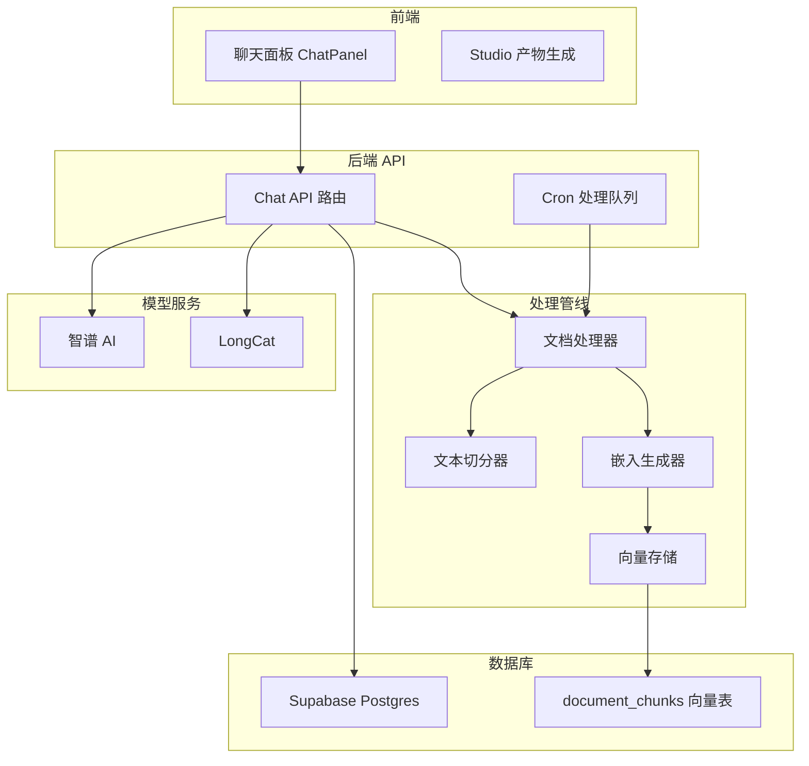
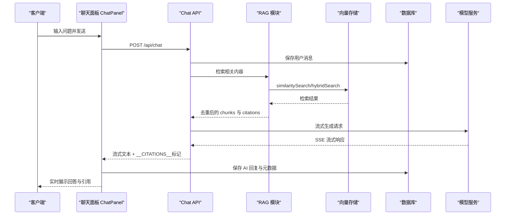
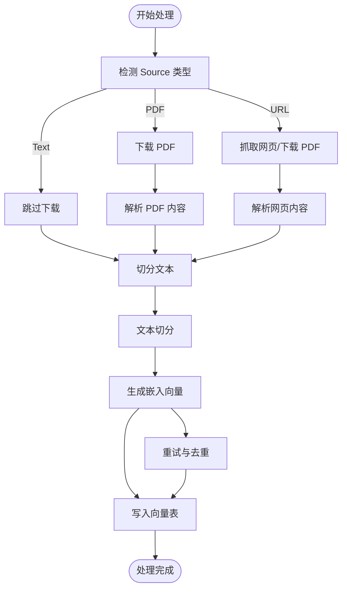
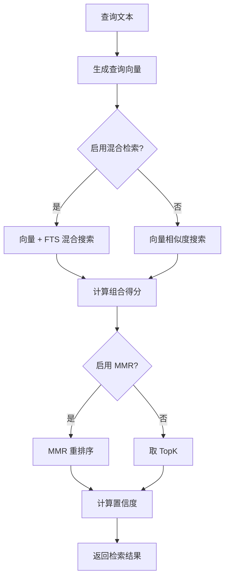
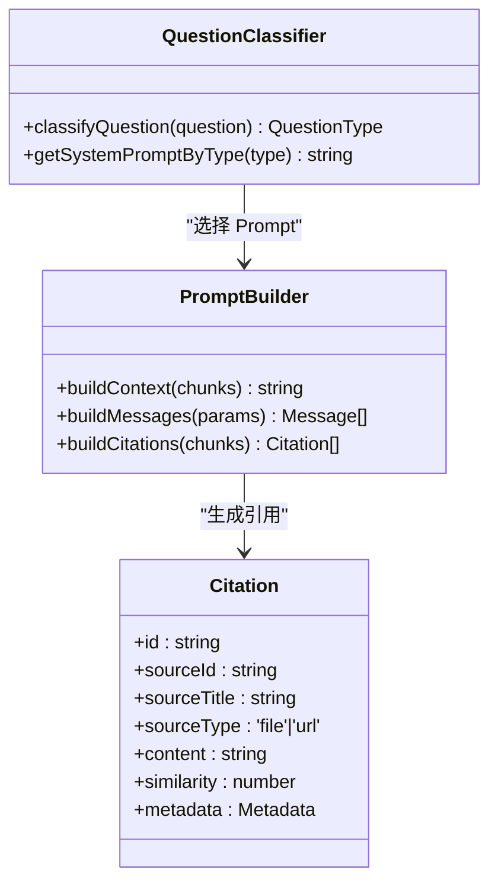
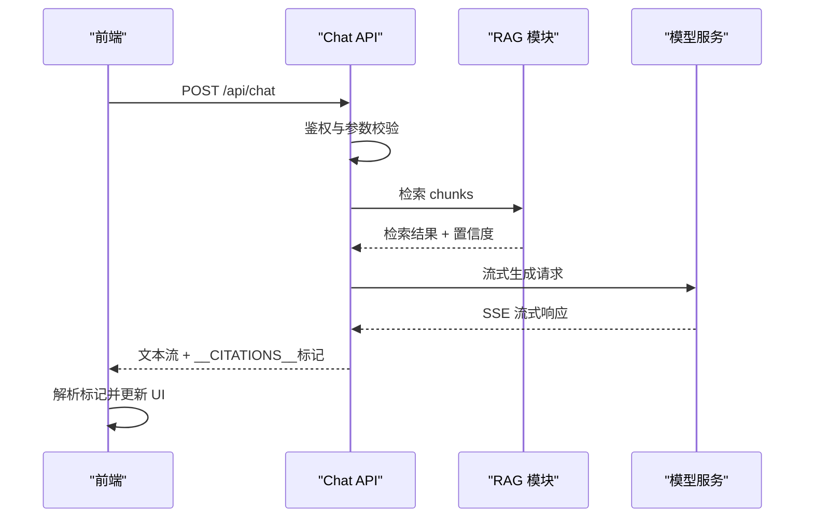
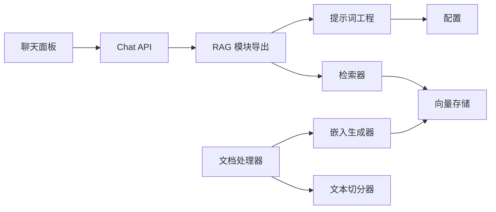

# RAG 学习计划

<cite>
**本文档引用的文件**
- [README.md](file://README.md)
- [7_day_rag_learning_plan.md](file://learning_plan/7_day_rag_learning_plan.md)
- [README.md](file://learning_plan/README.md)
- [index.ts](file://lib/rag/index.ts)
- [retriever.ts](file://lib/rag/retriever.ts)
- [prompt.ts](file://lib/rag/prompt.ts)
- [index.ts](file://lib/processing/index.ts)
- [processor.ts](file://lib/processing/processor.ts)
- [text-splitter.ts](file://lib/processing/text-splitter.ts)
- [embedding.ts](file://lib/processing/embedding.ts)
- [vector-store.ts](file://lib/db/vector-store.ts)
- [route.ts](file://app/api/chat/route.ts)
- [config.ts](file://lib/config.ts)
- [chat-panel.tsx](file://components/notebook/chat-panel.tsx)
- [resume_rag_desc.md](file://learning_plan/resume_rag_desc.md)
</cite>

## 目录
1. [简介](#简介)
2. [项目结构](#项目结构)
3. [核心组件](#核心组件)
4. [架构总览](#架构总览)
5. [详细组件分析](#详细组件分析)
6. [依赖关系分析](#依赖关系分析)
7. [性能考虑](#性能考虑)
8. [故障排除指南](#故障排除指南)
9. [结论](#结论)
10. [附录](#附录)

## 简介
本项目实现了一个类似 NotebookLM 的个人/团队知识库原型，支持将资料导入 Notebook，经过处理与向量化后，在同一 Notebook 内进行基于证据的对话（带引用），并在 Studio 中生成结构化产物（如测验、思维导图等）。系统采用 Next.js 14 + React 18 + TypeScript 技术栈，结合 Supabase、Prisma、pgvector 与多种模型服务（智谱、LongCat），实现了从知识源导入到 RAG 问答再到前端展示的完整端到端流程。

## 项目结构
项目采用按功能域划分的组织方式，主要目录包括：
- app/: 页面与 API 路由（Notebooks、Sources、Chat、Studio、Templates、Cron）
- components/: Notebook 三栏 UI（Sources / Chat / Studio）与通用组件
- lib/processing/: 导入内容处理（解析、切分、embedding、入库、队列）
- lib/rag/: 检索与提示词组装（messages、citations）
- lib/studio/: Studio 产物生成与解析
- prisma/: Prisma schema 与 SQL migrations（含 pgvector 向量表）

**图表来源**
- [chat-panel.tsx](file://components/notebook/chat-panel.tsx#L61-L477)
- [route.ts](file://app/api/chat/route.ts#L25-L330)
- [processor.ts](file://lib/processing/processor.ts#L82-L526)
- [vector-store.ts](file://lib/db/vector-store.ts#L77-L445)

**章节来源**
- [README.md](file://README.md#L42-L49)

## 核心组件
本系统的核心组件围绕 RAG 全链路展开，包括：
- 文档处理模块：负责 PDF/URL/文本的解析、切分、去重、批量嵌入与入库
- 向量检索模块：提供向量检索、混合检索、MMR 重排序与置信度评估
- 提示词工程模块：根据问题类型动态选择 System Prompt，组装上下文与消息列表
- Chat API：统一的 RAG 问答入口，支持流式输出与引用溯源
- 前端聊天面板：负责与 Chat API 对接，展示流式回复与引用信息

**章节来源**
- [index.ts](file://lib/processing/index.ts#L1-L51)
- [index.ts](file://lib/rag/index.ts#L1-L24)
- [route.ts](file://app/api/chat/route.ts#L25-L330)

## 架构总览
系统采用分层架构，从前端到后端再到数据库与模型服务，形成完整的数据流闭环。前端通过 Chat API 发起请求，后端并行执行检索与保存用户消息，随后调用模型服务进行流式生成，最终将引用信息作为特殊标记追加到流式响应末尾。

**图表来源**
- [chat-panel.tsx](file://components/notebook/chat-panel.tsx#L224-L335)
- [route.ts](file://app/api/chat/route.ts#L79-L321)
- [retriever.ts](file://lib/rag/retriever.ts#L57-L139)

**章节来源**
- [route.ts](file://app/api/chat/route.ts#L25-L330)

## 详细组件分析

### 文档处理管线
文档处理模块负责将不同来源的内容标准化为可检索的向量片段，流程包括下载/抓取、解析、切分、向量化与入库。该模块支持 PDF、URL 与文本三种来源，并在每一步记录详细的处理日志。

**图表来源**
- [processor.ts](file://lib/processing/processor.ts#L82-L526)
- [text-splitter.ts](file://lib/processing/text-splitter.ts#L115-L203)
- [embedding.ts](file://lib/processing/embedding.ts#L140-L188)

**章节来源**
- [processor.ts](file://lib/processing/processor.ts#L1-L560)
- [text-splitter.ts](file://lib/processing/text-splitter.ts#L1-L432)
- [embedding.ts](file://lib/processing/embedding.ts#L1-L189)

### 向量检索与重排序
向量检索模块提供多种检索策略，包括纯向量检索、全文检索（FTS）与混合检索。系统内置 MMR（最大边际相关性）算法进行重排序，平衡相关性与多样性，并计算置信度以避免低质量回答。

**图表来源**
- [retriever.ts](file://lib/rag/retriever.ts#L57-L465)

**章节来源**
- [retriever.ts](file://lib/rag/retriever.ts#L1-L465)
- [vector-store.ts](file://lib/db/vector-store.ts#L175-L442)

### 提示词工程与引用溯源
提示词工程模块根据问题类型动态选择合适的 System Prompt，并在消息列表中加入上下文与历史对话。引用溯源模块对检索结果进行去重与格式化，确保引用标记与内容一一对应。

**图表来源**
- [prompt.ts](file://lib/rag/prompt.ts#L111-L317)

**章节来源**
- [prompt.ts](file://lib/rag/prompt.ts#L1-L318)

### Chat API 与流式输出
Chat API 是 RAG 问答的统一入口，负责鉴权、参数校验、并行检索与保存消息、调用模型服务进行流式生成，并在流末尾追加引用信息。前端通过 SSE 流式读取响应，实时更新 UI。

**图表来源**
- [route.ts](file://app/api/chat/route.ts#L25-L330)
- [chat-panel.tsx](file://components/notebook/chat-panel.tsx#L224-L335)

**章节来源**
- [route.ts](file://app/api/chat/route.ts#L1-L331)
- [chat-panel.tsx](file://components/notebook/chat-panel.tsx#L1-L741)

## 依赖关系分析
系统各模块之间存在清晰的依赖关系，遵循单一职责原则与依赖倒置：
- Chat API 依赖 RAG 模块（检索、提示词、引用）
- RAG 模块依赖向量存储与配置
- 文档处理模块依赖切分器、嵌入器与向量存储
- 前端聊天面板依赖 Chat API 与引用上下文

**图表来源**
- [chat-panel.tsx](file://components/notebook/chat-panel.tsx#L61-L477)
- [route.ts](file://app/api/chat/route.ts#L12-L20)
- [index.ts](file://lib/rag/index.ts#L1-L24)
- [index.ts](file://lib/processing/index.ts#L1-L51)

**章节来源**
- [index.ts](file://lib/rag/index.ts#L1-L24)
- [index.ts](file://lib/processing/index.ts#L1-L51)

## 性能考虑
- 向量检索优化：使用 pgvector 的向量相似度运算符与阈值过滤，减少无效匹配；在混合检索中合理分配向量与 FTS 权重。
- MMR 重排序：在候选集上进行重排序，避免过度计算；当向量维度不匹配或解析失败时进行降级处理。
- 批量处理：向量存储与嵌入生成采用分批插入与分批请求，提升吞吐量并降低内存占用。
- 流式输出：前端通过 SSE 实时接收与渲染，减少等待时间；在流末尾追加引用信息，避免重复渲染。
- 维度一致性：严格校验嵌入维度与数据库配置一致，避免运行时错误与性能退化。

## 故障排除指南
- 维度不匹配错误：确保 EMBEDDING_DIM 与模型输出维度一致（默认 1024），否则会抛出启动时校验错误。
- 模型 API 错误：检查模型服务的 API Key、Base URL 与模型 ID 配置，确认网络连通性。
- 向量检索失败：检查 pgvector 扩展是否正确安装，SQL 函数与索引是否存在；确认查询向量维度与表结构一致。
- 流式输出异常：确认 Chat API 的 SSE 响应头设置正确，前端解析逻辑能正确处理 __CITATIONS__ 标记。
- 处理队列堆积：检查 Cron Worker 的鉴权与触发频率，确保 ProcessingQueue 能及时消费。

**章节来源**
- [config.ts](file://lib/config.ts#L9-L29)
- [route.ts](file://app/api/chat/route.ts#L209-L213)
- [vector-store.ts](file://lib/db/vector-store.ts#L198-L202)

## 结论
本项目通过标准化的数据处理流程、可扩展的检索策略与友好的前端交互，构建了完整的 RAG 系统原型。学习者可通过 7 天学习计划逐步掌握从知识源导入到 RAG 问答再到前端展示的全链路实现，并将实践经验转化为可直接用于简历的技术描述与项目亮点。

## 附录
- 简历可直接使用的 RAG 全链路描述与要点模板，便于快速撰写与投递。

**章节来源**
- [resume_rag_desc.md](file://learning_plan/resume_rag_desc.md#L1-L9)