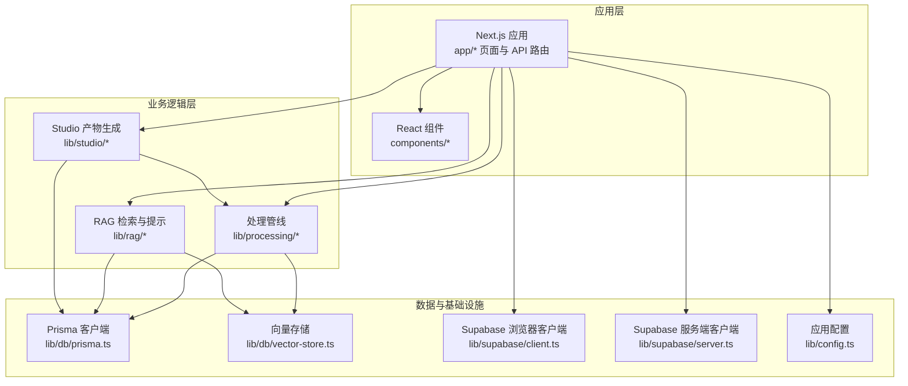
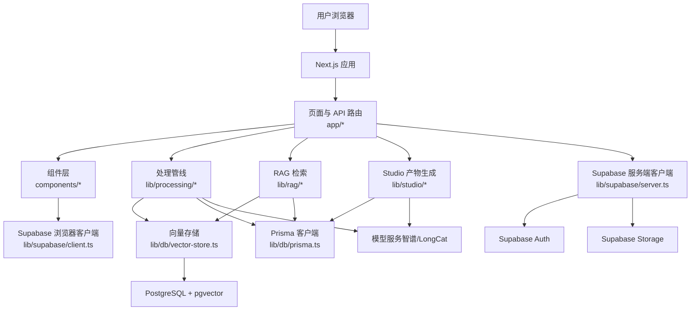
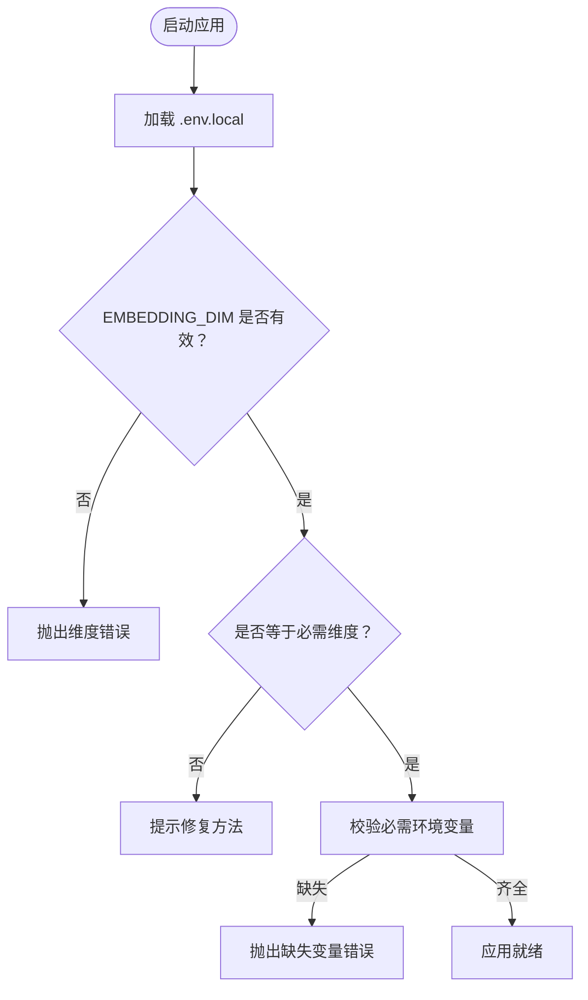
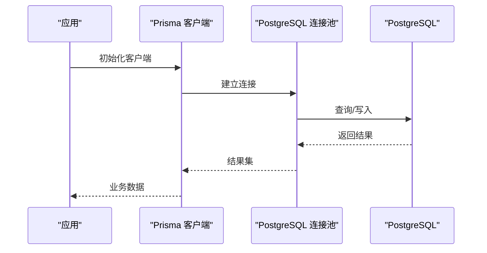
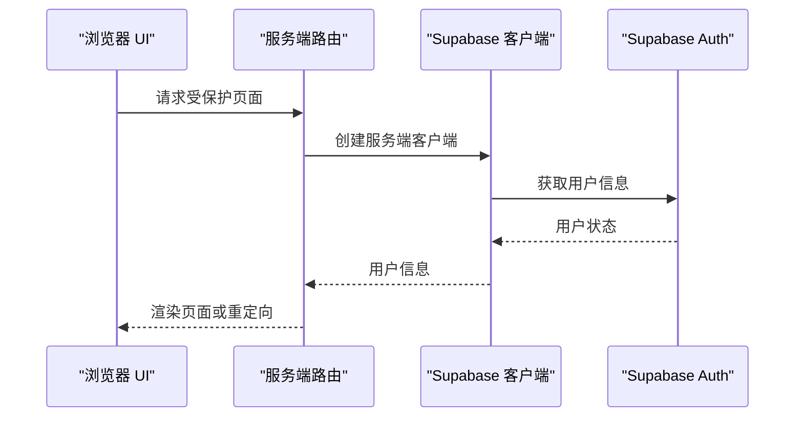
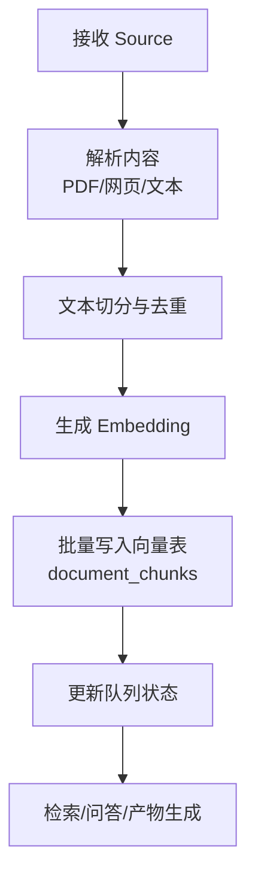
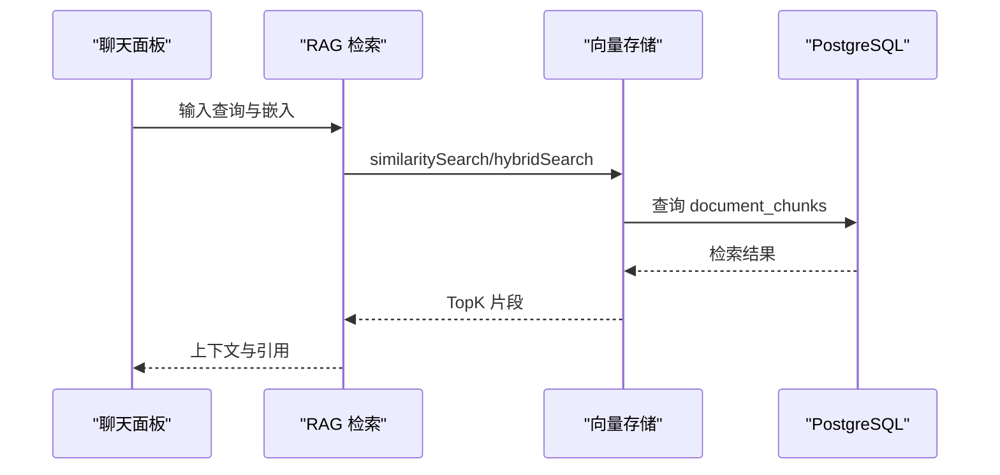
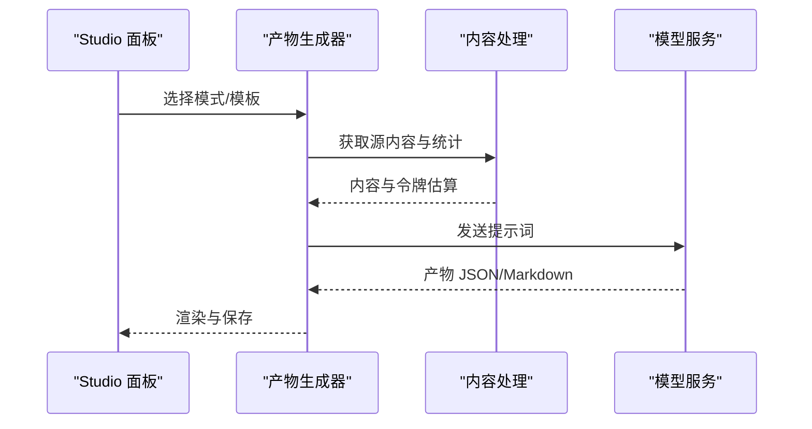
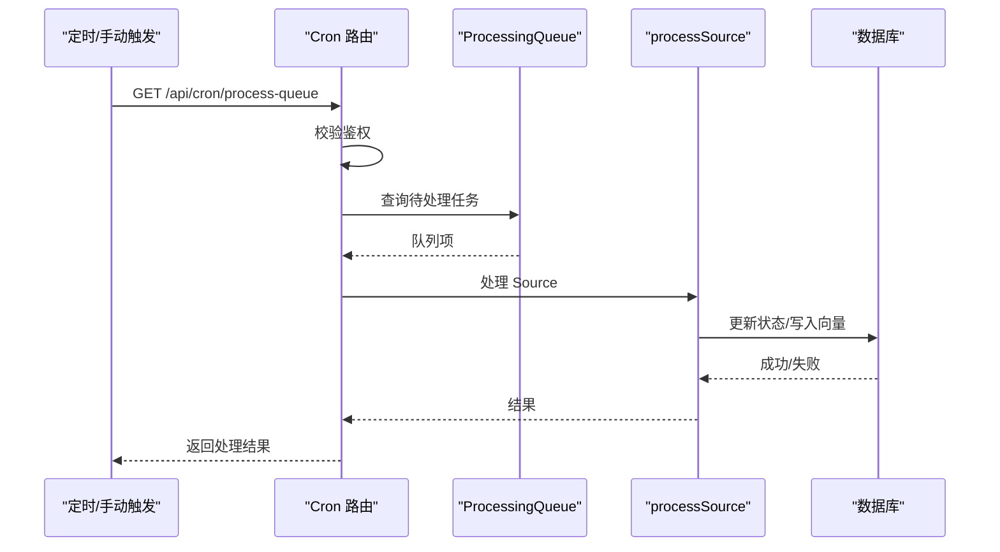
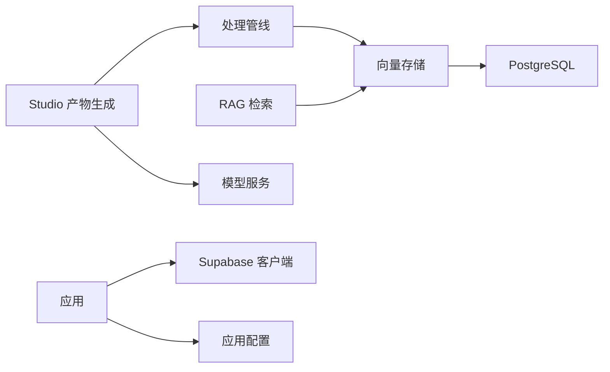

# 快速开始

<cite>
**本文引用的文件**
- [README.md](file://README.md)
- [package.json](file://package.json)
- [lib/config.ts](file://lib/config.ts)
- [lib/db/prisma.ts](file://lib/db/prisma.ts)
- [lib/supabase/client.ts](file://lib/supabase/client.ts)
- [lib/supabase/server.ts](file://lib/supabase/server.ts)
- [lib/db/vector-store.ts](file://lib/db/vector-store.ts)
- [prisma.config.ts](file://prisma.config.ts)
- [next.config.js](file://next.config.js)
- [middleware.ts](file://middleware.ts)
- [app/api/cron/process-queue/route.ts](file://app/api/cron/process-queue/route.ts)
- [lib/processing/index.ts](file://lib/processing/index.ts)
- [lib/rag/index.ts](file://lib/rag/index.ts)
- [lib/studio/index.ts](file://lib/studio/index.ts)
- [app/page.tsx](file://app/page.tsx)
- [components/notebook/notebook-content.tsx](file://components/notebook/notebook-content.tsx)
- [lib/utils/logger.ts](file://lib/utils/logger.ts)
</cite>

## 目录
1. [简介](#简介)
2. [项目结构](#项目结构)
3. [核心组件](#核心组件)
4. [架构总览](#架构总览)
5. [详细组件分析](#详细组件分析)
6. [依赖关系分析](#依赖关系分析)
7. [性能考虑](#性能考虑)
8. [故障排查指南](#故障排查指南)
9. [结论](#结论)
10. [附录](#附录)

## 简介
本指南面向首次接触 notebookLM-clone 的开发者，帮助你在最短时间内完成环境准备、依赖安装、数据库初始化与项目启动，并掌握本地开发与调试技巧。你将学会如何配置 Supabase 与模型服务、如何运行处理队列、如何在本地体验 Notebook、Sources、Chat 与 Studio 的核心功能。

## 项目结构
该项目采用 Next.js 14 App Router + TypeScript，核心目录与职责如下：
- app：页面与 API 路由（Notebooks、Sources、Chat、Studio、Templates、Cron）
- components：Notebook 三栏 UI（Sources / Chat / Studio）与通用组件
- lib：处理管线（processing）、RAG（rag）、Studio 产物生成（studio）、数据库与 Supabase 客户端、配置与工具
- prisma：Prisma schema 与 SQL migrations（含 pgvector 向量表）

图表来源
- [app/page.tsx](file://app/page.tsx#L1-L105)
- [components/notebook/notebook-content.tsx](file://components/notebook/notebook-content.tsx#L1-L128)
- [lib/processing/index.ts](file://lib/processing/index.ts#L1-L51)
- [lib/rag/index.ts](file://lib/rag/index.ts#L1-L24)
- [lib/studio/index.ts](file://lib/studio/index.ts#L1-L25)
- [lib/db/vector-store.ts](file://lib/db/vector-store.ts#L1-L446)
- [lib/db/prisma.ts](file://lib/db/prisma.ts#L1-L41)
- [lib/supabase/client.ts](file://lib/supabase/client.ts#L1-L14)
- [lib/supabase/server.ts](file://lib/supabase/server.ts#L1-L33)
- [lib/config.ts](file://lib/config.ts#L1-L187)

章节来源
- [README.md](file://README.md#L42-L49)

## 核心组件
- 应用配置与模型选择：负责读取环境变量、校验必要项、提供模型配置与默认值。
- 数据库与连接池：通过 Prisma + PostgreSQL + pgvector，提供向量检索与业务表管理。
- Supabase 客户端：分别提供浏览器端与服务端客户端，支撑认证、存储与会话。
- 处理管线：文本切分、PDF/网页解析、Embedding 生成、批量写入向量表、队列调度。
- RAG 检索：相似度检索与混合检索（向量 + 关键词/FTS），构建上下文与引用。
- Studio 产物生成：根据模板或模式生成结构化产物（测验、思维导图等）。

章节来源
- [lib/config.ts](file://lib/config.ts#L1-L187)
- [lib/db/prisma.ts](file://lib/db/prisma.ts#L1-L41)
- [lib/supabase/client.ts](file://lib/supabase/client.ts#L1-L14)
- [lib/supabase/server.ts](file://lib/supabase/server.ts#L1-L33)
- [lib/db/vector-store.ts](file://lib/db/vector-store.ts#L1-L446)
- [lib/processing/index.ts](file://lib/processing/index.ts#L1-L51)
- [lib/rag/index.ts](file://lib/rag/index.ts#L1-L24)
- [lib/studio/index.ts](file://lib/studio/index.ts#L1-L25)

## 架构总览
下图展示了从用户操作到数据库与模型服务的整体流程：页面与 API 路由驱动组件与业务模块；处理管线与 RAG 模块通过向量存储与数据库交互；Studio 产物生成模块调用模型服务；Supabase 提供认证与存储。

图表来源
- [lib/db/vector-store.ts](file://lib/db/vector-store.ts#L1-L446)
- [lib/db/prisma.ts](file://lib/db/prisma.ts#L1-L41)
- [lib/supabase/client.ts](file://lib/supabase/client.ts#L1-L14)
- [lib/supabase/server.ts](file://lib/supabase/server.ts#L1-L33)
- [lib/config.ts](file://lib/config.ts#L1-L187)

## 详细组件分析

### 环境与依赖准备
- 环境要求
  - Node.js 20（要求 ≥ 18.17）
  - 已创建的 Supabase 项目（Postgres + Storage）
- 安装依赖
  - 使用包管理器安装项目依赖
- 配置环境变量
  - 在项目根目录创建 .env.local，至少包含 Supabase、Prisma、模型服务、向量维度、Worker 鉴权等关键变量
- 初始化数据库
  - 执行数据库迁移，创建业务表与向量表、检索函数

章节来源
- [README.md](file://README.md#L53-L105)
- [package.json](file://package.json#L5-L16)
- [prisma.config.ts](file://prisma.config.ts#L1-L20)

### 应用配置与模型服务
- 向量维度校验：启动时强制校验 EMBEDDING_DIM，必须与数据库 vector(D) 一致
- 模型配置：支持智谱与 LongCat，提供模型列表与默认模型
- 环境变量校验：缺失关键变量时抛出明确错误提示

图表来源
- [lib/config.ts](file://lib/config.ts#L6-L29)
- [lib/config.ts](file://lib/config.ts#L169-L186)

章节来源
- [lib/config.ts](file://lib/config.ts#L1-L187)

### 数据库与连接池
- Prisma 客户端：通过适配器连接 PostgreSQL，开发环境下启用连接池与日志
- 连接字符串：使用 DATABASE_URL，生产环境建议使用 Supabase Transaction Pooler
- 日志：开发环境输出错误与警告，生产环境仅错误级别

图表来源
- [lib/db/prisma.ts](file://lib/db/prisma.ts#L18-L39)

章节来源
- [lib/db/prisma.ts](file://lib/db/prisma.ts#L1-L41)

### Supabase 客户端
- 浏览器端客户端：用于 Client Components，读取公共配置
- 服务端客户端：用于 Server Components/Actions/Route Handlers，支持会话读写

图表来源
- [lib/supabase/client.ts](file://lib/supabase/client.ts#L1-L14)
- [lib/supabase/server.ts](file://lib/supabase/server.ts#L1-L33)
- [middleware.ts](file://middleware.ts#L15-L71)

章节来源
- [lib/supabase/client.ts](file://lib/supabase/client.ts#L1-L14)
- [lib/supabase/server.ts](file://lib/supabase/server.ts#L1-L33)
- [middleware.ts](file://middleware.ts#L1-L78)

### 处理管线与向量存储
- 文档处理：文本切分、PDF/网页解析、Embedding 生成、批量写入向量表、队列调度
- 向量存储：批量插入、相似度检索、混合检索（向量 + FTS）、删除与去重
- 日志：统一记录向量操作的耗时、成功率与元数据

图表来源
- [lib/processing/index.ts](file://lib/processing/index.ts#L1-L51)
- [lib/db/vector-store.ts](file://lib/db/vector-store.ts#L77-L173)

章节来源
- [lib/processing/index.ts](file://lib/processing/index.ts#L1-L51)
- [lib/db/vector-store.ts](file://lib/db/vector-store.ts#L1-L446)
- [lib/utils/logger.ts](file://lib/utils/logger.ts#L75-L94)

### RAG 检索与提示
- 相似度检索：基于 pgvector 的余弦距离排序
- 混合检索：向量分数与关键词 FTS 分数加权融合
- 上下文构建与引用：根据检索结果构建消息与引用，未找到依据时返回提示

图表来源
- [lib/rag/index.ts](file://lib/rag/index.ts#L1-L24)
- [lib/db/vector-store.ts](file://lib/db/vector-store.ts#L175-L297)
- [lib/db/vector-store.ts](file://lib/db/vector-store.ts#L312-L442)

章节来源
- [lib/rag/index.ts](file://lib/rag/index.ts#L1-L24)
- [lib/db/vector-store.ts](file://lib/db/vector-store.ts#L175-L297)
- [lib/db/vector-store.ts](file://lib/db/vector-store.ts#L312-L442)

### Studio 产物生成
- 产物类型：测验、思维导图等结构化内容
- 生成策略：fast/precise 两种模式（采样/Map-Reduce）
- 模板运行：支持基于模板运行并保存为 Artifact

图表来源
- [lib/studio/index.ts](file://lib/studio/index.ts#L1-L25)
- [lib/processing/index.ts](file://lib/processing/index.ts#L1-L51)
- [lib/config.ts](file://lib/config.ts#L149-L157)

章节来源
- [lib/studio/index.ts](file://lib/studio/index.ts#L1-L25)
- [lib/processing/index.ts](file://lib/processing/index.ts#L1-L51)
- [lib/config.ts](file://lib/config.ts#L149-L157)

### 处理队列与 Cron Worker
- 队列路由：/api/cron/process-queue
- 鉴权：Authorization: Bearer $CRON_SECRET
- 本地触发：/api/cron/process-queue?manual=true
- 自我修复：扫描状态为 pending 但不在队列中的 Source 并恢复处理

图表来源
- [app/api/cron/process-queue/route.ts](file://app/api/cron/process-queue/route.ts#L11-L164)

章节来源
- [README.md](file://README.md#L124-L131)
- [app/api/cron/process-queue/route.ts](file://app/api/cron/process-queue/route.ts#L1-L165)

## 依赖关系分析
- 组件耦合与内聚
  - 处理管线与向量存储紧密耦合，保证数据一致性与性能
  - RAG 模块依赖向量存储与数据库，提供检索能力
  - Studio 依赖处理管线与模型服务，负责产物生成
  - Supabase 客户端贯穿前后端，提供认证与存储
- 外部依赖
  - Supabase：认证、存储、Postgres + pgvector
  - 模型服务：智谱、LongCat（OpenAI 兼容接口）
  - Prisma：数据库 ORM 与迁移

图表来源
- [lib/processing/index.ts](file://lib/processing/index.ts#L1-L51)
- [lib/db/vector-store.ts](file://lib/db/vector-store.ts#L1-L446)
- [lib/studio/index.ts](file://lib/studio/index.ts#L1-L25)
- [lib/config.ts](file://lib/config.ts#L1-L187)

章节来源
- [lib/processing/index.ts](file://lib/processing/index.ts#L1-L51)
- [lib/db/vector-store.ts](file://lib/db/vector-store.ts#L1-L446)
- [lib/studio/index.ts](file://lib/studio/index.ts#L1-L25)
- [lib/config.ts](file://lib/config.ts#L1-L187)

## 性能考虑
- 向量维度一致性：严格校验 EMBEDDING_DIM，避免运行时错误与性能退化
- 批量插入：向量存储按固定批次大小插入，减少事务开销
- 检索优化：CTE 消除重复计算，合理使用索引与阈值
- 连接池：生产环境使用 Supabase Transaction Pooler，限制连接数
- 日志：开发环境输出详细日志，生产环境仅错误级别，降低开销

章节来源
- [lib/config.ts](file://lib/config.ts#L6-L29)
- [lib/db/vector-store.ts](file://lib/db/vector-store.ts#L8-L173)
- [lib/db/vector-store.ts](file://lib/db/vector-store.ts#L204-L297)
- [lib/db/prisma.ts](file://lib/db/prisma.ts#L8-L16)
- [lib/utils/logger.ts](file://lib/utils/logger.ts#L29-L54)

## 故障排查指南
- 环境变量缺失
  - 现象：启动时报缺少必需环境变量
  - 处理：复制示例到 .env.local 并填入实际值
- 向量维度不匹配
  - 现象：启动时报维度错误或运行时报向量维度不一致
  - 处理：确保 EMBEDDING_DIM 与数据库 vector(D) 一致；如需更换模型，执行数据库迁移重建表
- 数据库连接失败
  - 现象：Prisma 初始化报错或查询失败
  - 处理：检查 DATABASE_URL/DIRECT_URL；生产环境使用 Supabase Transaction Pooler
- 处理队列无进展
  - 现象：Source 状态长期为 pending
  - 处理：确认 CRON_SECRET 正确；本地可使用 manual=true 触发；检查队列与数据库状态
- 检索结果为空
  - 现象：RAG 问答无结果或引用为空
  - 处理：确认 Embedding 已写入向量表；检查阈值与 topK 设置；确认混合检索权重合理

章节来源
- [lib/config.ts](file://lib/config.ts#L169-L186)
- [lib/config.ts](file://lib/config.ts#L18-L29)
- [lib/db/prisma.ts](file://lib/db/prisma.ts#L8-L16)
- [app/api/cron/process-queue/route.ts](file://app/api/cron/process-queue/route.ts#L22-L36)
- [lib/db/vector-store.ts](file://lib/db/vector-store.ts#L198-L202)

## 结论
通过本快速开始指南，你已掌握 notebookLM-clone 的环境搭建、依赖安装、数据库初始化与项目启动流程。结合本地开发与调试技巧，你可以快速体验 Notebook、Sources、Chat 与 Studio 的核心功能，并在此基础上开展二次开发与优化。

## 附录

### 本地开发与调试
- 开发启动
  - 使用开发服务器启动应用
- 质量检查
  - Lint 与类型检查
- 数据库管理
  - Prisma Studio 可视化数据库
- 图片与上传
  - Next.js 图像域名与远程模式配置，支持大文件上传

章节来源
- [README.md](file://README.md#L106-L122)
- [package.json](file://package.json#L5-L16)
- [next.config.js](file://next.config.js#L1-L21)

### 项目启动后的基本使用流程
- 登录与路由保护：受保护路由需登录，登录页对已登录用户重定向
- 首页与导航：首页展示功能介绍与技术栈，提供登录入口
- Notebook 三栏布局：左侧 Source、中间 Chat、右侧 Studio，支持可调整面板

章节来源
- [middleware.ts](file://middleware.ts#L9-L68)
- [app/page.tsx](file://app/page.tsx#L1-L105)
- [components/notebook/notebook-content.tsx](file://components/notebook/notebook-content.tsx#L71-L127)