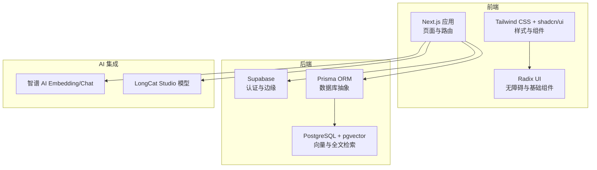
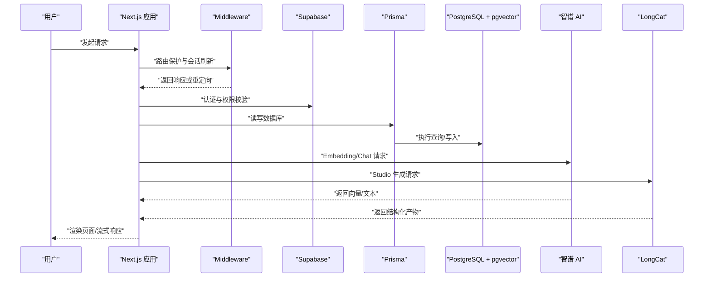
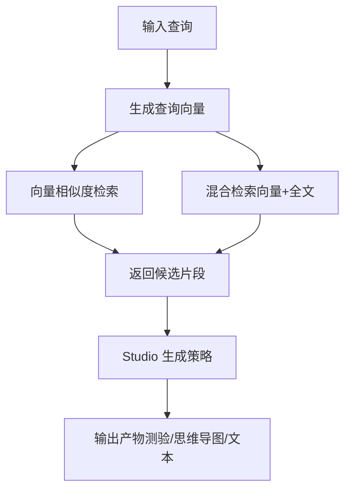
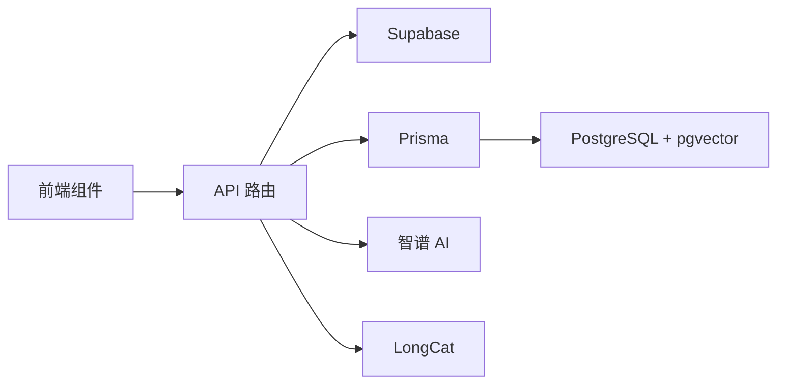

# 技术栈

<cite>
**本文引用的文件**
- [package.json](file://package.json)
- [next.config.js](file://next.config.js)
- [tsconfig.json](file://tsconfig.json)
- [tailwind.config.ts](file://tailwind.config.ts)
- [components.json](file://components.json)
- [lib/config.ts](file://lib/config.ts)
- [lib/db/prisma.ts](file://lib/db/prisma.ts)
- [lib/db/supabase.ts](file://lib/db/supabase.ts)
- [lib/db/vector-store.ts](file://lib/db/vector-store.ts)
- [lib/rag/retriever.ts](file://lib/rag/retriever.ts)
- [lib/processing/embedding.ts](file://lib/processing/embedding.ts)
- [lib/ai/zhipu.ts](file://lib/ai/zhipu.ts)
- [lib/studio/generator.ts](file://lib/studio/generator.ts)
- [middleware.ts](file://middleware.ts)
- [prisma.config.ts](file://prisma.config.ts)
</cite>

## 目录
1. [简介](#简介)
2. [项目结构](#项目结构)
3. [核心组件](#核心组件)
4. [架构总览](#架构总览)
5. [详细组件分析](#详细组件分析)
6. [依赖关系分析](#依赖关系分析)
7. [性能考量](#性能考量)
8. [故障排查指南](#故障排查指南)
9. [结论](#结论)
10. [附录](#附录)

## 简介
本项目是一个基于现代全栈技术栈构建的笔记与知识管理应用，重点围绕“向量检索增强生成”（RAG）能力，结合 AI 大模型进行内容生成与思维导图、测验等产物的产出。技术栈覆盖前端（Next.js 14 + React 18 + TypeScript）、UI 框架（Tailwind CSS + shadcn/ui + Radix UI）、后端（Supabase + Prisma ORM）、数据库（PostgreSQL + pgvector）、以及 AI 模型集成（智谱 AI + LongCat）。本文将系统阐述各技术选型的原因、优势、在项目中的职责与协作机制，并给出学习路径、版本要求、兼容性与升级策略。

## 项目结构
项目采用按功能域组织的目录结构，前端页面与 API 路由分离，业务逻辑分布在 lib 下的子模块中，数据库与 AI 相关能力分别封装在独立模块内，便于维护与扩展。

**图表来源**
- [package.json](file://package.json#L17-L64)
- [next.config.js](file://next.config.js#L1-L21)
- [tailwind.config.ts](file://tailwind.config.ts#L1-L95)
- [lib/db/prisma.ts](file://lib/db/prisma.ts#L1-L41)
- [lib/db/vector-store.ts](file://lib/db/vector-store.ts#L1-L446)
- [lib/ai/zhipu.ts](file://lib/ai/zhipu.ts#L1-L196)
- [lib/studio/generator.ts](file://lib/studio/generator.ts#L1-L311)

**章节来源**
- [package.json](file://package.json#L17-L64)
- [next.config.js](file://next.config.js#L1-L21)
- [tsconfig.json](file://tsconfig.json#L1-L28)
- [tailwind.config.ts](file://tailwind.config.ts#L1-L95)
- [components.json](file://components.json#L1-L23)

## 核心组件
- 前端技术栈
  - Next.js 14：提供 App Router、Server Actions、图像优化与严格模式等能力，满足现代 Web 开发需求。
  - React 18：稳定生态与并发特性，配合 Suspense 与自动批处理提升交互体验。
  - TypeScript：强类型保障，配合 Next.js 插件与路径别名，提升开发效率与可维护性。
- UI 框架
  - Tailwind CSS：原子化工具类，快速构建一致的视觉风格；与 shadcn/ui 配合，获得语义化组件与主题定制能力。
  - Radix UI：底层无障碍与语义组件，确保可访问性与可组合性。
- 后端技术
  - Supabase：提供认证、边缘、对象存储与实时订阅，简化后端开发。
  - Prisma ORM：类型安全的数据库抽象层，支持迁移、事务与复杂查询。
- 数据库
  - PostgreSQL + pgvector：支持向量相似度检索与全文检索（TSVector），满足 RAG 场景的混合检索需求。
- AI 模型集成
  - 智谱 AI：Embedding 与 Chat API，统一封装与重试策略，确保稳定性。
  - LongCat：Studio 模式下的推理模型，支持 Map-Reduce 生成策略与超时控制。

**章节来源**
- [package.json](file://package.json#L17-L64)
- [next.config.js](file://next.config.js#L1-L21)
- [tsconfig.json](file://tsconfig.json#L1-L28)
- [tailwind.config.ts](file://tailwind.config.ts#L1-L95)
- [components.json](file://components.json#L1-L23)
- [lib/config.ts](file://lib/config.ts#L1-L187)
- [lib/db/prisma.ts](file://lib/db/prisma.ts#L1-L41)
- [lib/db/vector-store.ts](file://lib/db/vector-store.ts#L1-L446)
- [lib/ai/zhipu.ts](file://lib/ai/zhipu.ts#L1-L196)
- [lib/studio/generator.ts](file://lib/studio/generator.ts#L1-L311)

## 架构总览
下图展示了从前端请求到数据库与 AI 模型的整体数据流与组件交互。

**图表来源**
- [middleware.ts](file://middleware.ts#L15-L71)
- [lib/db/supabase.ts](file://lib/db/supabase.ts#L12-L33)
- [lib/db/prisma.ts](file://lib/db/prisma.ts#L23-L39)
- [lib/db/vector-store.ts](file://lib/db/vector-store.ts#L77-L446)
- [lib/ai/zhipu.ts](file://lib/ai/zhipu.ts#L53-L156)
- [lib/studio/generator.ts](file://lib/studio/generator.ts#L53-L115)

## 详细组件分析

### 前端技术栈（Next.js 14 + React 18 + TypeScript）
- Next.js 14
  - App Router：以文件系统为路由，支持布局、加载与错误边界。
  - Server Actions：在服务端执行状态变更，减少客户端与服务端往返。
  - 图像优化与严格模式：提升性能与开发体验。
- React 18
  - 并发特性与自动批处理，改善交互流畅度。
- TypeScript
  - 严格的类型检查与路径别名，配合 Next 插件提升 DX。

**章节来源**
- [next.config.js](file://next.config.js#L1-L21)
- [tsconfig.json](file://tsconfig.json#L1-L28)
- [package.json](file://package.json#L55-L64)

### UI 框架（Tailwind CSS + shadcn/ui + Radix UI）
- Tailwind CSS
  - 原子化样式，快速构建一致界面；暗色模式与动画扩展增强交互体验。
- shadcn/ui
  - 语义化组件库，与 Tailwind 配置保持一致，支持 TSX 与 RSC。
- Radix UI
  - 提供基础无障碍组件（对话框、下拉菜单、标签页等），保证可访问性。

**章节来源**
- [tailwind.config.ts](file://tailwind.config.ts#L1-L95)
- [components.json](file://components.json#L1-L23)
- [package.json](file://package.json#L24-L36)

### 后端技术（Supabase + Prisma ORM）
- Supabase
  - 认证与权限校验：通过中间件刷新会话并校验资源所有权。
  - 边缘与对象存储：简化后端逻辑，降低运维成本。
- Prisma ORM
  - 类型安全的数据访问层，支持复杂查询与事务。
  - 适配 pgvector 的向量类型与自定义 SQL 批量写入。

**章节来源**
- [middleware.ts](file://middleware.ts#L15-L71)
- [lib/db/supabase.ts](file://lib/db/supabase.ts#L12-L33)
- [lib/db/prisma.ts](file://lib/db/prisma.ts#L1-L41)
- [prisma.config.ts](file://prisma.config.ts#L1-L20)

### 数据库（PostgreSQL + pgvector）
- 向量检索
  - 使用向量类型与距离操作符实现相似度检索，支持 CTE 与阈值过滤。
- 全文检索
  - 使用 TSVector 与简单分词器，支持多语言与混合检索。
- 批量写入
  - 分批插入与冲突忽略，避免重复与长事务。

**章节来源**
- [lib/db/vector-store.ts](file://lib/db/vector-store.ts#L77-L446)
- [lib/config.ts](file://lib/config.ts#L6-L29)

### AI 模型集成（智谱 AI + LongCat）
- 智谱 AI
  - Embedding 与 Chat API 封装，统一维度校验与重试策略。
  - 流式 Chat 支持，前端可边接收边渲染。
- LongCat
  - Studio 模式专用推理模型，支持 Map-Reduce 生成策略与超时控制。
  - 产物解析（测验、思维导图）与模板驱动生成。

**章节来源**
- [lib/ai/zhipu.ts](file://lib/ai/zhipu.ts#L53-L156)
- [lib/studio/generator.ts](file://lib/studio/generator.ts#L29-L115)
- [lib/config.ts](file://lib/config.ts#L38-L52)

### 检索与生成链路（RAG）
- 检索
  - 将查询转为向量，调用向量相似度检索或混合检索（向量 + 全文）。
- 生成
  - Studio 模式根据模式选择智能采样或 Map-Reduce 策略，结合模板与上下文生成产物。

**图表来源**
- [lib/rag/retriever.ts](file://lib/rag/retriever.ts#L53-L116)
- [lib/db/vector-store.ts](file://lib/db/vector-store.ts#L175-L297)
- [lib/studio/generator.ts](file://lib/studio/generator.ts#L120-L237)

**章节来源**
- [lib/rag/retriever.ts](file://lib/rag/retriever.ts#L1-L206)
- [lib/db/vector-store.ts](file://lib/db/vector-store.ts#L1-L446)
- [lib/studio/generator.ts](file://lib/studio/generator.ts#L1-L311)

## 依赖关系分析
- 前端与后端解耦
  - 前端通过 API 路由与 Supabase/Prisma 交互，避免直接暴露数据库连接。
- 数据流与职责分离
  - 检索链路：前端触发 → 向量化 → 向量/全文检索 → 返回上下文。
  - 生成链路：前端触发 → 上下文采样/Map-Reduce → LLM 生成 → 解析与落库。
- 组件耦合与内聚
  - AI 封装与配置集中管理，避免散落的 API 调用与硬编码。

**图表来源**
- [lib/db/supabase.ts](file://lib/db/supabase.ts#L12-L33)
- [lib/db/prisma.ts](file://lib/db/prisma.ts#L23-L39)
- [lib/db/vector-store.ts](file://lib/db/vector-store.ts#L77-L446)
- [lib/ai/zhipu.ts](file://lib/ai/zhipu.ts#L53-L156)
- [lib/studio/generator.ts](file://lib/studio/generator.ts#L53-L115)

**章节来源**
- [package.json](file://package.json#L17-L64)
- [lib/config.ts](file://lib/config.ts#L1-L187)

## 性能考量
- 向量检索
  - 使用阈值过滤与 LIMIT 控制返回规模；CTE 减少重复计算。
  - 批量插入与冲突忽略避免重复写入。
- 文本处理
  - 批量 Embedding 与指数退避重试，控制单次请求 token 数与批次大小。
- 生成链路
  - Studio 模式区分快速与精准，合理设置超时与上下文截断。
- 前端优化
  - Next.js 图像优化、严格模式与 Server Actions 减少网络往返。

**章节来源**
- [lib/db/vector-store.ts](file://lib/db/vector-store.ts#L88-L173)
- [lib/processing/embedding.ts](file://lib/processing/embedding.ts#L140-L189)
- [lib/studio/generator.ts](file://lib/studio/generator.ts#L23-L27)

## 故障排查指南
- 环境变量缺失
  - 启动前验证必需变量，确保 Supabase、数据库与 AI 密钥正确配置。
- 向量维度不一致
  - 系统强制 1024 维，若配置不一致将抛出错误，需修正配置或迁移表结构。
- 权限校验失败
  - 中间件会拦截未登录或越权访问，检查会话与资源归属。
- AI 调用异常
  - 智谱封装包含重试与维度校验，关注 429/5xx 错误与流式响应状态码。
- 数据库连接问题
  - Prisma 使用 Postgres 连接池，检查连接字符串与 pgbouncer 参数。

**章节来源**
- [lib/config.ts](file://lib/config.ts#L169-L187)
- [lib/config.ts](file://lib/config.ts#L17-L29)
- [middleware.ts](file://middleware.ts#L55-L68)
- [lib/ai/zhipu.ts](file://lib/ai/zhipu.ts#L168-L195)
- [lib/db/prisma.ts](file://lib/db/prisma.ts#L23-L39)

## 结论
该技术栈在易用性、可维护性与性能之间取得良好平衡：前端以 Next.js 14 为核心，UI 采用 Tailwind + shadcn/ui + Radix UI，后端依托 Supabase 与 Prisma，数据库使用 PostgreSQL + pgvector 支撑 RAG，AI 集成通过智谱与 LongCat 提供稳定的嵌入与生成能力。整体架构清晰、职责明确，适合快速迭代与规模化扩展。

## 附录

### 学习路径建议
- 前端
  - Next.js 14 App Router、Server Actions、图像优化与严格模式。
  - React 18 并发特性与 TypeScript 基础。
  - Tailwind CSS 原子化样式与 shadcn/ui 组件使用。
- 后端
  - Supabase 认证、边缘与对象存储。
  - Prisma ORM 查询、迁移与事务。
- 数据库
  - PostgreSQL 与 pgvector 向量类型、TSVector 全文检索。
- AI 集成
  - 智谱 Embedding/Chat API 与流式响应。
  - LongCat Studio 生成策略与产物解析。

### 版本要求与兼容性
- Next.js 14.2.x、React 18.2、TypeScript 5.9.x
- Tailwind CSS 3.4.x、shadcn/ui 与 Radix UI
- Supabase JS 2.89.x、Prisma 7.2.x
- PostgreSQL + pgvector（向量与全文检索）

### 升级策略
- 逐步升级 Next.js 与 React，先在开发环境验证，再迁移生产。
- Prisma 升级前先运行迁移与测试，确保向量类型与自定义 SQL 兼容。
- AI SDK 与模型接口变化时，集中更新封装层与配置项。

**章节来源**
- [package.json](file://package.json#L55-L80)
- [lib/config.ts](file://lib/config.ts#L31-L52)
- [lib/db/prisma.ts](file://lib/db/prisma.ts#L1-L41)