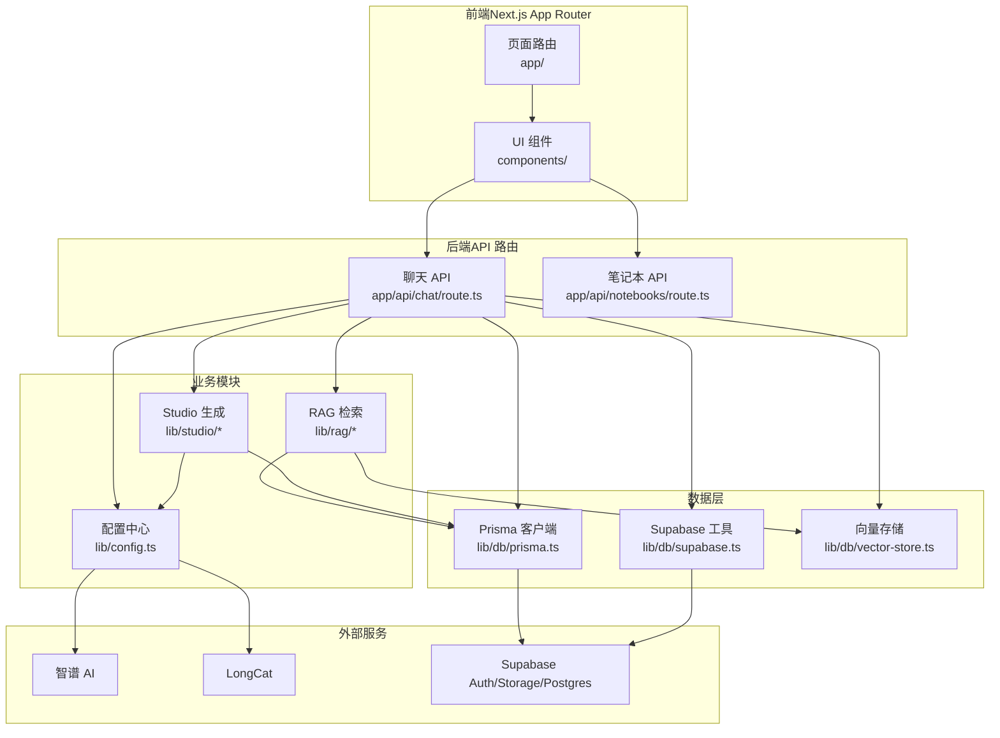
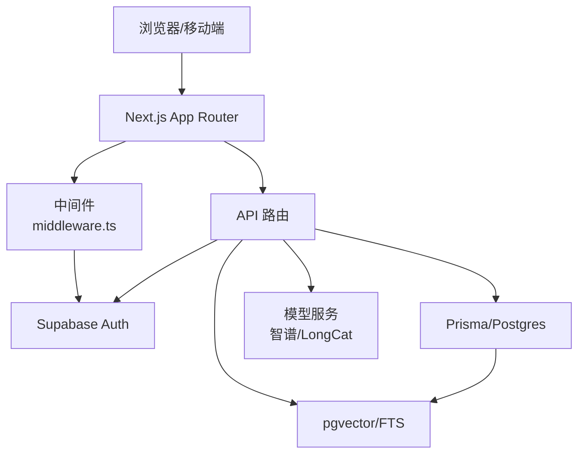
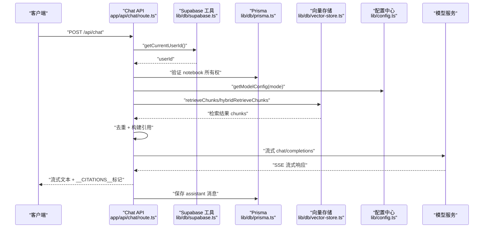
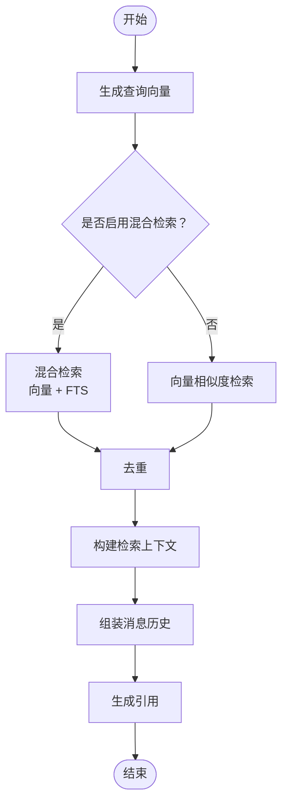
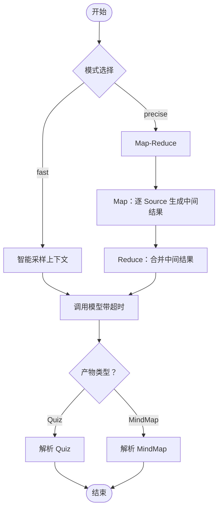
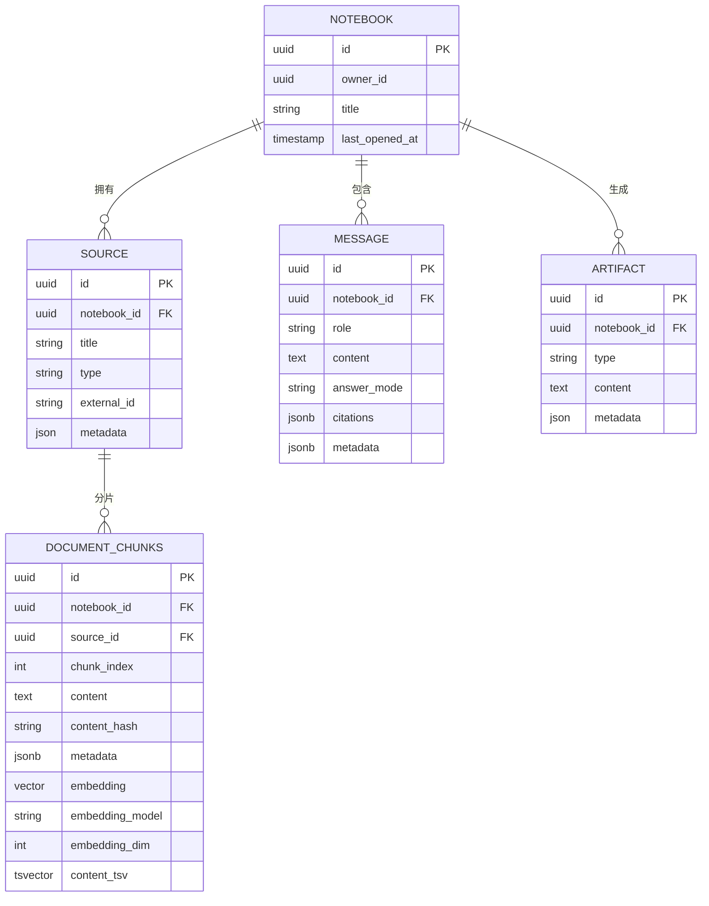
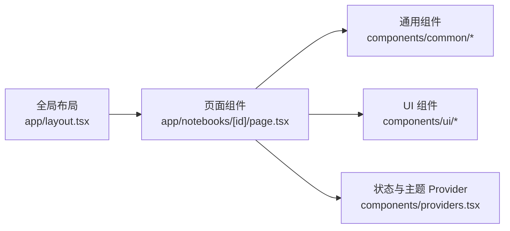
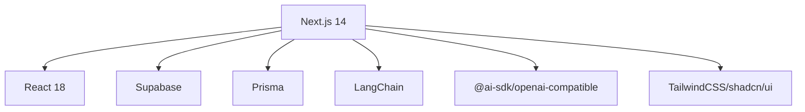

# 架构概览

<cite>
**本文引用的文件**
- [README.md](file://README.md)
- [package.json](file://package.json)
- [next.config.js](file://next.config.js)
- [middleware.ts](file://middleware.ts)
- [lib/config.ts](file://lib/config.ts)
- [lib/db/prisma.ts](file://lib/db/prisma.ts)
- [lib/db/supabase.ts](file://lib/db/supabase.ts)
- [lib/db/vector-store.ts](file://lib/db/vector-store.ts)
- [lib/rag/index.ts](file://lib/rag/index.ts)
- [lib/rag/retriever.ts](file://lib/rag/retriever.ts)
- [lib/studio/index.ts](file://lib/studio/index.ts)
- [lib/studio/generator.ts](file://lib/studio/generator.ts)
- [app/api/chat/route.ts](file://app/api/chat/route.ts)
- [app/api/notebooks/route.ts](file://app/api/notebooks/route.ts)
</cite>

## 目录
1. [简介](#简介)
2. [项目结构](#项目结构)
3. [核心组件](#核心组件)
4. [架构总览](#架构总览)
5. [详细组件分析](#详细组件分析)
6. [依赖分析](#依赖分析)
7. [性能考量](#性能考量)
8. [故障排查指南](#故障排查指南)
9. [结论](#结论)
10. [附录](#附录)

## 简介
本项目是一个类似 NotebookLM 的个人/团队知识库原型，提供“导入资料 → 处理与向量化 → 基于证据的对话（带引用）→ Studio 生成结构化产物”的完整闭环。系统采用分层架构与模块化设计，结合 Supabase（Auth/Storage/Postgres+pgvector）、Next.js App Router、Prisma、LangChain 生态与 OpenAI 兼容模型服务（智谱、LongCat），实现可扩展、可观测、可维护的知识管理与智能问答系统。

## 项目结构
- 前端（Next.js App Router + React 组件体系）
  - 页面路由：app/ 下按功能划分（notebooks、auth、api 等）
  - UI 组件：components/ 下的 notebook、ui、common 等
  - 全局样式与主题：globals.css、tailwind.config.ts、components.json
- 后端（API 路由 + 业务逻辑层）
  - API 路由：app/api/*，统一处理鉴权、权限校验、业务编排
  - 业务模块：lib/processing、lib/rag、lib/studio、lib/db、lib/ai 等
- 数据架构（数据库 + 向量存储）
  - 业务表：Prisma 管理（notebooks/sources/messages/artifacts 等）
  - 向量表：document_chunks + pgvector + FTS（全文检索）
- AI 集成（模型服务 + 提示词工程）
  - 模型服务：智谱、LongCat（OpenAI 兼容接口）
  - 提示词工程：RAG 提示词组装、Studio 产物生成提示词

**图表来源**
- [app/api/chat/route.ts](file://app/api/chat/route.ts#L1-L324)
- [app/api/notebooks/route.ts](file://app/api/notebooks/route.ts#L1-L67)
- [lib/rag/retriever.ts](file://lib/rag/retriever.ts#L1-L206)
- [lib/studio/generator.ts](file://lib/studio/generator.ts#L1-L311)
- [lib/db/vector-store.ts](file://lib/db/vector-store.ts#L1-L446)
- [lib/db/prisma.ts](file://lib/db/prisma.ts#L1-L41)
- [lib/db/supabase.ts](file://lib/db/supabase.ts#L1-L39)
- [lib/config.ts](file://lib/config.ts#L1-L187)

**章节来源**
- [README.md](file://README.md#L42-L49)
- [next.config.js](file://next.config.js#L1-L21)

## 核心组件
- 配置中心（lib/config.ts）
  - 统一管理模型提供商、API Key、基础 URL、默认模型、应用参数（chunkSize、topK、阈值等）
  - 启动时进行向量维度一致性校验，确保与数据库 vector(D) 一致
- 数据层（lib/db/*）
  - Prisma 客户端：基于 Postgres + pgvector，适配 Serverless 连接池
  - Supabase 工具：获取当前用户、资源所有权校验
  - 向量存储：封装 document_chunks 表的插入、相似度检索、混合检索、去重、统计
- RAG 模块（lib/rag/*）
  - 检索器：向量检索、混合检索（向量 + FTS）、去重、结果聚合
  - 提示词：构建检索上下文、消息历史、引用标注、系统提示
- Studio 模块（lib/studio/*）
  - 产物生成：fast/precise 两种策略（智能采样 vs Map-Reduce）
  - 解析器：Quiz/MindMap JSON 容错解析
  - 内容统计与截断：上下文估算、智能截断
- API 路由（app/api/*）
  - 路由保护与权限：middleware.ts 基于 Supabase Auth
  - 聊天 API：RAG 检索 + 流式生成 + 引用标注
  - 笔记本 API：创建、列表、权限校验

**章节来源**
- [lib/config.ts](file://lib/config.ts#L1-L187)
- [lib/db/prisma.ts](file://lib/db/prisma.ts#L1-L41)
- [lib/db/supabase.ts](file://lib/db/supabase.ts#L1-L39)
- [lib/db/vector-store.ts](file://lib/db/vector-store.ts#L1-L446)
- [lib/rag/index.ts](file://lib/rag/index.ts#L1-L24)
- [lib/studio/index.ts](file://lib/studio/index.ts#L1-L25)
- [middleware.ts](file://middleware.ts#L1-L78)
- [app/api/chat/route.ts](file://app/api/chat/route.ts#L1-L324)
- [app/api/notebooks/route.ts](file://app/api/notebooks/route.ts#L1-L67)

## 架构总览
系统采用“前端页面 + API 路由 + 业务模块 + 数据层 + 外部模型服务”的分层设计：
- 前端负责用户交互与状态管理，通过 Next.js App Router 的页面与路由组织功能
- API 路由承担鉴权、权限校验、业务编排与数据持久化
- 业务模块封装 RAG 与 Studio 的核心算法与提示词工程
- 数据层通过 Prisma 与 Supabase 管理业务表与向量表，提供高性能检索
- AI 集成通过 OpenAI 兼容接口对接多个模型提供商，支持流式输出与超时控制

**图表来源**
- [middleware.ts](file://middleware.ts#L1-L78)
- [app/api/chat/route.ts](file://app/api/chat/route.ts#L1-L324)
- [lib/db/prisma.ts](file://lib/db/prisma.ts#L1-L41)
- [lib/db/vector-store.ts](file://lib/db/vector-store.ts#L1-L446)
- [lib/config.ts](file://lib/config.ts#L1-L187)

## 详细组件分析

### 聊天 API（RAG 问答）流程
聊天 API 是系统的核心入口之一，负责接收用户消息、执行 RAG 检索、流式生成回答并附加引用信息。

**图表来源**
- [app/api/chat/route.ts](file://app/api/chat/route.ts#L25-L324)
- [lib/db/supabase.ts](file://lib/db/supabase.ts#L12-L33)
- [lib/db/vector-store.ts](file://lib/db/vector-store.ts#L77-L443)
- [lib/rag/retriever.ts](file://lib/rag/retriever.ts#L53-L206)
- [lib/config.ts](file://lib/config.ts#L118-L157)

**章节来源**
- [app/api/chat/route.ts](file://app/api/chat/route.ts#L1-L324)
- [lib/rag/retriever.ts](file://lib/rag/retriever.ts#L1-L206)
- [lib/db/vector-store.ts](file://lib/db/vector-store.ts#L1-L446)
- [lib/config.ts](file://lib/config.ts#L1-L187)

### 检索与提示词工程（RAG）
- 检索器支持向量检索与混合检索（向量 + FTS），并提供去重与结果聚合
- 提示词工程负责将检索到的内容拼接到系统提示中，并生成引用标注
- 配置中心统一管理 topK、阈值、权重等参数

**图表来源**
- [lib/rag/retriever.ts](file://lib/rag/retriever.ts#L53-L206)
- [lib/rag/index.ts](file://lib/rag/index.ts#L1-L24)

**章节来源**
- [lib/rag/retriever.ts](file://lib/rag/retriever.ts#L1-L206)
- [lib/rag/index.ts](file://lib/rag/index.ts#L1-L24)

### Studio 产物生成（fast/precise）
- fast 策略：智能采样上下文，直接调用模型生成产物并解析
- precise 策略：Map-Reduce，先对每个 Source 生成中间结果，再合并 Reduce 得到最终产物
- 支持 Quiz 与 MindMap 的 JSON 容错解析

**图表来源**
- [lib/studio/generator.ts](file://lib/studio/generator.ts#L120-L311)
- [lib/studio/index.ts](file://lib/studio/index.ts#L1-L25)

**章节来源**
- [lib/studio/generator.ts](file://lib/studio/generator.ts#L1-L311)
- [lib/studio/index.ts](file://lib/studio/index.ts#L1-L25)

### 数据架构与向量存储
- 业务表：notebooks/sources/messages/artifacts 等，由 Prisma 管理
- 向量表：document_chunks，包含 notebook_id/source_id/chunk_index/content/content_hash/embedding/embedding_model/embedding_dim/metadata/tsv 等字段
- 检索函数：match_document_chunks（SQL/RPC），支持向量相似度与 FTS
- 向量存储类：PrismaVectorStore，提供批量插入、相似度检索、混合检索、删除、去重哈希查询等能力

**图表来源**
- [lib/db/vector-store.ts](file://lib/db/vector-store.ts#L1-L446)
- [lib/db/prisma.ts](file://lib/db/prisma.ts#L1-L41)

**章节来源**
- [lib/db/vector-store.ts](file://lib/db/vector-store.ts#L1-L446)
- [lib/db/prisma.ts](file://lib/db/prisma.ts#L1-L41)

### 前端架构（Next.js App Router + React 组件）
- 页面组织：按功能模块划分（notebooks、auth、api 等），利用 App Router 的路由与布局
- 组件体系：notebook 三栏（Sources/Chat/Studio）与通用 UI 组件，配合 shadcn/ui + Radix UI
- 中间件：统一路由保护与会话刷新，防止未登录访问受保护路由

**图表来源**
- [middleware.ts](file://middleware.ts#L1-L78)
- [next.config.js](file://next.config.js#L1-L21)

**章节来源**
- [middleware.ts](file://middleware.ts#L1-L78)
- [next.config.js](file://next.config.js#L1-L21)

## 依赖分析
- 运行时依赖
  - Next.js 14、React 18、TypeScript
  - Supabase（Auth/Storage/Postgres）、Prisma、pgvector
  - LangChain、ai SDK、@ai-sdk/openai-compatible
  - 图表与可视化：@ant-design/x、@xyflow/react、dagre
- 开发依赖
  - ESLint、TailwindCSS、TypeScript

**图表来源**
- [package.json](file://package.json#L17-L80)

**章节来源**
- [package.json](file://package.json#L1-L82)

## 性能考量
- 连接池与 Serverless 适配
  - Prisma 通过 @prisma/adapter-pg + pg Pool 适配 Vercel 等 Serverless 环境，限制每实例连接数
- 向量操作优化
  - 插入：批量分批（默认 500 条/批），避免单次过大事务
  - 查询：CTE 避免重复计算；阈值过滤；按相似度降序限制 topK
  - 混合检索：向量与 FTS 加权融合，提升召回质量
- 检索与生成超时
  - Chat API 最大持续时间限制；Studio Map/Reduce/模板生成分别设置超时
- 日志与可观测
  - 向量操作与检索查询记录成功/失败、耗时、平均相似度等指标

**章节来源**
- [lib/db/prisma.ts](file://lib/db/prisma.ts#L5-L16)
- [lib/db/vector-store.ts](file://lib/db/vector-store.ts#L8-L173)
- [lib/rag/retriever.ts](file://lib/rag/retriever.ts#L6-L13)
- [lib/studio/generator.ts](file://lib/studio/generator.ts#L22-L34)
- [app/api/chat/route.ts](file://app/api/chat/route.ts#L22-L23)

## 故障排查指南
- 环境变量缺失
  - 启动前校验必要环境变量（Supabase URL/Key、DATABASE_URL、ZHIPU_API_KEY、EMBEDDING_DIM）
- 向量维度不一致
  - 启动时强制校验 EMBEDDING_DIM，必须与数据库 vector(D) 一致；否则抛出错误并给出修复指引
- 权限与所有权
  - 所有 API 调用前需通过 getCurrentUserId 与 verifyOwnership 校验当前用户与资源归属
- 检索无依据
  - 当检索不到证据时，返回固定提示并记录检索详情（embedding/retrieval 耗时、模型、topK 等）
- 流式生成异常
  - Chat API 对 LLM 响应进行流式转换，遇到错误返回 500 并记录错误日志
- Studio 生成失败
  - Map-Reduce 中任一 Source 处理失败不影响整体流程；若无任何中间结果则抛出生成失败错误

**章节来源**
- [lib/config.ts](file://lib/config.ts#L169-L187)
- [lib/db/supabase.ts](file://lib/db/supabase.ts#L12-L33)
- [app/api/chat/route.ts](file://app/api/chat/route.ts#L129-L158)
- [lib/studio/generator.ts](file://lib/studio/generator.ts#L190-L203)

## 结论
本项目以“前端页面 + API 路由 + 业务模块 + 数据层 + AI 集成”为核心架构，围绕 RAG 问答与 Studio 产物生成两条主线展开。通过严格的配置校验、权限控制、向量检索优化与流式生成能力，系统在可扩展性与性能之间取得平衡。建议后续关注：
- 向量索引与 FTS 的持续优化（复合索引、hnsw 参数）
- 模板与产物解析的容错与回退策略完善
- 监控与告警体系（结合日志指标）的增强

## 附录
- 快速开始与常用命令参见 README
- 处理队列与 Cron Worker 的鉴权与触发方式参见 README

**章节来源**
- [README.md](file://README.md#L51-L122)