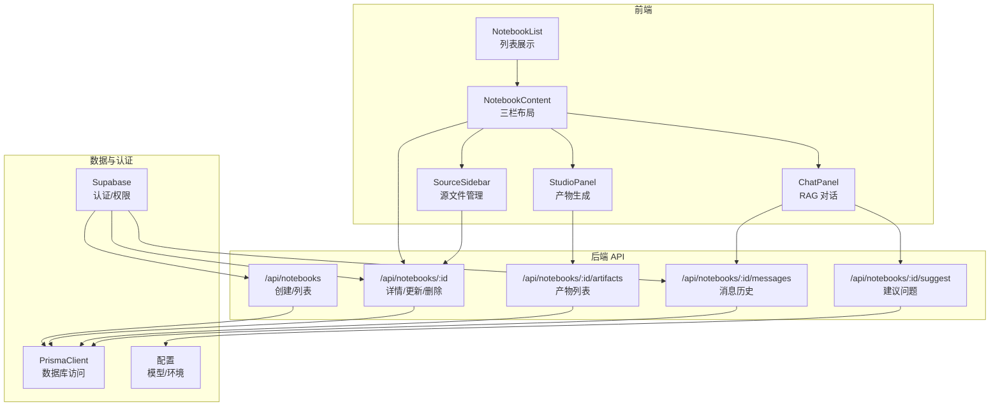
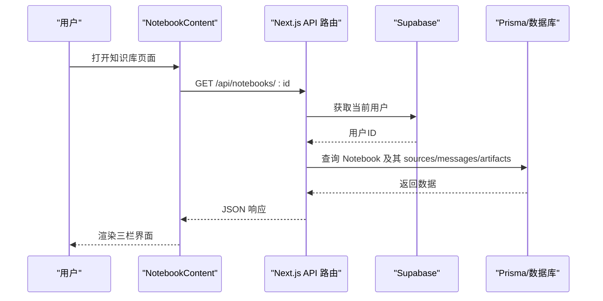
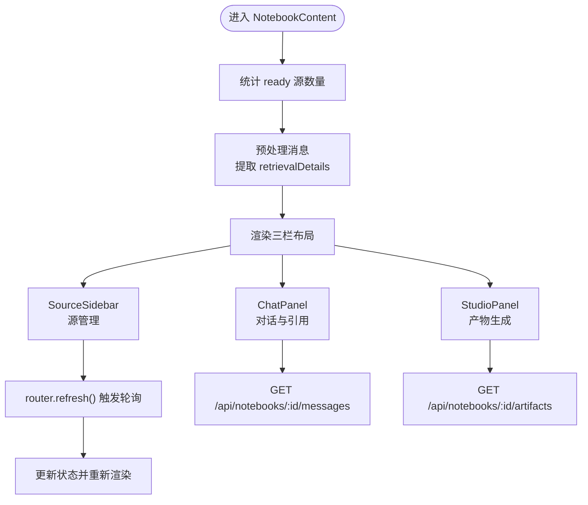
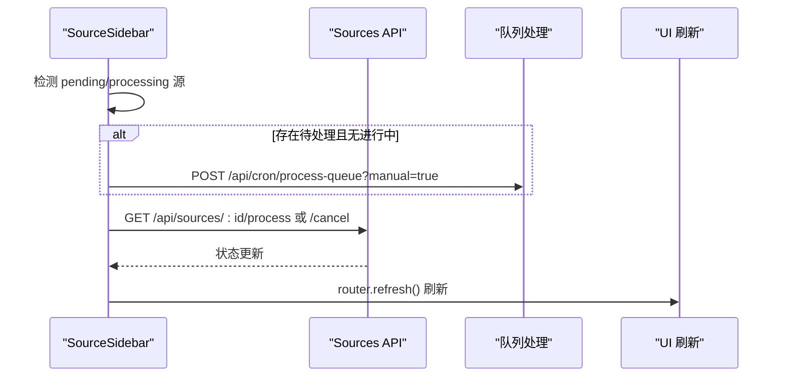
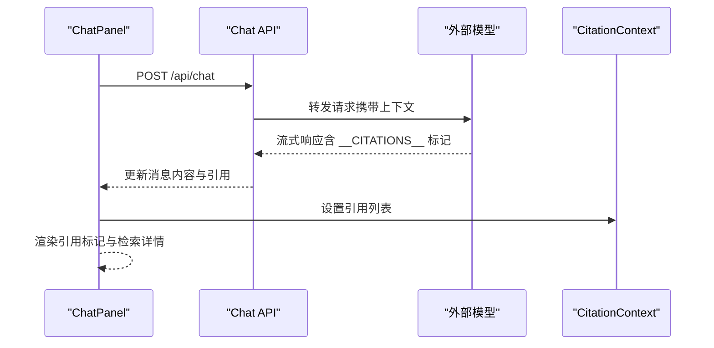
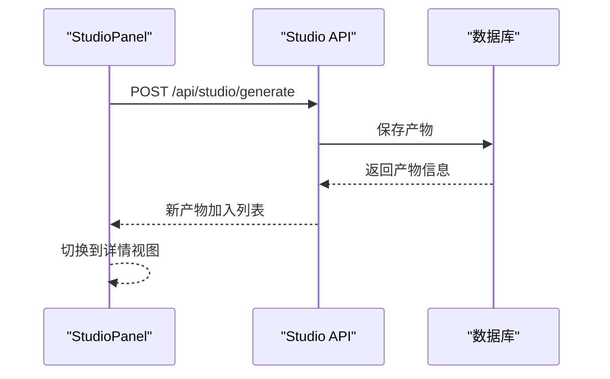
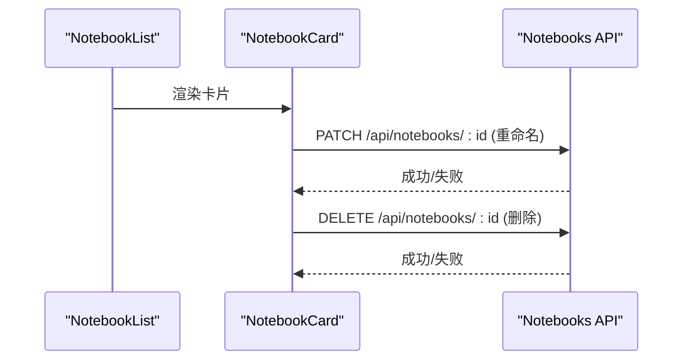
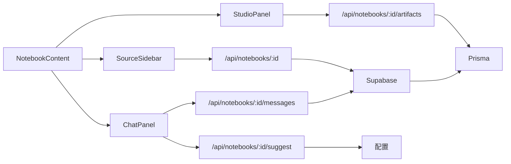
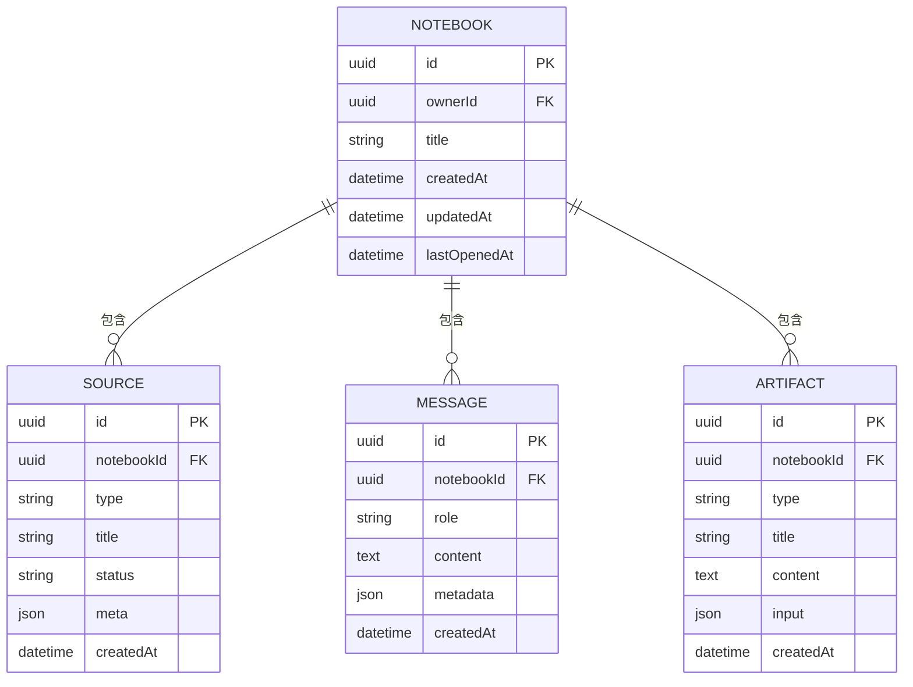

# Notebook 知识库管理

<cite>
**本文档引用的文件**
- [app/api/notebooks/route.ts](file://app/api/notebooks/route.ts)
- [app/api/notebooks/[id]/route.ts](file://app/api/notebooks/[id]/route.ts)
- [app/api/notebooks/[id]/artifacts/route.ts](file://app/api/notebooks/[id]/artifacts/route.ts)
- [app/api/notebooks/[id]/messages/route.ts](file://app/api/notebooks/[id]/messages/route.ts)
- [app/api/notebooks/[id]/suggest/route.ts](file://app/api/notebooks/[id]/suggest/route.ts)
- [components/notebook/notebook-content.tsx](file://components/notebook/notebook-content.tsx)
- [components/notebook/notebook-list.tsx](file://components/notebook/notebook-list.tsx)
- [components/notebook/notebook-card.tsx](file://components/notebook/notebook-card.tsx)
- [components/notebook/source-sidebar.tsx](file://components/notebook/source-sidebar.tsx)
- [components/notebook/chat-panel.tsx](file://components/notebook/chat-panel.tsx)
- [components/notebook/studio-panel.tsx](file://components/notebook/studio-panel.tsx)
- [lib/db/supabase.ts](file://lib/db/supabase.ts)
- [lib/db/prisma.ts](file://lib/db/prisma.ts)
- [lib/config.ts](file://lib/config.ts)
- [app/notebooks/page.tsx](file://app/notebooks/page.tsx)
</cite>

## 目录
1. [简介](#简介)
2. [项目结构](#项目结构)
3. [核心组件](#核心组件)
4. [架构总览](#架构总览)
5. [详细组件分析](#详细组件分析)
6. [依赖关系分析](#依赖关系分析)
7. [性能考量](#性能考量)
8. [故障排查指南](#故障排查指南)
9. [结论](#结论)
10. [附录](#附录)

## 简介
本技术文档围绕 Notebook 知识库管理功能展开，覆盖知识库的创建、删除、重命名与列表展示的实现细节；深入解析 NotebookContent 组件的三栏布局设计、状态管理与组件间通信机制；阐明知识库与源文件、消息记录之间的数据关联关系；提供完整的 API 接口文档（HTTP 方法、URL 模式、请求参数与响应格式）；并给出使用示例、最佳实践、错误处理、性能优化与安全注意事项。

## 项目结构
该系统采用前后端分离的 Next.js 架构，API 路由位于 app/api 下，UI 组件位于 components/notebook 下，数据库访问通过 lib/db 抽象层完成，认证与权限校验通过 Supabase 完成。

图表来源
- [components/notebook/notebook-content.tsx](file://components/notebook/notebook-content.tsx#L71-L127)
- [components/notebook/source-sidebar.tsx](file://components/notebook/source-sidebar.tsx#L49-L316)
- [components/notebook/chat-panel.tsx](file://components/notebook/chat-panel.tsx#L60-L412)
- [components/notebook/studio-panel.tsx](file://components/notebook/studio-panel.tsx#L25-L260)
- [app/api/notebooks/route.ts](file://app/api/notebooks/route.ts#L12-L66)
- [app/api/notebooks/[id]/route.ts](file://app/api/notebooks/[id]/route.ts#L16-L137)
- [app/api/notebooks/[id]/artifacts/route.ts](file://app/api/notebooks/[id]/artifacts/route.ts#L13-L76)
- [app/api/notebooks/[id]/messages/route.ts](file://app/api/notebooks/[id]/messages/route.ts#L10-L70)
- [app/api/notebooks/[id]/suggest/route.ts](file://app/api/notebooks/[id]/suggest/route.ts#L5-L102)
- [lib/db/prisma.ts](file://lib/db/prisma.ts#L29-L34)
- [lib/db/supabase.ts](file://lib/db/supabase.ts#L12-L33)
- [lib/config.ts](file://lib/config.ts#L169-L186)

章节来源
- [components/notebook/notebook-content.tsx](file://components/notebook/notebook-content.tsx#L71-L127)
- [app/api/notebooks/route.ts](file://app/api/notebooks/route.ts#L12-L66)
- [lib/db/prisma.ts](file://lib/db/prisma.ts#L29-L34)

## 核心组件
- NotebookContent：三栏布局容器，负责左侧 SourceSidebar、中间 ChatPanel、右侧 StudioPanel 的协调与状态传递。
- SourceSidebar：管理源文件列表，支持添加、删除、处理队列与状态轮询。
- ChatPanel：RAG 对话面板，支持流式响应、引用标记、检索详情查看。
- StudioPanel：产物生成与管理，支持多种产物类型与模板库。
- NotebookList/NotebookCard：知识库列表与卡片，支持重命名与删除。

章节来源
- [components/notebook/notebook-content.tsx](file://components/notebook/notebook-content.tsx#L71-L127)
- [components/notebook/source-sidebar.tsx](file://components/notebook/source-sidebar.tsx#L49-L316)
- [components/notebook/chat-panel.tsx](file://components/notebook/chat-panel.tsx#L60-L412)
- [components/notebook/studio-panel.tsx](file://components/notebook/studio-panel.tsx#L25-L260)
- [components/notebook/notebook-list.tsx](file://components/notebook/notebook-list.tsx#L27-L49)
- [components/notebook/notebook-card.tsx](file://components/notebook/notebook-card.tsx#L60-L135)

## 架构总览
系统采用“组件驱动 + API 路由 + 数据库”的分层架构。前端组件通过 fetch 调用后端 API，后端 API 通过 Supabase 获取当前用户并进行权限校验，再通过 Prisma 访问数据库。配置模块统一管理模型与环境变量。

图表来源
- [components/notebook/notebook-content.tsx](file://components/notebook/notebook-content.tsx#L71-L127)
- [app/api/notebooks/[id]/route.ts](file://app/api/notebooks/[id]/route.ts#L16-L61)
- [lib/db/supabase.ts](file://lib/db/supabase.ts#L12-L33)
- [lib/db/prisma.ts](file://lib/db/prisma.ts#L29-L34)

## 详细组件分析

### NotebookContent 三栏布局与状态管理
- 布局：左侧 SourceSidebar（可调整宽度）、中间 ChatPanel（聊天与检索详情）、右侧 StudioPanel（产物生成与查看）。
- 状态：计算 ready 源数量、预处理消息以提取检索详情；通过 CitationProvider 提供引用上下文。
- 通信：各子组件通过 props 与共享上下文交互；父组件负责数据聚合与刷新策略。

图表来源
- [components/notebook/notebook-content.tsx](file://components/notebook/notebook-content.tsx#L71-L127)
- [components/notebook/source-sidebar.tsx](file://components/notebook/source-sidebar.tsx#L64-L84)
- [components/notebook/chat-panel.tsx](file://components/notebook/chat-panel.tsx#L82-L101)
- [components/notebook/studio-panel.tsx](file://components/notebook/studio-panel.tsx#L34-L51)

章节来源
- [components/notebook/notebook-content.tsx](file://components/notebook/notebook-content.tsx#L71-L127)

### SourceSidebar：源文件管理与队列控制
- 功能：添加源（文件/URL）、查看与删除、处理队列查看与操作、状态轮询与自动触发处理。
- 状态：维护展开状态、选中引用、队列任务排序；根据状态决定轮询频率。
- 通信：与 ChatPanel 共享引用选中事件；通过 toast 反馈操作结果。

图表来源
- [components/notebook/source-sidebar.tsx](file://components/notebook/source-sidebar.tsx#L64-L84)
- [components/notebook/source-sidebar.tsx](file://components/notebook/source-sidebar.tsx#L112-L146)

章节来源
- [components/notebook/source-sidebar.tsx](file://components/notebook/source-sidebar.tsx#L49-L316)

### ChatPanel：RAG 对话与引用展示
- 功能：发送消息、接收流式响应、解析引用标记、展示检索详情、建议问题。
- 状态：维护消息列表、加载状态、当前引用、建议问题；支持模型选择。
- 通信：与 CitationContext 交互；通过 Sheet 展示检索详情面板。

图表来源
- [components/notebook/chat-panel.tsx](file://components/notebook/chat-panel.tsx#L171-L300)
- [components/notebook/chat-panel.tsx](file://components/notebook/chat-panel.tsx#L112-L161)

章节来源
- [components/notebook/chat-panel.tsx](file://components/notebook/chat-panel.tsx#L60-L412)

### StudioPanel：产物生成与管理
- 功能：按类型生成摘要、大纲、测验、思维导图等产物；查看与删除产物；模板库集成。
- 状态：加载产物列表、生成中状态、选中产物详情视图、标签切换。
- 通信：调用 /api/studio/generate；与 ArtifactViewer 交互。

图表来源
- [components/notebook/studio-panel.tsx](file://components/notebook/studio-panel.tsx#L54-L111)
- [components/notebook/studio-panel.tsx](file://components/notebook/studio-panel.tsx#L140-L148)

章节来源
- [components/notebook/studio-panel.tsx](file://components/notebook/studio-panel.tsx#L25-L260)

### 知识库列表与卡片：创建、重命名、删除
- 列表：NotebookList 根据数据渲染卡片，空状态提示。
- 卡片：NotebookCard 支持重命名与删除，调用 /api/notebooks/:id PATCH/DELETE。

图表来源
- [components/notebook/notebook-list.tsx](file://components/notebook/notebook-list.tsx#L27-L49)
- [components/notebook/notebook-card.tsx](file://components/notebook/notebook-card.tsx#L69-L135)
- [app/api/notebooks/[id]/route.ts](file://app/api/notebooks/[id]/route.ts#L64-L101)

章节来源
- [components/notebook/notebook-list.tsx](file://components/notebook/notebook-list.tsx#L27-L49)
- [components/notebook/notebook-card.tsx](file://components/notebook/notebook-card.tsx#L60-L135)

## 依赖关系分析
- 组件耦合：NotebookContent 作为容器，依赖三个子面板；子面板之间通过上下文与 props 通信，降低直接耦合。
- 数据流：前端通过 fetch 调用后端 API；后端通过 Supabase 校验用户身份，再通过 Prisma 访问数据库。
- 外部依赖：模型服务（智谱/LongCat）、数据库（PostgreSQL + 向量扩展）、Supabase 认证。

图表来源
- [components/notebook/notebook-content.tsx](file://components/notebook/notebook-content.tsx#L71-L127)
- [components/notebook/source-sidebar.tsx](file://components/notebook/source-sidebar.tsx#L49-L316)
- [components/notebook/chat-panel.tsx](file://components/notebook/chat-panel.tsx#L60-L412)
- [components/notebook/studio-panel.tsx](file://components/notebook/studio-panel.tsx#L25-L260)
- [app/api/notebooks/[id]/route.ts](file://app/api/notebooks/[id]/route.ts#L16-L61)
- [app/api/notebooks/[id]/messages/route.ts](file://app/api/notebooks/[id]/messages/route.ts#L10-L70)
- [app/api/notebooks/[id]/suggest/route.ts](file://app/api/notebooks/[id]/suggest/route.ts#L5-L102)
- [app/api/notebooks/[id]/artifacts/route.ts](file://app/api/notebooks/[id]/artifacts/route.ts#L13-L76)
- [lib/db/supabase.ts](file://lib/db/supabase.ts#L12-L33)
- [lib/db/prisma.ts](file://lib/db/prisma.ts#L29-L34)
- [lib/config.ts](file://lib/config.ts#L169-L186)

章节来源
- [lib/db/supabase.ts](file://lib/db/supabase.ts#L12-L33)
- [lib/db/prisma.ts](file://lib/db/prisma.ts#L29-L34)
- [lib/config.ts](file://lib/config.ts#L169-L186)

## 性能考量
- 数据加载优化
  - 列表接口按最后打开时间倒序，减少无关字段，仅包含计数。
  - 详情接口限制最近消息条数，避免一次性加载过多数据。
- 轮询策略
  - SourceSidebar 根据处理状态动态调整轮询间隔（进行中 5s，无任务 15s），并在页面可见时刷新。
- 流式响应
  - ChatPanel 使用流式读取，逐步更新内容与引用，提升交互流畅度。
- 数据库连接
  - Prisma 使用连接池适配器，配合 Serverless 环境的连接限制，避免并发过高导致超时。

章节来源
- [app/api/notebooks/route.ts](file://app/api/notebooks/route.ts#L51-L59)
- [app/api/notebooks/[id]/route.ts](file://app/api/notebooks/[id]/route.ts#L31-L38)
- [components/notebook/source-sidebar.tsx](file://components/notebook/source-sidebar.tsx#L74-L84)
- [components/notebook/chat-panel.tsx](file://components/notebook/chat-panel.tsx#L234-L288)
- [lib/db/prisma.ts](file://lib/db/prisma.ts#L23-L25)

## 故障排查指南
- 认证与权限
  - 未登录：所有受保护 API 返回 401；前端应引导跳转登录。
  - 无权访问：verifyOwnership 抛出“无权访问”错误，API 返回 403。
- 请求参数
  - 创建/更新知识库：需提供非空标题；否则返回 400。
  - 消息历史：支持 limit 与 before 查询参数；注意返回 hasMore 与 nextCursor。
- 错误处理
  - 前端统一捕获 fetch 错误并提示；后端捕获异常并记录日志，返回统一错误格式。
- 环境配置
  - 缺失必要环境变量会触发配置校验失败；确保 .env.local 配置完整。

章节来源
- [lib/db/supabase.ts](file://lib/db/supabase.ts#L22-L33)
- [app/api/notebooks/route.ts](file://app/api/notebooks/route.ts#L24-L27)
- [app/api/notebooks/[id]/messages/route.ts](file://app/api/notebooks/[id]/messages/route.ts#L36-L51)
- [lib/config.ts](file://lib/config.ts#L169-L186)

## 结论
本系统通过清晰的组件分层与 API 设计，实现了知识库的全生命周期管理与 RAG 对话能力。NotebookContent 的三栏布局提升了用户体验，结合引用上下文与检索详情，增强了对话的可信度与可追溯性。通过严格的权限校验、合理的轮询策略与流式响应机制，系统在易用性与性能之间取得了良好平衡。

## 附录

### API 接口文档

- 创建知识库
  - 方法：POST
  - URL：/api/notebooks
  - 请求头：Content-Type: application/json
  - 请求体：{
      title: string（必填，长度限制见前端校验）
    }
  - 成功响应：201 Created，返回创建的知识库对象
  - 失败响应：400 Bad Request（标题为空），401 Unauthorized（未登录），500 Internal Server Error

- 获取知识库列表
  - 方法：GET
  - URL：/api/notebooks
  - 成功响应：200 OK，返回数组，包含每个知识库的计数信息
  - 失败响应：401 Unauthorized（未登录），500 Internal Server Error

- 获取知识库详情
  - 方法：GET
  - URL：/api/notebooks/:id
  - 成功响应：200 OK，返回知识库及其 sources/messages/artifacts
  - 失败响应：401 Unauthorized（未登录），404 Not Found（不存在），403 Forbidden（无权访问），500 Internal Server Error

- 更新知识库
  - 方法：PATCH
  - URL：/api/notebooks/:id
  - 请求体：{ title: string }
  - 成功响应：200 OK，返回更新后的知识库
  - 失败响应：400 Bad Request（标题非法），401 Unauthorized，404 Not Found，403 Forbidden，500 Internal Server Error

- 删除知识库
  - 方法：DELETE
  - URL：/api/notebooks/:id
  - 成功响应：204 No Content
  - 失败响应：401 Unauthorized，404 Not Found，403 Forbidden，500 Internal Server Error

- 获取产物列表
  - 方法：GET
  - URL：/api/notebooks/:id/artifacts
  - 成功响应：200 OK，返回 artifacts 数组
  - 失败响应：401 Unauthorized，404 Not Found，500 Internal Server Error

- 获取消息历史
  - 方法：GET
  - URL：/api/notebooks/:id/messages?limit=N&before=ISODate
  - 查询参数：
    - limit: number，默认 50
    - before: ISO 时间字符串，用于分页
  - 成功响应：200 OK，返回 messages、hasMore、nextCursor
  - 失败响应：401 Unauthorized，404 Not Found，403 Forbidden，500 Internal Server Error

- 生成建议问题
  - 方法：POST
  - URL：/api/notebooks/:id/suggest
  - 成功响应：200 OK，返回 { questions: string[] }
  - 失败响应：401 Unauthorized，404 Not Found，403 Forbidden，500 Internal Server Error

章节来源
- [app/api/notebooks/route.ts](file://app/api/notebooks/route.ts#L12-L66)
- [app/api/notebooks/[id]/route.ts](file://app/api/notebooks/[id]/route.ts#L16-L137)
- [app/api/notebooks/[id]/artifacts/route.ts](file://app/api/notebooks/[id]/artifacts/route.ts#L13-L76)
- [app/api/notebooks/[id]/messages/route.ts](file://app/api/notebooks/[id]/messages/route.ts#L10-L70)
- [app/api/notebooks/[id]/suggest/route.ts](file://app/api/notebooks/[id]/suggest/route.ts#L5-L102)

### 数据模型关系（概念图）

### 使用示例与最佳实践
- 创建知识库
  - 前端：调用 POST /api/notebooks，传入 { title }；成功后刷新页面。
  - 后端：校验用户身份与标题合法性，创建记录并返回。
- 重命名知识库
  - 前端：NotebookCard 内部发起 PATCH 请求；成功后调用 router.refresh()。
- 删除知识库
  - 前端：NotebookCard 内部发起 DELETE 请求；成功后提示并刷新。
- 对话与引用
  - ChatPanel 通过流式响应逐步更新内容与引用；点击引用高亮对应 Source。
- Studio 产物
  - StudioPanel 生成产物后插入列表顶部；支持模板库一键生成。

章节来源
- [components/notebook/notebook-card.tsx](file://components/notebook/notebook-card.tsx#L69-L135)
- [components/notebook/chat-panel.tsx](file://components/notebook/chat-panel.tsx#L171-L300)
- [components/notebook/studio-panel.tsx](file://components/notebook/studio-panel.tsx#L54-L111)
- [app/api/notebooks/[id]/route.ts](file://app/api/notebooks/[id]/route.ts#L64-L101)

### 安全与合规
- 所有受保护 API 均需通过 Supabase 获取当前用户并验证所有权。
- 建议在生产环境启用 HTTPS、CSRF 保护与速率限制。
- 对外部模型 API 的调用需妥善管理密钥与超时策略。

章节来源
- [lib/db/supabase.ts](file://lib/db/supabase.ts#L22-L33)
- [lib/config.ts](file://lib/config.ts#L169-L186)