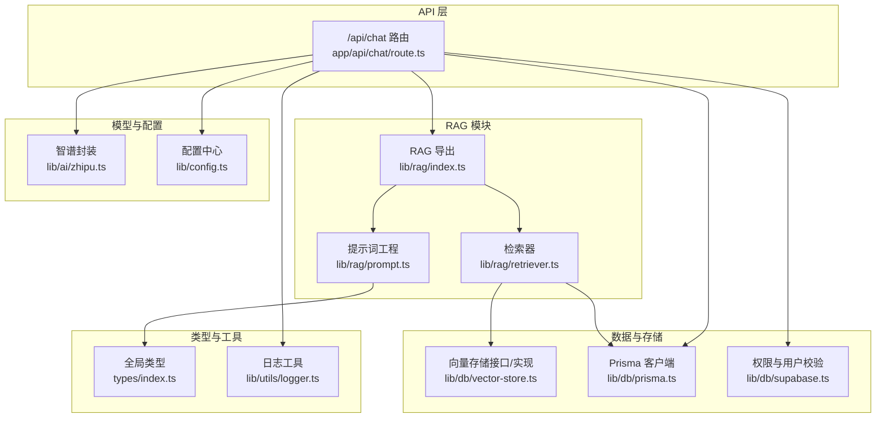
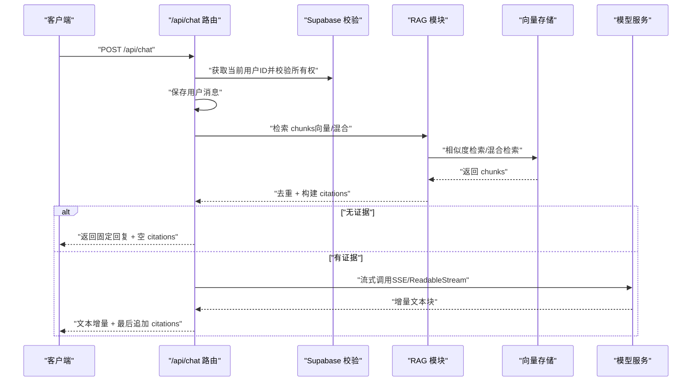
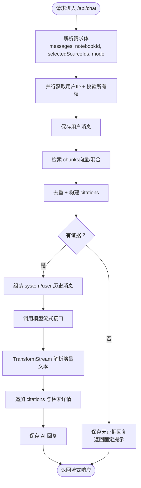
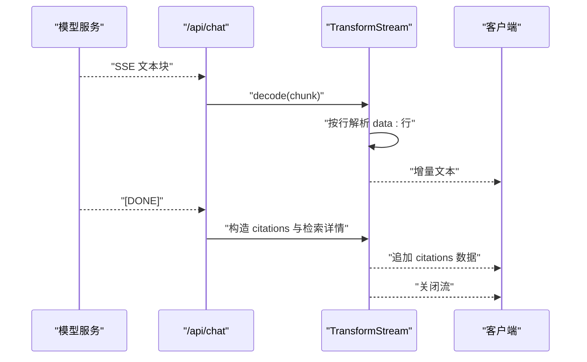
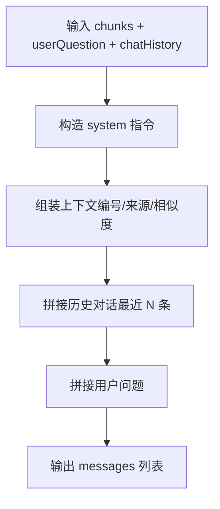
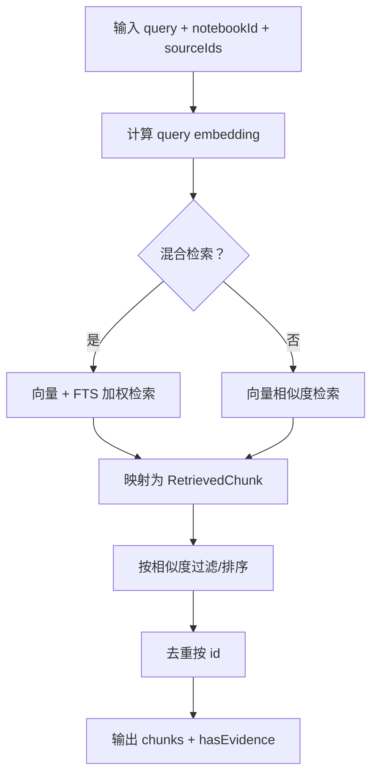
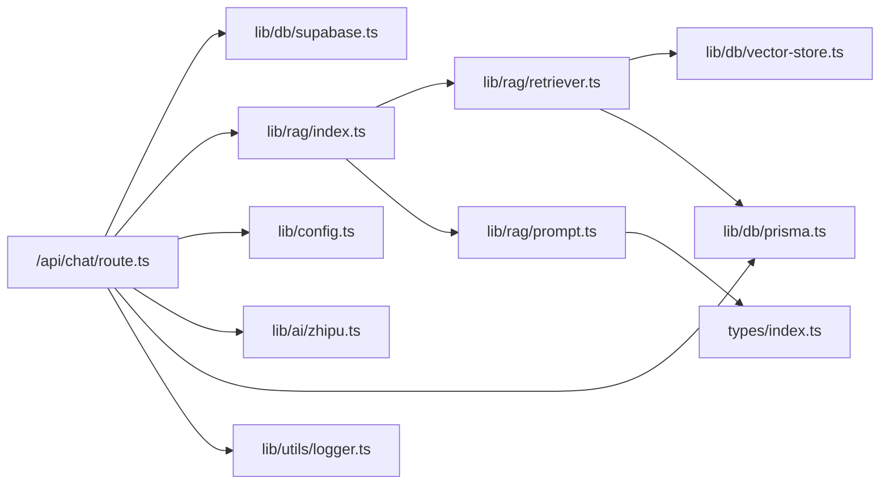

# RAG API 集成

<cite>
**本文引用的文件**
- [app/api/chat/route.ts](file://app/api/chat/route.ts)
- [lib/rag/index.ts](file://lib/rag/index.ts)
- [lib/rag/retriever.ts](file://lib/rag/retriever.ts)
- [lib/rag/prompt.ts](file://lib/rag/prompt.ts)
- [lib/ai/zhipu.ts](file://lib/ai/zhipu.ts)
- [lib/config.ts](file://lib/config.ts)
- [lib/db/vector-store.ts](file://lib/db/vector-store.ts)
- [lib/db/prisma.ts](file://lib/db/prisma.ts)
- [lib/db/supabase.ts](file://lib/db/supabase.ts)
- [lib/utils/logger.ts](file://lib/utils/logger.ts)
- [types/index.ts](file://types/index.ts)
- [package.json](file://package.json)
- [README.md](file://README.md)
- [docs/PROJECT_SPEC.md](file://docs/PROJECT_SPEC.md)
</cite>

## 目录
1. [简介](#简介)
2. [项目结构](#项目结构)
3. [核心组件](#核心组件)
4. [架构总览](#架构总览)
5. [详细组件分析](#详细组件分析)
6. [依赖关系分析](#依赖关系分析)
7. [性能考虑](#性能考虑)
8. [故障排查指南](#故障排查指南)
9. [结论](#结论)
10. [附录](#附录)

## 简介
本文件面向 RAG API 集成，聚焦 /api/chat 端点的实现架构与请求处理流程，系统性阐述如下主题：
- 流式响应的实现机制（SSE/ReadableStream、分块传输与客户端兼容性）
- 提示词工程（上下文组装、角色指令与模型特定格式适配）
- 检索增强（向量查询、上下文过滤与结果排序）
- 完整 API 接口规范（请求参数、响应格式、错误码）
- 模型集成配置（智谱 AI 与 LongCat 推理模型差异处理）
- 性能优化策略、缓存与监控指标

## 项目结构
该系统采用 Next.js App Router 的 API 路由组织方式，RAG 能力集中在 lib/rag 与 lib/db/vector-store 中，模型调用封装在 lib/ai/zhipu.ts，配置与类型定义位于 lib/config.ts 与 types/index.ts。

**图表来源**
- [app/api/chat/route.ts](file://app/api/chat/route.ts#L1-L324)
- [lib/rag/index.ts](file://lib/rag/index.ts#L1-L24)
- [lib/rag/retriever.ts](file://lib/rag/retriever.ts#L1-L206)
- [lib/rag/prompt.ts](file://lib/rag/prompt.ts#L1-L149)
- [lib/ai/zhipu.ts](file://lib/ai/zhipu.ts#L1-L196)
- [lib/config.ts](file://lib/config.ts#L1-L187)
- [lib/db/vector-store.ts](file://lib/db/vector-store.ts#L1-L446)
- [lib/db/prisma.ts](file://lib/db/prisma.ts#L1-L41)
- [lib/db/supabase.ts](file://lib/db/supabase.ts#L1-L39)
- [lib/utils/logger.ts](file://lib/utils/logger.ts#L1-L98)
- [types/index.ts](file://types/index.ts#L1-L214)

**章节来源**
- [README.md](file://README.md#L1-L141)
- [docs/PROJECT_SPEC.md](file://docs/PROJECT_SPEC.md#L1-L800)

## 核心组件
- /api/chat 路由：负责鉴权、请求解析、检索、提示词组装、模型流式调用与流式响应输出。
- RAG 模块：检索（向量/混合/全文）、上下文组装、引用构建与无证据回复。
- 模型封装：智谱 Embedding 与 Chat API 调用，含重试与维度校验。
- 向量存储：Prisma + pgvector 的相似度检索与混合检索（向量 + FTS）。
- 配置中心：模型提供商、模型列表、默认模型与环境变量校验。
- 数据与权限：Supabase 用户校验、Prisma 客户端与连接池。

**章节来源**
- [app/api/chat/route.ts](file://app/api/chat/route.ts#L25-L324)
- [lib/rag/retriever.ts](file://lib/rag/retriever.ts#L53-L206)
- [lib/rag/prompt.ts](file://lib/rag/prompt.ts#L37-L149)
- [lib/ai/zhipu.ts](file://lib/ai/zhipu.ts#L53-L196)
- [lib/db/vector-store.ts](file://lib/db/vector-store.ts#L77-L446)
- [lib/config.ts](file://lib/config.ts#L118-L187)
- [lib/db/supabase.ts](file://lib/db/supabase.ts#L12-L33)
- [lib/db/prisma.ts](file://lib/db/prisma.ts#L18-L41)

## 架构总览
/api/chat 的端到端流程如下：
- 客户端发送包含 messages、notebookId、selectedSourceIds、mode 的请求。
- 服务端并行获取当前用户与解析请求体，校验 notebook 所有权。
- 保存用户消息后，根据 mode 选择检索策略（向量或混合检索），并去重。
- 若无证据，直接返回固定回复；否则组装 system/user 消息，调用模型流式接口。
- 服务端通过 TransformStream 逐块解析模型流，向前端发送文本增量，最后追加 citations 与检索详情。

**图表来源**
- [app/api/chat/route.ts](file://app/api/chat/route.ts#L25-L324)
- [lib/rag/retriever.ts](file://lib/rag/retriever.ts#L53-L206)
- [lib/db/vector-store.ts](file://lib/db/vector-store.ts#L175-L442)
- [lib/rag/prompt.ts](file://lib/rag/prompt.ts#L62-L88)

## 详细组件分析

### /api/chat 端点实现与流式响应
- 鉴权与请求解析：并行获取用户 ID 与请求体，校验 notebook 所有权。
- 检索与去重：根据 mode 选择向量或混合检索，随后去重并构建 citations。
- 无证据处理：若无证据，直接保存空引用的回复并返回固定提示。
- 提示词组装：构造 system 消息与历史对话，拼接上下文与用户问题。
- 模型调用：根据 provider 选择不同 API 路径，统一开启 stream。
- 流式转换：使用 TransformStream 逐块解析模型返回的文本增量，最后追加 citations 与检索详情。

**图表来源**
- [app/api/chat/route.ts](file://app/api/chat/route.ts#L25-L324)
- [lib/rag/retriever.ts](file://lib/rag/retriever.ts#L118-L125)
- [lib/rag/prompt.ts](file://lib/rag/prompt.ts#L62-L88)

**章节来源**
- [app/api/chat/route.ts](file://app/api/chat/route.ts#L25-L324)

### 流式响应机制（SSE/ReadableStream 与客户端兼容性）
- 服务端响应头：Content-Type 设为 text/event-stream，Cache-Control 与 Connection 保持长连接。
- TransformStream：逐块解码模型返回的文本增量，按行解析 data: 行，提取 choices.delta.content 或 reasoning_content（LongCat）。
- 完成信号：当收到 [DONE] 时，计算生成耗时，构造 citations 与检索详情，追加特殊分隔标记后关闭流。
- 客户端兼容性：前端可使用 ReadableStream 与 TextDecoder 解析，或通过 SSE 事件流消费；本实现采用 ReadableStream。

**图表来源**
- [app/api/chat/route.ts](file://app/api/chat/route.ts#L208-L314)

**章节来源**
- [app/api/chat/route.ts](file://app/api/chat/route.ts#L208-L314)

### 提示词工程（上下文组装、角色指令与模型适配）
- System 指令：强调“基于参考资料回答、不编造、使用引用标记、清晰专业语言”等规则。
- 上下文组装：为每个 chunk 生成编号、来源信息与相似度，形成结构化参考资料。
- 历史对话：保留最近若干条对话，增强上下文连贯性。
- 模型适配：针对 LongCat 与智谱分别读取 reasoning_content 与 content 字段，确保输出一致。

**图表来源**
- [lib/rag/prompt.ts](file://lib/rag/prompt.ts#L62-L88)
- [lib/rag/prompt.ts](file://lib/rag/prompt.ts#L37-L57)

**章节来源**
- [lib/rag/prompt.ts](file://lib/rag/prompt.ts#L10-L32)
- [lib/rag/prompt.ts](file://lib/rag/prompt.ts#L37-L88)

### 检索增强（向量查询、上下文过滤与排序）
- 配置项：topK、相似度阈值、最大上下文 token、是否启用混合检索、向量与全文权重。
- 向量检索：计算 query embedding，调用 pgvector 相似度查询，按相似度降序返回。
- 混合检索：结合向量相似度与全文检索（FTS）评分，按加权综合分排序。
- 去重：按 chunk id 去重，保证引用唯一性。
- 结果映射：补充来源标题与类型，构造标准化 RetrievedChunk。

**图表来源**
- [lib/rag/retriever.ts](file://lib/rag/retriever.ts#L53-L116)
- [lib/rag/retriever.ts](file://lib/rag/retriever.ts#L131-L206)
- [lib/db/vector-store.ts](file://lib/db/vector-store.ts#L175-L297)
- [lib/db/vector-store.ts](file://lib/db/vector-store.ts#L312-L442)

**章节来源**
- [lib/rag/retriever.ts](file://lib/rag/retriever.ts#L6-L13)
- [lib/rag/retriever.ts](file://lib/rag/retriever.ts#L53-L116)
- [lib/rag/retriever.ts](file://lib/rag/retriever.ts#L131-L206)
- [lib/db/vector-store.ts](file://lib/db/vector-store.ts#L175-L442)

### 引文构建与去重
- 去重策略：按内容前 100 字的规范化内容作为 key，保留相似度更高的 chunk。
- 引文字段：包含来源 id/标题/类型、片段前缀、相似度与元信息（页码/索引/字符区间）。
- 输出顺序：按相似度降序排列，便于 UI 展示与溯源。

**章节来源**
- [lib/rag/prompt.ts](file://lib/rag/prompt.ts#L112-L149)

### 模型集成配置（智谱 AI 与 LongCat）
- 配置中心：提供可用模型列表、默认模型、模型显示名与图标；根据 provider 返回不同 API 地址与密钥。
- 模型差异：
  - 智谱：chat/completions 路径，choices.delta.content 字段。
  - LongCat：chat/completions 路径，choices.delta.reasoning_content 字段。
- Studio 默认使用 LongCat 配置。

**章节来源**
- [lib/config.ts](file://lib/config.ts#L38-L141)
- [app/api/chat/route.ts](file://app/api/chat/route.ts#L174-L191)
- [app/api/chat/route.ts](file://app/api/chat/route.ts#L288-L293)

## 依赖关系分析
- 路由依赖：/api/chat 依赖 Supabase 权限校验、RAG 模块、配置中心、模型封装与数据库。
- RAG 依赖：检索器依赖向量存储与数据库；提示词工程依赖 RAG 类型与 RetrievedChunk。
- 模型封装：依赖配置中心的 API Key 与 Base URL，提供 Embedding 与 Chat 流式接口。
- 存储与日志：向量存储与 Prisma 客户端负责数据持久化；日志工具记录向量操作耗时与成功率。

**图表来源**
- [app/api/chat/route.ts](file://app/api/chat/route.ts#L8-L21)
- [lib/rag/index.ts](file://lib/rag/index.ts#L4-L24)
- [lib/rag/retriever.ts](file://lib/rag/retriever.ts#L1-L5)
- [lib/rag/prompt.ts](file://lib/rag/prompt.ts#L5-L6)
- [lib/ai/zhipu.ts](file://lib/ai/zhipu.ts#L8-L9)
- [lib/config.ts](file://lib/config.ts#L38-L52)
- [lib/db/vector-store.ts](file://lib/db/vector-store.ts#L1-L5)
- [lib/db/prisma.ts](file://lib/db/prisma.ts#L1-L4)
- [lib/utils/logger.ts](file://lib/utils/logger.ts#L29-L98)
- [types/index.ts](file://types/index.ts#L1-L4)

**章节来源**
- [app/api/chat/route.ts](file://app/api/chat/route.ts#L8-L21)
- [lib/rag/index.ts](file://lib/rag/index.ts#L4-L24)

## 性能考虑
- 并行化：请求解析与用户 ID 获取并行，检索与保存用户消息并行，提升端到端吞吐。
- 批量与分页：向量存储批量插入与分批处理，降低数据库压力。
- 索引与查询：pgvector HNSW 索引与相似度查询，CTE 减少重复计算；混合检索结合向量与 FTS，兼顾召回与相关性。
- 维度一致性：严格校验 EMBEDDING_DIM 与数据库 vector(D)，避免写入失败与检索异常。
- 日志与可观测性：向量操作日志记录耗时、成功率与平均相似度，便于性能分析与告警。

**章节来源**
- [app/api/chat/route.ts](file://app/api/chat/route.ts#L29-L96)
- [lib/db/vector-store.ts](file://lib/db/vector-store.ts#L88-L173)
- [lib/db/vector-store.ts](file://lib/db/vector-store.ts#L175-L297)
- [lib/db/vector-store.ts](file://lib/db/vector-store.ts#L312-L442)
- [lib/config.ts](file://lib/config.ts#L6-L30)
- [lib/utils/logger.ts](file://lib/utils/logger.ts#L75-L94)

## 故障排查指南
- 常见错误与处理：
  - 未登录/无权访问：检查 Supabase 会话与 notebook 所有权校验。
  - 缺少必要参数：校验 messages、notebookId、用户消息是否存在。
  - LLM API 错误：检查模型 API Key、Base URL 与网络连通性；查看响应体错误信息。
  - 向量维度不匹配：确认 EMBEDDING_DIM 与数据库向量维度一致。
- 日志定位：启用开发环境日志，关注向量插入/查询耗时与成功率；检查检索详情与生成耗时。
- 重试策略：模型封装提供指数退避重试，适用于 429/5xx 场景。

**章节来源**
- [app/api/chat/route.ts](file://app/api/chat/route.ts#L35-L66)
- [app/api/chat/route.ts](file://app/api/chat/route.ts#L202-L206)
- [lib/ai/zhipu.ts](file://lib/ai/zhipu.ts#L168-L195)
- [lib/config.ts](file://lib/config.ts#L169-L187)
- [lib/utils/logger.ts](file://lib/utils/logger.ts#L75-L94)

## 结论
本实现以 /api/chat 为核心，串联鉴权、检索、提示词工程与模型流式输出，具备良好的可扩展性与可观测性。通过并行化、批量处理与索引优化，满足低延迟与高吞吐的流式问答需求；通过严格的维度校验与日志记录，保障系统稳定性与可维护性。

## 附录

### API 接口规范：POST /api/chat
- 请求头
  - Content-Type: application/json
- 请求体
  - notebookId: string（必填）
  - messages: array（必填，至少包含一条 role=user 的消息）
  - selectedSourceIds: string[]（可选，限定检索范围）
  - mode: 'fast' | 'precise'（可选，默认 fast）
- 成功响应（流式）
  - Content-Type: text/event-stream
  - 响应体为增量文本块，最后追加 citations 与检索详情
- 成功响应（非流式，无证据时）
  - Content-Type: application/json
  - body: { content: string, citations: [], answerMode: 'no_evidence', retrievalDetails: object }
- 错误响应
  - 400: 缺少参数或用户消息
  - 401: 未登录
  - 403: 无权访问
  - 404: Notebook 不存在
  - 500: 服务器内部错误

**章节来源**
- [app/api/chat/route.ts](file://app/api/chat/route.ts#L25-L324)
- [types/index.ts](file://types/index.ts#L157-L168)

### 检索详情与元数据
- retrievalDetails 字段
  - query: string
  - retrievalParams: { sourceIds, topK, threshold, useHybridSearch, retrievalType }
  - model: string
  - chunks: array（每项包含 id、sourceId、sourceName、score、content、metadata、scores）
  - timing: { embedding, retrieval, generation?, total? }
- MessageMetadata（保存在数据库）
  - retrievalMs, generationMs, model, topK, chunkCount, queryEmbeddingMs, retrievalDetails

**章节来源**
- [app/api/chat/route.ts](file://app/api/chat/route.ts#L102-L126)
- [types/index.ts](file://types/index.ts#L71-L104)

### 模型配置与差异
- 可用模型列表：智谱 GLM-4.x 系列与 LongCat 推理模型
- 默认模型：LongCat Studio 默认模型
- API 差异：
  - 智谱：/paas/v4/chat/completions，choices.delta.content
  - LongCat：/v1/chat/completions，choices.delta.reasoning_content

**章节来源**
- [lib/config.ts](file://lib/config.ts#L69-L141)
- [app/api/chat/route.ts](file://app/api/chat/route.ts#L174-L191)
- [app/api/chat/route.ts](file://app/api/chat/route.ts#L288-L293)

### 依赖与运行环境
- Next.js 14、React 18、TypeScript
- Supabase（Auth、Storage、Postgres + pgvector）
- Prisma（业务表与迁移）
- 模型服务：智谱（Embedding-3/GLM-4.7）与 LongCat（OpenAI-compatible）

**章节来源**
- [package.json](file://package.json#L17-L81)
- [README.md](file://README.md#L26-L50)
- [docs/PROJECT_SPEC.md](file://docs/PROJECT_SPEC.md#L58-L105)