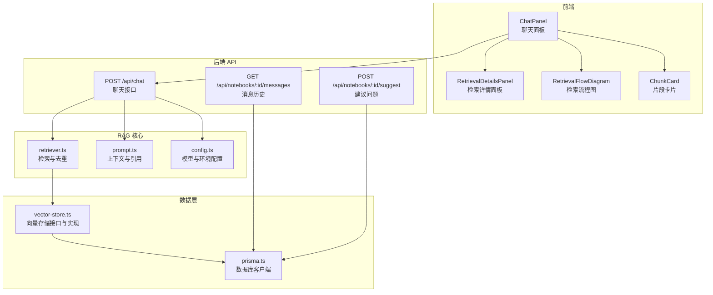
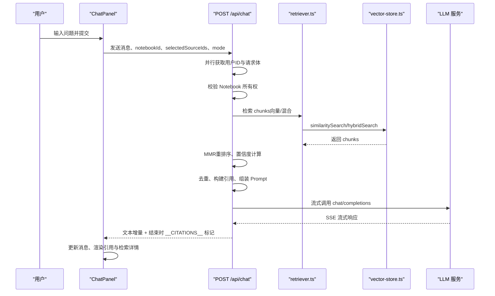
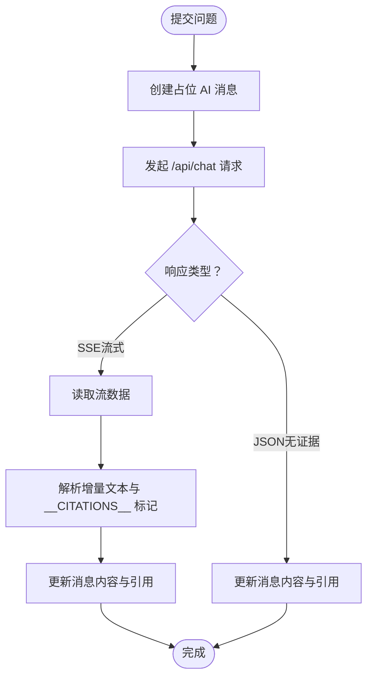
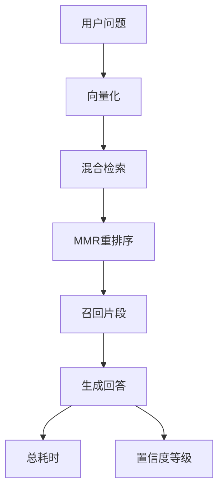
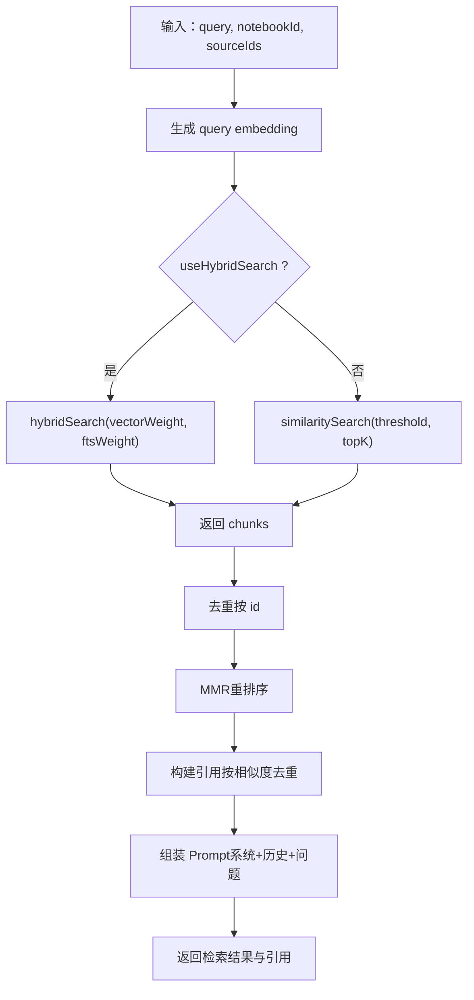
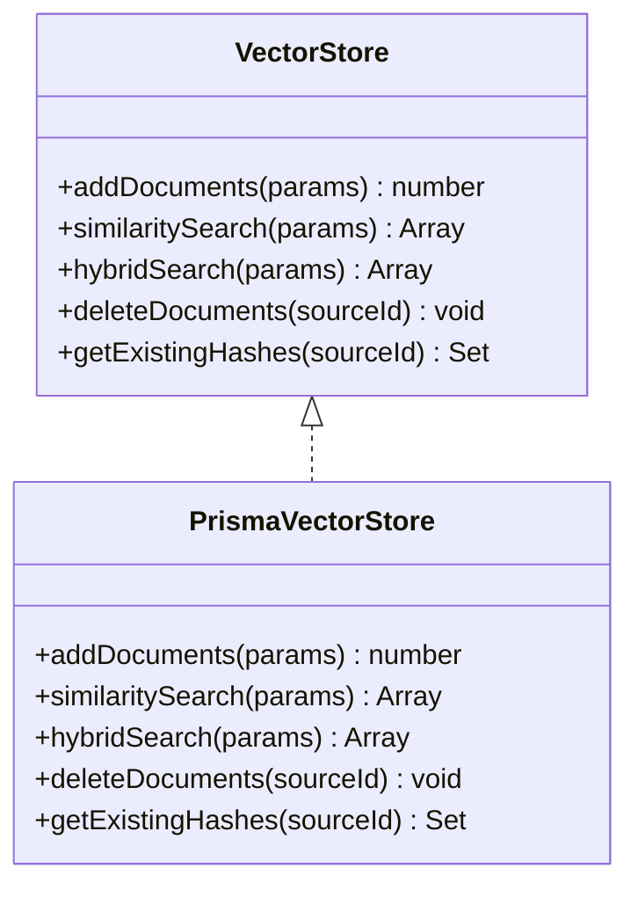
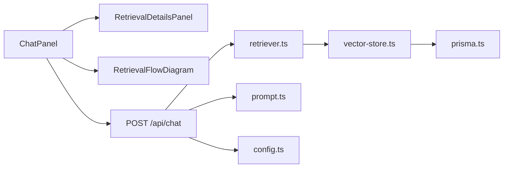

# RAG 问答系统

<cite>
**本文档引用的文件**
- [app/api/chat/route.ts](file://app/api/chat/route.ts)
- [components/notebook/chat-panel.tsx](file://components/notebook/chat-panel.tsx)
- [lib/rag/index.ts](file://lib/rag/index.ts)
- [lib/rag/retriever.ts](file://lib/rag/retriever.ts)
- [lib/rag/prompt.ts](file://lib/rag/prompt.ts)
- [components/notebook/retrieval-details-panel.tsx](file://components/notebook/retrieval-details-panel.tsx)
- [components/notebook/retrieval-flow-diagram.tsx](file://components/notebook/retrieval-flow-diagram.tsx)
- [lib/config.ts](file://lib/config.ts)
- [lib/db/vector-store.ts](file://lib/db/vector-store.ts)
- [lib/processing/embedding.ts](file://lib/processing/embedding.ts)
- [components/notebook/chunk-card.tsx](file://components/notebook/chunk-card.tsx)
- [lib/db/prisma.ts](file://lib/db/prisma.ts)
- [types/index.ts](file://types/index.ts)
- [lib/utils/logger.ts](file://lib/utils/logger.ts)
- [app/api/notebooks/[id]/messages/route.ts](file://app/api/notebooks/[id]/messages/route.ts)
- [app/api/notebooks/[id]/suggest/route.ts](file://app/api/notebooks/[id]/suggest/route.ts)
</cite>

## 更新摘要
**变更内容**
- 新增问题类型分类系统，支持事实查询、总结归纳、分析推理、对比型四种问题类型的动态 Prompt 选择
- 实现 MMR（最大边际相关性）重排序算法，提升检索结果的相关性和多样性平衡
- 增强置信度计算机制，基于相似度分布和信息集中度评估回答质量
- 改进错误处理和响应解析，增加置信度信息传递和更详细的错误反馈
- 优化检索详情面板，新增置信度等级显示和详细评分信息

## 目录
1. [简介](#简介)
2. [项目结构](#项目结构)
3. [核心组件](#核心组件)
4. [架构总览](#架构总览)
5. [详细组件分析](#详细组件分析)
6. [依赖关系分析](#依赖关系分析)
7. [性能考虑](#性能考虑)
8. [故障排查指南](#故障排查指南)
9. [结论](#结论)
10. [附录](#附录)

## 简介
本系统是一个基于检索增强生成（RAG）的智能问答应用，围绕"笔记本"概念组织资料与对话。其核心工作流包括：用户提问 → 向量化检索（支持混合检索）→ 上下文组装 → LLM 流式生成 → 引用溯源与可视化。前端通过 ChatPanel 提供消息管理、流式输出与引用展示；后端 API 负责权限验证、检索、Prompt 组装与流式转发；底层依赖向量存储与全文检索（FTS）实现高效召回。

**更新** 新增了智能问题类型分类和 MMR 重排序算法，显著提升了检索质量和回答准确性。

## 项目结构
系统采用前后端分离的 Next.js 应用结构，关键目录与职责如下：
- app/api：后端路由，提供聊天、消息历史、资料源等 API
- components/notebook：前端组件，包含聊天面板、检索详情面板、流程图等
- lib/rag：RAG 核心逻辑（检索、Prompt 组装、引用构建）
- lib/db：数据库与向量存储抽象及实现
- lib/processing：嵌入生成与分块处理
- lib/config：全局配置与模型提供商配置
- types：全局 TypeScript 类型定义
- lib/utils：通用工具（日志等）

**图表来源**
- [components/notebook/chat-panel.tsx](file://components/notebook/chat-panel.tsx#L60-L412)
- [app/api/chat/route.ts](file://app/api/chat/route.ts#L25-L339)
- [lib/rag/retriever.ts](file://lib/rag/retriever.ts#L53-L494)
- [lib/rag/prompt.ts](file://lib/rag/prompt.ts#L37-L312)
- [lib/db/vector-store.ts](file://lib/db/vector-store.ts#L77-L446)
- [lib/db/prisma.ts](file://lib/db/prisma.ts#L18-L41)

**章节来源**
- [components/notebook/chat-panel.tsx](file://components/notebook/chat-panel.tsx#L60-L412)
- [app/api/chat/route.ts](file://app/api/chat/route.ts#L25-L339)
- [lib/rag/index.ts](file://lib/rag/index.ts#L5-L24)

## 核心组件
- ChatPanel：负责消息管理、流式接收、引用渲染与检索详情查看
- 检索详情面板：展示检索参数、召回片段与检索链路可视化，新增置信度等级显示
- 检索流程图：以步骤形式展示向量化、混合检索、MMR 重排序、召回片段与生成阶段
- RAG 检索器：向量检索与混合检索，支持阈值与 TopK 控制，新增 MMR 重排序和置信度计算
- Prompt 组装：构建系统提示、历史对话与用户问题的完整消息序列，支持动态问题类型分类
- 向量存储：统一的向量增删改查接口，支持批量插入与混合检索

**更新** 新增 MMR 重排序算法和智能问题类型分类系统，显著提升检索质量和回答准确性。

**章节来源**
- [components/notebook/chat-panel.tsx](file://components/notebook/chat-panel.tsx#L60-L412)
- [components/notebook/retrieval-details-panel.tsx](file://components/notebook/retrieval-details-panel.tsx#L42-L159)
- [components/notebook/retrieval-flow-diagram.tsx](file://components/notebook/retrieval-flow-diagram.tsx#L16-L82)
- [lib/rag/retriever.ts](file://lib/rag/retriever.ts#L53-L494)
- [lib/rag/prompt.ts](file://lib/rag/prompt.ts#L37-L312)
- [lib/db/vector-store.ts](file://lib/db/vector-store.ts#L77-L446)

## 架构总览
系统采用"前端组件 + 后端 API + RAG 核心 + 数据层"的分层架构。前端通过 ChatPanel 发起聊天请求，后端并行校验权限与解析请求，随后进行检索、去重与 Prompt 组装，再调用 LLM 流式接口并将引用与耗时信息作为特殊标记在流结束后发送。

**更新** 新增 MMR 重排序和置信度计算，优化检索结果质量。

**图表来源**
- [app/api/chat/route.ts](file://app/api/chat/route.ts#L25-L339)
- [lib/rag/retriever.ts](file://lib/rag/retriever.ts#L53-L494)
- [lib/db/vector-store.ts](file://lib/db/vector-store.ts#L175-L442)
- [components/notebook/chat-panel.tsx](file://components/notebook/chat-panel.tsx#L171-L300)

**章节来源**
- [app/api/chat/route.ts](file://app/api/chat/route.ts#L25-L339)
- [components/notebook/chat-panel.tsx](file://components/notebook/chat-panel.tsx#L171-L300)

## 详细组件分析

### ChatPanel 组件
- 消息管理：维护本地消息数组，支持占位消息与流式更新；根据 answerMode 与 citations 渲染不同底部区域
- 流式输出：读取 SSE 流，解析增量文本与结束时的引用标记，实时更新 UI
- 引用溯源：将引用索引与内容映射，支持点击高亮与跳转；Markdown 内容中将 [1]、[2] 等标记渲染为可点击按钮
- 检索详情：通过抽屉式面板展示检索参数、召回片段与链路可视化，新增置信度等级显示

**更新** 改进了错误处理和响应解析，增加了置信度信息的显示和更详细的错误反馈。

**图表来源**
- [components/notebook/chat-panel.tsx](file://components/notebook/chat-panel.tsx#L171-L300)

**章节来源**
- [components/notebook/chat-panel.tsx](file://components/notebook/chat-panel.tsx#L60-L412)
- [components/notebook/retrieval-details-panel.tsx](file://components/notebook/retrieval-details-panel.tsx#L42-L159)
- [components/notebook/retrieval-flow-diagram.tsx](file://components/notebook/retrieval-flow-diagram.tsx#L16-L82)

### 检索详情面板与流程图
- 检索详情面板：展示检索参数（是否混合检索、TopK、阈值、来源范围、返回片段数），并提供"片段列表"和"链路可视化"两个标签页，新增置信度等级和详细评分信息
- 流程图：以步骤形式展示"用户问题 → 向量化 → 混合检索 → MMR 重排序 → 召回片段 → 生成回答"，并显示各阶段耗时与总耗时

**更新** 新增置信度等级显示和 MMR 重排序步骤，提供更详细的检索质量评估信息。

**图表来源**
- [components/notebook/retrieval-flow-diagram.tsx](file://components/notebook/retrieval-flow-diagram.tsx#L16-L82)
- [components/notebook/retrieval-details-panel.tsx](file://components/notebook/retrieval-details-panel.tsx#L42-L159)

**章节来源**
- [components/notebook/retrieval-details-panel.tsx](file://components/notebook/retrieval-details-panel.tsx#L42-L159)
- [components/notebook/retrieval-flow-diagram.tsx](file://components/notebook/retrieval-flow-diagram.tsx#L16-L82)
- [components/notebook/chunk-card.tsx](file://components/notebook/chunk-card.tsx#L26-L94)

### RAG 检索与 Prompt 组装
- 检索策略：支持向量相似检索与混合检索（向量分数与全文检索分数加权组合），可配置 TopK、相似度阈值与混合权重
- 去重策略：按 chunk id 去重，确保同一片段不重复
- 引用构建：按相似度降序去重（以内容前 100 字为键），保留更相关的片段；引用包含来源标题、页码、片段摘要与定位信息
- Prompt 组装：包含系统提示、最近历史对话与当前问题，形成完整的消息序列
- **新增** MMR 重排序：平衡相关性和多样性的最大边际相关性算法
- **新增** 置信度计算：基于相似度分布和信息集中度评估回答质量

**更新** 新增 MMR 重排序算法和智能置信度计算，显著提升检索结果质量和回答准确性。

**图表来源**
- [lib/rag/retriever.ts](file://lib/rag/retriever.ts#L53-L494)
- [lib/rag/prompt.ts](file://lib/rag/prompt.ts#L37-L312)

**章节来源**
- [lib/rag/retriever.ts](file://lib/rag/retriever.ts#L53-L494)
- [lib/rag/prompt.ts](file://lib/rag/prompt.ts#L37-L312)

### 向量存储与嵌入生成
- 向量存储接口：统一的 addDocuments、similaritySearch、hybridSearch、deleteDocuments、getExistingHashes 抽象
- 批量插入：按批处理减少写入次数，前置维度校验，记录成功/失败日志
- 混合检索：CTE 计算向量分数与全文检索分数，按加权组合排序
- 嵌入生成：指数退避重试、批量分片、维度一致性校验

**图表来源**
- [lib/db/vector-store.ts](file://lib/db/vector-store.ts#L24-L75)
- [lib/db/vector-store.ts](file://lib/db/vector-store.ts#L77-L446)

**章节来源**
- [lib/db/vector-store.ts](file://lib/db/vector-store.ts#L77-L446)
- [lib/processing/embedding.ts](file://lib/processing/embedding.ts#L140-L189)

## 依赖关系分析
- 组件耦合：ChatPanel 依赖检索详情面板与流程图组件；后端 API 依赖 RAG 模块与向量存储
- 外部依赖：模型提供商（智谱、LongCat）、数据库（Supabase/PostgreSQL）、向量数据库（pgvector）
- 配置依赖：模型配置、环境变量、向量维度约束

**图表来源**
- [components/notebook/chat-panel.tsx](file://components/notebook/chat-panel.tsx#L60-L412)
- [app/api/chat/route.ts](file://app/api/chat/route.ts#L25-L339)
- [lib/rag/retriever.ts](file://lib/rag/retriever.ts#L53-L494)
- [lib/db/vector-store.ts](file://lib/db/vector-store.ts#L77-L446)
- [lib/db/prisma.ts](file://lib/db/prisma.ts#L18-L41)
- [lib/config.ts](file://lib/config.ts#L118-L135)

**章节来源**
- [lib/config.ts](file://lib/config.ts#L118-L135)
- [lib/db/prisma.ts](file://lib/db/prisma.ts#L18-L41)

## 性能考虑
- 检索性能
  - 使用 CTE 避免重复计算，向量相似度与全文检索分别计算后合并
  - 混合检索权重可调，平衡向量与全文检索的贡献
  - 按来源过滤与 TopK 限制减少结果集规模
  - **新增** MMR 重排序：在候选集上进行重排序，平衡相关性和多样性
- 写入性能
  - 批量插入（每批上限 500），减少事务开销
  - 插入前进行维度校验，避免后续失败重试
- 生成性能
  - 流式返回，边生成边输出，降低首字延迟
  - 模型选择支持"快速/高质量"两种模式，按需切换
- 缓存策略
  - 前端本地缓存模型选择（localStorage）
  - 建议问题在空对话时一次性加载，避免重复请求
- 日志与可观测性
  - 向量操作日志记录成功/失败、耗时与关键元数据，便于定位瓶颈
  - **新增** 置信度计算日志，帮助分析检索质量

**更新** 新增 MMR 重排序和置信度计算的性能优化策略。

**章节来源**
- [lib/db/vector-store.ts](file://lib/db/vector-store.ts#L175-L297)
- [lib/db/vector-store.ts](file://lib/db/vector-store.ts#L312-L442)
- [lib/processing/embedding.ts](file://lib/processing/embedding.ts#L140-L189)
- [lib/utils/logger.ts](file://lib/utils/logger.ts#L75-L94)
- [components/notebook/chat-panel.tsx](file://components/notebook/chat-panel.tsx#L74-L101)

## 故障排查指南
- 常见错误与处理
  - 未登录/无权访问：检查鉴权与 Notebook 所有权校验
  - 缺少必要参数：确认 notebookId、messages、selectedSourceIds 等
  - LLM API 错误：检查模型提供商配置与网络连通性
  - 向量维度不匹配：确保 EMBEDDING_DIM 与模型一致（默认 1024）
  - **新增** MMR 重排序失败：系统会自动降级到基础检索，不影响整体功能
  - **新增** 置信度计算异常：系统会返回默认置信度，不影响检索结果
- 日志定位
  - 开发环境下输出详细日志，生产环境仅输出错误级别
  - 向量操作日志包含操作类型、耗时、成功与否与关键元数据
  - **新增** MMR 重排序日志，包含候选集大小、embedding 加载情况
- 建议排查步骤
  - 检查环境变量与配置文件
  - 查看检索详情面板中的阈值与 TopK 设置
  - 关注流式响应中 __CITATIONS__ 标记是否正确到达
  - 核对数据库连接池配置（Serverless 环境建议使用 Supabase Transaction Pooler）
  - **新增** 检查置信度等级，低置信度可能表示检索质量不佳

**更新** 新增 MMR 重排序和置信度计算相关的故障排查指导。

**章节来源**
- [app/api/chat/route.ts](file://app/api/chat/route.ts#L35-L66)
- [app/api/chat/route.ts](file://app/api/chat/route.ts#L202-L206)
- [lib/config.ts](file://lib/config.ts#L9-L29)
- [lib/utils/logger.ts](file://lib/utils/logger.ts#L75-L94)
- [lib/db/prisma.ts](file://lib/db/prisma.ts#L8-L16)

## 结论
本系统通过清晰的分层设计与完善的 RAG 流程，实现了从检索到生成再到溯源的闭环体验。前端组件提供良好的交互与可视化，后端 API 保障了安全性与性能，向量存储与混合检索提供了高效的召回能力。通过可配置的检索策略与流式生成，系统在准确性与响应速度之间取得了良好平衡。

**更新** 新增的智能问题类型分类、MMR 重排序和置信度计算进一步提升了系统的智能化水平和回答质量。

## 附录

### API 接口文档

- POST /api/chat
  - 请求体
    - messages: 消息数组（role: user/assistant, content: string）
    - notebookId: 笔记本 ID
    - selectedSourceIds: 可选，限定检索来源
    - mode: 模型模式（如 'glm-4.7' 或 'longcat'）
  - 成功响应
    - 流式返回：SSE 文本增量；结束时发送 JSON 标记 __CITATIONS__，包含 citations、answerMode 和 retrievalDetails（包含置信度信息）
    - 非流式（无证据）：直接返回 JSON，包含 content、citations、answerMode、retrievalDetails
  - 错误响应
    - 400：缺少参数或消息格式错误
    - 401：未登录
    - 403：无权访问
    - 404：Notebook 不存在
    - 500：服务器内部错误

**更新** 增加了置信度信息的 retrievalDetails 字段。

- GET /api/notebooks/:id/messages
  - 查询参数
    - limit: 返回数量，默认 50
    - before: 时间游标，用于分页
  - 成功响应
    - messages: 消息数组（按时间升序）
    - hasMore: 是否还有更多
    - nextCursor: 下一页游标

- POST /api/notebooks/:id/suggest
  - 成功响应
    - questions: 建议问题数组

**章节来源**
- [app/api/chat/route.ts](file://app/api/chat/route.ts#L25-L339)
- [app/api/notebooks/[id]/messages/route.ts](file://app/api/notebooks/[id]/messages/route.ts#L10-L70)
- [app/api/notebooks/[id]/suggest/route.ts](file://app/api/notebooks/[id]/suggest/route.ts#L1-L47)

### 检索策略配置选项
- 混合检索开关：useHybridSearch（布尔）
- TopK：返回片段数量上限
- 相似度阈值：过滤低相关片段
- 混合权重：vectorWeight 与 ftsWeight（默认 0.7 与 0.3）
- 上下文窗口大小：maxContextTokens（RAG 配置中定义）
- **新增** MMR Lambda：MMR 算法中相关性权重（0-1，越高越重视相关性，默认 0.7）
- **新增** 置信度阈值：基于相似度分布的质量评估

**更新** 新增 MMR 和置信度相关的配置选项。

**章节来源**
- [lib/rag/retriever.ts](file://lib/rag/retriever.ts#L6-L15)
- [lib/rag/retriever.ts](file://lib/rag/retriever.ts#L131-L206)
- [lib/config.ts](file://lib/config.ts#L160-L166)

### 数据模型与类型
- Citation/CitationsPayload：引用结构与承载对象
- MessageMetadata：消息元数据（检索耗时、生成耗时、模型、TopK、chunkCount、检索详情，**新增置信度信息**）
- ChunkMetadata：片段元数据（页码、字符位置、token 数等）
- **新增** QuestionType：问题类型枚举（factual、summary、analytical、comparative、general）

**更新** 新增问题类型枚举和置信度相关的数据结构。

**章节来源**
- [types/index.ts](file://types/index.ts#L22-L39)
- [types/index.ts](file://types/index.ts#L71-L104)
- [types/index.ts](file://types/index.ts#L110-L128)
- [lib/rag/prompt.ts](file://lib/rag/prompt.ts#L10-L16)

### 智能提示词系统
- **新增** 问题类型分类器：基于关键词匹配判断问题类型
- **新增** 动态 Prompt 选择：根据问题类型自动选择合适的系统提示
- **新增** 多种系统提示模板：
  - 事实查询型：精确直接回答，严格引用
  - 总结归纳型：结构化总结，分点列出要点
  - 分析推理型：逻辑推理过程，区分事实和推论
  - 对比型：表格或分点对比，突出差异和相似
  - 通用型：默认模板，适用于各种问题

**更新** 新增完整的智能提示词系统，支持多种问题类型的动态适配。

**章节来源**
- [lib/rag/prompt.ts](file://lib/rag/prompt.ts#L108-L157)
- [lib/rag/prompt.ts](file://lib/rag/prompt.ts#L162-L176)
- [lib/rag/prompt.ts](file://lib/rag/prompt.ts#L18-L106)