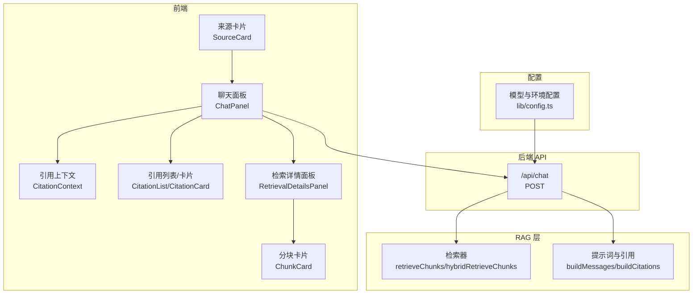
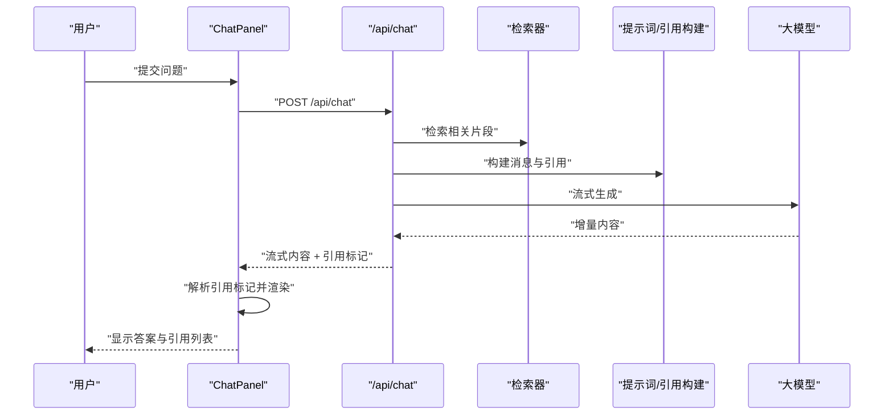
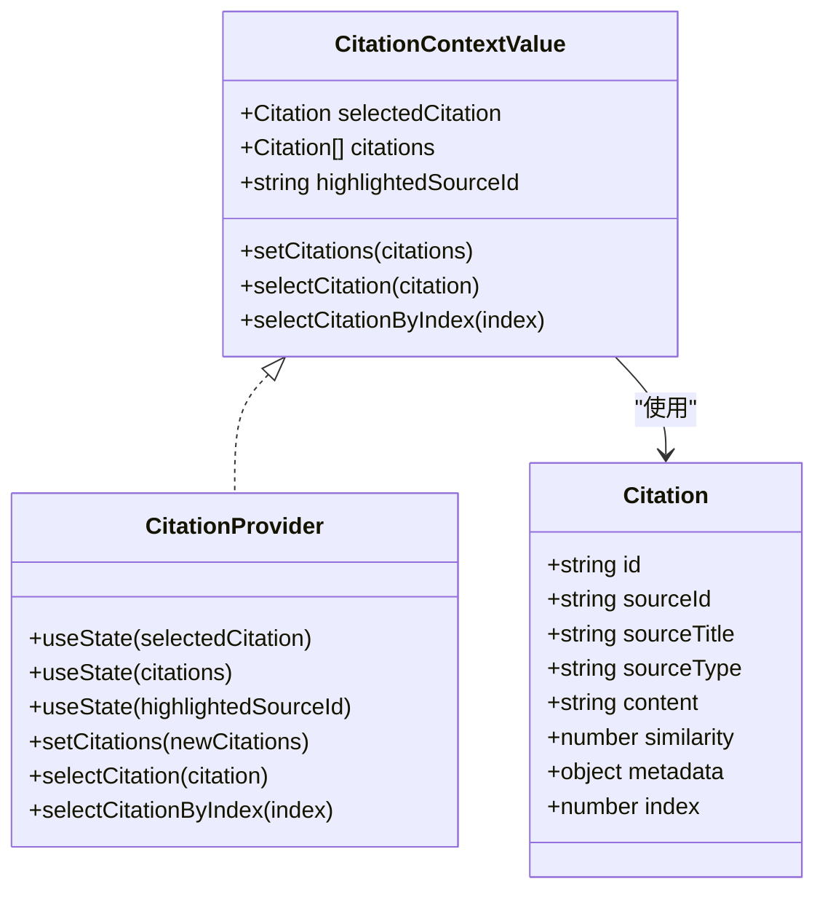
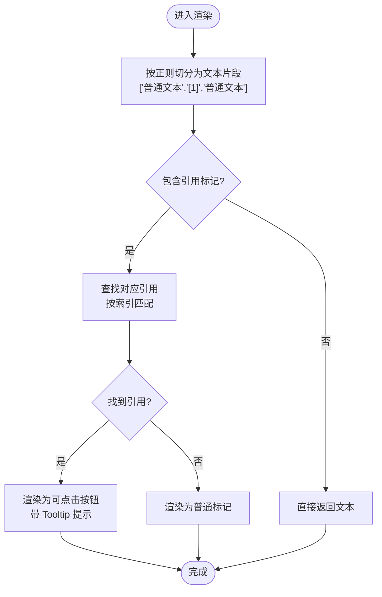
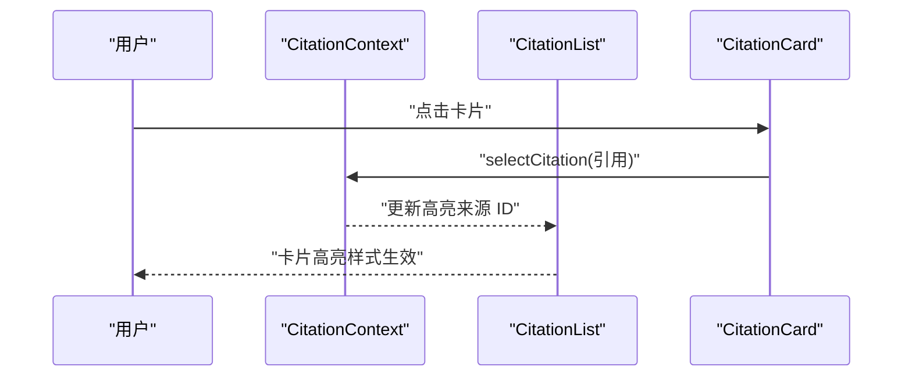
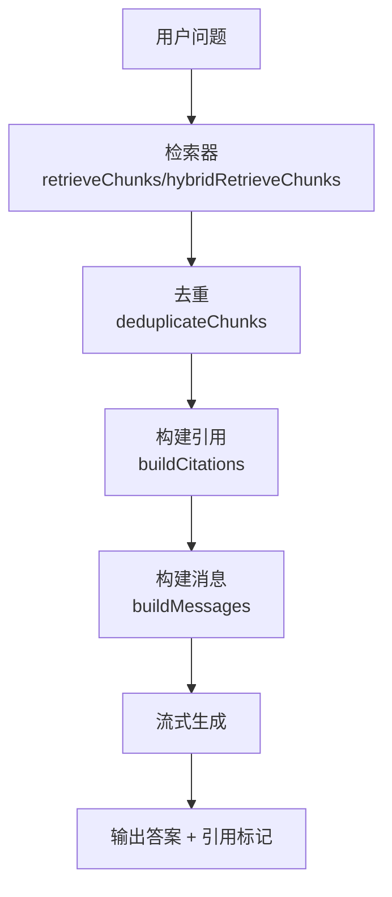
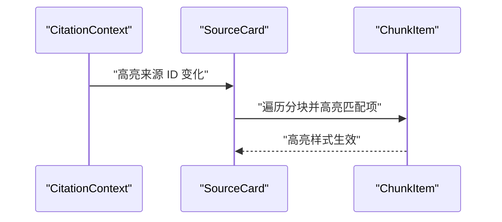
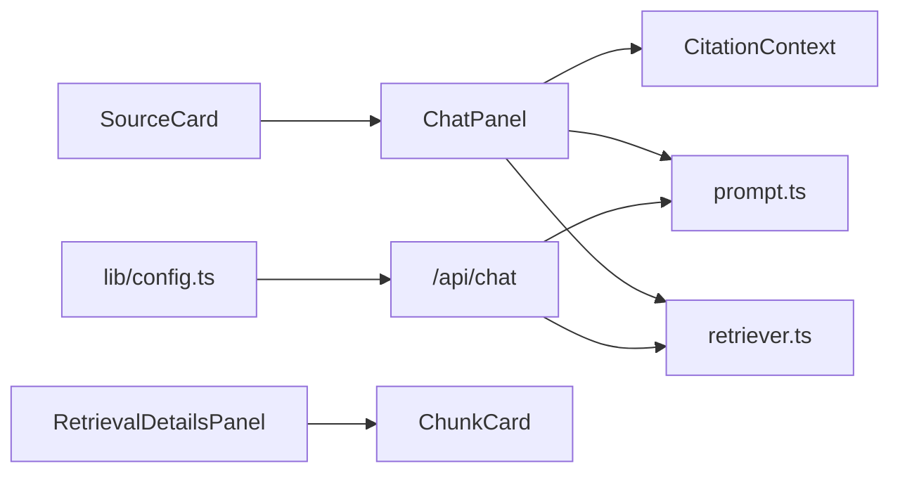

# 引用系统

<cite>
**本文引用的文件**
- [components/notebook/citation-context.tsx](file://components/notebook/citation-context.tsx)
- [components/notebook/chat-panel.tsx](file://components/notebook/chat-panel.tsx)
- [lib/rag/prompt.ts](file://lib/rag/prompt.ts)
- [lib/rag/retriever.ts](file://lib/rag/retriever.ts)
- [app/api/chat/route.ts](file://app/api/chat/route.ts)
- [components/notebook/retrieval-details-panel.tsx](file://components/notebook/retrieval-details-panel.tsx)
- [components/notebook/chunk-card.tsx](file://components/notebook/chunk-card.tsx)
- [components/notebook/source-card.tsx](file://components/notebook/source-card.tsx)
- [lib/config.ts](file://lib/config.ts)
- [components/providers.tsx](file://components/providers.tsx)
</cite>

## 目录
1. [简介](#简介)
2. [项目结构](#项目结构)
3. [核心组件](#核心组件)
4. [架构总览](#架构总览)
5. [详细组件分析](#详细组件分析)
6. [依赖关系分析](#依赖关系分析)
7. [性能考量](#性能考量)
8. [故障排查指南](#故障排查指南)
9. [结论](#结论)
10. [附录](#附录)

## 简介
本技术文档围绕“引用系统”进行深入解析，涵盖引用上下文的状态管理、引用标记的解析与动态渲染、引用卡片的高亮与交互、引用溯源的数据流（检索、相似度计算、去重）、全局状态管理（选中、高亮、导航定位），以及引用数据模型、API 接口规范与错误处理机制。同时提供扩展点与自定义选项，帮助开发者在样式与交互层面进行二次开发。

## 项目结构
引用系统由前端状态与渲染层、RAG 检索与提示词组装层、后端 API 层协同组成：
- 前端状态与渲染：引用上下文 Provider、聊天面板、引用卡片、检索详情面板、分块卡片等
- RAG 层：检索器、提示词与引用构建器
- 后端 API：聊天流式接口，负责检索、组装提示词、调用大模型、返回流式内容与引用标记

图表来源
- [components/notebook/chat-panel.tsx](file://components/notebook/chat-panel.tsx#L60-L412)
- [lib/rag/retriever.ts](file://lib/rag/retriever.ts#L53-L116)
- [lib/rag/prompt.ts](file://lib/rag/prompt.ts#L37-L88)
- [app/api/chat/route.ts](file://app/api/chat/route.ts#L25-L324)
- [components/notebook/retrieval-details-panel.tsx](file://components/notebook/retrieval-details-panel.tsx#L42-L158)
- [components/notebook/chunk-card.tsx](file://components/notebook/chunk-card.tsx#L26-L93)
- [components/notebook/source-card.tsx](file://components/notebook/source-card.tsx#L223-L626)
- [lib/config.ts](file://lib/config.ts#L117-L147)

章节来源
- [components/notebook/chat-panel.tsx](file://components/notebook/chat-panel.tsx#L60-L412)
- [lib/rag/retriever.ts](file://lib/rag/retriever.ts#L53-L116)
- [lib/rag/prompt.ts](file://lib/rag/prompt.ts#L37-L88)
- [app/api/chat/route.ts](file://app/api/chat/route.ts#L25-L324)
- [components/notebook/retrieval-details-panel.tsx](file://components/notebook/retrieval-details-panel.tsx#L42-L158)
- [components/notebook/chunk-card.tsx](file://components/notebook/chunk-card.tsx#L26-L93)
- [components/notebook/source-card.tsx](file://components/notebook/source-card.tsx#L223-L626)
- [lib/config.ts](file://lib/config.ts#L117-L147)

## 核心组件
- 引用上下文（CitationContext）：提供选中引用、引用编号映射、高亮来源 ID 的全局状态与操作方法
- 聊天面板（ChatPanel）：负责消息渲染、引用标记解析、引用卡片展示、检索详情弹窗
- 提示词与引用构建（prompt.ts）：构建上下文、消息列表，并从检索结果生成引用（含去重）
- 检索器（retriever.ts）：向量/混合检索、去重、返回检索结果与评分
- 后端 API（/api/chat）：并行检索与保存用户消息，流式返回内容并在结尾附加引用标记
- 检索详情面板（RetrievalDetailsPanel）：展示检索参数、片段与链路可视化
- 分块卡片（ChunkCard）：展示片段内容、相似度与评分
- 来源卡片（SourceCard）：展示来源高亮、分块列表与定位

章节来源
- [components/notebook/citation-context.tsx](file://components/notebook/citation-context.tsx#L46-L97)
- [components/notebook/chat-panel.tsx](file://components/notebook/chat-panel.tsx#L478-L675)
- [lib/rag/prompt.ts](file://lib/rag/prompt.ts#L37-L148)
- [lib/rag/retriever.ts](file://lib/rag/retriever.ts#L53-L206)
- [app/api/chat/route.ts](file://app/api/chat/route.ts#L25-L324)
- [components/notebook/retrieval-details-panel.tsx](file://components/notebook/retrieval-details-panel.tsx#L42-L158)
- [components/notebook/chunk-card.tsx](file://components/notebook/chunk-card.tsx#L26-L93)
- [components/notebook/source-card.tsx](file://components/notebook/source-card.tsx#L223-L626)

## 架构总览
引用系统采用“前端状态驱动 + 后端流式生成 + RAG 检索”的架构：
- 前端通过 ChatPanel 发起请求，后端并行执行检索与保存消息
- 后端将检索结果转为引用（buildCitations），并以流式形式返回内容
- 前端在收到引用标记后，将其注入到 Markdown 渲染管线，实现引用标记的点击高亮与导航

图表来源
- [components/notebook/chat-panel.tsx](file://components/notebook/chat-panel.tsx#L171-L300)
- [app/api/chat/route.ts](file://app/api/chat/route.ts#L79-L200)
- [lib/rag/retriever.ts](file://lib/rag/retriever.ts#L53-L116)
- [lib/rag/prompt.ts](file://lib/rag/prompt.ts#L62-L88)

## 详细组件分析

### 引用上下文与状态管理
- 全局状态：选中引用、引用列表、高亮来源 ID
- 关键能力：
  - setCitations：仅在列表真正变化时重算索引，避免不必要的重渲染
  - selectCitation：选中引用并同步高亮来源 ID
  - selectCitationByIndex：通过索引选中引用
- 数据模型：Citation 包含来源 ID、标题、类型、内容摘要、相似度、元数据（页码、分块索引、字符区间）

图表来源
- [components/notebook/citation-context.tsx](file://components/notebook/citation-context.tsx#L12-L97)

章节来源
- [components/notebook/citation-context.tsx](file://components/notebook/citation-context.tsx#L46-L97)

### 引用标记解析与动态渲染
- 正则匹配：使用分片策略将文本按“引用标记”切分，如 [1]、[2]
- 索引分配：根据消息内的引用顺序为每个引用分配连续索引
- 动态渲染：将标记渲染为可点击按钮，点击后触发上下文选中，实现高亮与导航
- Tooltip 提示：鼠标悬停显示来源标题与页码

图表来源
- [components/notebook/chat-panel.tsx](file://components/notebook/chat-panel.tsx#L543-L659)

章节来源
- [components/notebook/chat-panel.tsx](file://components/notebook/chat-panel.tsx#L543-L659)

### 引用卡片实现（高亮、相似度、交互）
- 高亮状态：根据高亮来源 ID 与当前卡片来源 ID 进行比对，决定是否应用高亮样式
- 相似度排序：引用列表按相似度降序排列，卡片显示百分比
- 点击交互：点击卡片触发上下文选中，联动来源高亮与侧边详情

图表来源
- [components/notebook/chat-panel.tsx](file://components/notebook/chat-panel.tsx#L481-L537)
- [components/notebook/citation-context.tsx](file://components/notebook/citation-context.tsx#L63-L73)

章节来源
- [components/notebook/chat-panel.tsx](file://components/notebook/chat-panel.tsx#L481-L537)
- [components/notebook/citation-context.tsx](file://components/notebook/citation-context.tsx#L63-L73)

### 引用溯源数据流（检索、相似度、去重）
- 检索：支持向量检索与混合检索，返回片段、相似度、评分与元数据
- 去重：以内容前 100 字为键，保留相似度更高的条目
- 引用构建：从检索结果生成引用对象，包含来源信息、内容摘要、相似度与元数据
- 检索详情：展示检索参数、片段列表与链路可视化

图表来源
- [lib/rag/retriever.ts](file://lib/rag/retriever.ts#L53-L116)
- [lib/rag/retriever.ts](file://lib/rag/retriever.ts#L118-L206)
- [lib/rag/prompt.ts](file://lib/rag/prompt.ts#L112-L148)
- [lib/rag/prompt.ts](file://lib/rag/prompt.ts#L62-L88)

章节来源
- [lib/rag/retriever.ts](file://lib/rag/retriever.ts#L53-L116)
- [lib/rag/retriever.ts](file://lib/rag/retriever.ts#L118-L206)
- [lib/rag/prompt.ts](file://lib/rag/prompt.ts#L112-L148)
- [lib/rag/prompt.ts](file://lib/rag/prompt.ts#L62-L88)

### 全局状态管理（选中、高亮、导航定位）
- 选中状态：通过上下文选中引用，触发高亮来源 ID 更新
- 高亮效果：卡片与来源卡片根据高亮来源 ID 应用视觉样式
- 导航定位：来源卡片维护分块 DOM 引用映射，支持根据选中引用定位到具体分块

图表来源
- [components/notebook/citation-context.tsx](file://components/notebook/citation-context.tsx#L63-L66)
- [components/notebook/source-card.tsx](file://components/notebook/source-card.tsx#L606-L620)

章节来源
- [components/notebook/citation-context.tsx](file://components/notebook/citation-context.tsx#L63-L66)
- [components/notebook/source-card.tsx](file://components/notebook/source-card.tsx#L606-L620)

### 引用数据模型与 API 规范
- 引用数据模型（Citation）
  - 字段：id、sourceId、sourceTitle、sourceType、content、similarity、metadata（page、chunkIndex、startChar、endChar）、index
- API 接口规范（/api/chat）
  - 方法：POST
  - 请求体：messages、notebookId、selectedSourceIds、mode
  - 成功响应：流式返回内容；在流结束时追加引用标记与检索详情
  - 错误处理：鉴权失败、参数缺失、无证据场景、模型调用异常等

章节来源
- [lib/rag/prompt.ts](file://lib/rag/prompt.ts#L93-L106)
- [app/api/chat/route.ts](file://app/api/chat/route.ts#L39-L66)
- [app/api/chat/route.ts](file://app/api/chat/route.ts#L129-L158)
- [app/api/chat/route.ts](file://app/api/chat/route.ts#L172-L200)
- [app/api/chat/route.ts](file://app/api/chat/route.ts#L208-L314)

### 错误处理机制
- 前端：捕获流式读取异常、解析错误、网络错误，显示错误提示并回退到占位内容
- 后端：统一 try-catch 包裹，返回 JSON 错误；无证据场景返回固定文案与空引用
- 检索详情：当片段相似度低于阈值时，给出提示

章节来源
- [components/notebook/chat-panel.tsx](file://components/notebook/chat-panel.tsx#L290-L299)
- [app/api/chat/route.ts](file://app/api/chat/route.ts#L316-L322)
- [components/notebook/retrieval-details-panel.tsx](file://components/notebook/retrieval-details-panel.tsx#L128-L135)

### 扩展点与自定义选项
- 样式定制
  - 引用卡片高亮样式、字体大小、颜色主题可通过类名覆盖
  - 检索详情面板标签页与卡片样式可按需调整
- 交互行为
  - 引用点击回调可替换为自定义导航逻辑（如路由跳转、锚点定位）
  - 模型选择与检索参数（topK、阈值、混合检索开关）可在前端与后端配置
- 渲染增强
  - 引用标记解析支持扩展更多标记格式
  - 检索详情支持展示更多指标（如向量/全文评分）

章节来源
- [components/notebook/chat-panel.tsx](file://components/notebook/chat-panel.tsx#L503-L537)
- [components/notebook/retrieval-details-panel.tsx](file://components/notebook/retrieval-details-panel.tsx#L96-L155)
- [lib/config.ts](file://lib/config.ts#L105-L115)
- [lib/rag/retriever.ts](file://lib/rag/retriever.ts#L6-L13)

## 依赖关系分析
- ChatPanel 依赖 CitationContext 提供的选中与高亮能力
- ChatPanel 依赖 prompt.ts 的消息构建与引用生成
- ChatPanel 依赖 retriever.ts 的检索能力
- /api/chat 依赖 retriever 与 prompt，并结合模型配置进行流式生成
- RetrievalDetailsPanel 依赖 ChunkCard 展示检索片段
- SourceCard 依赖分块列表与高亮映射

图表来源
- [components/notebook/chat-panel.tsx](file://components/notebook/chat-panel.tsx#L67-L109)
- [lib/rag/prompt.ts](file://lib/rag/prompt.ts#L5-L20)
- [lib/rag/retriever.ts](file://lib/rag/retriever.ts#L1-L5)
- [app/api/chat/route.ts](file://app/api/chat/route.ts#L12-L20)
- [components/notebook/retrieval-details-panel.tsx](file://components/notebook/retrieval-details-panel.tsx#L4-L6)
- [components/notebook/chunk-card.tsx](file://components/notebook/chunk-card.tsx#L1-L8)
- [components/notebook/source-card.tsx](file://components/notebook/source-card.tsx#L1-L10)
- [lib/config.ts](file://lib/config.ts#L54-L66)

章节来源
- [components/notebook/chat-panel.tsx](file://components/notebook/chat-panel.tsx#L67-L109)
- [lib/rag/prompt.ts](file://lib/rag/prompt.ts#L5-L20)
- [lib/rag/retriever.ts](file://lib/rag/retriever.ts#L1-L5)
- [app/api/chat/route.ts](file://app/api/chat/route.ts#L12-L20)
- [components/notebook/retrieval-details-panel.tsx](file://components/notebook/retrieval-details-panel.tsx#L4-L6)
- [components/notebook/chunk-card.tsx](file://components/notebook/chunk-card.tsx#L1-L8)
- [components/notebook/source-card.tsx](file://components/notebook/source-card.tsx#L1-L10)
- [lib/config.ts](file://lib/config.ts#L54-L66)

## 性能考量
- 检索与保存并行：后端并行执行保存用户消息与检索，减少端到端延迟
- 去重与排序：在生成引用前对检索结果进行去重与排序，降低下游渲染压力
- 状态更新优化：CitationContext 仅在列表变化时重算索引，避免重复渲染
- 流式传输：后端以 SSE 形式返回增量内容，前端即时渲染，提升感知性能

章节来源
- [app/api/chat/route.ts](file://app/api/chat/route.ts#L70-L96)
- [lib/rag/prompt.ts](file://lib/rag/prompt.ts#L112-L148)
- [components/notebook/citation-context.tsx](file://components/notebook/citation-context.tsx#L51-L61)

## 故障排查指南
- 无证据回复：当检索不到相关片段时，后端返回固定文案与空引用，前端显示提示
- 引用标记不生效：检查前端是否正确解析引用标记并注入渲染管线
- 高亮不显示：确认高亮来源 ID 是否与卡片来源 ID 匹配
- 检索结果为空：检查检索参数（topK、阈值、来源过滤）与模型配置

章节来源
- [app/api/chat/route.ts](file://app/api/chat/route.ts#L129-L158)
- [components/notebook/chat-panel.tsx](file://components/notebook/chat-panel.tsx#L604-L659)
- [components/notebook/citation-context.tsx](file://components/notebook/citation-context.tsx#L63-L66)
- [components/notebook/retrieval-details-panel.tsx](file://components/notebook/retrieval-details-panel.tsx#L118-L125)

## 结论
引用系统通过“前端状态驱动 + 后端流式生成 + RAG 检索”的组合，实现了从检索到渲染的闭环。其关键特性包括：
- 稳健的引用上下文状态管理与高亮联动
- 精准的引用标记解析与动态渲染
- 完整的检索详情与可视化
- 可扩展的样式与交互定制

该设计既满足了用户体验（即时反馈、直观高亮），也兼顾了工程实践（并行处理、去重优化、错误兜底）。

## 附录
- 模型与配置：支持多模型切换与默认配置，确保检索与生成一致性
- 前端 Provider：统一 Ant Design 与 XMarkdown 的主题与国际化

章节来源
- [lib/config.ts](file://lib/config.ts#L105-L147)
- [components/providers.tsx](file://components/providers.tsx#L16-L33)