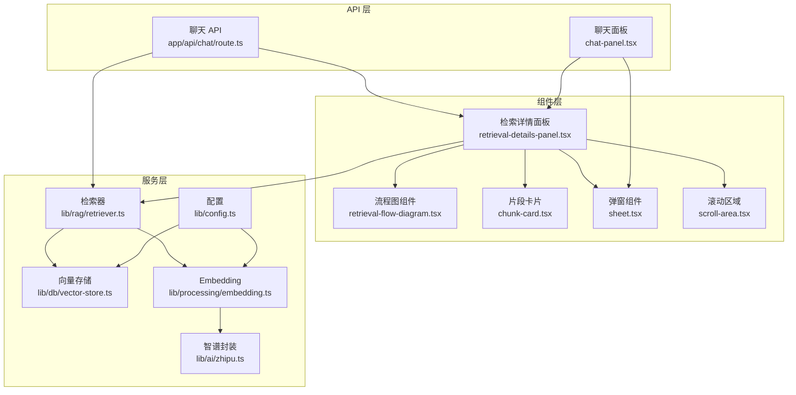
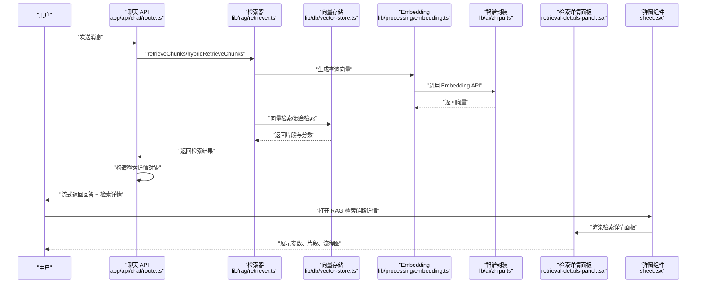
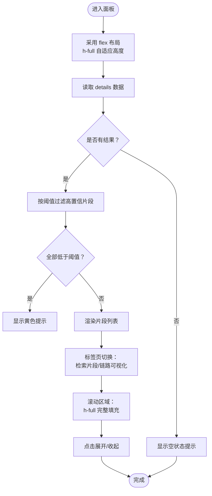
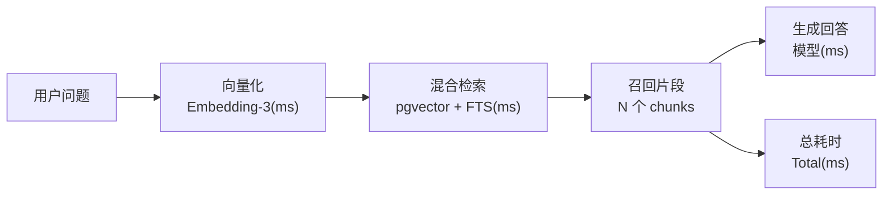
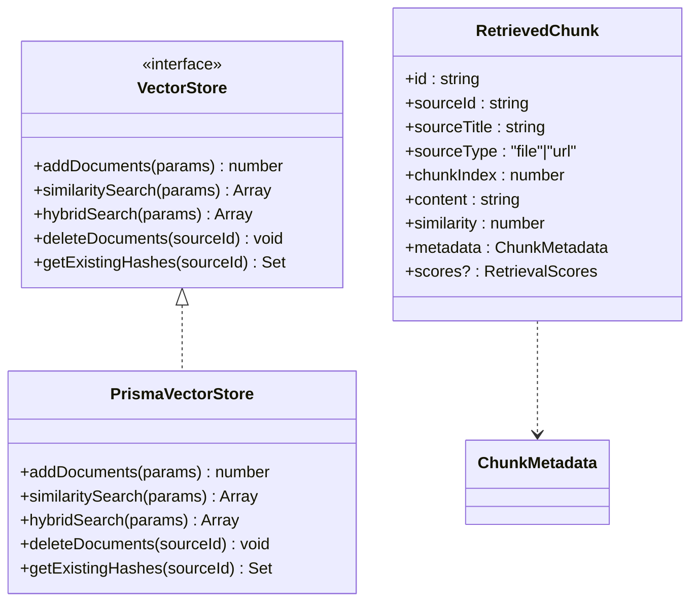
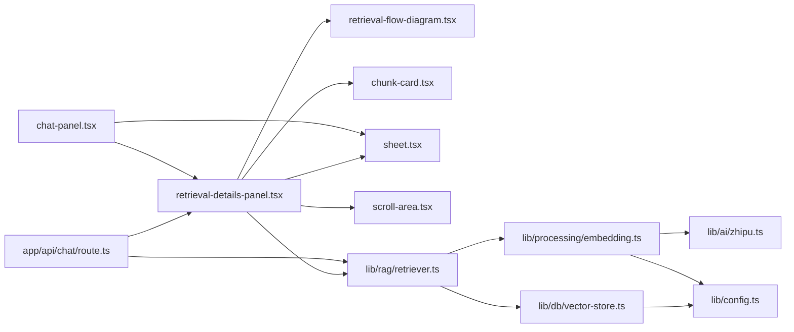

# 检索详情面板

<cite>
**本文档引用的文件**
- [retrieval-details-panel.tsx](file://components/notebook/retrieval-details-panel.tsx)
- [retrieval-flow-diagram.tsx](file://components/notebook/retrieval-flow-diagram.tsx)
- [chunk-card.tsx](file://components/notebook/chunk-card.tsx)
- [sheet.tsx](file://components/ui/sheet.tsx)
- [scroll-area.tsx](file://components/ui/scroll-area.tsx)
- [chat-panel.tsx](file://components/notebook/chat-panel.tsx)
- [retriever.ts](file://lib/rag/retriever.ts)
- [vector-store.ts](file://lib/db/vector-store.ts)
- [embedding.ts](file://lib/processing/embedding.ts)
- [zhipu.ts](file://lib/ai/zhipu.ts)
- [config.ts](file://lib/config.ts)
- [chat/route.ts](file://app/api/chat/route.ts)
- [types/index.ts](file://types/index.ts)
</cite>

## 更新摘要
**变更内容**
- 移除了检索详情面板的高度限制，改善内容显示灵活性
- 优化了标签页内容区域的最小高度设置，确保内容完整显示
- 改进了滚动区域的布局约束，提升长内容的可读性

## 目录
1. [简介](#简介)
2. [项目结构](#项目结构)
3. [核心组件](#核心组件)
4. [架构总览](#架构总览)
5. [组件详解](#组件详解)
6. [依赖关系分析](#依赖关系分析)
7. [性能考量](#性能考量)
8. [故障排查指南](#故障排查指南)
9. [结论](#结论)
10. [附录](#附录)

## 简介
本文件为"检索详情面板"的技术文档，聚焦以下目标：
- 设计架构与数据可视化实现
- 检索流程图绘制逻辑（节点关系、连接线、状态标识）
- 检索详情数据结构（查询向量、相似度计算、上下文组装）
- 交互设计（展开收起动画、数据刷新机制、错误状态处理）
- 检索算法可视化（向量空间投影、聚类效果、相似度阈值）
- 组件 API、数据格式规范与样式定制
- 调试工具与性能监控指标使用指南

## 项目结构
检索详情面板位于笔记应用的 Notebook 子系统中，作为聊天对话中的"RAG 检索链路详情"弹出面板出现。其核心文件与职责如下：
- 组件层
  - 检索详情面板：负责参数展示、片段列表、流程图视图切换
  - 流程图组件：以步骤化卡片展示检索链路耗时
  - 片段卡片：展示来源、相似度、内容预览与展开收起
- 服务层
  - 检索器：统一对外暴露向量检索与混合检索接口，并返回带分数的片段
  - 向量存储：封装 pgvector 与全文检索（FTS）联合查询
  - Embedding：封装智谱 Embedding API，含重试与批处理
- API 层
  - 聊天 API：在生成回答前构造检索详情对象，随流式响应返回给前端

**图表来源**
- [retrieval-details-panel.tsx](file://components/notebook/retrieval-details-panel.tsx#L1-L159)
- [sheet.tsx](file://components/ui/sheet.tsx#L1-L141)
- [scroll-area.tsx](file://components/ui/scroll-area.tsx#L1-L49)
- [chat-panel.tsx](file://components/notebook/chat-panel.tsx#L138-L146)

**章节来源**
- [retrieval-details-panel.tsx](file://components/notebook/retrieval-details-panel.tsx#L1-L159)
- [retrieval-flow-diagram.tsx](file://components/notebook/retrieval-flow-diagram.tsx#L1-L82)
- [chunk-card.tsx](file://components/notebook/chunk-card.tsx#L1-L94)
- [sheet.tsx](file://components/ui/sheet.tsx#L1-L141)
- [scroll-area.tsx](file://components/ui/scroll-area.tsx#L1-L49)
- [chat-panel.tsx](file://components/notebook/chat-panel.tsx#L138-L146)

## 核心组件
- 检索详情面板
  - 功能：展示检索参数、片段列表、流程图视图；根据阈值提示低置信片段
  - 关键属性：details.query、details.retrievalParams、details.chunks、details.timing
  - **更新**：移除了高度限制，采用 flex 布局确保内容自适应显示
- 流程图组件
  - 功能：按步骤展示"用户问题→向量化→混合检索→召回片段→生成回答（可选）"
  - 关键属性：timing.embedding、timing.retrieval、timing.generation、timing.total、model、chunkCount
- 片段卡片
  - 功能：展示来源、相似度百分比、内容预览、展开收起；混合检索时显示向量与全文分数
- 弹窗组件
  - 功能：提供右侧滑入式弹窗容器，支持自定义宽度和侧边位置
  - **更新**：优化了内容区域的最小高度设置，确保标签页内容完整显示

**章节来源**
- [retrieval-details-panel.tsx](file://components/notebook/retrieval-details-panel.tsx#L9-L40)
- [retrieval-flow-diagram.tsx](file://components/notebook/retrieval-flow-diagram.tsx#L5-L14)
- [chunk-card.tsx](file://components/notebook/chunk-card.tsx#L9-L24)
- [sheet.tsx](file://components/ui/sheet.tsx#L33-L50)

## 架构总览
检索详情面板的端到端流程：
1. 用户提问触发聊天 API，后台并行执行"保存消息 + 检索"
2. 检索完成后，构造检索详情对象（包含查询、参数、片段、耗时）
3. 将检索详情随流式响应返回前端，前端在"RAG 检索链路详情"弹窗中渲染

**图表来源**
- [chat/route.ts](file://app/api/chat/route.ts#L90-L289)
- [retriever.ts](file://lib/rag/retriever.ts#L53-L116)
- [vector-store.ts](file://lib/db/vector-store.ts#L175-L297)
- [embedding.ts](file://lib/processing/embedding.ts#L140-L189)
- [zhipu.ts](file://lib/ai/zhipu.ts#L62-L101)
- [retrieval-details-panel.tsx](file://components/notebook/retrieval-details-panel.tsx#L42-L158)
- [sheet.tsx](file://components/ui/sheet.tsx#L56-L74)

## 组件详解

### 检索详情面板（组件）
- 数据结构要点
  - 查询字符串、检索参数（sourceIds、topK、threshold、useHybridSearch、retrievalType）
  - 片段数组（id、sourceId、sourceName、score、content、metadata、scores）
  - 耗时统计（embedding、retrieval、generation、total）
- 视图与交互
  - 参数区：展示检索方式（向量/混合）、Top K、范围、阈值、返回数量
  - 标签页：检索片段、链路可视化
  - 片段列表：按阈值筛选高置信片段；当全部低于阈值时提示
  - 展开收起：片段内容支持展开/收起，进度条直观显示相似度
- **更新**：布局优化
  - 采用 `flex flex-col h-full` 确保面板自适应父容器高度
  - 标签页内容区域使用 `min-h-0` 配合 `flex-1` 实现弹性布局
  - 滚动区域采用 `h-full` 确保内容完整填充可用空间
- 错误与边界
  - 无结果时显示提示与建议
  - 当存在结果但全部低于阈值时，给出黄色提示

**图表来源**
- [retrieval-details-panel.tsx](file://components/notebook/retrieval-details-panel.tsx#L42-L158)

**章节来源**
- [retrieval-details-panel.tsx](file://components/notebook/retrieval-details-panel.tsx#L9-L40)
- [retrieval-details-panel.tsx](file://components/notebook/retrieval-details-panel.tsx#L42-L158)

### 流程图组件（组件）
- 步骤定义
  - 用户问题、向量化（含耗时）、混合检索（pgvector+FTS，含耗时）、召回片段（数量）、生成回答（可选，含模型与耗时）
- 渲染逻辑
  - 动态追加"生成回答"步骤（若提供 generation）
  - 底部显示总耗时（若提供 total）

**图表来源**
- [retrieval-flow-diagram.tsx](file://components/notebook/retrieval-flow-diagram.tsx#L16-L51)

**章节来源**
- [retrieval-flow-diagram.tsx](file://components/notebook/retrieval-flow-diagram.tsx#L5-L14)
- [retrieval-flow-diagram.tsx](file://components/notebook/retrieval-flow-diagram.tsx#L16-L51)

### 片段卡片（组件）
- 展示要素
  - 来源图标（URL/File）、来源标题、页码（若有）
  - 相似度百分比与进度条
  - 混合检索时显示向量分数与全文分数
  - 内容预览，超过一定长度时提供展开/收起按钮
- 交互细节
  - 展开收起切换状态
  - 不同置信度区间采用不同颜色

**章节来源**
- [chunk-card.tsx](file://components/notebook/chunk-card.tsx#L9-L24)
- [chunk-card.tsx](file://components/notebook/chunk-card.tsx#L26-L94)

### 弹窗组件（组件）
- **更新**：布局优化
  - 采用 `flex-1 flex flex-col min-h-0` 确保内容区域自适应高度
  - 标签页内容区域使用 `m-0 p-0 min-h-0` 避免额外间距影响布局
  - 滚动区域采用 `h-full` 确保内容完整填充
- 功能特性
  - 支持从右侧滑入的弹窗容器
  - 自定义宽度（sm:w-[540px]，默认 w-[400px]）
  - 支持关闭按钮和键盘快捷键

**章节来源**
- [sheet.tsx](file://components/ui/sheet.tsx#L33-L50)
- [sheet.tsx](file://components/ui/sheet.tsx#L56-L74)

### 滚动区域组件（组件）
- **更新**：布局增强
  - 滚动区域根元素采用 `h-full w-full` 确保完全填充容器
  - 视口区域同样使用 `h-full w-full` 保证滚动行为正常
- 功能特性
  - 提供垂直和水平滚动支持
  - 自适应滚动条外观和交互
  - 支持触摸设备的滚动体验

**章节来源**
- [scroll-area.tsx](file://components/ui/scroll-area.tsx#L11-L23)
- [scroll-area.tsx](file://components/ui/scroll-area.tsx#L26-L45)

### 检索器与向量存储
- 检索器
  - 向量检索：similaritySearch，返回片段与相似度
  - 混合检索：hybridSearch，返回向量分数、全文分数与组合分数
  - 返回结构：包含 chunks、hasEvidence、embeddingMs、retrievalMs、queryEmbedding、retrievalType
- 向量存储
  - 维度一致性：严格校验 EMBEDDING_DIM（默认 1024），否则抛错
  - 向量检索：支持按 sourceIds 过滤、阈值过滤、Top K 排序
  - 混合检索：CTE 联合向量与全文检索，按权重合并分数
  - 批量插入：分批写入，避免超大 SQL，记录操作日志

**图表来源**
- [vector-store.ts](file://lib/db/vector-store.ts#L24-L75)
- [vector-store.ts](file://lib/db/vector-store.ts#L77-L446)
- [retriever.ts](file://lib/rag/retriever.ts#L29-L51)

**章节来源**
- [retriever.ts](file://lib/rag/retriever.ts#L53-L116)
- [retriever.ts](file://lib/rag/retriever.ts#L131-L206)
- [vector-store.ts](file://lib/db/vector-store.ts#L175-L297)
- [vector-store.ts](file://lib/db/vector-store.ts#L312-L442)

### Embedding 与模型配置
- Embedding
  - 批量生成，最大批大小与单条 token 上限控制
  - 指数退避重试，支持 429/5xx 等可重试错误
  - 维度校验：确保与配置一致
- 模型配置
  - EMBEDDING_DIM 固定为 1024（与 embedding-3 对齐）
  - 智谱 API 基础地址、模型名、聊天模型等集中管理

**章节来源**
- [embedding.ts](file://lib/processing/embedding.ts#L12-L26)
- [embedding.ts](file://lib/processing/embedding.ts#L115-L134)
- [embedding.ts](file://lib/processing/embedding.ts#L140-L189)
- [config.ts](file://lib/config.ts#L6-L29)
- [config.ts](file://lib/config.ts#L45-L52)
- [zhipu.ts](file://lib/ai/zhipu.ts#L62-L101)

### API 数据流与消息元数据
- 聊天 API
  - 并行执行保存消息与检索，随后构造检索详情对象
  - 检索详情字段：query、retrievalParams、model、chunks、timing
  - 将检索详情注入消息元数据，随流式响应返回
- 类型定义
  - MessageMetadata.retrievalDetails 与前端组件 props 结构保持一致

**章节来源**
- [chat/route.ts](file://app/api/chat/route.ts#L90-L126)
- [chat/route.ts](file://app/api/chat/route.ts#L232-L247)
- [types/index.ts](file://types/index.ts#L71-L104)

## 依赖关系分析
- 组件依赖
  - 检索详情面板依赖：Tabs、ScrollArea、ChunkCard、RetrievalFlowDiagram
  - 流程图组件依赖：步骤图标与颜色主题
  - 片段卡片依赖：进度条、展开收起状态
  - **新增**：弹窗组件依赖：Radix UI 对话框、样式变体
  - **新增**：滚动区域依赖：Radix UI 滚动区域、滚动条
- 服务依赖
  - 检索器依赖：Embedding 与向量存储
  - 向量存储依赖：配置（EMBEDDING_DIM）、日志工具
  - Embedding 依赖：智谱封装、配置
- API 依赖
  - 聊天 API 依赖：检索器、类型定义、消息持久化

**图表来源**
- [retrieval-details-panel.tsx](file://components/notebook/retrieval-details-panel.tsx#L1-L8)
- [sheet.tsx](file://components/ui/sheet.tsx#L1-L9)
- [scroll-area.tsx](file://components/ui/scroll-area.tsx#L1-L6)
- [chat-panel.tsx](file://components/notebook/chat-panel.tsx#L138-L146)

**章节来源**
- [retrieval-details-panel.tsx](file://components/notebook/retrieval-details-panel.tsx#L1-L8)
- [retriever.ts](file://lib/rag/retriever.ts#L1-L4)
- [vector-store.ts](file://lib/db/vector-store.ts#L1-L4)
- [embedding.ts](file://lib/processing/embedding.ts#L1-L7)
- [zhipu.ts](file://lib/ai/zhipu.ts#L1-L8)
- [chat/route.ts](file://app/api/chat/route.ts#L90-L126)
- [config.ts](file://lib/config.ts#L6-L29)

## 性能考量
- 向量维度与索引
  - EMBEDDING_DIM 固定为 1024，确保与数据库向量列维度一致，避免运行时错误
  - 向量检索使用纯量积距离（1 - 向量余弦），结合阈值与 Top K 控制返回规模
- 批处理与重试
  - Embedding 批大小与 token 上限控制，减少 API 调用次数
  - 指数退避重试，提升网络波动下的稳定性
- 查询优化
  - 向量检索与混合检索均使用 CTE 减少重复计算
  - 混合检索通过 LEFT JOIN 联合全文分数，按权重合并
- **更新**：布局性能优化
  - 采用 `min-h-0` 配合 `flex-1` 实现更高效的弹性布局
  - `h-full` 布局确保内容完整填充，避免重排和闪烁
  - 滚动区域优化减少不必要的重绘
- 日志与可观测性
  - 向量操作与查询均记录日志，包含耗时、命中数量、平均相似度等指标

**章节来源**
- [config.ts](file://lib/config.ts#L6-L29)
- [vector-store.ts](file://lib/db/vector-store.ts#L175-L297)
- [vector-store.ts](file://lib/db/vector-store.ts#L312-L442)
- [embedding.ts](file://lib/processing/embedding.ts#L12-L26)
- [embedding.ts](file://lib/processing/embedding.ts#L115-L134)

## 故障排查指南
- 常见错误与定位
  - 向量维度不匹配：检查 EMBEDDING_DIM 是否为 1024，确认 Embedding API 返回维度一致
  - 检索无结果：检查阈值是否过高、Top K 是否过小、检索范围是否过窄
  - API 调用失败：关注 429/5xx 错误，确认网络与配额；查看重试日志
  - **新增**：布局显示异常：检查 `min-h-0` 和 `h-full` 类的使用是否正确
- 调试建议
  - 在聊天 API 中打印检索详情对象，核对字段完整性
  - 使用浏览器开发者工具观察流式响应中的 citations 标记与 retrievalDetails
  - 查看向量存储日志，确认查询耗时与命中数量
  - **新增**：检查弹窗组件的宽度设置是否符合预期
- 错误状态处理
  - 无证据时返回固定提示，面板显示空状态与建议
  - 全部片段低于阈值时显示黄色提示，提醒用户调整问题或增加资料

**章节来源**
- [config.ts](file://lib/config.ts#L169-L187)
- [chat/route.ts](file://app/api/chat/route.ts#L128-L158)
- [retrieval-details-panel.tsx](file://components/notebook/retrieval-details-panel.tsx#L116-L135)

## 结论
检索详情面板通过清晰的参数展示、片段列表与流程图视图，帮助用户理解 RAG 检索链路的全貌。后端以类型安全的检索器与向量存储为核心，结合 Embedding 批处理与重试策略，保障了检索的稳定性与性能。前端通过标签页与交互控件，提供了良好的可读性与可操作性。**本次更新移除了高度限制，采用更灵活的布局方案，显著提升了长内容的显示效果和用户体验。**

## 附录

### 组件 API 与数据格式规范
- 检索详情面板 props
  - query: string
  - model?: string
  - retrievalParams: {
      sourceIds: string[]
      topK: number
      threshold: number
      useHybridSearch?: boolean
      retrievalType?: string
    }
  - chunks: Array<{
      id: string
      sourceId: string
      sourceName: string
      score: number
      content: string
      metadata: { page?: number; url?: string }
      scores?: {
        vectorScore?: number
        ftsScore?: number
        combinedScore?: number
      }
    }>
  - timing: {
      embedding: number
      retrieval: number
      generation?: number
      total?: number
    }

- 流程图组件 props
  - timing: { embedding, retrieval, generation?, total? }
  - model: string
  - chunkCount: number

- 片段卡片 props
  - chunk: { id, sourceId, sourceName, score, content, metadata, scores? }
  - showScores?: boolean

- **新增**：弹窗组件 props
  - side: "top" | "bottom" | "left" | "right" (默认: "right")
  - className: string
  - children: React.ReactNode

- 检索器返回结构
  - chunks: RetrievedChunk[]
  - hasEvidence: boolean
  - retrievalMs: number
  - embeddingMs: number
  - queryEmbedding: number[]
  - retrievalType?: 'vector' | 'hybrid' | 'fts'

- 向量存储接口
  - similaritySearch(params): 返回 { id, sourceId, chunkIndex, content, metadata, similarity }[]
  - hybridSearch(params): 返回 { id, sourceId, chunkIndex, content, metadata, similarity, vectorScore, ftsScore, combinedScore }[]

**章节来源**
- [retrieval-details-panel.tsx](file://components/notebook/retrieval-details-panel.tsx#L9-L40)
- [retrieval-flow-diagram.tsx](file://components/notebook/retrieval-flow-diagram.tsx#L5-L14)
- [chunk-card.tsx](file://components/notebook/chunk-card.tsx#L9-L24)
- [sheet.tsx](file://components/ui/sheet.tsx#L52-L54)
- [retriever.ts](file://lib/rag/retriever.ts#L29-L51)
- [vector-store.ts](file://lib/db/vector-store.ts#L37-L75)

### 样式定制选项
- 面板容器：最大高度、边框、背景色
- 标签页：激活态边框与颜色、文字尺寸
- 片段卡片：边框、阴影、内边距、字体大小与颜色
- 进度条：高度、宽度、颜色主题
- 流程图步骤：颜色主题、图标、子文本
- **新增**：弹窗宽度：支持 sm:w-[540px] 和默认 w-[400px] 的自适应宽度
- **新增**：布局约束：`min-h-0` 配合 `flex-1` 实现弹性布局

**章节来源**
- [retrieval-details-panel.tsx](file://components/notebook/retrieval-details-panel.tsx#L48-L158)
- [retrieval-flow-diagram.tsx](file://components/notebook/retrieval-flow-diagram.tsx#L54-L81)
- [chunk-card.tsx](file://components/notebook/chunk-card.tsx#L30-L94)
- [sheet.tsx](file://components/ui/sheet.tsx#L33-L50)

### 调试工具与性能监控
- 调试工具
  - 浏览器网络面板：观察聊天 API 的流式响应与 citations 标记
  - 控制台日志：聊天 API 中的请求与响应日志、向量操作日志
  - **新增**：布局调试：检查 flex 布局和高度约束的生效情况
- 性能指标
  - embeddingMs、retrievalMs、generationMs、totalMs
  - 平均相似度、命中片段数、阈值命中率
  - Embedding 批大小、重试次数、错误码分布
- **新增**：布局性能
  - 弹窗宽度响应时间
  - 内容区域渲染性能
  - 滚动区域滚动流畅度

**章节来源**
- [chat/route.ts](file://app/api/chat/route.ts#L185-L191)
- [chat/route.ts](file://app/api/chat/route.ts#L232-L247)
- [vector-store.ts](file://lib/db/vector-store.ts#L263-L279)
- [embedding.ts](file://lib/processing/embedding.ts#L115-L134)