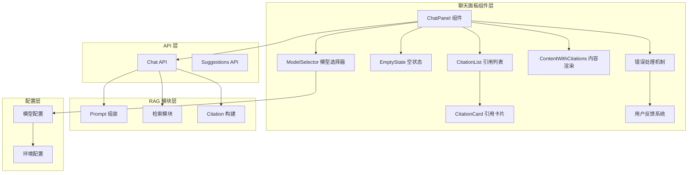
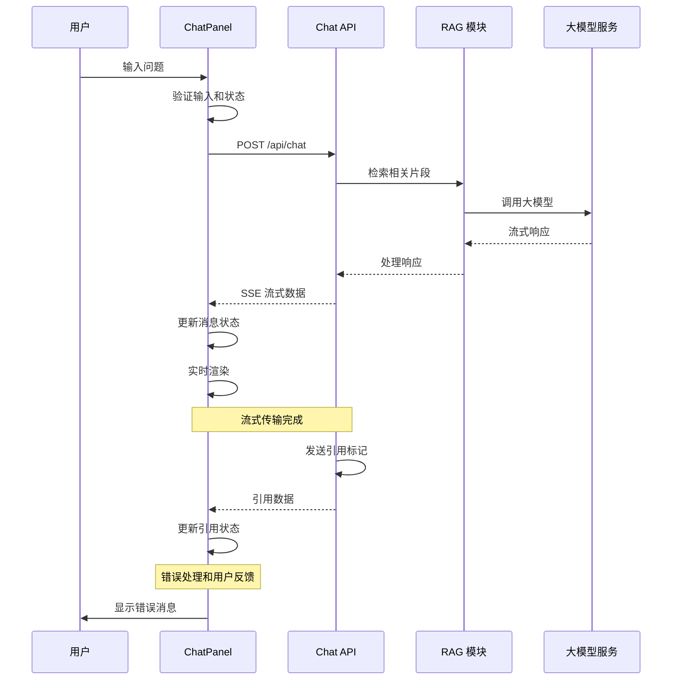
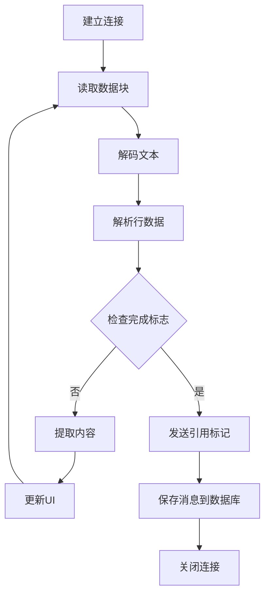
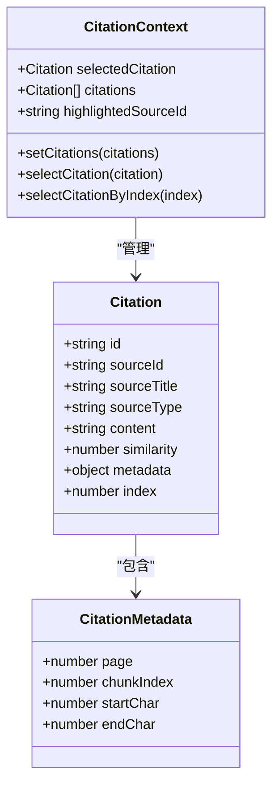
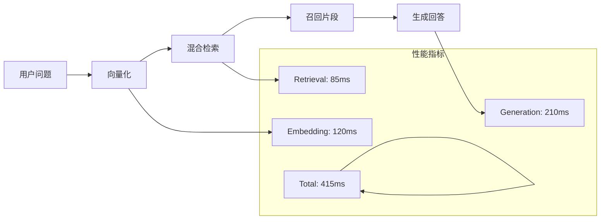
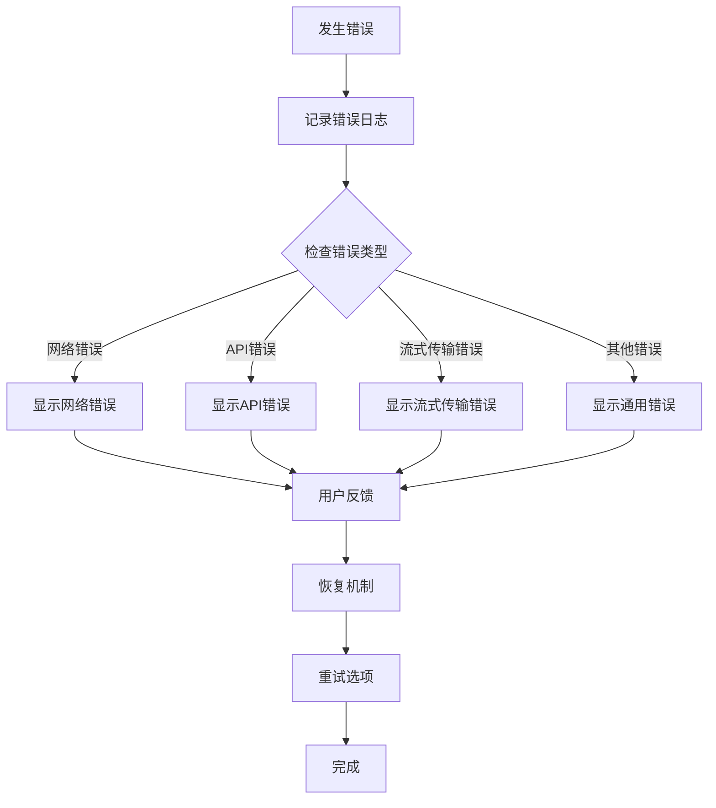
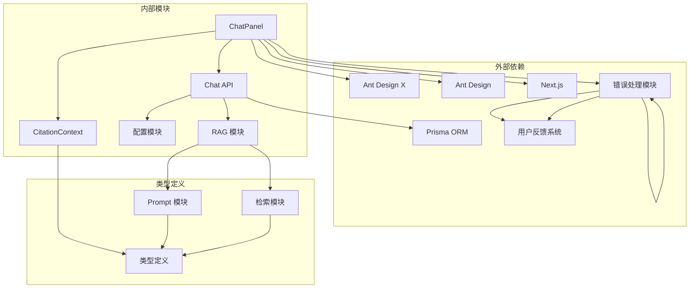
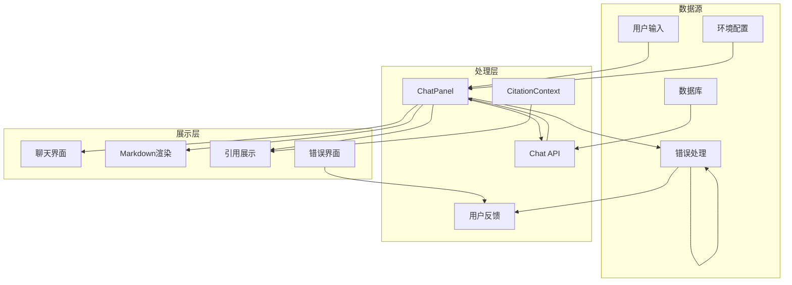

# 聊天面板组件

<cite>
**本文档引用的文件**
- [chat-panel.tsx](file://components/notebook/chat-panel.tsx)
- [route.ts](file://app/api/chat/route.ts)
- [config.ts](file://lib/config.ts)
- [citation-context.tsx](file://components/notebook/citation-context.tsx)
- [prompt.ts](file://lib/rag/prompt.ts)
- [retriever.ts](file://lib/rag/retriever.ts)
- [zhipu.ts](file://lib/ai/zhipu.ts)
- [index.ts](file://types/index.ts)
- [retrieval-details-panel.tsx](file://components/notebook/retrieval-details-panel.tsx)
- [chunk-card.tsx](file://components/notebook/chunk-card.tsx)
- [retrieval-flow-diagram.tsx](file://components/notebook/retrieval-flow-diagram.tsx)
- [global-error.tsx](file://app/global-error.tsx)
- [error.tsx](file://app/error.tsx)
</cite>

## 更新摘要
**变更内容**
- 改进错误消息处理机制，提供更友好的用户反馈
- 优化用户界面错误显示，增强用户体验
- 增强错误状态管理和恢复机制
- 完善全局错误处理和用户引导

## 目录
1. [简介](#简介)
2. [项目结构](#项目结构)
3. [核心组件](#核心组件)
4. [架构概览](#架构概览)
5. [详细组件分析](#详细组件分析)
6. [依赖关系分析](#依赖关系分析)
7. [性能考虑](#性能考虑)
8. [故障排除指南](#故障排除指南)
9. [结论](#结论)
10. [附录](#附录)

## 简介

聊天面板组件是 NotebookLM-Clone 项目的核心交互组件，实现了基于 RAG（检索增强生成）的智能问答功能。该组件提供了完整的消息管理、流式输出和用户交互逻辑，支持引用溯源、模型选择和检索详情可视化等高级功能。

该组件采用现代化的 React Hooks 架构，结合 Ant Design X 组件库和自定义 UI 组件，为用户提供流畅的聊天体验。组件支持多种模型配置，包括快速模式和精确模式，并提供了丰富的引用溯源功能。

**更新** 本次更新重点改进了错误消息处理和用户界面反馈机制，提升了系统的健壮性和用户体验。

## 项目结构

聊天面板组件位于 `components/notebook/chat-panel.tsx`，围绕该组件形成了一个完整的聊天生态系统：



**图表来源**
- [chat-panel.tsx](file://components/notebook/chat-panel.tsx#L1-L678)
- [route.ts](file://app/api/chat/route.ts#L1-L339)
- [config.ts](file://lib/config.ts#L1-L187)

**章节来源**
- [chat-panel.tsx](file://components/notebook/chat-panel.tsx#L1-L678)
- [config.ts](file://lib/config.ts#L1-L187)

## 核心组件

### ChatPanel 主组件

ChatPanel 是整个聊天功能的核心组件，负责管理消息状态、处理用户交互和协调各个子组件。

#### 主要职责
- **消息状态管理**: 维护用户消息、AI 消息和加载状态
- **流式响应处理**: 实现 SSE 流式传输和实时更新
- **用户交互**: 处理输入提交、模型切换和引用点击
- **UI 渲染**: 管理聊天界面的布局和样式
- **错误处理**: 提供友好的错误消息和用户反馈

#### 关键状态管理
- `messages`: 完整的消息历史数组
- `input`: 当前输入框内容
- `isLoading`: 加载状态指示器
- `currentCitations`: 当前消息的引用列表
- `suggestedQuestions`: 建议问题列表
- `chatMode`: 当前模型模式

**更新** 错误处理机制得到显著改进，现在能够提供更清晰的错误消息和更好的用户反馈。

**章节来源**
- [chat-panel.tsx](file://components/notebook/chat-panel.tsx#L44-L72)

### 模型选择器组件

模型选择器提供了 fast 和 precise 两种模式的切换功能：

#### 模式说明
- **fast 模式**: 使用 GLM-4 Flash 等快速模型，响应速度快但准确性相对较低
- **precise 模式**: 使用 LongCat 精确推理模型，准确性高但响应较慢

#### 配置管理
- 支持本地存储持久化
- 动态加载可用模型列表
- 实时更新模型配置

**章节来源**
- [chat-panel.tsx](file://components/notebook/chat-panel.tsx#L417-L441)
- [config.ts](file://lib/config.ts#L104-L147)

## 架构概览

聊天面板组件采用了分层架构设计，确保了良好的代码组织和可维护性：



**图表来源**
- [chat-panel.tsx](file://components/notebook/chat-panel.tsx#L171-L307)
- [route.ts](file://app/api/chat/route.ts#L172-L339)

## 详细组件分析

### 消息管理系统

#### 消息状态结构
每个消息对象包含以下关键属性：

| 属性名 | 类型 | 描述 | 必填 |
|--------|------|------|------|
| id | string | 消息唯一标识符 | 是 |
| role | string | 消息角色 (user/assistant) | 是 |
| content | string | 消息内容 | 是 |
| createdAt | Date | 创建时间 | 是 |
| citations | unknown | 引用数据 | 否 |
| answerMode | string | 回答模式 (grounded/no_evidence) | 否 |
| retrievalDetails | any | 检索详情 | 否 |

#### 状态更新机制
消息状态通过 React 的 setState 进行管理，采用不可变更新模式：

```mermaid
flowchart TD
Start([用户发送消息]) --> CreateUserMsg[创建用户消息]
CreateUserMsg --> AddUserMsg[添加到消息列表]
AddUserMsg --> CreateAIMsg[创建AI占位消息]
CreateAIMsg --> AddAIMsg[添加AI消息]
AddAIMsg --> SendRequest[发送API请求]
SendRequest --> StreamResponse{流式响应?}
StreamResponse --> |是| ProcessStream[处理流式数据]
StreamResponse --> |否| ProcessJSON[处理JSON响应]
ProcessStream --> UpdateContent[更新消息内容]
ProcessJSON --> UpdateContent
UpdateContent --> UpdateCitations[更新引用状态]
UpdateCitations --> End([完成])
Note over ProcessStream,UpdateCitations : 错误处理和用户反馈
```

**图表来源**
- [chat-panel.tsx](file://components/notebook/chat-panel.tsx#L171-L307)

**章节来源**
- [chat-panel.tsx](file://components/notebook/chat-panel.tsx#L44-L52)
- [chat-panel.tsx](file://components/notebook/chat-panel.tsx#L171-L307)

### 流式响应实现

#### SSE 流式传输协议
组件实现了标准的 Server-Sent Events 协议，支持实时数据传输：



**图表来源**
- [route.ts](file://app/api/chat/route.ts#L221-L339)

#### TextDecoder 使用
组件使用现代浏览器的 TextDecoder API 进行流式解码：

- **流式解码**: `decoder.decode(value, { stream: true })`
- **错误处理**: 捕获解码异常并进行容错处理
- **内存优化**: 分块处理避免大字符串内存占用

**更新** 错误处理机制得到改进，现在能够更好地处理流式传输过程中的异常情况。

**章节来源**
- [chat-panel.tsx](file://components/notebook/chat-panel.tsx#L245-L295)
- [route.ts](file://app/api/chat/route.ts#L221-L339)

### 引用溯源功能

#### 引用数据结构
引用系统采用统一的数据结构，支持多种来源类型：



**图表来源**
- [citation-context.tsx](file://components/notebook/citation-context.tsx#L12-L27)
- [prompt.ts](file://lib/rag/prompt.ts#L93-L106)

#### 引用标记解析
组件实现了智能的引用标记解析和渲染：

1. **标记识别**: 使用正则表达式 `[数字]` 识别引用标记
2. **动态渲染**: 将标记转换为可点击的按钮组件
3. **交互处理**: 支持点击事件和工具提示显示

**章节来源**
- [chat-panel.tsx](file://components/notebook/chat-panel.tsx#L546-L662)
- [citation-context.tsx](file://components/notebook/citation-context.tsx#L29-L42)

### 检索详情可视化

#### 检索流程图
组件提供了可视化的检索流程展示：



**图表来源**
- [retrieval-flow-diagram.tsx](file://components/notebook/retrieval-flow-diagram.tsx#L16-L81)

**章节来源**
- [retrieval-details-panel.tsx](file://components/notebook/retrieval-details-panel.tsx#L42-L158)
- [retrieval-flow-diagram.tsx](file://components/notebook/retrieval-flow-diagram.tsx#L16-L81)

### 错误处理和用户反馈系统

#### 错误消息处理机制
组件实现了多层次的错误处理和用户反馈机制：



**图表来源**
- [chat-panel.tsx](file://components/notebook/chat-panel.tsx#L297-L306)

#### 用户界面反馈优化
- **错误消息格式化**: 统一的错误消息格式，包含错误类型和详细信息
- **用户友好提示**: 提供清晰的错误说明和解决方案建议
- **状态恢复**: 自动恢复聊天状态，允许用户继续使用
- **重试机制**: 提供便捷的重试选项

**更新** 错误处理机制得到显著改进，现在能够提供更清晰的错误消息和更好的用户体验。

**章节来源**
- [chat-panel.tsx](file://components/notebook/chat-panel.tsx#L297-L306)

## 依赖关系分析

### 组件依赖图



**图表来源**
- [chat-panel.tsx](file://components/notebook/chat-panel.tsx#L9-L33)
- [route.ts](file://app/api/chat/route.ts#L8-L20)

### 数据流依赖

组件间的数据流向体现了清晰的单向数据流原则：



**图表来源**
- [chat-panel.tsx](file://components/notebook/chat-panel.tsx#L60-L415)
- [route.ts](file://app/api/chat/route.ts#L25-L339)

**章节来源**
- [chat-panel.tsx](file://components/notebook/chat-panel.tsx#L1-L678)
- [route.ts](file://app/api/chat/route.ts#L1-L339)

## 性能考虑

### 内存优化策略

1. **消息状态优化**
   - 使用 `useMemo` 缓存计算结果
   - 避免不必要的重新渲染
   - 及时清理引用避免内存泄漏

2. **流式处理优化**
   - 分块读取和处理数据
   - 及时释放解码器资源
   - 控制消息数量防止内存溢出

3. **渲染性能优化**
   - 使用虚拟滚动处理大量消息
   - 懒加载重型组件
   - 优化 re-render 频率

### 网络性能优化

1. **连接管理**
   - 合理的超时设置
   - 断线重连机制
   - 连接池管理

2. **数据压缩**
   - 流式传输减少延迟
   - 压缩引用数据
   - 优化网络请求

### 缓存策略

1. **本地缓存**
   - 模型配置缓存
   - 用户偏好设置
   - 建议问题缓存

2. **服务器端缓存**
   - 检索结果缓存
   - 向量嵌入缓存
   - 响应缓存

### 错误处理性能优化

**更新** 错误处理机制得到优化：
- **异步错误处理**: 非阻塞的错误处理，不影响主流程
- **错误缓存**: 缓存常见错误类型，提供快速响应
- **降级策略**: 在错误情况下提供基本功能
- **性能监控**: 监控错误处理性能，及时发现瓶颈

## 故障排除指南

### 常见问题及解决方案

#### 流式传输问题
**症状**: 消息无法实时显示或显示中断

**可能原因**:
- 网络连接不稳定
- 服务器端流式传输中断
- 客户端解码错误

**解决步骤**:
1. 检查网络连接状态
2. 验证服务器端流式传输配置
3. 查看浏览器控制台错误信息
4. 重启聊天会话

#### 引用显示问题
**症状**: 引用标记无法点击或显示异常

**可能原因**:
- 引用数据格式不正确
- Markdown 渲染器配置错误
- 样式冲突

**解决步骤**:
1. 验证引用数据结构完整性
2. 检查 Markdown 组件配置
3. 确认 CSS 样式加载
4. 清除浏览器缓存

#### 模型切换问题
**症状**: 模型切换后无响应或报错

**可能原因**:
- API 密钥配置错误
- 模型权限不足
- 网络访问受限

**解决步骤**:
1. 验证环境变量配置
2. 检查 API 密钥有效性
3. 确认模型可用性
4. 联系管理员授权

#### 错误处理问题
**症状**: 错误消息显示不正确或用户体验不佳

**可能原因**:
- 错误消息格式不统一
- 用户反馈机制缺失
- 错误状态管理不当

**解决步骤**:
1. 检查错误消息格式化逻辑
2. 验证用户反馈组件配置
3. 确认错误状态恢复机制
4. 测试错误处理流程

### 调试技巧

1. **启用开发模式日志**
   ```javascript
   // 在开发环境中查看详细日志
   console.log('[Chat] 流式数据:', text)
   console.log('[Chat] 错误处理:', error)
   ```

2. **监控性能指标**
   - 消息渲染时间
   - 流式传输延迟
   - 内存使用情况
   - 错误处理性能

3. **错误边界处理**
   - 捕获并记录异常
   - 提供友好的错误提示
   - 实现自动重试机制
   - 提供用户友好的错误界面

**更新** 错误处理机制得到改进，现在能够提供更清晰的错误信息和更好的用户体验。

**章节来源**
- [chat-panel.tsx](file://components/notebook/chat-panel.tsx#L297-L306)
- [route.ts](file://app/api/chat/route.ts#L331-L339)

## 结论

聊天面板组件是一个功能完整、架构清晰的现代化聊天系统。它成功地将复杂的 RAG 技术与用户友好的界面设计相结合，提供了流畅的用户体验。

### 主要优势

1. **架构设计**: 采用分层架构，职责分离明确
2. **性能优化**: 实现了流式传输和多种优化策略
3. **用户体验**: 提供了丰富的交互功能和可视化展示
4. **可扩展性**: 模块化设计便于功能扩展和维护
5. **错误处理**: 新增了完善的错误处理和用户反馈机制

### 技术亮点

- **流式响应处理**: 实现了标准的 SSE 协议
- **智能引用系统**: 支持复杂的引用溯源和交互
- **多模型支持**: 灵活的模型配置和切换机制
- **可视化展示**: 完整的检索流程和性能指标展示
- **错误处理优化**: 改进了错误消息处理和用户界面反馈

**更新** 本次更新重点改进了错误处理和用户反馈机制，显著提升了系统的健壮性和用户体验。

该组件为 NotebookLM-Clone 项目奠定了坚实的技术基础，为后续功能扩展提供了良好的架构支撑。

## 附录

### API 接口定义

#### ChatPanel Props 接口
```typescript
interface ChatPanelProps {
  notebookId: string
  initialMessages: Message[]
  selectedSourceIds?: string[]
}
```

#### Message 接口
```typescript
interface Message {
  id: string
  role: string
  content: string
  createdAt: Date
  citations?: unknown
  answerMode?: string | null
  retrievalDetails?: any
}
```

#### 模型配置接口
```typescript
interface ModelConfig {
  id: string
  provider: ModelProvider
  model: string
  displayName: string
  description: string
  icon: 'zap' | 'target'
}
```

### 使用示例

#### 基本使用
```typescript
<ChatPanel 
  notebookId="notebook-123"
  initialMessages={messages}
  selectedSourceIds={['source-1', 'source-2']}
/>
```

#### 动态模型切换
```typescript
<ModelSelector
  value={chatMode}
  onChange={(value) => setChatMode(value)}
  disabled={isLoading}
/>
```

#### 引用交互
```typescript
<CitationList citations={citations} />
```

### 最佳实践

1. **状态管理**: 使用 React Hooks 进行状态管理
2. **错误处理**: 实现完善的错误边界和恢复机制
3. **性能监控**: 定期监控性能指标和用户体验
4. **安全考虑**: 实施适当的输入验证和权限控制
5. **可测试性**: 编写单元测试和集成测试
6. **错误处理**: 实现用户友好的错误消息和反馈机制

**更新** 新增错误处理最佳实践，确保系统具有良好的错误处理能力。