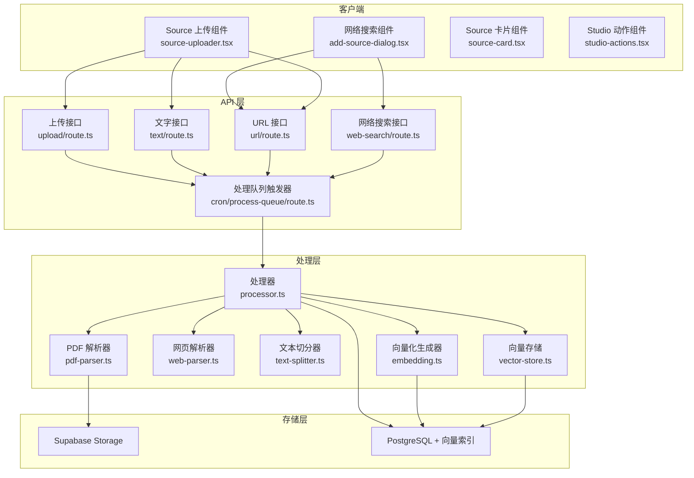
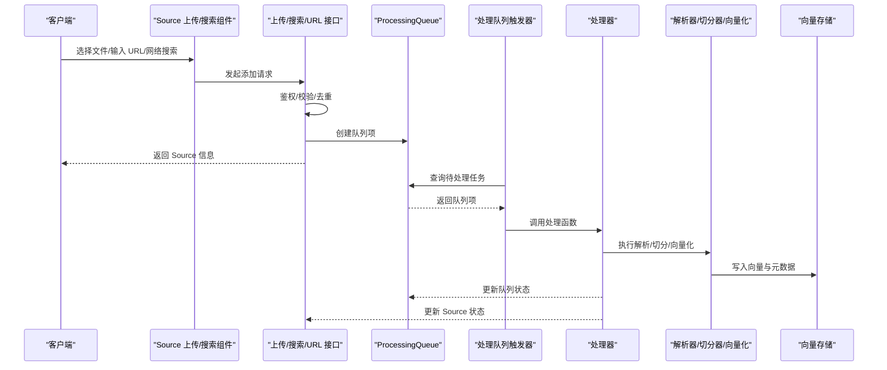
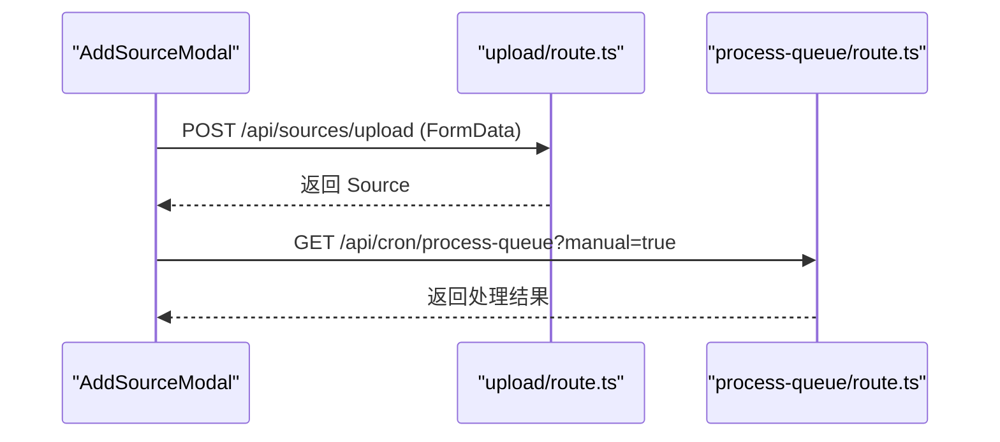
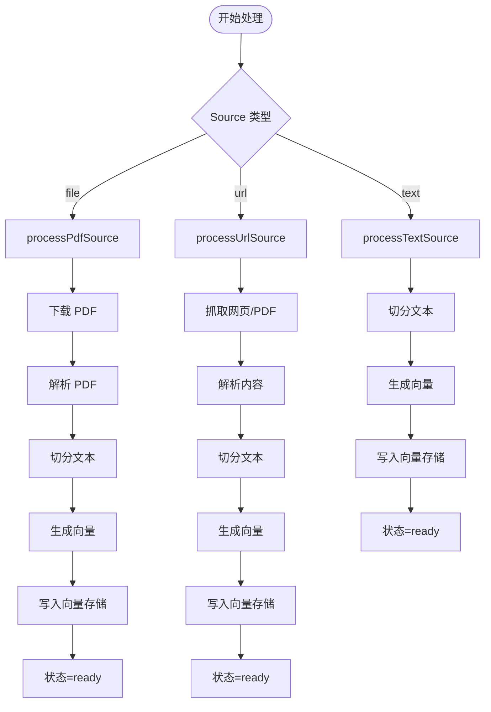
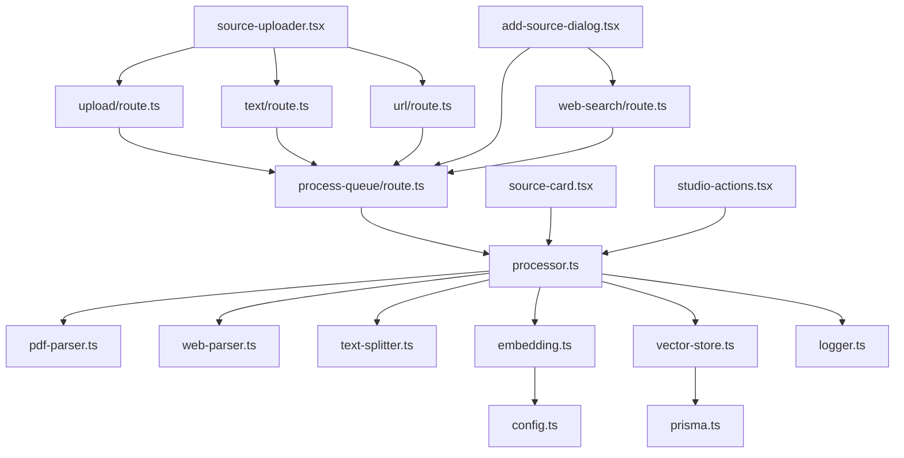

# Sources 知识源导入系统

<cite>
**本文档引用的文件**
- [app/api/sources/upload/route.ts](file://app/api/sources/upload/route.ts)
- [app/api/sources/text/route.ts](file://app/api/sources/text/route.ts)
- [app/api/sources/url/route.ts](file://app/api/sources/url/route.ts)
- [app/api/sources/web-search/route.ts](file://app/api/sources/web-search/route.ts)
- [lib/processing/processor.ts](file://lib/processing/processor.ts)
- [lib/processing/pdf-parser.ts](file://lib/processing/pdf-parser.ts)
- [lib/processing/web-parser.ts](file://lib/processing/web-parser.ts)
- [lib/processing/text-splitter.ts](file://lib/processing/text-splitter.ts)
- [lib/processing/embedding.ts](file://lib/processing/embedding.ts)
- [lib/db/vector-store.ts](file://lib/db/vector-store.ts)
- [app/api/cron/process-queue/route.ts](file://app/api/cron/process-queue/route.ts)
- [components/notebook/source-uploader.tsx](file://components/notebook/source-uploader.tsx)
- [components/notebook/source-card.tsx](file://components/notebook/source-card.tsx)
- [components/notebook/studio-actions.tsx](file://components/notebook/studio-actions.tsx)
- [components/notebook/add-source-dialog.tsx](file://components/notebook/add-source-dialog.tsx)
- [lib/config.ts](file://lib/config.ts)
- [types/index.ts](file://types/index.ts)
- [lib/db/prisma.ts](file://lib/db/prisma.ts)
- [lib/utils/logger.ts](file://lib/utils/logger.ts)
</cite>

## 更新摘要
**变更内容**
- 新增网络搜索 API 功能，支持智能搜索和结果过滤
- 优化 SourceCard 组件的界面展示和交互体验
- 改进 StudioActions 组件的状态管理和用户反馈
- 增强 AddSourceDialog 组件的搜索功能和批量操作
- 优化 web-search API 的查询优化和结果质量控制

## 目录
1. [简介](#简介)
2. [项目结构](#项目结构)
3. [核心组件](#核心组件)
4. [架构总览](#架构总览)
5. [详细组件分析](#详细组件分析)
6. [依赖关系分析](#依赖关系分析)
7. [性能考量](#性能考量)
8. [故障排除指南](#故障排除指南)
9. [结论](#结论)
10. [附录](#附录)

## 简介
Sources 知识源导入系统负责将多种来源的内容（PDF 文件、网页链接、复制的文字、网络搜索结果）统一接入，并完成解析、切分、向量化与持久化，最终进入向量检索与 RAG 流程。系统采用异步处理队列，支持重试与错误追踪，确保大规模文档的稳定处理。新增的网络搜索功能为用户提供智能化的外部知识源获取能力。

## 项目结构
系统主要由三层构成：
- API 层：接收用户上传与添加请求，进行鉴权与参数校验，创建 Source 并入队。新增网络搜索 API 支持智能搜索。
- 处理层：根据 Source 类型执行不同处理流程（PDF/URL/文字/搜索结果），包含下载、解析、切分、向量化与入库。
- 存储层：Supabase Storage 存放原始文件；PostgreSQL + 向量扩展存储切片与向量；向量检索通过向量索引与全文检索组合实现。

**图表来源**
- [components/notebook/source-uploader.tsx](file://components/notebook/source-uploader.tsx#L1-L553)
- [components/notebook/add-source-dialog.tsx](file://components/notebook/add-source-dialog.tsx#L1-L371)
- [components/notebook/source-card.tsx](file://components/notebook/source-card.tsx#L1-L862)
- [components/notebook/studio-actions.tsx](file://components/notebook/studio-actions.tsx#L1-L128)
- [app/api/sources/upload/route.ts](file://app/api/sources/upload/route.ts#L1-L111)
- [app/api/sources/text/route.ts](file://app/api/sources/text/route.ts#L1-L122)
- [app/api/sources/url/route.ts](file://app/api/sources/url/route.ts#L1-L167)
- [app/api/sources/web-search/route.ts](file://app/api/sources/web-search/route.ts#L1-L102)
- [app/api/cron/process-queue/route.ts](file://app/api/cron/process-queue/route.ts#L1-L165)
- [lib/processing/processor.ts](file://lib/processing/processor.ts#L1-L560)
- [lib/processing/pdf-parser.ts](file://lib/processing/pdf-parser.ts#L1-L150)
- [lib/processing/web-parser.ts](file://lib/processing/web-parser.ts#L1-L228)
- [lib/processing/text-splitter.ts](file://lib/processing/text-splitter.ts#L1-L270)
- [lib/processing/embedding.ts](file://lib/processing/embedding.ts#L1-L189)
- [lib/db/vector-store.ts](file://lib/db/vector-store.ts#L1-L446)

**章节来源**
- [components/notebook/source-uploader.tsx](file://components/notebook/source-uploader.tsx#L1-L553)
- [components/notebook/add-source-dialog.tsx](file://components/notebook/add-source-dialog.tsx#L1-L371)
- [components/notebook/source-card.tsx](file://components/notebook/source-card.tsx#L1-L862)
- [components/notebook/studio-actions.tsx](file://components/notebook/studio-actions.tsx#L1-L128)
- [app/api/sources/upload/route.ts](file://app/api/sources/upload/route.ts#L1-L111)
- [app/api/sources/text/route.ts](file://app/api/sources/text/route.ts#L1-L122)
- [app/api/sources/url/route.ts](file://app/api/sources/url/route.ts#L1-L167)
- [app/api/sources/web-search/route.ts](file://app/api/sources/web-search/route.ts#L1-L102)
- [app/api/cron/process-queue/route.ts](file://app/api/cron/process-queue/route.ts#L1-L165)
- [lib/processing/processor.ts](file://lib/processing/processor.ts#L1-L560)

## 核心组件
- Source 上传组件：提供拖拽上传、URL 添加、复制文字三种入口，负责调用后端 API 并触发处理队列。
- 网络搜索组件：支持智能搜索外部网页，提供搜索结果预览和批量添加功能。
- Source 卡片组件：增强的界面展示，支持状态进度条、详细信息面板、批量操作等功能。
- Studio 动作组件：提供摘要、大纲、测验、思维导图等生成功能，支持实时状态反馈。
- 上传接口：校验用户身份、文件类型与大小，上传至 Supabase Storage，创建 Source 记录并入队。
- 网络搜索接口：优化搜索查询，增加结果数量和质量控制，支持链接有效性验证。
- 文字接口：校验输入合法性，去重检查，直接入队处理。
- URL 接口：校验 URL 类型（网页/PDF/视频），尝试抓取网页标题，创建 Source 并入队（视频直接标记就绪）。
- 处理器：根据 Source 类型执行对应流程，更新状态与处理日志，写入向量存储。
- 解析器：PDF 使用 pdf-parse；网页使用 @mozilla/readability。
- 切分器：基于递归字符分隔符的文本切分，支持中英混合 token 估算与重叠窗口。
- 向量化：调用智谱 Embedding API，带指数退避重试与批量处理。
- 向量存储：批量插入 document_chunks，支持相似度检索与混合检索。
- 处理队列：定时触发，按优先级与创建时间调度，支持最多 3 次重试。

**章节来源**
- [components/notebook/source-uploader.tsx](file://components/notebook/source-uploader.tsx#L1-L553)
- [components/notebook/add-source-dialog.tsx](file://components/notebook/add-source-dialog.tsx#L1-L371)
- [components/notebook/source-card.tsx](file://components/notebook/source-card.tsx#L1-L862)
- [components/notebook/studio-actions.tsx](file://components/notebook/studio-actions.tsx#L1-L128)
- [app/api/sources/upload/route.ts](file://app/api/sources/upload/route.ts#L1-L111)
- [app/api/sources/web-search/route.ts](file://app/api/sources/web-search/route.ts#L1-L102)
- [app/api/sources/text/route.ts](file://app/api/sources/text/route.ts#L1-L122)
- [app/api/sources/url/route.ts](file://app/api/sources/url/route.ts#L1-L167)
- [lib/processing/processor.ts](file://lib/processing/processor.ts#L1-L560)
- [lib/processing/pdf-parser.ts](file://lib/processing/pdf-parser.ts#L1-L150)
- [lib/processing/web-parser.ts](file://lib/processing/web-parser.ts#L1-L228)
- [lib/processing/text-splitter.ts](file://lib/processing/text-splitter.ts#L1-L270)
- [lib/processing/embedding.ts](file://lib/processing/embedding.ts#L1-L189)
- [lib/db/vector-store.ts](file://lib/db/vector-store.ts#L1-L446)
- [app/api/cron/process-queue/route.ts](file://app/api/cron/process-queue/route.ts#L1-L165)

## 架构总览
系统采用"事件驱动 + 异步队列"的架构。前端通过 Source 上传组件和网络搜索组件发起请求，后端 API 完成鉴权、校验与入库后，将任务加入 ProcessingQueue。定时 Cron 从队列取出任务，交由处理器执行完整处理流程，期间不断更新 Source 状态与处理日志，最终将向量写入数据库。

**图表来源**
- [components/notebook/source-uploader.tsx](file://components/notebook/source-uploader.tsx#L1-L553)
- [components/notebook/add-source-dialog.tsx](file://components/notebook/add-source-dialog.tsx#L1-L371)
- [app/api/sources/upload/route.ts](file://app/api/sources/upload/route.ts#L1-L111)
- [app/api/sources/web-search/route.ts](file://app/api/sources/web-search/route.ts#L1-L102)
- [app/api/sources/url/route.ts](file://app/api/sources/url/route.ts#L1-L167)
- [app/api/cron/process-queue/route.ts](file://app/api/cron/process-queue/route.ts#L1-L165)
- [lib/processing/processor.ts](file://lib/processing/processor.ts#L1-L560)
- [lib/db/vector-store.ts](file://lib/db/vector-store.ts#L1-L446)

## 详细组件分析

### SourceUploader 组件
- 功能：提供统一的来源添加入口，支持拖拽上传 PDF、输入 URL、粘贴文字。
- 上传流程：构造 FormData，调用 /api/sources/upload，上传成功后自动触发 /api/cron/process-queue?manual=true。
- 进度跟踪：维护 uploadingFiles 列表，实时显示上传百分比与状态。
- 错误处理：捕获上传异常，显示 Toast 提示；支持移除失败项。

**图表来源**
- [components/notebook/source-uploader.tsx](file://components/notebook/source-uploader.tsx#L83-L135)
- [app/api/sources/upload/route.ts](file://app/api/sources/upload/route.ts#L94-L117)
- [app/api/cron/process-queue/route.ts](file://app/api/cron/process-queue/route.ts#L114-L117)

**章节来源**
- [components/notebook/source-uploader.tsx](file://components/notebook/source-uploader.tsx#L1-L553)

### 网络搜索组件（新增）
- 功能：支持智能搜索外部网页，提供搜索结果预览和批量添加功能。
- 搜索流程：输入查询词 → 调用 /api/sources/web-search → 显示搜索结果 → 用户选择后批量添加。
- 结果过滤：只显示有效的 HTTP(S) 链接，确保结果质量。
- 批量操作：支持全选、反选和批量添加功能。

**章节来源**
- [components/notebook/add-source-dialog.tsx](file://components/notebook/add-source-dialog.tsx#L1-L371)

### SourceCard 组件（增强）
- 功能：增强的界面展示，支持状态进度条、详细信息面板、批量操作等功能。
- 状态展示：提供详细的处理进度条，显示当前处理阶段和完成百分比。
- 详细信息：支持展开查看详情面板，显示文件大小、字数统计、添加时间等信息。
- 交互增强：支持高亮显示、平滑滚动到选中的片段、更好的错误处理。

**章节来源**
- [components/notebook/source-card.tsx](file://components/notebook/source-card.tsx#L1-L862)

### StudioActions 组件（增强）
- 功能：提供摘要、大纲、测验、思维导图等生成功能，支持实时状态反馈。
- 状态管理：支持生成状态跟踪，显示当前正在生成的类型和耗时。
- 用户反馈：提供详细的工具提示和状态信息，改善用户体验。

**章节来源**
- [components/notebook/studio-actions.tsx](file://components/notebook/studio-actions.tsx#L1-L128)

### 网络搜索接口（新增）
- 鉴权：使用 Supabase 服务端客户端获取当前用户。
- 查询优化：对查询词进行长度限制和增强处理。
- 搜索引擎：使用智谱 AI 的 web_search 工具，配置 search_pro 引擎。
- 结果控制：增加搜索结果数量到 15 个，提高内容丰富度。
- 过滤机制：只保留有效的 HTTP(S) 链接，确保结果质量。
- 错误处理：完善的错误处理和日志记录。

**章节来源**
- [app/api/sources/web-search/route.ts](file://app/api/sources/web-search/route.ts#L1-L102)

### 上传接口（PDF）
- 鉴权：使用 Supabase 服务端客户端获取当前用户。
- 校验：校验 notebookId、文件类型（仅 PDF）、大小（≤50MB）。
- 存储：将文件以 user_id/notebook_id/source_id_timestamp.pdf 的路径上传至 Supabase Storage。
- 入库：创建 Source 记录（type=file），状态 pending，meta 包含原文件名、mimeType、size、上传时间。
- 入队：创建 ProcessingQueue 记录，status=pending，priority=1。

**章节来源**
- [app/api/sources/upload/route.ts](file://app/api/sources/upload/route.ts#L14-L110)

### 文字接口
- 鉴权与输入校验：使用 Zod Schema 校验 notebookId、title、content 长度。
- 去重：对 content 计算哈希，查询是否已在当前 Notebook 的 document_chunks 中存在相同 content_hash。
- 入库：创建 Source（type=text），状态 pending，meta 包含 contentType、字符数、词数、添加时间。
- 入队：创建 ProcessingQueue 记录。

**章节来源**
- [app/api/sources/text/route.ts](file://app/api/sources/text/route.ts#L19-L115)

### URL 接口
- 鉴权与输入校验：校验 notebookId、URL 格式与协议（http/https）。
- 去重：若已有相同 url 的 Source，则返回错误。
- 类型检测：识别 youtube/pdf/webpage。
- 标题获取：尝试抓取网页 <title>，否则使用 hostname。
- 入库：创建 Source（type=file/url/video），状态根据类型设置（视频直接 ready，PDF/网页 pending）。
- 入队：非视频类型创建 ProcessingQueue 记录。

**章节来源**
- [app/api/sources/url/route.ts](file://app/api/sources/url/route.ts#L68-L166)

### 处理队列（Cron）
- 触发方式：GET /api/cron/process-queue，支持 Bearer Token 验证或 manual=true 参数。
- 任务选择：优先处理 priority 高、创建时间早的任务，最多 BATCH_SIZE=2。
- 状态更新：将队列项与 Source 状态更新为 processing，执行 processSource。
- 错误处理：捕获异常，记录队列失败、增加 attempts；当 attempts≥3 时，将 Source 标记为 failed。
- 自修复：若发现状态为 pending 的 Source 但不在队列中，自动补入队列并处理。

**章节来源**
- [app/api/cron/process-queue/route.ts](file://app/api/cron/process-queue/route.ts#L11-L164)

### 处理器（Processor）
- 类型分发：根据 Source.type 调用 processPdfSource/processUrlSource/processTextSource。
- PDF 流程：download → parse → chunk → embed → index，更新 Source 状态与 processingLog。
- URL 流程：fetch（抓取网页/PDF）→ parse → chunk → embed → index，必要时更新标题。
- 文本流程：跳过下载/解析，直接 chunk → embed → index。
- 日志结构：包含各阶段的 duration、pages/wordCount/chunks/tokensUsed 等指标。

**图表来源**
- [lib/processing/processor.ts](file://lib/processing/processor.ts#L402-L420)

**章节来源**
- [lib/processing/processor.ts](file://lib/processing/processor.ts#L1-L560)

### PDF 解析器
- 下载：从 Supabase Storage 按 storagePath 下载文件为 Buffer。
- 解析：使用 pdf-parse 提取 text、numpages、info；统计 wordCount；构建 pageInfo（按页均分字符位置）。
- 错误处理：识别 encrypted/password、Invalid PDF/corrupt 等错误并返回可读错误信息。
- 扫描件检测：若平均每页字符数过少，判定为扫描件并返回相应错误。

**章节来源**
- [lib/processing/pdf-parser.ts](file://lib/processing/pdf-parser.ts#L1-L150)

### 网页解析器
- 类型检测：识别 pdf/youtube/webpage。
- 抓取：带超时与重定向跟随，读取 content-type；对 401/403/404 等状态码抛出明确错误。
- 解析：使用 @mozilla/readability 提取正文，清理多余空白，统计词数；若无法提取正文则返回错误。
- PDF 检测：若 content-type 为 application/pdf，返回特殊标记，交由上游按 PDF 流程处理。

**章节来源**
- [lib/processing/web-parser.ts](file://lib/processing/web-parser.ts#L1-L228)

### 文本切分器
- 切分策略：基于优先级分隔符（Markdown 标题、段落、换行、中文标点、英文句号、空格、字符）的递归切分。
- 重叠窗口：通过 getOverlapText 维持相邻 chunk 的上下文连续性。
- token 估算：按中文≈1.5 字符/token，其他≈4 字符/token 的混合权重估算，便于控制目标 chunk_size。
- 元数据：包含 page/startChar/endChar/tokenCount/sourceTitle/sourceType。

**章节来源**
- [lib/processing/text-splitter.ts](file://lib/processing/text-splitter.ts#L1-L270)

### 向量化生成器
- 批量处理：每批最多 64 条，单条最多 3072 tokens。
- 指数退避重试：最多 3 次，初始延迟 1s，最大延迟 30s，针对 429/500/502/503/504。
- 去重优化：利用现有 content_hash 集合跳过已存在 chunk，减少重复计算与存储。
- 维度校验：严格校验返回向量维度与配置一致，确保系统稳定性。

**章节来源**
- [lib/processing/embedding.ts](file://lib/processing/embedding.ts#L1-L189)

### 向量存储
- 批量插入：每批最多 500 条，使用原生 SQL 插入，支持 ON CONFLICT (source_id, chunk_index) DO NOTHING。
- 相似度检索：使用向量内积（cosine）计算相似度，支持按 source_ids 过滤与阈值过滤。
- 混合检索：结合向量分数与全文检索分数（FTS），支持自定义权重。
- 去重与清理：提供 deleteDocuments 与 getExistingHashes，支持数据清理和去重。

**章节来源**
- [lib/db/vector-store.ts](file://lib/db/vector-store.ts#L1-L446)

## 依赖关系分析

**图表来源**
- [components/notebook/source-uploader.tsx](file://components/notebook/source-uploader.tsx#L1-L553)
- [components/notebook/add-source-dialog.tsx](file://components/notebook/add-source-dialog.tsx#L1-L371)
- [components/notebook/source-card.tsx](file://components/notebook/source-card.tsx#L1-L862)
- [components/notebook/studio-actions.tsx](file://components/notebook/studio-actions.tsx#L1-L128)
- [app/api/sources/upload/route.ts](file://app/api/sources/upload/route.ts#L1-L111)
- [app/api/sources/text/route.ts](file://app/api/sources/text/route.ts#L1-L122)
- [app/api/sources/url/route.ts](file://app/api/sources/url/route.ts#L1-L167)
- [app/api/sources/web-search/route.ts](file://app/api/sources/web-search/route.ts#L1-L102)
- [app/api/cron/process-queue/route.ts](file://app/api/cron/process-queue/route.ts#L1-L165)
- [lib/processing/processor.ts](file://lib/processing/processor.ts#L1-L560)
- [lib/processing/pdf-parser.ts](file://lib/processing/pdf-parser.ts#L1-L150)
- [lib/processing/web-parser.ts](file://lib/processing/web-parser.ts#L1-L228)
- [lib/processing/text-splitter.ts](file://lib/processing/text-splitter.ts#L1-L270)
- [lib/processing/embedding.ts](file://lib/processing/embedding.ts#L1-L189)
- [lib/db/vector-store.ts](file://lib/db/vector-store.ts#L1-L446)
- [lib/config.ts](file://lib/config.ts#L1-L187)
- [lib/db/prisma.ts](file://lib/db/prisma.ts#L1-L41)
- [lib/utils/logger.ts](file://lib/utils/logger.ts#L1-L98)

**章节来源**
- [types/index.ts](file://types/index.ts#L1-L214)

## 性能考量
- 批量与分页：向量存储每批 500 条，向量化每批 64 条，降低内存峰值与网络往返。
- 重试与退避：Embedding API 采用指数退避，提升外部依赖不稳定时的成功率。
- 去重优化：基于 content_hash 跳过重复 chunk，减少重复计算与存储。
- 维度一致性：启动时强制校验 EMBEDDING_DIM，避免运行期向量维度不匹配导致的错误。
- 数据库连接：Serverless 环境使用连接池与限制单实例连接数，避免并发过高导致连接不足。
- 超时控制：网页抓取与 PDF 下载均设置超时，防止长时间阻塞。
- 搜索优化：网络搜索 API 增加结果数量和质量控制，提升搜索效率。

**章节来源**
- [lib/db/vector-store.ts](file://lib/db/vector-store.ts#L8-L10)
- [lib/processing/embedding.ts](file://lib/processing/embedding.ts#L12-L18)
- [lib/config.ts](file://lib/config.ts#L6-L29)
- [lib/db/prisma.ts](file://lib/db/prisma.ts#L8-L16)
- [lib/processing/web-parser.ts](file://lib/processing/web-parser.ts#L57-L77)
- [app/api/sources/web-search/route.ts](file://app/api/sources/web-search/route.ts#L43-L44)

## 故障排除指南
- 上传失败（401 未登录）：确认已登录并携带有效会话；检查 Supabase 服务端客户端初始化。
- 上传失败（400 文件类型/大小不合法）：仅支持 PDF，大小不超过 50MB；检查前端限制与后端校验。
- 上传失败（403 无权限）：确保 notebookId 归当前用户所有。
- 文字添加失败（400 输入校验错误）：检查 title 长度与 content 字符数范围。
- URL 添加失败（400/404/403）：检查 URL 协议、可达性与访问权限；视频链接会直接标记为 ready。
- 网络搜索失败（400 缺少查询词）：确保提供有效的查询词。
- 网络搜索失败（401 未登录）：确认用户已登录。
- 处理队列无响应：确认 Cron 触发器可访问，Bearer Token 正确或使用 manual=true；查看队列 attempts 是否达到上限。
- 向量维度不匹配：检查 EMBEDDING_DIM 设置为 1024，与 embedding-3 模型一致。
- 网页无法解析：Readability 无法提取正文或 PDF 检测为 application/pdf，需按 PDF 流程处理。
- PDF 解析失败：加密/损坏等错误会被转换为可读错误信息；扫描件会提示不支持。

**章节来源**
- [app/api/sources/upload/route.ts](file://app/api/sources/upload/route.ts#L19-L57)
- [app/api/sources/text/route.ts](file://app/api/sources/text/route.ts#L33-L39)
- [app/api/sources/url/route.ts](file://app/api/sources/url/route.ts#L83-L89)
- [app/api/sources/web-search/route.ts](file://app/api/sources/web-search/route.ts#L11-L21)
- [app/api/cron/process-queue/route.ts](file://app/api/cron/process-queue/route.ts#L33-L36)
- [lib/config.ts](file://lib/config.ts#L17-L29)
- [lib/processing/web-parser.ts](file://lib/processing/web-parser.ts#L131-L169)
- [lib/processing/pdf-parser.ts](file://lib/processing/pdf-parser.ts#L85-L116)

## 结论
Sources 知识源导入系统通过清晰的职责划分与健壮的异步处理机制，实现了对 PDF、网页、文字等多种来源的统一接入。新增的网络搜索功能进一步增强了系统的智能化水平，为用户提供便捷的外部知识源获取能力。配合向量化与混合检索能力，为后续的 RAG 与问答提供了高质量的知识基础。建议在生产环境中持续监控队列积压、向量维度一致性与外部 API 的稳定性，并根据业务规模调整批处理大小与重试策略。

## 附录

### API 接口文档

- 上传 PDF
  - 方法：POST
  - 路径：/api/sources/upload
  - 请求体：multipart/form-data
    - file: File（仅 PDF）
    - notebookId: string（UUID）
  - 成功响应：201 Created，返回 Source 对象
  - 错误响应：400/401/403/500

- 添加文字
  - 方法：POST
  - 路径：/api/sources/text
  - 请求体：JSON
    - notebookId: string（UUID）
    - title: string（1-200）
    - content: string（10-50000）
  - 成功响应：201 Created，返回 Source 对象
  - 错误响应：400/401/403/500

- 添加 URL
  - 方法：POST
  - 路径：/api/sources/url
  - 请求体：JSON
    - notebookId: string（UUID）
    - url: string（http/https）
  - 成功响应：201 Created，返回 Source 对象（可能包含 warning）
  - 错误响应：400/401/403/500

- 网络搜索
  - 方法：POST
  - 路径：/api/sources/web-search
  - 请求体：JSON
    - query: string（搜索关键词）
  - 成功响应：200 OK，返回搜索结果数组
  - 错误响应：400/401/500

- 处理队列触发
  - 方法：GET
  - 路径：/api/cron/process-queue
  - 查询参数：manual=true（允许前端触发）
  - 头部：Authorization: Bearer {CRON_SECRET}
  - 成功响应：200 OK，返回处理结果数组

**章节来源**
- [app/api/sources/upload/route.ts](file://app/api/sources/upload/route.ts#L1-L111)
- [app/api/sources/text/route.ts](file://app/api/sources/text/route.ts#L1-L122)
- [app/api/sources/url/route.ts](file://app/api/sources/url/route.ts#L1-L167)
- [app/api/sources/web-search/route.ts](file://app/api/sources/web-search/route.ts#L1-L102)
- [app/api/cron/process-queue/route.ts](file://app/api/cron/process-queue/route.ts#L1-L165)

### 文件格式支持与限制
- 支持格式
  - PDF：二进制文件，大小 ≤50MB
  - 网页链接：http/https，自动识别 PDF/YouTube/Webpage
  - 文字内容：纯文本，字符数 10-50000
  - 网络搜索：支持任意关键词搜索，返回有效链接结果
- 存储与索引
  - 原始 PDF 存储于 Supabase Storage
  - 切片与向量存储于 PostgreSQL + 向量索引
- 处理时间估算
  - 一般 100 页 PDF：下载+解析+切分+向量化≈1-3 分钟（受网络与外部 API 延迟影响）
  - 网页内容：抓取+解析+切分+向量化≈10-30 秒
  - 文字内容：切分+向量化≈数秒
  - 网络搜索：查询+结果过滤≈1-2 秒

**章节来源**
- [app/api/sources/upload/route.ts](file://app/api/sources/upload/route.ts#L11-L12)
- [app/api/sources/text/route.ts](file://app/api/sources/text/route.ts#L13-L17)
- [app/api/sources/web-search/route.ts](file://app/api/sources/web-search/route.ts#L23-L24)
- [lib/processing/pdf-parser.ts](file://lib/processing/pdf-parser.ts#L57-L84)
- [lib/processing/web-parser.ts](file://lib/processing/web-parser.ts#L174-L190)

### 最佳实践
- 前端：在上传完成后主动触发 /api/cron/process-queue?manual=true，确保及时处理。
- 后端：合理设置 Cron 触发频率，避免队列积压；监控 attempts 与失败原因。
- 数据库：定期清理失败任务与冗余 Source；确保向量维度配置一致。
- 外部依赖：为 Embedding API 配置合理的重试与超时；关注第三方网站的访问策略。
- 网络搜索：提供清晰的搜索关键词，避免过长的查询词；利用结果过滤功能提升搜索质量。

**章节来源**
- [components/notebook/source-uploader.tsx](file://components/notebook/source-uploader.tsx#L114-L117)
- [components/notebook/add-source-dialog.tsx](file://components/notebook/add-source-dialog.tsx#L149-L196)
- [app/api/cron/process-queue/route.ts](file://app/api/cron/process-queue/route.ts#L33-L36)
- [lib/processing/embedding.ts](file://lib/processing/embedding.ts#L115-L134)
- [lib/config.ts](file://lib/config.ts#L17-L29)