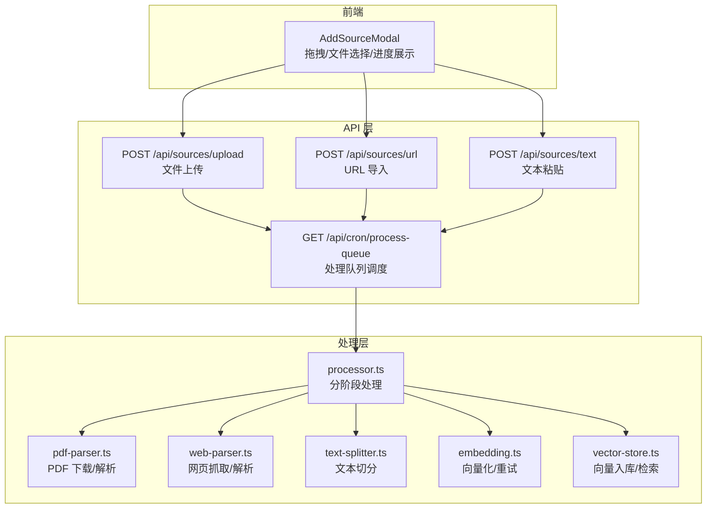
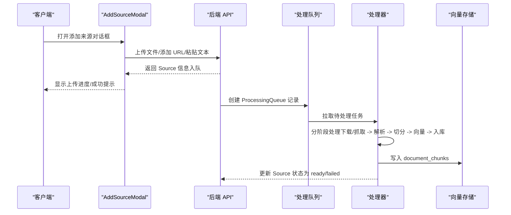
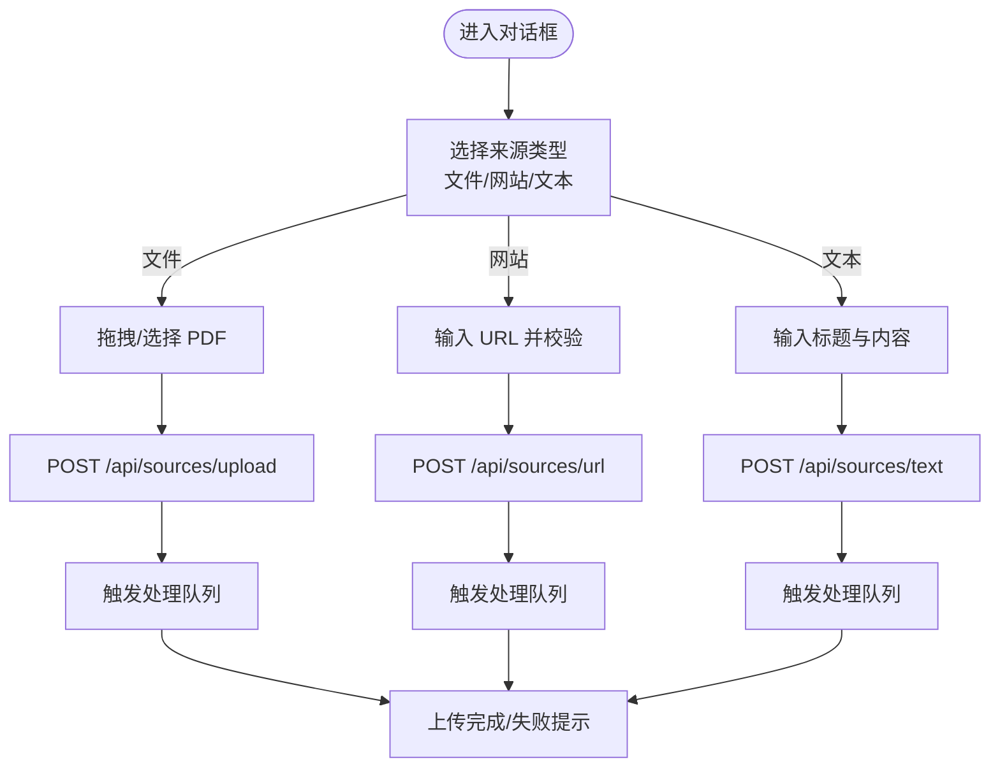
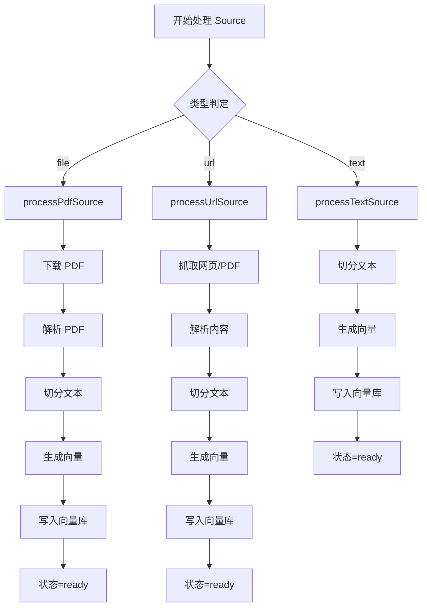
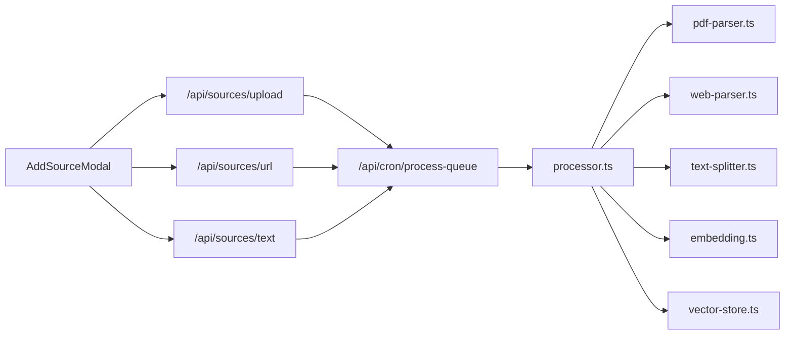

# 上传与处理流程

<cite>
**本文引用的文件**
- [components/notebook/source-uploader.tsx](file://components/notebook/source-uploader.tsx)
- [app/api/sources/upload/route.ts](file://app/api/sources/upload/route.ts)
- [app/api/sources/url/route.ts](file://app/api/sources/url/route.ts)
- [app/api/sources/text/route.ts](file://app/api/sources/text/route.ts)
- [app/api/cron/process-queue/route.ts](file://app/api/cron/process-queue/route.ts)
- [lib/processing/processor.ts](file://lib/processing/processor.ts)
- [lib/processing/pdf-parser.ts](file://lib/processing/pdf-parser.ts)
- [lib/processing/web-parser.ts](file://lib/processing/web-parser.ts)
- [lib/processing/text-splitter.ts](file://lib/processing/text-splitter.ts)
- [lib/processing/embedding.ts](file://lib/processing/embedding.ts)
- [lib/db/vector-store.ts](file://lib/db/vector-store.ts)
- [lib/config.ts](file://lib/config.ts)
- [types/index.ts](file://types/index.ts)
</cite>

## 目录
1. [简介](#简介)
2. [项目结构](#项目结构)
3. [核心组件](#核心组件)
4. [架构总览](#架构总览)
5. [详细组件分析](#详细组件分析)
6. [依赖关系分析](#依赖关系分析)
7. [性能考量](#性能考量)
8. [故障排查指南](#故障排查指南)
9. [结论](#结论)
10. [附录](#附录)

## 简介
本文件面向“上传与处理流程”的技术文档，覆盖以下目标：
- 文件上传组件的实现机制：拖拽上传、文件选择、进度跟踪
- 多种上传方式的处理逻辑：文件上传、文本粘贴、URL 导入
- 上传过程中的验证规则、安全检查与错误处理
- 上传进度的实时反馈、中断恢复与重试策略
- 完整的 API 接口文档：请求参数、响应格式、错误码
- 性能优化建议与最佳实践

## 项目结构
上传与处理流程由三层组成：
- 前端组件层：负责用户交互、拖拽与文件选择、进度展示
- API 层：负责鉴权、输入校验、资源落地与入队
- 处理层：负责异步队列、分阶段处理、向量化与入库

图表来源
- [components/notebook/source-uploader.tsx](file://components/notebook/source-uploader.tsx#L58-L551)
- [app/api/sources/upload/route.ts](file://app/api/sources/upload/route.ts#L14-L110)
- [app/api/sources/url/route.ts](file://app/api/sources/url/route.ts#L68-L166)
- [app/api/sources/text/route.ts](file://app/api/sources/text/route.ts#L19-L121)
- [app/api/cron/process-queue/route.ts](file://app/api/cron/process-queue/route.ts#L11-L164)
- [lib/processing/processor.ts](file://lib/processing/processor.ts#L82-L526)
- [lib/processing/pdf-parser.ts](file://lib/processing/pdf-parser.ts#L41-L149)
- [lib/processing/web-parser.ts](file://lib/processing/web-parser.ts#L82-L227)
- [lib/processing/text-splitter.ts](file://lib/processing/text-splitter.ts#L97-L269)
- [lib/processing/embedding.ts](file://lib/processing/embedding.ts#L140-L188)
- [lib/db/vector-store.ts](file://lib/db/vector-store.ts#L77-L445)

章节来源
- [components/notebook/source-uploader.tsx](file://components/notebook/source-uploader.tsx#L58-L551)
- [app/api/sources/upload/route.ts](file://app/api/sources/upload/route.ts#L14-L110)
- [app/api/sources/url/route.ts](file://app/api/sources/url/route.ts#L68-L166)
- [app/api/sources/text/route.ts](file://app/api/sources/text/route.ts#L19-L121)
- [app/api/cron/process-queue/route.ts](file://app/api/cron/process-queue/route.ts#L11-L164)
- [lib/processing/processor.ts](file://lib/processing/processor.ts#L82-L526)

## 核心组件
- 前端上传组件：支持拖拽上传、文件选择、URL 输入、文本粘贴；实时展示上传进度与状态
- 三类后端 API：
  - 文件上传：校验用户、文件类型与大小，上传至对象存储，写入 Source 并入队
  - URL 导入：校验 URL，检测类型（网页/PDF/视频），抓取网页或按 PDF 流程处理，写入 Source 并入队
  - 文本粘贴：校验标题与内容长度，去重（基于内容哈希），写入 Source 并入队
- 处理队列：按优先级与创建时间拉取待处理任务，逐阶段执行，失败重试，最终入库

章节来源
- [components/notebook/source-uploader.tsx](file://components/notebook/source-uploader.tsx#L83-L283)
- [app/api/sources/upload/route.ts](file://app/api/sources/upload/route.ts#L14-L110)
- [app/api/sources/url/route.ts](file://app/api/sources/url/route.ts#L68-L166)
- [app/api/sources/text/route.ts](file://app/api/sources/text/route.ts#L19-L121)
- [app/api/cron/process-queue/route.ts](file://app/api/cron/process-queue/route.ts#L38-L151)
- [lib/processing/processor.ts](file://lib/processing/processor.ts#L82-L526)

## 架构总览
上传与处理的端到端流程如下：

图表来源
- [components/notebook/source-uploader.tsx](file://components/notebook/source-uploader.tsx#L94-L135)
- [app/api/sources/upload/route.ts](file://app/api/sources/upload/route.ts#L96-L105)
- [app/api/sources/url/route.ts](file://app/api/sources/url/route.ts#L147-L156)
- [app/api/sources/text/route.ts](file://app/api/sources/text/route.ts#L96-L103)
- [app/api/cron/process-queue/route.ts](file://app/api/cron/process-queue/route.ts#L38-L107)
- [lib/processing/processor.ts](file://lib/processing/processor.ts#L82-L526)
- [lib/db/vector-store.ts](file://lib/db/vector-store.ts#L77-L173)

## 详细组件分析

### 前端上传组件（AddSourceModal）
- 功能要点
  - 拖拽上传：通过第三方组件实现拖拽区域，支持 .pdf 文件
  - 文件选择：点击按钮触发系统文件选择器
  - URL 输入：校验 http/https，支持添加网页链接
  - 文本粘贴：校验标题与内容长度，支持字符计数
  - 进度跟踪：本地维护 uploadingFiles 列表，实时展示百分比与状态
- 关键流程
  - 文件上传：构造 FormData，调用 /api/sources/upload，更新本地状态，完成后触发处理队列
  - URL 添加：调用 /api/sources/url，成功后触发处理队列
  - 文本添加：调用 /api/sources/text，成功后触发处理队列
- 错误处理：统一使用 toast 提示，失败时在本地标记 error

图表来源
- [components/notebook/source-uploader.tsx](file://components/notebook/source-uploader.tsx#L83-L283)

章节来源
- [components/notebook/source-uploader.tsx](file://components/notebook/source-uploader.tsx#L58-L551)

### 文件上传 API（POST /api/sources/upload）
- 鉴权与权限
  - 通过 Supabase 获取当前用户，校验 notebookId 所属关系
- 输入校验
  - 必填字段：file、notebookId
  - 文件类型：仅允许 application/pdf
  - 文件大小：≤ 50MB
- 存储与入库
  - 上传到 Supabase Storage，路径包含用户 ID、Notebook ID、Source ID 与时间戳
  - 创建 Source 记录，状态为 pending
  - 创建 ProcessingQueue 记录，状态为 pending
- 响应
  - 201 Created 返回 Source 详情
  - 400/401/403/404/500 对应错误

章节来源
- [app/api/sources/upload/route.ts](file://app/api/sources/upload/route.ts#L14-L110)

### URL 导入 API（POST /api/sources/url）
- 鉴权与权限
  - 通过 Supabase 获取当前用户，校验 notebookId 所属关系
- 输入校验
  - notebookId：UUID 格式
  - url：http/https，且以 http:// 或 https:// 开头
  - 去重：同一 notebook 下不允许重复 URL
- URL 类型检测
  - YouTube 链接：标记为 ready（不抓取，仅保存链接）
  - PDF 链接：按 PDF 流程处理
  - 普通网页：抓取正文并解析
- 页面标题获取
  - 通过 fetch 抓取 HTML，解析 <title>，超时 10 秒
- 入队
  - 非视频链接创建 ProcessingQueue 记录
- 响应
  - 201 Created 返回 Source 详情（可能包含 warning）
  - 400/401/403/404/500 对应错误

章节来源
- [app/api/sources/url/route.ts](file://app/api/sources/url/route.ts#L68-L166)

### 文本粘贴 API（POST /api/sources/text）
- 鉴权与权限
  - 通过 Supabase 获取当前用户，校验 notebookId 所属关系
- 输入校验
  - title：1~200 字符
  - content：≥10 且 ≤50000 字符
- 去重
  - 基于内容哈希（SHA-256）在当前 notebook 内查找是否存在相同内容
- 入队
  - 创建 ProcessingQueue 记录
- 响应
  - 201 Created 返回 Source 详情
  - 400/401/403/404/500 对应错误

章节来源
- [app/api/sources/text/route.ts](file://app/api/sources/text/route.ts#L19-L121)

### 处理队列调度（GET /api/cron/process-queue）
- 认证
  - 支持 Bearer Token 或 manual=true（前端触发）
- 任务拉取
  - 优先级降序、创建时间升序，最多取 2 个
  - attempts < 3 的 pending 任务
- 处理流程
  - 更新 ProcessingQueue 为 processing，同时更新 Source 状态
  - 调用 processSource(sourceId)，按类型执行对应处理
  - 成功：更新为 completed；失败：增加 attempts，达到 3 次则标记 Source 为 failed
- 自我修复
  - 若队列为空，扫描状态为 pending 的 Source，若不在队列中则加入并立即处理

章节来源
- [app/api/cron/process-queue/route.ts](file://app/api/cron/process-queue/route.ts#L11-L164)

### 处理器（lib/processing/processor.ts）
- 处理阶段
  - PDF：pending → downloading → parsing → chunking → embedding → ready
  - URL：pending → fetching → parsing → chunking → embedding → ready
  - 文本：pending → chunking → embedding → ready
- 阶段日志
  - 记录各阶段状态、时间戳、耗时、统计指标（页数、字数、chunks、tokens）
- 失败处理
  - 更新 Source 状态为 failed，并记录错误日志
- 向量入库
  - 使用向量存储接口写入 document_chunks，支持去重与批量插入

图表来源
- [lib/processing/processor.ts](file://lib/processing/processor.ts#L82-L526)

章节来源
- [lib/processing/processor.ts](file://lib/processing/processor.ts#L82-L526)

### PDF 解析与抓取（lib/processing/pdf-parser.ts、web-parser.ts）
- PDF
  - 从 Supabase Storage 下载文件
  - 使用 pdf-parse 解析文本、页数、字数
  - 检测扫描件（平均每页字符数过少）
- 网页
  - 抓取网页内容，支持超时控制
  - 使用 @mozilla/readability 提取正文
  - 检测 PDF 链接（Content-Type 或 URL 后缀）

章节来源
- [lib/processing/pdf-parser.ts](file://lib/processing/pdf-parser.ts#L41-L149)
- [lib/processing/web-parser.ts](file://lib/processing/web-parser.ts#L82-L227)

### 文本切分（lib/processing/text-splitter.ts）
- 递归字符切分器
  - 优先级分隔符：Markdown 标题、段落、换行、中文标点、英文标点、空格
  - 目标 chunk 大小：约 800 tokens，重叠约 100 tokens
  - 估算 token 数量：中文 1.5 字符/token，其他 4 字符/token
  - 生成 contentHash 用于去重

章节来源
- [lib/processing/text-splitter.ts](file://lib/processing/text-splitter.ts#L97-L269)

### 向量化与重试（lib/processing/embedding.ts）
- 批量向量化
  - 最大批量 64，单条最多 3072 tokens
  - 指数退避重试：最多 3 次，初始延迟 1s，上限 30s
  - 支持的状态码重试：429、500、502、503、504
- 维度校验
  - 严格校验向量维度与配置一致（1024）

章节来源
- [lib/processing/embedding.ts](file://lib/processing/embedding.ts#L140-L188)
- [lib/config.ts](file://lib/config.ts#L6-L29)

### 向量存储（lib/db/vector-store.ts）
- 批量插入
  - 每批最多 500 条，使用原生 SQL 插入，ON CONFLICT (source_id, chunk_index) DO NOTHING
- 相似度检索
  - 使用 Postgres 向量扩展，计算余弦相似度
- 混合检索
  - 向量分数与全文检索（FTS）加权融合
- 去重
  - 基于 content_hash 查询已存在记录

章节来源
- [lib/db/vector-store.ts](file://lib/db/vector-store.ts#L77-L445)

## 依赖关系分析

图表来源
- [components/notebook/source-uploader.tsx](file://components/notebook/source-uploader.tsx#L94-L135)
- [app/api/sources/upload/route.ts](file://app/api/sources/upload/route.ts#L96-L105)
- [app/api/sources/url/route.ts](file://app/api/sources/url/route.ts#L147-L156)
- [app/api/sources/text/route.ts](file://app/api/sources/text/route.ts#L96-L103)
- [app/api/cron/process-queue/route.ts](file://app/api/cron/process-queue/route.ts#L73-L107)
- [lib/processing/processor.ts](file://lib/processing/processor.ts#L82-L526)
- [lib/processing/pdf-parser.ts](file://lib/processing/pdf-parser.ts#L41-L149)
- [lib/processing/web-parser.ts](file://lib/processing/web-parser.ts#L82-L227)
- [lib/processing/text-splitter.ts](file://lib/processing/text-splitter.ts#L97-L269)
- [lib/processing/embedding.ts](file://lib/processing/embedding.ts#L140-L188)
- [lib/db/vector-store.ts](file://lib/db/vector-store.ts#L77-L173)

章节来源
- [types/index.ts](file://types/index.ts#L10-L16)

## 性能考量
- 并行化
  - 前端：请求体解析与用户获取并行
  - 后端：鉴权、请求体解析、数据库查询并行
- 批量与分片
  - 向量入库：每批最多 500 条，减少事务开销
  - 向量化：每批最多 64 条，单条最多 3072 tokens
- 超时与重试
  - 网页抓取与 PDF 解析设置超时，避免长时间阻塞
  - 向量 API 指数退避重试，提升稳定性
- 去重优化
  - 基于 content_hash 与 content_tsv 去重，减少重复处理与存储
- 维度一致性
  - 启动时强制校验 EMBEDDING_DIM，避免运行期错误

[本节为通用性能建议，无需具体文件引用]

## 故障排查指南
- 常见错误与定位
  - 401 未登录：确认前端已登录，后端鉴权通过
  - 403 无权限：确认 notebookId 归属当前用户
  - 400 输入校验失败：检查文件类型/大小、URL 格式、标题/内容长度
  - 500 服务器错误：查看后端日志，关注存储上传、解析、向量化阶段
- 处理队列异常
  - 任务长时间 pending：检查 attempts 是否已达 3，查看失败原因
  - 队列为空但 Source 仍为 pending：触发 /api/cron/process-queue?manual=true 进行自我修复
- 向量维度不匹配
  - 确认 EMBEDDING_DIM=1024，与 embedding-3 模型一致
- 网页抓取失败
  - 检查网络可达性、User-Agent、Content-Type 与超时设置
- PDF 解析失败
  - 检查是否加密/损坏，或为扫描件（无文本）

章节来源
- [app/api/sources/upload/route.ts](file://app/api/sources/upload/route.ts#L19-L57)
- [app/api/sources/url/route.ts](file://app/api/sources/url/route.ts#L82-L120)
- [app/api/sources/text/route.ts](file://app/api/sources/text/route.ts#L32-L74)
- [app/api/cron/process-queue/route.ts](file://app/api/cron/process-queue/route.ts#L83-L106)
- [lib/config.ts](file://lib/config.ts#L17-L29)
- [lib/processing/web-parser.ts](file://lib/processing/web-parser.ts#L82-L126)
- [lib/processing/pdf-parser.ts](file://lib/processing/pdf-parser.ts#L57-L116)

## 结论
本上传与处理流程通过“前端交互 + API 校验 + 异步队列 + 分阶段处理 + 向量入库”的架构，实现了稳定、可扩展的知识源接入能力。前端提供直观的拖拽与进度反馈，后端严格进行鉴权与输入校验，处理层具备完善的日志、去重与重试机制，确保在复杂场景下仍能高效、可靠地完成知识构建。

[本节为总结性内容，无需具体文件引用]

## 附录

### API 接口一览

- 文件上传（POST /api/sources/upload）
  - 请求头：multipart/form-data
  - 请求体字段
    - file: 二进制 PDF 文件
    - notebookId: 字符串，Notebook ID
  - 成功响应：201 Created，返回 Source 详情
  - 失败响应：400/401/403/404/500

- URL 导入（POST /api/sources/url）
  - 请求头：application/json
  - 请求体字段
    - notebookId: UUID
    - url: http/https 链接
  - 成功响应：201 Created，返回 Source 详情（可能包含 warning）
  - 失败响应：400/401/403/404/500

- 文本粘贴（POST /api/sources/text）
  - 请求头：application/json
  - 请求体字段
    - notebookId: UUID
    - title: 1~200 字符
    - content: ≥10 且 ≤50000 字符
  - 成功响应：201 Created，返回 Source 详情
  - 失败响应：400/401/403/404/500

- 处理队列（GET /api/cron/process-queue）
  - 查询参数
    - manual: true/false（前端触发）
  - 认证
    - Bearer Token 或 manual=true
  - 成功响应：返回处理结果数组
  - 失败响应：401/500

章节来源
- [app/api/sources/upload/route.ts](file://app/api/sources/upload/route.ts#L14-L110)
- [app/api/sources/url/route.ts](file://app/api/sources/url/route.ts#L68-L166)
- [app/api/sources/text/route.ts](file://app/api/sources/text/route.ts#L19-L121)
- [app/api/cron/process-queue/route.ts](file://app/api/cron/process-queue/route.ts#L11-L164)